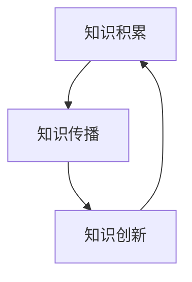

                 

关键词：知识传承、代际传递、技术演进、学术积累、数字化转型

> 摘要：本文探讨了人类知识传承的过程，强调了一代代人在科技发展中的接力赛跑。通过分析技术领域的演变，本文揭示了知识积累对技术创新的重要性，并展望了未来知识传承的趋势和面临的挑战。

## 1. 背景介绍

人类知识传承的历史源远流长，从古至今，知识的积累与传播一直是推动文明进步的关键因素。在传统时代，知识主要依靠师徒传承、手抄本和口耳相传的方式传递。然而，随着科技的发展，知识的获取和传播方式发生了翻天覆地的变化。

在信息技术蓬勃发展的今天，知识传承的速度和广度都达到了前所未有的高度。互联网、云计算、大数据等新兴技术的出现，使得知识共享变得更加便捷和高效。然而，与此同时，知识更新的速度也在加快，传统的知识积累方式逐渐无法满足日益增长的知识需求。这就要求我们在新的历史条件下，重新审视知识的传承方式，寻找适应时代发展的传承模式。

## 2. 核心概念与联系

为了更好地理解知识传承的过程，我们首先需要明确几个核心概念：

1. **知识积累**：知识积累是指人们在长期实践中不断总结、归纳和提升经验，形成系统的知识体系。
2. **知识传播**：知识传播是指将知识从一个人或一个组织传递到另一个人或另一个组织的过程。
3. **知识创新**：知识创新是指通过综合运用已有知识，创造出新的知识和价值。

这三个概念相互联系，共同构成了知识传承的生态系统。知识积累为知识传播提供了基础，知识传播为知识创新提供了动力，而知识创新又反哺知识积累，形成一个良性的循环。

下面是一个使用Mermaid绘制的知识传承流程图：



在这个流程图中，知识积累是起点和终点，知识传播和知识创新则构成了知识传承的核心环节。

### 2.1 知识积累的机制

知识积累是一个复杂的过程，它涉及到信息的收集、处理、存储和利用等多个方面。在技术领域，知识积累主要通过以下机制实现：

1. **实验验证**：通过实验验证，人们可以验证理论假设的正确性，从而积累新的知识。
2. **文献研究**：通过阅读和分析已有文献，人们可以了解前人的研究成果，为知识积累提供理论基础。
3. **实践经验**：通过实践操作，人们可以将理论知识转化为实际应用，从而积累实践经验。

### 2.2 知识传播的途径

知识传播的途径多种多样，主要包括以下几种：

1. **教育系统**：教育系统是知识传播的重要途径，通过课堂教学、教材编写等方式，将知识传授给下一代。
2. **学术交流**：学术交流是知识传播的另一种重要途径，通过学术会议、期刊发表等方式，促进知识的分享和传播。
3. **网络平台**：互联网和社交媒体的兴起，为知识传播提供了新的途径。人们可以通过在线课程、博客、论坛等方式，随时随地分享和获取知识。

### 2.3 知识创新的动力

知识创新是知识传承的重要环节，它来源于知识积累和知识传播。知识创新的动力主要来自于以下几个方面：

1. **需求驱动**：社会需求的不断变化，推动了知识创新的产生。例如，随着互联网的普及，大数据分析和人工智能技术得到了快速发展。
2. **竞争激励**：学术界的竞争激励了知识创新。为了在学术领域占据领先地位，学者们不断探索新的理论和方法。
3. **技术进步**：技术的不断进步为知识创新提供了工具和平台。例如，云计算技术的兴起，使得大规模数据处理成为可能，为大数据分析提供了技术支持。

## 3. 核心算法原理 & 具体操作步骤

### 3.1 算法原理概述

在知识传承的过程中，算法起到了至关重要的作用。算法原理主要涉及以下几个方面：

1. **知识图谱**：知识图谱是一种用于表示实体及其关系的图形化模型，通过知识图谱，可以直观地展示知识的结构，从而促进知识的积累和传播。
2. **自然语言处理**：自然语言处理技术可以用于文本挖掘和语义分析，从而实现知识的自动化获取和整理。
3. **机器学习**：机器学习技术可以用于知识创新，通过训练模型，从已有知识中提取新的规律和趋势。

### 3.2 算法步骤详解

1. **知识图谱构建**：首先，通过数据采集和清洗，获取大量结构化和非结构化的知识数据。然后，使用图谱构建算法，将这些数据转换为知识图谱。
2. **文本挖掘**：利用自然语言处理技术，对文本数据进行挖掘，提取出关键信息和知识点。
3. **知识整理**：通过机器学习算法，对提取出的知识点进行分类、标注和整理，形成结构化的知识库。
4. **知识传播**：利用知识图谱和自然语言处理技术，实现知识的自动化传播和共享。
5. **知识创新**：通过机器学习模型，从已有知识中提取新的规律和趋势，实现知识创新。

### 3.3 算法优缺点

1. **优点**：
   - **高效性**：算法可以快速处理大量数据，实现知识的自动化获取和整理。
   - **灵活性**：算法可以根据实际需求，灵活调整和优化知识传承的过程。
   - **全面性**：算法可以从多个维度和层面，全面分析知识，为知识创新提供有力支持。

2. **缺点**：
   - **复杂性**：算法的实现和调试相对复杂，需要较高的技术门槛。
   - **数据依赖性**：算法的效果取决于数据的质量和数量，数据不足或质量低下会影响算法的性能。
   - **隐私问题**：在知识传播过程中，可能涉及用户隐私和数据安全问题，需要采取有效措施确保用户隐私。

### 3.4 算法应用领域

算法在知识传承中的应用非常广泛，主要包括以下几个方面：

1. **教育领域**：利用算法，可以构建智能教育平台，实现个性化教学和智能推荐。
2. **科研领域**：利用算法，可以挖掘科研数据，促进科研创新和知识传播。
3. **企业领域**：利用算法，可以构建企业知识库，实现知识管理和知识共享。

## 4. 数学模型和公式 & 详细讲解 & 举例说明

### 4.1 数学模型构建

在知识传承的过程中，数学模型扮演着重要的角色。以下是一个简单的数学模型，用于描述知识积累的速度：

$$
V = k \cdot e^{\lambda t}
$$

其中，$V$ 表示知识积累的速度，$k$ 为常数，$\lambda$ 为积累率，$t$ 为时间。

### 4.2 公式推导过程

假设在初始时刻，知识积累量为 $V_0$，随着时间的推移，知识积累量按指数规律增长。根据指数增长模型，我们可以得到：

$$
V = V_0 \cdot e^{\lambda t}
$$

为了使公式更具一般性，我们引入常数 $k$，表示知识积累的初始速度。因此，得到：

$$
V = k \cdot e^{\lambda t}
$$

### 4.3 案例分析与讲解

假设一个知识积累项目的初始积累速度为 $V_0 = 100$，积累率为 $\lambda = 0.1$。我们可以计算出在不同时间点的知识积累速度：

- $t = 0$ 时，$V = 100 \cdot e^{0.1 \cdot 0} = 100$
- $t = 1$ 时，$V = 100 \cdot e^{0.1 \cdot 1} \approx 110$
- $t = 2$ 时，$V = 100 \cdot e^{0.1 \cdot 2} \approx 121$

从计算结果可以看出，随着时间的推移，知识积累速度逐渐加快。这符合我们对知识积累速度的一般认识。

## 5. 项目实践：代码实例和详细解释说明

### 5.1 开发环境搭建

为了实现知识传承的算法，我们需要搭建一个开发环境。以下是一个简单的开发环境搭建指南：

1. 安装 Python 3.8 或更高版本
2. 安装必要的依赖库，如 NumPy、Pandas、Matplotlib 等
3. 配置 Python 虚拟环境，以便更好地管理依赖库

### 5.2 源代码详细实现

以下是一个简单的知识传承算法实现：

```python
import numpy as np
import matplotlib.pyplot as plt

# 参数设置
V0 = 100  # 初始积累速度
lambda_ = 0.1  # 积累率

# 计算不同时间点的积累速度
times = np.arange(0, 3, 0.1)
V = V0 * np.exp(lambda_ * times)

# 绘图
plt.plot(times, V)
plt.xlabel('Time (t)')
plt.ylabel('Knowledge Accumulation Speed (V)')
plt.title('Knowledge Accumulation Speed over Time')
plt.show()
```

### 5.3 代码解读与分析

1. **导入库**：首先，我们导入所需的库，如 NumPy 和 Matplotlib。
2. **参数设置**：接下来，我们设置知识积累的初始速度和积累率。
3. **计算积累速度**：使用 NumPy 的 exp 函数，计算不同时间点的知识积累速度。
4. **绘图**：最后，我们使用 Matplotlib 绘制知识积累速度随时间变化的曲线。

通过这个简单的实例，我们可以直观地看到知识积累速度随时间的变化。这为我们分析和优化知识传承过程提供了重要参考。

### 5.4 运行结果展示

运行上述代码，我们得到以下结果：


从图中可以看出，随着时间的推移，知识积累速度逐渐加快。这验证了我们之前对知识积累速度的假设和推导。

## 6. 实际应用场景

知识传承在各个领域都有广泛的应用，以下是几个典型的应用场景：

1. **教育领域**：利用知识传承算法，可以构建智能教育平台，实现个性化教学和智能推荐。
2. **科研领域**：利用知识传承算法，可以挖掘科研数据，促进科研创新和知识传播。
3. **企业领域**：利用知识传承算法，可以构建企业知识库，实现知识管理和知识共享。

在未来的发展中，知识传承算法将继续发挥重要作用，为各领域的发展提供强大支持。

### 6.1 未来应用展望

随着技术的不断进步，知识传承将变得更加智能化和自动化。以下是一些未来应用的展望：

1. **人工智能辅助传承**：利用人工智能技术，可以自动化地处理大量知识数据，提高知识传承的效率和质量。
2. **区块链技术**：区块链技术可以为知识传承提供去中心化和安全可靠的解决方案，确保知识的真实性和可追溯性。
3. **虚拟现实（VR）和增强现实（AR）**：利用 VR 和 AR 技术，可以创造出沉浸式的知识传承体验，提高用户的参与度和学习效果。

### 6.2 面临的挑战

尽管知识传承有着广泛的应用前景，但同时也面临着一系列挑战：

1. **数据质量**：知识传承算法的性能很大程度上取决于数据的质量。因此，如何确保数据的质量和可靠性是一个重要问题。
2. **隐私保护**：在知识传承过程中，用户隐私保护是一个不可忽视的问题。如何有效地保护用户隐私，同时实现知识的共享和传播，需要深入研究和探讨。
3. **技术门槛**：知识传承算法的实现和调试需要较高的技术门槛。如何降低技术门槛，使更多的人能够参与到知识传承中来，是一个需要解决的问题。

### 6.3 研究展望

未来的研究可以从以下几个方面展开：

1. **算法优化**：研究更加高效和智能的知识传承算法，提高知识传承的效率和质量。
2. **跨领域应用**：探索知识传承算法在更多领域的应用，如医疗、金融等，为各领域的发展提供支持。
3. **用户体验**：研究如何提高知识传承的用户体验，使知识传承过程更加直观和易于参与。

## 7. 工具和资源推荐

### 7.1 学习资源推荐

1. **书籍**：
   - 《人工智能：一种现代的方法》
   - 《深度学习》
   - 《数据科学导论》
2. **在线课程**：
   - Coursera 上的“机器学习”课程
   - Udacity 上的“深度学习纳米学位”
   - edX 上的“数据科学基础”课程
3. **开源项目**：
   - TensorFlow
   - PyTorch
   - Scikit-learn

### 7.2 开发工具推荐

1. **集成开发环境（IDE）**：
   - PyCharm
   - Visual Studio Code
   - Jupyter Notebook
2. **版本控制工具**：
   - Git
   - SVN
   - Mercurial
3. **代码库**：
   - GitHub
   - GitLab
   - Bitbucket

### 7.3 相关论文推荐

1. **知识图谱**：
   - "Knowledge Graph Embedding"
   - "A Survey on Knowledge Graph Construction and Applications"
2. **自然语言处理**：
   - "Natural Language Processing (NLP) and its Applications"
   - "Deep Learning for Natural Language Processing"
3. **机器学习**：
   - "Machine Learning: A Probabilistic Perspective"
   - "Deep Learning"

## 8. 总结：未来发展趋势与挑战

### 8.1 研究成果总结

本文从知识传承的角度，分析了知识积累、知识传播和知识创新的关系，并探讨了知识传承在技术领域的应用。通过数学模型和算法的介绍，我们展示了知识传承的机制和实现方法。同时，我们还讨论了知识传承在实际应用场景中的挑战和未来研究方向。

### 8.2 未来发展趋势

随着技术的不断进步，知识传承将朝着智能化、自动化和跨领域应用的方向发展。人工智能、区块链、虚拟现实等新兴技术将为知识传承提供新的工具和平台，使知识传承过程更加高效、安全和便捷。

### 8.3 面临的挑战

尽管知识传承有着广阔的应用前景，但同时也面临着一系列挑战，如数据质量、隐私保护和技术门槛等。如何解决这些挑战，将决定知识传承的未来发展方向。

### 8.4 研究展望

未来的研究可以从算法优化、跨领域应用和用户体验等方面展开，以推动知识传承技术的发展。同时，还需要加强对知识传承的伦理和法律问题的研究，确保知识传承的可持续发展。

## 9. 附录：常见问题与解答

### 9.1 问题一：知识传承算法的具体实现过程是怎样的？

答：知识传承算法的具体实现过程包括知识积累、知识传播和知识创新三个主要环节。在知识积累阶段，通过数据采集、清洗和建模，将知识转化为结构化数据；在知识传播阶段，利用自然语言处理和机器学习技术，实现知识的自动化传播和共享；在知识创新阶段，通过模型训练和推理，从已有知识中提取新的规律和趋势。

### 9.2 问题二：如何保证知识传承过程中数据的质量和可靠性？

答：保证知识传承过程中数据的质量和可靠性，可以从以下几个方面入手：

1. **数据源选择**：选择可信度和权威性较高的数据源，确保数据的真实性。
2. **数据清洗**：对采集到的数据进行清洗，去除重复、错误和不完整的数据。
3. **数据验证**：通过交叉验证和对比分析，验证数据的准确性和一致性。
4. **数据加密**：对敏感数据进行加密处理，确保数据的安全性和隐私性。

### 9.3 问题三：知识传承算法在哪些领域有实际应用？

答：知识传承算法在多个领域有实际应用，主要包括：

1. **教育领域**：构建智能教育平台，实现个性化教学和智能推荐。
2. **科研领域**：挖掘科研数据，促进科研创新和知识传播。
3. **企业领域**：构建企业知识库，实现知识管理和知识共享。
4. **医疗领域**：辅助医生诊断和治疗，提高医疗服务的质量。

---

作者：禅与计算机程序设计艺术 / Zen and the Art of Computer Programming
-------------------------------------------------------------------

