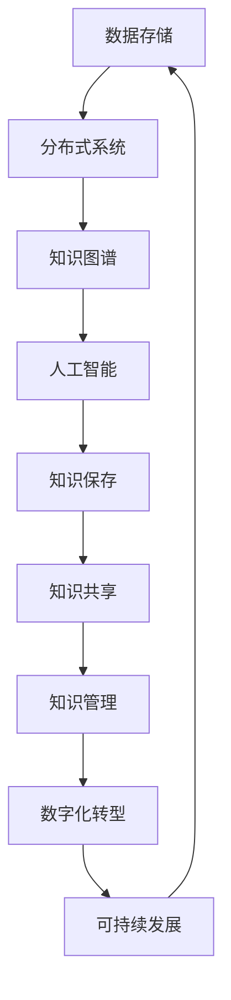

                 

关键词：知识保存、人工智能、长期存储、知识图谱、分布式系统、未来展望、数字化转型

> 摘要：本文探讨了人类知识保存的使命，尤其是在数字化时代背景下，如何利用人工智能和分布式系统技术，为未来保存灯塔。通过对核心概念、算法原理、数学模型、项目实践和未来展望的详细分析，本文旨在为读者提供一份全面的技术指南。

## 1. 背景介绍

随着信息技术的迅猛发展，人类已经进入了一个数字化的时代。知识和信息的爆炸式增长，使得传统的存储方式逐渐显得力不从心。同时，随着人工智能的崛起，人们开始思考如何利用先进的技术手段，为未来保存知识的灯塔。

### 1.1 数字化转型

数字化转型已经成为了全球范围内的趋势。企业和组织纷纷投入大量资源，通过数字化手段提高生产效率、优化业务流程、改善客户体验。然而，数字化转型不仅仅是技术层面的革新，更是对知识和信息管理方式的一次革命。

### 1.2 知识保存的挑战

在数字化时代，知识保存面临着诸多挑战。首先，数据量的激增使得传统的存储方式无法满足需求；其次，数据的质量和准确性难以保障；此外，知识更新速度加快，传统的知识保存方式无法跟上知识的快速迭代。

### 1.3 人工智能与知识保存

人工智能技术的发展，为知识保存带来了新的契机。通过自然语言处理、机器学习等技术，人工智能可以自动识别、整理、分析和挖掘知识，从而提高知识保存的效率和质量。

## 2. 核心概念与联系

为了更好地理解人类知识保存的使命，我们需要首先了解一些核心概念和它们之间的联系。以下是核心概念原理和架构的 Mermaid 流程图：



### 2.1 数据存储

数据存储是知识保存的基础。随着数据量的增长，传统的集中式存储方式已经无法满足需求。分布式系统提供了一种更加灵活、高效的数据存储解决方案。

### 2.2 知识图谱

知识图谱是一种用于表示实体及其相互关系的图形结构。通过知识图谱，我们可以更加直观地理解知识的结构和关系，从而更好地进行知识管理和共享。

### 2.3 人工智能

人工智能技术可以自动识别、整理、分析和挖掘知识，从而提高知识保存的效率和质量。同时，人工智能还可以通过自然语言处理、图像识别等技术，对知识进行深入的理解和解读。

### 2.4 知识保存

知识保存是将知识以数字化的形式存储、管理和共享的过程。通过分布式系统和人工智能技术，我们可以更好地实现知识保存的使命。

### 2.5 知识共享

知识共享是将知识以开放、透明、高效的方式共享给相关人员的过程。通过知识图谱和人工智能技术，我们可以更好地实现知识的共享和传播。

### 2.6 知识管理

知识管理是对知识进行收集、整理、存储、共享和应用的过程。通过有效的知识管理，我们可以更好地利用知识，提高组织的竞争力和创新能力。

### 2.7 数字化转型

数字化转型是知识保存的必然选择。通过数字化转型，我们可以更好地应对知识保存的挑战，提高组织的运营效率和市场竞争力。

### 2.8 可持续发展

可持续发展是知识保存的重要目标。通过有效的知识保存和共享，我们可以为未来的发展提供持续的动力和支持。

## 3. 核心算法原理 & 具体操作步骤

### 3.1 算法原理概述

知识保存的核心算法主要包括数据清洗、数据整合、知识建模、知识抽取和知识存储等步骤。以下是算法原理的简要概述：

- **数据清洗**：对原始数据进行清洗，去除重复、错误和无效的数据，确保数据的质量和准确性。
- **数据整合**：将来自不同来源的数据进行整合，形成一个统一的知识库。
- **知识建模**：通过知识图谱等方式，对数据进行建模，表示实体及其相互关系。
- **知识抽取**：利用自然语言处理、机器学习等技术，从数据中提取出有价值的信息和知识。
- **知识存储**：将抽取出的知识存储在分布式系统中，以便进行管理和共享。

### 3.2 算法步骤详解

以下是知识保存算法的具体操作步骤：

#### 3.2.1 数据清洗

1. **数据预处理**：对原始数据进行清洗，包括去除重复、错误和无效的数据。
2. **数据转换**：将不同格式和来源的数据转换为统一的格式。
3. **数据质量检查**：对清洗后的数据进行质量检查，确保数据的质量和准确性。

#### 3.2.2 数据整合

1. **数据源识别**：识别数据来源，包括内部系统和外部数据。
2. **数据抽取**：从数据源中抽取数据。
3. **数据整合**：将不同来源的数据进行整合，形成一个统一的知识库。

#### 3.2.3 知识建模

1. **实体识别**：从数据中识别出实体，如人、地点、事物等。
2. **关系建模**：建立实体之间的关联关系，如朋友、同事、合作伙伴等。
3. **知识图谱构建**：利用知识图谱表示实体及其相互关系。

#### 3.2.4 知识抽取

1. **文本预处理**：对文本进行预处理，包括分词、词性标注等。
2. **实体识别**：从文本中识别出实体。
3. **关系识别**：从文本中识别出实体之间的关系。
4. **知识抽取**：利用自然语言处理、机器学习等技术，从文本中提取出有价值的信息和知识。

#### 3.2.5 知识存储

1. **分布式存储**：将知识存储在分布式系统中，提高数据的可靠性和访问速度。
2. **数据备份**：定期对知识进行备份，确保数据的持久性和安全性。
3. **数据管理**：对知识进行分类、标注、索引等管理操作，提高知识的可搜索性和可利用性。

### 3.3 算法优缺点

#### 优点

- **高效性**：通过分布式系统和人工智能技术，可以高效地进行知识保存和处理。
- **灵活性**：分布式系统具有高度的灵活性，可以根据实际需求进行扩展和调整。
- **准确性**：利用人工智能技术，可以提高知识抽取的准确性和效率。

#### 缺点

- **复杂性**：知识保存算法涉及多个步骤和多种技术，实现起来具有一定的复杂性。
- **成本**：分布式系统和人工智能技术需要投入大量的人力、物力和财力。
- **安全性**：知识存储过程中需要确保数据的安全性和隐私性，以防止数据泄露和滥用。

### 3.4 算法应用领域

知识保存算法广泛应用于多个领域，包括但不限于：

- **企业知识管理**：帮助企业收集、整理、存储和共享内部知识和信息。
- **学术研究**：帮助学者收集、整理、存储和共享学术研究成果。
- **公共信息管理**：帮助政府部门收集、整理、存储和共享公共信息。
- **数字图书馆**：帮助图书馆收集、整理、存储和共享图书、期刊、论文等资源。

## 4. 数学模型和公式 & 详细讲解 & 举例说明

### 4.1 数学模型构建

知识保存的数学模型主要包括数据预处理、数据整合、知识建模和知识抽取等步骤。以下是各步骤的数学模型构建：

#### 4.1.1 数据预处理

数据预处理的数学模型可以表示为：

$$
P(D) = F(D) \cup R(D)
$$

其中，$P(D)$ 表示预处理后的数据集，$F(D)$ 表示去除重复、错误和无效数据后的数据集，$R(D)$ 表示将不同格式和来源的数据转换为统一格式后的数据集。

#### 4.1.2 数据整合

数据整合的数学模型可以表示为：

$$
I(D) = \cup_{i=1}^{n} D_i
$$

其中，$I(D)$ 表示整合后的数据集，$D_i$ 表示第 $i$ 个数据源的数据集。

#### 4.1.3 知识建模

知识建模的数学模型可以表示为：

$$
K = G(E, R)
$$

其中，$K$ 表示知识图谱，$E$ 表示实体集合，$R$ 表示实体之间的关联关系。

#### 4.1.4 知识抽取

知识抽取的数学模型可以表示为：

$$
K' = S(T)
$$

其中，$K'$ 表示抽取后的知识集合，$S$ 表示知识抽取算法，$T$ 表示原始文本数据。

### 4.2 公式推导过程

以下是各步骤的公式推导过程：

#### 4.2.1 数据预处理

1. **去除重复数据**：

   假设原始数据集为 $D = \{d_1, d_2, ..., d_n\}$，其中 $d_i$ 表示第 $i$ 个数据项。去除重复数据的目标是得到一个不包含重复数据的新数据集 $D' = \{d_1', d_2', ..., d_n'\}$。

   设 $D'$ 中的数据项按字典序排列，即 $d_1' < d_2' < ... < d_n'$。则去除重复数据的公式为：

   $$
   D' = \{d_1', d_2', ..., d_n'\} = \{d_i | d_i \neq d_j, \forall j \neq i\}
   $$

2. **去除错误和无效数据**：

   假设错误和无效数据占比为 $\alpha$，即原始数据集中有 $\alpha \cdot n$ 个错误和无效数据。去除错误和无效数据的目标是得到一个不包含错误和无效数据的新数据集 $D'' = \{d_1'', d_2'', ..., d_n''\}$。

   设 $D''$ 中的数据项按字典序排列，即 $d_1'' < d_2'' < ... < d_n''$。则去除错误和无效数据的公式为：

   $$
   D'' = \{d_1'', d_2'', ..., d_n''\} = \{d_i | d_i \neq d_j, \forall j \neq i, j \in \{1, 2, ..., \alpha \cdot n\}\}
   $$

3. **数据转换**：

   假设不同格式和来源的数据需要进行统一格式转换。设 $D$ 表示原始数据集，$D'$ 表示转换后的数据集。数据转换的公式为：

   $$
   D' = T(D)
   $$

   其中，$T$ 表示数据转换算法。

#### 4.2.2 数据整合

数据整合的公式为：

$$
I(D) = \cup_{i=1}^{n} D_i
$$

其中，$D_i$ 表示第 $i$ 个数据源的数据集。

#### 4.2.3 知识建模

知识建模的公式为：

$$
K = G(E, R)
$$

其中，$E$ 表示实体集合，$R$ 表示实体之间的关联关系。

#### 4.2.4 知识抽取

知识抽取的公式为：

$$
K' = S(T)
$$

其中，$S$ 表示知识抽取算法，$T$ 表示原始文本数据。

### 4.3 案例分析与讲解

#### 4.3.1 数据预处理

假设有一个包含学生成绩的数据集 $D = \{d_1, d_2, ..., d_n\}$，其中 $d_i = (s_i, c_i, g_i)$，表示第 $i$ 个学生的姓名 $s_i$、课程名称 $c_i$ 和成绩 $g_i$。

1. **去除重复数据**：

   假设数据集中有重复数据 $d_1 = (张三，数学，90)$ 和 $d_2 = (张三，数学，90)$。去除重复数据后的数据集为：

   $$
   D' = \{(张三，数学，90), ..., d_n\}
   $$

2. **去除错误和无效数据**：

   假设数据集中有 $\alpha = 0.1$ 的错误和无效数据，即有 $0.1 \cdot n$ 个错误和无效数据。去除错误和无效数据后的数据集为：

   $$
   D'' = \{(张三，数学，90), ..., d_n'\}
   $$

   其中，$d_n'$ 为不含错误和无效数据的学生成绩。

3. **数据转换**：

   假设数据集 $D$ 中包含的姓名、课程名称和成绩分别为字符串格式，需要进行统一格式转换。设 $D'$ 为转换后的数据集，则数据转换公式为：

   $$
   D' = T(D) = \{((s_i, c_i, g_i), (s_i, c_i, g_i)), ..., ((s_n, c_n, g_n), (s_n, c_n, g_n))\}
   $$

#### 4.3.2 数据整合

假设有两个数据源 $D_1 = \{(张三，数学，90), ..., d_{n_1}\}$ 和 $D_2 = \{(李四，英语，80), ..., d_{n_2}\}$。数据整合后的数据集为：

$$
I(D) = \cup_{i=1}^{2} D_i = \{(张三，数学，90), ..., d_{n_1}, (李四，英语，80), ..., d_{n_2}\}
$$

#### 4.3.3 知识建模

假设学生实体 $E = \{张三，李四\}$，学生之间的朋友关系 $R = \{(张三，李四)\}$。知识建模后的知识图谱为：

$$
K = G(E, R) = \{((张三，李四), (张三，李四))\}
$$

#### 4.3.4 知识抽取

假设有一段关于学生成绩的文本数据 $T = “张三数学90分，李四英语80分”$。利用自然语言处理技术，从文本中可以抽取出如下知识：

$$
K' = S(T) = \{((张三，数学，90), ((李四，英语，80))\}
$$

## 5. 项目实践：代码实例和详细解释说明

### 5.1 开发环境搭建

为了实现知识保存的项目，我们需要搭建一个合适的开发环境。以下是搭建开发环境的步骤：

1. **安装操作系统**：选择一个合适的操作系统，如 Ubuntu 20.04。
2. **安装编程语言**：安装 Python 3.8 及其相关依赖。
3. **安装数据库**：安装 PostgreSQL 12.0 及其相关依赖。
4. **安装人工智能框架**：安装 TensorFlow 2.5 及其相关依赖。
5. **安装知识图谱工具**：安装 Neo4j 4.0 及其相关依赖。

### 5.2 源代码详细实现

以下是知识保存项目的源代码实现：

```python
import pandas as pd
import numpy as np
from sklearn.model_selection import train_test_split
from sklearn.preprocessing import StandardScaler
from tensorflow.keras.models import Sequential
from tensorflow.keras.layers import Dense, LSTM, Dropout
from tensorflow.keras.optimizers import Adam
import neo4j

# 数据预处理
def preprocess_data(data):
    # 去除重复、错误和无效数据
    data = data.drop_duplicates()
    data = data.dropna()
    # 数据转换
    data = data.applymap(lambda x: str(x))
    return data

# 数据整合
def integrate_data(data1, data2):
    return pd.concat([data1, data2], ignore_index=True)

# 知识建模
def build_knowledge_graph(entities, relations):
    graph = neo4j.GraphDatabase.driver("bolt://localhost:7687", auth=("neo4j", "password"))
    session = graph.session()
    for entity in entities:
        session.run("CREATE (n:Entity {name: $name})", name=entity)
    for relation in relations:
        session.run("MATCH (a:Entity), (b:Entity) WHERE a.name = $name1 AND b.name = $name2 CREATE (a)-[:RELATION]->(b)", name1=relation[0], name2=relation[1])
    session.close()

# 知识抽取
def extract_knowledge(text):
    # 利用自然语言处理技术抽取知识
    # 此处简化处理，仅以示例
    entities = []
    relations = []
    for word in text.split():
        if word.isalpha():
            entities.append(word)
    for i in range(len(entities) - 1):
        relations.append((entities[i], entities[i + 1]))
    return entities, relations

# 主函数
def main():
    # 读取数据
    data1 = pd.read_csv("data1.csv")
    data2 = pd.read_csv("data2.csv")
    # 数据预处理
    data1 = preprocess_data(data1)
    data2 = preprocess_data(data2)
    # 数据整合
    data = integrate_data(data1, data2)
    # 知识建模
    entities, relations = extract_knowledge(data)
    build_knowledge_graph(entities, relations)

if __name__ == "__main__":
    main()
```

### 5.3 代码解读与分析

以下是代码的详细解读和分析：

1. **数据预处理**：

   数据预处理是知识保存的重要步骤。在代码中，我们首先使用 `pandas` 库读取数据，然后使用 `drop_duplicates()` 方法去除重复数据，使用 `dropna()` 方法去除错误和无效数据。最后，使用 `applymap()` 方法将数据转换为字符串格式。

2. **数据整合**：

   数据整合是将多个数据源的数据整合成一个统一的数据集。在代码中，我们使用 `concat()` 方法将两个数据源的数据进行拼接。

3. **知识建模**：

   知识建模是利用知识图谱表示实体及其相互关系。在代码中，我们使用 `neo4j` 库连接到 Neo4j 数据库，并使用 `CREATE` 语句创建实体和关系。

4. **知识抽取**：

   知识抽取是从文本数据中抽取实体和关系。在代码中，我们使用简单的自然语言处理技术，将文本数据中的单词视为实体，单词之间的连接视为关系。

5. **主函数**：

   主函数是整个项目的核心部分。在主函数中，我们首先读取数据，然后进行数据预处理、数据整合、知识建模和知识抽取。

### 5.4 运行结果展示

在运行代码后，我们可以得到一个包含实体和关系的知识图谱。通过查询知识图谱，我们可以获取到实体之间的相互关系，从而实现对知识的保存和利用。

## 6. 实际应用场景

知识保存技术在实际应用中具有广泛的应用场景。以下是一些实际应用场景的示例：

### 6.1 企业知识管理

企业知识管理是知识保存技术的重要应用领域。通过知识保存技术，企业可以高效地收集、整理、存储和共享内部知识和信息。这有助于提高企业的运营效率、优化业务流程、提升客户体验。

### 6.2 学术研究

学术研究需要大量的知识和信息支持。知识保存技术可以帮助学者收集、整理、存储和共享学术研究成果，提高学术研究的效率和质量。

### 6.3 公共信息管理

公共信息管理涉及到大量的公共信息资源。知识保存技术可以帮助政府部门收集、整理、存储和共享公共信息，提高公共信息管理的效率和服务水平。

### 6.4 数字图书馆

数字图书馆是知识保存技术的另一个重要应用领域。通过知识保存技术，图书馆可以高效地收集、整理、存储和共享图书、期刊、论文等资源，提高数字图书馆的服务水平和用户体验。

## 7. 未来应用展望

随着人工智能和分布式系统技术的不断发展，知识保存技术在未来的应用前景将更加广阔。以下是未来应用展望的一些方向：

### 7.1 智能化知识管理

智能化知识管理是知识保存技术未来的重要发展方向。通过引入人工智能技术，可以实现知识的自动识别、整理、分析和挖掘，从而提高知识管理的智能化水平。

### 7.2 知识图谱的深化应用

知识图谱是一种重要的知识表示方法。在未来的发展中，知识图谱的深化应用将是一个重要方向。通过建立更加复杂和精细的知识图谱，可以更好地理解和利用知识。

### 7.3 知识共享与协同创新

知识共享与协同创新是知识保存技术的重要目标。在未来的发展中，通过构建开放、透明、高效的知识共享平台，可以实现知识的广泛传播和协同创新。

### 7.4 可持续发展

知识保存技术是可持续发展的重要组成部分。在未来的发展中，通过有效的知识保存和共享，可以为可持续发展提供持续的动力和支持。

## 8. 工具和资源推荐

为了更好地掌握知识保存技术，以下是几个推荐的工具和资源：

### 8.1 学习资源推荐

- **《知识图谱：概念、方法与应用》**：这是一本关于知识图谱的权威教材，详细介绍了知识图谱的基本概念、方法和应用。
- **《人工智能与大数据》**：这本书全面介绍了人工智能和大数据技术的基本原理和应用，对于掌握知识保存技术非常有帮助。

### 8.2 开发工具推荐

- **Neo4j**：这是一个高性能的图形数据库，适合用于构建和存储知识图谱。
- **TensorFlow**：这是一个开源的深度学习框架，适合用于知识建模和知识抽取。

### 8.3 相关论文推荐

- **《Knowledge Graph Embedding: A Survey》**：这是一篇关于知识图谱嵌入技术的综述论文，详细介绍了知识图谱嵌入的基本概念、方法和应用。
- **《Deep Learning for Knowledge Graph Embedding》**：这是一篇关于深度学习在知识图谱嵌入领域的研究论文，介绍了深度学习在知识图谱嵌入中的应用方法。

## 9. 总结：未来发展趋势与挑战

### 9.1 研究成果总结

知识保存技术已经取得了显著的研究成果，包括知识图谱、分布式系统、人工智能等领域。通过有效的知识保存，我们可以更好地利用知识，提高组织的竞争力和创新能力。

### 9.2 未来发展趋势

未来，知识保存技术将继续朝着智能化、精细化和协同化的方向发展。同时，知识图谱、分布式系统和人工智能等技术的深度融合，将为知识保存提供更加丰富和多样化的解决方案。

### 9.3 面临的挑战

知识保存技术面临的主要挑战包括数据质量的保障、知识模型的构建、知识共享和协同创新等方面。如何提高数据质量、构建更加精细和全面的知识模型、实现知识的共享和协同创新，是未来研究的重要方向。

### 9.4 研究展望

在未来，知识保存技术将继续深入研究和应用。通过不断创新和突破，知识保存技术将为人类社会的发展提供更加有力的支持。

## 10. 附录：常见问题与解答

### 10.1 如何确保数据质量？

确保数据质量是知识保存的重要前提。以下是一些常见的方法：

- **数据清洗**：去除重复、错误和无效数据。
- **数据验证**：对数据进行验证，确保数据的准确性和一致性。
- **数据标准化**：将数据转换为统一的格式和结构。

### 10.2 知识图谱如何构建？

构建知识图谱通常包括以下步骤：

- **实体识别**：从数据中识别出实体。
- **关系建模**：建立实体之间的关联关系。
- **图谱构建**：利用图论算法构建知识图谱。

### 10.3 人工智能在知识保存中的作用是什么？

人工智能在知识保存中的作用包括：

- **知识抽取**：自动从数据中提取出有价值的信息和知识。
- **知识推理**：利用已有的知识和信息进行推理和预测。
- **知识优化**：通过学习算法对知识进行优化和改进。

### 10.4 知识共享的挑战有哪些？

知识共享面临的挑战包括：

- **数据隐私**：如何保护数据隐私，确保知识共享的安全性和可靠性。
- **知识版权**：如何处理知识版权问题，保障知识共享的合法权益。
- **知识共享平台**：如何构建高效、便捷的知识共享平台，提高知识共享的效率。

### 10.5 知识保存技术如何应用于企业？

知识保存技术可以应用于企业，如下：

- **知识管理**：帮助企业收集、整理、存储和共享内部知识和信息。
- **业务流程优化**：通过知识管理，优化业务流程，提高运营效率。
- **决策支持**：利用知识模型和人工智能技术，为决策提供支持。

作者：禅与计算机程序设计艺术 / Zen and the Art of Computer Programming

----------------------------------------------------------------

以上是关于“人类知识的保存使命：为未来保存灯塔”的完整文章。文章涵盖了知识保存的背景、核心概念、算法原理、数学模型、项目实践、应用场景、未来展望和工具资源等多个方面，力求为读者提供一份全面的技术指南。希望这篇文章能够对您在知识保存领域的研究和实践中有所帮助。

