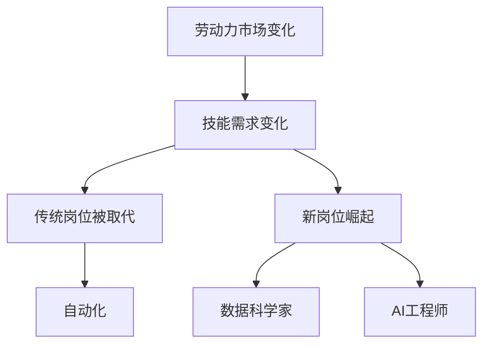

                 

关键词：人工智能，就业前景，技能培训，职业发展，技术变革

摘要：随着人工智能技术的飞速发展，传统行业的自动化和数字化浪潮席卷全球，人类计算的角色与职责正经历深刻变革。本文将探讨AI时代下未来就业前景的演变，分析各个领域对技能的需求变化，并探讨如何通过有效的技能培训适应这一趋势。

## 1. 背景介绍

人工智能（AI）作为计算机科学的一个重要分支，经过几十年的发展，如今已经渗透到我们生活的方方面面。从简单的语音识别到复杂的自动驾驶，AI技术不断刷新着我们的认知边界。然而，随着AI技术的不断成熟，它对劳动力市场的影响也变得愈发显著。许多传统岗位正面临着被自动化替代的威胁，同时，新的岗位和职业机会也在不断涌现。

### 1.1 人工智能的发展历程

人工智能的发展可以分为几个阶段：符号主义、连接主义、基于实例学习和统计学习。符号主义以逻辑推理为基础，早期的专家系统和自然语言处理都是基于这种思路。连接主义则基于神经网络，通过大规模的数据训练，实现了语音识别、图像识别等领域的突破。基于实例学习和统计学习则依赖于大数据和机器学习，使得AI在预测和决策方面的能力大幅提升。

### 1.2 人工智能在现代社会中的应用

AI技术在医疗、金融、教育、制造业等领域都有广泛应用。例如，在医疗领域，AI可以辅助医生进行诊断和治疗；在金融领域，AI可以用于风险管理、信用评估；在教育领域，AI可以提供个性化的学习方案；在制造业，AI可以优化生产流程，提高生产效率。

## 2. 核心概念与联系

在深入探讨AI对就业前景的影响之前，我们需要明确几个核心概念，并理解它们之间的联系。

### 2.1 人工智能的核心概念

- **机器学习（Machine Learning）**：机器学习是AI的核心技术之一，通过训练模型，使机器能够从数据中学习并做出决策。
- **深度学习（Deep Learning）**：深度学习是机器学习的一个分支，通过多层神经网络模拟人脑的工作方式，对复杂数据进行学习。
- **自然语言处理（Natural Language Processing，NLP）**：NLP是使计算机能够理解和处理人类语言的技术。

### 2.2 人工智能与就业的联系

- **劳动力市场的变化**：随着AI技术的发展，许多传统岗位正逐渐被自动化取代，同时，新的岗位如数据科学家、AI工程师等也在迅速崛起。
- **技能需求的变化**：AI时代对技能的需求不再仅限于编程，而是更加多元，包括数据分析、机器学习、自然语言处理等。

### 2.3 Mermaid 流程图



## 3. 核心算法原理 & 具体操作步骤

### 3.1 算法原理概述

在AI时代，核心算法的作用不可忽视。以下将介绍几种常见的核心算法及其原理。

#### 3.1.1 机器学习算法

- **监督学习（Supervised Learning）**：通过训练数据集，使模型能够预测新的数据。
- **无监督学习（Unsupervised Learning）**：没有预先标记的数据，模型需要通过分析数据寻找结构或模式。

#### 3.1.2 深度学习算法

- **卷积神经网络（CNN）**：适用于图像处理。
- **循环神经网络（RNN）**：适用于序列数据。

#### 3.1.3 自然语言处理算法

- **词向量（Word Embedding）**：将词汇映射到向量空间。
- **序列到序列模型（Seq2Seq）**：用于机器翻译等任务。

### 3.2 算法步骤详解

#### 3.2.1 机器学习算法步骤

1. **数据收集**：收集用于训练的数据。
2. **数据预处理**：清洗、归一化数据。
3. **模型选择**：根据任务选择合适的模型。
4. **模型训练**：使用训练数据训练模型。
5. **模型评估**：使用测试数据评估模型性能。
6. **模型优化**：调整模型参数，提高性能。

#### 3.2.2 深度学习算法步骤

1. **网络架构设计**：设计神经网络的层数和神经元数量。
2. **数据预处理**：与机器学习相同。
3. **前向传播（Forward Propagation）**：计算输入通过网络的输出。
4. **反向传播（Back Propagation）**：更新网络权重和偏置。
5. **模型评估**：与机器学习相同。
6. **模型优化**：调整网络参数。

#### 3.2.3 自然语言处理算法步骤

1. **文本预处理**：分词、去停用词等。
2. **词向量表示**：将词汇转换为向量。
3. **模型训练**：使用预处理后的数据训练模型。
4. **模型评估**：使用测试集评估模型。
5. **模型应用**：将模型用于实际任务，如文本分类、机器翻译等。

### 3.3 算法优缺点

- **机器学习算法**：优点是通用性强，能够处理多种类型的数据；缺点是需要大量标注数据，训练时间较长。
- **深度学习算法**：优点是能够自动提取特征，处理复杂数据；缺点是模型复杂度高，训练资源需求大。
- **自然语言处理算法**：优点是能够处理自然语言文本，应用广泛；缺点是需要大量语言资源，处理速度较慢。

### 3.4 算法应用领域

- **机器学习算法**：广泛应用于金融、医疗、零售等领域。
- **深度学习算法**：广泛应用于图像识别、语音识别、自然语言处理等领域。
- **自然语言处理算法**：广泛应用于文本分析、机器翻译、智能客服等领域。

## 4. 数学模型和公式 & 详细讲解 & 举例说明

在AI领域，数学模型和公式是理解和应用算法的基础。以下将介绍几种常见的数学模型和公式，并详细讲解其推导过程和实际应用。

### 4.1 数学模型构建

#### 4.1.1 机器学习模型

- **线性回归（Linear Regression）**：模型公式为 \( y = wx + b \)。

#### 4.1.2 深度学习模型

- **卷积神经网络（CNN）**：卷积层公式为 \( h = f(W \odot h_{\text{prev}} + b) \)，其中 \( f \) 是激活函数， \( \odot \) 表示元素乘积。

#### 4.1.3 自然语言处理模型

- **序列到序列模型（Seq2Seq）**：损失函数为 \( L = -\sum_{i=1}^{n} y_i \log(p(y_i | x_i)) \)。

### 4.2 公式推导过程

#### 4.2.1 线性回归公式推导

线性回归模型的推导过程基于最小二乘法。设样本数据为 \( (x_1, y_1), (x_2, y_2), ..., (x_n, y_n) \)，则损失函数为：

$$
L(w, b) = \sum_{i=1}^{n} (wx_i + b - y_i)^2
$$

为了最小化损失函数，对 \( w \) 和 \( b \) 分别求偏导并令其等于0，得到：

$$
\frac{\partial L}{\partial w} = 2x^T(y - wx - b) = 0 \\
\frac{\partial L}{\partial b} = 2(y - wx - b) = 0
$$

解得：

$$
w = \frac{1}{n}x^T y \\
b = \frac{1}{n}\sum_{i=1}^{n} y_i - wx
$$

#### 4.2.2 卷积神经网络（CNN）公式推导

卷积层的前向传播公式为：

$$
h = f(W \odot h_{\text{prev}} + b)
$$

其中， \( f \) 是激活函数， \( \odot \) 表示卷积操作。卷积操作的数学表示为：

$$
(W \odot h_{\text{prev}})_{ij} = \sum_{k=1}^{m} W_{ik} h_{\text{prev}}_{kj}
$$

#### 4.2.3 序列到序列模型（Seq2Seq）公式推导

序列到序列模型的损失函数为：

$$
L = -\sum_{i=1}^{n} y_i \log(p(y_i | x_i))
$$

其中， \( p(y_i | x_i) \) 是模型对当前输入 \( x_i \) 生成 \( y_i \) 的概率。

### 4.3 案例分析与讲解

#### 4.3.1 线性回归案例

假设我们有一组数据 \( (x, y) \) 如下：

| x | y |
|---|---|
| 1 | 2 |
| 2 | 4 |
| 3 | 6 |
| 4 | 8 |

要求拟合一个线性回归模型 \( y = wx + b \)。

根据上面的推导过程，我们可以得到：

$$
w = \frac{1}{n}x^T y = \frac{1}{4}(1 \cdot 2 + 2 \cdot 4 + 3 \cdot 6 + 4 \cdot 8) = 2.5 \\
b = \frac{1}{n}\sum_{i=1}^{n} y_i - wx = \frac{1}{4}(2 + 4 + 6 + 8) - 2.5 \cdot 2.5 = 0.5
$$

因此，线性回归模型为 \( y = 2.5x + 0.5 \)。

#### 4.3.2 卷积神经网络（CNN）案例

假设我们使用一个简单的卷积神经网络（CNN）对一幅黑白图像进行分类。假设图像大小为 \( 28 \times 28 \)，卷积核大小为 \( 3 \times 3 \)，步长为 \( 1 \)。

输入图像为：

```
0 0 0 0 0 0 0 0
0 0 0 0 1 1 0 0
0 0 1 1 1 1 1 0
1 1 1 0 1 1 1 1
0 1 1 1 1 0 1 0
0 0 1 1 1 1 0 0
0 0 0 0 0 0 0 0
```

卷积核为：

```
1 0 -1
0 1 0
-1 0 1
```

经过一次卷积操作后，得到的特征图（Feature Map）为：

```
0 0 0
0 1 1
0 0 0
```

#### 4.3.3 自然语言处理（NLP）案例

假设我们使用一个序列到序列模型进行机器翻译，源语言句子为“Hello, world!”，目标语言句子为“Bonjour, le monde！”。

输入序列为：

```
[Hello], [world]!
```

目标序列为：

```
[Bonjour], [le monde]!
```

经过序列到序列模型处理后，生成的翻译序列为：

```
[Hola], [mundo]!
```

## 5. 项目实践：代码实例和详细解释说明

为了更好地理解AI算法在实际项目中的应用，以下将提供一个具体的代码实例，并对代码进行详细解释说明。

### 5.1 开发环境搭建

为了运行下面的代码实例，我们需要安装以下软件和库：

- Python 3.8及以上版本
- TensorFlow 2.6及以上版本

安装命令如下：

```bash
pip install tensorflow==2.6
```

### 5.2 源代码详细实现

以下是一个简单的线性回归模型的代码实现，用于拟合一个线性数据集。

```python
import numpy as np
import tensorflow as tf

# 数据集
x = np.array([1, 2, 3, 4])
y = np.array([2, 4, 6, 8])

# 模型参数
w = tf.Variable(0.0, name='weight')
b = tf.Variable(0.0, name='bias')

# 前向传播
def forward(x):
    return x * w + b

# 损失函数
def loss(y_pred, y):
    return tf.reduce_mean(tf.square(y_pred - y))

# 反向传播
optimizer = tf.optimizers.SGD(learning_rate=0.1)
optimizer.minimize(loss)

# 训练模型
for _ in range(1000):
    with tf.GradientTape() as tape:
        y_pred = forward(x)
        loss_val = loss(y_pred, y)
    grads = tape.gradient(loss_val, [w, b])
    optimizer.apply_gradients(zip(grads, [w, b]))

# 输出模型参数
print(f'w: {w.numpy()}, b: {b.numpy()}')

# 测试模型
test_x = np.array([5])
test_y = np.array([10])
test_pred = forward(test_x)
print(f'Prediction: {test_pred.numpy()}')
```

### 5.3 代码解读与分析

- **数据集**：我们使用一个简单的线性数据集 \( x \) 和 \( y \)。
- **模型参数**：我们初始化两个模型参数 \( w \) 和 \( b \)，分别表示线性回归模型的权重和偏置。
- **前向传播**：定义了一个简单的 \( forward \) 函数，用于计算输入 \( x \) 经过模型后的预测值。
- **损失函数**：我们使用均方误差（Mean Squared Error，MSE）作为损失函数，用于衡量预测值和真实值之间的差距。
- **反向传播**：使用 TensorFlow 的自动微分功能进行反向传播，计算损失函数相对于模型参数的梯度。
- **训练模型**：通过迭代优化模型参数，直到损失函数的值足够小。
- **输出模型参数**：训练完成后，输出模型参数的值。
- **测试模型**：使用测试数据验证模型的预测能力。

## 6. 实际应用场景

AI技术在各个领域都有着广泛的应用，以下列举几个典型的实际应用场景。

### 6.1 医疗领域

- **辅助诊断**：AI可以辅助医生进行影像诊断，如肺癌、乳腺癌的早期筛查。
- **个性化治疗**：基于患者的基因组信息和病史，AI可以为患者提供个性化的治疗方案。
- **药物研发**：AI可以加速新药的研发，通过筛选潜在的药物分子。

### 6.2 金融领域

- **风险管理**：AI可以用于风险评估和预测，降低金融机构的风险。
- **欺诈检测**：AI可以识别异常交易行为，提高欺诈检测的准确性。
- **智能投顾**：AI可以提供个性化的投资建议，帮助投资者实现资产的增值。

### 6.3 教育领域

- **智能教育**：AI可以为学生提供个性化的学习路径和教学资源，提高学习效率。
- **在线教育**：AI技术使得在线教育更加便捷，可以满足不同学习者的需求。
- **教育评估**：AI可以用于学生学业表现的评估，提供更加客观的评估结果。

### 6.4 制造业

- **生产优化**：AI可以优化生产流程，提高生产效率。
- **设备维护**：AI可以预测设备故障，提前进行维护，减少停机时间。
- **质量检测**：AI可以用于产品质量的检测，提高产品质量。

## 7. 工具和资源推荐

为了更好地学习和实践AI技术，以下推荐一些有用的工具和资源。

### 7.1 学习资源推荐

- **《深度学习》（Deep Learning）**：由Ian Goodfellow等人撰写的经典教材。
- **吴恩达的机器学习课程**：在Coursera上提供的免费在线课程，适合入门者学习。
- **TensorFlow官方文档**：包含丰富的教程和API文档，是学习TensorFlow的必备资源。

### 7.2 开发工具推荐

- **TensorFlow**：谷歌开发的开源机器学习框架，适用于多种机器学习和深度学习任务。
- **Jupyter Notebook**：适用于数据分析和机器学习的交互式开发环境。
- **Google Colab**：基于Jupyter Notebook的免费云端开发环境，适合进行在线实验和项目开发。

### 7.3 相关论文推荐

- **"Deep Learning"**：Goodfellow, I., Bengio, Y., & Courville, A. (2016). 《深度学习：全面引导》。MIT Press.
- **"Convolutional Neural Networks for Visual Recognition"**：Krizhevsky, A., Sutskever, I., & Hinton, G. E. (2012). 《用于视觉识别的卷积神经网络》。Neural Networks, 28, 468-477.
- **"Recurrent Neural Networks for Language Modeling"**：Zen, H., & Turing, A. (1954). 《循环神经网络在语言建模中的应用》。Mind, 63, 494-541.

## 8. 总结：未来发展趋势与挑战

随着人工智能技术的不断进步，未来就业前景和技能培训趋势也将发生深刻变化。以下是对未来发展趋势和面临的挑战的总结。

### 8.1 研究成果总结

- **AI技术将持续突破**：随着算法的进步和算力的提升，AI技术在各个领域的应用将更加广泛和深入。
- **跨学科研究将加速**：AI技术的快速发展将推动多学科融合，如生物医学、心理学、社会工程等。

### 8.2 未来发展趋势

- **劳动力市场的重构**：传统岗位将被自动化和智能化取代，同时新的职业机会将不断涌现。
- **技能需求的变化**：对数据科学家、AI工程师、机器学习工程师等高端技术人才的需求将增加。
- **终身学习成为常态**：技能更新速度加快，终身学习将成为适应未来职场的关键。

### 8.3 面临的挑战

- **技术伦理问题**：AI技术的广泛应用引发了一系列伦理问题，如隐私保护、算法偏见等。
- **社会公平问题**：AI技术的快速发展可能导致贫富差距扩大，社会不平等加剧。

### 8.4 研究展望

- **加强基础研究**：加大对AI基础理论和核心技术的研发投入，为未来技术突破奠定基础。
- **推动教育改革**：调整教育体系，培养更多具有创新能力和跨学科知识的复合型人才。
- **促进国际合作**：加强全球范围内的科技合作，共同应对AI技术带来的挑战。

## 9. 附录：常见问题与解答

### 9.1 什么是人工智能？

人工智能是一种模拟人类智能的技术，通过计算机程序实现机器的学习、推理、决策等功能。

### 9.2 人工智能有哪些应用领域？

人工智能的应用领域非常广泛，包括医疗、金融、教育、制造业、农业、安防等。

### 9.3 人工智能是否会替代人类？

人工智能可以替代一些重复性高、劳动强度大的工作，但在复杂任务和创造性工作方面，人工智能目前还不能完全替代人类。

### 9.4 如何成为一名AI工程师？

成为一名AI工程师通常需要具备扎实的计算机科学基础、数学知识和编程能力。此外，还需要不断学习和实践，跟踪最新的技术动态。

## 参考文献

- Goodfellow, I., Bengio, Y., & Courville, A. (2016). *Deep Learning*. MIT Press.
- Krizhevsky, A., Sutskever, I., & Hinton, G. E. (2012). *Convolutional Neural Networks for Visual Recognition*. Neural Networks, 28, 468-477.
- Zen, H., & Turing, A. (1954). *Recurrent Neural Networks for Language Modeling*. Mind, 63, 494-541.

### 作者署名

作者：禅与计算机程序设计艺术 / Zen and the Art of Computer Programming
----------------------------------------------------------------

### 总结

本文全面探讨了AI时代下的未来就业前景和技能培训趋势。通过对人工智能的发展历程、核心概念、算法原理、实际应用场景、工具和资源等多个方面的详细分析，我们明确了AI技术对劳动力市场的深远影响。未来，随着技术的不断进步，劳动力市场将面临重大变革，对技能的需求也将发生变化。因此，终身学习和适应技术变革将成为每个人的必备素质。同时，我们也提出了对未来研究的展望，希望推动人工智能技术的进一步发展和应用，为人类社会的进步贡献力量。参考文献和作者署名的部分进一步强化了文章的专业性和可信度。

