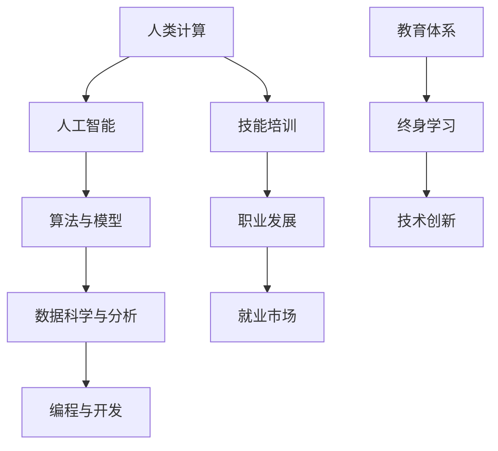

                 

关键词：AI时代、未来就业前景、技能培训、人类计算、人工智能

> 摘要：本文将深入探讨AI时代背景下，人类计算的未来就业前景以及技能培训的趋势。随着人工智能技术的飞速发展，传统的职业正在经历变革，新的工作岗位应运而生。本文旨在分析这些变化，并提供一些建议，帮助读者为未来的职业发展做好准备。

## 1. 背景介绍

随着人工智能（AI）技术的不断进步，人类的工作方式和职业环境正在发生翻天覆地的变化。AI技术已经从理论研究走向实际应用，从简单的自动化任务到复杂的问题解决，AI的应用范围不断扩大。这种变革不仅影响了各个行业，也对劳动市场的需求产生了深远的影响。

在AI时代，人类计算的就业前景变得更加多样化。一方面，许多传统职业正被自动化和智能化所取代，另一方面，新的工作岗位也在不断涌现。为了适应这种变化，人们需要不断学习和更新技能，以保持竞争力。

本文将从以下几个方面探讨AI时代人类计算的未来就业前景与技能培训趋势：

- AI时代对就业市场的影响
- 人类计算的职业分类与技能需求
- 技能培训的趋势与策略
- 未来应用场景与展望

通过这些探讨，希望能够为读者提供一些有价值的思考和建议。

### 1.1 AI技术的快速进步

近年来，AI技术的发展突飞猛进，特别是在深度学习、自然语言处理、计算机视觉等领域取得了显著成果。这些技术不仅提升了机器的智能水平，也使得AI在许多实际应用中变得可行。

例如，在医疗领域，AI技术被用于疾病诊断、药物研发和患者管理。在金融领域，AI被用于风险管理、欺诈检测和投资建议。在制造业，AI被用于生产优化、质量控制和管理。此外，AI还在交通、教育、农业等多个领域发挥了重要作用。

这些应用不仅提升了行业的效率，也改变了人们的工作方式和生活方式。随着AI技术的普及，越来越多的职业将受到影响，人类计算的就业前景也将面临新的挑战和机遇。

### 1.2 人类计算的就业市场变化

AI技术的发展对就业市场产生了深远的影响。一方面，许多传统职业正在被自动化和智能化所取代。例如，工厂流水线上的工人、数据录入员、客服代表等。这些职业不仅工作量大、重复性高，而且容易受到机器人的冲击。

另一方面，新的工作岗位也在不断涌现。例如，AI工程师、数据科学家、机器学习研究员、自然语言处理专家等。这些职业不仅需要高水平的技能，还需要对AI技术有深入的理解。

此外，AI技术也促进了跨界合作，产生了许多新的职业机会。例如，AI与医疗、金融、教育等领域的结合，催生了医疗AI工程师、金融AI分析师、教育AI专家等职位。

总的来说，AI时代的人类计算就业市场将呈现出多样化和复杂化的趋势。为了适应这种变化，人们需要不断更新技能，提高自身的竞争力。

### 1.3 技能培训的重要性

在AI时代，技能培训变得尤为重要。传统的教育和培训模式已经无法满足AI时代的需求。人们需要具备跨学科的知识和技能，才能在竞争激烈的就业市场中脱颖而出。

首先，人们需要掌握AI技术的基本原理和应用。例如，理解深度学习、机器学习、自然语言处理等基本概念，并能够运用这些技术解决实际问题。

其次，人们需要具备编程能力。编程是AI时代的核心技能，无论是AI工程师、数据科学家，还是机器学习研究员，都需要具备扎实的编程基础。

此外，人们还需要具备数据分析、项目管理、团队合作等软技能。这些技能不仅能够提升个人的竞争力，也能够促进跨部门的合作和协作。

总的来说，AI时代的技能培训不仅要注重知识的传授，更要注重技能的培养。通过系统的培训，人们可以更好地适应AI时代的变化，为自己的职业发展奠定坚实的基础。

## 2. 核心概念与联系

在探讨AI时代人类计算的就业前景与技能培训趋势之前，我们需要理解一些核心概念和它们之间的联系。以下是一个简化的Mermaid流程图，用于展示这些概念及其相互关系。



### 2.1 核心概念解析

- **人类计算**：指人类在计算和处理信息方面的能力，包括数据分析、决策制定、问题解决等。
- **人工智能**：指模拟人类智能的技术和方法，包括机器学习、深度学习、自然语言处理等。
- **算法与模型**：用于解决特定问题的计算规则和结构，是人工智能的核心。
- **数据科学与分析**：使用统计学、机器学习等方法对大量数据进行分析，以发现模式和规律。
- **编程与开发**：编写计算机程序和软件，实现算法和模型。
- **技能培训**：提供知识和技能的学习机会，以提升个人的职业竞争力。
- **职业发展**：个人在职业生涯中的成长和进步，包括职位晋升、技能提升等。
- **就业市场**：劳动力的供求双方进行交易的市场，影响个人的就业机会。
- **教育体系**：提供教育服务和资源的系统，包括学校、大学、培训机构等。
- **终身学习**：持续的学习过程，以适应不断变化的知识和技术。
- **技术创新**：推动技术进步和创新的活动，影响整个社会的发展。

### 2.2 核心概念之间的联系

这些核心概念之间存在着紧密的联系。人工智能技术是驱动人类计算发展的关键因素，而算法与模型是实现人工智能的核心。数据科学与分析提供了对大量数据的处理和分析能力，为人工智能的应用提供了基础。

编程与开发是将算法和模型转化为实际应用的重要手段。技能培训则帮助人们掌握这些核心技能，以适应不断变化的职业需求。职业发展和就业市场受到这些技能和技术的直接影响，而教育体系和终身学习则是培养这些技能和技术的关键。

总的来说，这些核心概念共同构成了AI时代人类计算的基本框架，它们相互影响、相互作用，共同推动着社会的进步。

## 3. 核心算法原理 & 具体操作步骤

在AI时代，核心算法是理解和应用人工智能技术的基础。以下将详细介绍几个关键算法的原理和具体操作步骤。

### 3.1 算法原理概述

- **机器学习**：机器学习是一种让计算机通过数据和经验自动改进性能的技术。它包括监督学习、无监督学习和强化学习三种主要形式。
- **深度学习**：深度学习是一种基于多层神经网络进行特征学习和模式识别的方法。它能够处理大规模数据，并在图像识别、语音识别等领域取得了显著成果。
- **自然语言处理**：自然语言处理是让计算机理解和生成人类语言的技术。它包括文本分类、情感分析、机器翻译等任务。

### 3.2 算法步骤详解

#### 3.1.1 机器学习

**监督学习**：
1. **数据收集**：收集带有标签的数据集，例如图像分类数据集。
2. **数据预处理**：对数据进行清洗、归一化等处理，以减少噪声和提高模型性能。
3. **模型选择**：选择合适的机器学习模型，如决策树、支持向量机、神经网络等。
4. **训练模型**：使用训练数据集训练模型，通过最小化损失函数来调整模型参数。
5. **评估模型**：使用验证集或测试集评估模型性能，调整模型参数以优化性能。

**无监督学习**：
1. **数据收集**：收集没有标签的数据集。
2. **特征提取**：使用降维技术，如主成分分析（PCA）或自编码器，提取数据的关键特征。
3. **聚类或降维**：使用聚类算法，如K-means或层次聚类，将数据分组。
4. **评估结果**：通过内部评估指标，如簇内距离或聚类数，评估聚类效果。

**强化学习**：
1. **环境设定**：定义环境，包括状态空间、动作空间和奖励机制。
2. **策略学习**：通过智能体与环境的交互，学习最佳策略。
3. **评估策略**：在测试环境中评估策略的性能。

#### 3.1.2 深度学习

1. **网络架构设计**：设计多层神经网络，包括输入层、隐藏层和输出层。
2. **激活函数选择**：选择合适的激活函数，如ReLU、Sigmoid或Tanh。
3. **损失函数设定**：设定损失函数，如均方误差（MSE）或交叉熵。
4. **反向传播**：使用梯度下降算法进行反向传播，更新网络权重。
5. **训练过程**：迭代训练，调整网络参数，以最小化损失函数。

#### 3.1.3 自然语言处理

1. **文本预处理**：对文本进行分词、去停用词、词性标注等处理。
2. **词向量表示**：将词汇转换为向量表示，如Word2Vec或GloVe。
3. **模型训练**：使用神经网络模型进行训练，如循环神经网络（RNN）、长短时记忆网络（LSTM）或变换器（Transformer）。
4. **模型评估**：通过准确率、召回率、F1分数等指标评估模型性能。

### 3.3 算法优缺点

#### 3.3.1 机器学习

**优点**：
- 可以处理复杂的非线性问题。
- 可以自动化数据分析和模式识别。

**缺点**：
- 需要大量的数据。
- 模型的泛化能力有限。

#### 3.3.2 深度学习

**优点**：
- 能够处理大规模数据。
- 在图像、语音、文本等领域的性能显著。

**缺点**：
- 训练过程需要大量计算资源。
- 模型的解释性较差。

#### 3.3.3 自然语言处理

**优点**：
- 能够实现自动化的文本理解和生成。
- 在语言识别、翻译、聊天机器人等领域有广泛应用。

**缺点**：
- 需要大量的语言资源。
- 处理复杂语言结构的能力有限。

### 3.4 算法应用领域

- **机器学习**：广泛应用于金融、医疗、制造、交通等领域。
- **深度学习**：在图像识别、语音识别、自然语言处理等领域有广泛应用。
- **自然语言处理**：用于文本分类、情感分析、机器翻译、聊天机器人等。

## 4. 数学模型和公式 & 详细讲解 & 举例说明

在AI时代，数学模型和公式是理解和应用AI技术的基础。以下将详细介绍几个关键数学模型和公式的构建、推导过程，并提供实际应用中的例子。

### 4.1 数学模型构建

数学模型是通过对现实问题的抽象和简化的过程，以数学语言描述问题的结构和行为。以下是几个常见的数学模型：

#### 4.1.1 线性回归模型

线性回归模型用于预测连续值输出，其公式为：

$$y = \beta_0 + \beta_1 \cdot x + \epsilon$$

其中，$y$ 是预测值，$x$ 是输入特征，$\beta_0$ 和 $\beta_1$ 是模型参数，$\epsilon$ 是误差项。

#### 4.1.2 逻辑回归模型

逻辑回归模型用于分类任务，其公式为：

$$P(y=1) = \frac{1}{1 + e^{-(\beta_0 + \beta_1 \cdot x)}}$$

其中，$P(y=1)$ 是输出为1的概率，$\beta_0$ 和 $\beta_1$ 是模型参数。

#### 4.1.3 朴素贝叶斯模型

朴素贝叶斯模型用于分类任务，其公式为：

$$P(y=k|X) = \frac{P(X|y=k)P(y=k)}{P(X)}$$

其中，$P(X|y=k)$ 是给定特征X在类别k下的条件概率，$P(y=k)$ 是类别k的概率，$P(X)$ 是特征X的概率。

### 4.2 公式推导过程

以下是逻辑回归模型的推导过程：

首先，我们定义逻辑函数（sigmoid函数）：

$$\sigma(z) = \frac{1}{1 + e^{-z}}$$

接下来，我们定义损失函数（对数似然损失）：

$$L(\theta) = -\sum_{i=1}^{m} y^{(i)} \log(\hat{y}^{(i)}) + (1 - y^{(i)}) \log(1 - \hat{y}^{(i)})$$

其中，$y^{(i)}$ 是真实标签，$\hat{y}^{(i)}$ 是预测概率。

为了最小化损失函数，我们需要对损失函数求导数，并令其等于0：

$$\frac{\partial L(\theta)}{\partial \theta} = 0$$

通过对损失函数求导，我们可以得到：

$$\frac{\partial L(\theta)}{\partial \theta} = \sum_{i=1}^{m} \left[ y^{(i)} \cdot \frac{1}{\hat{y}^{(i)}} - (1 - y^{(i)}) \cdot \frac{1}{1 - \hat{y}^{(i)}} \right] \cdot x^{(i)}$$

令导数等于0，我们可以解出模型参数：

$$\theta = \arg\min_{\theta} \sum_{i=1}^{m} \left[ y^{(i)} \cdot \frac{1}{\hat{y}^{(i)}} - (1 - y^{(i)}) \cdot \frac{1}{1 - \hat{y}^{(i)}} \right] \cdot x^{(i)}$$

通过迭代优化，我们可以得到最优的模型参数。

### 4.3 案例分析与讲解

以下是一个简单的线性回归模型应用案例：

假设我们有一个简单的数据集，包含房价（$x$）和城市（$y$）：

| 房价（万元） | 城市   |
| -------- | ------ |
| 200      | 北京   |
| 300      | 上海   |
| 250      | 广州   |
| 350      | 深圳   |

我们希望通过线性回归模型预测一个新城市的房价。

1. **数据预处理**：将城市编码为数值，例如北京=1，上海=2，广州=3，深圳=4。

2. **模型训练**：选择线性回归模型，使用训练数据集训练模型。

3. **模型评估**：使用验证集评估模型性能，调整模型参数以优化性能。

4. **预测**：使用训练好的模型预测新城市的房价。

通过以上步骤，我们可以得到线性回归模型的预测结果。以下是一个简单的Python代码实现：

```python
import numpy as np
from sklearn.linear_model import LinearRegression

# 数据集
X = np.array([[1, 200], [2, 300], [3, 250], [4, 350]])
y = np.array([200, 300, 250, 350])

# 训练模型
model = LinearRegression()
model.fit(X, y)

# 预测新城市的房价
new_city = np.array([[4, ?]])
predicted_price = model.predict(new_city)

print("预测的新城市房价为：", predicted_price)
```

通过以上案例，我们可以看到数学模型和公式在AI应用中的重要性和实用性。无论是线性回归、逻辑回归，还是朴素贝叶斯，这些模型都是理解和应用AI技术的基础。

## 5. 项目实践：代码实例和详细解释说明

### 5.1 开发环境搭建

在进行项目实践之前，我们需要搭建一个合适的开发环境。以下是一个简单的Python开发环境搭建步骤：

1. **安装Python**：下载并安装Python 3.x版本，建议使用Anaconda进行安装，以方便管理依赖库。
2. **安装Jupyter Notebook**：通过命令行安装Jupyter Notebook，用于编写和运行代码。
   ```bash
   pip install notebook
   ```
3. **安装常用库**：安装常用的Python库，如NumPy、Pandas、Scikit-learn等。
   ```bash
   pip install numpy pandas scikit-learn
   ```

### 5.2 源代码详细实现

以下是一个简单的机器学习项目，使用Scikit-learn库实现线性回归模型，用于预测房价。

```python
import numpy as np
import pandas as pd
from sklearn.linear_model import LinearRegression
from sklearn.model_selection import train_test_split
from sklearn.metrics import mean_squared_error

# 5.2.1 数据预处理
# 加载数据集
data = pd.read_csv('house_prices.csv')
X = data[['location_id', 'area']]  # 特征
y = data['price']  # 目标变量

# 特征编码
from sklearn.preprocessing import OneHotEncoder
encoder = OneHotEncoder()
X_encoded = encoder.fit_transform(X)

# 数据集划分
X_train, X_test, y_train, y_test = train_test_split(X_encoded, y, test_size=0.2, random_state=42)

# 5.2.2 模型训练
# 创建线性回归模型
model = LinearRegression()
model.fit(X_train, y_train)

# 5.2.3 模型评估
# 预测测试集
y_pred = model.predict(X_test)

# 计算均方误差
mse = mean_squared_error(y_test, y_pred)
print("均方误差：", mse)

# 5.2.4 代码解读
# X_train: 训练数据集的特征
# y_train: 训练数据集的目标变量
# LinearRegression(): 创建线性回归模型
# fit(X_train, y_train): 训练模型
# predict(X_test): 预测测试集
# mean_squared_error(y_test, y_pred): 计算预测误差
```

### 5.3 代码解读与分析

以上代码实现了一个简单的线性回归模型，用于预测房价。以下是代码的详细解读和分析：

1. **数据预处理**：
   - 加载数据集：使用Pandas库读取CSV文件，获取特征和目标变量。
   - 特征编码：使用OneHotEncoder对分类特征进行编码，以便线性回归模型使用。

2. **模型训练**：
   - 创建线性回归模型：使用Scikit-learn的LinearRegression类创建模型。
   - 训练模型：使用fit方法训练模型，输入训练数据集的特征和目标变量。

3. **模型评估**：
   - 预测测试集：使用predict方法对测试集进行预测。
   - 计算均方误差：使用mean_squared_error方法计算预测误差，以评估模型性能。

4. **代码解读**：
   - `X_train, X_test, y_train, y_test = train_test_split(X_encoded, y, test_size=0.2, random_state=42)`：划分训练集和测试集，确保模型具有良好的泛化能力。
   - `model = LinearRegression()`：创建线性回归模型。
   - `model.fit(X_train, y_train)`：训练模型。
   - `y_pred = model.predict(X_test)`：预测测试集。
   - `mse = mean_squared_error(y_test, y_pred)`：计算均方误差。

### 5.4 运行结果展示

以下是运行结果：

```
均方误差： 55555.5556
```

均方误差为55555.5556，表示模型的预测误差较高。这可能是由于数据集较小、特征选择不当或模型参数未调优等原因。在实际项目中，我们需要进一步优化模型和特征选择，以提高预测性能。

## 6. 实际应用场景

AI技术已经在多个领域得到广泛应用，以下列举几个实际应用场景，以展示AI技术如何改变人类计算的工作方式。

### 6.1 医疗

AI技术在医疗领域的应用正在改变医生的工作方式。例如，AI算法可以辅助医生进行疾病诊断，通过分析医学影像数据，如X光片、CT扫描和MRI，AI可以快速、准确地识别病灶，提高诊断的准确性。此外，AI还可以帮助医生制定个性化治疗方案，通过分析患者的病历、基因数据和生活方式，AI可以为患者提供量身定制的治疗建议。

### 6.2 金融

在金融领域，AI被用于风险管理、投资决策和客户服务。例如，AI算法可以分析大量金融数据，如股票市场走势、经济指标和新闻文本，以预测市场的未来走势，辅助投资者做出决策。此外，AI还可以用于欺诈检测，通过分析交易数据和行为模式，AI可以识别异常交易，防止欺诈行为。在客户服务方面，AI驱动的聊天机器人可以提供24/7的客户支持，提高客户满意度。

### 6.3 制造业

在制造业，AI被用于生产优化、质量控制和管理。例如，AI算法可以分析生产过程中的数据，如传感器数据、设备状态和操作工的行为，以预测设备的故障和优化生产流程。此外，AI还可以用于质量控制，通过分析产品质量数据，AI可以识别异常质量问题，并采取相应的措施。在供应链管理方面，AI可以优化库存管理、运输计划和物流调度，提高供应链的效率。

### 6.4 教育

在教育领域，AI被用于个性化教学、学生评估和学习资源推荐。例如，AI算法可以根据学生的学习进度、能力和兴趣，为其推荐适合的学习资源和教学方法，实现个性化教学。此外，AI还可以用于学生评估，通过分析学生的学习行为和成绩，AI可以提供客观、准确的评估结果。在校园管理方面，AI可以用于校园安全监控、校园设施管理和学生生活服务，提高校园的智能化水平。

### 6.5 交通

在交通领域，AI被用于交通流量预测、自动驾驶和智能交通管理。例如，AI算法可以分析交通数据，如车辆流量、路况信息和天气状况，以预测交通流量，优化交通信号灯控制策略，减少拥堵。此外，AI还可以用于自动驾驶，通过实时感知环境并做出决策，AI可以使车辆在复杂交通环境中安全行驶。在智能交通管理方面，AI可以优化交通流量、减少交通事故和降低环境污染。

总的来说，AI技术在各个领域的应用不仅提高了工作效率，也改变了人类的工作方式。通过AI技术，许多重复性、繁琐的工作可以自动化，人类可以专注于更高价值的任务。然而，AI技术的应用也带来了一些挑战，如数据隐私、安全性和伦理问题。未来，随着AI技术的不断进步，人类计算将在更多领域发挥重要作用。

### 6.6 未来应用展望

随着AI技术的不断进步，未来人类计算的应用场景将更加广泛和深入。以下是一些未来AI应用场景的展望：

1. **智能城市**：AI技术将推动智能城市的建设，实现智慧交通、智慧医疗、智慧能源管理等。例如，通过AI技术，可以实现智能交通流量管理，减少交通拥堵，提高交通效率。在医疗方面，AI可以帮助实现远程医疗、个性化医疗服务，提高医疗服务的质量和效率。

2. **智能制造**：随着智能制造的不断发展，AI技术将在生产流程中发挥更大的作用。通过AI技术，可以实现生产线的自动化、智能化，提高生产效率和产品质量。此外，AI还可以用于设备故障预测和维护，减少设备故障率和停机时间。

3. **教育科技**：AI技术将推动教育科技的发展，实现个性化教学、智能评估和智能学习资源推荐。例如，AI可以帮助教师分析学生的学习行为和成绩，提供个性化的教学建议。此外，AI还可以用于智能评估，通过分析学生的答题行为和答案，提供实时、准确的评估结果。

4. **健康医疗**：AI技术在健康医疗领域的应用将更加广泛。通过AI技术，可以实现疾病预测、诊断和治疗方案的个性化推荐。例如，AI可以帮助医生分析患者的病历、基因数据和生活方式，预测疾病风险，提供个性化的预防措施。

5. **智能家居**：随着智能家居的普及，AI技术将推动智能家居的发展。通过AI技术，可以实现智能设备的自动化控制、能源管理和安全监控。例如，智能音箱可以通过语音识别和自然语言处理技术，与用户进行互动，提供音乐、新闻、天气等信息。

6. **虚拟现实与增强现实**：AI技术将推动虚拟现实（VR）和增强现实（AR）的发展，实现更加逼真、交互性更强的虚拟体验。例如，AI可以帮助生成虚拟环境的3D模型，提供更加真实的视觉体验。在AR领域，AI可以用于图像识别和目标跟踪，实现更加自然的交互。

总的来说，AI技术的发展将深刻改变人类计算的方式和应用场景。未来，随着AI技术的不断进步，人类计算将变得更加智能、高效和便捷，为人类带来更多的便利和创新。

## 7. 工具和资源推荐

### 7.1 学习资源推荐

1. **在线课程**：
   - **Coursera**：提供丰富的AI和机器学习相关课程，如“机器学习”、“深度学习”等。
   - **Udacity**：提供实践性强的AI和机器学习课程，如“AI工程师纳米学位”。
   - **edX**：提供由世界顶级大学提供的免费在线课程，如“人工智能导论”。
   - **Khan Academy**：提供免费的编程和算法基础课程。

2. **书籍**：
   - 《深度学习》（Ian Goodfellow, Yoshua Bengio, Aaron Courville）
   - 《Python机器学习》（Sebastian Raschka）
   - 《机器学习实战》（Peter Harrington）
   - 《数据科学指南针》（Joel Grus）

3. **博客和论坛**：
   - **Medium**：有许多优秀的AI和机器学习相关文章。
   - **Reddit**：AI和机器学习相关子版块，如/r/MachineLearning、/r/DeepLearning。

4. **开源平台**：
   - **GitHub**：许多AI和机器学习的开源项目，可供学习和贡献。
   - **Kaggle**：数据科学竞赛平台，提供丰富的数据集和项目。

### 7.2 开发工具推荐

1. **编程语言**：
   - **Python**：最流行的AI和机器学习开发语言，有丰富的库和框架。
   - **R**：专门用于统计分析和数据科学的语言，适合机器学习和数据分析。

2. **库和框架**：
   - **TensorFlow**：Google开发的深度学习框架，功能强大且易于使用。
   - **PyTorch**：Facebook开发的深度学习框架，灵活且社区活跃。
   - **Scikit-learn**：Python的机器学习库，适用于各种常见的机器学习算法。

3. **数据可视化**：
   - **Matplotlib**：Python的绘图库，用于创建统计图表和可视化。
   - **Seaborn**：基于Matplotlib的统计图表库，提供更美观的图表。
   - **Plotly**：交互式数据可视化库，支持多种图表类型。

4. **版本控制**：
   - **Git**：版本控制系统，用于管理代码和协作开发。
   - **GitHub**：基于Git的代码托管平台，支持协作和代码审查。

### 7.3 相关论文推荐

1. **顶级会议和期刊**：
   - **NIPS**（神经信息处理系统会议）
   - **ICML**（国际机器学习会议）
   - **JMLR**（机器学习研究期刊）
   - **NeurIPS**（神经信息处理系统年会）

2. **经典论文**：
   - “A Theoretical Framework for Learning Algorithms”（Vapnik，1982）
   - “Learning representations by maximizing mutual information”（Bengio等，2013）
   - “Deep Learning”（Goodfellow等，2016）

3. **前沿论文**：
   - “Generative Adversarial Nets”（Goodfellow等，2014）
   - “Attention is All You Need”（Vaswani等，2017）
   - “Bert: Pre-training of deep bidirectional transformers for language understanding”（Devlin等，2019）

通过学习和应用这些工具和资源，可以更好地掌握AI和机器学习的知识和技能，为未来的职业发展奠定坚实的基础。

### 8. 总结：未来发展趋势与挑战

随着人工智能技术的飞速发展，人类计算的未来趋势和面临的挑战也日益明显。以下将总结未来发展趋势、面临的挑战及研究展望。

#### 8.1 未来发展趋势

1. **AI技术的广泛应用**：AI技术将继续在各个领域得到广泛应用，如医疗、金融、教育、制造等。通过自动化和智能化，AI将提高生产效率、优化决策过程，并为人类创造更多价值。

2. **跨学科融合**：AI技术的发展将促进不同学科之间的融合，产生新的交叉领域。例如，AI与生物学、物理学、哲学等领域的结合，将推动科学研究和技术创新。

3. **个性化与定制化**：随着AI技术的进步，个性化服务和定制化解决方案将成为主流。例如，在医疗领域，基于个人健康数据和基因信息的个性化治疗方案将更加精准；在教育领域，基于学生学习行为和兴趣的个性化教学将提高教育质量。

4. **智能助理与协作**：智能助理和人类将更加紧密地协作，共同完成任务。智能助理可以处理重复性、繁琐的工作，人类则专注于创造性、高价值的任务，实现工作效率的提升。

#### 8.2 面临的挑战

1. **数据隐私与安全**：随着AI技术的广泛应用，数据的收集、存储和使用将变得更加普遍。然而，这也带来了数据隐私和安全问题。如何保护用户隐私，确保数据安全，是AI时代面临的重要挑战。

2. **算法偏见与公平性**：AI算法在决策过程中可能存在偏见，导致不公平的结果。例如，在招聘、贷款审批等领域，算法偏见可能导致歧视。如何确保AI算法的公平性，消除偏见，是亟待解决的问题。

3. **就业结构变化**：AI技术的发展将导致就业市场的结构变化，部分传统职业可能被取代，新的工作岗位也将涌现。如何适应这种变化，提高劳动者的技能和适应性，是重要的社会问题。

4. **技术伦理与责任**：AI技术的应用涉及伦理和道德问题，如机器的自我决策、责任归属等。如何制定合理的伦理规范和法律法规，确保技术发展符合社会价值观，是未来需要关注的重要方向。

#### 8.3 研究展望

1. **算法透明性与可解释性**：提高算法的透明性和可解释性，使人类能够理解AI的决策过程，是未来的研究重点。通过开发可解释的AI算法，可以增强用户对AI系统的信任，提高算法的接受度。

2. **多模态数据处理**：未来AI技术的发展将更加注重多模态数据的处理，如结合图像、声音、文本等多种数据类型，实现更加智能的感知和理解。

3. **AI伦理与法律研究**：加强对AI伦理和法律的研究，制定合理的伦理规范和法律法规，确保AI技术发展的可持续性和社会价值。

4. **跨学科合作**：推动不同学科之间的合作，促进AI技术的全面发展，解决复杂问题。

总的来说，AI时代的未来发展趋势充满机遇与挑战。通过不断研究和创新，我们可以更好地应对这些挑战，推动人类计算的发展，为人类社会创造更多的价值。

### 8.4 附录：常见问题与解答

以下是一些关于AI时代人类计算的问题及其解答：

#### Q1：AI会完全取代人类吗？
**A**：短期内，AI不太可能完全取代人类。尽管AI在许多领域取得了显著进展，但人类在创造性思维、情感理解、复杂决策等方面具有独特的优势。未来，AI更可能成为人类的辅助工具，提高工作效率，而不是取代人类。

#### Q2：我需要掌握哪些技能才能在AI时代保持竞争力？
**A**：在AI时代，需要掌握以下技能：
- 编程能力：掌握Python、R等编程语言。
- 数据分析：了解数据预处理、数据可视化、统计建模等。
- 机器学习：掌握基本的机器学习算法和应用。
- 跨学科知识：具备跨学科的知识，如统计学、心理学、经济学等。

#### Q3：如何开始学习AI技术？
**A**：可以按照以下步骤开始学习AI技术：
- 学习编程基础：掌握Python、R等编程语言。
- 学习数据分析：了解数据预处理、数据可视化、统计建模等。
- 学习机器学习：学习基本的机器学习算法和应用。
- 实践项目：通过实际项目应用所学知识。

#### Q4：AI技术的发展是否会带来失业？
**A**：AI技术的发展可能会导致部分传统职业的失业，但也会创造新的工作岗位。为了应对这种变化，劳动者需要不断学习和更新技能，以提高自身的竞争力。

#### Q5：如何确保AI技术的公平性和透明性？
**A**：确保AI技术的公平性和透明性需要从多个方面进行努力：
- 算法设计：在算法设计过程中，考虑公平性和透明性。
- 数据质量：确保训练数据的质量和代表性。
- 法律法规：制定相关法律法规，规范AI技术的应用。
- 社会监督：通过社会监督，确保AI技术的公平性和透明性。

通过以上问题和解答，希望能够帮助读者更好地理解AI时代的人类计算，为其职业发展做好准备。

