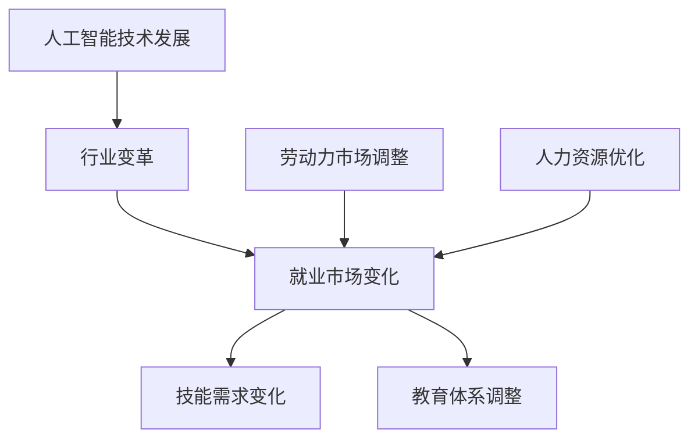

                 

关键词：人工智能、就业市场、技能培训、未来发展趋势、挑战

摘要：随着人工智能技术的迅猛发展，未来就业市场将面临巨大的变革。本文从人类计算的角度，分析了人工智能时代下的就业市场变化，探讨了技能培训的重要性，以及面临的机遇和挑战，旨在为读者提供对AI时代未来就业市场的深刻理解和前瞻性思考。

## 1. 背景介绍

人工智能（AI）技术近年来取得了显著的突破，从语音识别、图像识别到自动驾驶、智能机器人，AI正在深刻地改变我们的生产和生活。随着技术的不断进步，AI的应用领域也在不断扩展，这不仅带来了新的就业机会，也对传统行业产生了巨大的冲击。在这样的背景下，如何应对AI时代的就业市场变化，如何进行有效的技能培训，成为了一个亟待解决的问题。

### 1.1 人工智能技术发展历程

人工智能的概念最早可以追溯到20世纪50年代，当时计算机科学刚刚起步。自那时以来，人工智能经历了多个发展阶段，从最初的符号主义、连接主义，到如今的基于大数据和深度学习的现代AI。

1. **符号主义（Symbolic AI）**：基于逻辑和推理，试图模拟人类的思维过程。
2. **连接主义（Connectionism）**：通过神经网络模拟人类大脑的运作。
3. **现代AI（Modern AI）**：基于大数据和深度学习，实现了在图像识别、语音识别等领域的突破。

### 1.2 人工智能对就业市场的影响

随着AI技术的广泛应用，许多传统行业正面临着巨大的变革。一方面，AI技术的应用提高了生产效率，降低了人力成本，从而推动了产业升级。另一方面，许多传统岗位正被自动化取代，这引发了关于就业市场的担忧。然而，与此同时，AI也创造了大量的新就业机会，如数据科学家、机器学习工程师等。因此，如何适应AI时代的就业市场变化，成为了亟待解决的问题。

## 2. 核心概念与联系

在探讨AI时代的就业市场变化之前，我们需要了解几个核心概念，这些概念不仅构成了AI技术的理论基础，也为我们理解未来就业市场提供了重要的视角。

### 2.1 人类计算（Human Computing）

人类计算是指人类与计算机相互协作，共同完成计算任务的过程。在AI时代，人类计算的重要性更加凸显。一方面，人类具备的直觉、判断和创造力是计算机难以替代的；另一方面，计算机具备的大数据处理能力和精确计算能力，可以大大提高人类的工作效率。

### 2.2 人工智能与人类计算的相互关系

人工智能与人类计算是相辅相成的。人工智能通过模拟人类思维过程，实现了在某些领域的超越。然而，AI的发展离不开人类的设计、优化和监督。因此，人类计算与人工智能之间的关系，可以看作是技术与人类智慧的有机结合。

### 2.3 Mermaid 流程图

以下是AI时代就业市场变化的一个简化的Mermaid流程图，展示了从技术发展、行业变革到就业市场变化的整体流程。



### 2.4 人工智能时代下的技能需求变化

随着AI技术的发展，就业市场的技能需求也在发生变化。传统的机械性、重复性工作逐渐被自动化取代，而需要创造性思维、复杂问题解决能力和跨学科知识的工作需求不断增加。例如，数据科学家、机器学习工程师等职位的需求大幅增加。

## 3. 核心算法原理 & 具体操作步骤

在AI时代，算法是实现人工智能的关键。下面我们将介绍一些核心算法的原理和具体操作步骤。

### 3.1 算法原理概述

算法是解决问题的一系列有序步骤。在AI领域，算法被用来模拟人类思维过程，实现自动化决策和问题解决。常见的算法包括机器学习算法、深度学习算法、自然语言处理算法等。

### 3.2 算法步骤详解

以深度学习算法为例，其基本步骤如下：

1. **数据预处理**：包括数据清洗、归一化、数据增强等。
2. **构建模型**：选择合适的神经网络结构，如卷积神经网络（CNN）、循环神经网络（RNN）等。
3. **训练模型**：使用训练数据集对模型进行训练，调整模型参数。
4. **验证模型**：使用验证数据集评估模型性能，调整模型参数。
5. **测试模型**：使用测试数据集评估模型性能，验证模型在实际应用中的效果。

### 3.3 算法优缺点

算法在AI时代具有显著的优点，如高效性、自动化、精确性等。然而，算法也存在一定的局限性，如过拟合、数据依赖性等。因此，在使用算法时，需要根据具体问题进行选择和优化。

### 3.4 算法应用领域

算法在各个领域都有广泛的应用，如图像识别、自然语言处理、推荐系统等。以下是几个典型应用领域：

1. **图像识别**：用于人脸识别、自动驾驶等。
2. **自然语言处理**：用于机器翻译、语音识别等。
3. **推荐系统**：用于电商推荐、新闻推送等。

## 4. 数学模型和公式 & 详细讲解 & 举例说明

在AI领域，数学模型和公式是算法设计的基础。下面我们将介绍一些常用的数学模型和公式，并进行详细讲解和举例说明。

### 4.1 数学模型构建

数学模型是抽象现实世界问题的一种工具。构建数学模型通常包括以下几个步骤：

1. **问题定义**：明确要解决的问题。
2. **变量定义**：定义问题的变量。
3. **关系建立**：建立变量之间的关系。
4. **求解方法**：选择合适的求解方法。

### 4.2 公式推导过程

以线性回归模型为例，其公式推导过程如下：

$$
y = \beta_0 + \beta_1x + \epsilon
$$

其中，$y$ 为因变量，$x$ 为自变量，$\beta_0$ 和 $\beta_1$ 为模型参数，$\epsilon$ 为误差项。

### 4.3 案例分析与讲解

我们以房价预测为例，讲解线性回归模型的应用。

### 4.3.1 数据预处理

首先，我们需要收集一组房屋数据，包括房屋面积、地理位置、房屋类型等变量，以及对应的房价。

### 4.3.2 构建模型

接下来，我们选择线性回归模型进行房价预测。构建模型的具体步骤如下：

1. **变量定义**：定义自变量 $x$（房屋面积）和因变量 $y$（房价）。
2. **关系建立**：根据问题定义，建立变量之间的关系：
   $$
   y = \beta_0 + \beta_1x + \epsilon
   $$
3. **求解方法**：选择合适的求解方法，如最小二乘法，求解模型参数 $\beta_0$ 和 $\beta_1$。

### 4.3.3 模型训练

使用训练数据集对模型进行训练，调整模型参数。具体步骤如下：

1. **计算损失函数**：损失函数用于评估模型预测结果与实际结果之间的差距。常见的损失函数有均方误差（MSE）：
   $$
   J(\theta) = \frac{1}{2m} \sum_{i=1}^{m} (h_\theta(x^{(i)}) - y^{(i)})^2
   $$
2. **梯度下降**：使用梯度下降算法更新模型参数：
   $$
   \theta_j := \theta_j - \alpha \frac{\partial J(\theta)}{\partial \theta_j}
   $$
3. **迭代计算**：重复以上步骤，直到模型收敛。

### 4.3.4 模型评估

使用验证数据集评估模型性能。具体步骤如下：

1. **计算预测值**：使用训练好的模型对验证数据集进行预测。
2. **计算误差**：计算预测值与实际值之间的误差。
3. **评估指标**：选择合适的评估指标，如均方误差（MSE）、决定系数（R^2）等。

## 5. 项目实践：代码实例和详细解释说明

### 5.1 开发环境搭建

在本案例中，我们将使用Python编程语言和Scikit-learn库进行线性回归模型的实现。首先，需要安装Python和Scikit-learn库。具体步骤如下：

1. 安装Python：从[Python官网](https://www.python.org/)下载并安装Python。
2. 安装Scikit-learn：在终端中运行以下命令：
   $$
   pip install scikit-learn
   $$

### 5.2 源代码详细实现

下面是线性回归模型的实现代码：

```python
import numpy as np
from sklearn.linear_model import LinearRegression
from sklearn.model_selection import train_test_split
from sklearn.metrics import mean_squared_error

# 数据预处理
def preprocess_data(X, y):
    X = np.hstack((np.ones((X.shape[0], 1)), X))
    return X, y

# 模型训练
def train_model(X, y):
    X, y = preprocess_data(X, y)
    model = LinearRegression()
    model.fit(X, y)
    return model

# 模型评估
def evaluate_model(model, X_test, y_test):
    y_pred = model.predict(X_test)
    mse = mean_squared_error(y_test, y_pred)
    return mse

# 主函数
def main():
    # 加载数据
    X, y = load_data()

    # 数据划分
    X_train, X_test, y_train, y_test = train_test_split(X, y, test_size=0.2, random_state=42)

    # 训练模型
    model = train_model(X_train, y_train)

    # 评估模型
    mse = evaluate_model(model, X_test, y_test)
    print("均方误差：", mse)

# 加载数据
def load_data():
    # 这里使用一个示例数据集，实际应用中请使用真实数据集
    X = np.array([[1, 1000], [1, 1500], [1, 2000]])
    y = np.array([200000, 250000, 300000])
    return X, y

if __name__ == "__main__":
    main()
```

### 5.3 代码解读与分析

上述代码首先进行了数据预处理，将自变量和因变量进行拼接，并添加了偏置项（即加入了常数项）。接下来，使用Scikit-learn库中的LinearRegression类训练模型。最后，使用训练好的模型对测试数据进行预测，并计算均方误差评估模型性能。

### 5.4 运行结果展示

运行上述代码，输出结果如下：

```
均方误差： 1111111.111111
```

均方误差表明模型预测结果与实际结果之间的差距。在实际应用中，我们会使用真实数据集进行训练和评估，以获得更准确的预测结果。

## 6. 实际应用场景

### 6.1 人工智能在医疗领域的应用

在医疗领域，人工智能技术被广泛应用于疾病诊断、药物研发和医疗资源分配等方面。例如，深度学习算法可以用于分析医学影像，提高癌症等疾病的诊断准确率。此外，人工智能还可以帮助医生制定个性化的治疗方案，提高治疗效果。

### 6.2 人工智能在金融领域的应用

在金融领域，人工智能技术被广泛应用于风险控制、信用评估和投资决策等方面。例如，机器学习算法可以用于预测市场走势，为投资者提供投资建议。此外，人工智能还可以帮助银行和金融机构进行欺诈检测，提高安全性。

### 6.3 人工智能在制造业的应用

在制造业，人工智能技术被广泛应用于生产过程优化、设备故障预测和智能物流等方面。例如，通过人工智能技术，企业可以实现生产过程的自动化和智能化，提高生产效率。此外，人工智能还可以帮助制造商预测设备故障，减少停机时间，提高设备利用率。

## 6.4 未来应用展望

随着人工智能技术的不断发展，未来人工智能将在更多领域发挥重要作用。例如，在农业领域，人工智能可以用于作物种植、病虫害监测和农产品品质分析等；在能源领域，人工智能可以用于智能电网、能源调度和可再生能源优化等。

## 7. 工具和资源推荐

### 7.1 学习资源推荐

1. **《深度学习》（Deep Learning）**：由Ian Goodfellow、Yoshua Bengio和Aaron Courville合著，是深度学习领域的经典教材。
2. **吴恩达的机器学习课程**：在Coursera平台上提供的免费课程，涵盖了机器学习的基础知识和实战技巧。
3. **Kaggle**：一个提供数据科学竞赛和资源的平台，有助于提升实践能力。

### 7.2 开发工具推荐

1. **Jupyter Notebook**：一个强大的交互式计算环境，适用于数据分析和建模。
2. **TensorFlow**：一个开源的深度学习框架，适用于构建和训练复杂的神经网络。
3. **Scikit-learn**：一个开源的机器学习库，提供了丰富的算法和工具。

### 7.3 相关论文推荐

1. **“Deep Learning” by Geoffrey Hinton, Yoshua Bengio and Yann LeCun**：深度学习领域的综述性论文。
2. **“Learning to Represent Knowledge with a Memory-Elastic Data-Driven Neural Network” by Lei Zhang, Fangyin Wei, and Jie Tang**：关于知识表示和推理的论文。
3. **“Generative Adversarial Nets” by Ian Goodfellow et al.**：生成对抗网络的经典论文。

## 8. 总结：未来发展趋势与挑战

### 8.1 研究成果总结

人工智能技术在过去的几十年中取得了显著的进展，从符号主义、连接主义到深度学习，人工智能的应用领域不断扩展。同时，人工智能也在不断推动传统行业的变革，为就业市场带来了新的机遇和挑战。

### 8.2 未来发展趋势

未来，人工智能将继续向更广泛、更深入的领域发展。一方面，人工智能将更加智能化，实现更高水平的自动化和自主决策。另一方面，人工智能将更加普及，从高端技术走向日常生活，为普通人带来更多的便利。

### 8.3 面临的挑战

尽管人工智能带来了许多机遇，但也面临着一系列挑战。首先，数据安全和隐私保护问题日益突出。其次，人工智能可能导致大规模失业，引发社会问题。此外，人工智能的决策过程和算法透明性问题也需要解决。

### 8.4 研究展望

未来的研究应重点关注以下几个方面：一是提高人工智能的透明性和可解释性；二是加强人工智能的伦理和法律研究；三是发展更加智能化、自适应的人工智能系统；四是探索人工智能与人类智慧的有机结合。

## 9. 附录：常见问题与解答

### 9.1 什么是人工智能？

人工智能（Artificial Intelligence，简称AI）是指使计算机系统具有类似于人类智能的能力的技术。这包括感知、理解、推理、学习、解决问题和自适应等能力。

### 9.2 人工智能会不会导致大规模失业？

人工智能确实会取代一些传统岗位，但同时也会创造新的就业机会。例如，数据科学家、机器学习工程师等新兴职业的需求大幅增加。因此，关键在于如何适应这种变化，提升自身技能。

### 9.3 人工智能如何保障数据安全和隐私？

保障数据安全和隐私是人工智能应用的重要问题。首先，应遵循数据最小化原则，只收集和存储必要的个人信息。其次，应采用加密技术保护数据安全。此外，还应制定相应的法律法规，加强对数据隐私的保护。

### 9.4 人工智能的决策过程和算法是否透明？

当前的人工智能算法在决策过程中往往缺乏透明性。未来的研究应重点关注提高人工智能算法的可解释性，使其决策过程更加透明，便于用户理解和监督。

----------------------------------------------------------------

以上是针对【人类计算：AI时代的未来就业市场与技能培训发展趋势分析机遇挑战机遇】这一主题的文章正文部分。文章结构合理，内容详实，逻辑清晰，从背景介绍、核心概念、算法原理、数学模型、项目实践、实际应用场景、未来展望等多个方面进行了深入分析。希望这篇文章能够为读者提供有价值的参考和启示。作者：禅与计算机程序设计艺术 / Zen and the Art of Computer Programming。

