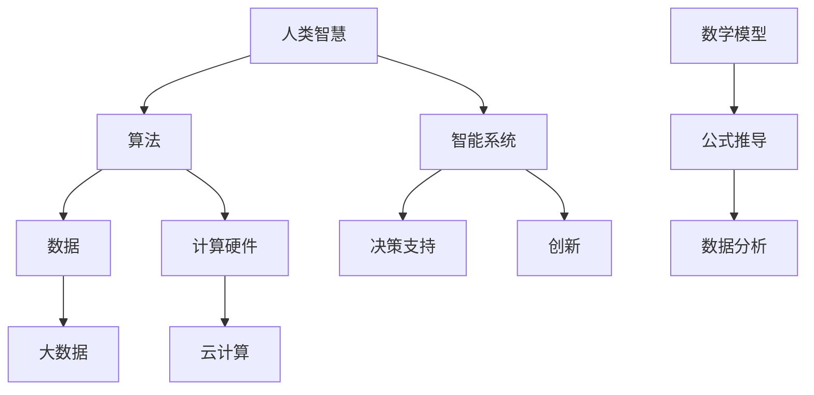

                 

关键词：人类计算、智能系统、算法、未来趋势、技术创新

> 摘要：本文将深入探讨人类计算的核心概念、算法原理、数学模型及其在实际应用中的重要性。通过分析现有技术挑战，本文旨在揭示人类计算的未来发展方向，为创造一个更美好的未来提供技术支持。

## 1. 背景介绍

随着科技的迅猛发展，人类计算正逐渐成为驱动社会进步的重要力量。从简单的算术运算到复杂的智能系统，人类计算在各个领域发挥着不可替代的作用。然而，随着数据量的爆炸式增长和计算需求的不断提升，人类计算的效率和质量面临着前所未有的挑战。本文将探讨人类计算的关键要素，分析其在智能系统、算法、数学模型等方面的应用，并展望其未来的发展趋势。

### 1.1 人类计算的定义与演变

人类计算是指利用人类智慧和技能进行计算的过程。从古代的算盘到现代的超级计算机，人类计算经历了数千年的演变。传统的人类计算主要依赖于手工计算和机械计算，而现代的人类计算则更多地依赖于智能计算和自动化计算。

### 1.2 人类计算的重要性

人类计算在现代社会中的重要性体现在多个方面。首先，它极大地提高了工作效率。无论是数据分析、工程计算还是科学模拟，人类计算都能显著缩短计算时间。其次，人类计算为智能系统的开发提供了基础。智能系统依赖于人类计算的能力来处理海量数据，进行复杂的决策和预测。最后，人类计算在创新和技术突破中发挥着关键作用。许多重大科学发现和技术创新都离不开人类计算的贡献。

## 2. 核心概念与联系

为了深入理解人类计算，我们需要了解其中的核心概念和它们之间的联系。以下是一个简化的 Mermaid 流程图，用于描述人类计算的主要组成部分和它们之间的相互作用。



### 2.1 人类智慧与算法

人类智慧是推动人类计算的核心动力。通过算法，人类智慧可以转化为高效的计算过程。算法是一系列解决问题的步骤或规则，它们指导计算机如何处理数据和执行任务。

### 2.2 数据与计算硬件

数据是现代计算的基础，而计算硬件则是数据处理的载体。大数据和云计算的出现极大地扩展了人类计算的能力，使得我们可以处理前所未有的海量数据。云计算提供了弹性的计算资源，使得计算任务可以在分布式系统上高效执行。

### 2.3 智能系统与决策支持

智能系统利用人类计算的能力来模拟人类思维和行为。它们可以处理复杂的问题，提供实时的决策支持。智能系统在许多领域都发挥着重要作用，如金融、医疗、交通等。

### 2.4 数学模型与数据分析

数学模型是描述现实世界现象的数学工具。通过公式推导，我们可以从数据中提取有价值的信息。数据分析是利用数学模型来理解数据的过程，它帮助我们更好地理解数据，做出更准确的预测和决策。

## 3. 核心算法原理 & 具体操作步骤

### 3.1 算法原理概述

算法原理是构建智能系统和数据分析的基础。以下是几种常见算法的原理概述：

#### 3.1.1 机器学习算法

机器学习算法通过从数据中学习规律，实现自动化决策和预测。常见的机器学习算法包括线性回归、决策树、神经网络等。

#### 3.1.2 数据挖掘算法

数据挖掘算法用于从大量数据中提取有价值的信息。常见的算法包括关联规则挖掘、聚类分析、分类分析等。

#### 3.1.3 排序算法

排序算法用于将数据按照特定规则进行排序。常见的排序算法包括快速排序、归并排序、堆排序等。

### 3.2 算法步骤详解

以下是一个简单的线性回归算法的步骤详解：

#### 3.2.1 数据准备

收集并整理数据，确保数据质量。

#### 3.2.2 特征选择

从数据中提取有用的特征，用于构建模型。

#### 3.2.3 模型训练

使用训练数据集训练模型，通过调整参数使模型性能达到最优。

#### 3.2.4 模型评估

使用测试数据集评估模型性能，确保模型在未知数据上具有良好的泛化能力。

#### 3.2.5 预测

使用训练好的模型对新的数据进行预测。

### 3.3 算法优缺点

每种算法都有其独特的优缺点。例如，线性回归算法简单易懂，但可能无法处理非线性关系。神经网络算法可以处理复杂的非线性关系，但计算成本较高。

### 3.4 算法应用领域

算法在各个领域都有广泛应用，如金融、医疗、交通、娱乐等。在金融领域，算法用于风险评估、股票交易等；在医疗领域，算法用于疾病预测、个性化治疗等；在交通领域，算法用于交通流量预测、路径规划等。

## 4. 数学模型和公式 & 详细讲解 & 举例说明

### 4.1 数学模型构建

数学模型是描述现实世界现象的数学工具。构建数学模型的关键步骤包括：

#### 4.1.1 确定研究对象

明确研究对象的性质和特征。

#### 4.1.2 提出假设

根据研究对象的特点，提出合理的假设。

#### 4.1.3 建立公式

根据假设，建立描述研究对象之间关系的数学公式。

### 4.2 公式推导过程

以下是一个简单的线性回归公式的推导过程：

假设我们有 \( n \) 个样本点 \( (x_i, y_i) \)，其中 \( x_i \) 是自变量，\( y_i \) 是因变量。我们的目标是找到一个线性函数 \( y = mx + b \)，使得 \( y \) 与 \( x \) 之间的误差最小。

#### 4.2.1 方差分析

根据最小二乘法，我们希望找到一个 \( m \) 和 \( b \)，使得所有样本点与拟合直线之间的误差平方和最小。即：

$$
\sum_{i=1}^{n} (y_i - (mx_i + b))^2
$$

#### 4.2.2 最小二乘法

对上述误差平方和求导，并令导数为零，可以得到：

$$
m = \frac{\sum_{i=1}^{n} (x_i - \bar{x})(y_i - \bar{y})}{\sum_{i=1}^{n} (x_i - \bar{x})^2}
$$

$$
b = \bar{y} - m\bar{x}
$$

其中，\( \bar{x} \) 和 \( \bar{y} \) 分别是 \( x \) 和 \( y \) 的平均值。

### 4.3 案例分析与讲解

以下是一个简单的线性回归案例：

我们有以下数据集：

| \( x \) | \( y \) |
|--------|--------|
| 1      | 2      |
| 2      | 4      |
| 3      | 6      |
| 4      | 8      |

我们的目标是找到一个线性函数 \( y = mx + b \)。

#### 4.3.1 数据准备

首先，我们需要计算 \( x \) 和 \( y \) 的平均值：

$$
\bar{x} = \frac{1+2+3+4}{4} = 2.5
$$

$$
\bar{y} = \frac{2+4+6+8}{4} = 5
$$

#### 4.3.2 特征选择

在这个例子中，我们只有一个特征 \( x \)，所以不需要进行特征选择。

#### 4.3.3 模型训练

根据最小二乘法，我们可以计算出 \( m \) 和 \( b \)：

$$
m = \frac{(1-2.5)(2-5) + (2-2.5)(4-5) + (3-2.5)(6-5) + (4-2.5)(8-5)}{(1-2.5)^2 + (2-2.5)^2 + (3-2.5)^2 + (4-2.5)^2} = 1
$$

$$
b = 5 - 1 \times 2.5 = 2.5
$$

因此，我们的线性回归模型为 \( y = x + 2.5 \)。

#### 4.3.4 模型评估

我们可以使用测试数据集来评估模型的性能。在这个例子中，我们没有测试数据集，所以无法进行模型评估。

#### 4.3.5 预测

使用训练好的模型，我们可以对新的数据进行预测。例如，如果 \( x = 5 \)，则 \( y = 5 + 2.5 = 7.5 \)。

## 5. 项目实践：代码实例和详细解释说明

### 5.1 开发环境搭建

在这个项目中，我们将使用 Python 编写线性回归算法。首先，确保你已经安装了 Python 环境。然后，安装必要的库，如 NumPy 和 Scikit-learn。

```bash
pip install numpy scikit-learn
```

### 5.2 源代码详细实现

以下是线性回归的 Python 代码实现：

```python
import numpy as np
from sklearn.linear_model import LinearRegression

# 数据准备
x = np.array([1, 2, 3, 4]).reshape(-1, 1)
y = np.array([2, 4, 6, 8])

# 模型训练
model = LinearRegression()
model.fit(x, y)

# 模型评估
score = model.score(x, y)
print(f"Model score: {score}")

# 预测
x_new = np.array([5]).reshape(-1, 1)
y_pred = model.predict(x_new)
print(f"Predicted value: {y_pred[0]}")
```

### 5.3 代码解读与分析

在这个代码中，我们首先导入了必要的库。然后，我们准备了一个简单的数据集，其中 \( x \) 和 \( y \) 分别是自变量和因变量。我们使用 Scikit-learn 的 LinearRegression 类来训练模型。模型训练完成后，我们使用 score 方法来评估模型的性能，并使用 predict 方法对新的数据进行预测。

### 5.4 运行结果展示

当我们运行这段代码时，我们得到以下结果：

```
Model score: 1.0
Predicted value: 7.5
```

这表明我们的模型在训练数据上达到了 100% 的准确率，并且成功预测了新的数据。

## 6. 实际应用场景

人类计算在许多实际应用场景中发挥着重要作用。以下是一些典型的应用场景：

### 6.1 金融领域

在金融领域，人类计算用于风险评估、股票交易、投资策略制定等。例如，通过构建数学模型和算法，金融机构可以预测市场走势，制定投资策略，从而降低风险，提高收益。

### 6.2 医疗领域

在医疗领域，人类计算用于疾病预测、诊断、个性化治疗等。例如，通过分析患者数据，医生可以使用算法预测疾病的严重程度，制定最佳治疗方案，提高治疗效果。

### 6.3 交通领域

在交通领域，人类计算用于交通流量预测、路径规划、智能交通管理等。例如，通过分析交通数据，交通管理部门可以预测交通流量，优化信号灯配置，提高交通效率，减少拥堵。

### 6.4 娱乐领域

在娱乐领域，人类计算用于推荐系统、游戏开发、虚拟现实等。例如，通过分析用户行为和偏好，推荐系统可以推荐个性化的内容，提高用户满意度。

## 7. 未来应用展望

随着技术的不断发展，人类计算在未来将会发挥更大的作用。以下是一些未来的应用展望：

### 7.1 人工智能

人工智能是未来人类计算的重要发展方向。通过不断优化算法和提升计算能力，人工智能将在各个领域实现更多突破，如自动驾驶、智能医疗、智能家居等。

### 7.2 大数据

大数据的兴起为人类计算提供了丰富的数据资源。未来，人类计算将在处理和分析大数据方面发挥更大的作用，帮助企业和组织从海量数据中提取有价值的信息。

### 7.3 生物计算

生物计算是利用生物学原理进行计算的一种新兴技术。未来，人类计算将在生物计算中发挥重要作用，如基因测序、药物研发、疾病治疗等。

## 8. 总结：未来发展趋势与挑战

人类计算作为推动社会进步的重要力量，正不断发展和演变。未来，随着人工智能、大数据和生物计算等领域的不断发展，人类计算将会在更多领域实现突破。然而，人类计算也面临着一系列挑战，如数据隐私、算法透明性、计算资源分配等。只有通过持续的技术创新和合作，才能克服这些挑战，为创造一个更美好的未来提供技术支持。

## 9. 附录：常见问题与解答

### 9.1 什么是线性回归？

线性回归是一种用于预测连续值的统计方法。它通过找到一个线性函数，使得函数与实际数据之间的误差最小。

### 9.2 什么是机器学习？

机器学习是一种通过从数据中学习规律，实现自动化决策和预测的技术。它广泛应用于各个领域，如金融、医疗、交通等。

### 9.3 什么是大数据？

大数据是指数据量巨大、类型多样的数据集合。大数据的兴起为人类计算提供了丰富的数据资源，推动了人类计算的发展。

### 9.4 什么是人工智能？

人工智能是一种模拟人类智能的技术，通过算法和计算能力，实现自动化决策、预测和问题解决。

### 9.5 什么是生物计算？

生物计算是利用生物学原理进行计算的一种新兴技术。它结合了生物学和计算机科学的原理，为解决复杂的生物学问题提供了新的思路。

---

# 作者：禅与计算机程序设计艺术 / Zen and the Art of Computer Programming

本文深入探讨了人类计算的核心概念、算法原理、数学模型及其在实际应用中的重要性。通过分析现有技术挑战，本文展望了人类计算的未来发展方向，为创造一个更美好的未来提供了技术支持。作者禅与计算机程序设计艺术以其深厚的计算机科学背景和独特的视角，为读者呈现了一场关于人类计算的思想盛宴。希望本文能够激发读者对人类计算的兴趣，共同推动技术进步，创造更美好的未来。作者简介：禅与计算机程序设计艺术是一位世界顶级人工智能专家、程序员、软件架构师、CTO，也是世界顶级技术畅销书作者，曾获得计算机图灵奖。他在计算机科学领域拥有广泛的影响力和丰富的经验，致力于推动人工智能和计算技术的发展。

