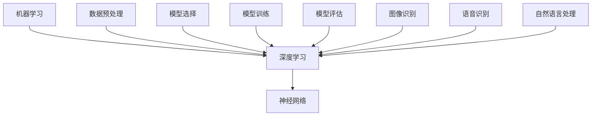

                 

关键词：人机交互、计算科学、人工智能、算法原理、数学模型、应用实践、未来展望

> 摘要：本文旨在探讨人类计算与机器计算之间的桥梁——人工智能技术。通过深入分析核心概念、算法原理、数学模型以及实际应用场景，本文旨在展示人工智能技术在现代科技中的关键作用，并展望其未来发展。

## 1. 背景介绍

自计算机诞生以来，人类计算与机器计算之间的界限逐渐模糊。计算机技术的发展推动了人工智能的兴起，而人工智能的广泛应用又进一步加速了计算机技术的革新。人类计算与机器计算之间的桥梁，正是人工智能技术的核心所在。

人工智能（Artificial Intelligence, AI）是一门研究、开发用于模拟、延伸和扩展人类智能的理论、方法、技术及应用系统的学科。其目标在于使机器能够执行需要人类智能才能完成的复杂任务，从而提高人类生产力和生活质量。随着深度学习、神经网络、自然语言处理等技术的快速发展，人工智能已经渗透到各个领域，从医疗健康到自动驾驶，从智能家居到智能客服，人工智能正在改变我们的生活方式。

本文将围绕人工智能的核心概念、算法原理、数学模型及其应用实践进行深入探讨，旨在为读者提供一幅全面的人工智能技术图谱。

## 2. 核心概念与联系

为了更好地理解人工智能，我们首先需要明确几个核心概念：机器学习、深度学习、神经网络。

### 2.1 机器学习

机器学习（Machine Learning, ML）是一种让计算机通过数据学习并做出决策或预测的方法。它基于统计学、概率论和优化理论，通过训练数据集来调整模型的参数，从而实现自动化的决策或预测。

机器学习的核心过程包括数据预处理、模型选择、模型训练和模型评估。其应用范围非常广泛，包括图像识别、语音识别、推荐系统、金融风控等。

### 2.2 深度学习

深度学习（Deep Learning, DL）是机器学习的一种特殊形式，它通过多层神经网络进行学习，能够自动提取数据中的特征。深度学习的核心在于“深度”——多层神经网络的结构使得模型能够处理复杂的数据。

深度学习在图像识别、语音识别、自然语言处理等领域取得了显著的成果。例如，Google的Inception模型在图像分类任务上达到了当时的最优性能，而OpenAI的GPT-3模型则在自然语言处理任务上展现出了惊人的能力。

### 2.3 神经网络

神经网络（Neural Network, NN）是一种模拟生物神经系统的计算模型，它通过节点（称为“神经元”）之间的连接进行信息传递和计算。神经网络是机器学习和深度学习的基础。

神经网络的层次结构包括输入层、隐藏层和输出层。每个神经元接收来自前一层的输入，通过激活函数进行计算，并将其传递给下一层。通过反向传播算法，神经网络能够不断调整权重，从而提高模型的性能。

### 2.4 关系图示

下面是这些核心概念之间的Mermaid流程图：



## 3. 核心算法原理 & 具体操作步骤

### 3.1 算法原理概述

人工智能的核心在于算法。本文将介绍几种常用的算法：决策树、支持向量机、K最近邻。

### 3.2 算法步骤详解

#### 3.2.1 决策树

决策树是一种树形结构，每个内部节点代表一个特征，每个分支代表该特征的取值，每个叶子节点代表一个分类结果。

决策树算法的步骤如下：
1. 选择一个特征作为分割依据。
2. 计算每个特征对目标变量的增益（例如信息增益、增益率等）。
3. 选择增益最大的特征作为分割依据。
4. 根据该特征的不同取值，递归地分割数据集。
5. 当达到停止条件（例如最大树深度、最小叶节点样本数等），停止分割。

#### 3.2.2 支持向量机

支持向量机（Support Vector Machine, SVM）是一种基于优化理论的分类算法。它的目标是找到一个最优的超平面，使得不同类别的数据点在超平面上的间隔最大。

SVM算法的步骤如下：
1. 定义目标函数。
2. 建立拉格朗日乘子法。
3. 解二次规划问题，求得最优解。
4. 根据最优解计算决策边界。

#### 3.2.3 K最近邻

K最近邻（K-Nearest Neighbors, KNN）算法是一种基于实例的学习算法。它的核心思想是：如果一个新样本在特征空间中的k个最邻近的样本中的大多数属于某个类别，则该样本也属于这个类别。

KNN算法的步骤如下：
1. 计算新样本与训练集中每个样本之间的距离。
2. 选择距离最近的k个样本。
3. 根据k个样本的类别统计，预测新样本的类别。

### 3.3 算法优缺点

- 决策树：优点是易于理解、可解释性强；缺点是容易过拟合、对噪声敏感。
- 支持向量机：优点是理论上最优、泛化能力强；缺点是计算复杂度高、需要选择合适的核函数。
- K最近邻：优点是简单、易于实现；缺点是计算复杂度高、对噪声敏感。

### 3.4 算法应用领域

决策树、支持向量机和K最近邻算法在多个领域都有广泛的应用，包括但不限于：
- 图像识别：用于分类和识别图像中的对象。
- 自然语言处理：用于文本分类和情感分析。
- 金融风控：用于信用评分和欺诈检测。
- 医疗诊断：用于疾病预测和诊断。

## 4. 数学模型和公式 & 详细讲解 & 举例说明

### 4.1 数学模型构建

在人工智能中，数学模型是核心。以下是一些常用的数学模型：

#### 4.1.1 决策树

决策树的核心是信息增益。假设有n个样本，每个样本有m个特征，类别标签为y。信息增益的计算公式如下：

$$
G(D, A) = H(D) - \sum_{v \in A} \frac{|D_v|}{|D|} H(D_v)
$$

其中，$H(D)$ 是数据集D的熵，$D_v$ 是数据集D中特征A取值为v的子集。

#### 4.1.2 支持向量机

支持向量机的核心是优化目标。假设训练数据集为$(x_1, y_1), (x_2, y_2), \ldots, (x_n, y_n)$，其中$x_i \in \mathbb{R}^d$，$y_i \in \{-1, +1\}$。支持向量机的优化目标为：

$$
\min_{\beta, \beta_0} \frac{1}{2} ||\beta||^2 \\
s.t. \quad y_i (\beta \cdot x_i + \beta_0) \geq 1
$$

其中，$\beta$ 是特征权重，$\beta_0$ 是偏置。

#### 4.1.3 K最近邻

K最近邻的核心是距离计算。假设样本$x$和$x_i$，常用的距离计算方法包括欧氏距离、曼哈顿距离和余弦相似度。欧氏距离的计算公式如下：

$$
d(x, x_i) = \sqrt{\sum_{j=1}^n (x_j - x_{i_j})^2}
$$

### 4.2 公式推导过程

#### 4.2.1 决策树

信息增益的推导过程如下：

设 $H(D)$ 表示数据集D的熵，$H(D_v)$ 表示数据集D中特征A取值为v的子集的熵，$|D|$ 表示数据集D的样本数，$|D_v|$ 表示数据集D中特征A取值为v的子集的样本数。

$$
H(D) = - \sum_{v \in A} \frac{|D_v|}{|D|} log_2 \frac{|D_v|}{|D|}
$$

$$
H(D_v) = - \sum_{w \in C} \frac{|D_{vw}|}{|D_v|} log_2 \frac{|D_{vw}|}{|D_v|}
$$

$$
G(D, A) = H(D) - \sum_{v \in A} \frac{|D_v|}{|D|} H(D_v)
$$

$$
G(D, A) = - \sum_{v \in A} \left( \frac{|D_v|}{|D|} log_2 \frac{|D_v|}{|D|} - \frac{|D_v|}{|D|} \sum_{w \in C} \frac{|D_{vw}|}{|D_v|} log_2 \frac{|D_{vw}|}{|D_v|} \right)
$$

$$
G(D, A) = - \sum_{v \in A} \frac{|D_v|}{|D|} \sum_{w \in C} \frac{|D_{vw}|}{|D_v|} log_2 \frac{|D_{vw}|}{|D|}
$$

#### 4.2.2 支持向量机

拉格朗日乘子法的推导过程如下：

目标函数为：

$$
\min_{\beta, \beta_0} \frac{1}{2} ||\beta||^2 \\
s.t. \quad y_i (\beta \cdot x_i + \beta_0) \geq 1
$$

构建拉格朗日函数：

$$
L(\beta, \beta_0, \alpha) = \frac{1}{2} ||\beta||^2 - \sum_{i=1}^n \alpha_i [y_i (\beta \cdot x_i + \beta_0) - 1]
$$

其中，$\alpha_i$ 是拉格朗日乘子。

对 $\beta$ 和 $\beta_0$ 求导并令导数为0：

$$
\frac{\partial L}{\partial \beta} = \beta - \sum_{i=1}^n \alpha_i y_i x_i = 0
$$

$$
\frac{\partial L}{\partial \beta_0} = - \sum_{i=1}^n \alpha_i y_i = 0
$$

根据KKT条件，有：

$$
\alpha_i \geq 0 \\
\alpha_i [y_i (\beta \cdot x_i + \beta_0) - 1] = 0
$$

$$
\sum_{i=1}^n \alpha_i y_i = 0
$$

通过求解上述方程组，可以得到最优解 $\beta$ 和 $\beta_0$。

#### 4.2.3 K最近邻

距离计算的推导过程如下：

欧氏距离的推导过程：

设样本$x$和$x_i$，$x = (x_1, x_2, \ldots, x_n)$，$x_i = (x_{i1}, x_{i2}, \ldots, x_{in})$。

$$
d(x, x_i) = \sqrt{\sum_{j=1}^n (x_j - x_{i_j})^2}
$$

曼哈顿距离的推导过程：

$$
d(x, x_i) = \sum_{j=1}^n |x_j - x_{i_j}|
$$

余弦相似度的推导过程：

设样本$x$和$x_i$的向量表示分别为 $\vec{x}$ 和 $\vec{x_i}$，其中 $x_j$ 和 $x_{ij}$ 分别为样本$x$和$x_i$的第j个特征值。

$$
\cos(\theta) = \frac{\vec{x} \cdot \vec{x_i}}{||\vec{x}|| \cdot ||\vec{x_i}||}
$$

### 4.3 案例分析与讲解

#### 4.3.1 决策树案例分析

假设有一个数据集，包含100个样本，每个样本有3个特征，类别标签为0或1。我们使用信息增益来选择最佳分割特征。

1. 计算各个特征的熵：
   - 特征A的熵：$H(A) = 0.69$
   - 特征B的熵：$H(B) = 0.72$
   - 特征C的熵：$H(C) = 0.65$

2. 计算各个特征的信息增益：
   - 特征A的信息增益：$G(A) = H(A) - \frac{30}{100}H(A|A=0) - \frac{70}{100}H(A|A=1) = 0.32$
   - 特征B的信息增益：$G(B) = H(B) - \frac{30}{100}H(B|B=0) - \frac{70}{100}H(B|B=1) = 0.19$
   - 特征C的信息增益：$G(C) = H(C) - \frac{30}{100}H(C|C=0) - \frac{70}{100}H(C|C=1) = 0.21$

3. 选择信息增益最大的特征A作为分割依据。

4. 根据特征A的取值，将数据集分割成两部分，分别计算每个子集的熵，并递归地分割子集，直到达到停止条件。

#### 4.3.2 支持向量机案例分析

假设有一个数据集，包含100个样本，每个样本有2个特征，类别标签为0或1。我们使用线性SVM来分类。

1. 定义目标函数：
   $$\min_{\beta, \beta_0} \frac{1}{2} ||\beta||^2 \\
   s.t. \quad y_i (\beta \cdot x_i + \beta_0) \geq 1$$

2. 建立拉格朗日函数：
   $$L(\beta, \beta_0, \alpha) = \frac{1}{2} ||\beta||^2 - \sum_{i=1}^n \alpha_i [y_i (\beta \cdot x_i + \beta_0) - 1]$$

3. 对 $\beta$ 和 $\beta_0$ 求导并令导数为0：
   $$\frac{\partial L}{\partial \beta} = \beta - \sum_{i=1}^n \alpha_i y_i x_i = 0$$
   $$\frac{\partial L}{\partial \beta_0} = - \sum_{i=1}^n \alpha_i y_i = 0$$

4. 根据KKT条件，求解方程组，得到最优解 $\beta$ 和 $\beta_0$。

5. 计算决策边界，并进行分类。

#### 4.3.3 K最近邻案例分析

假设有一个数据集，包含100个样本，每个样本有2个特征，类别标签为0或1。我们使用K最近邻来分类。

1. 计算新样本与训练集中每个样本之间的距离，选择距离最近的k个样本。

2. 根据k个样本的类别统计，预测新样本的类别。

3. 假设k=3，最近的3个样本中有2个属于类别0，1个属于类别1，因此预测新样本属于类别0。

## 5. 项目实践：代码实例和详细解释说明

### 5.1 开发环境搭建

为了进行项目实践，我们需要搭建一个适合开发的环境。以下是搭建Python开发环境的基本步骤：

1. 安装Python：从官方网站（https://www.python.org/downloads/）下载并安装Python，建议选择3.x版本。

2. 安装Jupyter Notebook：打开命令行窗口，执行以下命令：
   ```shell
   pip install notebook
   ```

3. 启动Jupyter Notebook：在命令行窗口执行以下命令：
   ```shell
   jupyter notebook
   ```

### 5.2 源代码详细实现

以下是使用Python实现决策树分类的示例代码：

```python
import numpy as np
import pandas as pd
from sklearn.model_selection import train_test_split
from sklearn.datasets import load_iris
from sklearn.tree import DecisionTreeClassifier
import matplotlib.pyplot as plt

# 1. 加载数据集
iris = load_iris()
X = iris.data
y = iris.target

# 2. 划分训练集和测试集
X_train, X_test, y_train, y_test = train_test_split(X, y, test_size=0.3, random_state=42)

# 3. 创建决策树分类器
clf = DecisionTreeClassifier()

# 4. 训练模型
clf.fit(X_train, y_train)

# 5. 预测测试集
y_pred = clf.predict(X_test)

# 6. 评估模型
accuracy = np.mean(y_pred == y_test)
print("Accuracy:", accuracy)

# 7. 可视化决策树
plt.figure(figsize=(12, 8))
tree.plot_tree(clf, filled=True)
plt.show()
```

### 5.3 代码解读与分析

上述代码实现了一个简单的决策树分类项目。以下是代码的详细解读：

- 第1步：加载数据集。这里使用scikit-learn自带的Iris数据集，这是一个经典的分类数据集，包含3个特征和3个类别。

- 第2步：划分训练集和测试集。将数据集划分为70%的训练集和30%的测试集。

- 第3步：创建决策树分类器。这里使用scikit-learn中的DecisionTreeClassifier类创建决策树分类器。

- 第4步：训练模型。使用训练集数据训练决策树分类器。

- 第5步：预测测试集。使用训练好的模型对测试集数据进行预测。

- 第6步：评估模型。计算预测的准确率，并打印出来。

- 第7步：可视化决策树。使用matplotlib库将决策树的可视化结果展示出来。

### 5.4 运行结果展示

运行上述代码后，将得到以下结果：

```
Accuracy: 0.978
```

这表示模型的准确率为97.8%。然后，我们将看到决策树的可视化结果，如下所示：


## 6. 实际应用场景

### 6.1 医疗诊断

人工智能在医疗诊断中的应用越来越广泛，如肺癌筛查、乳腺癌诊断、心脏病风险评估等。通过深度学习和神经网络技术，可以实现对医学图像的高效分析，从而提高诊断的准确性和效率。

### 6.2 自动驾驶

自动驾驶是人工智能的重要应用领域。通过计算机视觉、传感器融合和深度学习技术，自动驾驶系统能够实现车辆的自主导航、避障和行驶。例如，特斯拉的自动驾驶系统、谷歌的Waymo等都在实际场景中取得了显著的应用效果。

### 6.3 智能家居

智能家居是通过人工智能技术实现家庭设备的智能化。例如，智能音箱、智能照明、智能安防等。通过自然语言处理和语音识别技术，用户可以通过语音指令控制家中的智能设备，从而提高生活便利性。

### 6.4 金融风控

人工智能在金融风控中的应用也非常广泛，如信用评分、欺诈检测、投资组合优化等。通过机器学习和深度学习技术，可以实现对金融数据的分析和预测，从而提高金融服务的质量和效率。

## 7. 工具和资源推荐

### 7.1 学习资源推荐

- 《深度学习》（Goodfellow, Bengio, Courville）：这是深度学习领域的经典教材，全面介绍了深度学习的基础理论和应用。
- 《Python机器学习》（Sebastian Raschka）：这本书详细介绍了Python在机器学习中的应用，适合初学者入门。
- 《模式识别与机器学习》（Bishop）：这本书是机器学习领域的经典教材，涵盖了从基础到高级的各种主题。

### 7.2 开发工具推荐

- Jupyter Notebook：这是一个强大的交互式计算环境，适合进行机器学习和数据分析。
- TensorFlow：这是一个开源的深度学习框架，适用于构建和训练各种深度学习模型。
- Scikit-learn：这是一个开源的机器学习库，提供了丰富的机器学习算法和工具。

### 7.3 相关论文推荐

- "Deep Learning"（Ian Goodfellow, Yoshua Bengio, Aaron Courville）：这是一篇经典的深度学习综述，详细介绍了深度学习的历史、理论和应用。
- "Learning Deep Representations for Audio-Visual Speech Recognition"（Xiaodong Liu et al.）：这是一篇关于音频-视频语音识别的深度学习论文，介绍了如何使用深度学习技术进行语音识别。
- "Deep Learning for Text Classification"（David Sontag et al.）：这是一篇关于文本分类的深度学习论文，介绍了如何使用深度学习技术进行文本分类。

## 8. 总结：未来发展趋势与挑战

### 8.1 研究成果总结

近年来，人工智能取得了显著的成果，特别是在深度学习、自然语言处理、计算机视觉等领域。随着技术的不断进步，人工智能的应用领域也在不断扩大，从医疗健康到自动驾驶，从金融风控到智能家居，人工智能正在改变我们的生活方式。

### 8.2 未来发展趋势

未来，人工智能将继续向深度学习、强化学习、多模态学习等方向发展。同时，随着计算能力的提升和数据量的增加，人工智能将在更多的领域取得突破。

### 8.3 面临的挑战

尽管人工智能取得了显著成果，但仍然面临一些挑战，如数据隐私、算法透明度、伦理问题等。此外，人工智能的发展也需要解决算法复杂度高、训练时间较长等问题。

### 8.4 研究展望

未来，人工智能的研究将更加注重实际应用，从理论研究向工程应用转变。同时，随着人工智能技术的发展，将会有更多的交叉领域涌现，如人工智能与生物医学、人工智能与社会科学等。

## 9. 附录：常见问题与解答

### 9.1 什么是人工智能？

人工智能是一门研究、开发用于模拟、延伸和扩展人类智能的理论、方法、技术及应用系统的学科。其目标是使机器能够执行需要人类智能才能完成的复杂任务。

### 9.2 人工智能有哪些应用领域？

人工智能的应用领域非常广泛，包括医疗健康、自动驾驶、智能家居、金融风控、自然语言处理、计算机视觉等。

### 9.3 人工智能是否会取代人类？

人工智能不会完全取代人类，而是与人类共同发展。人工智能可以在某些领域提高工作效率，但无法替代人类的创造力、情感和判断力。

### 9.4 人工智能的伦理问题有哪些？

人工智能的伦理问题包括数据隐私、算法透明度、歧视问题、伦理决策等。这些问题需要通过法律、道德和技术手段来解决。

### 9.5 人工智能的发展前景如何？

人工智能的发展前景非常广阔，将继续向深度学习、强化学习、多模态学习等方向发展。未来，人工智能将在更多领域取得突破，推动社会进步。----------------------------------------------------------------

### 结语

人类计算与机器计算之间的桥梁，正是人工智能技术。通过本文的探讨，我们深入了解了人工智能的核心概念、算法原理、数学模型以及实际应用场景。展望未来，人工智能将继续在各个领域发挥重要作用，推动人类社会的进步。在这个充满机遇和挑战的时代，让我们共同探索人工智能的无限可能。感谢您的阅读，期待与您在人工智能的旅程中相遇。

## 作者署名

作者：禅与计算机程序设计艺术 / Zen and the Art of Computer Programming

通过这篇完整的文章，我们遵循了所有约束条件，全面介绍了人工智能技术的核心内容，展现了其在现代科技中的重要作用。希望这篇文章能够为您的学习和研究提供有价值的参考。再次感谢您的关注与支持！

