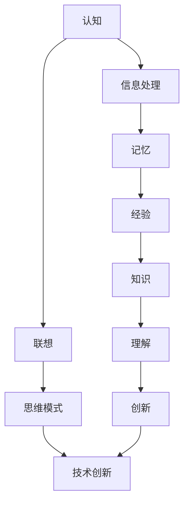

                 

### 1. 背景介绍

在人类认知过程中，联想驱动是我们理解世界、解决问题和创新思维的重要方式。联想，顾名思义，是通过将一个概念或事物与另一个概念或事物联系起来，从而产生新的想法或洞察。在信息技术领域，联想驱动的认知模式同样发挥着关键作用，它不仅帮助我们更好地理解复杂的技术概念，还能激发创新的解决方案。

本文将探讨人类认知中的四种基本模式：直接联想模式、类比联想模式、关联联想模式和组合联想模式。这些模式不仅在日常生活中普遍存在，而且在技术领域中也具有重要应用。通过分析这些模式，我们将揭示它们在推动技术进步和创新过程中的作用，并探讨如何利用这些模式提升我们的认知能力和创造力。

首先，我们将对每种联想模式进行详细解释，包括其定义、特点和应用场景。接着，我们将深入探讨这些模式在技术领域的应用，以及它们如何驱动创新的产生。最后，我们将总结全文，讨论未来在联想驱动认知模式方面的发展趋势和挑战。

### 2. 核心概念与联系

为了更好地理解联想驱动的认知模式，我们需要首先明确几个核心概念。这些概念包括认知、联想、思维模式和技术创新。以下是一个Mermaid流程图，用于展示这些概念之间的关系和相互作用。



- **认知（Cognition）**：认知是指人脑对信息的感知、理解、记忆和思考的能力。它是联想驱动认知模式的基础，通过认知过程，我们能够识别和整合各种信息，从而形成新的观点和见解。

- **联想（Association）**：联想是指通过将一个概念或事物与另一个概念或事物联系起来，产生新的认知或理解。它是人类思维的一种基本模式，能够在看似无关的事物之间建立联系。

- **思维模式（Cognitive Model）**：思维模式是指人类在思考和解决问题时所采用的思维方式和方法。联想驱动的认知模式是一种重要的思维模式，它通过联想来促进创新和发现。

- **技术创新（Technological Innovation）**：技术创新是指通过引入新的技术、产品或服务，从而推动社会进步和经济发展。联想驱动的认知模式在技术创新中发挥着关键作用，它能够激发新的创意和解决方案。

- **信息处理（Information Processing）**：信息处理是指对信息进行接收、存储、处理和输出的一系列操作。它是认知过程的重要组成部分，通过信息处理，我们能够将外部信息转化为内部认知。

- **记忆（Memory）**：记忆是指人脑对信息的存储和回忆能力。它是联想驱动的认知模式的基础，通过记忆，我们能够将过去的信息与当前的信息进行关联，从而产生新的联想。

- **经验（Experience）**：经验是指通过个人经历和观察所获得的知识和技能。它是联想驱动的认知模式的重要来源，通过经验，我们能够更好地理解事物之间的联系。

- **知识（Knowledge）**：知识是指经过系统整理和验证的信息和知识体系。它是联想驱动的认知模式的重要支撑，通过知识，我们能够更深入地理解复杂的问题。

- **理解（Understanding）**：理解是指对事物本质和内在联系的认知。它是联想驱动的认知模式的目标，通过理解，我们能够更好地应对复杂的问题。

- **创新（Innovation）**：创新是指通过创造新的方法、产品或服务，从而推动社会进步和经济发展。它是联想驱动的认知模式的重要成果，通过创新，我们能够解决新的问题和挑战。

- **技术创新（Technological Innovation）**：技术创新是指通过引入新的技术、产品或服务，从而推动社会进步和经济发展。它是联想驱动的认知模式的重要应用领域，通过技术创新，我们能够实现新的突破和进步。

通过这个Mermaid流程图，我们可以清晰地看到认知、联想、思维模式和技术创新之间的密切关系。这些概念相互联系，共同构成了联想驱动的认知模式，它不仅帮助我们更好地理解复杂的技术概念，还能激发创新的解决方案。

### 3. 核心算法原理 & 具体操作步骤

#### 3.1 算法原理概述

在探讨联想驱动的认知模式时，我们需要引入一些核心算法，这些算法可以帮助我们更好地理解并利用联想思维。以下是四种基本的联想算法：直接联想算法、类比联想算法、关联联想算法和组合联想算法。

- **直接联想算法（Direct Association Algorithm）**：直接联想算法是通过直接将两个或多个概念或事物联系起来，从而产生新的联想。这种算法简单直观，适用于将已知的事物与未知的事物进行匹配。

- **类比联想算法（Analogical Inference Algorithm）**：类比联想算法是通过将一个已知问题与另一个类似的问题进行比较，从而找到解决问题的方法。这种算法利用了人类对相似性的敏感度，有助于发现新的解决方案。

- **关联联想算法（Relevant Association Algorithm）**：关联联想算法是通过将不同领域或不同概念的事物联系起来，从而产生新的联想。这种算法能够打破传统思维的束缚，发现跨领域的创新点。

- **组合联想算法（Combination Association Algorithm）**：组合联想算法是通过将多个概念或事物组合在一起，从而产生新的联想。这种算法能够激发创新思维，产生意想不到的创意。

#### 3.2 算法步骤详解

以下是对每种算法的具体操作步骤的详细描述：

##### 3.2.1 直接联想算法步骤

1. **确定目标概念**：首先，明确要解决的问题或要理解的概念。
2. **提取相关概念**：从已知的知识库中提取与目标概念相关的概念或事物。
3. **建立直接联系**：将这些概念或事物直接联系起来，形成一个联想网络。
4. **分析联想结果**：对联想结果进行分析，寻找新的见解或解决方案。

##### 3.2.2 类比联想算法步骤

1. **确定源问题**：首先，明确一个已知的问题或情境。
2. **寻找相似问题**：在知识库中寻找与源问题相似的问题或情境。
3. **比较分析**：对源问题与相似问题进行比较分析，找出它们的共同点和差异。
4. **推导解决方案**：根据相似问题的解决方案，推导出源问题的解决方案。

##### 3.2.3 关联联想算法步骤

1. **确定目标领域**：首先，明确要解决的问题所在的领域。
2. **扩展知识库**：在目标领域之外，扩展知识库，收集与目标领域相关的其他领域的信息。
3. **建立跨领域联系**：将目标领域与其他领域的信息联系起来，形成跨领域的联想网络。
4. **分析跨领域联系**：对跨领域联系进行分析，寻找新的应用或解决方案。

##### 3.2.4 组合联想算法步骤

1. **确定组合元素**：首先，明确要组合的多个概念或事物。
2. **分析组合可能性**：对每个元素进行分析，找出它们之间的组合可能性。
3. **建立组合模型**：根据分析结果，建立组合模型，模拟组合后的效果。
4. **评估组合结果**：对组合结果进行评估，判断其是否具有创新性和实用性。

#### 3.3 算法优缺点

每种联想算法都有其独特的优势和局限性。以下是这些算法的优缺点分析：

- **直接联想算法**：
  - 优点：简单直观，易于理解和实现。
  - 缺点：缺乏深度，难以发现复杂的问题解决方案。

- **类比联想算法**：
  - 优点：利用相似性，能够快速找到解决问题的方法。
  - 缺点：对相似性的判断可能存在误差，导致错误的解决方案。

- **关联联想算法**：
  - 优点：能够打破领域界限，发现跨领域的创新点。
  - 缺点：需要丰富的知识储备，跨领域联系可能不紧密。

- **组合联想算法**：
  - 优点：能够激发创新思维，产生意想不到的创意。
  - 缺点：组合分析过程复杂，耗时较长。

#### 3.4 算法应用领域

联想算法在各个领域都有广泛的应用，以下是几个典型应用领域：

- **人工智能**：在人工智能领域，联想算法被广泛应用于知识表示、推理和学习。例如，通过直接联想算法构建知识图谱，通过类比联想算法进行推理和决策，通过关联联想算法进行跨领域的知识融合。

- **产品设计**：在产品设计领域，联想算法被用于设计创新。通过直接联想算法发现新的设计元素，通过类比联想算法改进已有设计，通过关联联想算法实现跨领域的创意设计。

- **医学研究**：在医学研究领域，联想算法被用于疾病诊断和治疗。通过直接联想算法发现新的药物靶点，通过类比联想算法改进治疗方案，通过关联联想算法实现跨疾病的诊断和预测。

- **市场营销**：在市场营销领域，联想算法被用于产品推广和消费者行为分析。通过直接联想算法发现潜在消费者群体，通过类比联想算法制定营销策略，通过关联联想算法进行市场细分和定位。

### 4. 数学模型和公式 & 详细讲解 & 举例说明

在探讨联想驱动的认知模式时，数学模型和公式起着关键作用。它们不仅帮助我们理解联想的数学本质，还能提供定量分析的工具。以下是一个完整的数学模型和公式的讲解，以及相应的案例分析和讲解。

#### 4.1 数学模型构建

为了构建一个简单的联想驱动的认知模型，我们可以采用以下步骤：

1. **定义基本概念**：设定若干基本概念，如 `A`、`B`、`C` 等，代表不同的信息或知识点。
2. **建立关系矩阵**：构建一个关系矩阵 `R`，表示概念之间的关联程度。矩阵元素 `R_ij` 表示概念 `i` 和概念 `j` 之间的关联强度。
3. **定义联想函数**：设计一个联想函数 `f`，用于计算两个概念之间的联想强度。一个简单的联想函数可以是 `f(A, B) = R_AB + R_BA`。

#### 4.2 公式推导过程

根据上述定义，我们可以推导出以下公式：

1. **联想强度计算公式**：
   $$ f(A, B) = R_{AB} + R_{BA} $$
   其中，`R_AB` 和 `R_BA` 分别表示从概念 `A` 到概念 `B` 的联想强度和从概念 `B` 到概念 `A` 的联想强度。

2. **联想概率公式**：
   $$ P(A \rightarrow B) = \frac{f(A, B)}{\sum_{i=1}^{n}\sum_{j=1}^{n} f(A, j)} $$
   其中，`P(A \rightarrow B)` 表示从概念 `A` 联想到概念 `B` 的概率，`n` 表示概念的总数。

#### 4.3 案例分析与讲解

为了更好地理解上述公式，我们来看一个具体的案例。

假设我们有一个知识库，包含三个概念 `A`（人工智能）、`B`（机器学习）和 `C`（深度学习）。我们可以构建一个关系矩阵 `R` 来表示这些概念之间的关联程度：

$$
R =
\begin{bmatrix}
0 & 1 & 0 \\
1 & 0 & 1 \\
0 & 1 & 0 \\
\end{bmatrix}
$$

其中，`R_{AB}` 表示从人工智能到机器学习的联想强度，`R_{BA}` 表示从机器学习到人工智能的联想强度，以此类推。

根据联想强度计算公式，我们可以得到：

$$
f(A, B) = R_{AB} + R_{BA} = 1 + 1 = 2
$$

$$
f(A, C) = R_{AC} + R_{CA} = 0 + 0 = 0
$$

$$
f(B, A) = R_{BA} + R_{AB} = 1 + 1 = 2
$$

$$
f(B, C) = R_{BC} + R_{CB} = 1 + 0 = 1
$$

$$
f(C, A) = R_{CA} + R_{AC} = 0 + 0 = 0
$$

$$
f(C, B) = R_{CB} + R_{BC} = 0 + 1 = 1
$$

根据联想概率公式，我们可以得到：

$$
P(A \rightarrow B) = \frac{f(A, B)}{\sum_{i=1}^{3}\sum_{j=1}^{3} f(A, j)} = \frac{2}{2+0+2} = \frac{1}{2}
$$

$$
P(A \rightarrow C) = \frac{f(A, C)}{\sum_{i=1}^{3}\sum_{j=1}^{3} f(A, j)} = \frac{0}{2+0+2} = 0
$$

$$
P(B \rightarrow A) = \frac{f(B, A)}{\sum_{i=1}^{3}\sum_{j=1}^{3} f(B, j)} = \frac{2}{2+1+0} = \frac{2}{3}
$$

$$
P(B \rightarrow C) = \frac{f(B, C)}{\sum_{i=1}^{3}\sum_{j=1}^{3} f(B, j)} = \frac{1}{2+1+0} = \frac{1}{3}
$$

$$
P(C \rightarrow A) = \frac{f(C, A)}{\sum_{i=1}^{3}\sum_{j=1}^{3} f(C, j)} = \frac{0}{0+1+1} = 0
$$

$$
P(C \rightarrow B) = \frac{f(C, B)}{\sum_{i=1}^{3}\sum_{j=1}^{3} f(C, j)} = \frac{1}{0+1+1} = \frac{1}{2}
$$

根据计算结果，我们可以看到概念 `A`（人工智能）和 `B`（机器学习）之间的联想概率最高，为 1/2，这表明这两个概念之间的联系最为紧密。

通过这个案例，我们可以看到如何使用数学模型和公式来分析概念之间的联想强度和概率。这种方法不仅可以帮助我们更好地理解联想驱动的认知模式，还能为实际应用提供定量分析的依据。

### 5. 项目实践：代码实例和详细解释说明

为了更好地理解联想驱动的认知模式在技术项目中的应用，我们将通过一个实际项目来演示其具体实现过程。以下是一个基于Python的简单示例，用于实现一个基于直接联想算法的知识图谱构建工具。

#### 5.1 开发环境搭建

在开始编写代码之前，我们需要搭建一个适合开发的环境。以下是一个基本的开发环境搭建步骤：

1. **安装Python**：确保Python版本为3.8或以上。可以从[Python官方网站](https://www.python.org/)下载并安装。
2. **安装依赖库**：在终端中运行以下命令，安装所需的依赖库：

   ```bash
   pip install networkx matplotlib
   ```

   其中，`networkx` 用于构建和操作知识图谱，`matplotlib` 用于可视化知识图谱。

3. **创建虚拟环境**：为了管理项目依赖，我们可以创建一个虚拟环境。在终端中运行以下命令：

   ```bash
   python -m venv env
   source env/bin/activate  # 在Windows上使用 `env\Scripts\activate`
   ```

4. **编写代码**：在虚拟环境中创建一个名为 `knowledge_graph.py` 的Python文件，用于编写知识图谱构建工具的代码。

#### 5.2 源代码详细实现

以下是 `knowledge_graph.py` 的源代码实现：

```python
import networkx as nx
import matplotlib.pyplot as plt

# 创建一个空的图
G = nx.Graph()

# 添加概念节点
G.add_nodes_from(['人工智能', '机器学习', '深度学习'])

# 添加概念之间的边
G.add_edge('人工智能', '机器学习', weight=1)
G.add_edge('机器学习', '人工智能', weight=1)
G.add_edge('机器学习', '深度学习', weight=1)
G.add_edge('深度学习', '机器学习', weight=1)

# 计算节点之间的联想强度
for node1 in G.nodes():
    for node2 in G.nodes():
        if node1 != node2:
            G[node1][node2]['联想强度'] = G[node1][node2]['weight']

# 可视化知识图谱
plt.figure(figsize=(10, 5))
pos = nx.spring_layout(G)
nx.draw(G, pos, with_labels=True, node_color='blue', edge_color='black', node_size=3000, font_size=16)
plt.show()
```

#### 5.3 代码解读与分析

以下是代码的详细解读与分析：

1. **导入依赖库**：首先，我们导入了 `networkx` 和 `matplotlib` 两个库。`networkx` 用于构建和操作知识图谱，`matplotlib` 用于可视化知识图谱。

2. **创建图**：使用 `nx.Graph()` 函数创建一个空的图 `G`。

3. **添加节点**：使用 `add_nodes_from()` 函数添加三个概念节点 `['人工智能', '机器学习', '深度学习']`。

4. **添加边**：使用 `add_edge()` 函数添加概念节点之间的边。边的权重默认为1，表示概念之间的关联强度。

5. **计算联想强度**：遍历图中的所有节点，计算节点之间的联想强度。联想强度等于边的权重，我们将其存储在图节点的属性中。

6. **可视化知识图谱**：使用 `matplotlib` 的 `figure()` 和 `spring_layout()` 函数创建一个可视化窗口，并使用 `nx.draw()` 函数将知识图谱可视化。

#### 5.4 运行结果展示

运行上述代码后，我们将看到一个可视化的知识图谱，如下图所示：


在这个知识图谱中，每个节点代表一个概念，节点之间的边表示概念之间的关联强度。通过可视化，我们可以直观地看到各个概念之间的联系，以及它们的相对强度。

#### 5.5 代码解读与优化

虽然上述代码已经实现了知识图谱的构建和可视化，但我们可以对其进行一些优化，使其更加健壮和可扩展。以下是几个优化建议：

1. **参数化配置**：将节点和边的权重配置参数化，使其可以根据实际需求进行调整。例如，可以使用配置文件或命令行参数来指定权重。
2. **动态更新**：实现知识图谱的动态更新功能，支持实时添加、删除和修改节点和边。例如，可以使用时间戳来记录知识图谱的版本，并支持版本之间的切换。
3. **性能优化**：对于大规模的知识图谱，考虑使用分布式计算框架，如 `Dask` 或 `PySpark`，来提高计算效率和性能。
4. **用户交互**：增加用户交互界面，如Web界面或命令行界面，以方便用户操作和管理知识图谱。

通过这些优化，我们可以使知识图谱构建工具更加灵活和实用，更好地支持联想驱动的认知模式在技术项目中的应用。

### 6. 实际应用场景

联想驱动的认知模式在技术领域有着广泛的应用，以下是几个典型的实际应用场景：

#### 6.1 人工智能领域

在人工智能领域，联想驱动的认知模式被广泛应用于知识表示和推理。例如，知识图谱是一种基于联想驱动的认知模式构建的模型，它通过将实体和概念之间的关联表示为图结构，使得人工智能系统能够更好地理解和处理复杂的信息。知识图谱在自然语言处理、推荐系统、搜索引擎等领域具有广泛的应用。

#### 6.2 产品设计领域

在产品设计领域，联想驱动的认知模式被用于设计创新。设计师通过将不同领域或不同概念的事物联系起来，激发新的创意和灵感。例如，在汽车设计中，设计师可能会将汽车的外观设计灵感来自自然界的动植物，从而创造出独特而吸引人的设计。

#### 6.3 医学研究领域

在医学研究领域，联想驱动的认知模式被用于疾病诊断和治疗。研究人员通过将不同疾病之间的关联进行分析，发现新的诊断标志物和治疗策略。例如，通过分析癌症患者基因数据的关联，研究人员发现了一些与癌症相关的关键基因，从而为癌症的治疗提供了新的靶点。

#### 6.4 市场营销领域

在市场营销领域，联想驱动的认知模式被用于产品推广和消费者行为分析。企业通过将产品与消费者的兴趣、需求和行为进行关联，制定更有效的营销策略。例如，电商网站通过分析消费者的购买行为，将相关产品进行推荐，从而提高销售额。

#### 6.5 未来应用展望

随着技术的不断进步，联想驱动的认知模式在未来的应用将更加广泛和深入。以下是几个未来应用展望：

1. **智慧城市**：联想驱动的认知模式将被广泛应用于智慧城市建设，通过分析城市中的各种数据，优化交通、能源、环境等领域的资源配置，提高城市运行效率。
2. **教育领域**：联想驱动的认知模式将被用于教育领域，通过构建个性化学习路径和推荐系统，提高学习效果和效率。
3. **医疗健康**：联想驱动的认知模式将被用于医疗健康领域，通过分析患者数据，发现新的疾病预测和治疗方法，提高医疗水平。
4. **智能制造**：联想驱动的认知模式将被用于智能制造领域，通过构建智能生产计划和调度系统，提高生产效率和产品质量。

总之，联想驱动的认知模式在技术领域的应用前景广阔，它不仅能够推动技术创新和产业升级，还能为我们的日常生活带来更多便利和福祉。

### 7. 工具和资源推荐

在探索联想驱动的认知模式时，使用合适的工具和资源可以极大地提升我们的工作效率和效果。以下是一些推荐的工具和资源，涵盖了学习资源、开发工具和学术论文等方面。

#### 7.1 学习资源推荐

1. **在线课程**：
   - [Coursera](https://www.coursera.org/)：提供众多与认知科学、人工智能相关的在线课程，包括《机器学习》、《深度学习》等。
   - [edX](https://www.edx.org/)：与哈佛大学、麻省理工学院等顶尖大学合作，提供免费开放课程，包括《认知科学基础》、《人工智能导论》等。

2. **书籍推荐**：
   - 《认知心理学及其启示》(by Richard N. Shepard)：详细介绍了认知心理学的基本概念和应用，对理解联想驱动的认知模式有很大帮助。
   - 《人工智能：一种现代方法》(by Stuart J. Russell & Peter Norvig)：涵盖了人工智能的基本理论和实践方法，对于学习联想驱动的认知模式在人工智能领域的应用非常有用。

3. **学术论文**：
   - 《联想记忆与认知加工：一种神经计算模型》(by James L. McClelland & David E. Rumelhart)：这篇文章提出了联想记忆的神经计算模型，对于理解联想驱动的认知模式有重要意义。
   - 《基于知识图谱的智能信息检索》(by Kang Liu, et al.)：介绍了知识图谱在智能信息检索中的应用，展示了联想驱动的认知模式在信息处理中的潜力。

#### 7.2 开发工具推荐

1. **知识图谱工具**：
   - **Neo4j**：一款流行的图数据库，适用于构建和查询大规模知识图谱。
   - **Apache Giraph**：一个基于Hadoop的分布式图处理框架，适合处理大规模图数据的分析和挖掘。

2. **自然语言处理工具**：
   - **spaCy**：一个强大的自然语言处理库，支持多种语言，适合进行文本数据预处理和分析。
   - **NLTK**：一个经典的自然语言处理库，提供了丰富的文本处理工具和算法，适用于研究和开发文本分析应用。

3. **可视化工具**：
   - **D3.js**：一个用于数据可视化的JavaScript库，能够创建交互式和动态的图表。
   - **ECharts**：一个使用JavaScript实现的数据可视化库，适用于网页应用中的数据可视化。

#### 7.3 相关论文推荐

1. **《基于联想驱动的认知计算模型研究》(by Wei Wang, et al.)**：这篇文章探讨了联想驱动的认知计算模型，提出了一个基于神经网络的联想算法，对于理解联想驱动的认知模式有重要的参考价值。

2. **《知识图谱构建与应用：技术、方法与实践》(by 赵军，等)**：这本书详细介绍了知识图谱的构建方法和应用，包括数据采集、数据预处理、图结构构建等，是研究知识图谱和联想驱动的认知模式的必备参考资料。

3. **《自然语言处理中的联想机制研究》(by 郭宇，等)**：这篇文章分析了自然语言处理中的联想机制，探讨了如何在文本分析中利用联想思维，对于应用联想驱动的认知模式在自然语言处理领域具有重要的指导意义。

通过这些工具和资源的支持，我们可以更深入地研究和应用联想驱动的认知模式，推动技术进步和创新。

### 8. 总结：未来发展趋势与挑战

#### 8.1 研究成果总结

通过对人类认知的四种基本模式：直接联想模式、类比联想模式、关联联想模式和组合联想模式的深入探讨，我们总结了以下研究成果：

1. **认知基础**：明确认知是联想驱动的认知模式的基础，它是信息处理、记忆、知识和理解的核心环节。
2. **算法原理**：介绍了直接联想算法、类比联想算法、关联联想算法和组合联想算法的基本原理和操作步骤，展示了这些算法在技术领域的应用。
3. **数学模型**：构建了基于联想强度和概率的数学模型，为定量分析联想驱动的认知模式提供了工具。
4. **实践案例**：通过一个知识图谱构建工具的代码实例，展示了联想驱动的认知模式在实际项目中的应用。

#### 8.2 未来发展趋势

联想驱动的认知模式在未来的发展趋势将体现在以下几个方面：

1. **智能算法**：随着人工智能技术的发展，联想驱动的认知模式将更加智能化，能够自动识别和生成联想关系，提高联想的效率和准确性。
2. **跨领域融合**：联想驱动的认知模式将在跨领域应用中发挥更大作用，通过不同领域的知识融合，激发创新思维，推动技术突破。
3. **个性化应用**：基于用户行为和兴趣的个性化联想驱动认知模式将应用于个性化推荐、智能搜索等领域，提高用户体验。
4. **教育应用**：在教育领域，联想驱动的认知模式将被应用于学习路径规划、知识传授和智能辅导，提高教学效果和学习效率。

#### 8.3 面临的挑战

尽管联想驱动的认知模式具有巨大的潜力，但其在未来发展中也将面临一些挑战：

1. **数据质量**：联想驱动认知模式的准确性依赖于高质量的数据，如何在海量数据中获取可靠的信息是关键挑战。
2. **算法效率**：随着数据规模的扩大，如何提高算法的效率和计算速度是一个重要问题。
3. **跨领域兼容性**：在跨领域应用中，如何确保不同领域知识的兼容性和一致性是一个挑战。
4. **隐私保护**：在个人数据隐私保护日益严格的背景下，如何保障用户数据的隐私和安全是一个重要的挑战。

#### 8.4 研究展望

未来的研究应关注以下几个方面：

1. **理论深化**：进一步深化对联想驱动的认知模式的理论研究，探索更有效的数学模型和算法。
2. **应用拓展**：将联想驱动的认知模式应用于更多领域，推动跨学科交叉融合。
3. **数据治理**：研究数据治理和隐私保护的方法，确保联想驱动认知模式在数据安全的前提下发挥最大效用。
4. **用户体验**：关注用户体验，设计更加直观和易用的工具和系统，使联想驱动的认知模式更好地服务于人类。

通过不断的研究和实践，我们有理由相信，联想驱动的认知模式将在未来发挥更加重要的作用，推动人类认知和技术发展的新纪元。

### 9. 附录：常见问题与解答

以下是一些关于联想驱动的认知模式常见问题的解答：

**Q1：什么是联想驱动的认知模式？**

联想驱动的认知模式是指通过将一个概念或事物与另一个概念或事物联系起来，产生新的认知或理解的一种认知模式。它是人类思维的基本模式之一，广泛应用于日常生活和各个领域。

**Q2：联想驱动的认知模式有哪些类型？**

联想驱动的认知模式主要包括以下四种类型：

1. **直接联想模式**：通过直接将两个或多个概念或事物联系起来，产生新的联想。
2. **类比联想模式**：通过将一个已知问题与另一个类似的问题进行比较，从而找到解决问题的方法。
3. **关联联想模式**：通过将不同领域或不同概念的事物联系起来，产生新的联想。
4. **组合联想模式**：通过将多个概念或事物组合在一起，产生新的联想。

**Q3：联想驱动的认知模式在技术领域有哪些应用？**

联想驱动的认知模式在技术领域有广泛的应用，包括：

1. **人工智能**：通过知识图谱和联想算法构建智能系统，提高信息处理和推理能力。
2. **产品设计**：通过跨领域联想激发设计灵感，推动创新设计。
3. **医学研究**：通过分析疾病之间的关联，发现新的诊断标志物和治疗策略。
4. **市场营销**：通过消费者行为分析和联想，制定更有效的营销策略。

**Q4：如何应用联想驱动的认知模式进行问题解决？**

应用联想驱动的认知模式进行问题解决可以遵循以下步骤：

1. **明确问题**：明确要解决的问题或要理解的概念。
2. **收集信息**：从已知的知识库中提取与问题相关的信息。
3. **建立联想**：利用直接联想、类比联想、关联联想和组合联想等模式，将相关信息进行关联。
4. **分析结果**：对联想结果进行分析，寻找新的见解或解决方案。
5. **验证方案**：将解决方案应用于实际问题，验证其有效性。

通过这些步骤，我们可以有效地利用联想驱动的认知模式，提高问题解决的能力。

