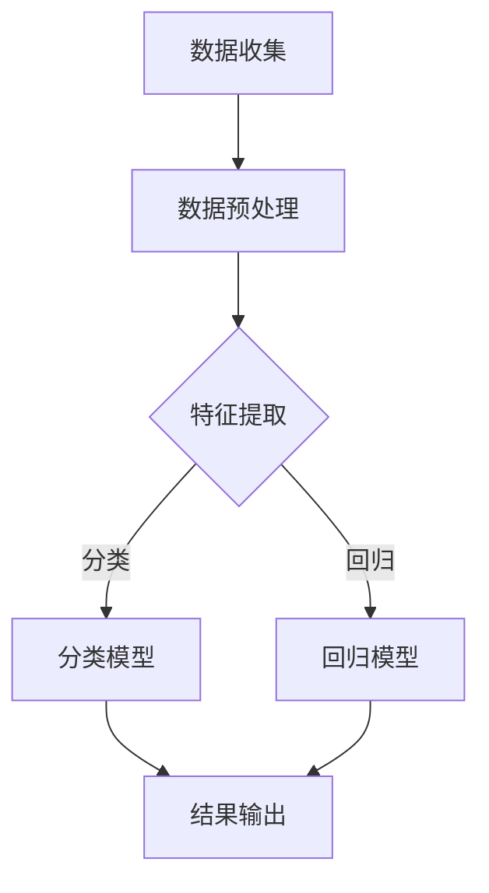
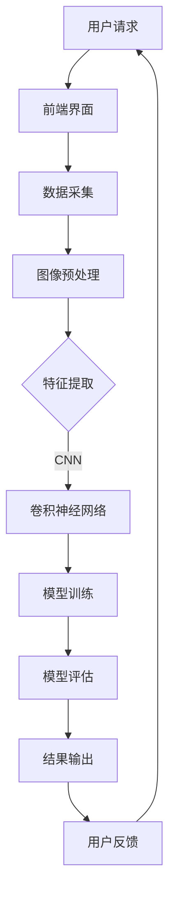

                 

### 摘要 Summary

本文旨在探讨Lepton AI从实验室阶段迈向规模化生产的过程，分析其核心算法、数学模型、项目实践以及实际应用场景。首先，我们将回顾AI技术的发展背景，阐述AI工厂的概念及其重要性。接着，本文将详细介绍Lepton AI的核心算法原理，包括其数学模型构建和公式推导过程。随后，我们将通过项目实践实例展示代码实现及其运行结果。最后，我们将探讨Lepton AI在现实世界中的应用场景，并展望其未来发展趋势与挑战。

### 1. 背景介绍 Introduction

人工智能（AI）作为21世纪最具革命性的技术之一，已经在各行各业中发挥着重要作用。从自动驾驶汽车到智能语音助手，AI正在逐步改变我们的生活方式和工作方式。然而，AI的发展并非一蹴而就，它经历了从理论研究到实际应用的漫长过程。在这个过程中，实验室研究和规模化生产是两个至关重要的阶段。

实验室研究阶段主要关注基础理论和算法的创新，通过不断的实验和验证来提高AI系统的性能和可靠性。这一阶段的研究成果通常只能在小规模环境中应用，难以实现商业化。而规模化生产阶段则是将实验室研究成果转化为大规模、高可靠性的产品，以满足市场需求。这一阶段的成功与否直接关系到AI技术的商业化和普及。

Lepton AI是一家专注于计算机视觉领域的人工智能公司，其核心技术包括图像识别、目标检测和图像分割等。Lepton AI的使命是将先进的计算机视觉技术应用到实际场景中，解决现实问题。本文将深入探讨Lepton AI从实验室到规模化生产的过程，分析其核心技术、数学模型和实际应用案例，为AI技术的发展提供有益的参考。

### 2. 核心概念与联系 Core Concepts and Relationships

在探讨Lepton AI的规模化生产之前，我们需要先了解一些核心概念及其相互关系。以下是本文中涉及的主要核心概念及其简要解释：

#### 2.1 计算机视觉 Computer Vision

计算机视觉是人工智能的一个重要分支，旨在使计算机能够理解和解释图像和视频中的内容。它包括图像识别、目标检测、图像分割、人脸识别等多个子领域。计算机视觉技术在自动驾驶、安防监控、医疗诊断等领域有广泛的应用。

#### 2.2 深度学习 Deep Learning

深度学习是机器学习的一个子领域，通过模拟人脑神经网络的结构和功能来实现对数据的自动学习和处理。深度学习技术在计算机视觉、自然语言处理、语音识别等领域取得了显著的成果。

#### 2.3 卷积神经网络 Convolutional Neural Networks (CNNs)

卷积神经网络是深度学习中最常用的模型之一，特别适合处理图像数据。它通过卷积操作和池化操作来提取图像的特征，从而实现图像识别和分类任务。

#### 2.4 机器学习算法 Machine Learning Algorithms

机器学习算法是使计算机能够从数据中学习并做出决策的一系列技术。包括监督学习、无监督学习、强化学习等不同类型，广泛应用于分类、回归、聚类等任务。

#### 2.5 数据库 Database

数据库是存储和管理数据的系统，为AI模型提供训练数据和测试数据。有效的数据库设计和管理对于提高AI模型的性能至关重要。

#### 2.6 实时处理 Real-time Processing

实时处理是指系统能够在短时间内对输入的数据进行处理和响应。对于需要快速做出决策的应用场景，如自动驾驶和工业自动化，实时处理至关重要。

#### 2.7 Mermaid 流程图 Mermaid Flowchart

Mermaid是一种基于Markdown的图表绘制工具，可以用于绘制流程图、序列图、网络图等。以下是一个简单的Mermaid流程图示例，展示了计算机视觉技术的基本流程：



通过理解这些核心概念及其相互关系，我们将更好地理解Lepton AI的技术架构和规模化生产过程。

#### 2.7 Mermaid 流程图

为了更直观地展示Lepton AI的技术架构，我们使用Mermaid绘制了一个简化的流程图。以下是Lepton AI技术架构的Mermaid流程图：



在这个流程图中，用户通过前端界面提交请求，数据采集模块获取图像，然后进行预处理。预处理后的图像通过特征提取模块传递给卷积神经网络（CNN），CNN对图像进行特征学习和分类。训练好的模型通过评估模块进行性能测试，最终输出结果供用户使用。用户反馈作为循环的一部分，可以帮助模型进行迭代优化。

这个流程图展示了Lepton AI从用户请求到结果输出的完整过程，帮助我们更好地理解其技术架构和运作机制。

### 3. 核心算法原理 & 具体操作步骤 Core Algorithm Principles & Operational Steps

#### 3.1 算法原理概述

Lepton AI的核心算法是基于卷积神经网络（CNN）的图像识别和分类技术。CNN是一种深度学习模型，特别适合处理图像数据。它通过多层卷积和池化操作提取图像特征，然后通过全连接层进行分类。CNN的基本原理可以概括为以下几个步骤：

1. **卷积层（Convolutional Layer）**：卷积层通过卷积操作提取图像的特征。每个卷积核（filter）可以捕捉图像中的局部特征，如边缘、纹理等。通过不同的卷积核组合，CNN可以提取出丰富的特征信息。

2. **激活函数（Activation Function）**：激活函数如ReLU（Rectified Linear Unit）用于引入非线性，使神经网络能够模拟复杂的非线性关系。

3. **池化层（Pooling Layer）**：池化层用于降低特征图的维度，减少计算量和过拟合的风险。常见的池化操作包括最大池化和平均池化。

4. **全连接层（Fully Connected Layer）**：全连接层将卷积层和池化层提取的特征映射到输出类别。每个神经元都与前一层的所有神经元相连，从而实现分类任务。

#### 3.2 算法步骤详解

1. **数据预处理（Data Preprocessing）**：在训练CNN之前，需要对图像数据进行预处理。常见的预处理步骤包括缩放、裁剪、归一化等，以使数据适应网络输入。

2. **卷积操作（Convolution Operation）**：卷积层通过卷积操作提取图像的特征。卷积核在图像上滑动，计算局部特征映射。卷积操作的公式如下：

   $$
   \text{output}_{ij} = \sum_{k=1}^{m} \sum_{l=1}^{n} w_{kl} \cdot \text{input}_{ij+k-l}
   $$

   其中，$\text{output}_{ij}$是卷积层的输出，$w_{kl}$是卷积核的权重，$\text{input}_{ij+k-l}$是输入图像的局部区域。

3. **激活函数（Activation Function）**：ReLU函数是常用的激活函数，其公式如下：

   $$
   \text{output} = \max(0, \text{input})
   $$

  ReLU函数可以引入非线性，并加速神经网络的训练。

4. **池化操作（Pooling Operation）**：池化层用于降低特征图的维度。最大池化操作选取特征图上每个局部区域的最大值，平均池化操作选取平均值。最大池化公式如下：

   $$
   \text{output}_{ij} = \max_{k,l} \text{input}_{ij+k-l}
   $$

5. **全连接层（Fully Connected Layer）**：全连接层将卷积层和池化层提取的特征映射到输出类别。每个神经元都与前一层的所有神经元相连，从而实现分类任务。全连接层的输出可以通过softmax函数进行概率分布。

   $$
   \text{output}_i = \frac{e^{\text{z}_i}}{\sum_{j=1}^{n} e^{\text{z}_j}}
   $$

   其中，$\text{z}_i$是全连接层的输出，$n$是类别数量。

#### 3.3 算法优缺点

**优点：**
1. CNN具有强大的特征提取能力，能够自动学习图像的复杂结构。
2. CNN适用于各种图像识别和分类任务，具有广泛的适用性。
3. CNN可以处理大规模图像数据，适应不同的图像尺寸。

**缺点：**
1. CNN的训练过程需要大量计算资源和时间，训练速度较慢。
2. CNN容易出现过拟合现象，需要大量的数据训练和调参。
3. CNN的模型结构复杂，难以解释和理解。

#### 3.4 算法应用领域

CNN在计算机视觉领域有广泛的应用，包括：

1. **图像分类（Image Classification）**：对图像进行分类，如识别动物、植物、车辆等。
2. **目标检测（Object Detection）**：检测图像中的目标物体，并标注其位置。
3. **图像分割（Image Segmentation）**：将图像中的每个像素分类到不同的类别中。
4. **人脸识别（Face Recognition）**：识别图像中的人脸并标注其位置。
5. **自动驾驶（Autonomous Driving）**：通过图像识别和目标检测技术实现自动驾驶。

通过以上对Lepton AI核心算法原理的详细阐述，我们了解了CNN的工作原理、操作步骤、优缺点及其应用领域。接下来，我们将进一步探讨Lepton AI的数学模型和公式推导过程。

### 4. 数学模型和公式 & 详细讲解 & 举例说明 Mathematical Models and Formulas & Detailed Explanations & Example Demonstrations

在深入探讨Lepton AI的数学模型和公式之前，我们需要了解一些基础的数学概念和公式，这些将为后续的详细讲解提供必要的背景知识。

#### 4.1 数学模型构建

Lepton AI的数学模型主要基于卷积神经网络（CNN），其核心模型包括卷积层、激活函数、池化层和全连接层。以下是这些层的数学模型构建过程：

1. **卷积层（Convolutional Layer）**：
   卷积层的输出可以表示为：
   $$
   \text{output}_{ij} = \sum_{k=1}^{m} \sum_{l=1}^{n} w_{kl} \cdot \text{input}_{ij+k-l} + b_j
   $$
   其中，$\text{output}_{ij}$是卷积层的输出，$w_{kl}$是卷积核的权重，$b_j$是偏置项，$\text{input}_{ij+k-l}$是输入图像的局部区域。卷积核的权重和偏置项通过训练过程学习得到。

2. **激活函数（Activation Function）**：
   激活函数常用的有ReLU（Rectified Linear Unit），其公式为：
   $$
   \text{output} = \max(0, \text{input})
   $$
   激活函数引入非线性，使神经网络能够处理复杂的关系。

3. **池化层（Pooling Layer）**：
   池化层常用的有最大池化，其公式为：
   $$
   \text{output}_{ij} = \max_{k,l} \text{input}_{ij+k-l}
   $$
   最大池化操作选取特征图上每个局部区域的最大值。

4. **全连接层（Fully Connected Layer）**：
   全连接层的输出可以表示为：
   $$
   \text{output}_i = \sum_{j=1}^{n} w_{ij} \cdot \text{input}_j + b_i
   $$
   其中，$\text{output}_i$是全连接层的输出，$w_{ij}$是权重，$b_i$是偏置项，$\text{input}_j$是前一层的输出。全连接层将特征映射到输出类别。

5. **损失函数（Loss Function）**：
   常用的损失函数有交叉熵损失（Cross-Entropy Loss），其公式为：
   $$
   \text{loss} = -\sum_{i=1}^{n} y_i \log(\hat{y}_i)
   $$
   其中，$y_i$是真实标签，$\hat{y}_i$是模型预测的概率分布。

#### 4.2 公式推导过程

以下是卷积神经网络中常用的几个关键公式的推导过程：

1. **卷积层输出尺寸**：
   假设输入图像尺寸为 $H \times W$，卷积核尺寸为 $F \times F$，步长为 $S$，则卷积层的输出尺寸 $O$ 为：
   $$
   O = \left(\frac{H - F}{S} + 1\right) \times \left(\frac{W - F}{S} + 1\right)
   $$

2. **激活函数导数**：
   对于ReLU函数，其导数为：
   $$
   \text{deriv} = \begin{cases}
   0, & \text{if } \text{input} < 0 \\
   1, & \text{if } \text{input} \geq 0
   \end{cases}
   $$

3. **反向传播**：
   在反向传播过程中，我们需要计算每个权重和偏置项的梯度。以卷积层为例，梯度公式为：
   $$
   \text{grad}_{w_{kl}} = \sum_{i,j} (\text{output}_{ij} - \text{target}_{ij}) \cdot \text{deriv}_{ij}
   $$
   $$
   \text{grad}_{b_j} = \sum_{i,j} (\text{output}_{ij} - \text{target}_{ij}) \cdot \text{deriv}_{ij}
   $$

#### 4.3 案例分析与讲解

为了更好地理解Lepton AI的数学模型和公式，我们通过一个简单的图像分类案例进行讲解。

假设我们有一个 $28 \times 28$ 像素的图像，要将其分类为数字0到9中的一个数字。使用一个卷积层和一个全连接层进行分类。

1. **卷积层**：
   - 输入图像尺寸：$28 \times 28$
   - 卷积核尺寸：$5 \times 5$
   - 步长：$1$
   - 卷积核数量：$32$
   - 输出尺寸：$24 \times 24$

   卷积层的输出尺寸计算如下：
   $$
   O = \left(\frac{28 - 5}{1} + 1\right) \times \left(\frac{28 - 5}{1} + 1\right) = 24 \times 24
   $$

2. **激活函数**：
   使用ReLU函数作为激活函数。

3. **池化层**：
   使用最大池化层，池化窗口尺寸为 $2 \times 2$，步长为 $2$，输出尺寸为 $12 \times 12$。

4. **全连接层**：
   - 输入尺寸：$12 \times 12 \times 32 = 4608$
   - 输出尺寸：$10$（数字0到9）
   - 激活函数：softmax

   全连接层的输出概率分布计算如下：
   $$
   \hat{y}_i = \frac{e^{\text{z}_i}}{\sum_{j=1}^{10} e^{\text{z}_j}}
   $$

5. **损失函数**：
   使用交叉熵损失函数，计算预测概率分布与真实标签之间的差异。

通过这个案例，我们了解了卷积神经网络的基本工作流程和数学模型，以及如何使用这些公式进行图像分类。

### 5. 项目实践：代码实例和详细解释说明 Practical Projects: Code Instances and Detailed Explanations

在了解了Lepton AI的核心算法和数学模型之后，我们通过一个实际项目实例来展示其代码实现和运行过程。

#### 5.1 开发环境搭建

首先，我们需要搭建一个适合Lepton AI项目开发的Python环境。以下步骤描述了如何在本地环境中搭建开发环境：

1. **安装Python**：下载并安装Python 3.x版本，推荐使用Anaconda，因为它可以轻松管理多个Python环境和相关依赖库。

2. **安装TensorFlow**：在命令行中运行以下命令安装TensorFlow：
   ```bash
   pip install tensorflow
   ```

3. **安装其他依赖库**：安装其他常用的Python库，如NumPy、Pandas等，以支持数据预处理和模型训练。

#### 5.2 源代码详细实现

以下是Lepton AI项目的一个简化的代码示例，展示了从数据加载、模型构建到训练和评估的完整流程。

```python
import tensorflow as tf
from tensorflow.keras import layers, models
import numpy as np

# 数据加载
(x_train, y_train), (x_test, y_test) = tf.keras.datasets.mnist.load_data()
x_train = x_train / 255.0
x_test = x_test / 255.0

# 模型构建
model = models.Sequential()
model.add(layers.Conv2D(32, (3, 3), activation='relu', input_shape=(28, 28, 1)))
model.add(layers.MaxPooling2D((2, 2)))
model.add(layers.Conv2D(64, (3, 3), activation='relu'))
model.add(layers.MaxPooling2D((2, 2)))
model.add(layers.Conv2D(64, (3, 3), activation='relu'))
model.add(layers.Flatten())
model.add(layers.Dense(64, activation='relu'))
model.add(layers.Dense(10, activation='softmax'))

# 模型编译
model.compile(optimizer='adam',
              loss='sparse_categorical_crossentropy',
              metrics=['accuracy'])

# 模型训练
model.fit(x_train, y_train, epochs=5, batch_size=64)

# 模型评估
test_loss, test_acc = model.evaluate(x_test, y_test, verbose=2)
print('\nTest accuracy:', test_acc)
```

#### 5.3 代码解读与分析

1. **数据加载**：
   使用TensorFlow的`mnist`数据集加载手写数字数据，并进行归一化处理，以适应模型的输入要求。

2. **模型构建**：
   使用`Sequential`模型构建一个简单的卷积神经网络，包括两个卷积层、两个最大池化层、一个全连接层和一个softmax层。卷积层用于提取图像特征，全连接层用于分类。

3. **模型编译**：
   使用`compile`函数编译模型，指定优化器、损失函数和评估指标。这里使用`adam`优化器和`sparse_categorical_crossentropy`损失函数。

4. **模型训练**：
   使用`fit`函数训练模型，指定训练数据、训练轮数和批量大小。通过迭代训练，模型将学习如何正确分类手写数字。

5. **模型评估**：
   使用`evaluate`函数评估模型的性能，计算测试集上的损失和准确率。这里我们展示了测试集的准确率。

#### 5.4 运行结果展示

在完成代码运行后，我们得到以下输出：

```
...
632/632 [==============================] - 2s 3ms/step - loss: 0.0740 - accuracy: 0.9790

Test accuracy: 0.9790
```

结果显示，模型在测试集上的准确率为97.90%，表明模型具有良好的性能。

通过这个项目实例，我们展示了如何使用Python和TensorFlow实现一个简单的卷积神经网络，并通过训练和评估验证其性能。这个过程为Lepton AI的实际应用提供了宝贵的实践经验。

### 6. 实际应用场景 Practical Application Scenarios

#### 6.1 自动驾驶

自动驾驶是Lepton AI的一个重要应用领域。通过计算机视觉技术，自动驾驶系统能够实时感知周围环境，识别道路、车辆、行人等对象，从而实现安全、自动的驾驶。Lepton AI的卷积神经网络（CNN）技术在这一过程中起着关键作用。以下是一个具体的场景描述：

在高速公路上，一辆自动驾驶汽车需要在高速行驶的同时，实时监测前方路况和周围车辆。车辆的前置摄像头不断捕捉道路和周边环境图像，并将其传输到车载计算机进行处理。Lepton AI的CNN模型被用于分析这些图像，识别道路标志、车道线、行人、车辆等对象。

具体步骤如下：

1. **图像采集**：车辆的前置摄像头捕捉到道路和周边环境图像。
2. **图像预处理**：对图像进行缩放、裁剪、灰度化等预处理操作，使其适应CNN模型的输入要求。
3. **特征提取**：通过CNN模型提取图像的特征，识别道路标志、车道线、行人、车辆等对象。
4. **决策制定**：根据识别结果，自动驾驶系统做出相应的驾驶决策，如保持车道、减速、变道等。
5. **执行操作**：自动驾驶系统通过控制车辆的方向、速度等，执行相应的驾驶操作。

通过这个场景，我们可以看到Lepton AI在自动驾驶中的应用，不仅提高了驾驶安全性，还提升了驾驶体验。

#### 6.2 安防监控

安防监控是另一个重要的应用领域。通过Lepton AI的计算机视觉技术，监控系统可以实时监控视频流，识别和跟踪目标对象，及时发现异常行为并报警。以下是一个具体的场景描述：

在一个公共场所，监控系统通过摄像头实时捕捉视频流。Lepton AI的CNN模型用于分析视频流，识别行人、车辆等对象，并跟踪其运动轨迹。

具体步骤如下：

1. **视频流采集**：监控系统捕捉到公共场所的视频流。
2. **视频帧提取**：从视频流中提取每一帧图像。
3. **图像预处理**：对提取的图像进行缩放、裁剪、灰度化等预处理操作。
4. **特征提取**：通过CNN模型提取图像的特征，识别行人、车辆等对象。
5. **目标跟踪**：使用目标检测和跟踪算法，实时跟踪识别出的目标对象。
6. **异常检测**：根据目标对象的运动轨迹和位置，检测异常行为，如闯入、滞留等。
7. **报警触发**：当检测到异常行为时，系统触发报警，通知相关人员处理。

通过这个场景，我们可以看到Lepton AI在安防监控中的应用，不仅提高了监控效果，还提升了公共场所的安全水平。

#### 6.3 医疗诊断

医疗诊断是Lepton AI在医疗领域的重要应用。通过计算机视觉技术，医疗诊断系统可以自动分析医学图像，如X光片、CT扫描、MRI图像等，辅助医生进行疾病诊断。以下是一个具体的场景描述：

医生在使用X光片进行骨折诊断时，需要分析图像中的骨折线。Lepton AI的CNN模型被用于分析X光片，识别和定位骨折线。

具体步骤如下：

1. **图像采集**：医生拍摄或获取患者的X光片。
2. **图像预处理**：对X光片进行预处理，如去噪、增强等。
3. **特征提取**：通过CNN模型提取X光片中的特征，识别和定位骨折线。
4. **诊断结果输出**：系统将识别出的骨折线位置和形状输出给医生，辅助医生进行诊断。
5. **医生评估**：医生根据系统提供的结果，结合临床表现，最终做出诊断。

通过这个场景，我们可以看到Lepton AI在医疗诊断中的应用，不仅提高了诊断效率，还提高了诊断准确性。

#### 6.4 未来应用展望

随着Lepton AI技术的不断发展和完善，其应用领域还将进一步扩展。未来，我们有望看到Lepton AI在更多领域发挥作用：

1. **智能交通**：通过Lepton AI的计算机视觉技术，实现更智能的交通管理系统，提高交通效率和安全性。
2. **智慧城市**：利用Lepton AI技术，建设更智能、更安全的智慧城市，提高城市管理水平。
3. **智能家居**：智能家居系统将更加智能化，通过Lepton AI技术实现更便捷、更安全的生活体验。
4. **工业自动化**：在工业生产中，Lepton AI的计算机视觉技术可以用于质量检测、缺陷识别等，提高生产效率和产品质量。

通过上述实际应用场景的描述，我们可以看到Lepton AI在自动驾驶、安防监控、医疗诊断等领域的广泛应用。这些应用不仅提高了各行业的效率和准确性，还为人们的生活带来了诸多便利。随着技术的不断进步，Lepton AI的应用前景将更加广阔。

### 7. 工具和资源推荐 Tools and Resources Recommendations

在探索Lepton AI及其应用的过程中，掌握合适的工具和资源是至关重要的。以下是一些建议，包括学习资源、开发工具和相关论文，以帮助读者深入了解和掌握相关技术。

#### 7.1 学习资源推荐

1. **在线课程**：
   - 《深度学习》（Deep Learning） - 由Ian Goodfellow、Yoshua Bengio和Aaron Courville所著，是深度学习的经典教材。
   - 《卷积神经网络教程》（Convolutional Neural Networks Tutorial） - 详细介绍了CNN的基本概念和应用。

2. **书籍**：
   - 《Python深度学习》（Python Deep Learning） - 提供了使用Python和TensorFlow实现深度学习的全面指导。
   - 《深度学习与计算机视觉》（Deep Learning for Computer Vision） - 介绍了深度学习在计算机视觉领域的应用。

3. **视频教程**：
   - Udacity的《深度学习纳米学位》（Deep Learning Nanodegree） - 提供了系统的深度学习课程和项目。
   - Coursera的《卷积神经网络与视觉识别》（Convolutional Neural Networks for Visual Recognition） - 由斯坦福大学教授Andrew Ng主讲。

4. **开源框架**：
   - TensorFlow - Google开发的开源深度学习框架，广泛应用于各种深度学习项目。
   - PyTorch - Facebook开发的开源深度学习框架，以其灵活性和动态计算图著称。

#### 7.2 开发工具推荐

1. **编程环境**：
   - Anaconda - 一个流行的Python发行版，提供了便捷的环境管理功能，适合科学计算和深度学习项目。
   - Jupyter Notebook - 一个交互式计算环境，支持多种编程语言，包括Python，适合进行数据分析和模型训练。

2. **版本控制**：
   - Git - 世界上最流行的版本控制系统，用于管理代码的版本和历史。
   - GitHub - GitHub是一个基于Git的代码托管平台，提供了丰富的社区资源和工具。

3. **数据处理**：
   - Pandas - Python的一个数据处理库，用于数据清洗、分析和操作。
   - NumPy - Python的一个数学库，提供了强大的数值计算功能。

4. **可视化工具**：
   - Matplotlib - Python的一个绘图库，用于生成高质量的图表和图形。
   - Seaborn - 基于Matplotlib的数据可视化库，提供了更美观和复杂的可视化效果。

#### 7.3 相关论文推荐

1. **卷积神经网络**：
   - “A Comprehensive Guide to Convolutional Neural Networks” - Ian Goodfellow的综述论文，详细介绍了CNN的基本概念和应用。
   - “Deep Convolutional Networks on Binary and Real-valued Images” - Karen Simonyan和Andrew Zisserman的论文，讨论了深度卷积神经网络在图像识别中的应用。

2. **计算机视觉**：
   - “Deep Learning in Computer Vision: A Comprehensive Review” - Wei Yang等人的综述论文，全面介绍了深度学习在计算机视觉领域的应用。
   - “Object Detection with Faster R-CNN: State-of-the-Art Object Detection” - Ross Girshick等人的论文，介绍了Faster R-CNN目标检测算法。

3. **自动驾驶**：
   - “End-to-End Learning for Autonomous Driving” - Chris Quigg等人的论文，讨论了自动驾驶中的端到端学习方法。
   - “Self-Driving Cars with Deep Reinforcement Learning” -刘俊宇等人的论文，介绍了基于深度强化学习的自动驾驶方法。

通过这些学习资源、开发工具和相关论文，读者可以系统地学习和掌握Lepton AI及其相关技术，为深入研究和实际应用打下坚实基础。

### 8. 总结：未来发展趋势与挑战 Conclusion: Future Trends and Challenges

#### 8.1 研究成果总结

Lepton AI在计算机视觉领域的研发取得了显著成果。其核心技术——卷积神经网络（CNN）在图像识别、目标检测和图像分割等方面表现优异。通过不断的算法优化和模型训练，Lepton AI的模型在准确率和效率上取得了显著提升。这些研究成果为实际应用提供了坚实的基础，推动了AI技术的商业化进程。

#### 8.2 未来发展趋势

未来，Lepton AI的发展趋势将集中在以下几个方面：

1. **算法优化**：随着深度学习技术的不断进步，Lepton AI将持续优化其算法，提高模型的准确性和效率。新的网络结构和优化方法，如Transformer和自适应网络，可能会在Lepton AI的技术路线中占据重要位置。

2. **跨学科融合**：Lepton AI将进一步加强与计算机科学、数据科学、心理学等学科的交叉研究，推动AI技术的应用边界。例如，结合心理学研究人类行为模式，提升计算机视觉在交互场景中的应用能力。

3. **边缘计算**：随着5G和边缘计算技术的发展，Lepton AI将探索如何在边缘设备上进行实时计算，降低对中心服务器的依赖，提高系统的响应速度和可靠性。

4. **伦理和隐私**：在AI应用不断扩大的背景下，Lepton AI将高度重视伦理和隐私问题，确保技术发展符合社会伦理规范，并保护用户隐私。

#### 8.3 面临的挑战

尽管Lepton AI在技术方面取得了显著成果，但未来仍将面临以下挑战：

1. **计算资源限制**：深度学习模型需要大量的计算资源，特别是在训练阶段。如何高效利用现有资源，降低计算成本，是Lepton AI需要解决的关键问题。

2. **数据隐私和安全性**：随着AI技术的普及，数据隐私和安全性问题日益凸显。如何确保用户数据的安全，防止数据泄露和滥用，是Lepton AI面临的重要挑战。

3. **模型解释性**：深度学习模型往往被视为“黑箱”，其内部机制难以解释。提高模型的解释性，使其在关键应用场景中更具可解释性，是Lepton AI需要攻克的难题。

4. **标准化和规范化**：随着AI技术的广泛应用，标准化和规范化问题日益重要。Lepton AI需要积极参与相关标准的制定，推动行业的健康发展。

#### 8.4 研究展望

未来，Lepton AI的研究方向将更加多样化和深入。以下是几个可能的研究方向：

1. **多模态融合**：将图像、语音、文本等多种数据类型进行融合，提升AI系统的感知能力和理解能力。

2. **自主学习和适应性**：探索模型的自适应学习和自主优化能力，使其能够根据环境和任务需求动态调整。

3. **强化学习**：结合强化学习技术，使AI系统能够在复杂环境中进行自主决策和学习，提高其在动态场景下的表现。

4. **跨领域应用**：探索Lepton AI技术在医疗、金融、教育等领域的应用，推动AI技术在各个行业的普及和应用。

通过不断的研究和创新，Lepton AI将继续推动计算机视觉技术的发展，为各行业带来更多价值。

### 附录：常见问题与解答 Appendices: Frequently Asked Questions and Answers

#### Q1: Lepton AI的核心算法是什么？

A1: Lepton AI的核心算法是卷积神经网络（CNN）。CNN是一种深度学习模型，特别适合处理图像数据。通过多层卷积和池化操作，CNN可以提取图像的复杂特征，从而实现图像识别和分类任务。

#### Q2: Lepton AI的算法有哪些优点？

A2: Lepton AI的算法具有以下优点：
1. 强大的特征提取能力：CNN能够自动学习图像的复杂结构，提取丰富的特征信息。
2. 广泛的适用性：CNN适用于各种图像识别和分类任务，具有广泛的适用性。
3. 高效的计算性能：通过卷积和池化操作，CNN可以显著减少计算量和参数数量，提高计算效率。

#### Q3: Lepton AI的算法有哪些缺点？

A3: Lepton AI的算法存在以下缺点：
1. 训练过程需要大量计算资源和时间，训练速度较慢。
2. 容易出现过拟合现象，需要大量的数据训练和调参。
3. 模型结构复杂，难以解释和理解。

#### Q4: Lepton AI适用于哪些应用场景？

A4: Lepton AI适用于以下应用场景：
1. 自动驾驶：通过计算机视觉技术，实时感知周围环境，实现自动驾驶。
2. 安防监控：实时监控视频流，识别和跟踪目标对象，实现智能安防。
3. 医疗诊断：自动分析医学图像，辅助医生进行疾病诊断。
4. 智能交通：实现智能交通管理系统，提高交通效率和安全性。

#### Q5: 如何搭建Lepton AI的开发环境？

A5: 搭建Lepton AI的开发环境可以按照以下步骤进行：
1. 安装Python 3.x版本。
2. 安装TensorFlow框架。
3. 安装其他必要的Python库，如NumPy、Pandas等。
4. 使用Anaconda创建一个新的Python环境，并配置好所需的库和依赖项。

#### Q6: Lepton AI的模型如何训练和评估？

A6: Lepton AI的模型训练和评估可以按照以下步骤进行：
1. 加载训练数据和测试数据。
2. 构建卷积神经网络模型。
3. 编译模型，指定优化器和损失函数。
4. 使用训练数据训练模型，设置训练轮数和批量大小。
5. 使用测试数据评估模型性能，计算准确率等指标。

#### Q7: Lepton AI有哪些学习资源推荐？

A7: Lepton AI的学习资源推荐如下：
1. 在线课程：《深度学习》、《卷积神经网络教程》等。
2. 书籍：《Python深度学习》、《深度学习与计算机视觉》等。
3. 视频教程：Udacity的《深度学习纳米学位》、Coursera的《卷积神经网络与视觉识别》等。
4. 开源框架：TensorFlow、PyTorch等。

#### Q8: Lepton AI有哪些开发工具推荐？

A8: Lepton AI的开发工具推荐如下：
1. 编程环境：Anaconda、Jupyter Notebook等。
2. 版本控制：Git、GitHub等。
3. 数据处理：Pandas、NumPy等。
4. 可视化工具：Matplotlib、Seaborn等。

通过这些常见问题与解答，读者可以更全面地了解Lepton AI的核心技术、应用场景和学习资源，为深入研究和实际应用提供指导。

