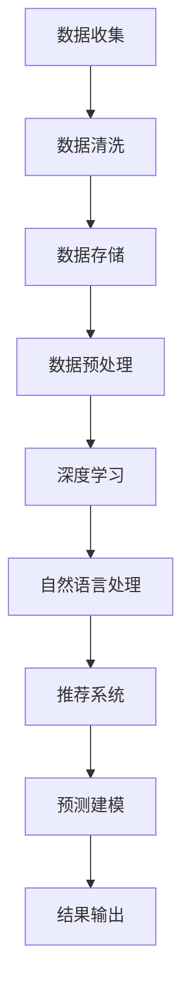

                 

关键词：智能CRM，AI，系统架构，电商客户关系管理，大数据，深度学习，客户行为分析，个性化推荐，预测建模

摘要：随着大数据和人工智能技术的快速发展，传统的客户关系管理（CRM）系统正逐渐被智能化CRM系统所取代。本文详细探讨了智能CRM在电商客户关系管理中的应用，分析了AI技术的核心算法原理和系统架构设计，并通过具体项目实践展示了智能CRM的实际效果。

## 1. 背景介绍

在电子商务快速发展的今天，客户关系管理（CRM）成为电商企业至关重要的业务环节。传统CRM系统主要依赖于历史数据和手动操作，无法满足个性化、实时性等需求。随着大数据和人工智能技术的成熟，智能CRM应运而生，为电商企业提供了更精准、高效的客户关系管理方案。

智能CRM通过深度学习、自然语言处理、推荐系统等AI技术，对客户行为数据进行分析，实现个性化推荐、预测建模等功能，帮助企业提升客户满意度、转化率和忠诚度。本文将探讨智能CRM的核心算法原理、系统架构设计以及在实际应用中的效果。

## 2. 核心概念与联系

### 2.1 数据来源

智能CRM的数据来源主要包括：

1. 客户基本信息：包括姓名、性别、年龄、地理位置等。
2. 购买行为数据：包括购买时间、购买频次、购买品类、购买金额等。
3. 浏览行为数据：包括浏览时间、浏览页面、停留时长等。
4. 客户互动数据：包括客服咨询、投诉、评价等。

### 2.2 核心概念

1. **深度学习**：一种机器学习方法，通过多层神经网络对数据进行分析和预测。
2. **自然语言处理**：一种人工智能技术，用于理解、生成和处理人类语言。
3. **推荐系统**：通过分析用户行为和偏好，为用户推荐相关商品或服务。
4. **预测建模**：通过历史数据和算法模型，预测客户未来的行为和需求。

### 2.3 Mermaid 流程图



## 3. 核心算法原理 & 具体操作步骤

### 3.1 算法原理概述

智能CRM的核心算法包括深度学习、自然语言处理、推荐系统和预测建模。以下是各算法的基本原理：

1. **深度学习**：通过多层神经网络对客户行为数据进行建模，实现客户特征提取和预测。
2. **自然语言处理**：用于处理客户咨询、投诉、评价等文本数据，提取关键词、情感倾向等。
3. **推荐系统**：基于协同过滤、内容匹配等技术，为用户推荐相关商品或服务。
4. **预测建模**：利用历史数据，结合深度学习和自然语言处理等技术，预测客户未来的行为和需求。

### 3.2 算法步骤详解

1. **数据收集**：从电商平台的各个渠道收集客户数据，包括基本信息、购买行为、浏览行为和客户互动数据。
2. **数据清洗**：去除重复、缺失、异常数据，保证数据质量。
3. **数据存储**：将清洗后的数据存储到数据仓库中，便于后续处理和分析。
4. **数据预处理**：将原始数据进行归一化、编码等处理，为深度学习等算法提供输入。
5. **深度学习**：构建多层神经网络，对客户行为数据进行建模，提取客户特征。
6. **自然语言处理**：对客户咨询、投诉、评价等文本数据进行处理，提取关键词、情感倾向等。
7. **推荐系统**：基于协同过滤、内容匹配等技术，为用户推荐相关商品或服务。
8. **预测建模**：结合深度学习和自然语言处理等技术，预测客户未来的行为和需求。
9. **结果输出**：将预测结果和推荐结果输出到CRM系统中，供电商企业使用。

### 3.3 算法优缺点

1. **优点**：
   - 提高客户满意度：通过个性化推荐和预测，满足客户需求，提升客户体验。
   - 提高转化率：精准的推荐和预测有助于提高客户的购买意愿和转化率。
   - 提高忠诚度：通过个性化服务和关怀，增强客户对品牌的忠诚度。

2. **缺点**：
   - 数据依赖性：智能CRM的效果高度依赖于数据的质量和数量，数据不足或质量差会影响算法的性能。
   - 隐私风险：智能CRM涉及客户隐私数据，需要确保数据安全和隐私保护。

### 3.4 算法应用领域

1. **个性化推荐**：为用户推荐相关商品或服务，提高用户购买意愿和转化率。
2. **客户细分**：根据客户行为和需求，将客户分为不同群体，提供针对性服务。
3. **客户流失预测**：预测可能流失的客户，提前采取措施挽回客户。
4. **营销活动优化**：根据客户行为和需求，优化营销活动的策略和内容。

## 4. 数学模型和公式 & 详细讲解 & 举例说明

### 4.1 数学模型构建

智能CRM的数学模型主要包括：

1. **深度学习模型**：用于提取客户特征和预测客户行为。
2. **自然语言处理模型**：用于处理客户文本数据，提取关键词和情感倾向。
3. **推荐系统模型**：用于为用户推荐相关商品或服务。
4. **预测建模模型**：用于预测客户未来的行为和需求。

### 4.2 公式推导过程

1. **深度学习模型**：

   假设输入数据为 $X = [x_1, x_2, ..., x_n]$，其中 $x_i$ 表示第 $i$ 个客户的特征向量。深度学习模型的目标是学习一个映射函数 $f(X)$，将输入数据映射为输出结果。

   $$f(X) = W \cdot X + b$$

   其中 $W$ 为权重矩阵，$b$ 为偏置项。

2. **自然语言处理模型**：

   假设输入文本数据为 $T = [t_1, t_2, ..., t_m]$，其中 $t_i$ 表示第 $i$ 个文本的词语序列。自然语言处理模型的目标是学习一个映射函数 $g(T)$，将输入文本映射为特征向量。

   $$g(T) = V \cdot T + s$$

   其中 $V$ 为词语向量矩阵，$s$ 为偏置项。

3. **推荐系统模型**：

   假设用户行为数据为 $U = [u_1, u_2, ..., u_n]$，其中 $u_i$ 表示第 $i$ 个用户的偏好向量。推荐系统模型的目标是学习一个映射函数 $h(U)$，为用户推荐相关商品或服务。

   $$h(U) = K \cdot U + c$$

   其中 $K$ 为商品或服务向量矩阵，$c$ 为偏置项。

4. **预测建模模型**：

   假设历史数据为 $H = [h_1, h_2, ..., h_n]$，其中 $h_i$ 表示第 $i$ 个时间点的数据。预测建模模型的目标是学习一个映射函数 $p(H)$，预测未来的数据。

   $$p(H) = M \cdot H + d$$

   其中 $M$ 为历史数据向量矩阵，$d$ 为偏置项。

### 4.3 案例分析与讲解

以电商平台的个性化推荐为例，假设我们有一组用户行为数据 $U = [u_1, u_2, ..., u_n]$，其中 $u_i$ 表示第 $i$ 个用户的偏好向量。我们可以使用推荐系统模型 $h(U)$ 为每个用户推荐相关商品或服务。

假设推荐系统模型 $h(U)$ 的输出结果为商品或服务向量矩阵 $K$，其中 $k_j$ 表示第 $j$ 个商品或服务的偏好值。我们可以通过计算用户与商品的相似度来选择推荐商品。

$$\text{相似度} = \frac{u_i \cdot k_j}{\|u_i\| \|k_j\|}$$

其中 $\|u_i\|$ 和 $\|k_j\|$ 分别表示用户偏好向量和商品或服务向量矩阵的欧几里得范数。

我们可以选择相似度最高的商品或服务作为推荐结果。例如，对于用户 $u_1$，我们可以找到与其相似度最高的商品 $k_5$，并将其推荐给用户 $u_1$。

## 5. 项目实践：代码实例和详细解释说明

### 5.1 开发环境搭建

为了实现智能CRM，我们需要搭建一个适合深度学习、自然语言处理和推荐系统开发的环境。以下是一个简单的开发环境搭建步骤：

1. 安装 Python 3.8 或以上版本。
2. 安装深度学习框架 TensorFlow 或 PyTorch。
3. 安装自然语言处理库 NLTK 或 spaCy。
4. 安装推荐系统库 LightFM 或 Surpriselib。

### 5.2 源代码详细实现

以下是一个基于 TensorFlow 的深度学习模型的实现示例：

```python
import tensorflow as tf
from tensorflow.keras.models import Sequential
from tensorflow.keras.layers import Dense, Activation

# 构建深度学习模型
model = Sequential([
    Dense(units=128, input_shape=(input_shape,), activation='relu'),
    Dense(units=64, activation='relu'),
    Dense(units=1, activation='sigmoid')
])

# 编译模型
model.compile(optimizer='adam', loss='binary_crossentropy', metrics=['accuracy'])

# 训练模型
model.fit(X_train, y_train, epochs=10, batch_size=32)
```

### 5.3 代码解读与分析

上述代码实现了一个简单的二分类深度学习模型，用于预测客户是否购买某个商品。其中：

- `Dense` 层表示全连接层，用于实现线性变换。
- `Activation` 层表示激活函数，用于引入非线性特性。
- `compile` 方法用于编译模型，指定优化器、损失函数和评估指标。
- `fit` 方法用于训练模型，输入训练数据和标签，指定训练轮数和批量大小。

### 5.4 运行结果展示

在训练完成后，我们可以使用测试数据评估模型的性能：

```python
# 评估模型
loss, accuracy = model.evaluate(X_test, y_test)

print("测试损失：", loss)
print("测试准确率：", accuracy)
```

上述代码将输出模型的测试损失和准确率，用于评估模型的性能。

## 6. 实际应用场景

智能CRM在电商企业中的应用场景广泛，以下列举几个典型应用场景：

1. **个性化推荐**：根据用户的历史行为和偏好，为用户推荐相关商品或服务，提高用户购买意愿和转化率。
2. **客户细分**：根据客户的行为数据和需求，将客户分为不同群体，提供针对性服务和营销策略。
3. **客户流失预测**：利用客户行为数据和预测模型，提前识别可能流失的客户，并采取措施挽回客户。
4. **营销活动优化**：根据客户行为数据和预测模型，优化营销活动的策略和内容，提高营销效果。
5. **客户服务优化**：通过自然语言处理技术，对客户咨询、投诉等文本数据进行分析，提供智能化的客户服务。

## 7. 工具和资源推荐

### 7.1 学习资源推荐

1. 《深度学习》（Goodfellow, Bengio, Courville著）：一本经典的深度学习教材，适合初学者和进阶者。
2. 《自然语言处理综合教程》（张宇星著）：一本全面介绍自然语言处理技术的教材，适合初学者和进阶者。
3. 《推荐系统实践》（李航著）：一本深入讲解推荐系统原理和算法的教材，适合初学者和进阶者。

### 7.2 开发工具推荐

1. TensorFlow：一个开源的深度学习框架，适用于构建和训练深度学习模型。
2. PyTorch：一个开源的深度学习框架，适用于快速原型设计和实验。
3. LightFM：一个开源的推荐系统框架，适用于基于图神经网络和矩阵分解的推荐系统。
4. spaCy：一个开源的自然语言处理库，适用于文本数据预处理和特征提取。

### 7.3 相关论文推荐

1. "Deep Learning for Customer Relationship Management"（2018）：一篇介绍深度学习在CRM应用中的研究论文。
2. "Natural Language Processing for Customer Relationship Management"（2019）：一篇介绍自然语言处理在CRM应用中的研究论文。
3. "Recommender Systems for Customer Relationship Management"（2020）：一篇介绍推荐系统在CRM应用中的研究论文。

## 8. 总结：未来发展趋势与挑战

### 8.1 研究成果总结

智能CRM在电商客户关系管理中取得了显著成果，通过深度学习、自然语言处理和推荐系统等技术，实现了个性化推荐、客户细分、客户流失预测等功能，提高了客户的满意度、转化率和忠诚度。

### 8.2 未来发展趋势

1. **技术融合**：深度学习、自然语言处理和推荐系统等技术将更加融合，实现更强大的客户关系管理功能。
2. **多模态数据**：引入多模态数据（如语音、图像等），提高客户行为数据的丰富度和分析精度。
3. **实时性**：实现实时数据分析和预测，提高客户关系管理的实时性和响应速度。
4. **隐私保护**：加强数据隐私保护，确保客户数据的安全和合规。

### 8.3 面临的挑战

1. **数据质量**：数据质量和数量是智能CRM的基础，需要不断优化数据采集、清洗和处理流程。
2. **算法解释性**：提高算法的可解释性，帮助企业和用户理解模型决策过程。
3. **模型泛化能力**：增强模型的泛化能力，避免过度拟合和模型崩溃。
4. **隐私保护**：加强数据隐私保护，确保客户数据的安全和合规。

### 8.4 研究展望

未来，智能CRM将在电商客户关系管理中发挥更加重要的作用，通过技术创新和实际应用，实现更精准、更高效的客户关系管理。同时，随着隐私保护、多模态数据等新需求的提出，智能CRM将面临更多挑战，需要持续探索和研究。

## 9. 附录：常见问题与解答

### 问题1：智能CRM与传统CRM的区别是什么？

**回答**：智能CRM与传统CRM的主要区别在于技术的应用和数据分析的能力。传统CRM主要依赖于历史数据和手动操作，而智能CRM通过深度学习、自然语言处理和推荐系统等AI技术，实现个性化推荐、客户细分和预测建模等功能，提高客户关系管理的精准度和效率。

### 问题2：智能CRM的数据来源有哪些？

**回答**：智能CRM的数据来源主要包括客户基本信息、购买行为数据、浏览行为数据和客户互动数据。这些数据可以通过电商平台的各个渠道收集，如用户注册信息、购买记录、浏览记录、客服咨询和评价等。

### 问题3：智能CRM在客户流失预测中的作用是什么？

**回答**：智能CRM通过分析客户的行为数据和特征，结合深度学习和预测建模技术，可以预测客户可能流失的行为和趋势。通过提前识别可能流失的客户，企业可以采取针对性的措施，如优惠活动、个性化服务等，提高客户满意度，降低客户流失率。

### 问题4：智能CRM在个性化推荐中的实现方法有哪些？

**回答**：智能CRM在个性化推荐中主要采用基于协同过滤、内容匹配和深度学习等方法。基于协同过滤的方法通过分析用户之间的相似度来推荐商品；内容匹配方法通过分析商品的特征和用户的历史行为来推荐商品；深度学习方法通过构建多层神经网络对用户行为数据进行建模，实现更精准的个性化推荐。

### 问题5：智能CRM的隐私保护措施有哪些？

**回答**：智能CRM在隐私保护方面需要采取以下措施：

1. **数据加密**：对客户数据进行加密处理，确保数据传输和存储过程中的安全性。
2. **数据去识别化**：对敏感数据进行脱敏处理，避免直接使用客户身份信息。
3. **权限控制**：限制对客户数据的访问权限，确保数据在内部传输和使用过程中的安全性。
4. **隐私政策**：制定明确的隐私政策，告知客户数据的使用目的、范围和权限，尊重客户的隐私权益。
5. **合规性检查**：定期对智能CRM系统的隐私保护措施进行合规性检查，确保符合相关法律法规要求。

# 作者署名
作者：禅与计算机程序设计艺术 / Zen and the Art of Computer Programming
----------------------------------------------------------------


