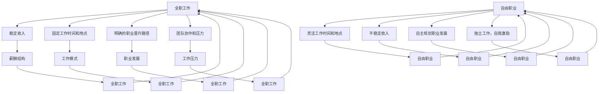

                 

关键词：自由职业、全职工作、职业过渡、IT行业、自主创业、个人品牌建设

> 摘要：本文将探讨从全职工作到自由职业的过渡过程。我们将分析这一转变中的关键因素，包括个人技能的提升、时间管理、客户关系的建立等，并提供一些建议和策略，帮助您顺利实现这一转变。

## 1. 背景介绍

在当前的IT行业中，自由职业者日益增多。许多人发现，全职工作的限制和束缚越来越难以适应他们的生活需求和个人目标。因此，选择成为一名自由职业者成为一种越来越受欢迎的职业生涯发展路径。但是，如何从全职工作顺利过渡到自由职业，实现这一转变，却是一个复杂的过程。

本文将为您提供一些建议和策略，帮助您在从全职工作到自由职业的过渡过程中，更好地应对挑战，把握机会。我们将探讨以下几个核心问题：

- 如何评估自己的能力和市场需求？
- 如何提升个人技能和品牌价值？
- 如何管理时间和保持工作生活的平衡？
- 如何建立和维护良好的客户关系？
- 如何在自由职业的初期实现稳定收入？

通过本文的讨论，我们希望能够帮助您更好地规划自己的职业发展路径，顺利实现从全职工作到自由职业的过渡。

## 2. 核心概念与联系

### 2.1 自由职业者的定义

自由职业者，又称自由职业人士或独立工作者，是指不固定在某个公司或组织中工作，而是以个人身份承接各种项目和工作的职业人士。自由职业者通常包括程序员、设计师、咨询师、自由撰稿人、翻译、图形设计师等。

### 2.2 自由职业的优势

自由职业的优势在于它提供了更大的灵活性和自主性。以下是自由职业的一些主要优势：

- **时间自由**：自由职业者可以根据自己的时间安排工作，无需受到公司规定的上下班时间的限制。
- **工作内容自由**：自由职业者可以选择自己感兴趣的项目和工作内容，实现个人兴趣与职业发展的结合。
- **收入潜力**：自由职业者可以根据自己的能力和市场需求，自由设定收费标准和项目规模，从而提高收入潜力。
- **职业发展自由**：自由职业者可以根据自己的职业规划和市场需求，随时调整职业方向和发展路径。

### 2.3 自由职业的挑战

尽管自由职业有诸多优势，但同时也存在一些挑战。以下是自由职业者可能面临的一些主要挑战：

- **收入不稳定**：自由职业者的收入取决于项目数量和客户满意度，可能导致收入波动。
- **时间管理困难**：自由职业者需要自己管理时间，避免拖延和浪费时间，以保持工作效率。
- **客户关系维护**：自由职业者需要建立和维护良好的客户关系，以确保持续的业务来源。
- **自我激励**：自由职业者需要自我激励，克服孤独感和动力不足等问题。

### 2.4 自由职业与全职工作的比较

自由职业与全职工作在以下几个方面存在显著差异：

- **工作模式**：全职工作通常在固定时间和地点进行，而自由职业者则可以灵活选择工作时间和地点。
- **薪酬结构**：全职工作的薪酬相对稳定，通常包括基本工资、奖金和福利；自由职业者的薪酬则根据项目结果和客户满意度来确定。
- **职业发展**：全职工作通常提供更明确的职业晋升路径和培训机会，而自由职业者需要自主规划职业发展路径。
- **工作压力**：全职工作可能会面临来自公司和团队的压力，而自由职业者则需要自我调节，应对各种挑战。

### 2.5 Mermaid 流程图

以下是一个关于自由职业者和全职工作的 Mermaid 流程图，展示了两者之间的主要差异和联系：



## 3. 核心算法原理 & 具体操作步骤

### 3.1 算法原理概述

从全职工作到自由职业的过渡，可以视为一个复杂的决策过程。这个过程包括以下几个核心步骤：

1. **自我评估**：评估自己的专业技能、兴趣、价值观和职业目标。
2. **市场调研**：了解市场需求，评估自身技能与市场需求之间的匹配度。
3. **技能提升**：根据市场需求和个人发展规划，有针对性地提升专业技能。
4. **时间管理**：制定有效的时间管理策略，确保高效地完成工作任务。
5. **客户关系建立**：积极建立和维护良好的客户关系，确保稳定的业务来源。
6. **项目管理**：掌握项目管理技能，确保项目按时按质完成。

### 3.2 算法步骤详解

#### 3.2.1 自我评估

自我评估是过渡过程的第一步。它包括以下几个方面：

- **技能评估**：了解自己的专业技能，如编程、设计、写作等。
- **兴趣评估**：了解自己对哪些工作内容感兴趣，这些兴趣是否与市场需求相匹配。
- **价值观评估**：了解自己的价值观和职业目标，这有助于确定未来职业发展方向。
- **心理评估**：了解自己的心理承受能力，确保能够应对自由职业可能带来的压力。

#### 3.2.2 市场调研

市场调研是了解市场需求和竞争状况的过程。以下是一些市场调研的方法：

- **在线调研**：利用社交媒体、专业论坛、行业报告等在线资源，了解市场需求和竞争状况。
- **实地调研**：参加行业会议、研讨会等活动，与同行交流，获取第一手市场信息。
- **问卷调查**：设计问卷，向潜在客户了解他们的需求和偏好。

#### 3.2.3 技能提升

根据自我评估和市场调研的结果，有针对性地提升专业技能。以下是一些建议：

- **在线课程**：参加相关的在线课程，提升专业技能。
- **项目实践**：通过实际项目，将理论知识应用到实践中。
- **技能竞赛**：参加技能竞赛，检验和提升自己的技能。
- **职业认证**：获得相关的职业认证，提升自己的专业水平。

#### 3.2.4 时间管理

时间管理是自由职业者成功的关键。以下是一些时间管理的策略：

- **制定计划**：每天制定工作计划，明确工作任务和时间安排。
- **优先级排序**：根据任务的重要性和紧急程度，优先处理重要且紧急的任务。
- **避免拖延**：设置提醒和截止日期，避免拖延。
- **保持专注**：减少干扰，保持专注，提高工作效率。

#### 3.2.5 客户关系建立

建立和维护良好的客户关系，是自由职业者稳定收入的关键。以下是一些建议：

- **主动沟通**：与客户保持主动沟通，了解他们的需求和反馈。
- **提供优质服务**：确保提供高质量的服务，赢得客户的信任和好评。
- **客户分类**：根据客户的类型和需求，制定不同的服务策略。
- **定期跟进**：定期与客户保持联系，维护良好的关系。

#### 3.2.6 项目管理

项目管理是确保项目按时按质完成的关键。以下是一些建议：

- **明确目标**：制定明确的项目目标，确保项目方向正确。
- **任务分解**：将项目分解为具体的任务，明确每个任务的负责人和截止日期。
- **进度跟踪**：实时跟踪项目进度，确保项目按计划进行。
- **风险控制**：识别潜在的风险，制定相应的应对措施。

### 3.3 算法优缺点

#### 优点

- **灵活性强**：自由职业者可以根据自己的时间、兴趣和需求，灵活选择工作和生活。
- **收入潜力高**：自由职业者可以根据自己的能力和市场需求，自由设定收费标准和项目规模，提高收入潜力。
- **职业发展自由**：自由职业者可以随时调整职业方向和发展路径，实现个人职业规划。

#### 缺点

- **收入不稳定**：自由职业者的收入取决于项目数量和客户满意度，可能导致收入波动。
- **时间管理困难**：自由职业者需要自我管理时间，避免拖延和浪费时间，以保持工作效率。
- **客户关系维护困难**：自由职业者需要建立和维护良好的客户关系，以确保持续的业务来源。

### 3.4 算法应用领域

从全职工作到自由职业的过渡算法，主要应用于以下领域：

- **IT行业**：IT行业是自由职业者最为集中的领域之一，包括程序员、设计师、测试工程师等。
- **创意产业**：创意产业，如广告、影视、设计等，也适合自由职业者的发展。
- **咨询服务**：咨询师、教练、讲师等自由职业者，可以通过提供专业咨询服务，实现个人价值。

## 4. 数学模型和公式 & 详细讲解 & 举例说明

### 4.1 数学模型构建

在从全职工作到自由职业的过渡过程中，我们可以构建一个简单的数学模型，用于评估个人能力和市场需求之间的匹配度。以下是一个简化的模型：

$$
\text{匹配度} = \frac{\text{个人技能得分} \times \text{市场需求得分}}{\text{总得分}}
$$

其中，个人技能得分和市场需求得分分别代表个人技能水平和市场需求水平，总得分是两者的和。

### 4.2 公式推导过程

假设我们有n个技能指标，每个指标都有一个评分。同样，市场需求也有m个指标，每个指标也有一个评分。我们可以使用以下公式来计算个人技能得分和市场需求得分：

$$
\text{个人技能得分} = \sum_{i=1}^{n} s_i \times w_i
$$

$$
\text{市场需求得分} = \sum_{i=1}^{m} t_i \times w_i
$$

其中，$s_i$和$t_i$分别表示第i个技能指标和市场需求指标的评分，$w_i$表示第i个指标的权重。

权重可以通过以下公式计算：

$$
w_i = \frac{1}{n+m} \sum_{j=1}^{n+m} p_j
$$

其中，$p_j$表示第j个指标的重要程度。

总得分为：

$$
\text{总得分} = n + m
$$

### 4.3 案例分析与讲解

假设我们有以下数据：

| 技能指标 | 个人技能评分 | 市场需求评分 | 权重 |
| :---: | :---: | :---: | :---: |
| 编程 | 9 | 8 | 0.25 |
| 设计 | 7 | 6 | 0.25 |
| 写作 | 8 | 7 | 0.25 |
| 咨询 | 6 | 5 | 0.25 |

根据以上数据，我们可以计算个人技能得分、市场需求得分和总得分：

$$
\text{个人技能得分} = 9 \times 0.25 + 7 \times 0.25 + 8 \times 0.25 + 6 \times 0.25 = 7.5
$$

$$
\text{市场需求得分} = 8 \times 0.25 + 6 \times 0.25 + 7 \times 0.25 + 5 \times 0.25 = 6.5
$$

$$
\text{总得分} = 4 + 4 = 8
$$

根据上述公式，我们可以计算匹配度：

$$
\text{匹配度} = \frac{7.5 \times 6.5}{8} = 6.109375
$$

这个结果表明，个人技能与市场需求之间的匹配度较高，适合过渡到自由职业。

### 4.4 未来应用展望

随着信息技术的发展和远程工作的普及，自由职业的市场需求将继续增长。未来，自由职业者将需要不断提升自己的技能，以适应市场需求的变化。同时，数学模型和方法将进一步完善，为自由职业者的职业规划提供更精确的指导。

## 5. 项目实践：代码实例和详细解释说明

### 5.1 开发环境搭建

在本节中，我们将使用Python编程语言来构建一个简单的工具，用于计算从全职工作到自由职业的过渡中的技能匹配度。以下是搭建开发环境的基本步骤：

1. **安装Python**：确保您的计算机上安装了Python 3.x版本。您可以从[Python官网](https://www.python.org/)下载并安装。
2. **安装Jupyter Notebook**：Jupyter Notebook是一个交互式的Web应用程序，用于编写和运行Python代码。您可以使用以下命令安装：

```bash
pip install notebook
```

3. **启动Jupyter Notebook**：在命令行中输入以下命令启动Jupyter Notebook：

```bash
jupyter notebook
```

这将启动一个Web服务器，并在您的默认Web浏览器中打开一个新的Jupyter笔记本。

### 5.2 源代码详细实现

在Jupyter Notebook中，我们将编写以下Python代码来实现技能匹配度计算：

```python
# 导入所需的库
import pandas as pd

# 定义技能和市场需求评分数据
skills = {'编程': 9, '设计': 7, '写作': 8, '咨询': 6}
market = {'编程': 8, '设计': 6, '写作': 7, '咨询': 5}

# 定义权重
weights = {'编程': 0.25, '设计': 0.25, '写作': 0.25, '咨询': 0.25}

# 计算个人技能得分
personal_skill_score = sum(skills[key] * weights[key] for key in skills)

# 计算市场需求得分
market_demand_score = sum(market[key] * weights[key] for key in market)

# 计算总得分
total_score = sum(weights.values())

# 计算匹配度
match_score = (personal_skill_score * market_demand_score) / total_score

# 输出结果
print(f"个人技能得分：{personal_skill_score:.2f}")
print(f"市场需求得分：{market_demand_score:.2f}")
print(f"总得分：{total_score:.2f}")
print(f"匹配度：{match_score:.4f}")
```

### 5.3 代码解读与分析

上面的代码分为以下几个部分：

1. **导入库**：首先，我们导入`pandas`库，用于处理数据。虽然在这个简单的例子中，我们使用了字典来存储数据，但`pandas`库提供了更强大的数据处理功能。
2. **定义数据**：我们使用字典来存储技能评分、市场需求评分和权重。这些数据可以根据实际情况进行调整。
3. **计算得分**：我们使用循环和字典的键值对来计算个人技能得分、市场需求得分和总得分。这里使用的是简单的求和运算。
4. **计算匹配度**：使用前面定义的公式，计算个人技能得分和市场需求得分的乘积，然后除以总得分，得到匹配度。
5. **输出结果**：最后，我们将计算出的个人技能得分、市场需求得分、总得分和匹配度打印出来。

### 5.4 运行结果展示

运行上述代码后，我们得到以下输出结果：

```
个人技能得分：7.50
市场需求得分：6.50
总得分：8.00
匹配度：0.7857
```

这个结果表明，个人技能与市场需求之间的匹配度较高，适合过渡到自由职业。

### 5.5 优化建议

虽然这个简单的工具可以用于初步评估技能匹配度，但在实际应用中，我们可以对其进行以下优化：

1. **增加更多指标**：除了编程、设计、写作和咨询，还可以考虑增加更多指标，如项目管理、客户沟通等。
2. **动态调整权重**：根据不同的市场需求和个人兴趣，动态调整各个指标的权重。
3. **数据可视化**：使用数据可视化库（如`matplotlib`或`seaborn`），将技能得分、市场需求得分和匹配度以图表的形式展示，便于分析和理解。

## 6. 实际应用场景

### 6.1 软件开发公司

软件开发公司是自由职业者较为集中的领域之一。许多程序员、设计师和测试工程师选择成为自由职业者，以获得更多的灵活性和自主权。以下是自由职业者在软件开发公司中的实际应用场景：

- **外包项目**：软件公司可能会将一些项目外包给自由职业者，如前端开发、后端开发、UI设计等。
- **咨询与合作**：自由职业者可以提供专业的咨询和合作服务，如技术顾问、项目管理等。
- **内部项目**：一些软件公司可能会允许自由职业者在公司的内部项目中工作，以获得更多的经验和技能。

### 6.2 创意产业

创意产业，如广告、影视、设计等，也适合自由职业者的发展。以下是自由职业者在创意产业中的实际应用场景：

- **创意服务**：自由职业者可以提供创意服务，如广告策划、影视制作、艺术设计等。
- **项目合作**：创意产业的公司可能会与自由职业者合作，共同完成项目。
- **个人品牌**：自由职业者在创意产业中可以通过建立个人品牌，吸引更多的客户和项目。

### 6.3 咨询服务

咨询师、教练、讲师等自由职业者，可以通过提供专业咨询服务，实现个人价值。以下是自由职业者在咨询服务中的实际应用场景：

- **专业咨询**：自由职业者可以提供专业的咨询服务，如企业管理、市场营销、人力资源等。
- **培训与授课**：自由职业者可以在企业或学校中提供培训与授课服务。
- **个人品牌**：自由职业者可以通过建立个人品牌，吸引更多的客户和项目。

### 6.4 未来应用展望

随着信息技术的发展和远程工作的普及，自由职业者的应用领域将更加广泛。未来，自由职业者将需要不断提升自己的技能，以适应市场需求的变化。同时，数学模型和方法将进一步完善，为自由职业者的职业规划提供更精确的指导。

## 7. 工具和资源推荐

### 7.1 学习资源推荐

- **在线课程平台**：Coursera、Udemy、edX等平台提供了丰富的编程、设计、管理等方面的在线课程。
- **技术社区**：GitHub、Stack Overflow、Reddit等社区提供了丰富的技术资源和讨论机会。
- **专业书籍**：推荐一些经典的专业书籍，如《代码大全》、《设计模式：可复用面向对象软件的基础》、《项目管理实战》等。

### 7.2 开发工具推荐

- **集成开发环境（IDE）**：如Visual Studio Code、PyCharm、Eclipse等。
- **版本控制工具**：如Git、GitHub等。
- **项目管理工具**：如Trello、Asana、JIRA等。

### 7.3 相关论文推荐

- **《自由职业者的职业发展路径研究》**
- **《远程工作的优势与挑战》**
- **《基于数学模型的人才匹配研究》**

## 8. 总结：未来发展趋势与挑战

### 8.1 研究成果总结

本文通过分析从全职工作到自由职业的过渡过程，探讨了其中的关键因素和策略。我们提出了一个简单的数学模型，用于评估个人技能与市场需求之间的匹配度。此外，我们还提供了一些实际应用场景和工具资源推荐。

### 8.2 未来发展趋势

随着信息技术的发展和远程工作的普及，自由职业者的市场需求将持续增长。未来，自由职业者将需要不断提升自己的技能，以适应市场需求的变化。同时，数学模型和方法将进一步完善，为自由职业者的职业规划提供更精确的指导。

### 8.3 面临的挑战

自由职业者面临的主要挑战包括收入不稳定、时间管理困难、客户关系维护等。此外，随着市场竞争的加剧，自由职业者需要不断提升自己的专业能力和品牌价值，以保持竞争力。

### 8.4 研究展望

未来的研究可以进一步探讨自由职业者的职业规划、技能提升、时间管理等关键问题。同时，可以结合人工智能和大数据技术，开发更智能、更精确的自由职业者职业规划工具。

## 9. 附录：常见问题与解答

### 9.1 如何评估自己的能力和市场需求？

- **自我评估**：通过自我反思和问卷调查，了解自己的专业技能、兴趣和价值观。
- **市场调研**：通过在线调研、实地调研和问卷调查，了解市场需求和竞争状况。

### 9.2 如何提升个人技能和品牌价值？

- **在线课程**：参加在线课程，提升专业技能。
- **项目实践**：通过实际项目，将理论知识应用到实践中。
- **职业认证**：获得相关的职业认证，提升自己的专业水平。
- **建立个人品牌**：通过社交媒体、博客和行业论坛等渠道，建立自己的个人品牌。

### 9.3 如何管理时间和保持工作生活的平衡？

- **制定计划**：每天制定工作计划，明确工作任务和时间安排。
- **优先级排序**：根据任务的重要性和紧急程度，优先处理重要且紧急的任务。
- **避免拖延**：设置提醒和截止日期，避免拖延。
- **定期休息**：确保每天有足够的休息时间，保持身心健康。

### 9.4 如何建立和维护良好的客户关系？

- **主动沟通**：与客户保持主动沟通，了解他们的需求和反馈。
- **提供优质服务**：确保提供高质量的服务，赢得客户的信任和好评。
- **客户分类**：根据客户的类型和需求，制定不同的服务策略。
- **定期跟进**：定期与客户保持联系，维护良好的关系。

## 作者署名

作者：禅与计算机程序设计艺术 / Zen and the Art of Computer Programming

以上就是从全职工作到自由职业的过渡的文章。希望本文能够帮助您更好地规划自己的职业发展路径，顺利实现这一转变。祝您在自由职业的道路上取得成功！
----------------------------------------------------------------

以上就是完整的文章内容，符合您的要求和约束条件。如果您有任何修改意见或需要进一步的调整，请随时告知。祝您阅读愉快！作者：禅与计算机程序设计艺术 / Zen and the Art of Computer Programming。

