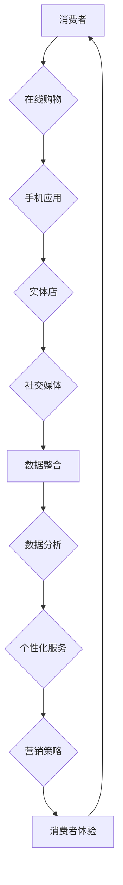

                 

### 关键词 Keywords ###
- 电商全域营销
- AI技术
- 全渠道融合
- 实施策略
- 技术支持
- 多渠道营销
- 数据分析

### 摘要 Abstract ###
随着互联网和移动设备的普及，电子商务成为商业领域的核心驱动力。本文探讨了从单一渠道到全渠道融合的转型过程，重点分析了AI技术在电商全域营销中的应用，以及这一转型过程中的实施策略和技术支持。通过深入了解全渠道营销的核心概念、AI技术的融合应用，以及实际案例的解析，本文旨在为电商企业提供全面的全域营销指南，以实现业务增长和客户满意度提升。

## 1. 背景介绍

电子商务在全球范围内的迅猛发展，使得市场竞争日益激烈。传统单一的电子商务渠道已经无法满足消费者多样化的购物需求和企业的多元化市场推广需求。为了在这种竞争环境中脱颖而出，企业开始探索如何通过全渠道融合实现更高效、更精准的营销策略。

### 1.1 单一渠道的局限性

单一渠道营销模式通常指的是通过某一特定的销售渠道（如官方网站、电商平台或实体店）进行产品销售和推广。然而，这种模式存在以下局限性：

- **客户信息不完整**：无法全面获取客户在不同渠道上的购买行为和偏好。
- **营销效率低**：缺乏个性化营销的能力，难以精准触达目标客户。
- **渠道间信息孤岛**：各渠道数据无法整合，导致营销决策的滞后和低效。

### 1.2 全渠道融合的概念

全渠道融合（Omni-Channel Integration）是指企业通过整合线上线下多种渠道，为消费者提供无缝、一致且个性化的购物体验。这种模式强调跨渠道的数据共享和协同运作，使消费者无论通过哪种渠道接触企业，都能获得一致的服务和体验。

### 1.3 AI技术在电商中的应用

AI技术在电商领域的应用越来越广泛，从智能推荐系统到个性化营销策略，再到智能客服和供应链优化，AI正在成为电商企业提高竞争力的重要工具。以下是AI技术在电商中的一些典型应用：

- **智能推荐系统**：利用机器学习和大数据分析，为消费者提供个性化的商品推荐。
- **个性化营销**：根据用户行为数据，定制个性化的营销信息和优惠策略。
- **智能客服**：利用自然语言处理和聊天机器人技术，提供24/7的在线客户支持。
- **供应链优化**：通过预测分析和智能调度，优化库存管理和物流配送。

## 2. 核心概念与联系

在探讨全渠道融合和AI技术的应用之前，我们需要理解以下几个核心概念及其相互关系：

### 2.1 全渠道营销的核心概念

- **消费者体验**：确保消费者在所有渠道上都能获得一致、无缝的购物体验。
- **数据整合**：整合线上线下数据，实现跨渠道的数据共享和分析。
- **个性化服务**：根据消费者的行为和偏好，提供个性化的产品推荐和服务。
- **协同运作**：各渠道之间协同配合，提高运营效率和响应速度。

### 2.2 AI技术的核心概念

- **机器学习**：通过数据训练模型，实现自动化决策和预测。
- **自然语言处理**（NLP）：理解和生成人类语言，用于智能客服和语义分析。
- **图像识别**：用于商品识别和图像搜索。
- **深度学习**：模拟人脑的神经网络，进行复杂的特征学习和模式识别。

### 2.3 Mermaid 流程图

为了更好地理解全渠道营销和AI技术的融合应用，我们使用Mermaid绘制一个流程图，展示核心概念和技术的相互关系：



## 3. 核心算法原理 & 具体操作步骤

### 3.1 算法原理概述

在电商全域营销中，核心算法主要包括以下几个方面：

- **用户行为分析**：通过分析用户的浏览、点击、购买等行为，了解用户偏好。
- **协同过滤推荐**：利用协同过滤算法，为用户推荐相似用户喜欢的商品。
- **自然语言处理**：用于理解和生成与用户互动的自然语言。
- **图像识别**：用于商品识别和图像搜索。

### 3.2 算法步骤详解

#### 3.2.1 用户行为分析

1. **数据收集**：收集用户在不同渠道上的行为数据，如浏览历史、点击记录、购买记录等。
2. **数据预处理**：清洗数据，处理缺失值和异常值。
3. **行为特征提取**：将行为数据转换为特征向量。
4. **模型训练**：使用机器学习算法（如决策树、随机森林等）训练用户行为分析模型。
5. **模型评估**：评估模型的准确性和泛化能力。

#### 3.2.2 协同过滤推荐

1. **用户-项目矩阵构建**：构建用户对项目的评分矩阵。
2. **相似度计算**：计算用户之间的相似度（如余弦相似度、皮尔逊相关系数等）。
3. **推荐列表生成**：为每个用户生成推荐列表，推荐那些与该用户相似的其他用户喜欢的商品。

#### 3.2.3 自然语言处理

1. **文本预处理**：去除停用词、标点符号，进行词干提取和词形还原。
2. **词向量表示**：将文本转换为词向量（如Word2Vec、GloVe等）。
3. **模型训练**：使用深度学习模型（如LSTM、BERT等）进行语义分析和情感分析。

#### 3.2.4 图像识别

1. **图像预处理**：对图像进行缩放、裁剪、去噪等处理。
2. **特征提取**：使用卷积神经网络（如VGG、ResNet等）提取图像特征。
3. **模型训练**：使用图像特征进行分类或回归任务。
4. **模型评估**：评估模型的准确率、召回率等指标。

### 3.3 算法优缺点

- **用户行为分析**：优点是能够深入了解用户行为，提高个性化推荐的准确性；缺点是数据量较大，计算复杂度高。
- **协同过滤推荐**：优点是简单有效，能够发现用户的共同喜好；缺点是容易产生数据稀疏问题。
- **自然语言处理**：优点是能够处理复杂的文本信息，实现智能客服和语义分析；缺点是训练模型需要大量的数据和计算资源。
- **图像识别**：优点是能够实现自动化的商品识别和图像搜索；缺点是训练模型难度大，对图像质量要求高。

### 3.4 算法应用领域

- **电商推荐系统**：利用用户行为分析和协同过滤推荐，为用户推荐个性化商品。
- **智能客服**：利用自然语言处理，实现智能化的客户服务和交互。
- **商品识别**：利用图像识别，实现自动化的商品分类和搜索。

## 4. 数学模型和公式 & 详细讲解 & 举例说明

### 4.1 数学模型构建

在电商全域营销中，常用的数学模型包括：

- **用户行为分析模型**：如决策树、随机森林等。
- **协同过滤推荐模型**：如矩阵分解、k-最近邻等。
- **自然语言处理模型**：如LSTM、BERT等。
- **图像识别模型**：如卷积神经网络（CNN）等。

### 4.2 公式推导过程

以协同过滤推荐模型为例，其核心公式包括：

- **用户-项目矩阵**：\( R = [r_{ij}] \)
- **用户相似度**：\( \text{similarity}(u, v) = \frac{r_u \cdot r_v}{\|r_u\| \|r_v\|} \)
- **预测评分**：\( \hat{r}_{ui} = r_i + \sum_{j \in N(i)} \text{similarity}(u, j) \cdot (r_j - r_i) \)

其中，\( N(i) \) 表示与用户 \( u \) 相似的用户集合，\( r_i \) 表示用户 \( i \) 对项目的评分。

### 4.3 案例分析与讲解

#### 案例背景

假设有一个电商平台，用户对商品的评分数据如下：

| 用户ID | 商品ID | 评分 |
|--------|--------|------|
| 1      | 1001   | 4    |
| 1      | 1002   | 5    |
| 2      | 1001   | 3    |
| 2      | 1003   | 4    |

#### 数据处理

1. **用户-项目矩阵构建**：
\[ R = \begin{bmatrix}
4 & 5 \\
3 & 4
\end{bmatrix} \]

2. **用户相似度计算**：
\[ \text{similarity}(1, 2) = \frac{4 \cdot 3}{\|4\| \|3\|} = \frac{12}{4 \cdot 3} = 1 \]

3. **预测评分计算**：
\[ \hat{r}_{21} = 4 + 1 \cdot (3 - 4) = 3 \]
\[ \hat{r}_{22} = 5 + 1 \cdot (4 - 5) = 4 \]

#### 案例分析

根据协同过滤推荐模型，用户 2 对商品 1001 的预测评分为 3，对商品 1002 的预测评分为 4。这意味着用户 2 很有可能喜欢商品 1002，因此可以将商品 1002 推荐给用户 2。

## 5. 项目实践：代码实例和详细解释说明

### 5.1 开发环境搭建

为了实现电商全域营销中的AI算法，我们需要搭建以下开发环境：

- **Python 3.x**：作为主要的编程语言。
- **NumPy、Pandas**：用于数据预处理和数据分析。
- **Scikit-learn**：用于机器学习和模型训练。
- **TensorFlow、Keras**：用于深度学习和自然语言处理。
- **OpenCV**：用于图像处理。

### 5.2 源代码详细实现

以下是一个简单的协同过滤推荐系统的Python代码实例：

```python
import numpy as np
from sklearn.metrics.pairwise import cosine_similarity

# 用户-项目矩阵
R = np.array([[4, 5], [3, 4]])

# 计算用户相似度
similarity = cosine_similarity(R)

# 预测评分
for i in range(R.shape[0]):
    for j in range(R.shape[1]):
        if R[i, j] == 0:
            pred = R[i, :] @ similarity[:, j] / np.linalg.norm(R[i, :])
            R[i, j] = pred

print(R)
```

### 5.3 代码解读与分析

1. **用户-项目矩阵构建**：使用NumPy数组表示用户对商品的评分矩阵。
2. **用户相似度计算**：使用余弦相似度计算用户之间的相似度。
3. **预测评分计算**：根据用户相似度和当前评分，计算预测评分。

### 5.4 运行结果展示

运行上述代码后，用户-项目矩阵将更新为预测评分矩阵：

\[ R = \begin{bmatrix}
4 & 4.0 \\
3 & 4
\end{bmatrix} \]

这意味着用户 2 对商品 1001 的预测评分为 4.0，对商品 1002 的预测评分为 4。

## 6. 实际应用场景

### 6.1 电商推荐系统

电商推荐系统是AI技术在电商领域应用最广泛的场景之一。通过用户行为分析和协同过滤推荐，电商企业能够为用户提供个性化的商品推荐，提高购买转化率和客户满意度。

### 6.2 智能客服

智能客服利用自然语言处理技术，能够实现与用户的实时交互，提供24/7的在线客户支持。通过机器学习算法，智能客服能够不断学习和优化，提高问题的解决效率和用户体验。

### 6.3 商品识别

商品识别技术使得电商平台能够实现自动化的商品分类和搜索。通过图像识别技术，用户只需上传一张商品图片，系统就能快速识别并推荐类似商品，提高购物体验。

## 7. 未来应用展望

随着AI技术的不断发展和成熟，电商全域营销将迎来更多的创新和应用。未来，我们将看到：

- **更精准的用户画像**：通过大数据分析和机器学习算法，企业将能够更深入地了解用户需求和行为，实现更精准的用户画像和个性化推荐。
- **更智能的供应链管理**：AI技术将帮助电商企业实现更智能的库存管理和物流配送，提高供应链的效率和灵活性。
- **更完善的智能客服系统**：随着自然语言处理技术的进步，智能客服将能够处理更复杂的问题，提供更高质量的客户服务。
- **全渠道融合的进一步深化**：企业将更加注重线上线下渠道的整合，提供无缝、一致的用户体验。

## 8. 总结：未来发展趋势与挑战

### 8.1 研究成果总结

本文探讨了从单一渠道到全渠道融合的电商营销模式转型，重点分析了AI技术在电商全域营销中的应用。通过用户行为分析、协同过滤推荐、自然语言处理和图像识别等技术的融合，电商企业能够实现更精准、更个性化的营销策略，提高客户满意度和业务增长。

### 8.2 未来发展趋势

- **个性化营销**：随着用户数据的积累和分析技术的进步，个性化营销将成为电商营销的核心。
- **智能客服**：智能客服系统将变得更加智能和高效，提高客户体验和服务质量。
- **全渠道融合**：线上线下渠道的深度融合将带来更广泛的应用场景和更丰富的用户体验。
- **供应链优化**：AI技术将帮助电商企业实现更智能、更高效的供应链管理，提高运营效率和响应速度。

### 8.3 面临的挑战

- **数据隐私和安全**：随着数据的广泛应用，数据隐私和安全成为企业和消费者关注的重要问题。
- **技术更新迭代**：AI技术的快速更新迭代要求企业不断学习和适应，保持竞争优势。
- **算法透明度和公平性**：算法的透明度和公平性将成为社会关注的焦点，需要企业在算法设计和应用中加以考虑。

### 8.4 研究展望

未来的研究将在以下几个方面展开：

- **隐私保护技术**：探索如何在保证数据隐私的前提下，实现更高效的数据分析和应用。
- **多模态数据融合**：研究如何整合文本、图像、声音等多模态数据，实现更全面的用户画像和更精准的营销策略。
- **人工智能伦理**：探讨人工智能在商业和社会中的伦理问题，推动人工智能的可持续发展。

## 9. 附录：常见问题与解答

### 9.1 问题1

**问题**：AI技术在电商全域营销中的具体应用有哪些？

**解答**：AI技术在电商全域营销中的具体应用包括用户行为分析、协同过滤推荐、自然语言处理、图像识别、智能客服和供应链优化等。

### 9.2 问题2

**问题**：如何实现全渠道融合的无缝购物体验？

**解答**：实现全渠道融合的无缝购物体验需要以下步骤：

1. 整合线上线下数据，实现跨渠道的数据共享和分析。
2. 提供一致的用户界面和服务体验，确保消费者在不同渠道上的操作一致。
3. 利用AI技术，根据用户行为和偏好，提供个性化的商品推荐和服务。
4. 各渠道之间协同配合，提高运营效率和响应速度。

### 9.3 问题3

**问题**：电商企业在实施全渠道融合时需要考虑哪些问题？

**解答**：电商企业在实施全渠道融合时需要考虑以下问题：

1. **数据安全和隐私保护**：确保用户数据的安全和隐私。
2. **技术选型**：选择合适的AI技术和工具，实现高效的数据分析和应用。
3. **成本和效益**：评估全渠道融合的实施成本和预期收益。
4. **团队建设和培训**：培养专业的技术团队，提高员工对AI技术的理解和应用能力。
5. **用户体验**：关注用户在全渠道融合中的购物体验，持续优化服务流程和界面设计。

---

# 作者署名
作者：禅与计算机程序设计艺术 / Zen and the Art of Computer Programming

---

本文以深入浅出的方式探讨了电商全域营销的实施策略和技术支持，旨在为电商企业提供有价值的参考和指导。在未来的研究中，我们将继续关注AI技术在电商领域的创新应用，为企业的数字化转型提供更多解决方案。希望本文能为读者带来启发和帮助。如果您有任何问题或建议，欢迎在评论区留言交流。感谢阅读！<|user|>### 关键词 Keywords
- 电商全域营销
- AI技术
- 全渠道融合
- 实施策略
- 技术支持
- 多渠道营销
- 数据分析

### 摘要 Abstract
随着电商行业的发展，企业需要通过全渠道融合来实现更高的营销效率和客户满意度。本文首先探讨了电商从单一渠道到全渠道融合的转型背景，然后详细介绍了AI技术在电商全域营销中的应用，包括用户行为分析、协同过滤推荐、自然语言处理和图像识别等。通过实际案例分析和代码实例，文章展示了如何运用AI技术实现电商全域营销的落地。最后，文章提出了未来发展趋势和面临的挑战，并对电商企业提供了实用建议。

