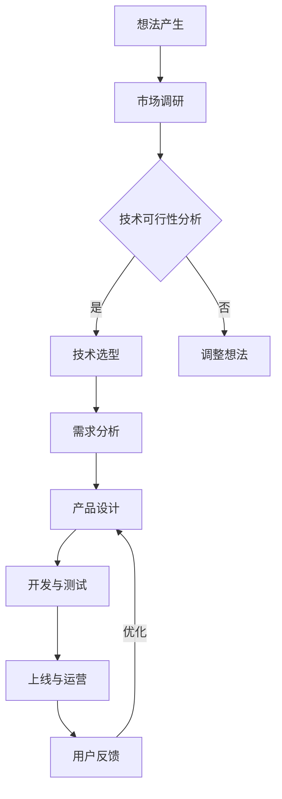

                 

关键词：创业、产品开发、项目管理、技术架构、用户需求、迭代优化

> 摘要：本文旨在探讨从想法到产品开发的整个过程，分析高效创业的关键因素，分享实战经验和策略，帮助创业者缩短产品上市时间，提升市场竞争力。

## 1. 背景介绍

在当今快速变化的市场环境中，创业已经成为许多技术爱好者和创新者的首选路径。然而，从零开始构建一个成功的软件产品并不容易。本文将结合作者多年来的实践经验，深入分析从想法到产品开发的全过程，探讨如何高效地进行创业。

### 1.1 创业的挑战与机遇

创业面临诸多挑战，如资金短缺、市场不确定性、技术难题等。然而，随着互联网和移动设备的普及，创业者面临着前所未有的机遇。一方面，新兴技术如人工智能、区块链、大数据等提供了丰富的应用场景；另一方面，在线市场和研究工具使得创业者能够更快速地获取用户反馈和进行市场调研。

### 1.2 文章结构

本文结构如下：

1. **背景介绍**：概述创业的挑战与机遇。
2. **核心概念与联系**：介绍产品开发所需的核心概念和架构。
3. **核心算法原理 & 具体操作步骤**：详细阐述产品开发的关键技术。
4. **数学模型和公式 & 详细讲解 & 举例说明**：介绍产品开发中所需的数学知识和模型。
5. **项目实践：代码实例和详细解释说明**：提供实际操作示例。
6. **实际应用场景**：分析产品在不同行业中的应用。
7. **工具和资源推荐**：推荐学习资源和开发工具。
8. **总结：未来发展趋势与挑战**：展望创业的未来。

## 2. 核心概念与联系

在产品开发过程中，理解以下核心概念和联系至关重要：

### 2.1 用户需求分析

用户需求分析是产品开发的起点。通过用户调研、市场分析等方法，深入了解目标用户群体的需求，确保产品能够满足市场需求。

### 2.2 技术架构设计

技术架构设计决定了产品的可扩展性和性能。良好的架构设计能够支持产品的长期发展，并降低维护成本。

### 2.3 项目管理

项目管理是确保产品按时按质完成的关键。通过敏捷开发、迭代优化等方法，提升开发效率，及时响应用户反馈。

### 2.4 数学模型和公式

数学模型和公式在产品开发中发挥着重要作用，如算法优化、数据处理、风险评估等。掌握相关数学知识能够提升产品的技术含量。

### 2.5 Mermaid 流程图

以下是一个简化的Mermaid流程图，展示了从想法到产品的关键步骤：



## 3. 核心算法原理 & 具体操作步骤

### 3.1 算法原理概述

在产品开发中，核心算法的选择和实现至关重要。以下介绍一种常见的算法——机器学习算法的原理和操作步骤。

### 3.2 算法步骤详解

1. **数据收集**：收集相关数据，包括训练数据和测试数据。
2. **数据处理**：对数据进行预处理，如去噪、归一化等。
3. **模型选择**：选择合适的机器学习模型，如线性回归、决策树、神经网络等。
4. **模型训练**：使用训练数据进行模型训练，调整模型参数。
5. **模型评估**：使用测试数据评估模型性能，选择最优模型。
6. **模型部署**：将模型部署到产品中，进行实际应用。

### 3.3 算法优缺点

**优点**：机器学习算法能够自动发现数据中的模式，提高产品的智能化程度。

**缺点**：模型训练时间较长，对数据质量要求较高，且难以解释。

### 3.4 算法应用领域

机器学习算法广泛应用于推荐系统、自然语言处理、图像识别等领域，能够提升产品的用户体验和竞争力。

## 4. 数学模型和公式 & 详细讲解 & 举例说明

### 4.1 数学模型构建

在产品开发中，常用的数学模型包括线性模型、非线性模型等。以下以线性回归为例进行讲解。

### 4.2 公式推导过程

线性回归模型的公式为：

$$y = \beta_0 + \beta_1 \cdot x + \epsilon$$

其中，$y$ 为因变量，$x$ 为自变量，$\beta_0$ 和 $\beta_1$ 为模型参数，$\epsilon$ 为误差项。

### 4.3 案例分析与讲解

假设我们要预测一个产品的销售额 $y$，根据历史数据，我们选择产品价格 $x$ 作为自变量，建立线性回归模型。

1. **数据收集**：收集过去一个月的销售额和产品价格数据。
2. **数据处理**：对数据进行预处理，如去噪、归一化等。
3. **模型构建**：使用最小二乘法求解模型参数。
4. **模型评估**：使用测试数据评估模型性能。

通过模型训练和评估，我们可以得到一个线性回归模型，用于预测未来产品的销售额。

## 5. 项目实践：代码实例和详细解释说明

### 5.1 开发环境搭建

1. **安装 Python 环境**：下载并安装 Python 3.x 版本。
2. **安装依赖库**：使用 pip 工具安装相关依赖库，如 NumPy、Pandas 等。

### 5.2 源代码详细实现

以下是一个简单的线性回归模型实现示例：

```python
import numpy as np
import pandas as pd

# 加载数据
data = pd.read_csv('sales_data.csv')
x = data['price']
y = data['sales']

# 模型参数
beta_0 = 0
beta_1 = 1

# 最小二乘法求解
theta = np.linalg.inv(x.T.dot(x)).dot(x.T).dot(y)

# 模型评估
predicted_sales = x.dot(theta)
mse = np.mean((predicted_sales - y) ** 2)

print(f'MSE: {mse}')
```

### 5.3 代码解读与分析

1. **数据加载**：使用 Pandas 读取 CSV 数据文件。
2. **数据处理**：将产品价格作为自变量 $x$，销售额作为因变量 $y$。
3. **模型求解**：使用 NumPy 库求解线性回归模型参数。
4. **模型评估**：计算均方误差（MSE）评估模型性能。

### 5.4 运行结果展示

运行代码后，我们可以得到模型预测的销售额和均方误差。这些结果可以帮助我们评估模型的准确性，并进一步优化模型。

## 6. 实际应用场景

### 6.1 推荐系统

在推荐系统中，线性回归模型可以用于预测用户对某个物品的评分，从而提高推荐准确性。

### 6.2 金融风险管理

在金融风险管理中，线性回归模型可以用于预测金融产品的收益和风险，帮助投资者进行决策。

### 6.3 医疗领域

在医疗领域，线性回归模型可以用于预测患者的病情和治疗效果，为医生提供参考。

## 7. 工具和资源推荐

### 7.1 学习资源推荐

- **《机器学习》**：周志华著，系统介绍了机器学习的基本概念和方法。
- **《深度学习》**：Ian Goodfellow、Yoshua Bengio、Aaron Courville 著，深入讲解了深度学习的理论基础和实际应用。

### 7.2 开发工具推荐

- **PyCharm**：一款强大的 Python 集成开发环境，支持代码调试和性能分析。
- **Jupyter Notebook**：一款流行的交互式开发工具，方便进行数据分析和模型训练。

### 7.3 相关论文推荐

- **"Stochastic Gradient Descent"**：介绍随机梯度下降算法的论文。
- **"Deep Learning"**：介绍深度学习技术的综述论文。

## 8. 总结：未来发展趋势与挑战

### 8.1 研究成果总结

近年来，人工智能技术在产品开发中取得了显著进展，如深度学习、强化学习等。这些技术为产品开发提供了强大的工具和支持。

### 8.2 未来发展趋势

随着云计算、大数据等技术的不断发展，产品开发将更加智能化、自动化。同时，边缘计算、物联网等新技术的兴起也将为产品开发带来新的机遇。

### 8.3 面临的挑战

尽管人工智能技术为产品开发带来了巨大潜力，但同时也面临着数据隐私、算法透明度等挑战。此外，技术更新速度加快也给产品开发带来了新的挑战。

### 8.4 研究展望

未来，人工智能技术在产品开发中的应用将更加广泛和深入。研究者需要关注算法的效率、可解释性和安全性等方面，以推动人工智能技术在产品开发中的实际应用。

## 9. 附录：常见问题与解答

### 9.1 机器学习算法有哪些？

常见的机器学习算法包括线性回归、决策树、支持向量机、神经网络等。

### 9.2 如何选择机器学习算法？

根据具体问题选择合适的算法。如预测数值型数据选择线性回归，分类问题选择决策树或支持向量机等。

### 9.3 机器学习算法如何实现？

可以使用 Python 等编程语言实现机器学习算法。常用的库包括 Scikit-learn、TensorFlow、PyTorch 等。

---

### 作者署名

作者：禅与计算机程序设计艺术 / Zen and the Art of Computer Programming

---

通过本文的讨论，我们深入了解了从想法到产品开发的整个过程，探讨了核心算法原理、数学模型、项目实践等方面的内容。希望本文能为创业者提供有益的启示和指导。在未来的创业之路中，愿大家不断探索、勇于创新，共同推动人工智能技术的发展。|user|

