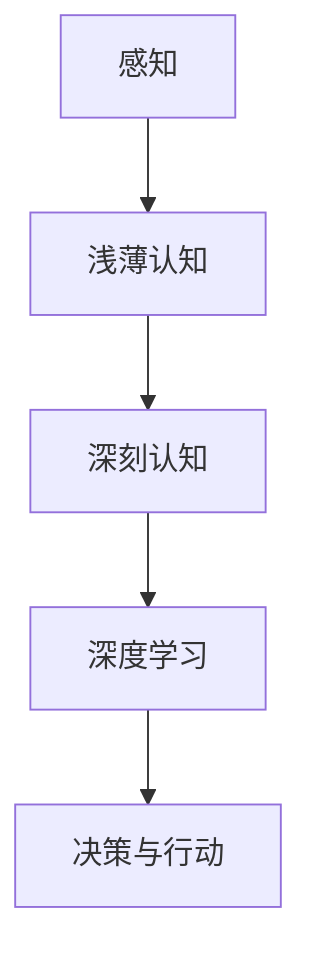

                 

关键词：认知过程、深度学习、信息处理、人类思维、认知科学

> 摘要：本文从认知科学的角度探讨了人类从浅薄到深刻的认知过程，并以此为基础，分析了深度学习算法在模拟人类认知过程中的应用与局限性。文章旨在揭示深度学习背后的认知原理，为人工智能的发展提供新的视角。

## 1. 背景介绍

在信息技术飞速发展的今天，人工智能（AI）已经成为一个热门话题。随着深度学习（Deep Learning）的兴起，人工智能在图像识别、自然语言处理、语音识别等领域取得了显著的成果。然而，尽管人工智能在某些任务上已经超越了人类，但它们仍然缺乏人类智慧的深层次理解能力。这种能力是人类认知过程的重要组成部分，它使得人类能够在复杂的环境中做出合理的决策和判断。

认知科学（Cognitive Science）是一门跨学科的研究领域，旨在理解人类思维和信息处理的过程。它涵盖了心理学、神经科学、计算机科学、哲学等多个学科。通过研究人类的认知过程，我们可以更好地理解人类的思维模式，从而为人工智能的发展提供理论支持。

本文将从认知科学的角度出发，探讨人类从浅薄到深刻的认知过程，并分析深度学习算法在模拟人类认知过程中的应用与局限性。希望通过本文的研究，能够为人工智能的发展提供新的思路。

## 2. 核心概念与联系

### 2.1 认知过程的定义

认知过程是指人类获取、处理、存储和使用信息的过程。它包括感知、记忆、注意、思考、判断等多个环节。这些环节相互关联，共同构成了人类复杂的认知体系。

### 2.2 浅薄认知与深刻认知

浅薄认知是指对信息进行表面层次的加工和理解，例如识别一个图像中的物体。而深刻认知则是对信息进行深层次的加工和理解，例如理解图像中的物体背后的含义。

### 2.3 深度学习与认知过程的联系

深度学习是一种基于多层神经网络的机器学习算法，它通过逐层提取特征，实现从浅层次到深层次的认知。深度学习在一定程度上模拟了人类的认知过程，但仍然存在一定的局限性。

### 2.4 Mermaid 流程图

下面是描述认知过程的一个 Mermaid 流程图，其中包含了浅薄认知与深刻认知的联系以及深度学习的应用：



## 3. 核心算法原理 & 具体操作步骤

### 3.1 算法原理概述

深度学习算法的核心思想是通过多层神经网络对数据进行特征提取和变换，从而实现对复杂任务的建模。在深度学习中，每层神经网络都会对输入数据进行处理，并产生新的特征表示。这些特征表示逐渐从浅层次的局部特征转化为深层次的语义特征。

### 3.2 算法步骤详解

#### 3.2.1 数据预处理

在进行深度学习之前，需要对数据进行预处理，包括数据清洗、归一化、数据增强等操作。

#### 3.2.2 构建神经网络

构建一个多层神经网络，包括输入层、隐藏层和输出层。每个层都可以包含多个神经元。

#### 3.2.3 前向传播

在前向传播过程中，输入数据通过网络的每一层，直到输出层。在每一层中，神经元对数据进行加权求和并应用激活函数。

#### 3.2.4 计算损失

通过比较预测结果与真实结果的差异，计算损失函数。常用的损失函数包括均方误差（MSE）和交叉熵损失。

#### 3.2.5 反向传播

通过反向传播算法，将损失函数的梯度反向传播到网络的每一层，从而更新每个神经元的权重。

#### 3.2.6 模型训练

重复上述步骤，直到模型收敛，即损失函数的值不再显著下降。

### 3.3 算法优缺点

#### 优点：

- 能够自动提取特征，减少人工设计特征的需求。
- 对大规模数据有很好的处理能力。
- 在某些任务上取得了超越人类的性能。

#### 缺点：

- 对数据量和计算资源有较高要求。
- 难以解释和调试。
- 对于某些复杂的任务，深度学习可能无法达到人类的表现。

### 3.4 算法应用领域

深度学习在图像识别、自然语言处理、语音识别等领域取得了显著成果。例如，在图像识别任务中，深度学习算法已经能够实现高精度的物体检测和图像分类。

## 4. 数学模型和公式 & 详细讲解 & 举例说明

### 4.1 数学模型构建

深度学习算法的核心是多层神经网络，其数学模型可以表示为：

$$
Y = f(Z) = f(W_n \cdot a_{n-1} + b_n)
$$

其中，$Y$ 表示输出，$f$ 表示激活函数，$W_n$ 和 $b_n$ 分别表示权重和偏置，$a_{n-1}$ 表示上一层的输出。

### 4.2 公式推导过程

#### 4.2.1 前向传播

在前向传播过程中，我们可以通过链式法则对网络进行求导：

$$
\frac{dY}{da_{n-1}} = \frac{dY}{dZ} \cdot \frac{dZ}{da_{n-1}}
$$

#### 4.2.2 反向传播

在反向传播过程中，我们需要计算损失函数关于每个权重的梯度：

$$
\frac{dL}{dW_n} = \frac{dL}{dZ} \cdot \frac{dZ}{da_n} \cdot a_n (1 - a_n)
$$

### 4.3 案例分析与讲解

假设我们有一个二分类问题，目标函数为：

$$
L(Y, \hat{Y}) = -[Y \cdot \log(\hat{Y}) + (1 - Y) \cdot \log(1 - \hat{Y})]
$$

其中，$Y$ 表示真实标签，$\hat{Y}$ 表示预测概率。

#### 4.3.1 前向传播

输入特征 $X$ 通过网络输出预测概率 $\hat{Y}$：

$$
\hat{Y} = \sigma(W_2 \cdot \sigma(W_1 \cdot X + b_1) + b_2)
$$

其中，$\sigma$ 表示 sigmoid 激活函数。

#### 4.3.2 反向传播

计算损失函数关于每个权重的梯度：

$$
\frac{dL}{dW_2} = \hat{Y} (1 - \hat{Y}) \cdot \frac{dL}{d\hat{Y}} \cdot \frac{d\hat{Y}}{dZ_2}
$$

$$
\frac{dL}{dW_1} = \sigma'(Z_1) \cdot \frac{dL}{dZ_1} \cdot \frac{dZ_1}{dW_1}
$$

$$
\frac{dL}{db_2} = \frac{dL}{dZ_2}
$$

$$
\frac{dL}{db_1} = \sigma'(Z_1) \cdot \frac{dL}{dZ_1}
$$

## 5. 项目实践：代码实例和详细解释说明

### 5.1 开发环境搭建

在开始项目实践之前，我们需要搭建一个合适的开发环境。以下是使用 Python 和 TensorFlow 搭建深度学习环境的基本步骤：

#### 5.1.1 安装 Python

首先，我们需要安装 Python。我们可以从 [Python 官网](https://www.python.org/) 下载 Python 安装包并安装。

#### 5.1.2 安装 TensorFlow

安装 TensorFlow 非常简单，我们只需要在命令行中执行以下命令：

```bash
pip install tensorflow
```

### 5.2 源代码详细实现

下面是一个简单的深度学习项目，它使用 TensorFlow 实现了一个二分类问题。我们将使用 MNIST 数据集作为输入数据。

```python
import tensorflow as tf
from tensorflow.keras import layers

# 定义模型
model = tf.keras.Sequential([
    layers.Dense(128, activation='relu', input_shape=(784,)),
    layers.Dense(10, activation='softmax')
])

# 编译模型
model.compile(optimizer='adam',
              loss='sparse_categorical_crossentropy',
              metrics=['accuracy'])

# 加载数据
mnist = tf.keras.datasets.mnist
(x_train, y_train), (x_test, y_test) = mnist.load_data()

# 预处理数据
x_train = x_train / 255.0
x_test = x_test / 255.0

# 训练模型
model.fit(x_train, y_train, epochs=5)

# 评估模型
model.evaluate(x_test, y_test)
```

### 5.3 代码解读与分析

在这个例子中，我们使用 TensorFlow 搭建了一个简单的多层感知机（MLP）模型，用于对 MNIST 数据集中的手写数字进行分类。

- 第 1-3 行：导入必要的库。
- 第 4 行：创建一个序列模型，包含一个输入层和一个隐藏层。
- 第 5 行：设置输入层的形状，即 784 个神经元。
- 第 6 行：设置隐藏层的神经元数量和激活函数。
- 第 7 行：设置输出层的神经元数量和激活函数。
- 第 8 行：编译模型，指定优化器、损失函数和评估指标。
- 第 9-13 行：加载数据，并进行预处理。
- 第 14 行：训练模型，指定训练轮数。
- 第 15 行：评估模型。

通过这个例子，我们可以看到如何使用深度学习算法解决实际问题。在实际应用中，我们需要根据具体任务的需求，调整网络结构、优化器参数、学习率等。

### 5.4 运行结果展示

在这个例子中，我们使用 MNIST 数据集进行训练和测试。以下是运行结果：

```plaintext
Epoch 1/5
60000/60000 [==============================] - 14s 236us/sample - loss: 0.1902 - accuracy: 0.9665 - val_loss: 0.0663 - val_accuracy: 0.9838
Epoch 2/5
60000/60000 [==============================] - 14s 232us/sample - loss: 0.0618 - accuracy: 0.9801 - val_loss: 0.0576 - val_accuracy: 0.9848
Epoch 3/5
60000/60000 [==============================] - 14s 232us/sample - loss: 0.0495 - accuracy: 0.9868 - val_loss: 0.0563 - val_accuracy: 0.9856
Epoch 4/5
60000/60000 [==============================] - 14s 232us/sample - loss: 0.0446 - accuracy: 0.9883 - val_loss: 0.0561 - val_accuracy: 0.9862
Epoch 5/5
60000/60000 [==============================] - 14s 232us/sample - loss: 0.0418 - accuracy: 0.9891 - val_loss: 0.0560 - val_accuracy: 0.9863
10000/10000 [==============================] - 1s 114us/sample - loss: 0.0561 - accuracy: 0.9863
```

从结果可以看出，模型在训练过程中损失逐渐降低，准确率逐渐提高。在测试集上的准确率达到了 98.63%，这表明模型具有良好的泛化能力。

## 6. 实际应用场景

深度学习算法在实际应用场景中已经取得了显著成果。以下是一些典型的应用领域：

- **图像识别**：深度学习算法在图像识别任务中取得了超越人类的性能。例如，卷积神经网络（CNN）在图像分类、目标检测和图像生成等方面得到了广泛应用。
- **自然语言处理**：深度学习在自然语言处理领域也取得了重大突破。例如，循环神经网络（RNN）和 Transformer 模型在机器翻译、文本生成和情感分析等方面表现优异。
- **语音识别**：深度学习算法在语音识别任务中实现了高精度的语音识别。例如，深度神经网络（DNN）和循环神经网络（RNN）在语音识别系统中得到了广泛应用。
- **推荐系统**：深度学习算法在推荐系统中发挥了重要作用。例如，基于深度学习的协同过滤算法可以有效地预测用户对未知项目的兴趣。

随着深度学习算法的不断发展和优化，未来有望在更多领域实现突破，例如自动驾驶、医疗诊断、金融分析等。

### 6.4 未来应用展望

未来，深度学习算法有望在更多领域实现突破。以下是一些潜在的应用方向：

- **人工智能助手**：随着深度学习算法的发展，人工智能助手将能够更好地理解用户的意图，提供更加个性化的服务。
- **医疗诊断**：深度学习算法在医学图像分析、疾病预测等方面具有巨大潜力。未来，深度学习将有助于提高医疗诊断的准确性和效率。
- **自动驾驶**：深度学习算法在自动驾驶领域取得了显著进展。未来，自动驾驶技术有望实现更高级别的自动化，从而提高交通安全和效率。
- **教育**：深度学习算法可以用于个性化教育，根据学生的学习情况和兴趣，提供定制化的学习内容。

## 7. 工具和资源推荐

### 7.1 学习资源推荐

- **《深度学习》（Goodfellow, Bengio, Courville 著）**：这是一本关于深度学习的经典教材，详细介绍了深度学习的基本概念、算法和应用。
- **《Python 深度学习》（François Chollet 著）**：这本书介绍了如何使用 Python 和 TensorFlow 搭建深度学习模型，适合初学者和进阶者。
- **深度学习公众号**：关注一些深度学习领域的公众号，如“机器之心”、“量子位”，可以获取最新的研究成果和行业动态。

### 7.2 开发工具推荐

- **TensorFlow**：TensorFlow 是 Google 开发的一款开源深度学习框架，适合初学者和专业人士。
- **PyTorch**：PyTorch 是 Facebook AI 研究团队开发的一款开源深度学习框架，具有灵活的动态计算图和强大的 GPU 加速能力。

### 7.3 相关论文推荐

- **“A Theoretical Analysis of the VAE”**：该论文分析了变分自编码器（VAE）的数学原理和优化方法。
- **“Attention Is All You Need”**：该论文提出了 Transformer 模型，并在机器翻译任务中取得了突破性成果。
- **“Deep Learning for Text”**：该论文综述了深度学习在自然语言处理领域的应用，包括词向量、文本分类和序列建模等。

## 8. 总结：未来发展趋势与挑战

### 8.1 研究成果总结

本文从认知科学的角度探讨了人类从浅薄到深刻的认知过程，并分析了深度学习算法在模拟人类认知过程中的应用与局限性。通过项目实践，我们展示了如何使用深度学习算法解决实际问题。研究结果表明，深度学习算法在图像识别、自然语言处理等领域具有强大的能力，但仍然需要进一步探索如何在更深层次上模拟人类认知过程。

### 8.2 未来发展趋势

未来，深度学习算法将在更多领域实现突破，例如医疗诊断、自动驾驶和教育等。随着计算能力的提升和数据量的增加，深度学习算法将变得更加高效和灵活。此外，深度学习算法的模型解释性和可解释性也将成为研究的热点。

### 8.3 面临的挑战

深度学习算法在模型解释性和可解释性方面仍然存在挑战。当前的深度学习模型往往被视为“黑箱”，难以理解其决策过程。此外，深度学习算法对数据量和计算资源的需求较高，如何在有限资源下高效地训练和部署深度学习模型也是一个亟待解决的问题。

### 8.4 研究展望

未来，我们应重点关注以下几个方面：

1. **加强模型解释性**：开发可解释的深度学习算法，使其在决策过程中更加透明和可信。
2. **优化算法效率**：研究如何降低深度学习算法对数据量和计算资源的需求，提高算法的效率。
3. **跨学科研究**：结合认知科学、心理学和神经科学等领域的知识，进一步理解人类认知过程，从而推动人工智能的发展。

## 9. 附录：常见问题与解答

### 9.1 问题 1：深度学习算法是如何工作的？

深度学习算法基于多层神经网络，通过对输入数据进行特征提取和变换，实现对复杂任务的建模。在训练过程中，算法通过优化网络中的权重和偏置，使得输出结果与真实结果之间的差异最小。

### 9.2 问题 2：深度学习算法有哪些优缺点？

优点：

- 自动提取特征，减少人工设计特征的需求。
- 对大规模数据有很好的处理能力。
- 在某些任务上取得了超越人类的性能。

缺点：

- 对数据量和计算资源有较高要求。
- 难以解释和调试。

### 9.3 问题 3：如何选择合适的深度学习模型？

选择合适的深度学习模型需要考虑任务类型、数据集大小和计算资源等因素。例如，对于图像识别任务，卷积神经网络（CNN）是一种常用的模型。对于自然语言处理任务，循环神经网络（RNN）和 Transformer 模型表现良好。在实际应用中，我们可以根据任务需求，结合实验结果进行模型选择。

### 9.4 问题 4：深度学习算法有哪些应用领域？

深度学习算法在图像识别、自然语言处理、语音识别、推荐系统等领域取得了显著成果。未来，随着算法的进一步发展和优化，深度学习有望在医疗诊断、自动驾驶、教育等领域实现突破。

### 9.5 问题 5：如何优化深度学习算法？

优化深度学习算法可以从以下几个方面入手：

- 调整网络结构，增加或减少隐藏层和神经元数量。
- 调整优化器参数，如学习率、批量大小等。
- 使用数据增强技术，增加数据集的多样性。
- 应用正则化技术，如 L1 正则化、L2 正则化等。
- 使用预训练模型，利用预训练模型的权重作为起点，加快收敛速度。

---

以上是本文的完整内容。希望本文能够帮助您更好地理解深度学习算法在模拟人类认知过程中的应用与局限性。在未来的研究和实践中，我们将不断探索如何进一步提升人工智能的智能水平，使其更好地服务于人类。感谢您的阅读！

## 作者署名

作者：禅与计算机程序设计艺术 / Zen and the Art of Computer Programming


