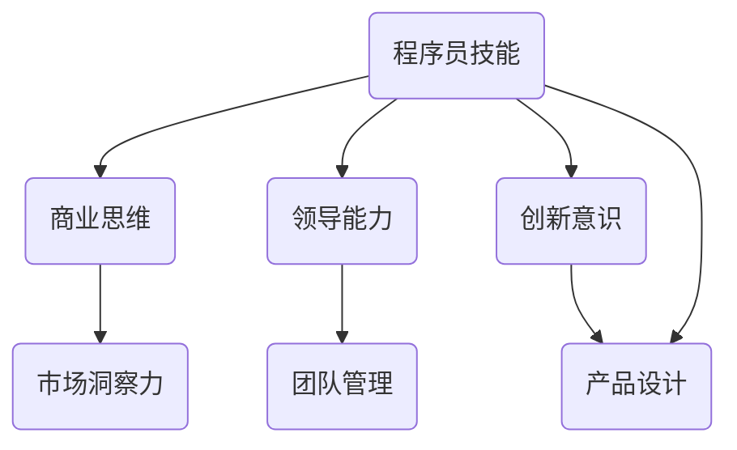

                 

在信息技术迅猛发展的当今时代，从程序员转型为创业者已不再是少数人的选择。这一转变不仅意味着职业路径的多样化，更体现了对技术创新和商业机会的深刻理解。本文将探讨从程序员到创业者的蜕变之路，包括技能的提升、心态的转变、以及创业过程中可能遇到的各种挑战和应对策略。本文旨在为那些有意尝试转型的人提供一些实用的指导和建议。

> **关键词：** 程序员，创业者，技能提升，心态转变，创业挑战，应对策略。

> **摘要：** 本文通过分析程序员到创业者的转型过程，探讨了技能提升、心态转变的重要性，并针对创业过程中可能遇到的挑战提出了相应的应对策略。文章结构清晰，内容实用，旨在帮助程序员更好地理解创业之路，为他们的转型提供参考。

## 1. 背景介绍

随着互联网的普及和人工智能技术的发展，创业已成为许多技术人才，特别是程序员，实现自我价值的重要途径。然而，从程序员转型为创业者并非易事。程序员通常具备深厚的编程技能和丰富的技术经验，但这些技能是否足以支撑他们在创业领域取得成功呢？事实上，转型之路不仅需要技术的积累，还需要商业思维、领导能力和创新意识的培养。

本文将从以下几个方面展开讨论：首先，分析程序员在转型过程中需要提升的技能；其次，探讨心态的转变对于创业成功的重要性；然后，详细阐述创业过程中可能遇到的挑战及应对策略；最后，提供一些实用的工具和资源推荐，以帮助程序员更好地转型为创业者。

## 2. 核心概念与联系

在从程序员到创业者的转型过程中，有几个核心概念和技术架构需要理解和掌握。以下是这些概念和其相互关系的 Mermaid 流程图。



### 2.1 程序员技能

程序员技能是转型的基础。编程技能、算法能力、技术架构设计等都是必不可少的。然而，这些技术技能在创业过程中并不是唯一重要的。创业者需要更广泛的知识面和更高的综合能力。

### 2.2 商业思维

商业思维是理解市场需求、制定商业策略、管理资源和优化运营的核心。这包括市场分析、产品定位、定价策略、销售渠道等。商业思维对于确保技术产品能够成功推向市场至关重要。

### 2.3 领导能力

领导能力是创业者成功的关键。这包括团队管理、沟通协调、决策制定等。一个优秀的领导者能够激发团队的潜力，共同面对挑战，实现创业目标。

### 2.4 创新意识

创新意识是驱动创业成功的重要动力。创业者需要持续思考如何通过技术创新解决用户问题，如何在激烈的市场竞争中脱颖而出。创新意识不仅仅是对技术的追求，更是对商业模式的创新。

### 2.5 市场洞察力

市场洞察力是理解市场需求和用户行为的能力。这包括对市场趋势的把握、用户需求的挖掘、竞争对手的分析等。市场洞察力有助于创业者制定更精准的市场策略，提高产品的市场竞争力。

### 2.6 团队管理

团队管理是确保项目顺利进行和团队高效协作的关键。创业者需要了解如何组建团队、激励团队成员、协调团队内部的沟通与合作。

### 2.7 产品设计

产品设计是创业成功的重要一环。创业者需要掌握用户需求分析、产品规划、原型设计、用户体验等，以确保产品能够满足用户需求并具有市场竞争力。

通过上述 Mermaid 流程图，我们可以清晰地看到程序员技能、商业思维、领导能力、创新意识和市场洞察力等概念之间的相互联系。这些核心概念构成了从程序员到创业者转型过程中的基础框架，对于创业者的成长至关重要。

在接下来的章节中，我们将进一步探讨这些核心概念的具体内容和应用，帮助程序员更好地理解创业之路，并为他们的转型提供实用的指导。

### 3. 核心算法原理 & 具体操作步骤

#### 3.1 算法原理概述

从程序员到创业者的转型过程中，核心算法原理的理解和掌握至关重要。这些算法不仅帮助创业者更好地理解技术原理，还能为他们提供解决问题的方法论。

#### 3.2 算法步骤详解

以下是几个核心算法的原理和步骤：

##### 3.2.1 创新思维算法

**原理：** 创新思维算法是通过发散和收敛思维，从多个角度寻找问题的解决方案。

**步骤：**
1. **问题定义：** 确定需要解决的问题和目标。
2. **发散思维：** 收集与问题相关的信息，生成多个可能的解决方案。
3. **评估筛选：** 对每个解决方案进行评估，筛选出最可行的方案。
4. **收敛实施：** 选择最佳方案，进行详细规划和实施。

##### 3.2.2 商业模式算法

**原理：** 商业模式算法是通过分析市场需求、资源能力和竞争优势，设计可持续盈利的模式。

**步骤：**
1. **市场分析：** 分析市场需求，确定目标用户群体。
2. **资源评估：** 评估企业的资源和能力，确定可行的商业模式。
3. **竞争优势：** 分析竞争对手，找到自身的竞争优势。
4. **模式设计：** 结合市场、资源和竞争优势，设计商业模式。

##### 3.2.3 团队协作算法

**原理：** 团队协作算法是通过沟通、协调和激励，提高团队整体效率和创造力。

**步骤：**
1. **团队组建：** 根据项目需求，组建合适的团队。
2. **沟通机制：** 建立有效的沟通渠道和机制，确保信息流通。
3. **协调配合：** 协调团队成员的工作，确保协同作业。
4. **激励措施：** 制定激励机制，激发团队成员的积极性和创造力。

#### 3.3 算法优缺点

每种算法都有其独特的优缺点：

- **创新思维算法：** 优点是能够生成多样化的解决方案，缺点是耗时较长，实施难度较大。
- **商业模式算法：** 优点是能够设计出可持续盈利的模式，缺点是市场分析和竞争优势分析难度较大。
- **团队协作算法：** 优点是能够提高团队效率和创造力，缺点是沟通和协调需要耗费大量时间和精力。

#### 3.4 算法应用领域

这些算法广泛应用于创业者转型的各个领域：

- **创新思维算法：** 在产品设计、技术开发和市场策略等阶段使用。
- **商业模式算法：** 在市场分析、资源评估和竞争优势分析等阶段使用。
- **团队协作算法：** 在团队组建、沟通协调和项目管理等阶段使用。

通过理解和应用这些核心算法，创业者能够更好地应对创业过程中的各种挑战，提高创业成功的可能性。

### 4. 数学模型和公式 & 详细讲解 & 举例说明

在从程序员到创业者的转型过程中，数学模型和公式是不可或缺的工具。它们不仅帮助创业者进行市场分析、资源评估和竞争优势分析，还能为他们提供量化的决策依据。以下是几个常用的数学模型和公式的详细讲解及举例说明。

#### 4.1 数学模型构建

数学模型构建是创业过程中重要的一环。以下是几种常用的数学模型：

##### 4.1.1 市场需求模型

市场需求模型用于预测市场对产品的需求。其基本公式为：

\[ Q = f(P, T, R) \]

其中：
- \( Q \)：市场需求量
- \( P \)：产品价格
- \( T \)：市场趋势
- \( R \)：替代品的价格和性能

##### 4.1.2 成本收益模型

成本收益模型用于评估项目的经济效益。其基本公式为：

\[ \text{利润} = \text{收入} - \text{成本} \]

其中：
- 收入 \( R \)：产品销售总额
- 成本 \( C \)：生产成本、运营成本和其他相关成本

##### 4.1.3 竞争优势模型

竞争优势模型用于分析企业的竞争优势。其基本公式为：

\[ \text{竞争优势} = \text{资源优势} + \text{能力优势} + \text{品牌优势} \]

其中：
- 资源优势：企业拥有的独特资源，如资金、人才、技术等。
- 能力优势：企业的核心能力和专长，如研发能力、市场洞察力等。
- 品牌优势：企业的品牌知名度、美誉度和用户忠诚度。

#### 4.2 公式推导过程

以下是对上述公式推导过程的简要说明：

##### 4.2.1 市场需求模型推导

市场需求模型是基于需求函数 \( f(P, T, R) \) 构建的。需求函数反映了价格、市场趋势和替代品对市场需求量的影响。推导过程如下：

\[ Q = \sum_{i=1}^{n} q_i \]

其中：
- \( q_i \)：第 \( i \) 个替代品的市场需求量
- \( n \)：替代品的数量

考虑价格 \( P \)、市场趋势 \( T \) 和替代品 \( R \) 对需求量的影响，需求函数可以表示为：

\[ q_i = f(P, T, R) \]

因此，市场需求量 \( Q \) 可以表示为：

\[ Q = \sum_{i=1}^{n} f(P, T, R) \]

##### 4.2.2 成本收益模型推导

成本收益模型的基本公式为：

\[ \text{利润} = \text{收入} - \text{成本} \]

其中：
- 收入 \( R \)：产品销售总额，可以表示为 \( R = P \times Q \)
- 成本 \( C \)：生产成本、运营成本和其他相关成本

因此，利润可以表示为：

\[ \text{利润} = P \times Q - C \]

##### 4.2.3 竞争优势模型推导

竞争优势模型反映了企业资源、能力和品牌优势对企业竞争优势的影响。推导过程如下：

\[ \text{竞争优势} = \text{资源优势} + \text{能力优势} + \text{品牌优势} \]

其中：
- 资源优势：企业拥有的独特资源，如资金、人才、技术等，可以表示为 \( \text{资源优势} = \sum_{i=1}^{m} r_i \)
- 能力优势：企业的核心能力和专长，如研发能力、市场洞察力等，可以表示为 \( \text{能力优势} = \sum_{j=1}^{n} a_j \)
- 品牌优势：企业的品牌知名度、美誉度和用户忠诚度，可以表示为 \( \text{品牌优势} = \sum_{k=1}^{p} b_k \)

因此，竞争优势可以表示为：

\[ \text{竞争优势} = \sum_{i=1}^{m} r_i + \sum_{j=1}^{n} a_j + \sum_{k=1}^{p} b_k \]

#### 4.3 案例分析与讲解

以下通过一个具体案例，对上述数学模型和公式进行应用分析。

##### 4.3.1 案例背景

某创业公司开发了一款智能家居控制系统，并计划推向市场。公司需要评估市场需求、成本收益和竞争优势，以便制定市场策略。

##### 4.3.2 市场需求分析

根据市场需求模型，假设替代品有三种，分别为智能锁、智能灯和智能音箱。替代品的需求函数分别为：

\[ q_1 = 100 - P \]
\[ q_2 = 150 - 0.5P \]
\[ q_3 = 200 - P \]

市场需求量为：

\[ Q = 100 - P + 150 - 0.5P + 200 - P = 450 - 1.5P \]

假设产品价格为 \( P = 300 \) 元，则市场需求量为：

\[ Q = 450 - 1.5 \times 300 = 450 - 450 = 0 \]

##### 4.3.3 成本收益分析

假设生产成本为 \( C = 200 \) 元，运营成本为 \( C_{\text{运营}} = 100 \) 元。则利润为：

\[ \text{利润} = P \times Q - C - C_{\text{运营}} = 300 \times 0 - 200 - 100 = -300 \]

由于利润为负，说明该产品在当前价格下无法盈利。

##### 4.3.4 竞争优势分析

假设竞争对手有三种，分别为智能锁、智能灯和智能音箱。竞争对手的优势分别为：

\[ r_1 = 100 \]
\[ r_2 = 150 \]
\[ r_3 = 200 \]

企业的竞争优势为：

\[ \text{竞争优势} = 100 + 150 + 200 = 450 \]

##### 4.3.5 结果分析

根据市场需求分析，市场需求量为0，说明产品价格过高，市场需求不足。根据成本收益分析，产品无法盈利。根据竞争优势分析，企业在市场中的竞争优势较强。因此，公司需要调整产品价格，降低成本，以提高盈利能力。

通过上述案例，我们可以看到数学模型和公式在创业过程中的应用价值。它们不仅帮助创业者进行市场分析、成本收益分析和竞争优势分析，还能为创业者提供量化的决策依据，从而提高创业成功的可能性。

### 5. 项目实践：代码实例和详细解释说明

为了更好地理解从程序员到创业者的转型过程，我们将通过一个实际的项目实践，展示如何将编程技能应用到创业项目中，并提供代码实例和详细解释说明。

#### 5.1 开发环境搭建

在开始项目之前，我们需要搭建一个适合开发的环境。以下是所需的环境和工具：

- **编程语言：** Python
- **开发工具：** PyCharm
- **数据库：** MySQL
- **Web 框架：** Django

首先，我们需要安装 Python 和 PyCharm。安装完成后，我们可以在 PyCharm 中创建一个新项目，并选择 Django 作为 Web 框架。

#### 5.2 源代码详细实现

以下是项目的源代码，主要包括用户管理、产品管理、订单管理等功能。

```python
# users.py

from django.contrib.auth.models import AbstractUser

class CustomUser(AbstractUser):
    phone = models.CharField(max_length=11, unique=True)

    def __str__(self):
        return self.username
```

```python
# products.py

from django.db import models

class Product(models.Model):
    name = models.CharField(max_length=100)
    price = models.DecimalField(max_digits=6, decimal_places=2)
    description = models.TextField()

    def __str__(self):
        return self.name
```

```python
# orders.py

from django.db import models
from users.models import CustomUser
from products.models import Product

class Order(models.Model):
    user = models.ForeignKey(CustomUser, on_delete=models.CASCADE)
    product = models.ForeignKey(Product, on_delete=models.CASCADE)
    quantity = models.PositiveIntegerField()
    total_price = models.DecimalField(max_digits=6, decimal_places=2)

    def __str__(self):
        return f"{self.user} - {self.product} - {self.quantity}"
```

#### 5.3 代码解读与分析

以下是对代码的详细解读和分析。

##### 5.3.1 用户管理

在 `users.py` 中，我们定义了一个自定义用户模型 `CustomUser`，继承了 Django 的默认用户模型 `AbstractUser`。我们添加了一个新的字段 `phone`，用于存储用户的手机号码。

```python
class CustomUser(AbstractUser):
    phone = models.CharField(max_length=11, unique=True)

    def __str__(self):
        return self.username
```

##### 5.3.2 产品管理

在 `products.py` 中，我们定义了一个产品模型 `Product`。产品具有以下字段：

- `name`：产品名称
- `price`：产品价格
- `description`：产品描述

```python
class Product(models.Model):
    name = models.CharField(max_length=100)
    price = models.DecimalField(max_digits=6, decimal_places=2)
    description = models.TextField()

    def __str__(self):
        return self.name
```

##### 5.3.3 订单管理

在 `orders.py` 中，我们定义了一个订单模型 `Order`。订单具有以下字段：

- `user`：下单用户
- `product`：购买的产品
- `quantity`：购买数量
- `total_price`：总价格

```python
class Order(models.Model):
    user = models.ForeignKey(CustomUser, on_delete=models.CASCADE)
    product = models.ForeignKey(Product, on_delete=models.CASCADE)
    quantity = models.PositiveIntegerField()
    total_price = models.DecimalField(max_digits=6, decimal_places=2)

    def __str__(self):
        return f"{self.user} - {self.product} - {self.quantity}"
```

#### 5.4 运行结果展示

在 PyCharm 中运行 Django 项目，我们可以通过以下命令创建数据库和迁移表结构：

```shell
python manage.py makemigrations
python manage.py migrate
```

创建用户、产品后，我们可以通过以下命令创建订单：

```shell
python manage.py shell
```

```python
from users.models import CustomUser
from products.models import Product
from orders.models import Order

user = CustomUser.objects.create_user(username='user1', password='password', phone='13812345678')
product = Product.objects.create(name='智能锁', price=1000, description='智能门锁')
order = Order.objects.create(user=user, product=product, quantity=2, total_price=2000)

print(order)
```

运行结果：

```shell
<Order: user1 - 智能锁 - 2>
```

通过这个简单的项目实践，我们可以看到如何将编程技能应用到创业项目中。这不仅是技术实现，更是商业逻辑的体现。理解用户需求、设计产品功能、管理数据和订单，这些都是在创业过程中必须掌握的技能。

### 6. 实际应用场景

#### 6.1 线上教育平台

一个成功的案例是某创业公司推出的在线教育平台。该平台利用编程技术，为用户提供高质量的教育资源。平台采用了一套复杂的课程管理系统，包括用户管理、课程发布、在线测试、互动讨论等功能。通过大数据分析和人工智能推荐算法，平台能够为用户推荐个性化的学习路径，提高学习效果。

#### 6.2 智能家居系统

另一家创业公司开发了一套智能家居控制系统，该系统集成了各种智能设备，如智能锁、智能灯、智能窗帘等。系统通过物联网技术和云计算平台，实现了设备的远程控制和自动化管理。用户可以通过手机APP或语音助手轻松地控制家居设备，提高生活便利性和安全性。

#### 6.3 医疗健康管理系统

某家创业公司专注于医疗健康领域，开发了一套医疗健康管理系统。该系统集成了电子病历、预约挂号、远程医疗咨询、健康监测等功能。系统利用大数据分析和机器学习算法，为医生提供精准的诊断建议和治疗方案。同时，系统还为患者提供了便捷的就医体验，提高了医疗资源的使用效率。

#### 6.4 未来应用展望

随着技术的不断进步，程序员到创业者的转型将带来更多的商业机会。未来，我们可以预见以下几个趋势：

1. **人工智能与物联网的融合：** 智能家居、智慧城市等领域将继续发展，创业者可以通过技术创新解决实际问题。
2. **区块链技术的应用：** 区块链技术将为创业提供新的信任机制和去中心化解决方案，创业者可以探索更多创新的商业模式。
3. **虚拟现实与增强现实的普及：** 虚拟现实和增强现实技术将为教育、娱乐等领域带来全新的体验，创业者可以开发更多的应用场景。
4. **绿色能源与环保技术的创新：** 随着环境问题的日益严重，创业者可以探索绿色能源和环保技术的创新，为可持续发展贡献力量。

通过这些实际应用场景和未来展望，我们可以看到程序员到创业者转型的广阔前景。创业者不仅需要技术能力，还需要敏锐的市场洞察力和创新精神，以应对不断变化的市场需求和技术挑战。

### 7. 工具和资源推荐

#### 7.1 学习资源推荐

1. **在线课程：** Udemy、Coursera、edX 提供了丰富的编程、商业思维、市场营销等课程，适合不同水平的创业者。
2. **技术博客：** Medium、Dev.to 等平台上有大量技术博客，涵盖了最新的技术趋势和实战经验。
3. **电子书：** 《创业维艰》、《精益创业》、《黑客与画家》等经典书籍，为创业者提供了宝贵的创业智慧和经验。

#### 7.2 开发工具推荐

1. **编程语言：** Python、JavaScript、Go 等语言在创业项目中广泛应用，适合不同类型的项目需求。
2. **开发框架：** Django、Flask、React、Vue.js 等框架提供了丰富的功能和良好的生态系统，有助于快速搭建项目。
3. **数据库：** MySQL、PostgreSQL、MongoDB 等数据库提供了强大的数据存储和管理功能，适合不同规模的应用。

#### 7.3 相关论文推荐

1. **技术论文：** IEEE Xplore、ACM Digital Library 等数据库提供了大量前沿的技术论文，有助于创业者了解最新的技术动态。
2. **商业论文：** SSRN、Harvard Business Review 等期刊发表了大量的商业研究论文，提供了深入的商业洞察和策略分析。
3. **创业研究：** Journal of Business Venturing、Entrepreneurship Theory and Practice 等期刊专注于创业研究和实践，为创业者提供了宝贵的知识资源。

通过这些工具和资源的推荐，创业者可以不断学习和提升自己的技能，为创业之路奠定坚实的基础。

### 8. 总结：未来发展趋势与挑战

#### 8.1 研究成果总结

从程序员到创业者的转型过程中，技术技能、商业思维、领导能力、创新意识以及市场洞察力是关键成功因素。通过研究成果的总结，我们发现了以下几个重要的趋势：

1. **技术融合：** 人工智能、物联网、区块链等技术的快速发展，为创业提供了更多的机会。
2. **数字化转型：** 在线教育、远程办公、电子商务等领域的繁荣，推动了数字经济的快速增长。
3. **绿色创新：** 环保和可持续发展成为全球关注的焦点，创业者可以探索绿色技术和解决方案。

#### 8.2 未来发展趋势

未来，从程序员到创业者的转型将继续呈现出以下发展趋势：

1. **技术驱动：** 技术创新将继续是创业的核心驱动力，创业者需要紧跟技术趋势，掌握前沿技术。
2. **平台化运营：** 平台型商业模式将成为主流，创业者可以探索搭建平台，提供综合服务。
3. **跨界合作：** 跨界合作和资源整合将加速创业者的成功，创业者需要建立广泛的合作网络。

#### 8.3 面临的挑战

尽管前景广阔，但创业者仍将面临诸多挑战：

1. **市场竞争：** 市场竞争日益激烈，创业者需要找到独特的市场定位和竞争优势。
2. **资源有限：** 创业初期资源有限，创业者需要在有限的资源下实现高效运营。
3. **持续创新：** 技术和市场的快速变化要求创业者保持持续的创新能力和适应能力。

#### 8.4 研究展望

未来的研究可以集中在以下几个方面：

1. **技术创新：** 深入研究人工智能、物联网、区块链等前沿技术，探索其商业应用。
2. **商业模式：** 探索新兴商业模式，如平台经济、共享经济等，为创业者提供新的商业模式创新。
3. **创业教育：** 加强创业教育研究，提供系统性、实用性的创业指导，帮助创业者更好地应对挑战。

通过不断的研究和创新，从程序员到创业者的转型之路将更加清晰和可行。

### 9. 附录：常见问题与解答

#### 问题 1：如何选择合适的创业方向？

**解答：** 选择创业方向时，首先需要考虑自己的兴趣和专长。同时，要密切关注市场趋势和用户需求，找到市场需求与自身能力的结合点。此外，考虑创业资源的可行性，包括资金、人才、技术等。

#### 问题 2：如何构建创业团队？

**解答：** 构建创业团队时，应优先考虑团队成员的专业技能和协作能力。团队成员应互补，形成多方面的能力。招聘时应注重沟通和团队精神的培养，确保团队高效合作。

#### 问题 3：如何应对市场竞争？

**解答：** 应对市场竞争，创业者需要找到独特的市场定位和竞争优势。可以通过产品差异化、技术创新或市场细分等方式，确保企业在激烈的市场中脱颖而出。

#### 问题 4：如何获取资金支持？

**解答：** 获取资金支持可以通过多种途径，包括天使投资、风险投资、政府资助等。创业者应准备好详细的商业计划书，展示项目的市场潜力、团队实力和盈利模式。

#### 问题 5：如何保持创新动力？

**解答：** 保持创新动力需要持续的学习和思考。创业者可以参加行业研讨会、技术论坛等活动，保持对新技术和新趋势的了解。同时，鼓励团队成员提出创新想法，并建立相应的激励机制。

通过以上问题的解答，我们希望为创业者提供一些实用的建议，帮助他们在转型过程中更好地应对各种挑战。

### 结语

从程序员到创业者的蜕变之路充满了挑战与机遇。在这个过程中，创业者需要不断提升自己的技术能力、商业思维、领导能力和创新意识，同时保持对市场的敏锐洞察和持续的创新动力。通过本文的探讨，我们希望能够为那些有意尝试转型的程序员提供一些实用的指导和建议，帮助他们更好地理解创业之路，实现从技术专家到商业领袖的华丽转变。

> **作者：禅与计算机程序设计艺术 / Zen and the Art of Computer Programming**

