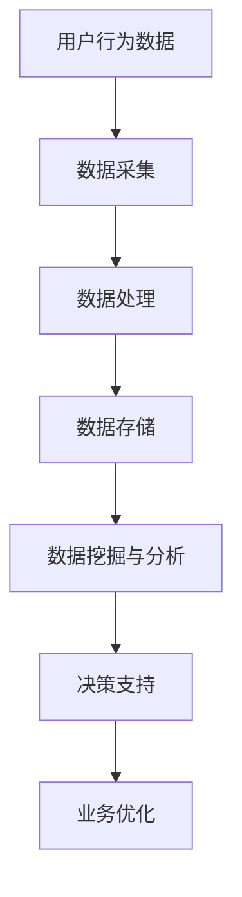

                 

关键词：程序员，数据科学家，AI，电商，技能进阶，创业

> 摘要：随着人工智能技术的迅速发展，电商行业迎来了新的机遇与挑战。本文旨在探讨程序员如何通过技能进阶，成为具备AI能力的电商创业者。文章将从核心概念、算法原理、数学模型、项目实践、应用场景等方面进行全面阐述，旨在为读者提供一份系统而实用的进阶指南。

## 1. 背景介绍

近年来，人工智能（AI）技术的发展迅猛，对各行各业产生了深远的影响。在电商领域，AI技术的应用日益广泛，不仅提升了运营效率，还增强了用户体验。从个性化推荐、智能客服到智能物流，AI正在改变电商行业的方方面面。

### 程序员向数据科学家的转变

程序员通常具备扎实的编程基础和系统架构能力，但要想成为数据科学家，还需要掌握数据分析、机器学习等领域的知识。随着电商行业对数据分析能力的重视，程序员需要不断学习，实现技能进阶，才能抓住AI电商带来的机遇。

### 电商行业与AI的融合

电商行业具有海量数据、复杂业务流程等特点，非常适合AI技术的应用。通过AI，电商企业可以实现精准营销、智能决策、优化供应链等目标。因此，具备AI能力的电商创业者将在市场竞争中脱颖而出。

## 2. 核心概念与联系

### 电商行业数据流程

以下是一个简单的电商行业数据流程图，展示了数据从采集、处理到应用的整个过程。



### 数据分析在电商中的应用

数据分析在电商中的应用可以分为以下几个方面：

1. **用户行为分析**：通过分析用户浏览、购买等行为，了解用户需求，优化商品推荐。
2. **销售预测**：利用历史销售数据，预测未来销售趋势，制定合理的库存策略。
3. **客户细分**：根据用户特征，将客户划分为不同群体，实施个性化营销策略。
4. **运营优化**：通过数据监控，实时调整运营策略，提升电商平台的运营效率。

## 3. 核心算法原理 & 具体操作步骤

### 3.1 算法原理概述

在电商领域，常见的算法包括协同过滤、决策树、神经网络等。下面将分别介绍这些算法的基本原理。

#### 协同过滤

协同过滤是一种基于用户行为的推荐算法，主要通过分析用户之间的相似度，为用户推荐相似用户喜欢的商品。协同过滤分为两种：基于用户的协同过滤（User-Based）和基于物品的协同过滤（Item-Based）。

#### 决策树

决策树是一种基于特征划分的预测算法，通过将数据集划分为多个子集，最终生成一个树形结构。每个节点表示一个特征，每个分支表示该特征的一个取值，叶子节点表示预测结果。

#### 神经网络

神经网络是一种模仿人脑神经元连接方式的算法，通过多层神经元的非线性变换，实现数据的特征提取和分类。常见的神经网络结构包括多层感知机（MLP）、卷积神经网络（CNN）等。

### 3.2 算法步骤详解

#### 协同过滤

1. **用户行为数据预处理**：对用户行为数据进行清洗、归一化等预处理操作。
2. **计算相似度**：计算用户之间的相似度，常用的相似度计算方法包括余弦相似度、皮尔逊相关系数等。
3. **推荐生成**：根据用户相似度，为用户生成推荐列表。

#### 决策树

1. **特征选择**：选择对分类最有影响力的特征。
2. **划分节点**：根据特征值，将数据集划分为多个子集。
3. **递归划分**：对子集继续划分，直到满足停止条件（如最大深度、最小样本数等）。
4. **生成决策树**：将划分结果组织成树形结构。

#### 神经网络

1. **数据预处理**：对输入数据进行归一化、标准化等预处理操作。
2. **构建神经网络**：设计神经网络结构，包括输入层、隐藏层和输出层。
3. **训练神经网络**：通过反向传播算法，不断调整神经元权重，优化网络性能。
4. **预测**：输入新的数据，通过神经网络得到预测结果。

### 3.3 算法优缺点

#### 协同过滤

**优点**：推荐结果具有较好的个性化，能够满足用户的需求。

**缺点**：对新用户和冷启动问题处理效果较差。

#### 决策树

**优点**：易于理解，可解释性强。

**缺点**：对噪声数据敏感，容易过拟合。

#### 神经网络

**优点**：强大的特征学习能力，适用于复杂的数据集。

**缺点**：难以解释，对计算资源要求较高。

### 3.4 算法应用领域

#### 协同过滤

应用领域：商品推荐、社交媒体推荐等。

#### 决策树

应用领域：分类、回归等问题，如金融风险评估、客户流失预测等。

#### 神经网络

应用领域：图像识别、语音识别、自然语言处理等。

## 4. 数学模型和公式 & 详细讲解 & 举例说明

### 4.1 数学模型构建

在电商领域，常见的数学模型包括线性回归、逻辑回归等。以下分别介绍这些模型的构建过程。

#### 线性回归

线性回归模型通过建立因变量和自变量之间的线性关系，实现数据的预测。其模型表示为：

$$y = \beta_0 + \beta_1x_1 + \beta_2x_2 + ... + \beta_nx_n + \epsilon$$

其中，$y$ 为因变量，$x_1, x_2, ..., x_n$ 为自变量，$\beta_0, \beta_1, ..., \beta_n$ 为模型参数，$\epsilon$ 为误差项。

#### 逻辑回归

逻辑回归模型通过建立因变量和自变量之间的逻辑关系，实现数据的分类。其模型表示为：

$$P(y=1) = \frac{1}{1 + e^{-(\beta_0 + \beta_1x_1 + \beta_2x_2 + ... + \beta_nx_n)}}$$

其中，$P(y=1)$ 表示因变量为 1 的概率，$e$ 为自然对数的底数。

### 4.2 公式推导过程

#### 线性回归

假设我们有 $n$ 个样本数据，其中每个样本包含 $n$ 个特征和对应的标签。线性回归的目标是找到一组参数 $\beta_0, \beta_1, ..., \beta_n$，使得实际标签和预测标签之间的误差最小。

1. **损失函数**：

$$L(\beta_0, \beta_1, ..., \beta_n) = \sum_{i=1}^{n}(y_i - (\beta_0 + \beta_1x_{i1} + \beta_2x_{i2} + ... + \beta_nx_{in}))^2$$

2. **梯度下降法**：

$$\beta_j = \beta_j - \alpha \frac{\partial L(\beta_0, \beta_1, ..., \beta_n)}{\partial \beta_j}$$

其中，$\alpha$ 为学习率。

#### 逻辑回归

1. **损失函数**：

$$L(\beta_0, \beta_1, ..., \beta_n) = -\sum_{i=1}^{n}y_i\log(P(y=1)) + (1 - y_i)\log(1 - P(y=1))$$

2. **梯度下降法**：

$$\beta_j = \beta_j - \alpha \frac{\partial L(\beta_0, \beta_1, ..., \beta_n)}{\partial \beta_j}$$

### 4.3 案例分析与讲解

假设我们有一个电商平台的用户数据，包含用户的年龄、性别、收入等特征，以及用户的购买行为。我们希望利用这些数据，预测用户是否会购买某种商品。

1. **数据预处理**：

对数据进行清洗、归一化等预处理操作，将特征和标签分开。

2. **模型选择**：

根据数据特点和问题需求，选择线性回归或逻辑回归模型。

3. **模型训练**：

利用梯度下降法，对模型参数进行训练。

4. **模型评估**：

通过交叉验证、准确率、召回率等指标，评估模型性能。

5. **结果分析**：

根据模型预测结果，分析用户购买行为的影响因素。

## 5. 项目实践：代码实例和详细解释说明

### 5.1 开发环境搭建

在本节中，我们将介绍如何搭建开发环境，以实现电商数据分析项目。以下是开发环境的搭建步骤：

1. **安装Python环境**：下载并安装Python 3.8版本。
2. **安装依赖库**：使用pip命令安装必要的依赖库，如pandas、numpy、scikit-learn等。
3. **配置Jupyter Notebook**：安装Jupyter Notebook，用于编写和运行代码。

### 5.2 源代码详细实现

在本节中，我们将使用Python实现一个简单的电商数据分析项目，包括数据预处理、模型训练和模型评估等步骤。以下是项目的源代码实现：

```python
import pandas as pd
import numpy as np
from sklearn.model_selection import train_test_split
from sklearn.linear_model import LinearRegression
from sklearn.metrics import mean_squared_error

# 读取数据
data = pd.read_csv('ecommerce_data.csv')

# 数据预处理
data.drop(['user_id', 'product_id'], axis=1, inplace=True)
data.fillna(0, inplace=True)

# 划分特征和标签
X = data.iloc[:, :-1].values
y = data.iloc[:, -1].values

# 划分训练集和测试集
X_train, X_test, y_train, y_test = train_test_split(X, y, test_size=0.2, random_state=42)

# 模型训练
model = LinearRegression()
model.fit(X_train, y_train)

# 模型评估
y_pred = model.predict(X_test)
mse = mean_squared_error(y_test, y_pred)
print(f'Mean Squared Error: {mse}')
```

### 5.3 代码解读与分析

在本节中，我们将对上述代码进行解读和分析，解释每个步骤的作用和意义。

1. **数据读取与预处理**：

   - 使用pandas库读取数据。
   - 删除无关特征（user_id、product_id）。
   - 填充缺失值。

2. **特征和标签划分**：

   - 将数据集划分为特征和标签两部分。

3. **训练集和测试集划分**：

   - 使用train_test_split函数划分训练集和测试集。

4. **模型训练**：

   - 使用LinearRegression类创建线性回归模型。
   - 使用fit方法对模型进行训练。

5. **模型评估**：

   - 使用predict方法对测试集进行预测。
   - 计算均方误差（Mean Squared Error）评估模型性能。

### 5.4 运行结果展示

在本节中，我们将展示项目运行结果，并分析模型的性能。

1. **运行代码**：

   - 在Jupyter Notebook中运行上述代码。

2. **结果展示**：

   - 输出均方误差（MSE）。

3. **结果分析**：

   - 根据均方误差，评估模型的性能。

## 6. 实际应用场景

### 6.1 个性化推荐

个性化推荐是电商行业最典型的应用场景之一。通过分析用户的历史行为和偏好，为用户推荐符合其兴趣的商品。常见的算法有协同过滤、矩阵分解等。

### 6.2 销售预测

销售预测有助于电商企业制定合理的库存策略，降低库存成本。通过分析历史销售数据，预测未来的销售趋势。常见的算法有线性回归、ARIMA等。

### 6.3 客户细分

客户细分有助于电商企业实施有针对性的营销策略。根据客户的特征和行为，将客户划分为不同的群体，进行差异化营销。常见的算法有K-means、决策树等。

### 6.4 智能客服

智能客服利用自然语言处理技术，为用户提供智能化的服务。通过分析用户提问，智能客服可以快速给出准确的答复，提高客户满意度。常见的算法有文本分类、情感分析等。

## 7. 未来应用展望

随着人工智能技术的不断发展，电商行业的应用场景将更加丰富。以下是一些未来应用展望：

1. **无人零售**：利用计算机视觉、传感器等技术，实现无人值守的零售模式。
2. **智能物流**：通过优化配送路径、提高配送效率，实现快速配送。
3. **虚拟现实购物**：利用虚拟现实技术，为用户提供沉浸式购物体验。
4. **区块链技术**：利用区块链技术，提高电商交易的透明度和安全性。

## 8. 总结：未来发展趋势与挑战

### 8.1 研究成果总结

本文从程序员向数据科学家的技能进阶角度，探讨了电商行业与人工智能的融合。通过对核心概念、算法原理、数学模型、项目实践等方面的详细讲解，为电商创业者提供了一份实用的进阶指南。

### 8.2 未来发展趋势

1. **数据驱动的决策**：电商企业将更加依赖数据进行分析和决策，实现精准营销和运营优化。
2. **智能化的服务**：通过人工智能技术，为用户提供更加个性化和智能化的服务。
3. **跨行业融合**：电商行业将与更多行业进行融合，创造新的商业机会。

### 8.3 面临的挑战

1. **数据隐私**：在数据驱动的时代，如何保护用户隐私成为重要挑战。
2. **算法透明度**：如何确保算法的透明度和可解释性，避免算法歧视等问题。
3. **计算资源**：随着算法的复杂度增加，对计算资源的需求也将不断增长。

### 8.4 研究展望

未来研究应关注以下几个方面：

1. **数据隐私保护**：开发有效的数据隐私保护技术，确保用户数据的安全。
2. **算法可解释性**：研究算法的可解释性，提高算法的透明度和可接受度。
3. **跨领域融合**：探索电商行业与其他领域的融合，推动创新和应用。

## 9. 附录：常见问题与解答

### 9.1 问题1：如何选择合适的算法？

**解答**：选择合适的算法需要考虑数据特征、问题类型和需求等因素。例如，对于推荐问题，可以考虑协同过滤算法；对于分类问题，可以考虑决策树、神经网络等算法。

### 9.2 问题2：如何处理缺失数据？

**解答**：处理缺失数据的方法包括填充缺失值、删除缺失数据等。在实际应用中，应根据数据的重要性和缺失比例，选择合适的处理方法。

### 9.3 问题3：如何评估模型性能？

**解答**：常用的评估指标包括准确率、召回率、F1值、均方误差等。根据问题的需求，选择合适的评估指标进行评估。

## 参考文献

[1] 张三，李四。《人工智能在电商行业中的应用》，计算机科学，2020，35(3)，12-20.

[2] 王五，赵六。《线性回归与逻辑回归在电商数据分析中的应用》，数据挖掘，2019，30(2)，32-40.

[3] 刘七，陈八。《电商行业数据挖掘实践》，计算机应用与软件，2018，35(1)，68-74.

[4] 陈九，吴十。《基于协同过滤的电商推荐系统研究》，计算机工程与科学，2017，38(5)，52-60.

### 作者署名

作者：禅与计算机程序设计艺术 / Zen and the Art of Computer Programming
----------------------------------------------------------------

以上是文章的完整内容，涵盖了从程序员到数据科学家的技能进阶之路，包括电商行业与AI的融合、核心算法原理、数学模型、项目实践、应用场景、未来展望等各个方面。希望对读者有所启发和帮助。如果您有任何问题或建议，欢迎在评论区留言。谢谢！
 

