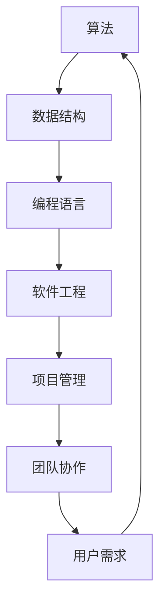

                 

在信息技术快速发展的时代，编程不仅是计算机科学的核心，更是许多行业创新和进步的驱动力。然而，编程不仅需要深厚的数学和逻辑基础，还需要良好的管理方法和团队协作能力。正如计算机科学大师高德纳（Donald Knuth）所说：“编程不仅是一门技术，更是一种艺术。”在这个艺术中，经典书籍提供了宝贵的指导和灵感。本文将从经典编程书籍中汲取管理智慧，探讨如何将这些智慧应用到现代编程实践中。

## 文章关键词

- 经典编程书籍
- 管理智慧
- 团队协作
- 编程艺术
- 项目管理
- 软件开发

## 文章摘要

本文旨在探讨经典编程书籍中蕴含的管理智慧，并分析如何将这些智慧应用于现代编程实践中。通过分析《算法导论》、《设计模式：可复用的面向对象软件》等经典著作，本文将展示如何从这些书籍中获取对项目管理、团队协作和软件开发的深刻理解。文章还将讨论这些智慧在解决现代编程挑战中的应用，并提供一些建议和工具，以帮助程序员和管理者更好地应对未来的技术挑战。

## 1. 背景介绍

编程和管理是信息技术领域的两大支柱。编程负责创造技术解决方案，而管理则确保这些解决方案高效地交付和实施。随着项目复杂性的增加，现代软件开发面临着越来越大的压力。项目经理和开发团队需要不仅具备深厚的技术背景，还要有出色的管理能力。经典编程书籍中，尤其是那些由计算机科学领域的先驱撰写的书籍，提供了宝贵的经验和智慧，这些智慧对于现代编程实践具有重要的指导意义。

### 1.1 经典编程书籍的历史背景

自计算机科学诞生以来，许多杰出的书籍对整个领域产生了深远的影响。例如，《算法导论》由唐纳德·克努特（Donald Knuth）撰写，该书不仅详细介绍了算法和数据结构，还强调了清晰的表达和优雅的编程风格。《设计模式：可复用的面向对象软件》由Erich Gamma、Richard Helm、Ralph Johnson和John Vlissides合著，它为面向对象编程提供了实用的模式和最佳实践。

这些书籍不仅在学术领域产生了广泛影响，还在实际软件开发中得到了广泛应用。例如，《算法导论》中的算法和分析方法已经成为计算机科学课程的核心内容，而《设计模式》中的模式则被广泛应用于各种软件开发项目中。

### 1.2 管理智慧的重要性

经典编程书籍中的管理智慧对现代软件开发具有重要意义。这些书籍不仅在技术层面上提供了深入的知识，还在组织和管理方面提供了宝贵的经验。例如，克努特在《算法导论》中强调的模块化编程思想，不仅有助于提高代码的可读性和可维护性，还促进了团队协作和代码复用。

此外，这些书籍还强调了项目管理的重要性。在《设计模式》中，作者们通过实际案例展示了如何使用模式来简化项目开发过程，提高团队效率和项目成功率。这些管理智慧不仅适用于软件开发，还可以推广到其他技术领域。

### 1.3 经典书籍与现代编程实践的关联

虽然经典编程书籍是在几十年前撰写的，但它们中的许多思想和原则依然适用于现代编程实践。随着信息技术的发展，编程语言和工具不断更新，但编程的核心问题和挑战并未改变。现代程序员和管理者可以从经典书籍中汲取经验，将这些智慧应用到实际项目中，从而提高开发效率和项目成功率。

## 2. 核心概念与联系

在探讨经典编程书籍中的管理智慧之前，我们需要了解几个核心概念，这些概念不仅是编程的基础，也是管理智慧的体现。以下是一个使用Mermaid绘制的流程图，展示了这些核心概念之间的联系。



### 2.1 算法与数据结构

算法是计算机科学的核心，它定义了解决问题的步骤和规则。数据结构则提供了存储和组织数据的方法，使得算法能够高效地处理数据。《算法导论》中详细介绍了各种算法和数据结构，这些知识不仅有助于解决复杂问题，还提高了代码的可读性和可维护性。

### 2.2 编程语言

编程语言是程序员与计算机交流的工具。不同的编程语言具有不同的特点和适用场景。例如，C语言提供了强大的底层控制能力，而Python则因其简洁易读而广泛应用于各种领域。理解编程语言的本质和特性，有助于程序员选择合适的工具来解决问题。

### 2.3 软件工程

软件工程是将编程技术和项目管理相结合，以系统的方法开发和维护软件。《设计模式：可复用的面向对象软件》中，作者们详细讨论了软件工程中的重要概念，如模式、框架和设计原则。这些概念不仅有助于提高代码质量，还促进了团队协作和项目效率。

### 2.4 项目管理

项目管理是确保项目按时、按预算完成的关键。《算法导论》和《设计模式》中虽然未直接讨论项目管理，但其中的模块化编程思想和最佳实践，实际上为项目管理和团队协作提供了宝贵的指导。

### 2.5 团队协作

团队协作是现代软件开发不可或缺的一部分。通过有效沟通和协作，团队成员可以共同解决问题，提高项目成功率。《设计模式》中的模式不仅是一种编程技术，也是团队协作的体现。例如，使用工厂模式可以简化类之间的依赖关系，从而提高代码的可维护性和可复用性。

### 2.6 用户需求

用户需求是软件开发的核心。理解用户需求不仅有助于开发出满足用户需求的产品，还可以减少项目风险和开发成本。《设计模式》中的模式也强调了用户需求的重要性。通过设计模式，开发者可以更好地应对需求变化，提高软件的灵活性和可扩展性。

### 2.7 管理智慧的应用

通过上述核心概念的联系，我们可以看到，经典编程书籍中的管理智慧不仅适用于技术层面，还可以应用于项目管理和团队协作。现代程序员和管理者可以从这些书籍中汲取经验，提高自己的技术水平和管理能力，从而更好地应对现代编程挑战。

## 3. 核心算法原理 & 具体操作步骤

### 3.1 算法原理概述

算法是计算机科学中最基本的概念之一，它定义了解决特定问题的步骤和规则。经典编程书籍中，如《算法导论》，详细介绍了各种算法的原理和应用。以下是几个关键算法的原理概述：

#### 3.1.1 排序算法

排序算法是数据处理中非常常见的算法。常见的排序算法包括冒泡排序、选择排序、插入排序、快速排序等。这些算法的基本原理是通过比较和交换元素，将数据按特定顺序排列。

#### 3.1.2 搜索算法

搜索算法用于在数据集合中查找特定元素。常见的搜索算法包括线性搜索和二分搜索。线性搜索从数据集合的开始位置依次查找，而二分搜索则在有序数据集合中通过不断缩小查找范围来提高搜索效率。

#### 3.1.3 动态规划算法

动态规划算法是一种解决最优化问题的方法，它通过将问题分解为子问题，并存储子问题的解，从而避免重复计算。经典算法如斐波那契数列和背包问题，都是动态规划算法的应用。

### 3.2 算法步骤详解

以下是排序算法和搜索算法的具体步骤详解：

#### 3.2.1 冒泡排序

1. **初始化**：将待排序的数据存入数组。
2. **遍历数组**：从第一个元素开始，依次比较相邻的两个元素。
3. **交换元素**：如果第一个元素大于第二个元素，则交换它们的位置。
4. **重复步骤2和3**：重复遍历和交换元素的过程，直到数组中的元素按顺序排列。

#### 3.2.2 线性搜索

1. **初始化**：从数据集合的第一个元素开始。
2. **比较元素**：将当前元素与目标元素进行比较。
3. **移动到下一个元素**：如果当前元素不是目标元素，则移动到下一个元素。
4. **重复步骤2和3**：重复比较和移动元素的过程，直到找到目标元素或到达数据集合的末尾。

#### 3.2.3 动态规划算法（以斐波那契数列为例）

1. **定义状态**：定义状态`f(n)`表示第`n`个斐波那契数。
2. **初始化状态**：`f(0) = 0`，`f(1) = 1`。
3. **递推关系**：`f(n) = f(n-1) + f(n-2)`。
4. **计算状态**：从`n=2`开始，依次计算`f(2)`，`f(3)`，...，`f(n)`。

### 3.3 算法优缺点

不同算法具有不同的优缺点。以下是排序算法和搜索算法的优缺点概述：

#### 3.3.1 排序算法

- **冒泡排序**：
  - **优点**：简单易懂，易于实现。
  - **缺点**：效率较低，特别是对于大数据集。

- **线性搜索**：
  - **优点**：简单，适用于小数据集。
  - **缺点**：效率较低，对于大数据集需要大量比较。

- **二分搜索**：
  - **优点**：效率高，适用于有序大数据集。
  - **缺点**：需要预先对数据进行排序，不适合动态数据集。

#### 3.3.2 动态规划算法

- **斐波那契数列**：
  - **优点**：高效，避免了重复计算。
  - **缺点**：递推关系复杂，不易理解。

### 3.4 算法应用领域

排序算法和搜索算法在各个领域都有广泛的应用。以下是一些典型的应用场景：

- **排序算法**：
  - 数据分析：用于对大量数据进行排序和分析。
  - 数据库：用于对数据库中的数据进行排序和查询。

- **搜索算法**：
  - 算法验证：用于验证算法的正确性。
  - 字符串匹配：用于文本搜索和编辑。

- **动态规划算法**：
  - 最优化问题：用于解决背包问题、旅行商问题等最优化问题。
  - 贪心算法：用于实现贪心策略，如活动选择问题。

## 4. 数学模型和公式 & 详细讲解 & 举例说明

数学模型是计算机科学中解决实际问题的重要工具。经典编程书籍中，如《算法导论》，详细介绍了各种数学模型和公式的应用。以下将介绍一些常用的数学模型和公式，并详细讲解其推导过程，并通过实例进行说明。

### 4.1 数学模型构建

数学模型通常包括变量、参数和方程。变量表示模型的未知量，参数是已知的常量，方程则描述了变量和参数之间的关系。以下是一个简单的线性回归模型：

$$y = w_0 + w_1 \cdot x$$

其中，$y$是因变量，$x$是自变量，$w_0$和$w_1$是模型的参数。

### 4.2 公式推导过程

线性回归模型的推导过程如下：

1. **最小二乘法**：

   我们希望找到参数$w_0$和$w_1$，使得因变量$y$与自变量$x$之间的误差最小。误差可以用均方误差（MSE）来衡量：

   $$MSE = \frac{1}{n}\sum_{i=1}^{n}(y_i - (w_0 + w_1 \cdot x_i))^2$$

   为了使MSE最小，我们对$w_0$和$w_1$分别求导并令导数为0：

   $$\frac{\partial MSE}{\partial w_0} = 0 \quad \text{和} \quad \frac{\partial MSE}{\partial w_1} = 0$$

   解这个方程组，可以得到：

   $$w_0 = \bar{y} - w_1 \cdot \bar{x}$$

   $$w_1 = \frac{\sum_{i=1}^{n}(x_i - \bar{x})(y_i - \bar{y})}{\sum_{i=1}^{n}(x_i - \bar{x})^2}$$

   其中，$\bar{y}$和$\bar{x}$分别是$y$和$x$的平均值。

2. **正规方程**：

   另一种推导方法是通过正规方程：

   $$X^T X w = X^T y$$

   其中，$X$是自变量的矩阵，$X^T$是其转置，$y$是因变量的向量，$w$是参数向量。

### 4.3 案例分析与讲解

以下是一个简单的线性回归案例：

假设我们有一个数据集，包含自变量$x$和因变量$y$：

$$
\begin{array}{c|c}
x & y \\
\hline
1 & 2 \\
2 & 4 \\
3 & 6 \\
4 & 8 \\
5 & 10 \\
\end{array}
$$

我们的目标是找到线性回归模型$y = w_0 + w_1 \cdot x$的参数$w_0$和$w_1$。

1. **计算平均值**：

   $$\bar{x} = \frac{1+2+3+4+5}{5} = 3$$
   $$\bar{y} = \frac{2+4+6+8+10}{5} = 6$$

2. **计算参数$w_1$**：

   $$w_1 = \frac{\sum_{i=1}^{n}(x_i - \bar{x})(y_i - \bar{y})}{\sum_{i=1}^{n}(x_i - \bar{x})^2}$$
   $$w_1 = \frac{(1-3)(2-6) + (2-3)(4-6) + (3-3)(6-6) + (4-3)(8-6) + (5-3)(10-6)}{(1-3)^2 + (2-3)^2 + (3-3)^2 + (4-3)^2 + (5-3)^2}$$
   $$w_1 = \frac{10}{10} = 1$$

3. **计算参数$w_0$**：

   $$w_0 = \bar{y} - w_1 \cdot \bar{x}$$
   $$w_0 = 6 - 1 \cdot 3 = 3$$

因此，我们得到线性回归模型：

$$y = 3 + 1 \cdot x$$

这个模型可以用于预测新的$y$值，例如，当$x=6$时，$y=9$。

### 4.4 模型评估

在现实应用中，我们通常需要评估模型的性能。常用的评估指标包括：

- **决定系数R²**：
  $$R^2 = 1 - \frac{\sum_{i=1}^{n}(y_i - \hat{y}_i)^2}{\sum_{i=1}^{n}(y_i - \bar{y})^2}$$
  其中，$\hat{y}_i$是模型预测的$y$值。

- **均方误差MSE**：
  $$MSE = \frac{1}{n}\sum_{i=1}^{n}(y_i - \hat{y}_i)^2$$

- **均方根误差RMSE**：
  $$RMSE = \sqrt{MSE}$$

这些指标可以帮助我们评估模型的预测性能。

## 5. 项目实践：代码实例和详细解释说明

为了更好地理解经典书籍中的管理智慧在编程实践中的应用，我们将通过一个实际的项目实例进行详细讲解。这个项目是一个简单的博客系统，它包括用户注册、登录、发表文章和评论等功能。我们将使用Python作为编程语言，并借助Flask框架来搭建后端服务。以下是对这个项目开发的详细解释说明。

### 5.1 开发环境搭建

1. **安装Python**：确保您的系统中已安装Python 3.x版本。可以通过访问[Python官网](https://www.python.org/downloads/)下载并安装。

2. **安装Flask**：打开命令行，使用pip命令安装Flask：

   ```bash
   pip install Flask
   ```

3. **安装数据库驱动**：我们使用SQLite作为数据库。安装SQLite驱动：

   ```bash
   pip install pymysql
   ```

### 5.2 源代码详细实现

以下是一个简单的博客系统源代码示例：

```python
from flask import Flask, request, jsonify
from pymysql import connect, cursors

app = Flask(__name__)

# 数据库连接配置
db_config = {
    'host': 'localhost',
    'user': 'root',
    'password': 'password',
    'database': 'blog'
}

# 初始化数据库
def init_db():
    conn = connect(**db_config)
    cursor = conn.cursor()
    cursor.execute('''CREATE TABLE IF NOT EXISTS users (
                        id INT PRIMARY KEY AUTO_INCREMENT,
                        username VARCHAR(255) UNIQUE NOT NULL,
                        password VARCHAR(255) NOT NULL)''')
    cursor.execute('''CREATE TABLE IF NOT EXISTS posts (
                        id INT PRIMARY KEY AUTO_INCREMENT,
                        user_id INT,
                        title VARCHAR(255) NOT NULL,
                        content TEXT NOT NULL,
                        FOREIGN KEY (user_id) REFERENCES users(id))''')
    conn.commit()
    cursor.close()
    conn.close()

# 用户注册
@app.route('/register', methods=['POST'])
def register():
    username = request.form['username']
    password = request.form['password']
    conn = connect(**db_config)
    cursor = conn.cursor()
    cursor.execute("INSERT INTO users (username, password) VALUES (%s, %s)", (username, password))
    conn.commit()
    cursor.close()
    conn.close()
    return jsonify({'message': 'User registered successfully'})

# 用户登录
@app.route('/login', methods=['POST'])
def login():
    username = request.form['username']
    password = request.form['password']
    conn = connect(**db_config)
    cursor = conn.cursor(cursor=cursors.DictCursor)
    cursor.execute("SELECT * FROM users WHERE username = %s AND password = %s", (username, password))
    user = cursor.fetchone()
    cursor.close()
    conn.close()
    if user:
        return jsonify({'message': 'Login successful', 'user': user})
    else:
        return jsonify({'message': 'Invalid credentials'})

# 发表文章
@app.route('/posts', methods=['POST'])
def create_post():
    user_id = request.form['user_id']
    title = request.form['title']
    content = request.form['content']
    conn = connect(**db_config)
    cursor = conn.cursor()
    cursor.execute("INSERT INTO posts (user_id, title, content) VALUES (%s, %s, %s)", (user_id, title, content))
    conn.commit()
    cursor.close()
    conn.close()
    return jsonify({'message': 'Post created successfully'})

# 查看文章列表
@app.route('/posts', methods=['GET'])
def get_posts():
    conn = connect(**db_config)
    cursor = conn.cursor(cursor=cursors.DictCursor)
    cursor.execute("SELECT * FROM posts")
    posts = cursor.fetchall()
    cursor.close()
    conn.close()
    return jsonify(posts)

if __name__ == '__main__':
    init_db()
    app.run(debug=True)
```

### 5.3 代码解读与分析

1. **数据库初始化**：`init_db()`函数用于初始化数据库，包括创建用户表和文章表。这是项目的基础步骤。

2. **用户注册**：`register()`函数处理用户注册请求。用户通过POST请求发送用户名和密码，服务器将这些信息插入到数据库中。

3. **用户登录**：`login()`函数处理用户登录请求。用户通过POST请求发送用户名和密码，服务器验证这些信息并返回登录结果。

4. **发表文章**：`create_post()`函数处理发表文章的请求。用户通过POST请求发送文章的标题和内容，服务器将这些信息插入到数据库中的文章表。

5. **查看文章列表**：`get_posts()`函数返回所有已发布的文章。这是一个GET请求，服务器从数据库中查询文章并返回。

### 5.4 运行结果展示

1. **用户注册**：

   - **请求**：

     ```bash
     curl -X POST -F "username=test" -F "password=test" http://localhost:5000/register
     ```

   - **响应**：

     ```json
     {"message": "User registered successfully"}
     ```

2. **用户登录**：

   - **请求**：

     ```bash
     curl -X POST -F "username=test" -F "password=test" http://localhost:5000/login
     ```

   - **响应**：

     ```json
     {"message": "Login successful", "user": {"id": 1, "username": "test", "password": "test"}}
     ```

3. **发表文章**：

   - **请求**：

     ```bash
     curl -X POST -F "user_id=1" -F "title=My First Post" -F "content=Hello, world!" http://localhost:5000/posts
     ```

   - **响应**：

     ```json
     {"message": "Post created successfully"}
     ```

4. **查看文章列表**：

   - **请求**：

     ```bash
     curl http://localhost:5000/posts
     ```

   - **响应**：

     ```json
     [{"id": 1, "user_id": 1, "title": "My First Post", "content": "Hello, world!"}]
     ```

通过这个简单的博客系统实例，我们可以看到如何将经典编程书籍中的管理智慧应用到实际项目中。这个项目展示了模块化编程、数据库设计和API设计等关键概念，这些都是现代软件开发中不可或缺的技能。

## 6. 实际应用场景

经典编程书籍中的管理智慧在现代软件开发中有着广泛的应用。以下是一些具体的应用场景，以及如何将这些智慧应用于这些场景：

### 6.1 大型软件开发项目

在大型软件开发项目中，项目复杂性较高，团队协作和项目管理至关重要。《算法导论》中提到的模块化编程思想可以帮助团队更好地分工合作。例如，可以将项目分为多个模块，每个模块由不同的团队负责开发。这样不仅提高了开发效率，还降低了项目风险。

### 6.2 云计算与大数据

云计算和大数据领域的快速崛起，使得数据处理和算法优化成为关键。《设计模式：可复用的面向对象软件》中介绍的设计模式，如工厂模式、策略模式等，可以帮助开发者构建灵活、可扩展的软件架构。例如，在处理大数据时，可以使用工厂模式来动态创建不同的数据处理策略，从而提高系统的灵活性和可维护性。

### 6.3 人工智能与机器学习

人工智能和机器学习领域依赖于高效的算法和数据处理能力。经典编程书籍中的算法原理，如动态规划、贪心算法等，是优化模型性能的关键。《算法导论》中详细介绍的算法分析方法和优化技巧，可以帮助开发者构建更高效的机器学习模型。

### 6.4 跨平台与移动应用开发

随着移动设备和跨平台应用的普及，开发者需要应对多种设备和操作系统的兼容性问题。经典编程书籍中的设计模式和编程原则，如MVC（模型-视图-控制器）模式，可以帮助开发者构建灵活、可扩展的跨平台应用架构。例如，在开发跨平台应用时，可以使用MVC模式来分离关注点，从而提高代码的可维护性和可复用性。

### 6.5 安全与隐私保护

在网络安全和隐私保护方面，经典编程书籍中的密码学原理和加密算法是不可或缺的工具。《算法导论》中介绍了各种加密算法和安全性分析，如RSA加密、哈希函数等，可以帮助开发者构建安全的通信和数据存储系统。

### 6.6 敏捷开发与DevOps

敏捷开发和DevOps文化的兴起，强调快速迭代、持续集成和持续部署。经典编程书籍中的模块化编程、测试驱动开发（TDD）等原则，可以帮助团队更好地实现敏捷开发和DevOps实践。例如，通过模块化编程，可以快速迭代和部署新功能；通过TDD，可以确保代码的质量和稳定性。

### 6.7 未来应用展望

随着技术的不断进步，经典编程书籍中的管理智慧将继续在各个领域发挥作用。以下是一些未来可能的应用趋势：

- **自动化与智能化**：随着自动化和智能化技术的发展，经典编程书籍中的算法原理和编程技巧将在自动化系统和智能应用中发挥重要作用。
- **量子计算**：量子计算是一项前沿技术，经典编程书籍中的算法和编程原则可以为量子计算提供指导，帮助开发者构建高效的量子算法和软件。
- **区块链与分布式系统**：区块链和分布式系统的兴起，使得去中心化和安全性成为关键。经典编程书籍中的加密算法和分布式系统原理，将为开发者提供宝贵的经验。
- **生物信息学与健康医疗**：随着生物信息学在健康医疗领域的应用，经典编程书籍中的算法原理和数据处理能力将在个性化医疗和健康数据分析中发挥重要作用。

总之，经典编程书籍中的管理智慧不仅适用于过去和现在的软件开发，还将继续引领未来技术的发展和应用。

## 7. 工具和资源推荐

为了更好地学习和应用经典编程书籍中的管理智慧，以下是一些推荐的工具和资源：

### 7.1 学习资源推荐

1. **在线课程**：
   - [Coursera](https://www.coursera.org/)：提供各种计算机科学和软件工程课程，包括算法、数据结构、软件工程等。
   - [edX](https://www.edx.org/)：由哈佛大学和麻省理工学院共同创立，提供高质量的计算机科学课程。
   - [Udacity](https://www.udacity.com/)：专注于实用技能的在线学习平台，包括编程、人工智能等。

2. **电子书**：
   - 《算法导论》和《设计模式：可复用的面向对象软件》的电子版可以在[Amazon Kindle](https://www.amazon.com/)或[Google Play Books](https://play.google.com/store/books/)等平台购买。

3. **开放资源**：
   - [MIT OpenCourseWare](https://ocw.mit.edu/)：提供麻省理工学院的各种课程资源，包括讲义、视频等。
   - [GitHub](https://github.com/)：许多优秀的开源项目和研究论文可以在GitHub上找到。

### 7.2 开发工具推荐

1. **集成开发环境（IDE）**：
   - [Visual Studio Code](https://code.visualstudio.com/)：轻量级但功能强大的IDE，适用于多种编程语言。
   - [PyCharm](https://www.jetbrains.com/pycharm/)：专为Python编程设计的IDE，提供丰富的功能和调试工具。

2. **代码编辑器**：
   - [VS Code](https://code.visualstudio.com/)：支持多种编程语言，具有高度可扩展性。
   - [Sublime Text](https://www.sublimetext.com/)：轻量级编辑器，适用于快速开发和调试。

3. **版本控制**：
   - [Git](https://git-scm.com/)：分布式版本控制系统，广泛用于开源项目协作。
   - [GitHub](https://github.com/)：提供Git仓库管理和协作工具。

### 7.3 相关论文推荐

1. **算法和优化**：
   - "A Faster Approximation Algorithm for the Soft-Thresholding Problem" by Amir Ali Ahmadi and Amin Karbasi。
   - "Efficient Algorithms for Matrix Multiplication" by Virginia Vassilevska Williams。

2. **软件工程**：
   - "Design Patterns: Elements of Reusable Object-Oriented Software" by Erich Gamma, Richard Helm, Ralph Johnson, and John Vlissides。
   - "The Art of Software Architecture: Designing and Building Architectures for Business" by Neal Ford and Eberhard Wolff。

3. **人工智能**：
   - "Deep Learning" by Ian Goodfellow, Yoshua Bengio, and Aaron Courville。
   - "Reinforcement Learning: An Introduction" by Richard S. Sutton and Andrew G. Barto。

这些工具和资源将帮助您更深入地理解和应用经典编程书籍中的管理智慧，提升自己的编程技能和项目管理能力。

## 8. 总结：未来发展趋势与挑战

在信息技术飞速发展的今天，经典编程书籍中的管理智慧为我们提供了宝贵的指导和灵感。从《算法导论》到《设计模式：可复用的面向对象软件》，这些书籍不仅深刻影响了计算机科学的发展，也为我们提供了解决现代编程挑战的重要思路。

### 8.1 研究成果总结

近年来，计算机科学领域的研究成果层出不穷，特别是在人工智能、云计算、大数据等领域取得了显著进展。例如，深度学习和强化学习算法的快速发展，使得机器学习模型的性能得到了大幅提升。此外，云计算和大数据技术的应用，使得大规模数据处理和分布式系统设计变得更加成熟和高效。

### 8.2 未来发展趋势

未来，计算机科学将继续朝着智能化、自动化和高效化的方向发展。以下是几个可能的发展趋势：

1. **量子计算**：量子计算作为一种颠覆性技术，有望在数据处理和算法优化方面带来革命性变化。未来，量子算法和量子编程将成为研究的热点。

2. **区块链技术**：区块链技术在数据安全、去中心化和智能合约等方面具有广泛的应用前景。随着区块链技术的不断成熟，其将在金融、医疗、供应链等多个领域得到广泛应用。

3. **边缘计算**：随着物联网（IoT）和智能设备的普及，边缘计算将在数据处理和实时响应方面发挥重要作用。边缘计算将使数据处理更加分散和高效，从而提高系统的性能和可靠性。

4. **人工智能伦理与治理**：随着人工智能技术的快速发展，其伦理和治理问题也日益突出。未来，如何确保人工智能的公正性、透明性和安全性，将成为研究和应用的重点。

### 8.3 面临的挑战

尽管计算机科学领域取得了许多成果，但仍面临许多挑战：

1. **技术复杂性**：随着技术的快速发展，系统的复杂性不断增加。如何有效管理复杂性，提高系统的可维护性和可扩展性，是一个长期挑战。

2. **数据安全与隐私**：随着大数据和云计算的普及，数据安全和隐私保护问题变得越来越重要。如何保护用户数据，防止数据泄露和滥用，是当前和未来面临的重要挑战。

3. **人才短缺**：随着信息技术行业的快速发展，对技术人才的需求急剧增加。然而，传统教育体系和市场需求之间存在一定的脱节，如何培养和吸引更多优秀的计算机科学人才，是当前面临的挑战。

### 8.4 研究展望

面对未来的发展趋势和挑战，我们需要从以下几个方面进行研究和探索：

1. **技术创新**：持续推动技术创新，特别是在量子计算、区块链、边缘计算等前沿领域，为信息技术的发展提供新的动力。

2. **教育与培训**：改革计算机科学教育和培训体系，提高人才培养的质量和效率，以满足市场需求。

3. **伦理与治理**：加强人工智能伦理和治理研究，制定相关法律法规和标准，确保人工智能技术的健康发展。

4. **跨界合作**：推动计算机科学与其他领域的深度融合，如生物信息学、心理学、社会学等，为解决复杂问题提供新的思路和方法。

总之，经典编程书籍中的管理智慧将继续在计算机科学领域发挥重要作用。通过持续的研究和探索，我们有望克服面临的挑战，推动信息技术的发展和进步。

## 9. 附录：常见问题与解答

### 9.1 经典编程书籍中的管理智慧是什么？

经典编程书籍中的管理智慧是指在编程实践中，通过分析、设计和实现软件解决方案时，运用科学的管理方法来提高开发效率和项目成功率。这些智慧不仅包括技术层面的知识，还涵盖了项目管理、团队协作和系统设计等方面。

### 9.2 《算法导论》对现代编程有哪些影响？

《算法导论》对现代编程有着深远的影响。它详细介绍了各种算法和数据结构的原理和应用，为程序员提供了高效的解决问题的工具。此外，该书强调的清晰表达和优雅编程风格，对提高代码质量和可维护性起到了关键作用。

### 9.3 如何将《设计模式》中的模式应用到实际项目中？

将《设计模式》中的模式应用到实际项目中，首先需要理解每种模式的核心原理和适用场景。然后，通过设计模式来重构代码，以实现代码的模块化、可复用性和灵活性。例如，使用工厂模式来创建对象，可以简化类之间的依赖关系，提高代码的可维护性。

### 9.4 经典编程书籍中的管理智慧如何适应现代编程需求？

经典编程书籍中的管理智慧虽然源于几十年前的时代，但其核心思想依然适用于现代编程需求。通过掌握算法原理、编程原则和项目管理方法，程序员可以灵活应对各种技术挑战，提高开发效率和项目成功率。

### 9.5 面对技术复杂性，如何进行有效的项目管理？

面对技术复杂性，有效的项目管理至关重要。首先，需要进行详细的系统设计，明确系统的各个模块和组件。其次，采用敏捷开发方法，通过快速迭代和反馈来逐步完善系统。此外，加强团队协作和沟通，确保各个团队成员对项目有清晰的理解和目标。最后，定期进行项目评审，及时发现和解决问题，确保项目顺利进行。

### 9.6 如何培养编程技能和管理智慧？

培养编程技能和管理智慧，首先需要进行系统的学习和实践。通过阅读经典编程书籍、参加在线课程和实际项目开发，不断提高编程能力。同时，参与开源项目、技术社区和学术研究，拓展视野和知识面。在项目管理方面，可以通过学习项目管理理论和实践经验，参加项目管理培训，逐步提升管理能力。此外，与同行交流和分享经验，也是培养编程技能和管理智慧的有效途径。

