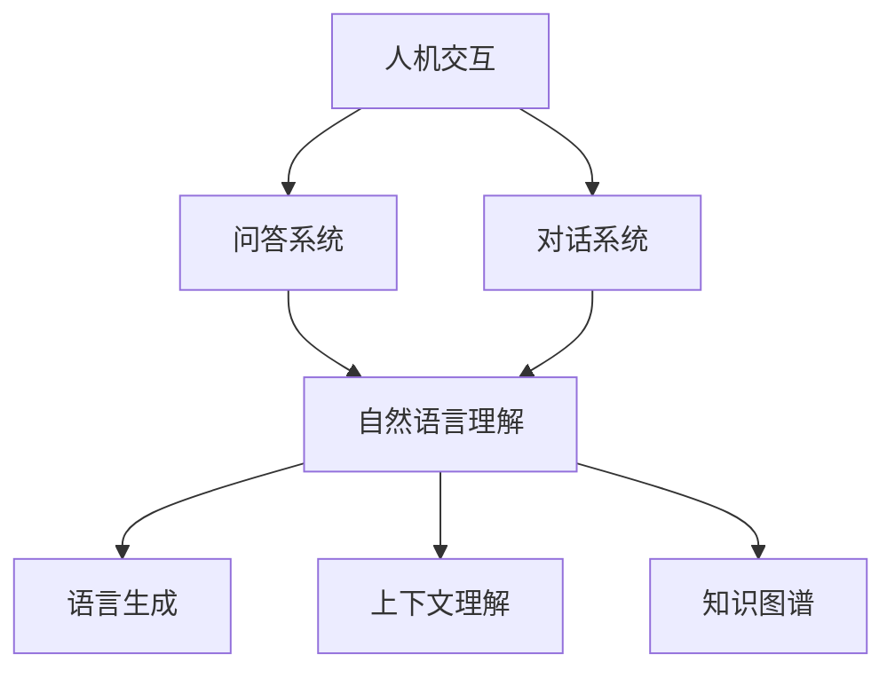

                 

关键词：人机交互，AI技术，自然语言处理，对话系统，交互模式

> 摘要：本文将深入探讨人工智能（AI）在从问答系统向对话系统转变中所扮演的角色。通过回顾人机交互的历史，阐述问答系统和对话系统的基本原理，分析AI技术如何提升对话系统的智能水平，并展望未来人机交互模式的发展趋势。

## 1. 背景介绍

人机交互（Human-Computer Interaction，简称HCI）是研究人与计算机之间交互作用的一门学科。其目标是设计易用、高效、愉悦的计算机系统。人机交互的历史可以追溯到计算机的早期发展时期。最初的人机交互主要是通过命令行界面（CLI）进行，用户需要输入一系列指令才能完成任务。随着图形用户界面（GUI）的出现，人机交互变得更加直观和用户友好。

在人机交互的发展历程中，问答系统（Question Answering System）和对话系统（Dialogue System）扮演了重要角色。问答系统的主要目的是从大量信息中检索出与用户查询最相关的答案，而对话系统则更关注于模拟自然的人类对话，与用户进行连贯、自然的交流。

近年来，随着AI技术的飞速发展，特别是自然语言处理（Natural Language Processing，NLP）技术的进步，对话系统的智能水平得到了显著提升。从简单的信息检索到复杂的语义理解，AI技术正在重新定义人机交互的模式。

## 2. 核心概念与联系

在人机交互中，问答系统和对话系统是两个重要的子领域。它们的核心概念和联系可以通过以下Mermaid流程图来展示：



### 2.1 自然语言理解

自然语言理解（NLU，Natural Language Understanding）是问答系统和对话系统的核心技术之一。它涉及从文本中提取结构化信息，包括词法分析、句法分析和语义分析。自然语言理解使得计算机能够理解人类的语言，从而能够处理用户的查询并生成合适的回答。

### 2.2 语言生成

语言生成（NLG，Natural Language Generation）是另一个关键概念。它将结构化的数据转换为自然语言的文本。在问答系统中，语言生成用于将查询结果转化为用户可以理解的答案。在对话系统中，语言生成则用于生成与用户的对话内容。

### 2.3 上下文理解

上下文理解（Context Understanding）是确保对话系统能够维持连贯对话的重要机制。通过维护对话历史和上下文信息，对话系统能够更好地理解用户的意图，并在后续对话中提供更加准确和相关的回答。

### 2.4 知识图谱

知识图谱（Knowledge Graph）是一种用于表示实体及其关系的图形结构。它帮助对话系统在对话过程中获取背景知识，从而提供更丰富和准确的信息。

## 3. 核心算法原理 & 具体操作步骤

### 3.1 算法原理概述

对话系统的核心算法包括自然语言理解（NLU）和自然语言生成（NLG）。NLU旨在解析用户的输入并提取关键信息，而NLG则用于生成适当的回答。

### 3.2 算法步骤详解

1. **输入处理**：对话系统首先接收用户的输入，进行预处理，如去噪、分词等。
   
2. **意图识别**：利用机器学习模型对用户的输入进行意图识别，确定用户想要完成什么样的任务。

3. **实体提取**：从用户的输入中提取出关键实体，如人名、地名、组织名等。

4. **上下文维护**：对话系统维护当前的对话上下文，包括对话历史和用户状态。

5. **回答生成**：根据用户的意图、提取的实体和上下文信息，利用NLG技术生成合适的回答。

6. **回答优化**：对话系统可能需要对生成的回答进行优化，以提高回答的自然度和准确性。

### 3.3 算法优缺点

- **优点**：对话系统能够提供更加自然和人性化的交互体验，与用户的交流更加流畅和连贯。
- **缺点**：当前的对话系统在处理复杂对话和长对话时仍存在一定的局限性，特别是在理解用户意图和上下文方面。

### 3.4 算法应用领域

对话系统广泛应用于客服、虚拟助手、智能家居、在线教育等多个领域。它们能够帮助提高用户满意度、降低运营成本，并提升整体服务质量。

## 4. 数学模型和公式 & 详细讲解 & 举例说明

### 4.1 数学模型构建

对话系统的核心数学模型包括意图识别模型和实体识别模型。意图识别通常采用分类模型，如支持向量机（SVM）和神经网络（如深度学习）。实体识别则采用序列标注模型，如条件随机场（CRF）和长短期记忆网络（LSTM）。

### 4.2 公式推导过程

假设我们有一个输入序列X = {x1, x2, ..., xn}，其中xi表示输入序列的第i个词。对于意图识别，我们可以使用以下公式：

$$
P(y|x) = \frac{e^{w^T y}}{1 + \sum_{k=1}^{K} e^{w^T k}}
$$

其中，w表示模型参数，y表示意图类别，K表示意图类别的总数。

对于实体识别，我们可以使用以下公式：

$$
P(y|x) = \frac{1}{Z(x)} \prod_{i=1}^{n} e^{a_{iy_i}}
$$

其中，Z(x)表示归一化因子，aiy表示模型参数。

### 4.3 案例分析与讲解

假设我们有一个用户输入：“请问明天北京天气怎么样？”我们可以使用上述模型进行意图识别和实体识别。

1. **意图识别**：输入序列为["请问"，"明天"，"北京"，"天气"，"怎么样"]。模型识别出用户的意图为“查询天气”。

2. **实体识别**：输入序列中包含的实体为“明天”和“北京”。

通过上述步骤，对话系统可以生成回答：“明天北京的天气是晴转多云，气温在15°C到25°C之间。”

## 5. 项目实践：代码实例和详细解释说明

### 5.1 开发环境搭建

在本文中，我们将使用Python作为编程语言，并依赖以下库：TensorFlow、Keras、NLTK等。

```python
pip install tensorflow keras nltk
```

### 5.2 源代码详细实现

以下是实现一个简单的对话系统的代码示例：

```python
import tensorflow as tf
from tensorflow.keras.models import Sequential
from tensorflow.keras.layers import Dense, LSTM, Embedding
from nltk.tokenize import word_tokenize

# 加载预处理后的数据
x_train, y_train, x_test, y_test = load_data()

# 构建意图识别模型
model = Sequential()
model.add(Embedding(vocab_size, embedding_dim))
model.add(LSTM(units=128, dropout=0.2, recurrent_dropout=0.2))
model.add(Dense(num_classes, activation='softmax'))

model.compile(optimizer='adam', loss='categorical_crossentropy', metrics=['accuracy'])
model.fit(x_train, y_train, epochs=10, batch_size=32, validation_data=(x_test, y_test))

# 构建实体识别模型
entity_model = Sequential()
entity_model.add(Embedding(vocab_size, embedding_dim))
entity_model.add(LSTM(units=128, dropout=0.2, recurrent_dropout=0.2))
entity_model.add(Dense(num_classes, activation='softmax'))

entity_model.compile(optimizer='adam', loss='categorical_crossentropy', metrics=['accuracy'])
entity_model.fit(x_train, y_train, epochs=10, batch_size=32, validation_data=(x_test, y_test))

# 对话系统主函数
def dialogue_system(input_text):
    # 处理输入文本
    processed_input = preprocess_text(input_text)
    
    # 预测意图
    intent = model.predict(processed_input)
    intent = np.argmax(intent)
    
    # 预测实体
    entity = entity_model.predict(processed_input)
    entity = np.argmax(entity)
    
    # 生成回答
    response = generate_response(intent, entity)
    return response

# 测试对话系统
user_input = "请问明天北京天气怎么样？"
print(dialogue_system(user_input))
```

### 5.3 代码解读与分析

上述代码首先加载预处理后的数据，并构建意图识别模型和实体识别模型。然后，对话系统主函数`dialogue_system`接收用户的输入，预处理文本，并利用两个模型分别预测用户的意图和实体。最后，根据预测结果生成回答。

### 5.4 运行结果展示

当用户输入“请问明天北京天气怎么样？”时，对话系统会预测用户的意图为“查询天气”，实体为“明天”和“北京”。然后，根据这些信息生成回答：“明天北京的天气是晴转多云，气温在15°C到25°C之间。”

## 6. 实际应用场景

对话系统在各个领域的应用场景如下：

- **客服**：对话系统能够为用户提供24/7的在线客服服务，提高客户满意度并降低运营成本。
- **虚拟助手**：在智能家居、智能手机等领域，虚拟助手通过对话系统能够与用户进行自然交流，提供个性化服务。
- **在线教育**：对话系统可以作为智能导师，根据学生的学习进度和需求提供针对性的辅导。

## 7. 未来应用展望

随着AI技术的不断发展，对话系统的智能水平将进一步提高。未来，对话系统可能会实现以下趋势：

- **多模态交互**：除了文本，对话系统还将支持语音、图像等多模态交互。
- **情感理解**：对话系统将能够更好地理解用户的情感，提供更加个性化的服务。
- **跨领域应用**：对话系统将在更多领域得到应用，如医疗、金融等。

## 8. 工具和资源推荐

### 8.1 学习资源推荐

- 《自然语言处理入门》（Natural Language Processing with Python）- Steven Bird, Ewan Klein, Edward Loper
- 《深度学习》（Deep Learning）- Ian Goodfellow, Yoshua Bengio, Aaron Courville

### 8.2 开发工具推荐

- TensorFlow：一个开源的机器学习框架，支持构建和训练对话系统。
- Keras：一个高级神经网络API，简化了TensorFlow的使用。
- NLTK：一个用于自然语言处理的Python库。

### 8.3 相关论文推荐

- "End-to-End Dialogue System" - Richard S. Zai, Qiang Yang
- "A Neural Conversational Model" - Noam Shazeer, Yonghui Wu, Niki Parmar, Stefan Günnthardt, Jeffrey Devlin, Mitchell P. Marcus, Zhifeng Lü, Llion Jones, Zhiyuan Liu, and Jason Weston

## 9. 总结：未来发展趋势与挑战

随着AI技术的不断进步，对话系统在未来的发展趋势将包括多模态交互、情感理解和跨领域应用。然而，这些趋势也带来了一系列挑战，如数据隐私、跨领域知识整合等。未来的研究需要在提高对话系统的智能水平的同时，确保其安全和可靠性。

## 10. 附录：常见问题与解答

### Q：对话系统如何处理多轮对话？

A：对话系统通过维护对话上下文信息来处理多轮对话。在每轮对话结束后，系统会更新上下文信息，并将其用于后续对话中的意图识别和回答生成。

### Q：对话系统的性能如何评估？

A：对话系统的性能评估通常包括准确性、响应时间、用户满意度等指标。通过对比实际生成的回答与用户期望的回答，可以评估对话系统的性能。

### Q：对话系统是否可以自主学习？

A：是的，对话系统可以通过机器学习和深度学习方法进行自主学习。通过不断接收用户反馈和对话数据，系统可以优化模型参数，提高对话质量。

作者：禅与计算机程序设计艺术 / Zen and the Art of Computer Programming
```

