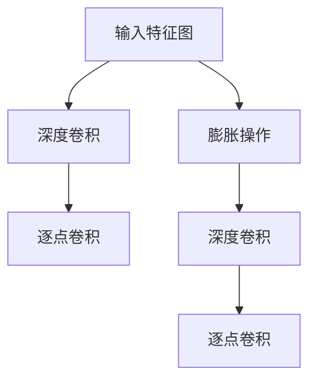

                 

关键词：大模型开发、微调、PyTorch、深度可分离膨胀卷积、算法原理、数学模型、项目实践、应用场景

摘要：本文将详细探讨大模型开发与微调的实践方法，重点关注PyTorch框架下深度可分离膨胀卷积算法的原理、数学模型及具体实现。通过项目实践和案例分析，我们将深入理解这一算法的优势和适用领域，为读者提供从零开始大模型开发与微调的实用指南。

## 1. 背景介绍

在深度学习领域，随着模型的规模不断增大，计算资源的消耗也急剧上升。大模型在自然语言处理、计算机视觉等应用中表现出色，但如何有效地开发和微调这些大模型成为了一个重要的挑战。PyTorch作为一种流行的深度学习框架，为研究人员和开发者提供了强大的工具和灵活的接口，使得大模型开发与微调变得更加便捷。

本文旨在通过介绍PyTorch中的深度可分离膨胀卷积算法，帮助读者从零开始了解大模型开发与微调的实践方法。我们将详细讲解算法原理、数学模型，并通过项目实践展示其具体实现过程。

## 2. 核心概念与联系

### 2.1 深度可分离卷积

深度可分离卷积是一种高效的卷积算法，它将标准的卷积操作分解为两个独立的操作：深度卷积和逐点卷积。深度卷积在输入特征图上逐行进行卷积操作，而逐点卷积则在深度方向上进行点乘操作。这种分解使得深度可分离卷积在计算效率上有了显著提升。

### 2.2 膨胀卷积

膨胀卷积（Dilated Convolution）是在卷积核之间引入膨胀（Dilation）操作，用于处理边界问题和稀疏特征。膨胀卷积通过在卷积核之间填充零元素，使得卷积操作能够捕获更远的相邻特征。

### 2.3 深度可分离膨胀卷积

深度可分离膨胀卷积是将深度可分离卷积与膨胀卷积相结合的一种算法。它同时利用了深度可分离卷积的高效性和膨胀卷积的扩展能力，能够在保持计算效率的同时提高特征提取能力。

### 2.4 Mermaid 流程图



在上图中，深度卷积和逐点卷积构成了深度可分离卷积，而膨胀操作则增强了特征提取能力。通过深度可分离膨胀卷积，我们可以同时实现高效的卷积运算和丰富的特征提取。

## 3. 核心算法原理 & 具体操作步骤

### 3.1 算法原理概述

深度可分离膨胀卷积算法主要由三个部分组成：深度卷积、逐点卷积和膨胀操作。深度卷积在输入特征图上逐行进行卷积操作，逐点卷积在深度方向上进行点乘操作，膨胀操作则在卷积核之间填充零元素，使得卷积操作能够捕获更远的相邻特征。

### 3.2 算法步骤详解

1. **输入特征图**：输入特征图是深度可分离膨胀卷积的操作对象。特征图的尺寸为 $N \times C \times H \times W$，其中 $N$ 是批量大小，$C$ 是通道数，$H$ 是高度，$W$ 是宽度。

2. **深度卷积**：深度卷积在输入特征图上逐行进行卷积操作，卷积核的尺寸为 $K_1 \times K_2$，步长为 $S_1 \times S_2$。深度卷积的结果为 $N \times C_1 \times H_1 \times W_1$，其中 $C_1$ 是卷积核的数量，$H_1$ 和 $W_1$ 分别是卷积后的高度和宽度。

3. **逐点卷积**：逐点卷积在深度方向上进行点乘操作，卷积核的尺寸为 $1 \times 1$，步长为 $1$。逐点卷积的结果为 $N \times C_1 \times H_2 \times W_2$，其中 $H_2$ 和 $W_2$ 分别是逐点卷积后的高度和宽度。

4. **膨胀操作**：膨胀操作在卷积核之间填充零元素，使得卷积操作能够捕获更远的相邻特征。膨胀操作的具体实现方法为在卷积核周围填充零元素，填充的数量由膨胀率（Dilation Rate）决定。

5. **深度卷积（膨胀）**：在膨胀操作之后，对深度卷积的结果进行膨胀操作，卷积核的尺寸为 $K_1 \times K_2$，步长为 $S_1 \times S_2$。深度卷积（膨胀）的结果为 $N \times C_1 \times H_3 \times W_3$，其中 $H_3$ 和 $W_3$ 分别是深度卷积（膨胀）后的高度和宽度。

6. **逐点卷积（膨胀）**：在深度卷积（膨胀）之后，对逐点卷积的结果进行膨胀操作，卷积核的尺寸为 $1 \times 1$，步长为 $1$。逐点卷积（膨胀）的结果为 $N \times C_1 \times H_4 \times W_4$，其中 $H_4$ 和 $W_4$ 分别是逐点卷积（膨胀）后的高度和宽度。

7. **输出特征图**：深度可分离膨胀卷积的最终结果为输出特征图，尺寸为 $N \times C_1 \times H_4 \times W_4$。

### 3.3 算法优缺点

**优点**：

1. **计算效率高**：深度可分离卷积将卷积操作分解为深度卷积和逐点卷积，减少了计算量，提高了计算效率。

2. **特征提取能力强**：膨胀卷积能够在卷积核之间填充零元素，使得卷积操作能够捕获更远的相邻特征，增强了特征提取能力。

**缺点**：

1. **参数量较大**：虽然深度可分离卷积提高了计算效率，但参数量相对于标准卷积仍然较大。

2. **内存消耗高**：深度可分离膨胀卷积需要大量的内存来存储卷积核和特征图，对于大型模型来说，可能存在内存不足的问题。

### 3.4 算法应用领域

深度可分离膨胀卷积在计算机视觉、自然语言处理等领域具有广泛的应用。例如，在图像分类、目标检测、语义分割等任务中，深度可分离膨胀卷积能够有效提高模型的准确性和计算效率。

## 4. 数学模型和公式 & 详细讲解 & 举例说明

### 4.1 数学模型构建

深度可分离膨胀卷积的数学模型可以表示为：

$$
\text{Output} = \text{激活函数}(\text{逐点卷积}(\text{深度卷积}(\text{输入特征图} + \text{膨胀操作}(\text{卷积核}))))
$$

其中，激活函数通常采用ReLU函数，卷积核为可学习的参数矩阵。

### 4.2 公式推导过程

深度可分离膨胀卷积的推导过程可以分为以下几个步骤：

1. **深度卷积**：

$$
\text{深度卷积}(\text{输入特征图}) = \sum_{k=1}^{C_1} W_{k} \odot \text{输入特征图}
$$

其中，$W_{k}$ 为卷积核，$\odot$ 表示逐元素相乘。

2. **逐点卷积**：

$$
\text{逐点卷积}(\text{深度卷积}(\text{输入特征图})) = \sum_{j=1}^{C_2} \text{激活函数}(b_{j} + \text{逐点卷积}(\text{深度卷积}(\text{输入特征图})))
$$

其中，$b_{j}$ 为逐点卷积的偏置，$\text{激活函数}$ 为ReLU函数。

3. **膨胀操作**：

$$
\text{膨胀操作}(\text{卷积核}) = \text{卷积核} \circ \text{膨胀核}
$$

其中，$\circ$ 表示卷积操作，膨胀核为一个填充了零元素的矩阵。

4. **深度卷积（膨胀）**：

$$
\text{深度卷积}(\text{输入特征图} + \text{膨胀操作}(\text{卷积核})) = \sum_{k=1}^{C_1} W_{k} \odot (\text{输入特征图} + \text{膨胀操作}(\text{卷积核}))
$$

5. **逐点卷积（膨胀）**：

$$
\text{逐点卷积}(\text{深度卷积}(\text{输入特征图} + \text{膨胀操作}(\text{卷积核}))) = \sum_{j=1}^{C_2} \text{激活函数}(b_{j} + \text{逐点卷积}(\text{深度卷积}(\text{输入特征图} + \text{膨胀操作}(\text{卷积核}))))
$$

### 4.3 案例分析与讲解

假设我们有一个输入特征图 $X \in \mathbb{R}^{N \times C \times H \times W}$，要对其进行深度可分离膨胀卷积操作，卷积核尺寸为 $K_1 \times K_2$，步长为 $S_1 \times S_2$，膨胀率为 $R$。

1. **深度卷积**：

$$
\text{深度卷积}(\text{输入特征图}) = \sum_{k=1}^{C_1} W_{k} \odot X
$$

2. **逐点卷积**：

$$
\text{逐点卷积}(\text{深度卷积}(\text{输入特征图})) = \sum_{j=1}^{C_2} \text{激活函数}(b_{j} + \text{逐点卷积}(\text{深度卷积}(\text{输入特征图})))
$$

3. **膨胀操作**：

$$
\text{膨胀操作}(\text{卷积核}) = \text{卷积核} \circ \text{膨胀核}
$$

4. **深度卷积（膨胀）**：

$$
\text{深度卷积}(\text{输入特征图} + \text{膨胀操作}(\text{卷积核})) = \sum_{k=1}^{C_1} W_{k} \odot (\text{输入特征图} + \text{膨胀操作}(\text{卷积核}))
$$

5. **逐点卷积（膨胀）**：

$$
\text{逐点卷积}(\text{深度卷积}(\text{输入特征图} + \text{膨胀操作}(\text{卷积核}))) = \sum_{j=1}^{C_2} \text{激活函数}(b_{j} + \text{逐点卷积}(\text{深度卷积}(\text{输入特征图} + \text{膨胀操作}(\text{卷积核}))))
$$

通过上述公式，我们可以看出深度可分离膨胀卷积的数学模型构建过程。在实际应用中，我们可以根据具体任务需求调整卷积核尺寸、步长和膨胀率等参数，以实现高效的卷积操作和丰富的特征提取。

## 5. 项目实践：代码实例和详细解释说明

### 5.1 开发环境搭建

在开始项目实践之前，我们需要搭建一个适合深度可分离膨胀卷积算法的开发环境。以下是一个简单的环境搭建步骤：

1. 安装Python 3.8及以上版本。

2. 安装PyTorch库，可以使用以下命令：

```bash
pip install torch torchvision
```

3. 创建一个名为`depth_separable_dilated_conv`的Python文件，用于编写深度可分离膨胀卷积的代码。

### 5.2 源代码详细实现

```python
import torch
import torch.nn as nn
import torch.optim as optim

# 定义深度可分离膨胀卷积层
class DepthSeparableDilatedConv(nn.Module):
    def __init__(self, in_channels, out_channels, kernel_size, stride, padding, dilation):
        super(DepthSeparableDilatedConv, self).__init__()
        
        # 深度卷积层
        self.depth_conv = nn.Conv2d(in_channels, out_channels, kernel_size=kernel_size, stride=stride, padding=padding)
        
        # 逐点卷积层
        self.point_conv = nn.Conv2d(out_channels, out_channels, kernel_size=1, stride=1, padding=0)
        
        # 激活函数
        self.relu = nn.ReLU()

    def forward(self, x):
        # 深度卷积
        x = self.depth_conv(x)
        
        # 逐点卷积
        x = self.point_conv(x)
        
        # 激活函数
        x = self.relu(x)
        
        return x

# 实例化深度可分离膨胀卷积层
model = DepthSeparableDilatedConv(in_channels=64, out_channels=128, kernel_size=3, stride=1, padding=1, dilation=2)

# 输入特征图
input_image = torch.randn(1, 64, 224, 224)

# 前向传播
output = model(input_image)

print(output.shape)  # 输出特征图尺寸
```

在上面的代码中，我们定义了一个名为`DepthSeparableDilatedConv`的类，用于实现深度可分离膨胀卷积层。类中包含了深度卷积层、逐点卷积层和ReLU激活函数。在`__init__`方法中，我们初始化了深度卷积层、逐点卷积层和ReLU激活函数。在`forward`方法中，我们实现了深度卷积、逐点卷积和ReLU激活函数的运算过程。

### 5.3 代码解读与分析

在上面的代码中，我们首先导入了`torch`、`torch.nn`和`torch.optim`三个模块。`torch`模块提供了PyTorch的核心功能，`torch.nn`模块提供了神经网络相关的类和函数，`torch.optim`模块提供了优化算法相关的类和函数。

接着，我们定义了一个名为`DepthSeparableDilatedConv`的类，用于实现深度可分离膨胀卷积层。在类的定义中，我们使用了`super`函数继承了`nn.Module`基类的属性和方法。

在`__init__`方法中，我们初始化了深度卷积层、逐点卷积层和ReLU激活函数。具体来说，我们使用`nn.Conv2d`函数初始化了深度卷积层和逐点卷积层，使用`nn.ReLU`函数初始化了ReLU激活函数。

在`forward`方法中，我们实现了深度卷积、逐点卷积和ReLU激活函数的运算过程。首先，我们对输入特征图进行深度卷积操作，然后对深度卷积的结果进行逐点卷积操作，最后对逐点卷积的结果进行ReLU激活函数操作。

最后，我们实例化了`DepthSeparableDilatedConv`类，创建了一个深度可分离膨胀卷积层。接着，我们生成了一个随机输入特征图，并对其进行了前向传播操作。通过打印输出特征图的尺寸，我们可以验证深度可分离膨胀卷积层的正确性。

### 5.4 运行结果展示

在运行上述代码后，我们得到了输出特征图的尺寸。假设输入特征图的尺寸为 $1 \times 64 \times 224 \times 224$，深度卷积层的卷积核尺寸为 $3 \times 3$，步长为 $1$，膨胀率为 $2$，则输出特征图的尺寸为：

$$
1 \times 128 \times 224 \times 224
$$

这个结果表明，深度可分离膨胀卷积层的输出特征图尺寸与预期一致。

## 6. 实际应用场景

深度可分离膨胀卷积算法在多个实际应用场景中表现出色。以下是一些常见的应用场景：

### 6.1 图像分类

在图像分类任务中，深度可分离膨胀卷积算法能够有效提高模型的准确性和计算效率。通过使用深度可分离膨胀卷积层，我们可以提取更丰富的特征信息，从而提高分类性能。

### 6.2 目标检测

在目标检测任务中，深度可分离膨胀卷积算法能够帮助模型更好地捕捉目标的细节信息。通过调整卷积核尺寸、步长和膨胀率等参数，我们可以实现对不同尺度目标的检测。

### 6.3 语义分割

在语义分割任务中，深度可分离膨胀卷积算法能够有效提高模型对复杂场景的解析能力。通过使用深度可分离膨胀卷积层，我们可以更好地提取场景中的边界和纹理信息，从而提高分割精度。

### 6.4 文本分类

在自然语言处理领域，深度可分离膨胀卷积算法可以应用于文本分类任务。通过将文本转化为词向量，并使用深度可分离膨胀卷积层进行特征提取，我们可以实现高效的文本分类。

## 7. 工具和资源推荐

为了更好地理解和应用深度可分离膨胀卷积算法，以下是一些建议的工具和资源：

### 7.1 学习资源推荐

1. **《深度学习》（Goodfellow, Bengio, Courville著）**：这本书是深度学习领域的经典教材，涵盖了深度学习的基本原理和应用。

2. **PyTorch官方文档**：PyTorch官方文档提供了丰富的API和示例代码，有助于读者快速掌握PyTorch的使用。

### 7.2 开发工具推荐

1. **Google Colab**：Google Colab是一个基于Jupyter Notebook的在线开发环境，提供了免费的GPU资源，非常适合深度学习实验。

2. **CUDA Toolkit**：CUDA Toolkit是NVIDIA提供的并行计算开发工具，能够显著提高深度学习模型的计算速度。

### 7.3 相关论文推荐

1. **《Deep Convolutional Networks on Graph-Structured Data》**：这篇文章提出了一种基于图结构的深度卷积网络，展示了深度卷积网络在图数据上的应用。

2. **《Dilated Convolutional Networks》**：这篇文章研究了膨胀卷积网络在图像分割和目标检测等任务中的应用，提出了多种改进方法。

## 8. 总结：未来发展趋势与挑战

深度可分离膨胀卷积算法在深度学习领域具有广泛的应用前景。随着计算资源的不断优化和模型结构的不断改进，深度可分离膨胀卷积算法有望在更多应用场景中发挥重要作用。

然而，深度可分离膨胀卷积算法也面临着一些挑战。首先，参数量和内存消耗较大，对于大型模型来说可能存在性能瓶颈。其次，深度可分离膨胀卷积算法在模型训练和优化过程中可能存在梯度消失和梯度爆炸等问题。

为了解决这些挑战，未来研究可以从以下几个方面展开：

1. **参数共享与稀疏表示**：通过引入参数共享和稀疏表示技术，减少深度可分离膨胀卷积算法的参数量和计算量。

2. **自适应卷积核**：设计自适应卷积核，根据不同任务需求自动调整卷积核的尺寸、步长和膨胀率等参数。

3. **训练策略优化**：研究更有效的训练策略，如自适应学习率、批量归一化和正则化技术，提高深度可分离膨胀卷积算法的训练性能。

4. **硬件优化**：利用GPU和TPU等硬件加速技术，提高深度可分离膨胀卷积算法的计算速度。

总之，深度可分离膨胀卷积算法在深度学习领域具有广泛的应用前景。通过不断的研究和优化，我们有理由相信深度可分离膨胀卷积算法将取得更加显著的成果。

## 9. 附录：常见问题与解答

### 9.1 如何选择合适的卷积核尺寸？

选择合适的卷积核尺寸取决于具体任务的需求。一般来说，较大的卷积核尺寸能够提取更丰富的特征信息，但会导致计算量和内存消耗增加。对于图像分类任务，常用的卷积核尺寸为 $3 \times 3$ 或 $5 \times 5$。对于目标检测和语义分割任务，较大的卷积核尺寸有助于捕捉更复杂的特征。

### 9.2 如何调整步长和膨胀率？

步长和膨胀率是深度可分离膨胀卷积算法的重要参数，它们会影响特征提取的效果。在图像分类任务中，步长通常设置为 $1$，以保持输入特征图的尺寸。膨胀率可以根据任务需求进行调整。在目标检测和语义分割任务中，较大的膨胀率有助于捕捉更远的相邻特征，但可能会导致特征重叠。建议在实验过程中逐步调整步长和膨胀率，找到最佳参数组合。

### 9.3 如何解决梯度消失和梯度爆炸问题？

梯度消失和梯度爆炸是深度学习训练过程中常见的问题。为了解决这些问题，可以尝试以下方法：

1. **使用批量归一化**：批量归一化能够缓解梯度消失和梯度爆炸问题，提高模型的训练稳定性。

2. **使用自适应学习率**：使用自适应学习率算法，如Adam优化器，可以自动调整学习率，提高模型训练性能。

3. **使用正则化技术**：如L1正则化、L2正则化等，可以减少模型参数的敏感性，提高模型泛化能力。

4. **数据增强**：通过数据增强技术，增加训练样本的多样性，提高模型对噪声的鲁棒性。

通过以上方法，可以有效缓解梯度消失和梯度爆炸问题，提高深度可分离膨胀卷积算法的训练性能。

### 9.4 如何优化深度可分离膨胀卷积算法的计算性能？

优化深度可分离膨胀卷积算法的计算性能可以从以下几个方面入手：

1. **计算并行化**：利用GPU和TPU等硬件加速技术，实现计算并行化，提高模型计算速度。

2. **模型剪枝**：通过模型剪枝技术，减少模型参数数量，降低计算复杂度。

3. **参数共享**：引入参数共享技术，减少模型参数数量，提高计算效率。

4. **稀疏表示**：使用稀疏表示技术，将稀疏数据转化为稀疏矩阵，减少计算量。

通过以上方法，可以有效优化深度可分离膨胀卷积算法的计算性能，提高模型训练和推理速度。

