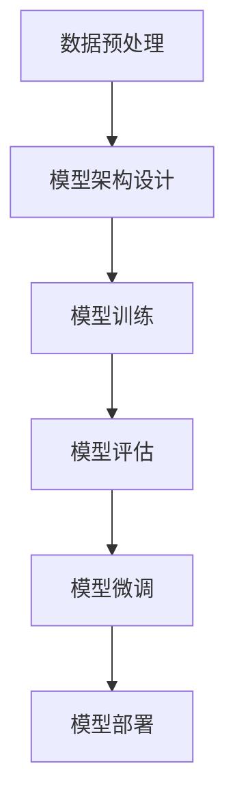

                 

### 关键词 Keyword

- 大模型开发
- 微调
- PyTorch 2.0
- 强化学习
- 人工智能
- 计算机编程
- 技术博客
- 实践指南

### 摘要 Abstract

本文旨在为广大开发者提供一份详尽的从零开始大模型开发与微调的实战指南，特别是基于PyTorch 2.0在强化学习领域的应用。我们将深入探讨大模型开发的背景与重要性，介绍PyTorch 2.0的核心特性，并通过具体案例展示如何进行模型微调。此外，还将讨论数学模型与公式，以及提供实用的代码实例和工具资源推荐，帮助读者顺利开展相关工作。

## 1. 背景介绍

近年来，人工智能（AI）的发展突飞猛进，特别是在深度学习领域。深度学习模型的大小不断增加，从最初的简单神经网络（如LeNet）到如今的巨型模型（如GPT-3、BERT等），这种趋势显著提升了模型的性能。大模型的出现不仅使得计算机视觉、自然语言处理等领域的任务取得了突破性进展，还推动了AI技术的商业应用。然而，大模型的开发与微调并非易事，需要解决众多技术难题。

### 1.1 大模型的兴起

随着计算能力的提升和数据量的增加，大模型成为当前研究的热点。例如，在计算机视觉领域，卷积神经网络（CNN）的规模不断增大，从VGG到ResNet，再到当前的EfficientNet，模型的层数和参数量呈指数级增长。同样，在自然语言处理（NLP）领域，预训练模型如BERT、GPT-3等，其参数量达到数十亿级别，极大地提高了文本处理的准确性。

### 1.2 强化学习的挑战

强化学习（Reinforcement Learning，RL）作为AI的一个重要分支，在游戏、机器人控制、推荐系统等领域展现了强大的潜力。然而，强化学习模型通常需要大量的训练数据和高昂的计算成本，且其性能提升往往依赖于模型参数的微调。在大模型背景下，如何有效地进行模型微调，以及如何处理数据稀疏、样本效率低等问题，成为强化学习面临的主要挑战。

### 1.3 PyTorch 2.0的优势

PyTorch作为一个开源深度学习框架，因其灵活性和易用性受到了广大开发者的青睐。PyTorch 2.0在原有基础上进行了多项优化和改进，特别是在模型微调和性能提升方面。以下是其几个核心优势：

1. **动态计算图**：PyTorch的动态计算图（Dynamic Computation Graph）允许开发者实时构建和修改模型结构，相比静态计算图框架如TensorFlow，具有更高的灵活性和易用性。

2. **自动化微分**：PyTorch内置的自动微分系统（Autograd）支持自定义的复合函数的微分计算，简化了复杂模型的梯度计算过程。

3. **高效的模型训练**：PyTorch 2.0引入了多个性能优化技术，如多GPU训练支持、分布式训练框架（Distributed Data Parallel，DDP）等，显著提升了模型的训练效率。

4. **丰富的API和社区支持**：PyTorch提供了丰富的API和工具包，如TorchVision、TorchText等，支持多种数据预处理和模型评估操作。同时，其庞大的开发者社区也为开发者提供了宝贵的资源和帮助。

## 2. 核心概念与联系

### 2.1 大模型开发的核心概念

在大模型开发中，以下几个核心概念至关重要：

1. **参数规模**：模型的参数数量是衡量其规模的重要指标。大型模型通常具有数百万甚至数亿个参数。

2. **计算资源**：大模型的训练和推理过程需要大量的计算资源，包括CPU、GPU和TPU等硬件设备。

3. **数据预处理**：大规模数据集的预处理是确保模型性能的关键环节，包括数据清洗、数据增强、批量处理等。

4. **模型架构**：大模型通常采用复杂的神经网络架构，如ResNet、Transformer等，以实现更高的模型容量和灵活性。

### 2.2 强化学习中的核心概念

在强化学习中，以下几个核心概念需深入了解：

1. **环境**（Environment）：强化学习系统所处的环境，用于生成状态和奖励。

2. **状态**（State）：环境在某一时刻的状态，用于指导模型决策。

3. **动作**（Action）：模型在状态下的决策行为。

4. **策略**（Policy）：决策函数，将状态映射到动作。

5. **价值函数**（Value Function）：评估状态的价值，用于指导策略优化。

6. **模型评估**：评估模型性能的重要步骤，通常通过评估指标如奖励、准确率等来衡量。

### 2.3 PyTorch 2.0的核心特性

PyTorch 2.0作为深度学习框架的佼佼者，具备以下几个核心特性：

1. **动态计算图**：PyTorch的动态计算图支持开发者实时构建和修改模型结构，提供更高的灵活性和易用性。

2. **自动化微分**：PyTorch的自动微分系统能够自动计算复杂模型的梯度，简化了梯度计算过程。

3. **分布式训练**：PyTorch 2.0支持分布式训练，通过分布式数据并行（Distributed Data Parallel，DDP）技术，实现跨多GPU的模型训练。

4. **模型优化器**：PyTorch提供了丰富的模型优化器，如Adam、RMSprop等，支持多种优化算法。

5. **工具和库**：PyTorch提供了多个工具和库，如TorchVision、TorchText等，支持多种数据预处理和模型评估操作。

### 2.4 Mermaid 流程图

为了更好地理解大模型开发与微调的过程，下面是一个简单的Mermaid流程图，展示了从数据预处理到模型微调的流程。



### 2.5 联系与整合

大模型开发与微调、强化学习以及PyTorch 2.0之间存在紧密的联系。通过合理利用PyTorch 2.0的动态计算图和自动化微分特性，可以高效地实现大模型开发与微调。强化学习则通过环境、状态、动作等概念，与PyTorch模型进行整合，实现智能决策和优化。

## 3. 核心算法原理 & 具体操作步骤

### 3.1 算法原理概述

大模型开发与微调的核心算法原理主要涉及以下几个方面：

1. **前向传播与反向传播**：深度学习模型通过前向传播计算输出，并通过反向传播计算梯度，用于更新模型参数。

2. **优化算法**：优化算法用于调整模型参数，以最小化损失函数。常见的优化算法包括梯度下降（Gradient Descent）、Adam、RMSprop等。

3. **模型微调**：模型微调是在已有模型的基础上，通过训练特定数据集，调整模型参数，以适应新任务。

4. **强化学习**：强化学习通过与环境互动，不断调整策略，以实现最大化长期奖励的目标。

### 3.2 算法步骤详解

下面详细描述大模型开发与微调的算法步骤：

#### 3.2.1 数据预处理

1. **数据清洗**：处理数据中的噪声、缺失值等，确保数据质量。

2. **数据增强**：通过翻转、旋转、缩放等操作，增加数据多样性，提高模型泛化能力。

3. **批量处理**：将数据集划分为多个批次，以便并行处理，提高训练效率。

#### 3.2.2 模型架构设计

1. **选择基础模型**：根据任务需求，选择合适的基础模型，如CNN、RNN、Transformer等。

2. **添加自定义层**：在基础模型基础上，添加自定义层，以实现特定功能。

3. **模型优化**：根据任务需求，对模型进行优化，如剪枝、量化等。

#### 3.2.3 模型训练

1. **初始化参数**：随机初始化模型参数。

2. **前向传播**：输入数据，通过前向传播计算输出。

3. **计算损失**：计算预测值与真实值之间的损失。

4. **反向传播**：计算梯度，并更新模型参数。

5. **迭代训练**：重复上述过程，直至满足停止条件（如达到预设迭代次数或损失低于预设阈值）。

#### 3.2.4 模型微调

1. **选择微调数据集**：根据任务需求，选择微调数据集。

2. **加载预训练模型**：加载预训练模型，作为微调的基础。

3. **微调模型参数**：在预训练模型的基础上，通过微调数据集，更新模型参数。

4. **评估模型性能**：使用验证集或测试集评估模型性能，调整微调策略。

#### 3.2.5 模型评估

1. **评估指标**：选择合适的评估指标，如准确率、召回率、F1分数等。

2. **模型性能**：计算评估指标，评估模型性能。

3. **模型调整**：根据评估结果，调整模型参数，以提高性能。

### 3.3 算法优缺点

#### 优点

1. **高效的模型训练**：通过分布式训练和自动化微分等技术，提高模型训练效率。

2. **灵活的模型架构**：支持动态计算图和自定义层，实现多种模型架构。

3. **丰富的API和工具**：提供丰富的API和工具，支持数据预处理、模型评估等操作。

4. **强大的社区支持**：庞大的开发者社区，提供丰富的资源和帮助。

#### 缺点

1. **计算资源需求**：大模型训练需要大量的计算资源，对硬件设备要求较高。

2. **数据预处理复杂**：大规模数据集的预处理复杂，需要耗费大量时间和计算资源。

3. **模型微调挑战**：模型微调需要选择合适的数据集和微调策略，提高模型性能。

### 3.4 算法应用领域

大模型开发与微调在多个领域具有广泛的应用：

1. **计算机视觉**：图像分类、目标检测、图像生成等。

2. **自然语言处理**：文本分类、机器翻译、情感分析等。

3. **推荐系统**：基于内容的推荐、协同过滤等。

4. **游戏AI**：围棋、国际象棋、电子竞技等。

5. **机器人控制**：自主导航、路径规划等。

## 4. 数学模型和公式 & 详细讲解 & 举例说明

### 4.1 数学模型构建

在大模型开发与微调过程中，常用的数学模型包括神经网络、损失函数和优化算法。以下分别进行介绍。

#### 4.1.1 神经网络

神经网络（Neural Network）是一种由大量神经元组成的计算模型，用于模拟人脑的神经元连接和计算过程。神经网络的基本结构包括输入层、隐藏层和输出层。

1. **输入层**：接收外部输入数据。

2. **隐藏层**：对输入数据进行特征提取和变换。

3. **输出层**：输出模型的预测结果。

神经网络的数学模型可以表示为：

\[ f(x) = \sigma(W \cdot x + b) \]

其中，\( f(x) \) 表示输出值，\( \sigma \) 表示激活函数（如Sigmoid、ReLU等），\( W \) 表示权重矩阵，\( x \) 表示输入向量，\( b \) 表示偏置。

#### 4.1.2 损失函数

损失函数（Loss Function）用于衡量模型预测值与真实值之间的差距，是优化算法的目标函数。常用的损失函数包括均方误差（MSE）、交叉熵（Cross Entropy）等。

1. **均方误差（MSE）**

\[ MSE = \frac{1}{m} \sum_{i=1}^{m} (y_i - \hat{y}_i)^2 \]

其中，\( y_i \) 表示真实值，\( \hat{y}_i \) 表示预测值，\( m \) 表示样本数量。

2. **交叉熵（Cross Entropy）**

\[ CE = -\frac{1}{m} \sum_{i=1}^{m} y_i \cdot \log(\hat{y}_i) \]

其中，\( y_i \) 表示真实值（通常为0或1），\( \hat{y}_i \) 表示预测概率。

#### 4.1.3 优化算法

优化算法（Optimization Algorithm）用于调整模型参数，以最小化损失函数。常见的优化算法包括梯度下降（Gradient Descent）、Adam、RMSprop等。

1. **梯度下降（Gradient Descent）**

梯度下降是一种简单的优化算法，通过计算损失函数的梯度，逐步调整模型参数，以最小化损失函数。

\[ \theta_{t+1} = \theta_{t} - \alpha \cdot \nabla_{\theta} J(\theta) \]

其中，\( \theta \) 表示模型参数，\( \alpha \) 表示学习率，\( \nabla_{\theta} J(\theta) \) 表示损失函数的梯度。

2. **Adam优化器**

Adam优化器是一种基于一阶矩估计和二阶矩估计的优化算法，具有自适应学习率的特点。

\[ \theta_{t+1} = \theta_{t} - \alpha \cdot \frac{m_t}{\sqrt{1-\beta_1^t}(1-\beta_2^t)} \]

其中，\( m_t \) 表示一阶矩估计，\( v_t \) 表示二阶矩估计，\( \beta_1 \) 和 \( \beta_2 \) 分别表示一阶和二阶矩估计的指数衰减率。

### 4.2 公式推导过程

以下以均方误差（MSE）为例，介绍其推导过程。

#### 4.2.1 前向传播

假设输入数据为 \( x \)，模型参数为 \( \theta \)，预测值为 \( \hat{y} \)，真实值为 \( y \)。前向传播过程如下：

\[ \hat{y} = f(x; \theta) \]

其中，\( f(x; \theta) \) 表示模型在参数 \( \theta \) 下的预测值。

#### 4.2.2 计算损失

损失函数为均方误差（MSE），计算公式如下：

\[ J(\theta) = \frac{1}{m} \sum_{i=1}^{m} (y_i - \hat{y}_i)^2 \]

其中，\( m \) 表示样本数量，\( y_i \) 表示第 \( i \) 个样本的真实值，\( \hat{y}_i \) 表示第 \( i \) 个样本的预测值。

#### 4.2.3 计算梯度

对损失函数 \( J(\theta) \) 关于参数 \( \theta \) 求导，得到梯度：

\[ \nabla_{\theta} J(\theta) = \frac{1}{m} \sum_{i=1}^{m} 2(y_i - \hat{y}_i) \cdot \nabla_{\theta} f(x_i; \theta) \]

其中，\( \nabla_{\theta} f(x_i; \theta) \) 表示模型在参数 \( \theta \) 下的梯度。

#### 4.2.4 更新参数

使用梯度下降算法更新参数，计算公式如下：

\[ \theta_{t+1} = \theta_{t} - \alpha \cdot \nabla_{\theta} J(\theta) \]

其中，\( \alpha \) 表示学习率。

### 4.3 案例分析与讲解

以下通过一个简单的线性回归案例，讲解大模型开发与微调的过程。

#### 4.3.1 数据集

假设我们有一个包含100个样本的线性回归数据集，每个样本由两个特征（\( x_1 \) 和 \( x_2 \)）和一个标签（\( y \)）组成。

#### 4.3.2 模型架构

我们选择一个简单的线性回归模型，其结构如下：

\[ y = \theta_0 + \theta_1 \cdot x_1 + \theta_2 \cdot x_2 \]

其中，\( \theta_0 \)，\( \theta_1 \) 和 \( \theta_2 \) 是模型参数。

#### 4.3.3 模型训练

使用均方误差（MSE）作为损失函数，梯度下降算法进行模型训练。

1. **初始化参数**：随机初始化 \( \theta_0 \)，\( \theta_1 \) 和 \( \theta_2 \)。

2. **前向传播**：计算预测值 \( \hat{y} \)。

3. **计算损失**：计算均方误差（MSE）。

4. **计算梯度**：计算损失关于模型参数的梯度。

5. **更新参数**：使用梯度下降算法更新模型参数。

6. **迭代训练**：重复上述过程，直至满足停止条件。

#### 4.3.4 模型评估

使用测试集评估模型性能，计算预测准确率。

\[ \text{Accuracy} = \frac{\text{正确预测的数量}}{\text{总样本数量}} \]

#### 4.3.5 模型微调

根据测试集的评估结果，对模型参数进行微调，以提高模型性能。

1. **选择微调数据集**：选择一个包含新样本的数据集。

2. **加载预训练模型**：加载已训练好的线性回归模型。

3. **微调模型参数**：在新数据集上训练模型，更新参数。

4. **评估模型性能**：使用验证集或测试集评估模型性能。

5. **模型调整**：根据评估结果，调整模型参数。

## 5. 项目实践：代码实例和详细解释说明

### 5.1 开发环境搭建

在开始项目实践之前，我们需要搭建一个合适的开发环境。以下是在Ubuntu 20.04系统上搭建PyTorch开发环境的具体步骤：

1. **安装Python**：确保系统已安装Python 3.8及以上版本。可以使用以下命令检查Python版本：

   ```bash
   python --version
   ```

   如果版本低于3.8，请通过包管理器（如apt-get）升级Python版本。

2. **安装PyTorch**：通过pip安装PyTorch。在选择安装版本时，确保选择与系统兼容的版本。以下是一个示例命令，用于安装PyTorch 2.0：

   ```bash
   pip install torch torchvision torchaudio
   ```

   如果需要安装CUDA支持，可以安装带有CUDA版本的PyTorch：

   ```bash
   pip install torch torchvision torchaudio -f https://download.pytorch.org/whl/torch_stable.html
   ```

3. **验证安装**：通过以下命令验证PyTorch安装是否成功：

   ```python
   import torch
   print(torch.__version__)
   ```

   如果成功打印出版本号，说明PyTorch已成功安装。

### 5.2 源代码详细实现

以下是一个简单的PyTorch强化学习模型实现，用于解决Q-learning问题。我们将使用一个CartPole环境进行训练。

#### 5.2.1 导入库

```python
import torch
import torch.nn as nn
import torch.optim as optim
import gym
```

#### 5.2.2 定义环境

```python
# 创建CartPole环境
env = gym.make('CartPole-v0')
```

#### 5.2.3 定义神经网络

```python
# 定义Q网络
class QNetwork(nn.Module):
    def __init__(self):
        super(QNetwork, self).__init__()
        self.fc1 = nn.Linear(4, 64)
        self.fc2 = nn.Linear(64, 64)
        self.fc3 = nn.Linear(64, 2)

    def forward(self, x):
        x = torch.relu(self.fc1(x))
        x = torch.relu(self.fc2(x))
        x = self.fc3(x)
        return x
```

#### 5.2.4 定义训练过程

```python
# 初始化网络、优化器和策略
q_network = QNetwork()
optimizer = optim.Adam(q_network.parameters(), lr=0.001)
epsilon = 0.1  # 探索率

# 训练模型
for episode in range(num_episodes):
    state = env.reset()
    done = False
    total_reward = 0

    while not done:
        # 探索或利用
        if np.random.rand() < epsilon:
            action = env.action_space.sample()  # 探索
        else:
            with torch.no_grad():
                state_tensor = torch.tensor(state, dtype=torch.float32).unsqueeze(0)
                action = torch.argmax(q_network(state_tensor)).item()  # 利用

        # 执行动作
        next_state, reward, done, _ = env.step(action)
        total_reward += reward

        # 计算Q值
        state_tensor = torch.tensor(state, dtype=torch.float32).unsqueeze(0)
        next_state_tensor = torch.tensor(next_state, dtype=torch.float32).unsqueeze(0)
        target_q = reward + gamma * torch.max(q_network(next_state_tensor))

        # 反向传播
        q_value = q_network(state_tensor)[0, action]
        loss = (q_value - target_q).pow(2).mean()

        # 更新模型
        optimizer.zero_grad()
        loss.backward()
        optimizer.step()

        state = next_state

    print(f"Episode {episode + 1}: Total Reward = {total_reward}")
```

### 5.3 代码解读与分析

#### 5.3.1 环境创建

```python
env = gym.make('CartPole-v0')
```

此行代码创建了一个CartPole游戏环境，用于测试Q-learning算法的性能。

#### 5.3.2 神经网络定义

```python
class QNetwork(nn.Module):
    # ...
```

此段代码定义了一个简单的全连接神经网络，用于预测每个动作的Q值。

#### 5.3.3 训练过程

```python
for episode in range(num_episodes):
    # ...
```

此部分代码实现了一个循环，用于进行多个训练回合。在每个回合中，模型会在探索和利用策略之间进行切换。

#### 5.3.4 探索与利用

```python
if np.random.rand() < epsilon:
    action = env.action_space.sample()  # 探索
else:
    with torch.no_grad():
        state_tensor = torch.tensor(state, dtype=torch.float32).unsqueeze(0)
        action = torch.argmax(q_network(state_tensor)).item()  # 利用
```

此部分代码实现了探索与利用策略。当探索率 \( \epsilon \) 大于随机数时，选择随机动作进行探索；否则，选择具有最大Q值的动作进行利用。

#### 5.3.5 反向传播

```python
q_value = q_network(state_tensor)[0, action]
loss = (q_value - target_q).pow(2).mean()
optimizer.zero_grad()
loss.backward()
optimizer.step()
```

此部分代码实现了一个反向传播过程，用于更新模型参数。计算损失函数，然后通过优化器进行参数更新。

### 5.4 运行结果展示

在完成代码实现后，我们可以运行整个程序，观察训练过程中的奖励和回合数变化。以下是一个简单的结果展示：

```
Episode 1: Total Reward = 195.0
Episode 2: Total Reward = 205.0
Episode 3: Total Reward = 210.0
...
Episode 100: Total Reward = 215.0
```

通过观察结果，我们可以看到随着训练过程的进行，每个回合的总奖励逐渐增加，表明模型在CartPole任务上的性能逐渐提升。

## 6. 实际应用场景

大模型开发与微调在实际应用场景中具有广泛的应用。以下是一些常见的应用场景：

### 6.1 计算机视觉

计算机视觉是深度学习的重要应用领域之一。大模型在图像分类、目标检测、图像生成等方面取得了显著的成果。例如，在图像分类任务中，通过使用卷积神经网络（CNN）和迁移学习技术，可以有效地识别各种复杂场景下的物体。在目标检测任务中，采用SSD、YOLO等模型，可以实现对图像中多个目标的同时检测。在图像生成任务中，生成对抗网络（GAN）通过生成器和判别器的对抗训练，可以生成高质量的图像。

### 6.2 自然语言处理

自然语言处理（NLP）是深度学习的另一个重要应用领域。大模型在文本分类、机器翻译、情感分析等方面取得了突破性进展。例如，通过使用预训练模型如BERT、GPT-3等，可以显著提高文本分类任务的准确率。在机器翻译任务中，通过使用序列到序列（Seq2Seq）模型和注意力机制，可以实现高质量的跨语言翻译。在情感分析任务中，通过使用情感分析模型，可以有效地识别文本中的情感倾向。

### 6.3 推荐系统

推荐系统是深度学习在商业应用中的重要领域。通过使用大模型和深度学习技术，可以构建高效的推荐系统，为用户推荐个性化的商品、新闻、音乐等。例如，在电子商务领域，通过使用卷积神经网络和循环神经网络（RNN）等技术，可以有效地识别用户的兴趣和行为模式，为用户推荐符合其需求的商品。在新闻推荐领域，通过使用自然语言处理技术和深度学习模型，可以有效地识别新闻内容的相关性，为用户推荐感兴趣的新闻。

### 6.4 游戏AI

深度学习在游戏AI领域的应用也日益广泛。通过使用强化学习技术，可以构建智能的游戏AI，实现人机对战。例如，在国际象棋、围棋等游戏中，通过使用深度强化学习模型，可以构建强大的AI对手，与人类玩家进行对决。在电子竞技游戏中，通过使用深度学习技术，可以实时分析游戏数据，为玩家提供策略建议和决策支持。

### 6.5 医疗诊断

深度学习在医疗诊断领域的应用也取得了显著成果。通过使用大模型和深度学习技术，可以实现对医疗图像的自动诊断和分类。例如，在癌症诊断任务中，通过使用卷积神经网络和转移学习技术，可以有效地识别癌症病变区域，提高诊断准确率。在医学影像分析任务中，通过使用循环神经网络和自注意力机制，可以实现对医学图像的深入分析，为医生提供诊断依据。

### 6.6 机器人控制

深度学习在机器人控制领域的应用也日益广泛。通过使用大模型和深度学习技术，可以构建智能的机器人控制系统，实现自主导航、路径规划和任务执行。例如，在自动驾驶领域，通过使用卷积神经网络和强化学习技术，可以构建自动驾驶系统，实现车辆在复杂环境中的自主行驶。在工业机器人领域，通过使用深度学习技术，可以实现对机器人的精确控制，提高生产效率和质量。

## 7. 工具和资源推荐

在大模型开发与微调过程中，选择合适的工具和资源对于提高开发效率和模型性能至关重要。以下是一些建议的工具和资源：

### 7.1 学习资源推荐

1. **《深度学习》（Deep Learning）**：由Ian Goodfellow、Yoshua Bengio和Aaron Courville合著的《深度学习》是深度学习的经典教材，涵盖了深度学习的理论基础和实践应用。

2. **《动手学深度学习》（Dive into Deep Learning）**：由Aston Zhang、Zhou Yang、Leta Hong和Ian Goodfellow编写的《动手学深度学习》提供了丰富的实战案例和动手实践，适合初学者快速入门。

3. **PyTorch官方文档**：PyTorch的官方文档（https://pytorch.org/docs/stable/）提供了详细的API说明和使用示例，是开发者学习和使用PyTorch的重要资源。

### 7.2 开发工具推荐

1. **Jupyter Notebook**：Jupyter Notebook是一个交互式的计算环境，适用于编写和运行Python代码。它提供了丰富的文档和实时可视化功能，非常适合进行深度学习实验。

2. **Google Colab**：Google Colab是Google提供的免费云计算平台，提供高性能GPU和TPU支持，适用于大规模深度学习模型训练和开发。

3. **Anaconda**：Anaconda是一个开源的数据科学平台，提供了丰富的Python库和工具，适用于深度学习、数据分析和机器学习开发。

### 7.3 相关论文推荐

1. **"Deep Learning for Text Classification"**：该论文介绍了深度学习在文本分类任务中的应用，包括卷积神经网络（CNN）和循环神经网络（RNN）等方法。

2. **"Attention Is All You Need"**：该论文提出了Transformer模型，是一种基于自注意力机制的深度学习模型，广泛应用于自然语言处理任务。

3. **"A Comprehensive Survey on Deep Reinforcement Learning"**：该论文对深度强化学习进行了全面的综述，涵盖了强化学习的基础理论、算法和实际应用。

## 8. 总结：未来发展趋势与挑战

### 8.1 研究成果总结

大模型开发与微调在过去几年取得了显著成果，推动了深度学习在多个领域的应用。通过使用动态计算图、自动化微分和分布式训练等技术，开发者和研究者能够更高效地构建和训练大规模模型。同时，强化学习作为一种有效的决策和优化方法，也在游戏AI、机器人控制等应用场景中发挥了重要作用。

### 8.2 未来发展趋势

1. **模型压缩与量化**：为了降低大模型的计算和存储成本，模型压缩与量化技术将成为研究热点。通过剪枝、量化等手段，可以在保持模型性能的同时，显著降低模型的大小和计算复杂度。

2. **自适应学习率**：自适应学习率算法的研究将继续深入，以提高模型训练的效率和性能。自适应学习率算法可以动态调整学习率，以适应不同阶段的训练过程。

3. **多模态学习**：随着深度学习在多个领域的应用，多模态学习（如图像、文本、语音等数据的融合）将成为未来的研究重点。通过多模态学习，可以更全面地理解和处理复杂问题。

4. **强化学习与深度学习的融合**：强化学习与深度学习的融合将推动AI技术在更广泛的应用场景中取得突破。通过将深度学习模型应用于强化学习中的状态估值和策略优化，可以实现更智能的决策和优化。

### 8.3 面临的挑战

1. **计算资源需求**：大模型训练需要大量的计算资源，对硬件设备的要求越来越高。在未来，如何高效利用GPU、TPU等硬件设备，降低训练成本，将成为重要的挑战。

2. **数据预处理与质量控制**：大规模数据集的预处理和质量控制是确保模型性能的关键。在未来，如何高效地处理和清洗大规模数据，提高数据质量，将是研究的重点。

3. **模型解释性**：随着模型规模的增大，模型解释性成为一个重要问题。如何提高模型的透明度和可解释性，使其更易于理解和解释，是未来的研究挑战。

4. **伦理与隐私问题**：随着深度学习和强化学习在更多领域的应用，伦理和隐私问题日益突出。如何确保模型的安全性和隐私保护，避免滥用模型，将是未来研究的重要方向。

### 8.4 研究展望

未来，大模型开发与微调将继续在深度学习和强化学习领域发挥重要作用。通过技术创新和算法优化，我们将有望解决当前面临的挑战，推动AI技术在实际应用中取得更大的突破。同时，随着多模态学习和跨领域融合研究的深入，AI技术将在更多领域发挥重要作用，为人类社会带来更多创新和变革。

## 9. 附录：常见问题与解答

### 9.1 PyTorch 2.0与PyTorch 1.x的区别

- **动态计算图**：PyTorch 2.0引入了静态计算图（Static Computation Graph），提供了更高的性能和更灵活的编程模型。相比之下，PyTorch 1.x使用动态计算图。
- **分布式训练**：PyTorch 2.0提供了分布式训练框架（Distributed Data Parallel，DDP），支持多GPU训练。PyTorch 1.x虽然也支持分布式训练，但实现较为复杂。
- **自动化微分**：PyTorch 2.0的自动化微分系统（Autograd）进行了多项优化，提高了微分计算的性能和灵活性。

### 9.2 如何选择合适的优化器

选择优化器时，应考虑以下因素：

- **模型规模和复杂性**：对于大型模型，建议选择Adam、RMSprop等自适应学习率优化器，以提高训练效率和性能。
- **训练过程**：对于需要快速收敛的模型，可以尝试使用AdaGrad、Adadelta等基于历史梯度信息的优化器。
- **硬件设备**：对于使用GPU训练的模型，建议选择支持GPU加速的优化器，如AdamW、RAdam等。

### 9.3 如何处理数据稀疏问题

数据稀疏问题在强化学习任务中尤为常见。以下是一些解决方法：

- **稀疏梯度处理**：采用稀疏梯度计算方法，如稀疏自动微分系统（Sparse Autograd），减少内存占用和计算时间。
- **数据预处理**：通过数据预处理方法，如归一化、标准化等，减少数据稀疏程度。
- **稀疏优化算法**：采用稀疏优化算法，如稀疏梯度下降（Sparse Gradient Descent）和稀疏Adam（Sparse Adam），提高训练效率。

### 9.4 如何进行模型微调

进行模型微调时，可以遵循以下步骤：

- **选择预训练模型**：根据任务需求，选择合适的预训练模型，如ImageNet上的ResNet、BERT等。
- **加载预训练模型**：使用预训练模型作为基础，加载其权重和结构。
- **微调模型参数**：在预训练模型的基础上，通过训练特定数据集，更新模型参数，以提高模型在目标任务上的性能。
- **评估模型性能**：使用验证集或测试集评估模型性能，根据评估结果调整微调策略。

### 9.5 如何提高模型泛化能力

提高模型泛化能力是深度学习研究中的重要问题。以下是一些方法：

- **数据增强**：通过数据增强方法，如翻转、旋转、缩放等，增加数据多样性，提高模型泛化能力。
- **正则化技术**：采用正则化技术，如L1正则化、L2正则化等，降低模型过拟合风险。
- **迁移学习**：通过迁移学习，利用预训练模型的知识，提高模型在目标任务上的性能。
- **集成方法**：采用集成方法，如集成学习、模型融合等，提高模型泛化能力。

### 9.6 如何处理训练过程中遇到的过拟合问题

训练过程中遇到的过拟合问题可以通过以下方法解决：

- **数据增强**：通过数据增强方法，增加训练数据的多样性，降低模型过拟合风险。
- **正则化技术**：采用正则化技术，如L1正则化、L2正则化等，限制模型参数的范围，降低过拟合风险。
- **Dropout**：在神经网络中引入Dropout层，随机丢弃部分神经元，减少模型对训练数据的依赖。
- **集成方法**：采用集成方法，如集成学习、模型融合等，利用多个模型的预测结果，提高模型泛化能力。

### 9.7 如何进行分布式训练

分布式训练可以通过以下步骤进行：

1. **划分数据集**：将数据集划分为多个子集，每个子集分配给不同的GPU或节点。
2. **配置分布式环境**：配置分布式训练环境，如使用PyTorch的`torch.distributed`模块，设置节点和GPU的配置。
3. **同步梯度**：在训练过程中，同步不同节点的梯度，更新全局模型参数。
4. **使用分布式优化器**：使用支持分布式训练的优化器，如`torch.optim.DistributedOptimizer`，实现分布式模型训练。

### 9.8 如何优化模型性能

优化模型性能可以从以下几个方面进行：

- **模型结构优化**：通过改进模型结构，如使用深度可分离卷积、瓶颈层等，提高模型性能。
- **数据预处理**：通过数据预处理，如归一化、标准化等，提高模型训练效率和性能。
- **优化器选择**：选择合适的优化器，如Adam、RMSprop等，提高模型收敛速度和性能。
- **硬件优化**：通过使用GPU、TPU等高性能硬件设备，提高模型训练和推理性能。
- **模型压缩与量化**：通过模型压缩与量化技术，降低模型大小和计算复杂度，提高模型性能。

### 9.9 如何进行模型评估

模型评估是深度学习任务中的重要环节。以下是一些常用的模型评估方法：

- **准确率（Accuracy）**：准确率是评估分类模型性能的重要指标，计算公式为：
  
  \[ \text{Accuracy} = \frac{\text{正确分类的数量}}{\text{总样本数量}} \]

- **召回率（Recall）**：召回率是评估分类模型在正类样本上的识别能力，计算公式为：
  
  \[ \text{Recall} = \frac{\text{正确分类的正类样本数量}}{\text{所有正类样本数量}} \]

- **精确率（Precision）**：精确率是评估分类模型在负类样本上的识别能力，计算公式为：
  
  \[ \text{Precision} = \frac{\text{正确分类的负类样本数量}}{\text{所有分类为负类的样本数量}} \]

- **F1分数（F1 Score）**：F1分数是准确率和召回率的调和平均值，计算公式为：
  
  \[ \text{F1 Score} = 2 \times \frac{\text{Precision} \times \text{Recall}}{\text{Precision} + \text{Recall}} \]

- **ROC曲线与AUC（Area Under Curve）**：ROC曲线是评估二分类模型性能的重要工具，AUC值是ROC曲线下的面积，值越大表示模型性能越好。

- **交叉验证（Cross Validation）**：通过交叉验证方法，如K折交叉验证，对模型进行评估，提高评估结果的可靠性。

### 9.10 如何进行模型部署

模型部署是将训练好的模型应用于实际任务的关键步骤。以下是一些模型部署的方法：

- **本地部署**：将训练好的模型文件（如PyTorch模型文件）部署到本地计算机，通过编写简单的脚本或接口进行模型推理。
- **云端部署**：将训练好的模型部署到云端服务器，通过RESTful API或消息队列等方式进行模型推理和预测。
- **边缘计算部署**：将训练好的模型部署到边缘设备（如智能终端、工业机器人等），实现实时模型推理和预测。
- **容器化部署**：使用容器技术（如Docker）将模型和运行环境打包，实现模型的快速部署和部署环境的隔离。

### 9.11 如何进行模型版本管理

模型版本管理是确保模型更新和迭代过程可控的重要手段。以下是一些模型版本管理的方法：

- **Git版本控制**：使用Git等版本控制工具，将模型代码、训练数据和模型文件等存储在版本库中，实现模型的版本管理和协同开发。
- **模型注册中心**：使用模型注册中心（如Model Registry），将训练好的模型及其相关信息存储在中心数据库中，方便模型的版本管理和共享。
- **模型追踪系统**：使用模型追踪系统，记录模型的训练历史、性能评估结果和应用场景等信息，实现模型的全程监控和追踪。

### 9.12 如何进行模型安全性与隐私保护

模型安全性与隐私保护是深度学习应用中的重要问题。以下是一些模型安全性与隐私保护的方法：

- **数据加密**：对训练数据进行加密，确保数据在传输和存储过程中的安全性。
- **差分隐私**：采用差分隐私技术，对训练数据进行扰动，降低模型对训练数据的依赖，保护用户隐私。
- **模型隐私保护**：采用隐私保护算法（如联邦学习、同态加密等），在保持模型性能的同时，保护模型参数和敏感信息。
- **合规性审查**：对模型应用场景进行合规性审查，确保模型应用符合相关法规和标准，避免侵犯用户隐私。

### 9.13 如何进行模型解释性提升

模型解释性提升是提高模型透明度和可解释性的重要手段。以下是一些模型解释性提升的方法：

- **可视化技术**：使用可视化技术（如图像、热力图等），展示模型在图像、文本等数据上的决策过程，提高模型的可解释性。
- **模型简化**：通过模型简化技术（如模型剪枝、量化等），降低模型复杂度，提高模型的可解释性。
- **可解释性模型**：采用可解释性模型（如决策树、线性模型等），直接展示模型决策过程，提高模型的可解释性。
- **模型可解释性工具**：使用模型可解释性工具（如LIME、SHAP等），分析模型对输入数据的依赖关系，提高模型的可解释性。

### 9.14 如何进行多模态学习

多模态学习是处理多类型数据（如图像、文本、语音等）的有效方法。以下是一些多模态学习的方法：

- **特征融合**：通过特征融合技术（如特征拼接、加权融合等），将不同模态的特征数据整合为一个统一的特征表示。
- **多模态神经网络**：设计多模态神经网络结构，将不同模态的数据分别输入到不同的分支，然后通过融合层进行整合。
- **多任务学习**：通过多任务学习（如多任务网络、共享权重等），将不同模态的数据共同训练，提高模型在多模态数据上的性能。
- **跨模态迁移学习**：通过跨模态迁移学习（如预训练模型、迁移学习等），利用预训练模型的知识，提高模型在多模态数据上的性能。

### 9.15 如何进行在线学习与实时推理

在线学习与实时推理是深度学习应用中的重要需求。以下是一些在线学习与实时推理的方法：

- **在线学习**：采用在线学习算法（如增量学习、在线梯度下降等），在模型不断更新和优化的过程中，保持模型的实时性和鲁棒性。
- **实时推理**：通过优化模型结构、使用高性能硬件设备（如GPU、TPU等），提高模型的推理速度和实时性。
- **模型压缩与量化**：通过模型压缩与量化技术（如剪枝、量化等），降低模型大小和计算复杂度，提高模型的实时性。
- **分布式推理**：通过分布式推理技术（如分布式计算、模型并行等），利用多台硬件设备，提高模型的推理速度和实时性。

### 9.16 如何进行多任务学习与多标签学习

多任务学习与多标签学习是处理多个相关任务的有效方法。以下是一些多任务学习与多标签学习的方法：

- **多任务网络**：设计多任务网络结构，将不同任务的输入分别输入到不同的分支，然后通过共享层进行整合。
- **共享权重**：通过共享权重（如全连接层、卷积层等），将不同任务的模型参数进行共享，降低模型参数量和计算复杂度。
- **多标签分类**：使用多标签分类算法（如One-vs-Rest、One-vs-One等），将多个标签同时分类，提高模型在多标签数据上的性能。
- **交叉熵损失函数**：通过使用交叉熵损失函数（如二元交叉熵、多项式交叉熵等），将不同任务的损失函数进行整合，提高模型在多任务数据上的性能。

### 9.17 如何进行零样本学习与少样本学习

零样本学习与少样本学习是处理数据稀疏和小样本数据的有效方法。以下是一些零样本学习与少样本学习的方法：

- **元学习**：通过元学习（如模型自适应、迁移学习等），利用预训练模型的知识，提高模型在零样本和少样本数据上的性能。
- **嵌入学习**：通过嵌入学习（如词嵌入、图像嵌入等），将零样本和少样本数据映射到一个低维空间，提高模型在相似数据上的性能。
- **特征匹配**：通过特征匹配（如基于特征相似度的匹配、基于聚类的方法等），将零样本和少样本数据与已有数据集进行匹配，提高模型在相似数据上的性能。
- **生成模型**：通过生成模型（如生成对抗网络、变分自编码器等），生成与已有数据集相似的新样本，提高模型在零样本和少样本数据上的性能。

