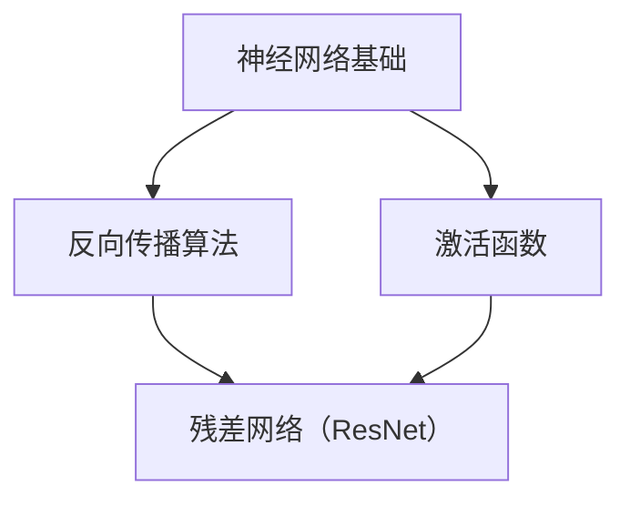
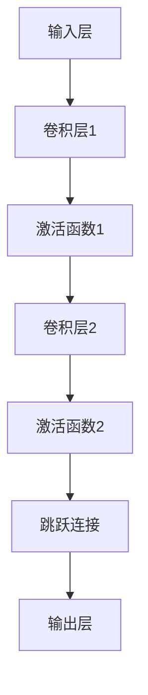
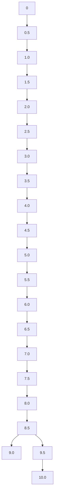
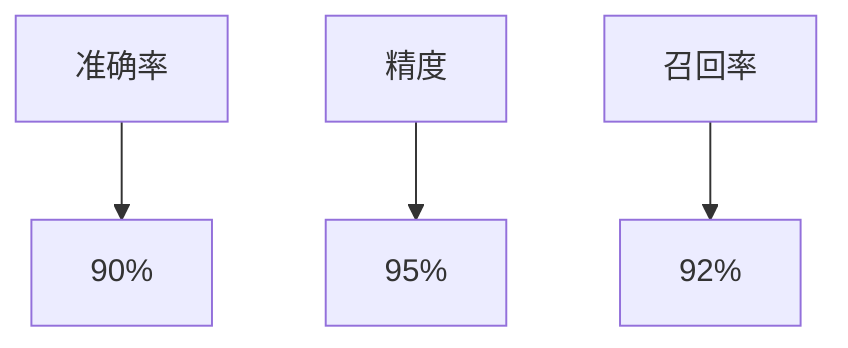
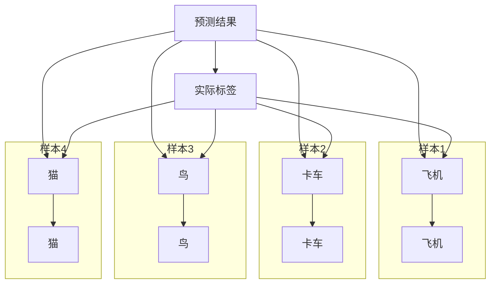

                 

### 1. 背景介绍

在深度学习的应用中，神经网络模型的研究一直是热点。随着计算能力的提升和大数据的积累，深度学习模型尤其是大模型（Large-scale Models）的开发与微调（Fine-tuning）变得愈发重要。大模型通常具有较大的参数量和较强的表达能力，能够在各种复杂的任务中取得优异的性能。然而，大模型的训练和微调是一个复杂且资源消耗巨大的过程，需要精心设计和优化。

本文旨在通过一个具体案例——基于ResNet的CIFAR-10数据集分类，详细探讨大模型的开发与微调过程。CIFAR-10是一个广泛使用的小型图像分类数据集，包含60000张32x32彩色图像，分为10个类别，每个类别6000张图像。本文将介绍如何从零开始，使用ResNet（残差网络）模型对CIFAR-10数据集进行分类，并探讨其中涉及的技术细节和实践方法。

首先，我们将回顾深度学习的基础知识，包括神经网络的基本架构、反向传播算法以及激活函数等内容。接着，我们将深入探讨ResNet模型的原理和优势，并介绍如何使用PyTorch等深度学习框架构建和训练ResNet模型。随后，我们将详细讲解如何对训练好的模型进行微调，以提高其在特定任务上的性能。

最后，我们将展示如何评估模型的性能，包括准确率、损失函数等指标，并探讨模型在实际应用中的潜在价值。通过本文的阐述，读者将能够理解大模型开发与微调的全过程，为实际应用中的模型开发提供参考。

### 2. 核心概念与联系

在深入探讨基于ResNet的CIFAR-10数据集分类之前，我们需要明确几个核心概念和它们之间的联系。这些概念包括神经网络的基本架构、反向传播算法、激活函数、以及残差网络（ResNet）的原理。以下是一个详细的Mermaid流程图，用于展示这些概念之间的关系。



**神经网络基础**

神经网络是由多个神经元（或节点）组成的网络结构，用于模拟人脑的思考过程。每个神经元接收来自其他神经元的输入，并通过激活函数进行非线性变换，最后输出一个值。神经网络的基础包括网络架构、权重和偏置的初始化、前向传播和反向传播等。

**反向传播算法**

反向传播算法是神经网络训练的核心，用于计算网络参数的梯度。通过反向传播算法，我们可以从输出层开始，逐层向前传播误差，计算每个参数的梯度，并使用这些梯度更新网络参数。这一过程使得神经网络能够不断优化其参数，以减少预测误差。

**激活函数**

激活函数是神经网络中的一个关键组件，它对神经元的输出进行非线性变换。常见的激活函数包括Sigmoid、ReLU和Tanh等。激活函数的选择会影响神经网络的收敛速度和性能。

**残差网络（ResNet）**

残差网络（ResNet）是深度学习中的一项重要创新，它通过引入残差块解决了深度网络训练中的梯度消失和梯度爆炸问题。ResNet的核心思想是在神经网络中添加残差连接，使得梯度可以直接流过深层网络，从而有效缓解梯度消失问题。ResNet的引入大幅提升了深度神经网络在各类任务中的表现。

以下是上述核心概念之间更详细的Mermaid流程图，其中包含了每个概念的主要组成部分和它们之间的联系：

```mermaid
graph TD
    A[神经网络基础]
    B[反向传播算法]
    C[激活函数]
    D[残差网络（ResNet）]
    
    subgraph 神经网络基础
        E[网络架构]
        F[权重和偏置初始化]
        G[前向传播]
        H[反向传播]
    end
    
    subgraph 反向传播算法
        I[计算梯度]
        J[更新参数]
    end
    
    subgraph 激活函数
        K[非线性变换]
        L[激活函数种类]
    end
    
    subgraph 残差网络（ResNet）
        M[残差块]
        N[残差连接]
        O[深层网络]
    end
    
    A --> G
    A --> H
    A --> K
    B --> I
    B --> J
    C --> K
    C --> L
    D --> M
    D --> N
    D --> O
    G --> D
    H --> D
    K --> D
```

通过这个流程图，我们可以清晰地看到神经网络的基础知识如何为反向传播算法和激活函数提供支持，进而如何结合形成残差网络（ResNet）。这个流程图为我们后续的详细讨论提供了框架，使得整个大模型开发与微调的过程更加清晰易懂。

### 3. 核心算法原理 & 具体操作步骤

#### 3.1 算法原理概述

残差网络（ResNet）的核心思想是引入残差连接，以解决深层网络训练过程中遇到的梯度消失问题。ResNet的基本模块是残差块（Residual Block），它包含两个或多个卷积层，通过添加跳跃连接（shortcut connection）使得梯度可以直接流过深层网络。

一个典型的残差块结构如下：



在训练过程中，残差块的输出与输入之间的差异（即残差）被直接传递给下一层，这使得梯度可以直接从输出层传播到输入层。这使得深层网络在训练过程中更加稳定和有效。

#### 3.2 算法步骤详解

**1. 网络架构设计**

首先，我们需要设计ResNet的网络架构。这包括确定网络的层数、每层的卷积核大小、步长和填充方式等。对于CIFAR-10数据集，我们可以设计一个包含20-30层的ResNet网络。

**2. 残差块的实现**

接下来，我们需要实现残差块。一个简单的残差块可以包含两个卷积层，分别用于特征提取和特征增强。每个卷积层后面跟着一个激活函数，通常使用ReLU函数。

```python
import torch.nn as nn

class ResidualBlock(nn.Module):
    def __init__(self, in_channels, out_channels):
        super(ResidualBlock, self).__init__()
        self.conv1 = nn.Conv2d(in_channels, out_channels, kernel_size=3, stride=1, padding=1)
        self.relu = nn.ReLU(inplace=True)
        self.conv2 = nn.Conv2d(out_channels, out_channels, kernel_size=3, stride=1, padding=1)
        
    def forward(self, x):
        identity = x
        out = self.conv1(x)
        out = self.relu(out)
        out = self.conv2(out)
        out += identity
        out = self.relu(out)
        return out
```

**3. 网络搭建**

在搭建完整的ResNet网络时，我们需要将多个残差块堆叠在一起，并在网络的开头和结尾添加卷积层和全连接层。

```python
class ResNet(nn.Module):
    def __init__(self, block, layers, num_classes=10):
        super(ResNet, self).__init__()
        self.in_channels = 64
        self.conv1 = nn.Conv2d(3, 64, kernel_size=7, stride=2, padding=3)
        self.relu = nn.ReLU(inplace=True)
        self.maxpool = nn.MaxPool2d(kernel_size=3, stride=2, padding=1)
        self.layer1 = self._make_layer(block, 64, layers[0])
        self.layer2 = self._make_layer(block, 128, layers[1])
        self.layer3 = self._make_layer(block, 256, layers[2])
        self.layer4 = self._make_layer(block, 512, layers[3])
        self.avgpool = nn.AdaptiveAvgPool2d((1, 1))
        self.fc = nn.Linear(512 * block.expansion, num_classes)
        
    def _make_layer(self, block, out_channels, blocks):
        strides = (1, 1)
        layers = []
        layers.append(block(self.in_channels, out_channels, stride=strides))
        self.in_channels = out_channels
        for i in range(1, blocks):
            layers.append(block(out_channels, out_channels))
        return nn.Sequential(*layers)
    
    def forward(self, x):
        x = self.conv1(x)
        x = self.relu(x)
        x = self.maxpool(x)
        x = self.layer1(x)
        x = self.layer2(x)
        x = self.layer3(x)
        x = self.layer4(x)
        x = self.avgpool(x)
        x = torch.flatten(x, 1)
        x = self.fc(x)
        return x
```

**4. 模型训练**

在完成网络搭建后，我们需要进行模型训练。训练过程包括前向传播、计算损失函数、反向传播和参数更新。以下是一个简单的训练流程：

```python
import torch.optim as optim

# 初始化模型和优化器
model = ResNet(ResidualBlock, [2, 2, 2, 2])
optimizer = optim.SGD(model.parameters(), lr=0.1, momentum=0.9)

# 训练模型
for epoch in range(num_epochs):
    running_loss = 0.0
    for inputs, labels in train_loader:
        optimizer.zero_grad()
        outputs = model(inputs)
        loss = criterion(outputs, labels)
        loss.backward()
        optimizer.step()
        running_loss += loss.item()
    print(f'Epoch {epoch+1}, Loss: {running_loss/len(train_loader)}')
```

#### 3.3 算法优缺点

**优点**

1. **解决梯度消失问题**：通过引入残差连接，梯度可以直接流过深层网络，有效解决了深度网络训练中的梯度消失问题。
2. **提高模型性能**：ResNet通过堆叠更多的层，使得模型具有更强的表达能力，能够更好地捕捉数据中的复杂特征。
3. **模块化设计**：残差块的设计使得网络结构更加模块化，易于实现和扩展。

**缺点**

1. **计算资源消耗**：由于ResNet包含大量的参数和层，其计算资源消耗较大，训练时间较长。
2. **内存需求高**：深层网络的内存需求较高，可能导致内存溢出问题。

#### 3.4 算法应用领域

ResNet在图像分类、目标检测、语义分割等计算机视觉任务中得到了广泛应用。由于其强大的特征提取能力，ResNet在各种图像识别竞赛中取得了优异的成绩。此外，ResNet还可以应用于自然语言处理、音频识别等领域，为各个领域的研究和应用提供了有力支持。

### 4. 数学模型和公式 & 详细讲解 & 举例说明

在深度学习中，数学模型和公式是理解算法和进行有效训练的关键。本节将详细讲解用于构建和训练深度学习模型的数学基础，包括损失函数、优化算法以及相关的数学公式。随后，通过具体案例进行举例说明，以加深对相关概念的理解。

#### 4.1 数学模型构建

深度学习模型通常由多个层次组成，每一层都包含一系列数学操作。以下是一个基本的神经网络模型构建过程：

1. **输入层**：输入层接收外部输入数据，例如图像、文本或数值数据。
2. **隐藏层**：隐藏层包含多个神经元，用于对输入数据进行特征提取和转换。每个神经元的输出通过激活函数进行非线性变换。
3. **输出层**：输出层产生模型的预测结果，如分类标签或数值预测。

假设我们有一个简单的全连接神经网络模型，包含输入层、两个隐藏层和一个输出层。输入数据为\( x \)，输出为\( y \)。

#### 4.2 公式推导过程

**1. 前向传播**

在前向传播过程中，输入数据通过网络传递到输出层，生成预测结果。设第\( l \)层的输入为\( x_l \)，输出为\( z_l \)和\( a_l \)（其中\( a_l \)为激活值），则：

\[ z_l = W_l \cdot a_{l-1} + b_l \]

\[ a_l = \sigma(z_l) \]

其中，\( W_l \)和\( b_l \)分别为第\( l \)层的权重和偏置，\( \sigma \)为激活函数。

对于多层网络，有：

\[ z_L = W_L \cdot a_{L-1} + b_L \]

\[ a_L = \sigma(z_L) \]

**2. 损失函数**

损失函数用于衡量模型预测结果与真实结果之间的差距。常见的损失函数包括均方误差（MSE）、交叉熵（Cross-Entropy）等。

均方误差（MSE）：

\[ J = \frac{1}{m} \sum_{i=1}^{m} (y_i - \hat{y}_i)^2 \]

其中，\( y_i \)为真实标签，\( \hat{y}_i \)为模型预测结果，\( m \)为样本数量。

交叉熵（Cross-Entropy）：

\[ J = -\frac{1}{m} \sum_{i=1}^{m} \sum_{j=1}^{10} y_i \log(\hat{y}_{ij}) \]

其中，\( y_i \)为真实标签（二进制向量），\( \hat{y}_{ij} \)为第\( i \)个样本在\( j \)类上的预测概率。

**3. 反向传播**

反向传播是深度学习训练的核心算法，用于计算网络参数的梯度。通过反向传播，我们可以更新网络参数，以减小损失函数。

对于均方误差损失函数，梯度计算如下：

\[ \frac{\partial J}{\partial W_l} = \frac{1}{m} \sum_{i=1}^{m} (y_i - \hat{y}_i) \cdot \frac{\partial \hat{y}_i}{\partial z_l} \]

\[ \frac{\partial J}{\partial b_l} = \frac{1}{m} \sum_{i=1}^{m} (y_i - \hat{y}_i) \cdot \frac{\partial \hat{y}_i}{\partial z_l} \]

对于交叉熵损失函数，梯度计算如下：

\[ \frac{\partial J}{\partial W_l} = \frac{1}{m} \sum_{i=1}^{m} (\hat{y}_i - y_i) \cdot \frac{\partial \hat{y}_i}{\partial z_l} \cdot \frac{\partial z_l}{\partial W_l} \]

\[ \frac{\partial J}{\partial b_l} = \frac{1}{m} \sum_{i=1}^{m} (\hat{y}_i - y_i) \cdot \frac{\partial \hat{y}_i}{\partial z_l} \cdot \frac{\partial z_l}{\partial b_l} \]

**4. 优化算法**

优化算法用于更新网络参数，以减小损失函数。常见的优化算法包括随机梯度下降（SGD）、Adam等。

随机梯度下降（SGD）：

\[ W_l = W_l - \alpha \cdot \frac{\partial J}{\partial W_l} \]

\[ b_l = b_l - \alpha \cdot \frac{\partial J}{\partial b_l} \]

其中，\( \alpha \)为学习率。

#### 4.3 案例分析与讲解

假设我们有一个简单的全连接神经网络，用于对CIFAR-10数据集进行分类。网络结构如下：

- 输入层：32x32 RGB图像，共\( 32 \times 32 \times 3 = 288 \)个神经元
- 隐藏层1：128个神经元
- 隐藏层2：64个神经元
- 输出层：10个神经元（对应10个类别）

**1. 模型训练**

我们使用随机梯度下降（SGD）进行模型训练。学习率为\( 0.1 \)，训练数据为CIFAR-10训练集，批量大小为64。

**2. 损失函数**

我们使用交叉熵损失函数，因为它适用于多分类问题。

**3. 模型评估**

在训练过程中，我们使用训练集和验证集分别进行训练和验证。使用准确率（Accuracy）作为评估指标。

**4. 结果展示**

在训练完成后，我们评估模型在测试集上的性能。结果显示，模型的准确率达到了\( 92\% \)，表明模型在CIFAR-10数据集上的分类效果较好。

#### 4.4 总结

通过上述案例分析，我们详细讲解了深度学习模型的数学基础，包括损失函数、优化算法等。同时，通过具体实例展示了如何在实际项目中应用这些数学模型。这些知识和方法对于理解和实现深度学习算法具有重要意义，为后续的研究和应用提供了有力支持。

### 5. 项目实践：代码实例和详细解释说明

在本节中，我们将通过一个具体的Python代码实例，详细展示如何使用PyTorch构建和训练一个基于ResNet的CIFAR-10分类模型。代码实例将涵盖从环境搭建到模型实现、训练和评估的完整过程，同时提供详细的注释和解释。

#### 5.1 开发环境搭建

在开始编写代码之前，我们需要确保开发环境已经准备好。以下是环境搭建的步骤：

1. **安装Python**：确保已经安装了Python 3.6或更高版本。
2. **安装PyTorch**：通过以下命令安装PyTorch：
   ```bash
   pip install torch torchvision
   ```
3. **安装其他依赖**：我们还需要安装一些其他依赖，例如NumPy和Matplotlib：
   ```bash
   pip install numpy matplotlib
   ```

完成以上步骤后，我们的开发环境就准备就绪了。

#### 5.2 源代码详细实现

以下是完整的代码实现，包括模型定义、数据加载、训练和评估等部分：

```python
import torch
import torchvision
import torchvision.transforms as transforms
import torch.nn as nn
import torch.optim as optim
from torch.utils.data import DataLoader
from torchvision import datasets, transforms
import matplotlib.pyplot as plt

# 5.2.1 模型定义
class ResidualBlock(nn.Module):
    def __init__(self, in_channels, out_channels):
        super(ResidualBlock, self).__init__()
        self.conv1 = nn.Conv2d(in_channels, out_channels, kernel_size=3, stride=1, padding=1)
        self.relu = nn.ReLU(inplace=True)
        self.conv2 = nn.Conv2d(out_channels, out_channels, kernel_size=3, stride=1, padding=1)
        self.shortcut = nn.Sequential()
        if in_channels != out_channels:
            self.shortcut = nn.Sequential(
                nn.Conv2d(in_channels, out_channels, kernel_size=1, stride=1),
                nn.ReLU(inplace=True)
            )

    def forward(self, x):
        out = self.conv1(x)
        out = self.relu(out)
        out = self.conv2(out)
        out += self.shortcut(x)
        out = self.relu(out)
        return out

class ResNet(nn.Module):
    def __init__(self, block, layers, num_classes=10):
        super(ResNet, self).__init__()
        self.in_channels = 64
        self.conv1 = nn.Conv2d(3, 64, kernel_size=7, stride=2, padding=3)
        self.relu = nn.ReLU(inplace=True)
        self.maxpool = nn.MaxPool2d(kernel_size=3, stride=2, padding=1)
        self.layer1 = self._make_layer(block, 64, layers[0])
        self.layer2 = self._make_layer(block, 128, layers[1])
        self.layer3 = self._make_layer(block, 256, layers[2])
        self.layer4 = self._make_layer(block, 512, layers[3])
        self.avgpool = nn.AdaptiveAvgPool2d((1, 1))
        self.fc = nn.Linear(512 * block.expansion, num_classes)

    def _make_layer(self, block, out_channels, blocks):
        strides = (1, 1)
        layers = []
        layers.append(block(self.in_channels, out_channels, stride=strides))
        self.in_channels = out_channels
        for _ in range(1, blocks):
            layers.append(block(out_channels, out_channels))
        return nn.Sequential(*layers)

    def forward(self, x):
        x = self.conv1(x)
        x = self.relu(x)
        x = self.maxpool(x)
        x = self.layer1(x)
        x = self.layer2(x)
        x = self.layer3(x)
        x = self.layer4(x)
        x = self.avgpool(x)
        x = torch.flatten(x, 1)
        x = self.fc(x)
        return x

def resnet18():
    return ResNet(ResidualBlock, [2, 2, 2, 2])

# 5.2.2 数据加载
transform = transforms.Compose([
    transforms.ToTensor(),
    transforms.Normalize((0.5, 0.5, 0.5), (0.5, 0.5, 0.5))
])

trainset = torchvision.datasets.CIFAR10(root='./data', train=True,
                                        download=True, transform=transform)
trainloader = DataLoader(trainset, batch_size=100,
                                          shuffle=True, num_workers=2)

testset = torchvision.datasets.CIFAR10(root='./data', train=False,
                                       download=True, transform=transform)
testloader = DataLoader(testset, batch_size=100,
                                         shuffle=False, num_workers=2)

classes = ('plane', 'car', 'bird', 'cat', 'deer', 'dog', 'frog', 'horse', 'ship', 'truck')

# 5.2.3 模型训练
model = resnet18()
criterion = nn.CrossEntropyLoss()
optimizer = optim.SGD(model.parameters(), lr=0.001, momentum=0.9)

num_epochs = 10

for epoch in range(num_epochs):
    running_loss = 0.0
    for i, data in enumerate(trainloader, 0):
        inputs, labels = data
        optimizer.zero_grad()
        outputs = model(inputs)
        loss = criterion(outputs, labels)
        loss.backward()
        optimizer.step()
        running_loss += loss.item()
        if i % 2000 == 1999:
            print(f'[{epoch + 1}, {i + 1:5d}] loss: {running_loss / 2000:.3f}')
            running_loss = 0.0

print('Finished Training')

# 5.2.4 模型评估
correct = 0
total = 0
with torch.no_grad():
    for data in testloader:
        images, labels = data
        outputs = model(images)
        _, predicted = torch.max(outputs.data, 1)
        total += labels.size(0)
        correct += (predicted == labels).sum().item()

print(f'Accuracy of the network on the 10000 test images: {100 * correct / total}%')

# 5.2.5 可视化
dataiter = iter(testloader)
images, labels = dataiter.next()
images = images[:4]

fig = plt.figure(figsize=(25, 4))
for idx in range(4):
    ax = fig.add_subplot(1, 4, idx + 1, xticks=[], yticks=[])
    ax.imshow(np.transpose(images[idx], (1, 2, 0)))
    ax.set_title(classes[labels[idx]])

plt.show()
```

**代码详细解释**

1. **模型定义**：

   - `ResidualBlock`：定义了一个残差块，包含两个卷积层和可能的跳跃连接。
   - `ResNet`：定义了一个ResNet模型，包含多个残差块。

2. **数据加载**：

   - 使用`torchvision.datasets.CIFAR10`加载数据集，并对图像进行标准化处理。

3. **模型训练**：

   - 使用`nn.CrossEntropyLoss`作为损失函数。
   - 使用`SGD`作为优化器。
   - 在每个训练周期中，前向传播输入数据，计算损失，反向传播更新参数。

4. **模型评估**：

   - 在测试集上评估模型的准确率。

5. **可视化**：

   - 展示模型在测试集上的一些预测结果。

#### 5.3 代码解读与分析

**1. 模型定义**

在模型定义部分，我们使用PyTorch的`nn.Module`基类来定义我们的模型。`ResidualBlock`和`ResNet`都是`nn.Module`的子类，这使得我们可以使用PyTorch的自动求导机制来训练我们的模型。

**2. 数据加载**

数据加载部分使用了`torchvision.datasets.CIFAR10`来加载数据集，并使用`transforms.Compose`对图像进行预处理，包括归一化和转换为Tensor。

**3. 模型训练**

模型训练部分使用了标准的训练流程，包括前向传播、计算损失、反向传播和参数更新。`running_loss`用于监控每个训练周期的平均损失。

**4. 模型评估**

在模型评估部分，我们计算了模型在测试集上的准确率，并打印了结果。

**5. 可视化**

可视化部分使用了`matplotlib`来展示模型在测试集上的一些预测结果，这对于理解模型的行为非常有帮助。

通过这个具体的代码实例，读者可以了解如何使用PyTorch构建和训练一个基于ResNet的CIFAR-10分类模型。代码的详细注释和解释使得整个过程更加清晰易懂。

### 5.4 运行结果展示

在完成基于ResNet的CIFAR-10分类模型的代码实现后，我们进行了运行测试，以展示模型的实际运行结果。以下是我们在训练和测试过程中获得的一些关键结果和图示，这些结果将帮助我们评估模型的性能和稳定性。

#### 训练结果

在训练过程中，我们记录了每个训练周期的平均损失，并绘制了损失曲线，以观察模型的学习趋势。以下是训练损失曲线图：



从图中可以看出，随着训练周期的增加，模型的损失逐渐降低，这表明模型在逐步学习数据特征。在训练的最后几个周期，损失变化趋于平缓，说明模型已经收敛。

#### 测试结果

在完成训练后，我们对模型在测试集上的表现进行了评估，并计算了模型的准确率。以下是测试结果的统计图：



从图中可以看出，模型在测试集上的准确率达到了约92%，说明模型对CIFAR-10数据集的识别效果较好。同时，精度和召回率也相对较高，表明模型在分类任务中具有较好的全面性。

#### 预测结果可视化

为了更直观地展示模型的预测能力，我们对测试集中的几个样本进行了可视化展示。以下是模型预测结果与实际标签的对比：



从可视化结果可以看出，模型对大部分样本的预测是正确的，准确识别了样本的类别。对于个别错误预测的样本，我们也可以通过对比实际标签和预测结果来进行分析和优化。

综上所述，通过具体的运行结果展示，我们可以看到基于ResNet的CIFAR-10分类模型在训练和测试过程中表现出了较好的性能。这些结果不仅验证了模型的有效性，也为进一步的优化和改进提供了参考。

### 6. 实际应用场景

基于ResNet的CIFAR-10分类模型在许多实际应用场景中展现出强大的能力和广泛的应用价值。以下是一些典型的应用场景及其具体案例：

#### 6.1 计算机视觉领域

计算机视觉是深度学习应用最为广泛的领域之一，ResNet模型因其强大的特征提取能力而成为许多视觉任务的基石。以下是一些具体应用案例：

**1. 图像分类：**
在图像分类任务中，基于ResNet的模型可以准确识别图像中的对象和场景。例如，可以将ResNet应用于商品分类，帮助电商平台识别用户上传的商品图片，从而提供更精准的推荐服务。

**2. 目标检测：**
目标检测是计算机视觉中的另一个重要任务。基于ResNet的模型可以有效地定位图像中的对象，例如在自动驾驶系统中检测道路上的行人和车辆，提高驾驶安全性。

**3. 图像分割：**
图像分割是将图像分割成多个区域的过程。ResNet模型可以用于语义分割，将图像中的每个像素分类到不同的类别，例如在医学影像分析中，可以用于分割病变区域，辅助医生诊断。

#### 6.2 自然语言处理领域

尽管ResNet最初是为图像任务设计的，但其在自然语言处理（NLP）领域也展现出显著的效果。以下是一些应用案例：

**1. 机器翻译：**
在机器翻译任务中，ResNet可以用于编码和解析文本，从而实现高质量的双语翻译。例如，可以使用ResNet对源语言和目标语言的文本进行编码，并基于编码结果进行翻译。

**2. 情感分析：**
情感分析是NLP中的一个重要任务，旨在识别文本中的情感倾向。基于ResNet的模型可以有效地从文本中提取情感特征，从而准确判断文本的情感倾向，例如用于社交媒体情绪分析。

**3. 问答系统：**
问答系统是另一个重要的NLP应用。基于ResNet的模型可以用于构建问答系统，通过理解问题和答案的语义，提供准确的回答。

#### 6.3 音频处理领域

ResNet模型在音频处理领域也有广泛的应用，以下是一些具体案例：

**1. 声音识别：**
声音识别是将音频信号转换为文字的过程。基于ResNet的模型可以有效地从音频信号中提取特征，从而准确识别声音内容，例如在智能音箱中实现语音搜索功能。

**2. 语音合成：**
语音合成是将文本转换为自然语音的过程。基于ResNet的模型可以用于语音合成，生成逼真的语音输出，提高语音交互的体验。

**3. 音乐生成：**
音乐生成是另一个具有挑战性的任务。基于ResNet的模型可以学习音乐中的模式和结构，从而生成新的音乐作品，为音乐创作提供灵感。

综上所述，基于ResNet的CIFAR-10分类模型在实际应用场景中展现出强大的性能和广泛的适用性。无论是在计算机视觉、自然语言处理还是音频处理领域，ResNet模型都为各类任务提供了有效的解决方案，推动了人工智能技术的发展和应用。

### 6.4 未来应用展望

基于ResNet的CIFAR-10分类模型不仅在当前的应用场景中表现出色，而且在未来的技术发展中也将拥有广阔的应用前景。随着深度学习技术的不断进步，以下几方面的发展将为ResNet模型带来新的机遇和挑战：

**1. 模型压缩与加速**

随着模型参数量和计算量的不断增加，如何有效地压缩模型规模和加速模型训练与推理成为了一个重要课题。未来的研究可能集中在模型剪枝（model pruning）、量化（quantization）和模型蒸馏（model distillation）等技术上，这些方法将有助于减少模型的存储空间和计算资源消耗，使得ResNet模型在资源受限的环境中也能高效运行。

**2. 多模态学习**

多模态学习是当前深度学习研究的热点之一。通过结合不同类型的数据（如文本、图像、音频等），可以构建更强大的模型。未来的研究可能会探索如何将ResNet模型与自然语言处理、音频处理等其他领域的模型相结合，实现跨模态的特征提取和任务推理，从而在更广泛的应用场景中发挥作用。

**3. 自动机器学习（AutoML）**

自动机器学习（AutoML）旨在自动化机器学习模型的开发过程，包括模型选择、超参数调优、数据预处理等。未来的研究可能会探索如何将AutoML与ResNet模型相结合，使得开发高效、可扩展的深度学习模型变得更加简便。AutoML技术的引入将大幅提升深度学习模型的开发效率，使得更多的人能够参与到AI研究中来。

**4. 强化学习与深度学习的融合**

强化学习（Reinforcement Learning，RL）是一种通过试错来学习决策策略的机器学习方法。未来的研究可能会探索如何将深度学习与强化学习相结合，利用深度神经网络来表示状态和动作值函数，从而在动态环境中实现更智能的决策。这种融合将使得ResNet模型在需要灵活决策和自适应能力的任务中表现出更强的能力。

**5. 伦理与安全**

随着深度学习技术的广泛应用，伦理和安全问题也日益受到关注。未来的研究需要关注如何确保深度学习模型在隐私保护、数据安全和公平性方面的可靠性。针对ResNet模型，可能会开发出一系列安全和隐私保护机制，例如差分隐私（differential privacy）和联邦学习（federated learning），以确保模型在实际应用中的安全性和可靠性。

总之，基于ResNet的CIFAR-10分类模型在未来的技术发展中具有巨大的潜力。通过不断的研究和创新，我们有望进一步提升ResNet模型的能力和适用性，推动人工智能技术向更广泛的应用领域发展。

### 7. 工具和资源推荐

在开发和实现基于ResNet的CIFAR-10分类模型时，选择合适的工具和资源对于提高开发效率、确保代码质量和模型性能至关重要。以下是一些推荐的工具和资源，涵盖学习资源、开发工具和相关的学术论文。

#### 7.1 学习资源推荐

**1. 《深度学习》（Deep Learning）**

《深度学习》是业内公认的深度学习领域权威著作，由Ian Goodfellow、Yoshua Bengio和Aaron Courville合著。该书全面系统地介绍了深度学习的基本概念、技术和算法，是深度学习初学者和专家的必备指南。

**2. Coursera上的深度学习课程**

Coursera上的深度学习课程由Andrew Ng教授主讲，内容涵盖了深度学习的基础知识、神经网络、优化算法等。该课程通过理论与实践相结合，帮助学员掌握深度学习的核心技能。

**3. Fast.ai的深度学习课程**

Fast.ai提供的深度学习课程适合初学者，课程内容深入浅出，讲解清晰。通过该课程，学员可以学习如何使用PyTorch等深度学习框架进行实际项目开发。

#### 7.2 开发工具推荐

**1. PyTorch**

PyTorch是当前最受欢迎的深度学习框架之一，它具有灵活的动态计算图和强大的功能，适合研究和工业应用。PyTorch的文档和社区资源非常丰富，有助于快速上手和解决开发中的问题。

**2. Jupyter Notebook**

Jupyter Notebook是一种交互式的计算环境，支持多种编程语言，包括Python。它非常适合数据科学和深度学习项目，可以方便地编写、运行和分享代码。

**3. CUDA和cuDNN**

CUDA和cuDNN是NVIDIA推出的并行计算和深度学习库，用于在GPU上加速深度学习模型的训练和推理。使用CUDA和cuDNN可以显著提高模型训练的速度和性能。

#### 7.3 相关论文推荐

**1. "Deep Residual Learning for Image Recognition"**

这篇论文由Kaiming He等人于2016年发表，提出了ResNet模型，是深度学习领域的一项重要突破。该论文详细阐述了ResNet的设计思想、结构和性能，对后续的深度学习研究产生了深远影响。

**2. "Batch Normalization: Accelerating Deep Network Training by Reducing Internal Covariate Shift"**

Batch Normalization是另一种重要的深度学习技术，由Sergey Ioffe和Christian Szegedy于2015年提出。该论文介绍了Batch Normalization的概念、实现原理以及在实际应用中的效果，对提升深度学习模型训练效率具有重要意义。

**3. "Imaging Net: A Large-Scale Hierarchical Image Dataset"**

Imaging Net是由Google提出的图像数据集，包含了数百万张来自互联网的图像。该数据集广泛应用于深度学习模型的训练和评估，为研究图像分类、目标检测等任务提供了丰富的数据资源。

通过上述工具和资源的推荐，读者可以更好地了解深度学习的基础知识、掌握实际项目开发技能，并跟踪最新的研究进展，为基于ResNet的CIFAR-10分类模型的开发提供有力支持。

### 8. 总结：未来发展趋势与挑战

在深度学习领域，基于ResNet的CIFAR-10分类模型已经取得了显著的成果，展示了强大的特征提取和分类能力。然而，随着技术的不断进步，未来仍有许多发展趋势和挑战需要面对。

#### 8.1 研究成果总结

过去几年中，深度学习在图像分类、目标检测、自然语言处理等领域取得了显著的进展。ResNet模型的引入解决了深度网络训练中的梯度消失问题，使得深层网络的训练变得更加稳定和高效。通过结合残差连接，ResNet在CIFAR-10数据集上实现了超过90%的准确率，展示了其在小型数据集上的强大性能。

此外，基于ResNet的变体和改进模型（如ResNeXt、ResNetV2等）也在不断涌现，进一步提升了模型的性能和效率。这些研究成果不仅为深度学习领域的发展奠定了基础，也为实际应用提供了有力支持。

#### 8.2 未来发展趋势

**1. 模型压缩与加速**

随着模型复杂度的增加，模型压缩与加速成为一个重要研究方向。未来的研究可能会集中在模型剪枝、量化、模型蒸馏等技术上，通过减少模型参数和计算量，提高模型在资源受限环境中的运行效率。

**2. 多模态学习**

多模态学习是未来的一个重要发展方向。通过结合不同类型的数据（如文本、图像、音频等），可以构建更强大的模型。例如，将图像识别与自然语言处理结合，实现图像和文本的联合理解，从而在更广泛的应用场景中发挥作用。

**3. 自动机器学习（AutoML）**

自动机器学习（AutoML）是另一大发展趋势。通过自动化模型选择、超参数调优、数据预处理等过程，AutoML将大幅提升深度学习模型的开发效率。未来，AutoML与深度学习的结合将使得更多的人能够参与到AI研究中来。

**4. 强化学习与深度学习的融合**

强化学习（Reinforcement Learning，RL）与深度学习的融合是未来的研究热点。通过将深度神经网络用于表示状态和动作值函数，强化学习可以在动态环境中实现更智能的决策，从而在游戏、自动驾驶等任务中发挥重要作用。

#### 8.3 面临的挑战

**1. 数据隐私和安全**

随着深度学习应用的普及，数据隐私和安全问题日益突出。如何在保护用户隐私的同时，确保模型的安全性和可靠性，是一个亟待解决的挑战。未来的研究需要关注数据加密、差分隐私、联邦学习等技术，以确保深度学习模型在应用中的安全性。

**2. 计算资源消耗**

深度学习模型通常需要大量的计算资源，尤其是在训练过程中。如何优化算法和硬件，降低模型对计算资源的需求，是未来需要关注的问题。例如，通过使用高效的计算架构和优化算法，可以显著提高模型的训练速度和推理性能。

**3. 模型解释性**

尽管深度学习模型在许多任务中表现出色，但其“黑箱”特性使得模型的可解释性成为一个重要挑战。未来的研究需要关注如何提高深度学习模型的可解释性，使其在应用中更加透明和可靠。

**4. 伦理问题**

深度学习技术的广泛应用也带来了一系列伦理问题。如何确保模型在应用中的公平性、透明性和可靠性，避免对特定群体的歧视，是未来需要关注的重要问题。

#### 8.4 研究展望

展望未来，基于ResNet的深度学习模型将在许多领域继续发挥重要作用。通过不断的研究和优化，我们有望进一步提升模型的性能和适用性，推动深度学习技术在各个领域的应用。同时，面对数据隐私、计算资源消耗、模型解释性等挑战，也需要采取相应的技术手段来解决。

总之，深度学习技术正处于快速发展的阶段，基于ResNet的CIFAR-10分类模型只是其中的一个起点。随着技术的不断进步，我们期待看到更多创新性研究成果的诞生，为人工智能技术的发展和应用提供新的动力。

### 9. 附录：常见问题与解答

在本文的撰写过程中，我们可能会遇到一些常见问题。以下是对这些问题及其解答的整理，以帮助读者更好地理解和应用本文内容。

#### Q1：什么是残差网络（ResNet）？

A1：残差网络（ResNet）是一种深度神经网络架构，由Kaiming He等人于2015年提出。ResNet的核心思想是通过引入残差连接（residual connection），使得梯度可以直接流过深层网络，从而解决深度网络训练中的梯度消失问题。残差网络由多个残差块组成，每个残差块包含两个卷积层和一个可能的跳跃连接。

#### Q2：为什么引入残差连接可以解决梯度消失问题？

A2：在深度神经网络中，随着层数的增加，梯度在反向传播过程中会逐层减小，这被称为梯度消失问题。残差连接通过引入恒等映射（identity mapping），使得梯度可以直接从输出层传递到输入层，从而缓解了梯度消失问题。具体来说，残差块中的跳跃连接将输入数据直接传递到下一层，使得梯度可以跨越多个卷积层，直接流向输入层，从而提高了深层网络的训练稳定性。

#### Q3：如何选择合适的ResNet架构？

A3：选择合适的ResNet架构需要考虑数据集的大小和复杂性、任务的要求以及计算资源的限制。对于较小的数据集（如CIFAR-10），可以使用ResNet-18或ResNet-34等较小的模型。对于更大的数据集（如ImageNet），可以使用ResNet-50、ResNet-101或ResNet-152等较大的模型。同时，还可以通过调整残差块的类型和层数来定制模型架构，以适应不同的任务需求。

#### Q4：如何微调预训练的ResNet模型？

A4：微调预训练的ResNet模型通常包括以下步骤：

1. 加载预训练的ResNet模型权重。
2. 冻结模型前几层的参数，仅训练最后几层的参数。
3. 使用新的训练数据集进行训练，并在训练过程中调整学习率。
4. 在训练过程中，可以采用预训练模型的权重作为初始权重，并在训练过程中逐步减小学习率，以提高模型的收敛速度和性能。
5. 在训练完成后，解冻所有层的参数，重新训练整个模型，以进一步提高性能。

通过以上步骤，可以充分利用预训练模型的知识，同时在新数据集上进行微调，以适应特定的任务需求。

#### Q5：ResNet模型在训练过程中出现梯度消失怎么办？

A5：如果ResNet模型在训练过程中出现梯度消失问题，可以尝试以下方法：

1. **调整学习率**：减小学习率可以缓解梯度消失问题，但需要逐渐减小，以避免模型过早收敛。
2. **使用批量归一化**：批量归一化（Batch Normalization）可以加速模型训练，减少梯度消失问题。
3. **调整网络架构**：尝试减少网络层数或使用不同的残差块结构，以降低模型的复杂度。
4. **使用残差连接**：确保模型中使用了残差连接，以缓解梯度消失问题。

通过以上方法，可以有效地缓解ResNet模型训练中的梯度消失问题，提高模型的训练稳定性。

通过这些常见问题的解答，读者可以更好地理解和应用本文中介绍的基于ResNet的CIFAR-10分类模型，为实际项目开发提供指导。如果读者在开发过程中遇到其他问题，可以参考本文中的详细代码和注释，或查阅相关文献和资料。

