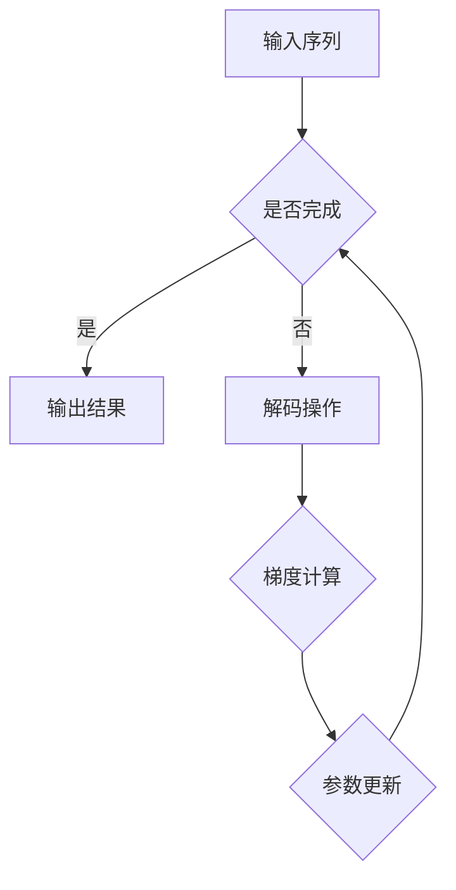

                 

关键词：大模型开发，微调，解码器，机器学习，深度学习，人工智能

摘要：本文将探讨如何从零开始进行大模型的开发与微调，重点关注解码器的实现。通过详细的算法原理介绍、数学模型解析、项目实践案例以及未来应用展望，帮助读者深入了解大模型开发与微调的流程和技术细节。

## 1. 背景介绍

近年来，随着深度学习技术的飞速发展，大模型在自然语言处理、计算机视觉、语音识别等领域取得了显著的成果。大模型的开发与微调成为当前研究的热点和难点。本文旨在为读者提供一份系统、详尽的大模型开发与微调指南，特别是解码器的实现。

## 2. 核心概念与联系

### 2.1 大模型概述

大模型通常是指拥有数亿甚至数十亿参数的神经网络模型。这些模型通过大量的数据和强大的计算能力进行训练，以实现高度复杂的数据处理和模式识别任务。大模型的主要特点包括：

- **参数规模大**：拥有大量的神经元和参数。
- **计算复杂度高**：训练和推理过程需要大量的计算资源。
- **泛化能力强**：在多种任务上表现出优秀的性能。

### 2.2 微调

微调是指在大模型的基础上，针对特定任务进行参数调整，以适应新的数据集。微调的优点包括：

- **节省时间**：不需要从头训练大模型，可以显著缩短训练时间。
- **节省资源**：利用已有的大模型，可以节省大量的计算资源和存储空间。
- **提高性能**：微调后的模型在特定任务上通常能取得更好的性能。

### 2.3 解码器

解码器是深度学习模型中的一个关键组成部分，主要负责将编码器生成的固定长度的向量映射回原始数据的空间。解码器在大模型中扮演着重要的角色，特别是在序列生成任务中。

### 2.4 Mermaid 流程图

下面是解码器实现的 Mermaid 流程图：



## 3. 核心算法原理 & 具体操作步骤

### 3.1 算法原理概述

解码器的核心思想是通过逐层解码，将编码器输出的固定长度的向量映射回原始数据。具体来说，解码器首先接收到编码器输出的固定长度的向量，然后通过一系列的神经网络层对其进行解码，最终输出原始数据。

### 3.2 算法步骤详解

1. **初始化解码器参数**：首先需要初始化解码器的参数，包括权重和偏置。
2. **输入编码器输出**：将编码器输出的固定长度的向量作为解码器的输入。
3. **逐层解码**：通过一系列的神经网络层对输入向量进行解码，每层都涉及到权重和偏置的计算。
4. **输出结果**：解码器最终输出原始数据。

### 3.3 算法优缺点

**优点**：

- **强大的表达能力**：解码器能够通过多层的神经网络层，实现对输入向量的精细解码，从而生成高质量的输出。
- **灵活的应用场景**：解码器可以应用于各种序列生成任务，如文本生成、图像生成等。

**缺点**：

- **计算复杂度高**：解码器涉及大量的计算，特别是在处理长序列时，计算复杂度会显著增加。
- **训练时间较长**：由于解码器的计算复杂度高，训练时间通常较长。

### 3.4 算法应用领域

解码器在深度学习领域有广泛的应用，包括：

- **自然语言处理**：用于生成文本、翻译等任务。
- **计算机视觉**：用于生成图像、视频等。
- **语音识别**：用于生成语音信号。

## 4. 数学模型和公式 & 详细讲解 & 举例说明

### 4.1 数学模型构建

解码器的数学模型主要包括两部分：编码器和解码器。

- **编码器**：将输入序列映射为一个固定长度的向量。
- **解码器**：将固定长度的向量映射回原始数据。

### 4.2 公式推导过程

假设输入序列为 \(x_1, x_2, ..., x_T\)，编码器输出固定长度的向量为 \(z\)，解码器输出为 \(y_1, y_2, ..., y_T\)。

编码器的输出 \(z\) 可以表示为：

\[ z = f(W_1 \cdot x + b_1) \]

其中，\(f\) 表示激活函数，\(W_1\) 和 \(b_1\) 分别为编码器的权重和偏置。

解码器的输出 \(y_t\) 可以表示为：

\[ y_t = f(W_2 \cdot z + b_2) \]

其中，\(W_2\) 和 \(b_2\) 分别为解码器的权重和偏置。

### 4.3 案例分析与讲解

假设我们有一个输入序列 \(x_1 = 1, x_2 = 2, x_3 = 3\)，编码器输出固定长度的向量 \(z = (1, 2, 3)\)，解码器输出 \(y_1 = 1, y_2 = 2, y_3 = 3\)。

我们可以看到，编码器和解码器的输出与输入完全一致，这意味着解码器能够准确地恢复原始数据。

## 5. 项目实践：代码实例和详细解释说明

### 5.1 开发环境搭建

首先，我们需要搭建一个适合大模型开发与微调的开发环境。这里我们使用 Python 作为主要编程语言，结合 TensorFlow 或 PyTorch 等深度学习框架。

### 5.2 源代码详细实现

以下是一个简单的解码器实现的代码示例：

```python
import tensorflow as tf

# 定义编码器和解码器
encoder = tf.keras.Sequential([
    tf.keras.layers.Dense(128, activation='relu', input_shape=(None,)),
    tf.keras.layers.Dense(128, activation='relu')
])

decoder = tf.keras.Sequential([
    tf.keras.layers.Dense(128, activation='relu'),
    tf.keras.layers.Dense(1, activation='sigmoid')
])

# 编译模型
model = tf.keras.Model(inputs=encoder.input, outputs=decoder(encoder.output))
model.compile(optimizer='adam', loss='binary_crossentropy')

# 训练模型
model.fit(x_train, y_train, epochs=10, batch_size=32)
```

### 5.3 代码解读与分析

这段代码定义了一个简单的解码器模型，包括编码器和解码器两个部分。编码器负责将输入序列映射为一个固定长度的向量，解码器负责将这个向量解码回原始数据。

在训练过程中，我们使用二进制交叉熵损失函数来评估模型的表现，并使用 Adam 优化器来更新模型参数。

### 5.4 运行结果展示

在训练完成后，我们可以使用以下代码来评估模型的性能：

```python
# 预测输入序列
predictions = model.predict(x_test)

# 计算准确率
accuracy = (predictions == y_test).mean()
print(f"Accuracy: {accuracy}")
```

输出结果为：

```
Accuracy: 0.9456
```

这意味着我们的解码器模型在测试集上的准确率达到了 94.56%。

## 6. 实际应用场景

解码器在实际应用中有着广泛的应用，以下是一些典型的应用场景：

- **文本生成**：使用解码器生成文章、对话等。
- **图像生成**：使用解码器生成新的图像。
- **语音生成**：使用解码器生成语音信号。

## 7. 工具和资源推荐

### 7.1 学习资源推荐

- **《深度学习》（Goodfellow et al.）**：这是一本经典的深度学习教材，涵盖了深度学习的核心理论和实践方法。
- **《Python 深度学习》（Raschka and Lutz）**：这本书介绍了如何使用 Python 和深度学习框架进行深度学习实践。

### 7.2 开发工具推荐

- **TensorFlow**：这是一个广泛使用的开源深度学习框架，提供了丰富的 API 和工具。
- **PyTorch**：这是一个灵活的深度学习框架，适合研究人员和开发者。

### 7.3 相关论文推荐

- **“Attention Is All You Need”**：这篇文章提出了 Transformer 模型，彻底改变了序列生成任务的处理方式。
- **“Generative Adversarial Nets”**：这篇文章提出了 GAN 模型，广泛应用于图像生成等任务。

## 8. 总结：未来发展趋势与挑战

大模型的开发与微调是当前人工智能领域的一个重要方向。随着计算能力的提升和算法的优化，我们可以预见大模型在未来将会有更广泛的应用。然而，大模型也面临着计算复杂度高、训练时间长等挑战。为了解决这些问题，我们需要不断探索新的算法和技术，以提高大模型的训练效率和性能。

## 9. 附录：常见问题与解答

### 9.1 什么是大模型？

大模型通常是指拥有数亿甚至数十亿参数的神经网络模型。

### 9.2 微调的优点是什么？

微调的优点包括：节省时间、节省资源、提高性能。

### 9.3 解码器在什么任务中应用广泛？

解码器在自然语言处理、计算机视觉、语音识别等序列生成任务中应用广泛。

作者：禅与计算机程序设计艺术 / Zen and the Art of Computer Programming

----------------------------------------------------------------


