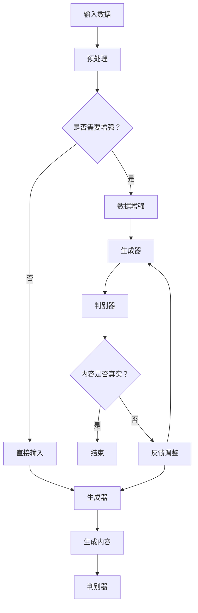

                 

关键词：AIGC、应用生态、人工智能、生成内容、架构设计、算法原理、数学模型、项目实践、未来展望

> 摘要：本文旨在探讨如何从零开始构建一个涵盖人工智能生成内容（AIGC）的完整应用生态。我们将深入剖析AIGC的核心概念、关键算法、数学模型以及其在实际项目中的应用，并结合具体的开发实践，展望AIGC技术未来的发展趋势与面临的挑战。

## 1. 背景介绍

随着人工智能技术的不断进步，尤其是生成对抗网络（GAN）等深度学习算法的广泛应用，人工智能生成内容（AIGC）已经成为一个备受关注的研究领域。AIGC技术可以用于生成图像、文本、音频等多种类型的内容，广泛应用于游戏、影视、广告、教育等多个行业。构建一个完整的AIGC应用生态，不仅需要深入理解AIGC的核心概念和算法原理，还需要考虑如何将这些技术集成到实际应用中，形成一套完整的解决方案。

本文将首先介绍AIGC的基本概念，然后详细讨论其核心算法和数学模型，接着通过具体的项目实践来展示如何构建AIGC应用，最后对AIGC的未来发展趋势和面临的挑战进行展望。

## 2. 核心概念与联系

### 2.1 AIGC的定义与特点

AIGC，即Artificial Intelligence Generated Content，是指通过人工智能技术自动生成的内容。与传统的手动创作内容相比，AIGC具有以下几个显著特点：

- **高效性**：AIGC可以在短时间内生成大量内容，大大提高了生产效率。
- **多样性**：通过深度学习算法，AIGC能够生成丰富多样、个性鲜明的内容。
- **创意性**：尽管是由机器生成，但AIGC往往能够呈现出超越人类创作者的创意和想象力。

### 2.2 AIGC的核心算法

AIGC的核心算法主要包括生成对抗网络（GAN）、变分自编码器（VAE）等。其中，GAN是最常用的算法之一，其基本原理是利用两个神经网络——生成器和判别器之间的对抗训练来生成逼真的内容。

- **生成器（Generator）**：生成器的目标是生成与真实数据相似的内容。通过不断调整生成器的参数，使其输出的内容逐渐接近真实数据。
- **判别器（Discriminator）**：判别器的目标是区分真实数据和生成数据。在训练过程中，判别器会不断尝试提高对生成数据的识别能力，从而逼迫生成器生成更加真实的内容。

### 2.3 AIGC架构

为了更好地理解AIGC的工作流程，我们可以使用Mermaid流程图来展示其架构：



通过上述流程，我们可以看到AIGC的基本架构：输入数据经过预处理后，进入生成器和判别器的训练过程。生成器负责生成内容，判别器则负责评估这些内容是否真实。通过不断调整生成器和判别器的参数，最终生成高质量的内容。

## 3. 核心算法原理 & 具体操作步骤

### 3.1 算法原理概述

AIGC的核心算法——生成对抗网络（GAN）的原理可以概括为：通过生成器和判别器的对抗训练，使生成器能够生成越来越真实的内容。

- **生成器**：生成器的主要任务是生成与真实数据相似的内容。在训练过程中，生成器会尝试优化其参数，以使其生成的数据更加接近真实数据。
- **判别器**：判别器的主要任务是区分真实数据和生成数据。在训练过程中，判别器会尝试提高对生成数据的识别能力，从而逼迫生成器生成更加真实的内容。

### 3.2 算法步骤详解

1. **初始化生成器和判别器**：首先，我们需要初始化生成器和判别器的参数。通常，生成器和判别器都是基于深度神经网络构建的。
2. **生成器生成内容**：生成器根据输入的随机噪声生成内容。这些内容可以是图像、文本、音频等。
3. **判别器评估内容**：判别器接收生成器和真实数据作为输入，并尝试区分它们。判别器通过比较生成内容和真实内容的特征，判断内容是否真实。
4. **反向传播与优化**：根据判别器的评估结果，我们使用反向传播算法更新生成器和判别器的参数。生成器尝试生成更真实的内容，而判别器则尝试提高对生成内容的识别能力。
5. **迭代训练**：重复上述步骤，直到生成器能够生成几乎无法被判别器区分的内容。

### 3.3 算法优缺点

- **优点**：
  - 能够生成高质量、多样化的内容。
  - 不需要大量标注数据，减少了数据处理的复杂性。
  - 可以应用于多种类型的内容生成，如图像、文本、音频等。

- **缺点**：
  - 训练过程复杂，参数调整难度大。
  - 可能会陷入模式崩溃（mode collapse）的问题，即生成器只能生成一种类型的内容。
  - 对计算资源要求较高。

### 3.4 算法应用领域

AIGC算法在多个领域具有广泛的应用，包括：

- **图像生成**：通过GAN可以生成高质量、逼真的图像，广泛应用于游戏开发、影视制作等领域。
- **文本生成**：通过文本生成模型，可以生成文章、故事、新闻报道等，为内容创作提供辅助。
- **音频生成**：通过生成对抗网络，可以生成逼真的音频信号，应用于音乐创作、声音合成等领域。

## 4. 数学模型和公式 & 详细讲解 & 举例说明

### 4.1 数学模型构建

在AIGC中，生成对抗网络（GAN）是核心算法。GAN的基本数学模型包括生成器（G）和判别器（D）两部分。其中，生成器G是一个映射函数，将随机噪声z映射为数据x的分布；判别器D是一个二分类器，判断输入的数据是真实数据还是生成数据。

- **生成器的数学模型**：

$$ G(z) = x $$

其中，z是输入的随机噪声，x是生成器生成的数据。

- **判别器的数学模型**：

$$ D(x) = P(x \text{ is real}) $$

$$ D(G(z)) = P(G(z) \text{ is real}) $$

其中，x是真实数据，G(z)是生成器生成的数据。

### 4.2 公式推导过程

在GAN的训练过程中，生成器和判别器通过对抗训练不断优化其参数。具体来说，生成器G的目标是最小化其生成数据被判别器D判为假数据的概率，即：

$$ \min_G \max_D V(D, G) $$

其中，$V(D, G)$是判别器和生成器的联合损失函数。为了推导这个联合损失函数，我们可以分别考虑判别器和生成器的损失函数。

- **判别器的损失函数**：

$$ L_D = -\sum_{x \in X} \log D(x) - \sum_{z} \log(1 - D(G(z))) $$

其中，$X$是真实数据的分布，$G(z)$是生成器生成的数据。

- **生成器的损失函数**：

$$ L_G = -\sum_{z} \log D(G(z)) $$

将上述两个损失函数结合起来，我们得到联合损失函数：

$$ V(D, G) = L_D + L_G $$

### 4.3 案例分析与讲解

假设我们使用GAN来生成图像，其中真实数据集为MNIST手写数字图像，生成器G的目标是生成与MNIST图像相似的手写数字图像。

1. **初始化生成器和判别器**：

初始化生成器G和判别器D的参数，通常可以使用随机初始化或者预训练的参数。

2. **生成器生成图像**：

生成器G根据输入的随机噪声z生成手写数字图像。

3. **判别器评估图像**：

判别器D接收真实图像和生成图像作为输入，并尝试判断这些图像是否真实。判别器的损失函数根据生成的图像和真实图像计算。

4. **反向传播与优化**：

根据判别器的评估结果，使用反向传播算法更新生成器和判别器的参数。生成器尝试生成更真实的手写数字图像，而判别器则尝试提高对生成图像的识别能力。

5. **迭代训练**：

重复上述步骤，直到生成器能够生成几乎无法被判别器区分的手写数字图像。

通过上述案例，我们可以看到GAN在图像生成中的基本应用过程。在实际项目中，我们可以根据具体需求调整生成器和判别器的结构，以及优化训练过程，以达到更好的生成效果。

## 5. 项目实践：代码实例和详细解释说明

### 5.1 开发环境搭建

在开始编写代码之前，我们需要搭建一个适合AIGC项目开发的环境。以下是一个基本的开发环境搭建步骤：

1. 安装Python环境，可以选择Python 3.8及以上版本。
2. 安装TensorFlow，TensorFlow是一个广泛使用的深度学习框架，用于构建和训练GAN模型。
3. 安装必要的库，如Numpy、PIL等，用于数据处理和图像操作。

```bash
pip install tensorflow numpy pillow
```

### 5.2 源代码详细实现

以下是一个简单的GAN模型实现，用于生成手写数字图像。

```python
import tensorflow as tf
from tensorflow.keras import layers
import numpy as np
import matplotlib.pyplot as plt

# 定义生成器和判别器的结构
def make_generator_model():
    model = tf.keras.Sequential()
    model.add(layers.Dense(7*7*256, use_bias=False, input_shape=(100,),
                          activation='relu', kernel_initializer='he_normal'))
    model.add(layers.BatchNormalization())
    model.add(layers.LeakyReLU())

    model.add(layers.Reshape((7, 7, 256)))
    assert model.output_shape == (None, 7, 7, 256)

    model.add(layers.Conv2DTranspose(128, (5, 5), strides=(1, 1), padding='same',
                                     use_bias=False, kernel_initializer='he_normal'))
    model.add(layers.BatchNormalization())
    model.add(layers.LeakyReLU())

    model.add(layers.Conv2DTranspose(64, (5, 5), strides=(2, 2), padding='same',
                                     use_bias=False, kernel_initializer='he_normal'))
    model.add(layers.BatchNormalization())
    model.add(layers.LeakyReLU())

    model.add(layers.Conv2DTranspose(1, (5, 5), strides=(2, 2), padding='same',
                                     use_bias=False, kernel_initializer='he_normal'))
    assert model.output_shape == (None, 128, 128, 1)

    model.add(layers.Activation('tanh'))
    return model

def make_discriminator_model():
    model = tf.keras.Sequential()
    model.add(layers.Conv2D(64, (5, 5), strides=(2, 2), padding='same',
                                     input_shape=[128, 128, 1]))
    model.add(layers.LeakyReLU())
    model.add(layers.Dropout(0.3))

    model.add(layers.Conv2D(128, (5, 5), strides=(2, 2), padding='same'))
    model.add(layers.LeakyReLU())
    model.add(layers.Dropout(0.3))

    model.add(layers.Flatten())
    model.add(layers.Dense(1))

    return model

# 训练GAN模型
EPOCHS = 50
noise_dim = 100
num_examples_to_generate = 16

# 生成器的优化器
generator_optimizer = tf.keras.optimizers.Adam(1e-4)
# 判别器的优化器
discriminator_optimizer = tf.keras.optimizers.Adam(1e-4)

@tf.function
def train_step(images, noise):
    with tf.GradientTape() as gen_tape, tf.GradientTape() as disc_tape:
        generated_images = generator(noise, training=True)

        # 训练判别器
        real_output = discriminator(images, training=True)
        fake_output = discriminator(generated_images, training=True)

        # 计算判别器的损失
        disc_loss = tf.reduce_mean(tf.square(real_output - 1)) + \
                    tf.reduce_mean(tf.square(fake_output))

        # 训练生成器
        gen_loss = tf.reduce_mean(tf.square(fake_output))

    gradients_of_generator = gen_tape.gradient(gen_loss, generator.trainable_variables)
    gradients_of_discriminator = disc_tape.gradient(disc_loss, discriminator.trainable_variables)

    generator_optimizer.apply_gradients(zip(gradients_of_generator, generator.trainable_variables))
    discriminator_optimizer.apply_gradients(zip(gradients_of_discriminator, discriminator.trainable_variables))

# 生成图像
def train(dataset, epochs):
    for epoch in range(epochs):
        for image_batch in dataset:
            noise = tf.random.normal([image_batch.shape[0], noise_dim])

            train_step(image_batch, noise)

        # 每10个epoch生成一次图像
        if epoch % 10 == 0:
            generate_and_save_images(generator,
                                     epoch+1,
                                     seed=noise)

    # 保存最终的生成器模型
    generator.save(f'generator_{epochs}.h5')

# 加载数据集
(train_images, _), (_, _) = tf.keras.datasets.mnist.load_data()
train_images = train_images.reshape(train_images.shape[0], 28, 28, 1).astype('float32')
train_images = (train_images - 0.5) * 2

# 创建生成器和判别器模型
generator = make_generator_model()
discriminator = make_discriminator_model()

# 训练模型
train(train_images, EPOCHS)

# 5.3 代码解读与分析

在上面的代码中，我们首先定义了生成器和判别器的结构。生成器使用了一系列的卷积层和转置卷积层，将随机噪声映射为手写数字图像。判别器则使用了一系列的卷积层，用于区分真实图像和生成图像。

在训练过程中，我们首先使用判别器对真实图像进行训练，然后使用生成器生成图像，并使用判别器对这些图像进行评估。通过反向传播算法，我们更新生成器和判别器的参数，以使其生成更真实、更高质量的图像。

在训练完成后，我们使用生成器生成手写数字图像，并保存这些图像。这可以帮助我们直观地看到GAN模型的训练效果。

## 6. 实际应用场景

AIGC技术在实际应用场景中展现了巨大的潜力。以下是一些典型的应用场景：

- **娱乐行业**：在电影、游戏、动画等领域，AIGC技术可以用于生成逼真的角色、场景和特效，提高创作效率，降低制作成本。
- **广告行业**：通过AIGC技术，广告公司可以快速生成个性化的广告内容，提高广告的吸引力和转化率。
- **教育培训**：AIGC技术可以生成个性化的学习资料，如习题、讲义等，为学生提供更加灵活和高效的学习体验。
- **艺术创作**：AIGC技术为艺术家提供了新的创作工具，可以生成独特的艺术作品，激发创意灵感。

### 6.1 AIGC在娱乐行业的应用

在电影和游戏制作中，AIGC技术可以用于角色建模、场景渲染和特效制作。通过GAN，我们可以生成逼真的角色形象和场景细节，使得电影和游戏的世界观更加丰富和真实。例如，在《银翼杀手2049》中，制作团队使用了GAN技术来生成复杂的场景和角色细节，大大提高了电影的视觉冲击力。

### 6.2 AIGC在广告行业的应用

广告行业可以充分利用AIGC技术生成个性化的广告内容。通过分析用户的兴趣和行为，AIGC可以自动生成针对特定用户群体的广告素材，提高广告的吸引力和转化率。例如，一些电商平台利用AIGC技术为每位用户生成个性化的商品推荐广告，提高了用户购买意愿。

### 6.3 AIGC在教育培训行业的应用

在教育培训领域，AIGC技术可以为学生提供个性化的学习资料。通过分析学生的学习进度和兴趣，AIGC可以自动生成符合学生需求的习题、讲义和课程内容。例如，一些在线教育平台利用AIGC技术为学生生成个性化的习题集，提高学习效果。

### 6.4 AIGC在艺术创作领域的应用

艺术家可以利用AIGC技术进行创作，探索新的艺术形式。通过GAN，艺术家可以生成独特的艺术作品，激发创作灵感。例如，艺术家利用GAN技术生成了一系列具有独特风格的抽象画，受到了艺术界的关注和好评。

## 7. 工具和资源推荐

### 7.1 学习资源推荐

- **在线课程**：《深度学习》（Deep Learning）由Ian Goodfellow、Yoshua Bengio和Aaron Courville撰写，是深度学习领域的经典教材。
- **博客**：TensorFlow官方博客和Keras官方博客提供了丰富的AIGC技术教程和实践案例。
- **书籍**：《生成对抗网络》（Generative Adversarial Networks）是一本关于GAN技术的权威著作。

### 7.2 开发工具推荐

- **TensorFlow**：一个广泛使用的深度学习框架，适用于构建和训练AIGC模型。
- **PyTorch**：另一个流行的深度学习框架，提供灵活的API和丰富的功能库。
- **GANlib**：一个开源的GAN库，提供了一系列经典的GAN模型和工具。

### 7.3 相关论文推荐

- **《生成对抗网络：训练生成模型的新视角》（Generative Adversarial Nets）**：由Ian Goodfellow等人撰写，是GAN技术的奠基性论文。
- **《用于图像合成的条件生成对抗网络》（Unsupervised Representation Learning with Deep Convolutional Generative Adversarial Networks）**：探讨了深度卷积生成对抗网络在图像生成中的应用。
- **《自然语言处理中的生成对抗网络》（Generative Adversarial Text to Image Synthesis）**：介绍了GAN在文本到图像生成中的应用。

## 8. 总结：未来发展趋势与挑战

### 8.1 研究成果总结

AIGC技术在过去几年中取得了显著进展，特别是在图像生成、文本生成和音频生成等领域。生成对抗网络（GAN）作为核心算法，已经广泛应用于各种实际场景，取得了良好的效果。

### 8.2 未来发展趋势

- **算法优化**：随着深度学习技术的发展，AIGC算法将不断优化，提高生成质量和效率。
- **跨模态生成**：AIGC技术将逐渐实现跨模态生成，如文本与图像、图像与音频的联合生成。
- **实时应用**：AIGC技术将实现实时应用，如实时图像生成和实时文本生成。

### 8.3 面临的挑战

- **数据隐私和安全**：在生成过程中，如何保护用户隐私和数据安全是一个重要的挑战。
- **计算资源消耗**：AIGC模型通常需要大量的计算资源，如何优化模型结构，降低计算成本是一个重要问题。
- **公平性和偏见**：AIGC生成的内容可能带有偏见，如何消除偏见，确保内容的公平性是一个挑战。

### 8.4 研究展望

未来，AIGC技术将在更多领域得到应用，如医疗、金融、教育等。同时，随着算法和技术的不断进步，AIGC将变得更加高效、多样和智能。我们期待AIGC技术为人类带来更多的创新和变革。

## 9. 附录：常见问题与解答

### 9.1 什么是AIGC？

AIGC，即人工智能生成内容，是指通过人工智能技术自动生成的内容，如图像、文本、音频等。

### 9.2 GAN有哪些类型？

GAN主要有以下几种类型：

- **标准GAN**：是最基本的GAN类型，包括生成器和判别器两个神经网络。
- **变分GAN（VGAN）**：通过引入变分自编码器（VAE）来提高GAN的训练稳定性。
- **条件GAN（cGAN）**：在GAN的基础上，引入条件信息（如标签），使生成器能够根据条件生成内容。
- **循环GAN（RGAN）**：适用于不同域之间的图像转换，如将猫转换为狗。

### 9.3 如何优化GAN训练效果？

优化GAN训练效果可以从以下几个方面进行：

- **调整超参数**：如学习率、批次大小等。
- **数据增强**：对输入数据进行增强，提高模型的泛化能力。
- **使用预训练模型**：使用预训练的生成器和判别器，减少训练时间。
- **使用正则化方法**：如梯度惩罚、权重衰减等，防止模型过拟合。

### 9.4 AIGC技术有哪些应用场景？

AIGC技术广泛应用于以下场景：

- **娱乐行业**：如电影、游戏、动画等。
- **广告行业**：如广告内容生成、个性化推荐等。
- **教育培训**：如个性化学习资料生成、自动出题等。
- **艺术创作**：如艺术作品生成、创意灵感激发等。

### 9.5 AIGC与内容生成API有何区别？

内容生成API是一种基于预先训练好的模型的接口，用户可以通过API调用模型，生成特定类型的内容。而AIGC是一种更为底层的技术，它涉及生成器和判别器的训练和优化，可以根据具体需求定制模型和应用场景。因此，AIGC具有更高的灵活性和定制性。

