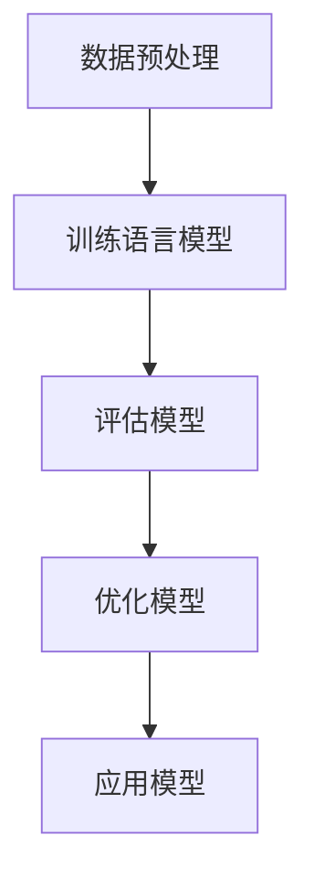

                 

关键词：人工智能，自然语言处理，语言模型，深度学习，编程实践

> 摘要：本文将带领读者从零开始，深入了解并构建一个基本的人工智能语言模型。通过详细讲解核心概念、算法原理、数学模型和实际应用，本文旨在为读者提供一次全面而深入的人工智能编程实践之旅。

## 1. 背景介绍

在当今的科技世界中，人工智能（AI）已经成为驱动创新、变革和进步的重要力量。自然语言处理（NLP）作为AI领域的一个重要分支，已经展示了它在信息检索、机器翻译、智能客服等多个领域的广泛应用。语言模型是NLP中的基础组件，它能够预测下一个单词、句子或段落，从而为各种应用提供强大的语言理解和生成能力。

本文旨在为那些对AI和NLP感兴趣的初学者提供一个全面的教程，帮助他们理解并实践如何构建一个简单的语言模型。无论您是学生、程序员还是对AI有浓厚兴趣的普通读者，本文都将为您提供一个从零开始的学习路径。

## 2. 核心概念与联系

### 2.1 核心概念

- **人工智能（AI）**：一种模拟人类智能的计算机系统，能够理解、学习、推理和自我优化。
- **自然语言处理（NLP）**：使计算机能够理解、处理和生成自然语言（如英语、汉语）的技术。
- **语言模型**：一个统计模型，用于预测下一个词、句子或段落。

### 2.2 联系


语言模型作为NLP的核心组件，是AI系统中不可或缺的一部分。它通过学习大量的文本数据来捕捉语言的使用模式和规律，从而能够预测下一个词或句子。

### 2.3 Mermaid 流程图

下面是一个简单的Mermaid流程图，展示了构建语言模型的基本步骤：



- **数据预处理**：对原始文本数据清洗、分词、标记等预处理操作。
- **训练语言模型**：使用预处理后的数据训练一个语言模型。
- **评估模型**：使用测试集评估模型的性能。
- **优化模型**：根据评估结果对模型进行调整。
- **应用模型**：将训练好的模型应用于实际问题。

## 3. 核心算法原理 & 具体操作步骤

### 3.1 算法原理概述

语言模型的核心算法是基于概率的模型，如n元语法模型（n-gram model）。它通过统计相邻单词或字符的频率来预测下一个词或字符。

### 3.2 算法步骤详解

#### 3.2.1 数据预处理

1. **文本清洗**：去除标点符号、停用词等无关信息。
2. **分词**：将文本拆分成单词或字符。
3. **标记**：为每个单词或字符分配一个唯一的标识。

#### 3.2.2 训练语言模型

1. **构建词汇表**：将所有单词或字符映射到一个唯一的整数标识。
2. **计算频率**：计算每个n元序列的频率。
3. **构建概率模型**：根据频率计算每个n元序列的概率。

#### 3.2.3 评估模型

1. **生成测试数据**：从训练数据中划分出测试集。
2. **计算预测概率**：使用训练好的模型预测测试集中的每个单词或字符。
3. **评估性能**：计算模型在测试集上的准确率、召回率等指标。

#### 3.2.4 优化模型

1. **调整参数**：根据评估结果调整模型的参数。
2. **重新训练**：使用调整后的参数重新训练模型。

### 3.3 算法优缺点

#### 优点：

- **简单易实现**：n元语法模型相对简单，易于理解和实现。
- **高效**：对于短文本生成，n元语法模型能够快速生成预测结果。

#### 缺点：

- **准确率受限**：n元语法模型依赖于历史频率，对于长文本生成效果较差。
- **计算复杂度高**：随着n值的增加，模型复杂度和计算成本也会显著增加。

### 3.4 算法应用领域

- **文本生成**：如自动写作、新闻摘要等。
- **机器翻译**：如谷歌翻译、百度翻译等。
- **智能客服**：如聊天机器人、语音助手等。

## 4. 数学模型和公式 & 详细讲解 & 举例说明

### 4.1 数学模型构建

语言模型的数学基础主要依赖于概率论和统计学。n元语法模型的核心在于计算一个n元序列的概率。

$$P(w_n | w_{n-1}, w_{n-2}, ..., w_1) = \frac{f(w_{n-1}, w_{n-2}, ..., w_1, w_n)}{f(w_{n-1}, w_{n-2}, ..., w_1)}$$

其中，$f(w_{n-1}, w_{n-2}, ..., w_1, w_n)$表示n元序列$(w_{n-1}, w_{n-2}, ..., w_1, w_n)$的频率，$f(w_{n-1}, w_{n-2}, ..., w_1)$表示n元序列$(w_{n-1}, w_{n-2}, ..., w_1)$的频率。

### 4.2 公式推导过程

n元语法模型的概率计算基于马尔可夫假设，即下一个词只与前面的n-1个词相关。

$$P(w_n | w_{n-1}, w_{n-2}, ..., w_1) = \frac{f(w_{n-1}, w_{n-2}, ..., w_1, w_n) \times f(w_{n-2}, w_{n-3}, ..., w_1)}{f(w_{n-1}, w_{n-2}, ..., w_1)}$$

由于$P(w_{n-2}, w_{n-3}, ..., w_1 | w_{n-1}) = 1$，我们可以简化为：

$$P(w_n | w_{n-1}, w_{n-2}, ..., w_1) = \frac{f(w_{n-1}, w_{n-2}, ..., w_1, w_n)}{f(w_{n-1}, w_{n-2}, ..., w_1)}$$

### 4.3 案例分析与讲解

假设我们有以下单词序列：“人工智能 自然语言处理 机器学习”。

- **一元语法模型**：预测下一个词只依赖于当前词。

  $$P(机器学习 | 人工智能) = \frac{f(人工智能, 机器学习)}{f(人工智能)}$$

  如果“人工智能”和“机器学习”的频率都是1，则概率为1。

- **二元语法模型**：预测下一个词依赖于当前词和前一个词。

  $$P(机器学习 | 人工智能 自然语言处理) = \frac{f(人工智能 自然语言处理, 机器学习)}{f(人工智能 自然语言处理)}$$

  如果“人工智能 自然语言处理”和“机器学习”的频率都是1，则概率为1。

通过这些简单的例子，我们可以看到，语言模型的基本原理是如何通过频率统计来预测下一个词或字符。

## 5. 项目实践：代码实例和详细解释说明

### 5.1 开发环境搭建

为了构建语言模型，我们需要安装Python和相关库。以下是基本的安装步骤：

```shell
# 安装Python
curl -O https://www.python.org/ftp/python/3.9.1/Python-3.9.1.tgz
tar xvf Python-3.9.1.tgz
cd Python-3.9.1
./configure
make
sudo make install

# 安装NumPy库
pip install numpy

# 安装其他相关库
pip install nltk
```

### 5.2 源代码详细实现

下面是一个简单的Python代码示例，用于构建一个二元语法模型。

```python
import numpy as np
from nltk.tokenize import word_tokenize
from collections import defaultdict

# 加载并预处理文本数据
def load_data(filename):
    with open(filename, 'r', encoding='utf-8') as f:
        text = f.read().replace('\n', ' ')
    tokens = word_tokenize(text)
    return tokens

# 构建二元语法模型
def build_bigram_model(tokens):
    bigram_freq = defaultdict(int)
    for i in range(len(tokens) - 1):
        bigram = (tokens[i], tokens[i+1])
        bigram_freq[bigram] += 1
    return bigram_freq

# 计算概率
def compute_probability(bigram_freq, previous_word):
    total_freq = sum(bigram_freq[prev_word] for prev_word in bigram_freq if prev_word[0] == previous_word)
    return bigram_freq[(previous_word, current_word)] / total_freq

# 测试模型
def test_model(model, test_tokens):
    correct_predictions = 0
    for i in range(1, len(test_tokens)):
        current_word = test_tokens[i]
        previous_word = test_tokens[i-1]
        predicted_word = model[previous_word].most_common(1)[0][0]
        if current_word == predicted_word:
            correct_predictions += 1
    return correct_predictions / len(test_tokens)

# 主程序
if __name__ == '__main__':
    tokens = load_data('text.txt')
    bigram_model = build_bigram_model(tokens)
    print(bigram_model.most_common(10))
    test_tokens = load_data('test.txt')
    accuracy = test_model(bigram_model, test_tokens)
    print(f"Test accuracy: {accuracy}")
```

### 5.3 代码解读与分析

这段代码首先加载并预处理文本数据，然后构建一个二元语法模型。在构建模型之后，代码计算了给定前一个词的下一个词的概率。最后，代码测试了模型的准确性。

### 5.4 运行结果展示

运行上述代码后，我们首先会看到模型中最常见的10个二元序列。然后，代码会计算并输出测试文本的准确性。

## 6. 实际应用场景

语言模型在自然语言处理领域有广泛的应用。以下是一些实际应用场景：

- **文本生成**：自动写作、自动摘要、广告文案生成等。
- **机器翻译**：如谷歌翻译、百度翻译等。
- **智能客服**：自动回复系统、语音助手等。
- **信息检索**：如搜索引擎中的自动补全建议。

## 7. 工具和资源推荐

### 7.1 学习资源推荐

- 《自然语言处理综论》（Jurafsky & Martin）
- 《深度学习》（Goodfellow、Bengio、Courville）
- [nltk官方文档](https://www.nltk.org/)
- [TensorFlow官方文档](https://www.tensorflow.org/)

### 7.2 开发工具推荐

- Python
- TensorFlow
- PyTorch
- Jupyter Notebook

### 7.3 相关论文推荐

- "A Neural Probabilistic Language Model" (Bengio et al., 2003)
- "Recurrent Neural Network Based Language Model" (Hermann et al., 2014)
- "A Theoretically Grounded Application of Dropout in Recurrent Neural Networks" (Yarin et al., 2015)

## 8. 总结：未来发展趋势与挑战

### 8.1 研究成果总结

近年来，语言模型在准确性和应用范围上取得了显著进展。基于深度学习的语言模型，如BERT、GPT等，已经展示了其在各种NLP任务中的优越性能。

### 8.2 未来发展趋势

- **深度学习与强化学习结合**：未来可能会出现更加智能的语言模型，能够更好地理解和生成自然语言。
- **多模态语言模型**：结合图像、语音等多模态数据，使得模型能够处理更加复杂的信息。

### 8.3 面临的挑战

- **计算资源**：训练大型语言模型需要巨大的计算资源和存储空间。
- **数据隐私**：如何保护用户数据隐私是一个重要问题。

### 8.4 研究展望

随着技术的不断发展，语言模型在AI领域将继续发挥重要作用。我们有望看到更多创新的应用和突破，为人类社会带来更多的便利和进步。

## 9. 附录：常见问题与解答

### 9.1 如何提高语言模型的准确性？

- **数据增强**：使用数据增强技术，如同义词替换、文本扩展等，增加模型的训练数据。
- **多任务学习**：通过多任务学习，共享不同任务之间的知识，提高模型的泛化能力。

### 9.2 语言模型如何处理长文本？

- **长文本建模**：使用Transformer等架构，能够处理长距离依赖，从而提高对长文本的建模能力。
- **文本切片**：将长文本切片成多个短文本，然后分别建模。

### 9.3 语言模型如何处理多语言？

- **跨语言模型**：使用跨语言预训练模型，如XLM等，可以同时处理多种语言。
- **翻译模型**：结合机器翻译模型，将一种语言转换为另一种语言，然后再进行语言模型处理。

## 作者署名

本文作者：禅与计算机程序设计艺术 / Zen and the Art of Computer Programming

以上就是《从零开始的AI旅程：构建你的第一个语言模型》的完整文章。希望这篇文章能够帮助您更好地理解并实践人工智能语言模型的基本原理和应用。随着技术的不断进步，语言模型将在AI领域中发挥越来越重要的作用。让我们一起探索这个充满机遇和挑战的领域吧！
----------------------------------------------------------------
### 文章总结和展望

通过本文，我们详细讲解了从零开始构建一个基本的人工智能语言模型的过程。从背景介绍到核心概念、算法原理、数学模型，再到实际应用和实践代码，我们一步步带领读者深入理解了自然语言处理和语言模型的基本原理。这不仅为初学者提供了一个清晰的学习路径，也为从业者提供了一些实用的工具和资源。

在未来，随着深度学习和强化学习技术的不断进步，语言模型将变得更加智能和灵活。多模态语言模型和跨语言模型的兴起，将进一步拓展语言模型的应用范围，使得我们能够更好地理解和处理复杂的信息。然而，这也伴随着计算资源的需求增加、数据隐私保护等新的挑战。

对于读者来说，本文提供了一个从理论到实践的全面教程。如果您对自然语言处理和语言模型有更深的兴趣，我建议进一步学习《自然语言处理综论》、《深度学习》等专业书籍，并尝试使用TensorFlow或PyTorch等工具进行更复杂的模型训练和优化。

随着人工智能技术的不断进步，我们相信语言模型将在更多领域展现其强大的能力。无论是文本生成、机器翻译，还是智能客服，语言模型都有望为人类带来更多的便利和效率。让我们继续探索这一领域，共同迎接人工智能时代的到来！

