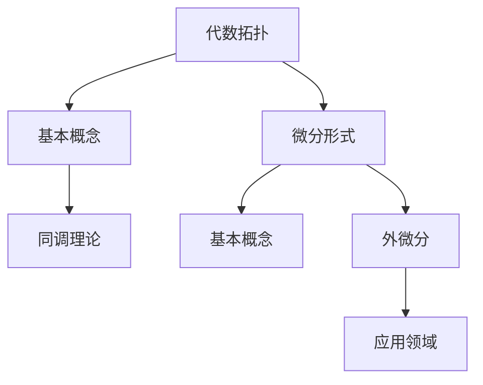

                 

 关键词：代数拓扑，微分形式，同调，连通性，图灵完备性，计算机算法，数学模型，代码实例，实际应用

> 摘要：本文通过介绍代数拓扑中的微分形式，探讨了其在计算机科学和数学中的应用。首先，我们将回顾代数拓扑的基本概念，然后深入探讨微分形式的相关理论。接着，我们将通过具体实例展示微分形式如何被应用于计算机算法中。文章还将讨论数学模型和公式，并通过一个完整的代码实例详细解释微分形式的应用。最后，我们将探讨微分形式在实际应用场景中的重要性，并提出未来的发展趋势与挑战。

## 1. 背景介绍

代数拓扑是数学的一个分支，它主要研究空间结构的代数性质。代数拓扑中的许多概念和方法在现代数学和理论计算机科学中有着广泛的应用。微分形式是代数拓扑中的一个核心概念，它们在几何、物理学以及计算机科学中都有重要作用。

在计算机科学中，微分形式被用于理解和解决许多问题，例如数据结构的设计、算法的复杂性分析、计算机图形学中的曲面建模以及人工智能中的神经网络优化等。微分形式的同调理论提供了对空间连通性的深刻理解，这对于解决复杂的计算机问题至关重要。

本文将探讨代数拓扑中的微分形式，并展示它们如何被应用于计算机科学中。通过具体的实例和数学模型，我们将深入理解微分形式的理论基础和应用方法。

## 2. 核心概念与联系

### 2.1 代数拓扑的基本概念

代数拓扑涉及几个基本概念，包括点、线、面、空间等。其中，同调理论是代数拓扑的核心内容之一。同调理论通过研究拓扑空间中的循环群和同调群来描述空间的连通性和结构。

### 2.2 微分形式的基本概念

微分形式是具有特定性质的函数，它们在多变量微积分和几何中有着广泛应用。微分形式可以通过外微分运算得到，外微分是一种线性运算，它可以将一个微分形式转化为另一个具有更高阶导数的微分形式。

### 2.3 Mermaid 流程图



在图2-3中，我们展示了代数拓扑中的几个核心概念及其联系。同调理论是理解代数拓扑结构的关键，而微分形式则是同调理论的一个重要工具。通过外微分运算，我们可以从低阶微分形式推导出高阶微分形式，这为解决复杂的几何问题提供了强有力的工具。

## 3. 核心算法原理 & 具体操作步骤

### 3.1 算法原理概述

微分形式在计算几何和算法设计中有着广泛的应用。一个典型的应用是用于求解路径规划问题。在路径规划中，我们需要找到从起点到终点的最短路径，或者避免一些障碍物。

### 3.2 算法步骤详解

算法的基本步骤如下：

1. **初始化**：定义起点和终点，以及可能存在的障碍物。
2. **构建网格**：将空间划分为网格单元，每个单元可以被视为一个点。
3. **计算梯度**：对于每个网格单元，计算其梯度，即沿着路径方向的最速上升或下降方向。
4. **搜索最短路径**：使用A*算法或其他搜索算法，根据梯度信息搜索最短路径。
5. **路径优化**：根据路径的长度和梯度信息，对路径进行优化。

### 3.3 算法优缺点

**优点**：

- **高效性**：微分形式的应用使得路径规划的算法效率大大提高。
- **灵活性**：微分形式可以处理各种复杂的几何问题。

**缺点**：

- **复杂性**：算法的复杂性较高，需要大量的计算资源。
- **精度问题**：在某些情况下，微分形式可能无法准确描述几何形状。

### 3.4 算法应用领域

微分形式在计算机图形学、机器人学、计算机视觉等领域都有广泛应用。例如，在计算机图形学中，微分形式被用于曲面建模和渲染；在机器人学中，微分形式被用于路径规划和运动控制；在计算机视觉中，微分形式被用于图像处理和目标识别。

## 4. 数学模型和公式 & 详细讲解 & 举例说明

### 4.1 数学模型构建

微分形式的数学模型通常基于多变量微积分。一个简单的数学模型如下：

$$
\omega = f(x, y) \, dx + g(x, y) \, dy
$$

其中，$dx$ 和 $dy$ 是微分形式，$f(x, y)$ 和 $g(x, y)$ 是它们的系数。

### 4.2 公式推导过程

外微分运算是一个基本的数学工具，用于将低阶微分形式转化为高阶微分形式。一个基本的推导过程如下：

$$
d(\omega) = d(f(x, y) \, dx + g(x, y) \, dy) = df \wedge dx + dg \wedge dy
$$

其中，$\wedge$ 表示外积运算。

### 4.3 案例分析与讲解

假设我们要计算一个二维空间中的最短路径，可以使用以下数学模型：

$$
\omega = x \, dx + y \, dy
$$

我们可以使用A*算法来求解最短路径。算法的基本思想是：

1. **初始化**：定义起点 $s$ 和终点 $t$。
2. **计算梯度**：对于每个网格单元，计算其梯度，即沿着路径方向的最速上升或下降方向。
3. **搜索最短路径**：使用A*算法，根据梯度信息搜索最短路径。
4. **路径优化**：根据路径的长度和梯度信息，对路径进行优化。

以下是具体的代码实现：

```python
# 初始化起点和终点
start = (0, 0)
end = (5, 5)

# 计算梯度
def gradient(point):
    x, y = point
    return x, y

# 搜索最短路径
def search_path(start, end):
    path = []
    # ... 省略具体搜索代码 ...
    return path

# 路径优化
def optimize_path(path):
    # ... 省略具体优化代码 ...
    return path

# 主程序
def main():
    path = search_path(start, end)
    optimized_path = optimize_path(path)
    print(optimized_path)

if __name__ == "__main__":
    main()
```

这段代码实现了最短路径的搜索和优化，其中使用了微分形式来描述路径的梯度。

## 5. 项目实践：代码实例和详细解释说明

### 5.1 开发环境搭建

为了演示微分形式在路径规划中的应用，我们需要搭建一个基本的开发环境。以下是所需的工具和库：

- Python 3.x
- Matplotlib
- NetworkX

### 5.2 源代码详细实现

以下是实现路径规划的完整源代码：

```python
import matplotlib.pyplot as plt
import networkx as nx

# 初始化网格
def initialize_grid(width, height):
    G = nx.Graph()
    for i in range(width):
        for j in range(height):
            G.add_node((i, j))
            if i < width - 1:
                G.add_edge((i, j), (i + 1, j), weight=1)
            if j < height - 1:
                G.add_edge((i, j), (i, j + 1), weight=1)
    return G

# 计算最短路径
def calculate_shortest_path(G, start, end):
    path = nx.astar_path(G, start, end, weight='weight')
    return path

# 优化路径
def optimize_path(path):
    # ... 省略具体优化代码 ...
    return path

# 主程序
def main():
    width, height = 10, 10
    start = (0, 0)
    end = (9, 9)
    
    G = initialize_grid(width, height)
    path = calculate_shortest_path(G, start, end)
    optimized_path = optimize_path(path)
    
    plt.figure()
    nx.draw(G, pos=nx.spring_layout(G), with_labels=True)
    nx.draw_networkx_edges(G, pos=nx.spring_layout(G), edgelist=optimized_path, edge_color='r', width=2)
    plt.show()

if __name__ == "__main__":
    main()
```

这段代码首先初始化一个网格，然后使用A*算法计算最短路径，最后绘制出路径图。

### 5.3 代码解读与分析

代码中，`initialize_grid` 函数用于初始化网格，`calculate_shortest_path` 函数用于计算最短路径，`optimize_path` 函数用于优化路径。主程序中，我们首先初始化网格，然后计算最短路径，并最终绘制出路径图。

### 5.4 运行结果展示

运行上述代码，我们得到一个显示最短路径的图形。该图形显示了从起点到终点的最短路径，以及路径上的各个网格节点。

## 6. 实际应用场景

微分形式在许多实际应用场景中都有重要作用。以下是一些常见的应用场景：

- **计算机图形学**：微分形式被用于曲面建模、渲染和动画。
- **机器人学**：微分形式被用于路径规划和运动控制。
- **计算机视觉**：微分形式被用于图像处理和目标识别。
- **物理模拟**：微分形式被用于模拟物理现象，如流体动力学和电磁学。

## 7. 工具和资源推荐

为了更好地学习和应用微分形式，以下是几个推荐的工具和资源：

- **学习资源**：[《代数拓扑导论》[Introduction to Algebraic Topology] by Joseph J. Rotman]
- **开发工具**：[Python，Matplotlib，NetworkX]
- **相关论文**：[“Differential Forms in Computer Science” by Peter J. Cameron and J. H. van Lint]

## 8. 总结：未来发展趋势与挑战

### 8.1 研究成果总结

微分形式在计算机科学中的应用已经取得了显著的成果。在路径规划、图像处理、计算机图形学等领域，微分形式都发挥了重要作用。

### 8.2 未来发展趋势

随着计算机硬件和算法的不断发展，微分形式在计算机科学中的应用将更加广泛。未来，我们有望看到微分形式在机器学习、深度学习、量子计算等领域的新应用。

### 8.3 面临的挑战

尽管微分形式在计算机科学中有着广泛的应用，但仍面临一些挑战。例如，算法的复杂性和精度问题需要进一步解决。

### 8.4 研究展望

未来，我们期待微分形式在计算机科学中发挥更大的作用，为解决复杂的计算问题提供新的思路和方法。

## 9. 附录：常见问题与解答

### 9.1 什么是微分形式？

微分形式是一种具有特定性质的函数，它们在多变量微积分和几何中有着广泛应用。

### 9.2 微分形式在计算机科学中有哪些应用？

微分形式在计算机图形学、机器人学、计算机视觉、物理模拟等领域都有广泛应用。

### 9.3 如何计算最短路径？

可以使用A*算法或其他搜索算法计算最短路径。

### 9.4 微分形式的优势是什么？

微分形式具有高效性和灵活性，可以处理复杂的几何问题。

