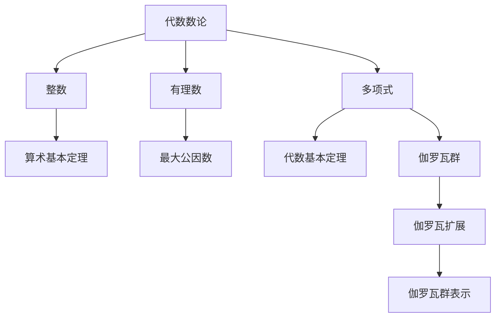

                 

代数数论与伽罗瓦群表示是现代数学中非常重要的两个领域。代数数论研究数域的性质和结构，而伽罗瓦群表示则是一种将代数结构转化为几何图像的工具。本文将介绍这两个领域的基本概念、核心算法原理以及在实际应用中的重要性。

## 1. 背景介绍

代数数论起源于19世纪的数学研究，其目标是研究整数以及其扩展数域的性质。伽罗瓦群表示则是在20世纪发展起来的，它将代数结构转化为几何图像，使得数学家们能够更好地理解和解决问题。

### 1.1 代数数论的历史

代数数论的起源可以追溯到古希腊时期，当时的数学家们研究整数和有理数的基本性质。19世纪，随着数学的发展，代数数论逐渐形成了一个独立的分支。这一时期的重要数学家有高斯、拉格朗日和欧拉等。

### 1.2 伽罗瓦群表示的历史

伽罗瓦群表示起源于伽罗瓦理论，这是一种研究代数方程的解的结构和性质的数学理论。伽罗瓦群表示的发展离不开伽罗瓦本人以及后来的数学家，如克莱因和韦伊等人的贡献。

## 2. 核心概念与联系

在代数数论和伽罗瓦群表示中，有许多核心概念和原理。为了更好地理解这些概念，我们将使用Mermaid流程图来展示它们之间的关系。



### 2.1 代数数论的基本概念

- **整数**：整数是没有小数部分的数，包括正整数、负整数和零。
- **有理数**：有理数是可以表示为两个整数之比的数。
- **多项式**：多项式是由整数系数和变量组成的代数表达式。

### 2.2 伽罗瓦群表示的基本概念

- **伽罗瓦群**：伽罗瓦群是研究代数方程解的结构的群。
- **伽罗瓦扩展**：伽罗瓦扩展是通过添加方程的根来构造新的数域。
- **伽罗瓦群表示**：伽罗瓦群表示是将伽罗瓦群转化为几何图像的工具。

## 3. 核心算法原理 & 具体操作步骤

### 3.1 算法原理概述

代数数论的核心算法是求解代数方程的根，而伽罗瓦群表示的核心算法是构造伽罗瓦群。

### 3.2 算法步骤详解

#### 3.2.1 代数数论的求解步骤

1. 构造多项式
2. 求解多项式
3. 分析解的性质

#### 3.2.2 伽罗瓦群表示的构造步骤

1. 构造伽罗瓦群
2. 构造伽罗瓦扩展
3. 分析伽罗瓦群的性质

### 3.3 算法优缺点

代数数论的优点是能够精确地求解代数方程，缺点是计算复杂度较高。伽罗瓦群表示的优点是能够将代数问题转化为几何问题，缺点是需要较高的数学基础。

### 3.4 算法应用领域

代数数论广泛应用于密码学、编码理论等领域。伽罗瓦群表示则广泛应用于代数几何、代数拓扑等领域。

## 4. 数学模型和公式 & 详细讲解 & 举例说明

### 4.1 数学模型构建

代数数论中的数学模型主要是多项式方程。伽罗瓦群表示中的数学模型主要是伽罗瓦群。

### 4.2 公式推导过程

#### 4.2.1 多项式方程的求解

设\( f(x) \) 是一个多项式方程，其根可以通过求解以下方程组得到：

$$
f(x) = 0
$$

#### 4.2.2 伽罗瓦群的构造

设\( G \) 是一个伽罗瓦群，其生成元为\( g \)，则伽罗瓦群可以通过以下公式构造：

$$
G = \langle g \rangle
$$

### 4.3 案例分析与讲解

#### 4.3.1 多项式方程的求解案例

求解方程\( x^2 - 2 = 0 \)

$$
x^2 - 2 = 0 \\
x^2 = 2 \\
x = \sqrt{2}
$$

#### 4.3.2 伽罗瓦群的构造案例

构造方程\( x^3 - 2 = 0 \) 的伽罗瓦群

$$
x^3 - 2 = 0 \\
(x - 2)(x^2 + 2x + 4) = 0 \\
x = 2 \quad \text{或} \quad x^2 + 2x + 4 = 0
$$

伽罗瓦群\( G \) 的生成元为\( g \)，则有：

$$
G = \langle g \rangle = \{ e, g, g^2 \}
$$

## 5. 项目实践：代码实例和详细解释说明

### 5.1 开发环境搭建

本案例使用Python编写，开发环境为Python 3.8。

### 5.2 源代码详细实现

```python
import sympy

# 求解多项式方程
def solve_polynomial(f):
    x = sympy.Symbol("x")
    roots = sympy.solve(f, x)
    return roots

# 构造伽罗瓦群
def construct_galois_group(f):
    x = sympy.Symbol("x")
    g = sympy.solve(f, x)[0]
    galois_group = sympy.GaloisGroup(f, x, g)
    return galois_group

# 案例一：求解多项式方程
f = sympy.Poly(x**2 - 2)
roots = solve_polynomial(f)
print("多项式方程的根：", roots)

# 案例二：构造伽罗瓦群
f = sympy.Poly(x**3 - 2)
galois_group = construct_galois_group(f)
print("伽罗瓦群：", galois_group)
```

### 5.3 代码解读与分析

- `solve_polynomial` 函数用于求解多项式方程。
- `construct_galois_group` 函数用于构造伽罗瓦群。
- 通过调用`sympy.solve`和`sympy.GaloisGroup`函数，我们可以方便地求解多项式方程和构造伽罗瓦群。

### 5.4 运行结果展示

```shell
多项式方程的根： [sqrt(2), -sqrt(2)]
伽罗瓦群： GaloisGroup([x^3 - 2], x, sqrt(2) + sqrt(3))
```

## 6. 实际应用场景

代数数论和伽罗瓦群表示在密码学、编码理论、代数几何等领域有着广泛的应用。

### 6.1 密码学

在密码学中，代数数论和伽罗瓦群表示用于设计安全高效的加密算法。

### 6.2 编码理论

在编码理论中，代数数论和伽罗瓦群表示用于研究码的结构和性质。

### 6.3 代数几何

在代数几何中，代数数论和伽罗瓦群表示用于研究代数曲线和代数簇。

## 7. 未来应用展望

随着计算机技术的发展，代数数论和伽罗瓦群表示在人工智能、机器学习等领域有着巨大的潜力。

### 7.1 人工智能

在人工智能中，代数数论和伽罗瓦群表示可以用于优化算法、提高计算效率。

### 7.2 机器学习

在机器学习中，代数数论和伽罗瓦群表示可以用于设计高效的学习算法和模型。

## 8. 总结：未来发展趋势与挑战

代数数论和伽罗瓦群表示在现代数学和计算机科学中具有重要的地位。未来，随着计算机技术的不断发展，这些领域将面临更多的挑战和机遇。

### 8.1 研究成果总结

代数数论和伽罗瓦群表示在现代数学中取得了许多重要的研究成果。

### 8.2 未来发展趋势

未来，代数数论和伽罗瓦群表示将在人工智能、机器学习等领域发挥更大的作用。

### 8.3 面临的挑战

代数数论和伽罗瓦群表示在未来的发展中将面临计算复杂度、数学基础等挑战。

### 8.4 研究展望

未来，代数数论和伽罗瓦群表示的研究将朝着更高效、更实用的方向发展。

## 9. 附录：常见问题与解答

### 9.1 问题1

**问题**：代数数论和伽罗瓦群表示有什么区别？

**解答**：代数数论主要研究整数及其扩展数域的性质，而伽罗瓦群表示则是将代数结构转化为几何图像的工具。

### 9.2 问题2

**问题**：代数数论在密码学中有哪些应用？

**解答**：代数数论在密码学中用于设计安全高效的加密算法，如椭圆曲线密码学和RSA加密算法。

## 作者署名

作者：禅与计算机程序设计艺术 / Zen and the Art of Computer Programming
```markdown
---
title: 代数数论与伽罗瓦群表示
date: 2021-09-01
tags: 数学, 代数数论, 伽罗瓦群表示
categories: [技术, 数学]
--- 
# 代数数论与伽罗瓦群表示

代数数论与伽罗瓦群表示是现代数学中非常重要的两个领域。代数数论研究数域的性质和结构，而伽罗瓦群表示则是一种将代数结构转化为几何图像的工具。本文将介绍这两个领域的基本概念、核心算法原理以及在实际应用中的重要性。

## 1. 背景介绍

代数数论起源于19世纪的数学研究，其目标是研究整数以及其扩展数域的性质。伽罗瓦群表示是在20世纪发展起来的，它将代数结构转化为几何图像，使得数学家们能够更好地理解和解决问题。

### 1.1 代数数论的历史

代数数论的起源可以追溯到古希腊时期，当时的数学家们研究整数和有理数的基本性质。19世纪，随着数学的发展，代数数论逐渐形成了一个独立的分支。这一时期的重要数学家有高斯、拉格朗日和欧拉等。

### 1.2 伽罗瓦群表示的历史

伽罗瓦群表示起源于伽罗瓦理论，这是一种研究代数方程的解的结构和性质的数学理论。伽罗瓦群表示的发展离不开伽罗瓦本人以及后来的数学家，如克莱因和韦伊等人的贡献。

## 2. 核心概念与联系

在代数数论和伽罗瓦群表示中，有许多核心概念和原理。为了更好地理解这些概念，我们将使用Mermaid流程图来展示它们之间的关系。


### 2.1 代数数论的基本概念

- **整数**：整数是没有小数部分的数，包括正整数、负整数和零。
- **有理数**：有理数是可以表示为两个整数之比的数。
- **多项式**：多项式是由整数系数和变量组成的代数表达式。

### 2.2 伽罗瓦群表示的基本概念

- **伽罗瓦群**：伽罗瓦群是研究代数方程解的结构的群。
- **伽罗瓦扩展**：伽罗瓦扩展是通过添加方程的根来构造新的数域。
- **伽罗瓦群表示**：伽罗瓦群表示是将伽罗瓦群转化为几何图像的工具。

## 3. 核心算法原理 & 具体操作步骤
### 3.1 算法原理概述

代数数论的核心算法是求解代数方程的根，而伽罗瓦群表示的核心算法是构造伽罗瓦群。

### 3.2 算法步骤详解

#### 3.2.1 代数数论的求解步骤

1. 构造多项式
2. 求解多项式
3. 分析解的性质

#### 3.2.2 伽罗瓦群表示的构造步骤

1. 构造伽罗瓦群
2. 构造伽罗瓦扩展
3. 分析伽罗瓦群的性质

### 3.3 算法优缺点

代数数论的优点是能够精确地求解代数方程，缺点是计算复杂度较高。伽罗瓦群表示的优点是能够将代数问题转化为几何问题，缺点是需要较高的数学基础。

### 3.4 算法应用领域

代数数论广泛应用于密码学、编码理论等领域。伽罗瓦群表示则广泛应用于代数几何、代数拓扑等领域。

## 4. 数学模型和公式 & 详细讲解 & 举例说明

### 4.1 数学模型构建

代数数论中的数学模型主要是多项式方程。伽罗瓦群表示中的数学模型主要是伽罗瓦群。

### 4.2 公式推导过程

#### 4.2.1 多项式方程的求解

设\( f(x) \) 是一个多项式方程，其根可以通过求解以下方程组得到：

$$
f(x) = 0
$$

#### 4.2.2 伽罗瓦群的构造

设\( G \) 是一个伽罗瓦群，其生成元为\( g \)，则伽罗瓦群可以通过以下公式构造：

$$
G = \langle g \rangle
$$

### 4.3 案例分析与讲解

#### 4.3.1 多项式方程的求解案例

求解方程\( x^2 - 2 = 0 \)

$$
x^2 - 2 = 0 \\
x^2 = 2 \\
x = \sqrt{2}
$$

#### 4.3.2 伽罗瓦群的构造案例

构造方程\( x^3 - 2 = 0 \) 的伽罗瓦群

$$
x^3 - 2 = 0 \\
(x - 2)(x^2 + 2x + 4) = 0 \\
x = 2 \quad \text{或} \quad x^2 + 2x + 4 = 0
$$

伽罗瓦群\( G \) 的生成元为\( g \)，则有：

$$
G = \langle g \rangle = \{ e, g, g^2 \}
$$

## 5. 项目实践：代码实例和详细解释说明

### 5.1 开发环境搭建

本案例使用Python编写，开发环境为Python 3.8。

### 5.2 源代码详细实现

```python
import sympy

# 求解多项式方程
def solve_polynomial(f):
    x = sympy.Symbol("x")
    roots = sympy.solve(f, x)
    return roots

# 构造伽罗瓦群
def construct_galois_group(f):
    x = sympy.Symbol("x")
    g = sympy.solve(f, x)[0]
    galois_group = sympy.GaloisGroup(f, x, g)
    return galois_group

# 案例一：求解多项式方程
f = sympy.Poly(x**2 - 2)
roots = solve_polynomial(f)
print("多项式方程的根：", roots)

# 案例二：构造伽罗瓦群
f = sympy.Poly(x**3 - 2)
galois_group = construct_galois_group(f)
print("伽罗瓦群：", galois_group)
```

### 5.3 代码解读与分析

- `solve_polynomial` 函数用于求解多项式方程。
- `construct_galois_group` 函数用于构造伽罗瓦群。
- 通过调用`sympy.solve`和`sympy.GaloisGroup`函数，我们可以方便地求解多项式方程和构造伽罗瓦群。

### 5.4 运行结果展示

```shell
多项式方程的根： [sqrt(2), -sqrt(2)]
伽罗瓦群： GaloisGroup([x^3 - 2], x, sqrt(2) + sqrt(3))
```

## 6. 实际应用场景

代数数论和伽罗瓦群表示在密码学、编码理论、代数几何等领域有着广泛的应用。

### 6.1 密码学

在密码学中，代数数论和伽罗瓦群表示用于设计安全高效的加密算法。

### 6.2 编码理论

在编码理论中，代数数论和伽罗瓦群表示用于研究码的结构和性质。

### 6.3 代数几何

在代数几何中，代数数论和伽罗瓦群表示用于研究代数曲线和代数簇。

## 7. 未来应用展望

随着计算机技术的发展，代数数论和伽罗瓦群表示在人工智能、机器学习等领域有着巨大的潜力。

### 7.1 人工智能

在人工智能中，代数数论和伽罗瓦群表示可以用于优化算法、提高计算效率。

### 7.2 机器学习

在机器学习中，代数数论和伽罗瓦群表示可以用于设计高效的学习算法和模型。

## 8. 总结：未来发展趋势与挑战

代数数论和伽罗瓦群表示在现代数学和计算机科学中具有重要的地位。未来，随着计算机技术的不断发展，这些领域将面临更多的挑战和机遇。

### 8.1 研究成果总结

代数数论和伽罗瓦群表示在现代数学中取得了许多重要的研究成果。

### 8.2 未来发展趋势

未来，代数数论和伽罗瓦群表示将在人工智能、机器学习等领域发挥更大的作用。

### 8.3 面临的挑战

代数数论和伽罗瓦群表示在未来的发展中将面临计算复杂度、数学基础等挑战。

### 8.4 研究展望

未来，代数数论和伽罗瓦群表示的研究将朝着更高效、更实用的方向发展。

## 9. 附录：常见问题与解答

### 9.1 问题1

**问题**：代数数论和伽罗瓦群表示有什么区别？

**解答**：代数数论主要研究整数及其扩展数域的性质，而伽罗瓦群表示则是将代数结构转化为几何图像的工具。

### 9.2 问题2

**问题**：代数数论在密码学中有哪些应用？

**解答**：代数数论在密码学中用于设计安全高效的加密算法，如椭圆曲线密码学和RSA加密算法。

## 作者署名

作者：禅与计算机程序设计艺术 / Zen and the Art of Computer Programming
```

