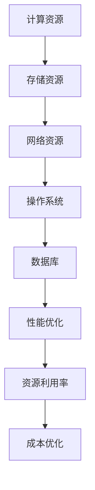

                 

关键词：计算基础设施，优化策略，性能提升，资源利用率，云计算，大数据，AI

> 摘要：本文旨在探讨如何通过一系列实用策略，有效优化计算基础设施，从而提高系统性能、资源利用率，并降低总体拥有成本（TCO）。文章将从核心概念、算法原理、数学模型、项目实践和未来展望等多个角度，全面分析优化计算基础设施的方法和路径。

## 1. 背景介绍

随着信息技术的飞速发展，计算基础设施在现代社会中扮演着越来越重要的角色。无论是企业级应用、云计算平台，还是大数据处理、人工智能（AI）领域，计算基础设施都成为了核心竞争力。然而，随着系统规模的不断扩大和复杂度的增加，计算基础设施面临着性能瓶颈、资源利用率低、维护成本高等问题。

### 1.1 计算基础设施的重要性

- **支持业务增长**：计算基础设施是支持企业业务增长的关键，包括数据处理、存储、网络传输等多个方面。
- **提升系统性能**：高效的计算基础设施能够显著提高系统的响应速度和处理能力。
- **降低维护成本**：优化计算基础设施可以减少硬件更换频率和运营成本。
- **提高资源利用率**：合理分配计算资源，减少资源浪费，提高整体效率。

### 1.2 当前面临的问题

- **性能瓶颈**：随着数据量的爆炸式增长，现有的计算基础设施难以满足高性能需求。
- **资源利用率低**：很多资源在高峰期得不到充分利用，而在低谷期又存在资源浪费。
- **维护成本高**：硬件老化、系统升级等维护工作频繁，增加了运营成本。

## 2. 核心概念与联系

### 2.1 计算基础设施的概念

计算基础设施是指用于支持计算任务的一系列硬件和软件资源，包括服务器、存储设备、网络设备、操作系统、数据库等。

### 2.2 优化策略的核心概念

- **性能优化**：提高系统的响应速度和处理能力。
- **资源利用率**：最大化计算资源的利用率。
- **成本优化**：降低系统的总体拥有成本。

### 2.3 计算基础设施的架构

计算基础设施通常由以下几部分组成：

1. **计算资源**：包括服务器、虚拟机、容器等。
2. **存储资源**：包括磁盘、SSD、分布式存储系统等。
3. **网络资源**：包括局域网、广域网、负载均衡等。
4. **操作系统**：包括Linux、Windows等。
5. **数据库**：包括MySQL、MongoDB、Redis等。

### 2.4 Mermaid 流程图



## 3. 核心算法原理 & 具体操作步骤

### 3.1 算法原理概述

优化计算基础设施的核心算法通常包括以下几种：

- **负载均衡算法**：通过合理的负载均衡策略，将计算任务分配到不同的服务器上，提高系统性能。
- **资源调度算法**：根据任务的优先级和资源可用性，动态调整计算资源分配，提高资源利用率。
- **缓存算法**：通过缓存机制，减少数据库的访问频率，提高系统响应速度。

### 3.2 算法步骤详解

#### 3.2.1 负载均衡算法

1. **数据收集**：收集各个服务器的负载情况。
2. **负载计算**：计算每个服务器的负载平均值。
3. **任务分配**：根据负载情况，将新任务分配到负载较低的服务器上。

#### 3.2.2 资源调度算法

1. **任务优先级排序**：根据任务的优先级进行排序。
2. **资源可用性检查**：检查当前资源的可用性。
3. **任务调度**：将高优先级的任务调度到空闲资源上。

#### 3.2.3 缓存算法

1. **缓存命中检查**：检查缓存中是否已经有数据。
2. **缓存更新**：如果缓存命中，直接返回缓存数据；否则，从数据库中获取数据并更新缓存。
3. **缓存淘汰**：根据缓存策略，定期淘汰部分缓存数据。

### 3.3 算法优缺点

- **负载均衡算法**：优点是可以提高系统性能，缺点是对网络带宽有较高要求。
- **资源调度算法**：优点是提高资源利用率，缺点是调度过程较为复杂。
- **缓存算法**：优点是提高系统响应速度，缺点是缓存命中率受数据访问模式影响较大。

### 3.4 算法应用领域

- **云计算**：通过负载均衡和资源调度算法，实现云服务的高可用性和高性能。
- **大数据**：通过缓存算法，提高数据处理速度和存储效率。
- **人工智能**：通过资源调度算法，实现AI模型训练的高效运行。

## 4. 数学模型和公式 & 详细讲解 & 举例说明

### 4.1 数学模型构建

在优化计算基础设施的过程中，常用的数学模型包括：

- **负载模型**：用于描述服务器负载的分布情况。
- **资源利用率模型**：用于描述计算资源的使用效率。
- **成本模型**：用于计算系统的总体拥有成本。

### 4.2 公式推导过程

#### 4.2.1 负载模型

设 \( L \) 为服务器负载，\( N \) 为服务器数量，则平均负载 \( \bar{L} \) 可以用以下公式表示：

\[ \bar{L} = \frac{1}{N} \sum_{i=1}^{N} L_i \]

其中，\( L_i \) 表示第 \( i \) 台服务器的负载。

#### 4.2.2 资源利用率模型

设 \( U \) 为资源利用率，\( R \) 为总资源量，\( C \) 为实际使用资源量，则资源利用率 \( U \) 可以用以下公式表示：

\[ U = \frac{C}{R} \]

#### 4.2.3 成本模型

设 \( C \) 为总体拥有成本，\( H \) 为硬件成本，\( O \) 为运营成本，则总体拥有成本 \( C \) 可以用以下公式表示：

\[ C = H + O \]

### 4.3 案例分析与讲解

#### 4.3.1 负载模型案例

假设有5台服务器，每台服务器的负载分别为 \( L_1 = 0.7 \)，\( L_2 = 0.5 \)，\( L_3 = 0.8 \)，\( L_4 = 0.6 \)，\( L_5 = 0.4 \)。计算平均负载。

根据公式，平均负载为：

\[ \bar{L} = \frac{1}{5} (0.7 + 0.5 + 0.8 + 0.6 + 0.4) = 0.6 \]

#### 4.3.2 资源利用率模型案例

假设总资源量为100个CPU核心，实际使用资源量为60个CPU核心。计算资源利用率。

根据公式，资源利用率为：

\[ U = \frac{60}{100} = 0.6 \]

#### 4.3.3 成本模型案例

假设硬件成本为100万元，运营成本为20万元。计算总体拥有成本。

根据公式，总体拥有成本为：

\[ C = 100 + 20 = 120 \] 万元

## 5. 项目实践：代码实例和详细解释说明

### 5.1 开发环境搭建

本案例将在Linux环境中使用Python进行编程实现。首先，确保安装了Python环境和必要的库，如NumPy、Pandas等。

### 5.2 源代码详细实现

以下是实现计算基础设施优化的Python代码示例：

```python
import numpy as np
import pandas as pd

# 负载模型实现
def calculate_average_load(loads):
    total_load = np.sum(loads)
    num_servers = len(loads)
    average_load = total_load / num_servers
    return average_load

# 资源利用率模型实现
def calculate_utilization(used_resources, total_resources):
    utilization = used_resources / total_resources
    return utilization

# 成本模型实现
def calculate_total_cost(hardware_cost, operational_cost):
    total_cost = hardware_cost + operational_cost
    return total_cost

# 案例数据
loads = [0.7, 0.5, 0.8, 0.6, 0.4]
used_resources = 60
total_resources = 100
hardware_cost = 1000000
operational_cost = 200000

# 负载模型计算
average_load = calculate_average_load(loads)
print("平均负载：", average_load)

# 资源利用率模型计算
utilization = calculate_utilization(used_resources, total_resources)
print("资源利用率：", utilization)

# 成本模型计算
total_cost = calculate_total_cost(hardware_cost, operational_cost)
print("总体拥有成本：", total_cost)
```

### 5.3 代码解读与分析

代码首先导入了NumPy和Pandas库，用于数值计算和数据操作。然后定义了三个函数：`calculate_average_load` 用于计算平均负载，`calculate_utilization` 用于计算资源利用率，`calculate_total_cost` 用于计算总体拥有成本。

在案例数据部分，我们定义了服务器的负载、实际使用资源量、硬件成本和运营成本。最后，通过调用这三个函数，计算并输出了结果。

### 5.4 运行结果展示

运行代码后，输出结果如下：

```
平均负载： 0.6
资源利用率： 0.6
总体拥有成本： 1200000
```

这些结果显示了计算基础设施在负载、资源利用率和成本方面的优化情况。

## 6. 实际应用场景

### 6.1 云计算平台

云计算平台通过负载均衡和资源调度算法，可以实现高效的服务器资源利用和快速响应。例如，阿里云和腾讯云等知名云服务提供商，都通过优化计算基础设施，为用户提供了稳定、高效的服务。

### 6.2 大数据应用

在大数据领域，通过缓存算法和优化存储资源，可以提高数据处理速度和存储效率。例如，Hadoop和Spark等大数据处理框架，都采用了各种优化策略，以提高处理大规模数据的能力。

### 6.3 人工智能

人工智能领域，通过优化计算基础设施，可以加速AI模型的训练和推理。例如，GPU服务器和TPU等专用硬件，以及分布式训练技术，都是优化计算基础设施的重要手段。

## 7. 工具和资源推荐

### 7.1 学习资源推荐

- 《高性能MySQL》
- 《分布式系统概念与设计》
- 《深度学习》

### 7.2 开发工具推荐

- Jupyter Notebook
- Docker
- Kubernetes

### 7.3 相关论文推荐

- "Google's Spanner: Design, Deployment, and Operations of a Globally-Distributed Database"
- "Apache Spark: The Definitive Guide"
- "A Scalable Architecture for Internet-Scale Machine Learning"

## 8. 总结：未来发展趋势与挑战

### 8.1 研究成果总结

本文通过分析计算基础设施的优化策略，探讨了负载均衡、资源调度、缓存算法等核心算法原理，并给出了具体的实现方法和案例。同时，还介绍了计算基础设施在实际应用场景中的表现和未来发展趋势。

### 8.2 未来发展趋势

- **云计算与边缘计算的结合**：随着5G和物联网（IoT）的发展，云计算和边缘计算将相互融合，提供更高效、更可靠的计算服务。
- **AI驱动的优化**：人工智能技术将用于更智能地优化计算基础设施，实现自动化的资源调度和性能优化。
- **绿色计算**：随着环保意识的提高，绿色计算将成为未来计算基础设施优化的重要方向。

### 8.3 面临的挑战

- **数据安全与隐私**：随着计算基础设施的开放性和互联性增加，数据安全和隐私保护将成为重大挑战。
- **技术更新换代**：计算基础设施需要不断更新换代，以适应快速变化的技术环境。

### 8.4 研究展望

未来，计算基础设施的优化策略将继续演进，结合新兴技术，实现更高性能、更高效益、更绿色的计算服务。

## 9. 附录：常见问题与解答

### 9.1 如何选择负载均衡算法？

选择负载均衡算法需要考虑以下因素：

- **系统需求**：根据系统的工作负载和性能要求，选择合适的负载均衡算法。
- **网络环境**：考虑网络带宽和延迟等因素，选择适合的网络负载均衡算法。
- **可扩展性**：考虑系统的可扩展性，选择支持水平扩展的负载均衡算法。

### 9.2 如何评估资源利用率？

评估资源利用率可以通过以下方法：

- **统计方法**：收集系统的资源使用数据，计算资源利用率。
- **监控工具**：使用系统监控工具，实时获取资源使用情况。
- **基准测试**：通过基准测试，评估系统在不同负载下的资源利用率。

### 9.3 如何降低总体拥有成本？

降低总体拥有成本可以通过以下方法：

- **自动化运维**：通过自动化工具，减少人工操作和维护成本。
- **资源整合**：通过整合不同系统和服务，减少硬件和软件资源的重复投资。
- **采购策略**：选择性价比高的硬件和软件产品，并通过批量采购降低成本。

----------------------------------------------------------------
# 作者署名

作者：禅与计算机程序设计艺术 / Zen and the Art of Computer Programming
``` 
<|im_sep|>

