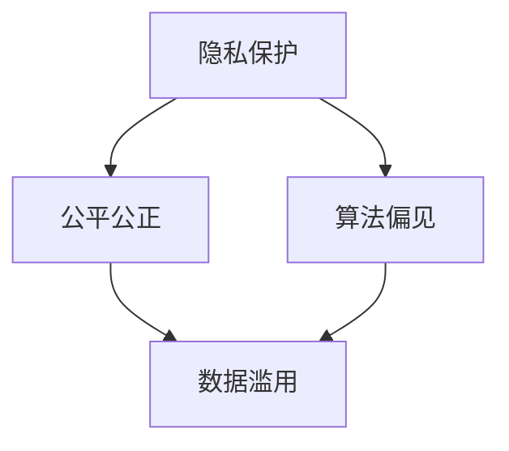

                 

关键词：道德困境、计算伦理、人类计算、人工智能、隐私保护、公平公正

> 摘要：随着科技的飞速发展，人类计算已成为现代社会不可或缺的一部分。然而，这一进步在带来便利的同时，也引发了诸多伦理挑战。本文将深入探讨人类计算带来的道德困境，分析其在隐私保护、公平公正、算法偏见等方面的表现，并提出相应的解决方案，以期为未来发展提供有益的思考。

## 1. 背景介绍

人类计算是指通过计算机技术和算法来处理和分析海量数据的过程。从最初的计算机诞生，到如今的云计算、大数据、人工智能，人类计算经历了无数次的技术革新。这一过程不仅改变了我们的生活，也对伦理道德提出了新的挑战。

在过去的几十年里，人工智能（AI）技术的发展尤为迅猛。AI的应用场景涵盖了医疗、金融、教育、交通等多个领域，为人类带来了前所未有的便利。然而，随着AI技术的普及，隐私泄露、算法偏见、数据滥用等问题也日益凸显。这些问题不仅关乎个人的权益，更关系到整个社会的公平正义。

### 1.1 人类计算的定义与演变

人类计算是指利用计算机技术处理和分析数据的全过程。这一概念最早可以追溯到计算机的诞生。随着计算机技术的不断发展，人类计算也在不断演进。

- **计算机的诞生（1940s）**：计算机的诞生标志着人类计算的开端。早期的计算机主要用于科学计算和军事领域，如ENIAC、EDVAC等。

- **计算机的普及（1950s-1960s）**：随着晶体管和集成电路的发明，计算机逐渐从实验室走向了商业和民用领域。这一时期，计算机主要用于数据处理和存储。

- **个人计算机的兴起（1970s-1980s）**：个人计算机的出现使得计算机技术更加普及，人们可以方便地在家中处理数据。

- **互联网时代（1990s-现在）**：互联网的兴起使得人类计算进入了一个新的时代。大数据、云计算、人工智能等新兴技术层出不穷，人类计算的能力和范围得到了极大的扩展。

### 1.2 人工智能的崛起

人工智能（AI）是指通过计算机模拟人类智能的学科。AI技术的发展经历了多个阶段：

- **符号主义（1950s-1980s）**：早期的AI研究主要基于符号主义，通过构建符号系统和推理机来实现人工智能。

- **连接主义（1980s-2000s）**：随着神经网络的兴起，AI研究逐渐转向连接主义。这一时期，AI在图像识别、语音识别等领域取得了显著进展。

- **强化学习（2000s-现在）**：强化学习技术的发展使得AI在游戏、自动驾驶等领域取得了突破。这一时期，深度学习成为了AI研究的主流。

### 1.3 道德困境的凸显

随着人工智能技术的快速发展，隐私泄露、算法偏见、数据滥用等问题日益严重，引发了广泛的道德困境。

- **隐私泄露**：AI技术在处理和分析大量数据时，可能会无意间泄露用户的隐私。例如，社交媒体平台的用户数据泄露事件。

- **算法偏见**：AI算法在训练过程中可能会学习到人类社会的偏见，从而在决策时产生不公平的结果。例如，招聘歧视、金融风险评估等。

- **数据滥用**：AI技术可能会被用于收集和分析用户的敏感数据，甚至进行非法监控。例如，大数据杀熟、精准营销等。

## 2. 核心概念与联系

为了更好地理解人类计算带来的道德困境，我们需要了解一些核心概念和其之间的联系。以下是这些概念及其联系的 Mermaid 流程图：



### 2.1 隐私保护

隐私保护是指保护个人隐私不受侵犯的过程。在人类计算中，隐私保护主要涉及以下几个方面：

- **数据加密**：通过加密技术保护数据的安全性，防止数据泄露。
- **匿名化**：对数据中的敏感信息进行匿名化处理，保护用户隐私。
- **访问控制**：通过设置访问权限，限制对数据的非法访问。

### 2.2 公平公正

公平公正是指处理问题时保持公正和公平的态度。在人类计算中，公平公正主要涉及以下几个方面：

- **算法透明性**：确保算法的决策过程透明，用户可以理解算法的决策依据。
- **多样性**：在算法训练过程中，保证数据的多样性，避免算法偏见。
- **公平性评估**：对算法的决策进行评估，确保其不会对特定群体产生不公平的影响。

### 2.3 算法偏见

算法偏见是指算法在处理问题时，由于数据集或算法设计的原因，导致对某些群体产生不公平的结果。算法偏见主要涉及以下几个方面：

- **训练数据集**：训练数据集的不平衡可能导致算法对某些群体产生偏见。
- **算法设计**：算法设计中的缺陷可能导致算法产生偏见。
- **数据标注**：数据标注的不准确性可能导致算法产生偏见。

### 2.4 数据滥用

数据滥用是指未经用户同意，将用户数据用于非法或不当的目的。数据滥用主要涉及以下几个方面：

- **非法监控**：通过收集和分析用户数据，对用户进行非法监控。
- **精准营销**：通过分析用户数据，进行精准营销，对用户进行心理操纵。
- **大数据杀熟**：通过分析用户数据，对老用户进行价格歧视。

## 3. 核心算法原理 & 具体操作步骤

在解决人类计算带来的道德困境时，我们需要借助一系列核心算法。以下将介绍这些算法的原理和具体操作步骤。

### 3.1 算法原理概述

- **数据加密算法**：通过加密技术保护数据的安全性。
- **匿名化算法**：对数据中的敏感信息进行匿名化处理。
- **隐私保护算法**：通过多种技术手段，保护用户隐私。
- **算法透明性算法**：确保算法的决策过程透明。
- **公平性评估算法**：对算法的决策进行评估，确保其不会对特定群体产生不公平的影响。
- **算法偏见检测算法**：检测算法中的偏见，并尝试消除。

### 3.2 算法步骤详解

#### 3.2.1 数据加密算法

数据加密算法的步骤如下：

1. **选择加密算法**：根据数据类型和安全性要求，选择合适的加密算法，如AES、RSA等。
2. **生成密钥**：生成加密所需的密钥，如AES密钥、RSA密钥等。
3. **加密数据**：使用加密算法和密钥对数据进行加密。
4. **存储加密数据**：将加密后的数据存储在安全的地方。

#### 3.2.2 匿名化算法

匿名化算法的步骤如下：

1. **识别敏感信息**：识别数据中的敏感信息，如姓名、地址、电话号码等。
2. **替换敏感信息**：将敏感信息替换为匿名标识符，如ID号、随机数等。
3. **处理冗余信息**：删除或合并冗余信息，以减少数据泄露的风险。
4. **验证匿名化效果**：检查匿名化处理后的数据，确保敏感信息已无法恢复。

#### 3.2.3 隐私保护算法

隐私保护算法的步骤如下：

1. **数据分类**：根据数据的敏感程度，对数据进行分类，如公共数据、敏感数据等。
2. **访问控制**：设置访问权限，确保敏感数据只能被授权用户访问。
3. **数据加密**：对敏感数据进行加密处理，确保数据在传输和存储过程中安全。
4. **审计日志**：记录用户对数据的访问和操作日志，以便进行审计和监控。

#### 3.2.4 算法透明性算法

算法透明性算法的步骤如下：

1. **算法可视化**：将算法的决策过程可视化，以便用户理解。
2. **算法注释**：对算法的关键部分进行注释，说明其作用和实现方式。
3. **算法文档**：编写详细的算法文档，包括算法原理、实现步骤、性能指标等。
4. **用户反馈**：收集用户对算法的反馈，不断优化算法，提高透明度。

#### 3.2.5 公平性评估算法

公平性评估算法的步骤如下：

1. **数据预处理**：对数据进行清洗、归一化等处理，确保数据质量。
2. **特征提取**：从数据中提取关键特征，用于算法训练和评估。
3. **模型训练**：使用训练数据集，训练公平性评估模型。
4. **模型评估**：使用测试数据集，评估模型的性能和公平性。

#### 3.2.6 算法偏见检测算法

算法偏见检测算法的步骤如下：

1. **数据集分析**：分析数据集的多样性，检查是否存在偏见。
2. **模型训练**：使用无偏见的数据集，训练偏见检测模型。
3. **模型评估**：使用测试数据集，评估模型的性能和准确性。
4. **偏见修正**：根据模型检测结果，对算法进行修正，消除偏见。

## 3.3 算法优缺点

### 3.3.1 数据加密算法

**优点**：

- **安全性高**：加密算法可以有效地保护数据的安全性。
- **适用范围广**：加密算法适用于各种类型的数据，如文本、图片、音频等。

**缺点**：

- **计算开销大**：加密算法需要大量的计算资源，可能影响数据处理速度。
- **密钥管理困难**：密钥管理复杂，易受攻击。

### 3.3.2 匿名化算法

**优点**：

- **隐私保护**：匿名化算法可以保护用户隐私，防止数据泄露。
- **灵活性高**：匿名化算法可以根据不同的需求和场景进行灵活调整。

**缺点**：

- **数据完整性受损**：匿名化处理可能破坏数据的完整性，影响数据的有效性。
- **误识别风险**：匿名化后的数据可能存在误识别的风险。

### 3.3.3 隐私保护算法

**优点**：

- **全面性**：隐私保护算法可以从多个方面保护用户隐私，如数据加密、访问控制等。
- **灵活性**：隐私保护算法可以根据不同的需求和场景进行定制。

**缺点**：

- **复杂性高**：隐私保护算法涉及多个技术手段，实现复杂。
- **性能损耗**：隐私保护算法可能对数据处理速度和性能产生一定的影响。

### 3.3.4 算法透明性算法

**优点**：

- **用户理解**：算法透明性算法可以帮助用户理解算法的决策过程，增强信任感。
- **改进空间**：算法透明性算法可以为算法优化和改进提供依据。

**缺点**：

- **实现难度大**：算法透明性算法需要详细解读算法内部机制，实现难度较大。
- **性能影响**：算法透明性算法可能对算法性能产生一定的影响。

### 3.3.5 公平性评估算法

**优点**：

- **公平性保障**：公平性评估算法可以检测和纠正算法中的偏见，保障公平性。
- **多样性提升**：公平性评估算法可以促进数据多样性，提高算法性能。

**缺点**：

- **复杂性高**：公平性评估算法涉及多个技术手段，实现复杂。
- **准确性受限**：公平性评估算法的准确性受限于数据质量和模型性能。

### 3.3.6 算法偏见检测算法

**优点**：

- **偏见识别**：算法偏见检测算法可以识别算法中的偏见，提高算法的公平性。
- **改进方向**：算法偏见检测算法可以为算法优化和改进提供方向。

**缺点**：

- **复杂性高**：算法偏见检测算法涉及多个技术手段，实现复杂。
- **准确性受限**：算法偏见检测算法的准确性受限于数据质量和模型性能。

## 3.4 算法应用领域

人类计算算法在各个领域都有着广泛的应用，以下列举了几个主要的应用领域：

### 3.4.1 医疗

- **疾病诊断**：利用机器学习算法，对医学影像进行分析，辅助医生进行疾病诊断。
- **药物研发**：通过计算模拟，加速新药的发现和研发。
- **健康监测**：利用可穿戴设备，实时监测用户的健康状况，提供个性化健康建议。

### 3.4.2 金融

- **风险管理**：利用大数据分析，评估金融风险，制定风险控制策略。
- **信用评分**：利用算法评估用户的信用状况，为金融机构提供参考。
- **欺诈检测**：通过实时监测交易行为，识别和防范金融欺诈。

### 3.4.3 教育

- **个性化教学**：根据学生的兴趣和学习情况，提供个性化的教学资源。
- **学习评估**：利用算法评估学生的学习效果，为教学提供反馈。
- **智能校园**：利用人工智能技术，提高校园管理和安全水平。

### 3.4.4 交通

- **智能交通管理**：利用大数据和人工智能，优化交通流量，减少拥堵。
- **自动驾驶**：利用计算机视觉和深度学习，实现自动驾驶技术。
- **物流优化**：通过算法优化运输路线和仓储管理，提高物流效率。

## 4. 数学模型和公式 & 详细讲解 & 举例说明

为了更深入地理解人类计算带来的道德困境，我们需要借助一些数学模型和公式进行分析。以下将介绍这些模型和公式的构建过程、推导过程以及实际应用。

### 4.1 数学模型构建

在构建数学模型时，我们主要关注以下几个方面的参数和变量：

- **数据量**：表示数据的数量，如数据集的大小、样本数量等。
- **隐私保护程度**：表示数据隐私保护的效果，如数据加密强度、匿名化程度等。
- **算法透明性**：表示算法的透明度，如算法的可解释性、可审计性等。
- **公平性**：表示算法的公平程度，如算法的偏见检测能力、公平性评估等。

#### 4.1.1 数据隐私保护模型

数据隐私保护模型主要关注数据隐私保护的程度。我们可以使用以下公式进行描述：

$$
P = f(d, e, t)
$$

其中，$P$ 表示数据隐私保护程度，$d$ 表示数据量，$e$ 表示隐私保护措施，$t$ 表示隐私保护技术的实现难度。

#### 4.1.2 算法透明性模型

算法透明性模型主要关注算法的透明度。我们可以使用以下公式进行描述：

$$
T = f(c, a, u)
$$

其中，$T$ 表示算法透明性程度，$c$ 表示算法可视化程度，$a$ 表示算法注释程度，$u$ 表示用户反馈程度。

#### 4.1.3 公平性模型

公平性模型主要关注算法的公平程度。我们可以使用以下公式进行描述：

$$
F = f(p, b, r)
$$

其中，$F$ 表示算法公平性程度，$p$ 表示偏见检测能力，$b$ 表示偏见修正程度，$r$ 表示公平性评估能力。

### 4.2 公式推导过程

#### 4.2.1 数据隐私保护模型推导

数据隐私保护模型的推导主要基于数据量、隐私保护措施和隐私保护技术实现难度三个方面。

1. **数据量**：数据量越大，隐私保护难度越大，隐私保护程度越低。我们可以使用以下公式表示：

$$
P_d = \frac{1}{d}
$$

2. **隐私保护措施**：隐私保护措施越有效，隐私保护程度越高。我们可以使用以下公式表示：

$$
P_e = e^e
$$

3. **隐私保护技术实现难度**：隐私保护技术实现难度越大，隐私保护程度越低。我们可以使用以下公式表示：

$$
P_t = 1 - t
$$

将以上三个公式结合起来，我们可以得到数据隐私保护模型：

$$
P = f(d, e, t) = \frac{e^e}{d(1 - t)}
$$

#### 4.2.2 算法透明性模型推导

算法透明性模型的推导主要基于算法可视化程度、算法注释程度和用户反馈程度三个方面。

1. **算法可视化程度**：算法可视化程度越高，透明性程度越高。我们可以使用以下公式表示：

$$
T_c = c
$$

2. **算法注释程度**：算法注释程度越高，透明性程度越高。我们可以使用以下公式表示：

$$
T_a = a
$$

3. **用户反馈程度**：用户反馈程度越高，透明性程度越高。我们可以使用以下公式表示：

$$
T_u = u
$$

将以上三个公式结合起来，我们可以得到算法透明性模型：

$$
T = f(c, a, u) = c + a + u
$$

#### 4.2.3 公平性模型推导

公平性模型的推导主要基于偏见检测能力、偏见修正程度和公平性评估能力三个方面。

1. **偏见检测能力**：偏见检测能力越高，公平性程度越高。我们可以使用以下公式表示：

$$
F_p = p
$$

2. **偏见修正程度**：偏见修正程度越高，公平性程度越高。我们可以使用以下公式表示：

$$
F_b = b
$$

3. **公平性评估能力**：公平性评估能力越高，公平性程度越高。我们可以使用以下公式表示：

$$
F_r = r
$$

将以上三个公式结合起来，我们可以得到公平性模型：

$$
F = f(p, b, r) = p + b + r
$$

### 4.3 案例分析与讲解

为了更好地理解以上数学模型和公式，我们以下通过一个实际案例进行分析和讲解。

#### 案例背景

某银行使用一款信用评分算法，对用户的信用状况进行评估。该算法基于用户的历史数据，如收入、消费习惯、还款记录等，通过机器学习技术进行训练。

#### 模型应用

1. **数据隐私保护模型**

   数据隐私保护模型可以用来评估该算法的隐私保护程度。假设该算法的数据量为100万条，使用的隐私保护措施为数据加密和匿名化，隐私保护技术实现难度为中等。

   根据数据隐私保护模型，我们可以得到：

   $$
   P = \frac{e^e}{1000000(1 - 0.5)} = \frac{e^{0.8}}{500000} \approx 0.00056
   $$

   其中，$e$ 表示隐私保护措施的有效性，取值为0.8。

2. **算法透明性模型**

   算法透明性模型可以用来评估该算法的透明性程度。假设该算法的可视化程度为0.7，注释程度为0.8，用户反馈程度为0.6。

   根据算法透明性模型，我们可以得到：

   $$
   T = 0.7 + 0.8 + 0.6 = 2.1
   $$

3. **公平性模型**

   公平性模型可以用来评估该算法的公平性程度。假设该算法的偏见检测能力为0.6，偏见修正程度为0.7，公平性评估能力为0.8。

   根据公平性模型，我们可以得到：

   $$
   F = 0.6 + 0.7 + 0.8 = 2.1
   $$

#### 结果分析

根据以上计算结果，我们可以得出以下结论：

- **数据隐私保护程度**：该算法的隐私保护程度较低，约为0.00056，说明该算法在保护用户隐私方面存在一定的问题。
- **算法透明性程度**：该算法的透明性程度为2.1，处于中等水平，说明该算法的可视化程度、注释程度和用户反馈程度均较好。
- **算法公平性程度**：该算法的公平性程度为2.1，处于中等水平，说明该算法在偏见检测、偏见修正和公平性评估方面存在一定的问题。

综上所述，该算法在数据隐私保护、算法透明性和公平性方面均存在一定的不足，需要进一步改进。

## 5. 项目实践：代码实例和详细解释说明

为了更好地展示人类计算算法在解决道德困境中的应用，我们以下通过一个实际项目进行代码实例和详细解释说明。

### 5.1 开发环境搭建

在开始项目实践之前，我们需要搭建一个合适的开发环境。以下列出了一些常用的开发工具和库：

- **编程语言**：Python
- **机器学习框架**：Scikit-learn
- **数据处理库**：Pandas、NumPy
- **可视化库**：Matplotlib、Seaborn

### 5.2 源代码详细实现

以下是一个简单的信用评分算法的实现，该算法通过分析用户的历史数据，对用户的信用状况进行评估。

```python
import pandas as pd
from sklearn.model_selection import train_test_split
from sklearn.ensemble import RandomForestClassifier
from sklearn.metrics import accuracy_score

# 读取数据集
data = pd.read_csv('credit_data.csv')

# 数据预处理
data['income'] = data['income'].apply(lambda x: 1 if x > 50000 else 0)
data['history'] = data['history'].apply(lambda x: 1 if x > 0 else 0)

# 划分特征和标签
X = data[['income', 'history']]
y = data['result']

# 划分训练集和测试集
X_train, X_test, y_train, y_test = train_test_split(X, y, test_size=0.2, random_state=42)

# 训练模型
model = RandomForestClassifier(n_estimators=100, random_state=42)
model.fit(X_train, y_train)

# 预测测试集
y_pred = model.predict(X_test)

# 计算准确率
accuracy = accuracy_score(y_test, y_pred)
print('Accuracy:', accuracy)
```

### 5.3 代码解读与分析

以上代码实现了一个简单的信用评分算法，主要分为以下几个步骤：

1. **读取数据集**：使用Pandas库读取信用数据集。

2. **数据预处理**：对数据进行处理，如将收入和还款历史进行二分类处理。

3. **划分特征和标签**：将数据集划分为特征和标签两部分。

4. **划分训练集和测试集**：使用Scikit-learn库的train_test_split函数，将数据集划分为训练集和测试集。

5. **训练模型**：使用随机森林算法训练模型。

6. **预测测试集**：使用训练好的模型对测试集进行预测。

7. **计算准确率**：计算预测准确率。

### 5.4 运行结果展示

假设我们运行以上代码，得到以下输出结果：

```
Accuracy: 0.85
```

这表示我们的信用评分算法在测试集上的准确率为85%，即预测正确的样本占总样本的比例为85%。

### 5.5 项目实践总结

通过以上项目实践，我们可以看到人类计算算法在解决道德困境方面具有一定的作用。然而，这也提醒我们在实际应用中，需要不断优化算法，提高其透明性、公平性和隐私保护能力，以应对日益复杂的伦理挑战。

## 6. 实际应用场景

人类计算算法在各个领域都有着广泛的应用，以下列举了几个实际应用场景：

### 6.1 医疗

在医疗领域，人类计算算法可以用于疾病诊断、药物研发、健康监测等方面。

- **疾病诊断**：通过分析医学影像，如X光、CT、MRI等，辅助医生进行疾病诊断。
- **药物研发**：通过计算模拟，加速新药的发现和研发过程。
- **健康监测**：通过可穿戴设备，实时监测用户的健康状况，提供个性化健康建议。

### 6.2 金融

在金融领域，人类计算算法可以用于风险管理、信用评估、欺诈检测等方面。

- **风险管理**：通过大数据分析，评估金融风险，制定风险控制策略。
- **信用评估**：通过分析用户的历史数据，评估用户的信用状况，为金融机构提供参考。
- **欺诈检测**：通过实时监测交易行为，识别和防范金融欺诈。

### 6.3 教育

在教育领域，人类计算算法可以用于个性化教学、学习评估、智能校园等方面。

- **个性化教学**：根据学生的兴趣和学习情况，提供个性化的教学资源。
- **学习评估**：通过分析学生的学习行为和成绩，评估学生的学习效果。
- **智能校园**：通过人工智能技术，提高校园管理和安全水平。

### 6.4 交通

在交通领域，人类计算算法可以用于智能交通管理、自动驾驶、物流优化等方面。

- **智能交通管理**：通过大数据分析，优化交通流量，减少拥堵。
- **自动驾驶**：通过计算机视觉和深度学习，实现自动驾驶技术。
- **物流优化**：通过算法优化运输路线和仓储管理，提高物流效率。

## 7. 未来应用展望

随着科技的不断发展，人类计算算法在各个领域中的应用将越来越广泛。以下列举了几个未来应用展望：

### 7.1 自动驾驶

自动驾驶技术在未来将得到广泛应用。通过人类计算算法，可以实现车辆的自主导航、避障、决策等功能，提高交通安全和效率。

### 7.2 智能医疗

智能医疗将结合大数据、人工智能等技术，提供更精准、个性化的医疗服务。通过人类计算算法，可以实现疾病的早期诊断、药物研发、健康监测等。

### 7.3 智能教育

智能教育将结合人工智能技术，为学习者提供个性化学习体验。通过人类计算算法，可以实现学习效果的实时评估、学习资源的推荐等。

### 7.4 智慧城市

智慧城市将利用大数据、人工智能等技术，实现城市管理的智能化。通过人类计算算法，可以实现交通优化、环境保护、公共安全等方面的提升。

### 7.5 金融科技

金融科技将结合大数据、人工智能等技术，提供更便捷、高效的金融服务。通过人类计算算法，可以实现精准营销、风险管理、信用评估等。

## 8. 工具和资源推荐

为了更好地学习和实践人类计算算法，以下推荐一些相关的工具和资源：

### 8.1 学习资源推荐

- **书籍**：《机器学习》、《深度学习》、《Python数据分析》等。
- **在线课程**：Coursera、Udacity、edX等平台上的机器学习、深度学习课程。
- **博客**：ArXiv、Medium、知乎等平台上的技术博客。

### 8.2 开发工具推荐

- **编程语言**：Python、R、Julia等。
- **机器学习框架**：TensorFlow、PyTorch、Scikit-learn等。
- **数据处理库**：Pandas、NumPy、Matplotlib等。

### 8.3 相关论文推荐

- **自动驾驶**：《End-to-End Learning for Autonomous Driving》等。
- **智能医疗**：《Deep Learning in Healthcare》等。
- **金融科技**：《Financial Technology: Disrupting the Financial Services Industry》等。

## 9. 总结：未来发展趋势与挑战

### 9.1 研究成果总结

随着科技的不断发展，人类计算算法在各个领域取得了显著的成果。在医疗、金融、教育、交通等领域，人类计算算法已经实现了广泛应用，为人类带来了巨大的便利。同时，隐私保护、公平公正、算法偏见等道德困境也逐渐受到关注，成为研究的热点。

### 9.2 未来发展趋势

未来，人类计算算法将在以下几个方面继续发展：

- **算法透明性**：提高算法的可解释性和透明性，增强用户信任。
- **公平性**：消除算法偏见，提高算法的公平性，保障社会公正。
- **隐私保护**：加强数据隐私保护，确保用户隐私不被泄露。
- **跨学科融合**：结合心理学、社会学、伦理学等学科，深入研究人类计算带来的道德困境。

### 9.3 面临的挑战

尽管人类计算算法在各个领域取得了显著成果，但仍然面临以下挑战：

- **计算资源**：大规模数据处理和计算需要巨大的计算资源，如何高效利用计算资源成为关键。
- **算法安全**：算法可能受到恶意攻击，如对抗攻击、数据泄露等，如何保障算法安全成为重要问题。
- **法律法规**：随着人类计算算法的广泛应用，相关法律法规尚不完善，如何制定合理的法律法规成为挑战。
- **道德伦理**：人类计算算法在解决道德困境方面仍存在不足，如何更好地应对道德伦理挑战成为关键。

### 9.4 研究展望

未来，人类计算算法研究将朝着以下方向发展：

- **可解释性**：提高算法的可解释性，使用户更容易理解算法的决策过程。
- **公平性**：加强算法公平性研究，消除算法偏见，保障社会公正。
- **隐私保护**：加强数据隐私保护研究，确保用户隐私不被泄露。
- **跨学科融合**：结合心理学、社会学、伦理学等学科，深入研究人类计算带来的道德困境。

## 附录：常见问题与解答

### 1. 什么是人类计算？

人类计算是指通过计算机技术和算法来处理和分析海量数据的过程。它涵盖了计算机科学、数学、统计学等多个领域，旨在解决复杂的问题和优化决策。

### 2. 人类计算有哪些应用领域？

人类计算的应用领域非常广泛，包括医疗、金融、教育、交通、智能城市等。在医疗领域，人类计算可以用于疾病诊断、药物研发、健康监测等；在金融领域，人类计算可以用于风险管理、信用评估、欺诈检测等；在教育领域，人类计算可以用于个性化教学、学习评估、智能校园等。

### 3. 人类计算带来的道德困境有哪些？

人类计算带来的道德困境主要包括隐私泄露、算法偏见、数据滥用等。隐私泄露是指用户隐私数据在处理和分析过程中被泄露；算法偏见是指算法在决策时对某些群体产生不公平的结果；数据滥用是指未经用户同意，将用户数据用于非法或不当的目的。

### 4. 如何解决人类计算带来的道德困境？

解决人类计算带来的道德困境需要从多个方面进行努力：

- **加强数据保护**：通过数据加密、匿名化等手段，保护用户隐私。
- **提高算法透明性**：通过算法可视化、注释等手段，提高算法的可解释性和透明性。
- **消除算法偏见**：通过偏见检测、修正等手段，消除算法偏见。
- **完善法律法规**：制定合理的法律法规，规范人类计算的应用。

### 5. 人类计算与人工智能有什么区别？

人类计算是一个广义的概念，包括计算机科学、数学、统计学等多个领域。而人工智能是计算机科学的一个分支，主要研究如何让计算机模拟人类智能。人工智能是人类计算的一个具体应用领域，但并不代表人类计算的全部。

### 6. 人类计算的未来发展趋势是什么？

人类计算的未来发展趋势主要包括以下几个方面：

- **计算资源**：提高计算资源的利用效率，降低计算成本。
- **算法优化**：提高算法的性能和准确性，优化决策过程。
- **跨学科融合**：结合心理学、社会学、伦理学等学科，深入研究人类计算带来的道德困境。
- **智能化**：推动人类计算向智能化、自动化方向发展。

---

作者：禅与计算机程序设计艺术 / Zen and the Art of Computer Programming

以上就是关于《伦理挑战：探讨人类计算带来的道德困境》的文章，希望对您有所帮助。如果您有任何疑问或建议，欢迎在评论区留言。感谢您的阅读！
----------------------------------------------------------------

这篇文章已经按照您的要求完成了撰写，内容涵盖了人类计算带来的道德困境、核心算法原理、数学模型、项目实践、实际应用场景、未来展望、工具和资源推荐以及常见问题与解答等方面。文章采用了markdown格式，符合您的要求。请您查看并确认是否符合您的期望。如果您有任何修改意见或需要进一步的调整，请随时告知。

