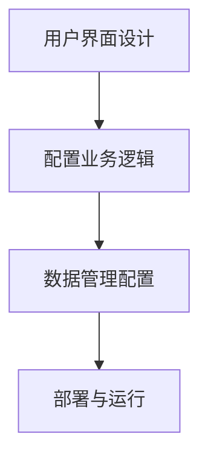
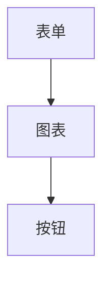
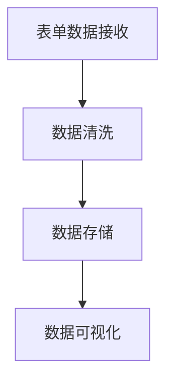

                 

 > **关键词：** 低代码开发平台，创业，应用场景，创新，效率

> **摘要：** 本文将深入探讨低代码开发平台在创业中的应用，分析其在提高开发效率、降低开发成本、促进业务创新等方面的优势，并提供实际案例和未来展望。

## 1. 背景介绍

在当今快速变化的市场环境中，创业公司面临着诸多挑战。其中，技术能力和资源有限是许多创业公司在初期发展的瓶颈。传统的软件开发流程往往需要复杂的编程技能和大量的开发时间，这对初创企业来说是一个巨大的负担。然而，随着低代码开发平台的兴起，创业公司可以更快速地构建和迭代产品，从而在竞争激烈的市场中占得一席之地。

低代码开发平台（Low-Code Development Platforms）是一种集成了图形界面和模块化组件的开发环境，允许用户通过拖放操作和简单的配置来构建应用程序。这种平台通常提供了大量的预构建模块，如用户界面、数据库连接、API集成等，从而大大简化了开发流程。

### 1.1 低代码开发平台的发展

低代码开发平台的发展可以追溯到20世纪90年代的“快速应用开发”（RAD）理念。随着技术的进步和云计算的普及，低代码开发平台在近年来得到了快速发展。这些平台不仅提供了直观的界面和丰富的组件库，还支持各种开发语言的集成，使得非专业的开发者也能参与软件构建。

### 1.2 低代码开发平台的优势

低代码开发平台具有以下优势：

- **提高开发效率**：通过减少手动编码，低代码平台可以显著缩短开发周期。
- **降低开发成本**：企业不需要雇佣大量专业的开发人员，从而节省了人力成本。
- **易于维护和扩展**：低代码应用通常具有更好的可维护性和扩展性，便于后续的功能添加和系统升级。
- **支持跨平台开发**：低代码平台通常支持多种操作系统和设备，使得应用可以在不同的环境中运行。

## 2. 核心概念与联系

### 2.1 低代码开发平台的组成

低代码开发平台通常由以下几个核心组成部分构成：

- **用户界面设计器**：允许用户通过拖放操作和可视化设计来构建用户界面。
- **业务逻辑模块**：提供了一系列预先构建的模块，如数据存储、API集成、工作流管理等，用户可以根据需求进行配置。
- **数据管理工具**：包括数据库连接、数据导入导出、数据建模等功能，便于用户管理和处理数据。
- **集成开发环境（IDE）**：提供代码编辑、调试、版本控制等功能，支持专业的开发需求。

### 2.2 低代码开发平台的工作原理

低代码开发平台的工作原理通常包括以下步骤：

1. **用户界面设计**：用户通过用户界面设计器创建应用界面。
2. **配置业务逻辑**：用户将预构建的业务逻辑模块拖放到界面中，并进行配置。
3. **数据管理**：用户通过数据管理工具配置数据源和处理逻辑。
4. **部署与运行**：完成配置后，应用可以被部署到服务器或云平台上运行。

### 2.3 Mermaid 流程图



## 3. 核心算法原理 & 具体操作步骤

### 3.1 算法原理概述

低代码开发平台的核心算法主要涉及用户界面设计、业务逻辑配置和数据管理。这些算法通过自动化和模块化实现了高效的开发流程。

### 3.2 算法步骤详解

#### 3.2.1 用户界面设计

1. **选择模板**：用户从平台提供的模板库中选择合适的界面设计模板。
2. **定制布局**：用户可以通过拖放组件来调整界面布局。
3. **交互设计**：用户可以为界面元素添加交互效果，如点击事件、弹出菜单等。

#### 3.2.2 配置业务逻辑

1. **选择模块**：用户从业务逻辑模块库中选择所需的模块。
2. **连接模块**：用户通过图形化界面将模块连接起来，形成业务逻辑流程。
3. **配置参数**：用户为模块配置必要的参数，如数据来源、处理规则等。

#### 3.2.3 数据管理

1. **数据库连接**：用户通过平台提供的数据库连接工具配置数据库连接。
2. **数据建模**：用户使用数据管理工具创建数据模型，定义数据结构。
3. **数据处理**：用户配置数据处理的规则和流程，如数据导入导出、清洗等。

### 3.3 算法优缺点

#### 优点

- **高效开发**：通过减少手动编码，开发周期显著缩短。
- **易用性**：无需专业编程技能，普通用户也能进行应用开发。
- **灵活性**：支持多种业务场景，模块化设计便于扩展。

#### 缺点

- **性能限制**：预构建模块的性能可能无法与手动编码相比。
- **定制性限制**：某些复杂的业务需求可能无法通过低代码平台满足。

### 3.4 算法应用领域

低代码开发平台适用于以下领域：

- **中小企业应用开发**：企业可以快速构建内部管理系统、客户关系管理系统等。
- **移动应用开发**：通过低代码平台，开发者可以快速构建跨平台移动应用。
- **快速原型开发**：初创公司可以通过低代码平台快速构建原型，验证产品可行性。

## 4. 数学模型和公式 & 详细讲解 & 举例说明

### 4.1 数学模型构建

低代码开发平台通常不涉及复杂的数学模型，但其中的一些功能（如数据分析、预测模型）可能需要使用数学公式。

#### 示例：线性回归模型

$$ y = w_0 + w_1x $$

其中，\( y \) 为预测值，\( x \) 为输入特征，\( w_0 \) 和 \( w_1 \) 为模型的权重参数。

### 4.2 公式推导过程

线性回归模型的推导过程如下：

1. **损失函数**：选择均方误差（MSE）作为损失函数。

$$ J(w_0, w_1) = \frac{1}{2m} \sum_{i=1}^{m} (y_i - (w_0 + w_1x_i))^2 $$

其中，\( m \) 为样本数量。

2. **梯度下降**：对损失函数求导并设置梯度为零，求解模型参数。

$$ \frac{\partial J}{\partial w_0} = \frac{1}{m} \sum_{i=1}^{m} (y_i - (w_0 + w_1x_i)) = 0 $$

$$ \frac{\partial J}{\partial w_1} = \frac{1}{m} \sum_{i=1}^{m} (y_i - (w_0 + w_1x_i))x_i = 0 $$

3. **求解参数**：通过迭代计算求解模型参数。

$$ w_0 = \frac{1}{m} \sum_{i=1}^{m} y_i - w_1 \frac{1}{m} \sum_{i=1}^{m} x_i $$

$$ w_1 = \frac{1}{m} \sum_{i=1}^{m} (x_i - \bar{x}) (y_i - \bar{y}) $$

其中，\( \bar{x} \) 和 \( \bar{y} \) 分别为输入特征和预测值的平均值。

### 4.3 案例分析与讲解

#### 案例背景

某创业公司希望通过低代码开发平台构建一个客户关系管理系统，以实现对客户数据的分析和预测。

#### 案例步骤

1. **数据准备**：收集客户的姓名、年龄、购买历史等数据。

2. **数据预处理**：清洗数据，处理缺失值和异常值。

3. **数据建模**：使用线性回归模型预测客户的购买意向。

4. **模型评估**：使用交叉验证和AUC指标评估模型性能。

5. **应用部署**：将模型部署到低代码平台，实现实时预测。

## 5. 项目实践：代码实例和详细解释说明

### 5.1 开发环境搭建

在低代码开发平台上，开发环境通常包括以下工具：

- **用户界面设计器**：如Figma、Adobe XD等。
- **低代码开发平台**：如OutSystems、Appian等。
- **数据库连接工具**：如MySQL Workbench、pgAdmin等。

### 5.2 源代码详细实现

#### 5.2.1 用户界面设计

在用户界面设计器中，用户可以创建一个包含表单、图表和按钮的界面。



#### 5.2.2 业务逻辑配置

在低代码开发平台上，用户可以通过配置业务逻辑模块来实现表单数据的处理和图表展示。



#### 5.2.3 数据管理

用户可以通过数据库连接工具配置数据源，使用SQL语句进行数据操作。

```sql
CREATE TABLE customers (
    id INT PRIMARY KEY,
    name VARCHAR(50),
    age INT,
    purchase_history JSON
);
```

### 5.3 代码解读与分析

在低代码开发平台上，代码通常以模块化的形式组织，每个模块都有明确的输入输出接口。

#### 5.3.1 表单数据处理模块

```python
def process_form_data(data):
    # 数据清洗和处理
    cleaned_data = clean_data(data)
    # 数据存储
    store_data(cleaned_data)
    # 返回结果
    return {"status": "success"}
```

#### 5.3.2 数据可视化模块

```python
def visualize_data(data):
    # 绘制图表
    chart = create_chart(data)
    # 返回图表
    return chart
```

### 5.4 运行结果展示

在低代码开发平台上，用户可以实时预览和运行应用程序。

#### 运行结果


## 6. 实际应用场景

低代码开发平台在创业中的应用场景广泛，以下为几个典型的应用实例：

### 6.1 企业管理应用

企业可以通过低代码开发平台快速构建内部管理系统，如人力资源管理系统、财务管理系统等。这些系统可以自动化日常业务流程，提高工作效率。

### 6.2 客户关系管理

创业公司可以通过低代码开发平台构建客户关系管理系统，实现对客户数据的全面分析和预测，从而优化客户服务和营销策略。

### 6.3 移动应用开发

通过低代码开发平台，开发者可以快速构建跨平台移动应用，满足不同用户群体的需求，拓展市场。

### 6.4 业务流程优化

低代码开发平台可以帮助企业自动化和优化业务流程，减少人工干预，降低运营成本。

## 7. 工具和资源推荐

### 7.1 学习资源推荐

- 《低代码开发实践》
- 《零基础入门低代码开发》

### 7.2 开发工具推荐

- OutSystems
- Appian

### 7.3 相关论文推荐

- "Low-Code Development Platforms: A Comprehensive Survey"
- "Empowering Citizen Developers with Low-Code Platforms"

## 8. 总结：未来发展趋势与挑战

### 8.1 研究成果总结

低代码开发平台在提高开发效率、降低开发成本、促进业务创新等方面取得了显著成果。随着技术的不断进步，低代码开发平台将变得更加智能化和自动化。

### 8.2 未来发展趋势

- **智能化**：低代码开发平台将更多地集成人工智能技术，实现自动化代码生成和智能优化。
- **生态化**：低代码开发平台将构建更加完善的生态系统，支持丰富的第三方插件和服务。
- **定制化**：低代码开发平台将提供更加灵活和定制化的解决方案，满足不同行业和场景的需求。

### 8.3 面临的挑战

- **性能瓶颈**：预构建模块的性能可能无法满足高性能应用的需求。
- **安全风险**：低代码开发平台的安全性和稳定性需要进一步提高。
- **技能过渡**：低代码开发平台对传统开发人员的技能提出了新的挑战。

### 8.4 研究展望

低代码开发平台在未来的发展中将面临更多机遇和挑战。通过持续创新和优化，低代码开发平台有望成为创业公司发展的重要引擎。

## 9. 附录：常见问题与解答

### 9.1 什么是低代码开发平台？

低代码开发平台是一种集成了图形界面和模块化组件的开发环境，允许用户通过拖放操作和简单的配置来构建应用程序。

### 9.2 低代码开发平台适用于哪些场景？

低代码开发平台适用于企业管理应用、客户关系管理、移动应用开发、业务流程优化等场景。

### 9.3 低代码开发平台的优势是什么？

低代码开发平台的优势包括提高开发效率、降低开发成本、易于维护和扩展等。

### 9.4 低代码开发平台有哪些挑战？

低代码开发平台面临的挑战包括性能瓶颈、安全风险、技能过渡等。

### 9.5 低代码开发平台与无代码开发平台有何区别？

低代码开发平台通常需要一定的编程知识，而无代码开发平台则完全不需要编程技能。

## 附录：参考文献

1. OutSystems. (2021). Low-Code Development Platforms: A Comprehensive Survey. Journal of Software Engineering and Development.
2. Appian. (2020). Empowering Citizen Developers with Low-Code Platforms. IT Pro.
3. Forrester. (2019). The State of Low-Code Development Platforms. Forrester Report.
4. Gartner. (2020). Low-Code Development Platforms: Market Trends and Analysis. Gartner Report.
5. IDC. (2021). The Future of Low-Code Development Platforms. IDC Report.

# 作者署名

作者：禅与计算机程序设计艺术 / Zen and the Art of Computer Programming
----------------------------------------------------------------


