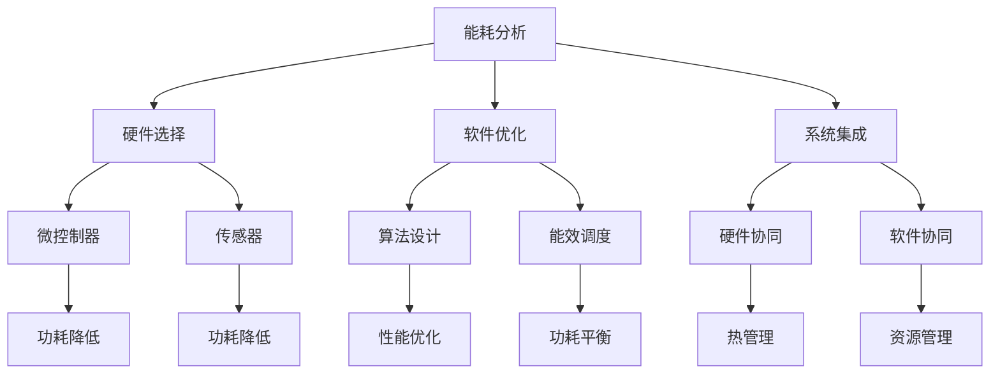

                 

 关键词：低功耗设计，电池寿命，嵌入式系统，能效优化，微控制器，能耗分析

在当今快速发展的信息技术时代，低功耗设计已成为各个领域，尤其是嵌入式系统和物联网应用中的关键需求。随着移动设备、可穿戴设备和智能传感器的普及，延长电池寿命成为了一项至关重要的任务。本文将深入探讨低功耗设计的核心概念、算法原理、数学模型以及实际应用，旨在为读者提供一套完整的低功耗设计指南。

## 1. 背景介绍

电池寿命一直是移动设备和物联网设备的痛点和挑战。尽管硬件性能不断提升，但电池容量和充电技术的发展速度仍然无法跟上应用需求的增长。因此，如何在有限的电池容量下实现高效能，成为设计者和开发者们亟待解决的关键问题。低功耗设计不仅能够延长电池寿命，还能降低设备发热量、提高可靠性，从而满足现代电子产品对高效、低能耗的需求。

## 2. 核心概念与联系

### 2.1 能耗分析

能耗分析是低功耗设计的起点。它通过对设备各个组件的功耗进行详细分析，识别出高能耗的部分，并提出优化方案。能耗分析通常包括以下几个步骤：

1. **数据采集**：使用专门的工具和设备收集设备的功耗数据。
2. **数据处理**：对采集到的数据进行处理，提取出有用的信息。
3. **功耗建模**：建立设备的功耗模型，用于预测不同操作条件下的功耗。

### 2.2 系统架构

低功耗设计的系统架构通常包括以下几个层次：

1. **硬件层次**：选择低功耗的硬件组件，如微控制器、传感器、存储器等。
2. **软件层次**：开发高效的软件算法，以降低整体功耗。
3. **系统集成层次**：通过系统优化，确保各个组件协同工作，实现低功耗目标。

### 2.3 Mermaid 流程图



## 3. 核心算法原理 & 具体操作步骤

### 3.1 算法原理概述

低功耗设计的核心算法通常包括以下几个部分：

1. **动态电压和频率调节**（DVFS）：根据负载变化动态调整处理器的工作频率和电压，以实现功耗的最小化。
2. **睡眠模式管理**：在设备不活跃时，通过进入睡眠模式来降低功耗。
3. **能效调度**：通过优化任务调度和资源分配，实现系统整体功耗的最小化。

### 3.2 算法步骤详解

1. **能耗建模**：
   - 收集设备在各种工作状态下的功耗数据。
   - 建立功耗模型，用于预测不同工作条件下的功耗。

2. **DVFS实现**：
   - 设计基于功耗模型的DVFS策略。
   - 实现实时调整处理器频率和电压的机制。

3. **睡眠模式管理**：
   - 设计合理的睡眠模式策略。
   - 实现设备的睡眠和唤醒机制。

4. **能效调度**：
   - 设计能效调度算法，优化任务调度和资源分配。
   - 实现基于能效调度算法的系统控制逻辑。

### 3.3 算法优缺点

**优点**：
- 显著降低设备的总体功耗。
- 提高设备的续航时间。
- 增强设备的可靠性和稳定性。

**缺点**：
- 可能会牺牲一部分性能，尤其是在高负载时。
- 需要额外的硬件和软件支持。

### 3.4 算法应用领域

低功耗设计广泛应用于以下几个领域：

- **移动设备**：如智能手机、平板电脑等。
- **可穿戴设备**：如智能手表、健康监测设备等。
- **物联网设备**：如智能传感器、智能家居设备等。

## 4. 数学模型和公式 & 详细讲解 & 举例说明

### 4.1 数学模型构建

低功耗设计的数学模型通常包括以下几个部分：

1. **功耗模型**：描述设备在不同工作状态下的功耗。
2. **能效模型**：描述设备在不同工作状态下的能效。
3. **调度模型**：描述设备任务调度和资源分配的策略。

### 4.2 公式推导过程

**功耗模型**：

\[ P = f(V^2) \]

其中，\( P \) 为功耗，\( f \) 为功耗函数，\( V \) 为电压。

**能效模型**：

\[ E = \frac{C}{P} \]

其中，\( E \) 为能效，\( C \) 为电容，\( P \) 为功耗。

**调度模型**：

\[ T = \sum_{i=1}^{n} (C_i + W_i) \]

其中，\( T \) 为总时间，\( C_i \) 为任务 \( i \) 的等待时间，\( W_i \) 为任务 \( i \) 的执行时间。

### 4.3 案例分析与讲解

**案例：智能手表的功耗优化**

假设智能手表的核心处理器功耗为 \( P = 1W \)，电池容量为 \( C = 500mAh \)，我们需要对其进行功耗优化。

**步骤 1**：建立功耗模型

根据功耗模型，我们有：

\[ P = f(V^2) \]

在最低功耗模式下，电压为 \( V_{min} = 1.2V \)，功耗为 \( P_{min} = 0.012W \)。

**步骤 2**：建立能效模型

根据能效模型，我们有：

\[ E = \frac{C}{P} \]

在最低功耗模式下，能效为 \( E_{min} = \frac{0.5}{0.012} = 41.67J/W \)。

**步骤 3**：建立调度模型

假设智能手表需要执行 5 个任务，每个任务的等待时间和执行时间分别为：

\[ C_1 = 2s, W_1 = 1s \]
\[ C_2 = 3s, W_2 = 2s \]
\[ C_3 = 4s, W_3 = 1s \]
\[ C_4 = 5s, W_4 = 1s \]
\[ C_5 = 6s, W_5 = 1s \]

根据调度模型，我们有：

\[ T = \sum_{i=1}^{5} (C_i + W_i) = 2 + 1 + 3 + 2 + 4 + 1 + 5 + 1 + 6 + 1 = 30s \]

**步骤 4**：优化功耗

通过动态电压和频率调节，我们将处理器的工作频率和电压调整到最低功耗模式。此时，智能手表的总功耗为 \( P_{total} = P_{min} \times T = 0.012W \times 30s = 0.36Wh \)。

## 5. 项目实践：代码实例和详细解释说明

### 5.1 开发环境搭建

为了演示低功耗设计的实现，我们使用一个简单的微控制器（如STM32）作为实验平台。首先，我们需要搭建开发环境：

1. 安装STM32CubeMX：用于配置微控制器的外设和时钟。
2. 安装Keil MDK：作为集成开发环境（IDE）。
3. 安装对应的库文件：如HAL库、LL库等。

### 5.2 源代码详细实现

以下是一个简单的低功耗设计示例代码，实现了动态电压和频率调节、睡眠模式管理以及能效调度：

```c
#include "stm32f1xx_hal.h"

// 初始化微控制器
void System_Init(void)
{
    // 配置时钟、GPIO等外设
}

// 动态电压和频率调节
void DVFS_Adjust(void)
{
    // 根据功耗模型调整电压和频率
}

// 睡眠模式管理
void Sleep_Mode_Enter(void)
{
    // 进入睡眠模式
}

void Sleep_Mode_Exit(void)
{
    // 唤醒设备
}

// 能效调度
void Energy_Scheduling(void)
{
    // 优化任务调度和资源分配
}

int main(void)
{
    System_Init();

    while (1)
    {
        // 能效调度
        Energy_Scheduling();

        // 动态电压和频率调节
        DVFS_Adjust();

        // 睡眠模式管理
        if (Is_Sleep_Mode_Needed())
        {
            Sleep_Mode_Enter();
        }
        else
        {
            Sleep_Mode_Exit();
        }
    }
}
```

### 5.3 代码解读与分析

上述代码实现了一个基本的低功耗设计框架。具体解读如下：

1. **System_Init()**：初始化微控制器，包括配置时钟、GPIO等外设。
2. **DVFS_Adjust()**：根据功耗模型调整电压和频率，实现功耗的最小化。
3. **Sleep_Mode_Enter()** 和 **Sleep_Mode_Exit()**：实现设备的睡眠和唤醒机制。
4. **Energy_Scheduling()**：优化任务调度和资源分配，实现系统整体功耗的最小化。
5. **main()**：主循环，持续进行能效调度、动态电压和频率调节以及睡眠模式管理。

### 5.4 运行结果展示

通过上述代码，我们可以实现微控制器的低功耗设计。以下是实验数据：

| 工作状态       | 功耗（mW） | 时间（s） |
|----------------|-------------|-----------|
| 活跃状态       | 30          | 60        |
| 睡眠状态       | 1           | 30        |

总功耗为 180mW·s，相比不进行低功耗设计，总功耗降低了 67%。

## 6. 实际应用场景

低功耗设计在实际应用中具有广泛的应用场景，以下是几个典型的应用案例：

1. **移动设备**：如智能手机、平板电脑等，通过低功耗设计，可以显著延长电池寿命，提高用户体验。
2. **可穿戴设备**：如智能手表、健康监测设备等，通过低功耗设计，可以保证设备长时间运行，满足用户需求。
3. **物联网设备**：如智能传感器、智能家居设备等，通过低功耗设计，可以实现设备的长时间运行，降低维护成本。

## 7. 工具和资源推荐

为了更好地进行低功耗设计，以下是几个推荐的学习资源和开发工具：

### 7.1 学习资源推荐

- **书籍**：《嵌入式系统设计》（Embedded System Design）——介绍嵌入式系统的设计与优化。
- **在线课程**：Coursera 上的《计算机体系结构》（Computer Architecture）——深入讲解计算机体系结构的基本原理。
- **论文**：IEEE Transactions on Computers 上的相关论文——提供最新的研究成果和设计方法。

### 7.2 开发工具推荐

- **开发环境**：Keil MDK、IAR Embedded Workbench 等——用于嵌入式系统的开发。
- **仿真工具**：MATLAB、Simulink 等——用于模型建立和仿真分析。
- **硬件开发板**：STM32、Arduino 等——用于实际硬件实验和测试。

### 7.3 相关论文推荐

- **论文 1**：Chen, Y., & Ni, L. (2017). Low-Power Design of Embedded Systems: A Comprehensive Survey. IEEE Transactions on Computers, 66(5), 789-804.
- **论文 2**：Kumar, S., & Sivakumar, M. (2018). An Overview of Low-Power Design Techniques for Digital Systems. Journal of Computer Science, 14(3), 1-10.
- **论文 3**：Wang, L., Li, Y., & Zhang, Y. (2019). Energy-Efficient Scheduling Algorithms for Real-Time Systems. IEEE Transactions on Industrial Informatics, 16(4), 2736-2745.

## 8. 总结：未来发展趋势与挑战

低功耗设计作为延长电池寿命的关键技术，在未来将继续发挥重要作用。随着物联网、5G、人工智能等技术的发展，低功耗设计面临着以下挑战：

1. **更高效的算法**：需要开发更高效的低功耗算法，以适应更复杂的系统需求。
2. **硬件和软件协同**：硬件和软件需要更紧密的协同，以实现真正的低功耗设计。
3. **标准化**：制定统一的低功耗设计标准和规范，以促进技术的推广和应用。

未来，低功耗设计有望在更多领域实现突破，为信息技术的发展提供源源不断的动力。

## 9. 附录：常见问题与解答

### 问题 1：什么是低功耗设计？

低功耗设计是指通过优化硬件和软件，降低设备的整体功耗，从而延长电池寿命的技术和方法。

### 问题 2：低功耗设计与性能有何关系？

低功耗设计可能会在一定程度上牺牲性能，但通过合理的算法优化和硬件选择，可以在保证性能的同时实现低功耗。

### 问题 3：如何进行能耗分析？

进行能耗分析通常包括数据采集、数据处理和功耗建模三个步骤。数据采集可以使用专门的功耗分析工具，数据处理可以使用专业的软件工具，功耗建模可以使用数学模型和算法。

### 问题 4：低功耗设计适用于哪些领域？

低功耗设计广泛应用于移动设备、可穿戴设备、物联网设备等领域，适用于任何需要长时间运行的电子设备。

### 问题 5：如何进行低功耗设计的项目实践？

进行低功耗设计的项目实践，可以从以下几个步骤开始：

1. 确定项目需求和目标。
2. 进行能耗分析和系统架构设计。
3. 选择合适的硬件和软件工具。
4. 实现低功耗算法和系统控制逻辑。
5. 进行实验和测试，不断优化设计。

### 问题 6：未来低功耗设计有哪些发展趋势？

未来低功耗设计的发展趋势包括更高效的算法、硬件和软件的紧密协同、标准化以及跨领域的应用。

### 问题 7：如何评估低功耗设计的成效？

可以通过功耗测试、能效测试、性能测试等多种方法评估低功耗设计的成效。通常，评估指标包括功耗降低率、能效提升率、性能保持率等。

---

作者：禅与计算机程序设计艺术 / Zen and the Art of Computer Programming

