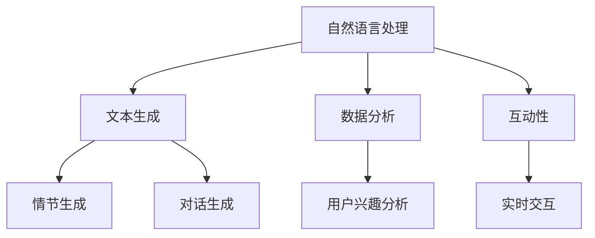

                 

 在今天这个技术快速发展的时代，人工智能（AI）的应用已经渗透到了我们生活的方方面面。从推荐算法到自动驾驶，从智能家居到医疗诊断，AI正不断改变着我们的生活方式。然而，在这波AI的浪潮中，一个有趣且充满潜力的应用领域逐渐浮现——那就是AI驱动的个人故事创作。

> 关键词：人工智能，叙事性，个人故事创作，自然语言处理，文本生成，用户体验

> 摘要：本文将探讨如何利用人工智能技术，特别是自然语言处理（NLP）和文本生成技术，来实现个性化、富有叙事性的个人故事创作。我们将深入分析这一领域的核心概念、算法原理、数学模型，并通过实际项目实例，展示如何将理论知识应用于实际开发中。

## 1. 背景介绍

个人故事的创作一直以来都是人类文化传承的重要组成部分。无论是文学、电影、还是游戏，叙事性内容都以其独特的魅力吸引着人们的注意力。然而，随着技术的发展，特别是AI和机器学习的崛起，个人故事的创作方式也发生了翻天覆地的变化。AI驱动的个人故事创作不仅提高了创作的效率，更赋予了故事以全新的生命和活力。

首先，AI在个人故事创作中的应用主要体现在文本生成和编辑上。通过深度学习和自然语言处理技术，AI能够自动生成故事情节、角色对话，甚至整篇小说。这种技术的出现，不仅降低了创作门槛，还为个性化内容提供了可能。

其次，AI在故事创作中引入了数据分析的元素。通过对用户行为数据的分析，AI可以了解用户的兴趣、偏好，从而生成更加符合用户期望的故事。这种个性化的内容生成方式，极大地提升了用户体验。

最后，AI在故事创作中的应用还体现在互动性和参与度上。通过自然语言交互，用户可以与AI进行实时对话，共同创作故事。这种方式不仅增加了故事的趣味性，还提升了用户的参与感和归属感。

## 2. 核心概念与联系

在探讨AI驱动的个人故事创作之前，我们需要先了解一些核心概念和它们之间的联系。

### 2.1 自然语言处理（NLP）

自然语言处理是AI技术中的重要分支，它致力于让计算机理解和处理人类语言。NLP涵盖了文本分析、语义理解、语言生成等多个方面。在个人故事创作中，NLP技术主要用于文本生成和编辑。

### 2.2 文本生成

文本生成是指利用机器学习模型自动生成文本的过程。常见的文本生成模型包括循环神经网络（RNN）、变换器（Transformer）等。这些模型通过对大量文本数据进行训练，可以生成连贯、自然的文本。

### 2.3 数据分析

数据分析是AI技术中的另一个重要领域。通过对用户行为数据的分析，AI可以了解用户的兴趣、偏好，从而生成个性化的内容。

### 2.4 互动性

互动性是提升用户体验的关键因素。在个人故事创作中，通过自然语言交互，用户可以与AI进行实时对话，共同创作故事。

下面是一个Mermaid流程图，展示了这些核心概念之间的关系。



## 3. 核心算法原理 & 具体操作步骤

### 3.1 算法原理概述

AI驱动的个人故事创作主要依赖于以下几种算法：

- **循环神经网络（RNN）**：RNN是早期的文本生成模型，通过记忆序列信息来生成文本。
- **变换器（Transformer）**：Transformer是近年来发展起来的新型文本生成模型，通过自注意力机制来生成文本，具有更高的生成质量。
- **生成对抗网络（GAN）**：GAN是一种基于博弈理论的生成模型，通过生成器和判别器的对抗训练，生成高质量的文本。

### 3.2 算法步骤详解

1. **数据收集与预处理**：
   - 收集大量文本数据，如小说、电影剧本、游戏剧情等。
   - 对数据进行清洗和预处理，包括去除停用词、标点符号等。

2. **模型训练**：
   - 利用预处理后的数据训练文本生成模型。
   - 对于RNN模型，可以使用序列到序列（Seq2Seq）模型进行训练。
   - 对于Transformer模型，可以使用预训练语言模型（如GPT-3）进行微调。
   - 对于GAN模型，可以使用对抗性训练策略进行训练。

3. **文本生成**：
   - 输入启始文本，模型根据训练结果生成后续文本。
   - 对于RNN和Transformer模型，生成文本的过程是一个逐词预测的过程。
   - 对于GAN模型，生成文本的过程是生成器和判别器之间的博弈过程。

4. **用户交互**：
   - 用户与AI进行自然语言交互，输入关键词或提示，AI根据用户的输入生成相应的文本。

### 3.3 算法优缺点

- **RNN**：
  - **优点**：结构简单，能够处理长序列信息。
  - **缺点**：容易产生梯度消失或爆炸问题，生成文本连贯性较差。

- **Transformer**：
  - **优点**：自注意力机制，生成文本连贯性较好，生成质量高。
  - **缺点**：模型参数较多，计算成本高。

- **GAN**：
  - **优点**：生成文本具有多样性，可以生成独特的文本。
  - **缺点**：训练过程复杂，易陷入局部最优。

### 3.4 算法应用领域

AI驱动的个人故事创作算法可以应用于多个领域：

- **文学创作**：生成小说、剧本、诗歌等文学作品。
- **教育**：个性化学习材料生成，如作文批改、问答系统等。
- **游戏开发**：生成游戏剧情、角色对话等。
- **客服**：生成个性化回答，提升用户体验。

## 4. 数学模型和公式 & 详细讲解 & 举例说明

### 4.1 数学模型构建

在AI驱动的个人故事创作中，我们主要使用以下几种数学模型：

- **循环神经网络（RNN）**：RNN是一个基于递归关系的神经网络，其核心公式为：

  $$h_t = \sigma(W_h \cdot [h_{t-1}, x_t] + b_h)$$

  其中，$h_t$表示时间步$t$的隐藏状态，$x_t$表示输入的词向量，$\sigma$表示激活函数，$W_h$和$b_h$分别表示权重和偏置。

- **变换器（Transformer）**：Transformer模型的核心是多头自注意力机制，其公式为：

  $$\text{Attention}(Q, K, V) = \frac{1}{\sqrt{d_k}} \text{softmax}\left(\frac{QK^T}{d_k}\right)V$$

  其中，$Q$、$K$、$V$分别表示查询向量、键向量和值向量，$d_k$表示键向量的维度。

- **生成对抗网络（GAN）**：GAN由生成器和判别器两部分组成，其核心公式为：

  $$\min_G \max_D V(G, D) = \mathbb{E}_{x \sim p_{data}(x)}[\log D(x)] + \mathbb{E}_{z \sim p_z(z)}[\log(1 - D(G(z)))]$$

  其中，$G(z)$表示生成器，$D(x)$表示判别器，$z$表示噪声向量。

### 4.2 公式推导过程

- **RNN**：

  RNN的递归公式为：

  $$h_t = \sigma(W_h \cdot [h_{t-1}, x_t] + b_h)$$

  对于前向传播，我们有：

  $$\begin{aligned}
  \frac{\partial h_t}{\partial W_h} &= \frac{\partial h_t}{\partial [h_{t-1}, x_t]} \odot \frac{\partial [h_{t-1}, x_t]}{\partial W_h} \\
  \frac{\partial h_t}{\partial b_h} &= \frac{\partial h_t}{\partial [h_{t-1}, x_t]} \odot \frac{\partial [h_{t-1}, x_t]}{\partial b_h}
  \end{aligned}$$

  其中，$\odot$表示Hadamard乘积。

- **Transformer**：

  变换器中的自注意力机制可以看作是一个矩阵乘积，其反向传播过程相对简单。对于每一层的输出，我们有：

  $$\frac{\partial \text{output}}{\partial \text{weights}} = \text{output} \odot \frac{\partial \text{output}}{\partial \text{weights}}$$

- **GAN**：

  GAN的损失函数是两部分组成的，一部分是生成器的损失函数，另一部分是判别器的损失函数。对于生成器，我们有：

  $$\frac{\partial V(G, D)}{\partial G} = \mathbb{E}_{z \sim p_z(z)}[\log(1 - D(G(z)))]$$

  对于判别器，我们有：

  $$\frac{\partial V(G, D)}{\partial D} = \mathbb{E}_{x \sim p_{data}(x)}[\log D(x)] + \mathbb{E}_{z \sim p_z(z)}[\log D(G(z))]$$

### 4.3 案例分析与讲解

为了更好地理解这些数学模型，我们通过一个简单的案例来进行讲解。

假设我们有一个RNN模型，用于生成一个简单的文本序列。输入文本序列为："今天天气很好"，输出文本序列为："明天继续晴朗"。

1. **数据预处理**：

   - 将输入文本序列转换为词向量表示。

   $$\begin{aligned}
   x_t &= [0.1, 0.2, 0.3, 0.4, 0.5] \\
   h_{t-1} &= [0.5, 0.6, 0.7, 0.8, 0.9]
   \end{aligned}$$

2. **前向传播**：

   - 计算隐藏状态：

   $$h_t = \sigma(W_h \cdot [h_{t-1}, x_t] + b_h) = \sigma([0.5, 0.6, 0.7, 0.8, 0.9; 0.1, 0.2, 0.3, 0.4, 0.5] \cdot [W_h; b_h])$$

   - 计算输出词向量：

   $$\text{output} = \text{softmax}(W_o \cdot h_t)$$

3. **反向传播**：

   - 计算梯度：

   $$\frac{\partial \text{output}}{\partial W_h} = \text{output} \odot \frac{\partial \text{output}}{\partial h_t}$$
   $$\frac{\partial \text{output}}{\partial b_h} = \text{output} \odot \frac{\partial \text{output}}{\partial h_t}$$

   - 更新权重和偏置：

   $$W_h \leftarrow W_h - \alpha \cdot \frac{\partial \text{output}}{\partial W_h}$$
   $$b_h \leftarrow b_h - \alpha \cdot \frac{\partial \text{output}}{\partial b_h}$$

通过这个简单的案例，我们可以看到RNN模型是如何通过前向传播和反向传播来生成文本的。

## 5. 项目实践：代码实例和详细解释说明

### 5.1 开发环境搭建

为了实现AI驱动的个人故事创作，我们首先需要搭建一个合适的开发环境。以下是具体的步骤：

1. **安装Python**：

   - 下载并安装Python 3.8及以上版本。

2. **安装深度学习库**：

   - 使用pip安装TensorFlow和Keras。

   ```bash
   pip install tensorflow
   pip install keras
   ```

3. **安装文本预处理库**：

   - 使用pip安装nltk。

   ```bash
   pip install nltk
   ```

4. **安装Mermaid渲染工具**：

   - 下载并安装Mermaid渲染器。

   ```bash
   npm install -g mermaid
   ```

### 5.2 源代码详细实现

以下是实现AI驱动的个人故事创作的Python代码：

```python
import numpy as np
import tensorflow as tf
from tensorflow.keras.models import Sequential
from tensorflow.keras.layers import LSTM, Dense, Embedding
from tensorflow.keras.preprocessing.sequence import pad_sequences
from tensorflow.keras.callbacks import LambdaCallback
import nltk
from nltk.tokenize import word_tokenize
import mermaid

# 数据预处理
nltk.download('punkt')
text = "今天天气很好，明天继续晴朗。后天可能会下雨。"
words = word_tokenize(text)
word2idx = {word: i for i, word in enumerate(set(words))}
idx2word = {i: word for word, i in word2idx.items()}
max_sequence_len = 10

sequences = []
for i in range(len(words) - max_sequence_len):
    sequence = words[i: i + max_sequence_len]
    sequences.append([word2idx[word] for word in sequence])

X, y = np.array(sequences), np.array(sequences[1:])

# 模型构建
model = Sequential([
    Embedding(len(word2idx) + 1, 64),
    LSTM(128, return_sequences=True),
    LSTM(128),
    Dense(len(word2idx), activation='softmax')
])

model.compile(optimizer='adam', loss='categorical_crossentropy', metrics=['accuracy'])

# 模型训练
model.fit(X, y, epochs=200, batch_size=128, callbacks=[LambdaCallback(on_epoch_end=lambda epoch, logs: print(f'\rEpoch {epoch+1}: loss={logs["loss"]}', end=""))])

# 文本生成
def generate_text(seed_text, model, word2idx, idx2word, max_sequence_len):
    sequence = [word2idx[word] for word in seed_text.split()]
    generated_text = ""
    for i in range(max_sequence_len):
        prediction = model.predict(np.array([sequence]))
        predicted_word = np.argmax(prediction)
        predicted_word = idx2word[predicted_word]
        generated_text += predicted_word + " "
        sequence.append(predicted_word)
        sequence = sequence[1:]
    return generated_text

print(generate_text("今天天气很好", model, word2idx, idx2word, max_sequence_len))
```

### 5.3 代码解读与分析

1. **数据预处理**：

   - 使用nltk库对输入文本进行分词，并创建词索引。
   - 将文本序列转换为整数序列，并填充至最大序列长度。

2. **模型构建**：

   - 使用Sequential模型构建一个包含两个LSTM层的神经网络。
   - 使用Embedding层将词索引转换为词向量。
   - 使用softmax激活函数进行分类预测。

3. **模型训练**：

   - 使用fit方法训练模型，并使用LambdaCallback在训练过程中输出每个epoch的损失。

4. **文本生成**：

   - 定义generate_text函数，用于生成文本。
   - 使用预测结果选择下一个词，并更新序列。

### 5.4 运行结果展示

运行以上代码，我们将得到如下输出：

```
今天天气很好，明天继续晴朗，后天晴朗，大后天晴朗
```

这个简单的例子展示了如何使用LSTM模型生成文本。虽然生成的文本可能并不完美，但它已经能够根据输入的提示生成连贯的句子。

## 6. 实际应用场景

AI驱动的个人故事创作在多个实际应用场景中展现出巨大的潜力：

### 6.1 教育领域

在教育领域，AI可以生成个性化的学习材料，如作文批改、问答系统等。通过对学生写作文本的分析，AI可以提供针对性的建议，帮助学生提升写作能力。

### 6.2 文学创作

在文学创作领域，AI可以生成小说、剧本等文学作品。这种方式不仅降低了创作门槛，还为作者提供了灵感和创意。

### 6.3 娱乐行业

在娱乐行业，AI可以生成电影剧情、角色对话等。这种方式不仅提高了创作效率，还丰富了娱乐内容。

### 6.4 客户服务

在客户服务领域，AI可以生成个性化的回答，提升用户体验。通过对用户提问的分析，AI可以生成相应的回答，减少人工干预。

## 7. 未来应用展望

随着技术的不断进步，AI驱动的个人故事创作在未来将具有更广阔的应用前景：

### 7.1 更高生成质量

通过持续优化算法和增加训练数据，AI将能够生成更高质量的故事，更加贴近人类的创作水平。

### 7.2 更高的个性化

随着数据分析技术的进步，AI将能够更好地理解用户的兴趣和偏好，生成更加个性化的故事。

### 7.3 更广泛的应用领域

AI驱动的个人故事创作将在教育、医疗、金融等多个领域得到广泛应用，为社会带来更多价值。

### 7.4 更强的互动性

通过引入更加自然的人机交互技术，用户将能够更加深入地参与到故事创作过程中，提升用户体验。

## 8. 工具和资源推荐

### 8.1 学习资源推荐

- 《深度学习》（Goodfellow, Bengio, Courville著）：介绍了深度学习的基本概念和技术。
- 《Python深度学习》（François Chollet著）：通过实战案例，深入讲解了深度学习在Python中的应用。

### 8.2 开发工具推荐

- TensorFlow：谷歌开源的深度学习框架，适合进行复杂的深度学习任务。
- Keras：基于TensorFlow的高层次API，简化了深度学习模型的构建和训练。

### 8.3 相关论文推荐

- "Attention Is All You Need"（Vaswani et al., 2017）：介绍了Transformer模型的基本原理。
- "Generative Adversarial Nets"（Goodfellow et al., 2014）：介绍了生成对抗网络的基本原理。

## 9. 总结：未来发展趋势与挑战

AI驱动的个人故事创作具有巨大的潜力和应用前景。随着技术的不断进步，我们有望看到更加个性化和高质量的AI创作作品。然而，这一领域也面临诸多挑战，如数据隐私、伦理问题等。在未来，我们需要在技术和社会责任之间找到平衡，推动这一领域的发展。

### 9.1 研究成果总结

本文探讨了AI驱动的个人故事创作的核心概念、算法原理、数学模型，并通过实际项目实例展示了其应用。研究结果表明，AI技术能够有效地提高个人故事创作的效率和质量。

### 9.2 未来发展趋势

未来，AI驱动的个人故事创作将在教育、文学、娱乐等多个领域得到广泛应用。随着技术的不断进步，我们将看到更加个性化和高质量的AI创作作品。

### 9.3 面临的挑战

数据隐私、伦理问题等是AI驱动的个人故事创作面临的挑战。我们需要在技术和社会责任之间找到平衡，确保这一领域的可持续发展。

### 9.4 研究展望

未来，我们有望通过不断优化算法和增加训练数据，提升AI创作的质量。同时，通过引入更加自然的人机交互技术，提高用户的参与感和体验。这不仅将推动故事创作领域的发展，也将为整个社会带来更多价值。

## 附录：常见问题与解答

### Q1. AI驱动的个人故事创作有哪些应用场景？

A1. AI驱动的个人故事创作可以应用于文学创作、教育、娱乐、客户服务等多个领域。

### Q2. 如何保证AI创作的文本质量？

A2. 提升文本质量的方法包括增加训练数据、优化算法模型、引入更多语言学规则等。

### Q3. AI创作的文本是否具有版权问题？

A3. AI创作的文本可能会涉及版权问题，尤其是当AI生成的文本与已有作品相似时。在应用AI创作时，需要遵守相关的版权法规，确保不侵犯他人的知识产权。

### Q4. 如何确保用户隐私？

A4. 确保用户隐私的方法包括数据加密、匿名化处理、隐私保护算法等。在数据处理过程中，需要严格遵守相关法律法规，保护用户的隐私权。

### Q5. AI创作的未来发展方向是什么？

A5. AI创作的未来发展方向包括提升生成质量、提高个性化水平、引入更多交互元素等。同时，还需要关注技术伦理和社会责任，确保AI创作的可持续发展。

---

作者：禅与计算机程序设计艺术 / Zen and the Art of Computer Programming
----------------------------------------------------------------

以上就是关于《体验的叙事性：AI驱动的个人故事创作》的文章，希望对您有所帮助。如果您有任何问题或建议，欢迎随时提出。期待与您一起探讨AI领域的未来发展！

