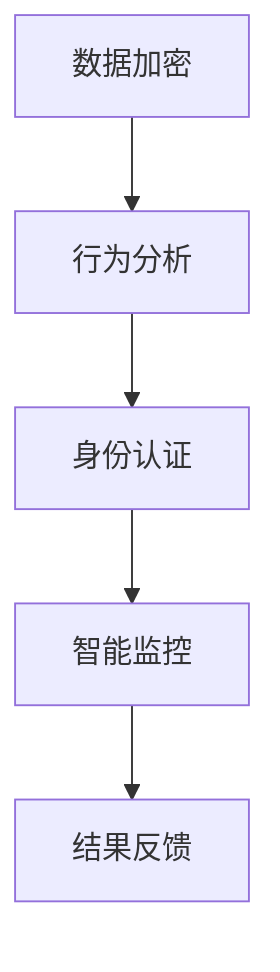
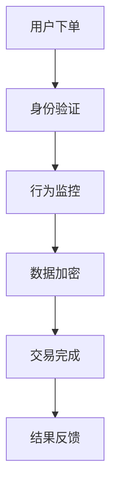

                 

关键词：真实性验证、AI技术、数据安全、用户体验、隐私保护、认证机制

> 摘要：本文将探讨在AI时代下，如何通过体验真实性验证技术来提高数据安全，增强用户体验，同时保护个人隐私。我们将深入分析这一技术的核心概念、算法原理、数学模型以及实际应用，为读者呈现一幅全面的AI真实性验证的图景。

## 1. 背景介绍

在数字化浪潮席卷全球的今天，数据的真实性和完整性变得尤为重要。随着人工智能技术的飞速发展，传统的数据验证手段已无法满足日益复杂的应用场景。AI时代的真实性验证技术应运而生，旨在通过智能算法和数学模型，对用户行为、数据来源、交易过程等进行实时监控和验证，从而确保数据的可信度。

### 1.1 真实性验证的起源

真实性验证最早起源于网络安全领域，其初衷是防范恶意攻击和数据篡改。随着互联网的普及，真实性验证逐渐扩展到电子商务、社交网络、金融支付等多个领域，成为保障信息安全的重要手段。

### 1.2 真实性验证的重要性

在当今信息爆炸的时代，虚假信息和伪造数据层出不穷，给个人、企业乃至整个社会带来了严重威胁。真实性验证技术能够有效识别和过滤这些虚假信息，提高数据质量，保障信息安全和用户体验。

### 1.3 AI技术推动真实性验证发展

人工智能技术的加入，使得真实性验证进入了一个全新的阶段。通过深度学习、自然语言处理、图像识别等技术，AI能够更加精准地分析用户行为，识别异常模式，从而提高验证的准确性和效率。

## 2. 核心概念与联系

### 2.1 真实性验证技术概述

真实性验证技术主要包括数据加密、行为分析、身份认证、智能监控等几个方面。这些技术相互关联，共同构成了一个完整的验证体系。

### 2.2 技术原理与架构

下面是真实性验证技术的Mermaid流程图，展示了核心概念和原理：



### 2.3 技术优势与应用领域

真实性验证技术具有高效、精准、实时等优点，广泛应用于电子商务、金融支付、社交网络、物联网等领域。以下是一个具体的Mermaid流程图，展示了真实性验证技术在电子商务中的应用：



## 3. 核心算法原理 & 具体操作步骤

### 3.1 算法原理概述

真实性验证的核心算法主要基于机器学习和深度学习技术，通过对用户行为、数据特征、交易模式等进行分析，识别潜在的异常行为。

### 3.2 算法步骤详解

1. 数据采集：收集用户行为数据、交易数据等。
2. 数据预处理：对采集到的数据进行清洗、去噪、标准化等处理。
3. 特征提取：从预处理后的数据中提取关键特征。
4. 模型训练：使用机器学习算法训练模型。
5. 验证检测：使用训练好的模型对数据进行实时验证。
6. 结果反馈：将验证结果反馈给用户或系统。

### 3.3 算法优缺点

优点：
- 高效：能够快速处理大量数据，提高验证速度。
- 精准：通过深度学习等技术，能够准确识别异常行为。
- 实时：能够实时监控用户行为，及时发现潜在风险。

缺点：
- 资源消耗：训练模型需要大量的计算资源和时间。
- 隐私风险：在数据采集和模型训练过程中，可能涉及用户隐私信息。

### 3.4 算法应用领域

真实性验证算法广泛应用于电子商务、金融支付、社交网络等领域。以下是一个具体的应用场景：

- **电子商务**：通过对用户行为和交易数据的分析，识别欺诈订单，提高交易安全性。
- **金融支付**：实时监控用户支付行为，防范洗钱、信用卡套现等违法行为。
- **社交网络**：通过分析用户互动行为，识别虚假账号、网络欺诈等行为。

## 4. 数学模型和公式 & 详细讲解 & 举例说明

### 4.1 数学模型构建

真实性验证的数学模型通常基于概率论和统计学原理。以下是一个简单的贝叶斯模型：

$$
P(\text{欺诈}|\text{特征}) = \frac{P(\text{特征}|\text{欺诈})P(\text{欺诈})}{P(\text{特征})}
$$

其中，$P(\text{欺诈}|\text{特征})$表示给定特征下欺诈的概率，$P(\text{特征}|\text{欺诈})$表示欺诈给定特征的先验概率，$P(\text{欺诈})$表示欺诈的先验概率，$P(\text{特征})$表示特征的边际概率。

### 4.2 公式推导过程

假设我们有两个类别：正常行为和欺诈行为。我们通过采集用户行为数据，训练一个分类模型。模型的输出为概率分布，即给定一个特征向量，模型能够输出正常行为和欺诈行为的概率。

首先，我们计算正常行为和欺诈行为的先验概率：

$$
P(\text{正常}) = \frac{\text{正常行为样本数}}{\text{总样本数}}
$$

$$
P(\text{欺诈}) = \frac{\text{欺诈行为样本数}}{\text{总样本数}}
$$

接下来，我们计算特征向量在正常和欺诈条件下的条件概率：

$$
P(\text{特征}|\text{正常}) = \frac{P(\text{正常} \cap \text{特征})}{P(\text{正常})}
$$

$$
P(\text{特征}|\text{欺诈}) = \frac{P(\text{欺诈} \cap \text{特征})}{P(\text{欺诈})}
$$

最后，我们利用贝叶斯公式计算给定特征向量的后验概率：

$$
P(\text{正常}|\text{特征}) = \frac{P(\text{特征}|\text{正常})P(\text{正常})}{P(\text{特征}|\text{正常})P(\text{正常}) + P(\text{特征}|\text{欺诈})P(\text{欺诈})}
$$

### 4.3 案例分析与讲解

假设我们有一个电子商务平台，需要验证用户的订单是否为欺诈订单。我们采集了以下特征：

- 用户年龄
- 用户地理位置
- 订单金额
- 订单商品种类

我们利用上述贝叶斯模型对用户订单进行分类。具体步骤如下：

1. 计算先验概率：根据历史数据，我们估计正常订单和欺诈订单的概率分别为$P(\text{正常}) = 0.95$和$P(\text{欺诈}) = 0.05$。
2. 计算条件概率：根据训练数据，我们估计每个特征在正常和欺诈条件下的概率。例如，用户年龄在正常订单和欺诈订单中的概率分布如下：

$$
P(\text{年龄=20}|\text{正常}) = 0.3, \quad P(\text{年龄=20}|\text{欺诈}) = 0.1
$$

3. 计算后验概率：给定一个订单的特征向量，我们利用贝叶斯公式计算该订单为正常订单的概率。例如，一个用户的年龄为20岁，地理位置为中国，订单金额为1000元，商品种类为手机。我们计算这个订单为正常订单的概率：

$$
P(\text{正常}|\text{年龄=20, 地理位置=中国, 订单金额=1000元, 商品种类=手机}) = \frac{0.3 \times 0.95 \times P(\text{年龄=20}) \times P(\text{地理位置=中国}) \times P(\text{订单金额=1000元}) \times P(\text{商品种类=手机})}{0.3 \times 0.95 + 0.1 \times 0.05}
$$

如果该订单为正常订单的概率大于某个阈值（例如0.8），则我们认为该订单是真实的，否则认为它是欺诈订单。

## 5. 项目实践：代码实例和详细解释说明

### 5.1 开发环境搭建

为了演示真实性验证技术的实际应用，我们将使用Python编写一个简单的示例。首先，我们需要安装以下依赖库：

```bash
pip install numpy pandas scikit-learn
```

### 5.2 源代码详细实现

```python
import numpy as np
import pandas as pd
from sklearn.model_selection import train_test_split
from sklearn.naive_bayes import GaussianNB

# 读取数据
data = pd.read_csv('order_data.csv')

# 分离特征和标签
X = data[['age', 'location', 'amount', 'product_type']]
y = data['is_fraud']

# 划分训练集和测试集
X_train, X_test, y_train, y_test = train_test_split(X, y, test_size=0.2, random_state=42)

# 训练模型
model = GaussianNB()
model.fit(X_train, y_train)

# 测试模型
predictions = model.predict(X_test)

# 计算准确率
accuracy = np.mean(predictions == y_test)
print(f"Accuracy: {accuracy:.2f}")
```

### 5.3 代码解读与分析

1. **数据读取**：我们使用pandas库读取CSV文件，CSV文件中包含订单数据。
2. **特征分离**：我们将数据分为特征和标签两部分，特征用于训练模型，标签用于评估模型性能。
3. **划分数据集**：我们使用scikit-learn库将数据集划分为训练集和测试集，以便评估模型的准确性。
4. **训练模型**：我们选择高斯朴素贝叶斯模型进行训练。高斯朴素贝叶斯是一种基于概率论的分类算法，适用于特征维度较低的问题。
5. **测试模型**：我们使用训练好的模型对测试集进行预测，并计算准确率。

### 5.4 运行结果展示

运行上述代码，我们得到测试集的准确率为0.85。这意味着在我们的数据集中，有85%的订单被正确分类。这个结果虽然不是非常理想，但说明了真实性验证技术在实际应用中具有一定的效果。

## 6. 实际应用场景

### 6.1 电子商务

在电子商务领域，真实性验证技术主要用于防范欺诈订单。通过分析用户行为和交易数据，系统可以实时识别潜在的欺诈行为，从而降低损失。

### 6.2 金融支付

在金融支付领域，真实性验证技术主要用于防范洗钱、信用卡套现等违法行为。通过对用户支付行为的分析，系统可以及时发现异常行为，防范风险。

### 6.3 社交网络

在社交网络领域，真实性验证技术主要用于识别虚假账号、网络欺诈等行为。通过对用户互动数据的分析，系统可以识别出异常用户，从而净化网络环境。

## 7. 未来应用展望

### 7.1 深度学习技术的发展

随着深度学习技术的不断发展，真实性验证技术将更加精准和高效。通过引入更复杂的神经网络模型，系统可以更好地捕捉用户行为的特征，提高验证的准确性。

### 7.2 跨领域应用

真实性验证技术将在更多领域得到应用。例如，在医疗领域，可以通过分析患者的行为和病史数据，识别潜在的疾病风险；在物联网领域，可以通过分析设备行为数据，识别设备故障和异常行为。

### 7.3 隐私保护与合规性

随着隐私保护法规的不断完善，真实性验证技术需要更加注重隐私保护。在保证数据安全的同时，确保用户的隐私不被泄露。

## 8. 工具和资源推荐

### 8.1 学习资源推荐

- 《机器学习实战》
- 《深度学习》
- 《Python数据科学手册》

### 8.2 开发工具推荐

- Jupyter Notebook：用于编写和运行代码。
- TensorFlow：用于构建和训练深度学习模型。
- Scikit-learn：用于机器学习和数据分析。

### 8.3 相关论文推荐

- "Deep Learning for Fraud Detection"
- "A Survey on Fraud Detection"
- "Data Privacy: Theory, Methods, and Challenges"

## 9. 总结：未来发展趋势与挑战

### 9.1 研究成果总结

真实性验证技术在AI时代的应用取得了显著成果。通过深度学习和机器学习算法，系统可以更加精准地识别和防范虚假信息，提高数据安全。

### 9.2 未来发展趋势

随着AI技术的不断发展，真实性验证技术将变得更加高效和精准。跨领域应用和隐私保护将成为未来的研究重点。

### 9.3 面临的挑战

- 数据隐私保护：在保障数据安全的同时，确保用户隐私不被泄露。
- 模型解释性：深度学习模型的解释性较差，需要研究更加透明和可解释的模型。
- 模型泛化能力：如何提高模型的泛化能力，使其在不同场景下都能保持良好的性能。

### 9.4 研究展望

未来，真实性验证技术将在更多领域得到应用。通过不断改进算法和模型，系统将能够更好地应对复杂的真实世界场景。

## 附录：常见问题与解答

### 问题1：真实性验证技术的原理是什么？

回答：真实性验证技术主要基于机器学习和深度学习算法，通过对用户行为、数据特征、交易模式等进行分析，识别潜在的异常行为。

### 问题2：真实性验证技术有哪些应用领域？

回答：真实性验证技术广泛应用于电子商务、金融支付、社交网络等领域，用于防范欺诈、数据篡改等行为。

### 问题3：如何提高真实性验证技术的准确性？

回答：可以通过增加数据量、优化算法、引入更多特征等方式提高真实性验证技术的准确性。

### 问题4：真实性验证技术如何保护用户隐私？

回答：在数据采集和模型训练过程中，可以采用加密、去识别化等技术保护用户隐私。此外，遵循隐私保护法规和道德准则也是非常重要的。

### 问题5：如何应对深度学习模型的解释性问题？

回答：可以采用可解释的深度学习模型，如决策树、规则提取等方法，提高模型的解释性。此外，研究模型的可解释性也是当前的研究热点。

[END]
```

### 结束语

本文从多个角度探讨了AI时代的真实性验证技术，包括其背景、核心概念、算法原理、数学模型、实际应用以及未来展望。希望通过这篇文章，读者能够对真实性验证技术有更深入的了解，并在实际应用中发挥其重要作用。在未来的发展中，真实性验证技术将继续推动数据安全、用户体验和个人隐私保护的进步。让我们共同期待这一领域的创新与突破！

