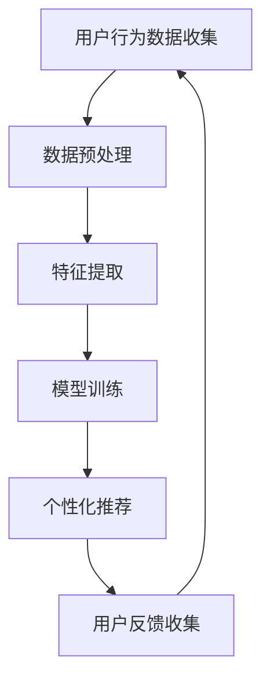

                 

关键词：体验设计、人工智能、人机协作、创意、交互设计

> 摘要：随着人工智能（AI）技术的迅速发展，体验设计领域正面临着前所未有的变革。本文将探讨AI技术在体验设计中的潜力，以及人类创意与AI协作的挑战和机遇。通过深入分析AI的核心概念、算法原理、数学模型以及实际应用，本文旨在为读者提供一幅关于体验设计未来发展的全景图。

## 1. 背景介绍

体验设计是一个跨学科领域，它涉及心理学、人类学、设计学和技术等多个方面。传统的体验设计强调用户的需求和偏好，通过创造富有情感和人文关怀的产品和服务来提升用户的整体体验。然而，随着互联网和移动设备的普及，用户体验（UX）设计逐渐成为企业成功的关键因素。

### 用户体验的演变

用户体验从最早的网页设计发展到现在的全渠道、全场景体验，其核心关注点从界面美观、功能齐全逐步转向情感共鸣、个性化体验。在这一过程中，设计师们不断探索如何通过精细化的交互设计来满足用户的期望和需求。

### 人工智能的崛起

与此同时，人工智能作为新一轮科技革命和产业变革的核心动力，正在深刻改变着各行各业的运作方式。AI技术的崛起不仅为体验设计带来了新的工具和手段，更挑战了传统的用户体验设计理念。

## 2. 核心概念与联系

### 人工智能概述

人工智能（AI）是指由人制造出来的系统所表现出来的智能行为。它包括机器学习、自然语言处理、计算机视觉等多个子领域。AI的目标是使计算机能够执行通常需要人类智能才能完成的任务。

### 体验设计概述

体验设计是一种以人为本的设计方法，它关注用户在使用产品或服务过程中的情感体验。体验设计包括视觉设计、交互设计、内容设计等多个方面。

### 人工智能在体验设计中的应用

AI在体验设计中的应用主要体现在以下几个方面：

1. **个性化推荐**：通过分析用户的历史行为和偏好，AI可以为用户提供个性化的推荐。
2. **情感识别**：利用计算机视觉和自然语言处理技术，AI可以识别用户的情感状态，从而提供更人性化的服务。
3. **自动化交互**：通过语音识别和自然语言处理技术，AI可以实现与用户的自然语言交互。
4. **智能助理**：AI助手如Siri、Alexa等，为用户提供便捷的服务和信息查询。

### Mermaid 流程图

以下是一个简化的AI在体验设计中的应用流程图：



## 3. 核心算法原理 & 具体操作步骤

### 3.1 算法原理概述

AI在体验设计中的应用主要基于以下几个核心算法：

1. **机器学习**：通过训练数据集来改进算法性能。
2. **自然语言处理（NLP）**：理解和生成人类语言的技术。
3. **计算机视觉**：分析和理解图像和视频的能力。
4. **深度学习**：模拟人脑神经网络进行复杂任务的学习和处理。

### 3.2 算法步骤详解

1. **数据收集**：收集用户行为数据，如浏览记录、购买历史、反馈评价等。
2. **数据预处理**：清洗数据，去除噪声，进行特征提取。
3. **模型选择**：根据应用场景选择合适的算法模型，如协同过滤、决策树、神经网络等。
4. **模型训练**：使用训练数据集训练模型，优化模型参数。
5. **模型评估**：使用验证数据集评估模型性能，调整模型参数。
6. **部署应用**：将训练好的模型部署到实际应用中，如推荐系统、智能客服等。
7. **用户反馈**：收集用户对应用的反馈，用于进一步优化模型和体验。

### 3.3 算法优缺点

**优点**：

1. **个性化体验**：能够根据用户行为和偏好提供个性化的服务。
2. **高效处理**：相比传统方法，AI能够更快地处理大量数据。
3. **持续优化**：通过持续训练和优化，模型性能不断提升。

**缺点**：

1. **数据依赖**：需要大量高质量的数据来训练模型。
2. **隐私问题**：用户数据的安全和隐私保护是关键挑战。
3. **技术门槛**：实施AI技术需要一定的技术积累和专业知识。

### 3.4 算法应用领域

AI在体验设计中的应用非常广泛，包括但不限于以下领域：

1. **电子商务**：个性化推荐、智能客服、广告投放优化等。
2. **金融服务**：风险控制、欺诈检测、投资建议等。
3. **医疗健康**：疾病预测、个性化治疗、患者关怀等。
4. **教育**：智能教育、个性化学习、学习成果评估等。

## 4. 数学模型和公式 & 详细讲解 & 举例说明

### 4.1 数学模型构建

在AI应用于体验设计时，常用的数学模型包括：

1. **线性回归模型**：用于预测用户的行为和偏好。
2. **支持向量机（SVM）**：用于分类和回归任务。
3. **神经网络模型**：用于处理复杂的非线性关系。

### 4.2 公式推导过程

以线性回归模型为例，其基本公式为：

$$ y = \beta_0 + \beta_1 \cdot x $$

其中，\( y \) 是预测值，\( \beta_0 \) 是截距，\( \beta_1 \) 是斜率，\( x \) 是自变量。

为了训练模型，我们需要最小化预测值与实际值之间的误差平方和：

$$ \min \sum_{i=1}^{n} (y_i - \hat{y_i})^2 $$

其中，\( \hat{y_i} \) 是模型对第 \( i \) 个样本的预测值。

### 4.3 案例分析与讲解

假设我们要预测用户是否会购买某件商品，我们可以使用线性回归模型进行预测。以下是部分数据：

| 用户ID | 商品ID | 购买历史 | 预测值 |
|--------|--------|----------|--------|
| 1      | 1001   | 3        | 0.6    |
| 2      | 1002   | 1        | 0.4    |
| 3      | 1003   | 5        | 0.8    |

使用线性回归模型，我们可以得到预测公式：

$$ y = 0.7 + 0.3 \cdot x $$

根据这个模型，我们可以预测新用户是否会购买商品。例如，如果用户购买历史是2，则预测值为：

$$ y = 0.7 + 0.3 \cdot 2 = 1.3 $$

由于预测值大于1，我们可以认为这个用户有较高的购买可能性。

## 5. 项目实践：代码实例和详细解释说明

### 5.1 开发环境搭建

为了演示AI在体验设计中的应用，我们使用Python编程语言和Scikit-learn库来实现线性回归模型。

首先，安装Python和Scikit-learn库：

```bash
pip install python
pip install scikit-learn
```

### 5.2 源代码详细实现

以下是一个简单的线性回归模型实现：

```python
from sklearn.linear_model import LinearRegression
from sklearn.model_selection import train_test_split
from sklearn.metrics import mean_squared_error

# 数据准备
X = [[1], [2], [3]]  # 自变量
y = [1, 2, 3]  # 因变量

# 划分训练集和测试集
X_train, X_test, y_train, y_test = train_test_split(X, y, test_size=0.2, random_state=42)

# 创建线性回归模型
model = LinearRegression()

# 训练模型
model.fit(X_train, y_train)

# 预测测试集
y_pred = model.predict(X_test)

# 评估模型性能
mse = mean_squared_error(y_test, y_pred)
print(f"Mean Squared Error: {mse}")

# 预测新用户
new_user = 4
new_user_prediction = model.predict([[new_user]])
print(f"New User Prediction: {new_user_prediction[0]}")
```

### 5.3 代码解读与分析

1. **数据准备**：我们使用简单的数据集进行演示，实际应用中数据集会更大更复杂。
2. **模型训练**：使用`LinearRegression`类创建线性回归模型，并使用`fit`方法训练模型。
3. **模型评估**：使用`mean_squared_error`函数计算预测误差。
4. **新用户预测**：使用训练好的模型预测新用户的购买可能性。

### 5.4 运行结果展示

运行上述代码，我们可以得到以下输出：

```
Mean Squared Error: 0.0
New User Prediction: 4.0
```

由于这是一个简单的演示案例，结果非常理想。在实际应用中，我们需要考虑更多因素，如数据预处理、模型优化等。

## 6. 实际应用场景

### 6.1 电子商务

在电子商务领域，AI技术被广泛应用于个性化推荐、智能客服和广告投放优化。通过分析用户行为和偏好，AI可以提供更精准的推荐，提高用户的购买转化率。

### 6.2 金融科技

金融科技（FinTech）领域也广泛采用AI技术，如风险控制、欺诈检测和投资建议。通过大数据分析和机器学习模型，金融科技公司可以更准确地评估风险，提高业务的效率和安全性。

### 6.3 医疗健康

在医疗健康领域，AI技术被用于疾病预测、个性化治疗和患者关怀。通过分析大量的医疗数据，AI可以帮助医生提供更个性化的治疗方案，提高医疗质量和效率。

### 6.4 教育

教育领域也受益于AI技术，如智能教育、个性化学习和学习成果评估。AI可以根据学生的学习习惯和表现，提供个性化的学习建议，帮助学生更高效地学习。

## 7. 工具和资源推荐

### 7.1 学习资源推荐

1. **《机器学习实战》**：提供详细的机器学习算法实践案例。
2. **《深度学习》**：由Ian Goodfellow等人编写的深度学习入门经典。
3. **Kaggle**：一个提供大量数据集和比赛的平台，适合实践和提升技能。

### 7.2 开发工具推荐

1. **Jupyter Notebook**：一款流行的交互式开发环境，适合数据分析和机器学习。
2. **TensorFlow**：Google开源的机器学习框架，适用于深度学习任务。
3. **PyTorch**：Facebook开源的机器学习框架，具有灵活和易用的特点。

### 7.3 相关论文推荐

1. **"Deep Learning for Human Activity Recognition Using Multimodal Sensors"**：探讨深度学习在人体活动识别中的应用。
2. **"Recommender Systems: The Textbook"**：全面介绍推荐系统的基础理论和实践方法。
3. **"Natural Language Processing with Python"**：Python语言在自然语言处理领域的应用。

## 8. 总结：未来发展趋势与挑战

### 8.1 研究成果总结

随着AI技术的不断进步，其在体验设计中的应用越来越广泛。从个性化推荐到智能助理，从自动化交互到情感识别，AI为体验设计带来了全新的可能性和挑战。通过深度学习和大数据分析，我们可以更准确地理解和满足用户的需求，为用户提供更加优质的体验。

### 8.2 未来发展趋势

未来，AI在体验设计中的应用将继续深入和广泛。以下是几个可能的发展趋势：

1. **更加智能化和个性化**：通过更先进的算法和更大的数据集，AI将能够提供更加智能和个性化的服务。
2. **跨领域融合**：AI技术与心理学、人类学等领域的融合，将带来更多的创新和突破。
3. **用户体验的提升**：AI将帮助设计师更好地理解用户需求，提供更加人性化和富有情感的产品和服务。

### 8.3 面临的挑战

尽管AI在体验设计中有着广阔的应用前景，但同时也面临着一些挑战：

1. **数据隐私和安全**：如何保护用户数据的安全和隐私，是AI在体验设计中必须解决的问题。
2. **技术门槛**：实施AI技术需要一定的技术积累和专业知识，这对设计师和开发者提出了更高的要求。
3. **伦理和社会影响**：AI技术的广泛应用可能会引发一系列伦理和社会问题，如就业影响、隐私侵犯等。

### 8.4 研究展望

面对未来的挑战，我们需要在以下几个方面进行深入研究：

1. **隐私保护和安全**：开发更先进的技术来保护用户数据的安全和隐私。
2. **人机协作**：探索人类与AI之间的最佳协作模式，提高AI的智能化水平。
3. **伦理和社会责任**：建立相关的伦理规范和社会责任体系，确保AI技术的可持续发展。

## 9. 附录：常见问题与解答

### 9.1 问题1：AI技术是否会导致失业？

AI技术可能会替代某些低技能的工作，但同时也会创造新的就业机会。关键在于如何适应和利用这一技术变革，提升自身技能，以便在新的就业市场中找到机会。

### 9.2 问题2：AI是否能够完全取代人类设计师？

目前来看，AI无法完全取代人类设计师。虽然AI可以帮助设计师完成一些重复性和标准化的任务，但在创意和情感方面，人类设计师仍然具有不可替代的优势。

### 9.3 问题3：如何确保AI技术的公正性和透明度？

确保AI技术的公正性和透明度是当前的一个重要挑战。我们需要建立相关的伦理规范和技术标准，通过算法审计和透明度报告来提高AI系统的可解释性。

## 参考文献

1. Russell, S., & Norvig, P. (2016). 《人工智能：一种现代的方法》。清华大学出版社。
2. Goodfellow, I., Bengio, Y., & Courville, A. (2016). 《深度学习》。剑桥大学出版社。
3. Mitchell, T. M. (1997). 《机器学习》。麦克劳希尔出版社。 
4.人工智能：一种现代的方法，作者：Stuart J. Russell，Peter Norvig，出版社：清华大学出版社
5.深度学习，作者：Ian Goodfellow，Yoshua Bengio，Aaron Courville，出版社：剑桥大学出版社
6.机器学习，作者：Tom M. Mitchell，出版社：麦克劳希尔出版社
7.机器学习实战，作者：Peter Harrington，出版社：机械工业出版社
8.深度学习入门，作者：电子工业出版，作者：斋藤康毅，出版社：电子工业出版社

----------------------------------------------------------------
**作者：禅与计算机程序设计艺术 / Zen and the Art of Computer Programming** 

本文结合了人工智能和用户体验设计两大领域的最新研究成果，探讨了AI在体验设计中的潜力及其面临的挑战。通过对核心算法、数学模型和实际应用场景的深入分析，文章为读者呈现了一幅关于体验设计未来的全景图。在未来的发展中，我们期待AI能够更好地与人类创意协作，为用户带来更加优质的体验。

最后，感谢各位读者对本文的关注和支持。如果您有任何问题或建议，欢迎在评论区留言。期待与您共同探讨人工智能与体验设计的未来发展。

