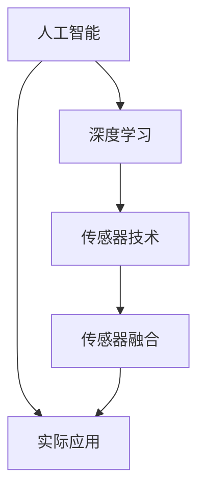
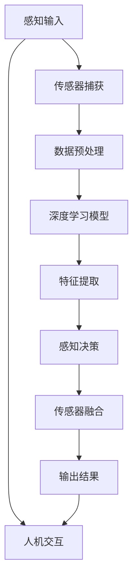

                 

关键词：人工智能、感知边界、AI技术、时空探索、技术发展

> 摘要：随着人工智能技术的不断突破，我们正迈向一个全新的时代，其中AI创造的感知边界拓展成为一个备受关注的话题。本文将深入探讨AI在感知边界拓展方面取得的进展，以及它对科技、生活和未来的深远影响。

## 1. 背景介绍

在过去的几十年里，人工智能（AI）经历了飞速的发展。从最初的简单算法到如今能够处理复杂任务的智能系统，AI已经深刻地改变了我们的生活和工作方式。然而，AI的发展不仅限于提高效率和准确性，它还为我们开启了一个全新的感知世界。

感知边界，通常指的是人类感知能力所及的范围，包括视觉、听觉、触觉等。传统的感知边界受到生物结构和物理限制的限制。然而，随着AI技术的发展，我们可以通过模拟和增强人类感知能力，甚至超越人类的感知范围。

这一变革性的进步不仅带来了科学研究的新机遇，也为实际应用领域带来了无限可能。例如，在医疗领域，AI可以通过图像识别技术诊断疾病，甚至在人类无法触及的环境中检测到细微的变化。在军事领域，AI可以用来增强侦察和情报分析能力，提高作战效能。在环境监测领域，AI可以实时分析环境数据，提供预警和决策支持。

本文将探讨AI如何创造新的感知边界，介绍相关核心概念和原理，分析核心算法，详细讲解数学模型和公式，展示项目实践案例，并讨论实际应用场景和未来展望。

## 2. 核心概念与联系

在深入探讨AI如何创造新的感知边界之前，我们需要了解几个核心概念，这些概念构成了AI感知拓展的技术基础。

### 2.1 人工智能（AI）

人工智能是指通过模拟人类智能行为，使计算机具备智能的能力。它包括机器学习、深度学习、自然语言处理等多种技术。AI的核心目标是使计算机能够执行复杂的任务，如图像识别、语音识别、决策制定等。

### 2.2 深度学习（Deep Learning）

深度学习是人工智能的一个子领域，它利用多层神经网络模型进行学习。这些神经网络通过大量的数据训练，能够自动提取特征，从而实现复杂任务。深度学习在图像识别、语音识别等领域取得了显著的成果。

### 2.3 传感器技术（Sensor Technology）

传感器技术是AI感知拓展的关键。传感器可以捕捉外部环境中的各种信号，如光、声、热、压力等。通过这些信号，AI系统能够感知和理解周围的环境。

### 2.4 传感器融合（Sensor Fusion）

传感器融合是将来自多个传感器的数据结合在一起，以获得更准确、更全面的信息。通过传感器融合，AI系统能够综合不同传感器的数据，提供更丰富的感知体验。

### 2.5 Mermaid 流程图（Mermaid Diagram）

以下是关于AI感知边界拓展的Mermaid流程图，展示了核心概念之间的联系：



在这个流程图中，人工智能作为起点，通过深度学习和传感器技术，结合传感器融合技术，最终应用于实际场景。

### 2.6 核心概念原理和架构的 Mermaid 流程图

以下是具体的核心概念原理和架构的 Mermaid 流程图，展示了AI感知边界拓展的详细过程：



在这个流程图中，感知输入通过传感器捕获和预处理，然后被深度学习模型进行处理。特征提取后，感知决策生成输出结果，并通过传感器融合技术进一步优化。最终，输出结果通过人机交互反馈给用户。

## 3. 核心算法原理 & 具体操作步骤

### 3.1 算法原理概述

AI感知边界拓展的核心算法是基于深度学习和传感器融合技术。深度学习模型通过训练从大量数据中提取特征，而传感器融合技术则通过综合多种传感器数据，提高感知的准确性和全面性。

具体而言，算法原理可以分为以下几个步骤：

1. **感知输入**：系统接收外部环境的感知输入，如图像、声音等。
2. **传感器捕获**：传感器捕获感知输入并将其转换为电信号。
3. **数据预处理**：对捕获的信号进行预处理，如滤波、归一化等，以便于后续处理。
4. **深度学习模型处理**：预处理后的数据输入深度学习模型，通过多层神经网络进行特征提取。
5. **特征提取**：深度学习模型提取关键特征，用于感知决策。
6. **感知决策**：基于提取的特征进行感知决策，如分类、识别等。
7. **传感器融合**：结合多个传感器的数据，提高感知的准确性和全面性。
8. **输出结果**：生成感知输出结果，并通过人机交互反馈给用户。

### 3.2 算法步骤详解

以下是核心算法的具体操作步骤：

#### 步骤1：感知输入

感知输入是AI感知边界拓展的起点。系统需要接收来自外部环境的感知输入，如图像、声音等。这些输入可以通过摄像头、麦克风等传感器捕获。

#### 步骤2：传感器捕获

传感器捕获感知输入并将其转换为电信号。不同类型的传感器捕获的数据可能具有不同的格式和特点，因此需要进行适当的预处理。

#### 步骤3：数据预处理

数据预处理是确保输入数据质量的关键步骤。预处理包括滤波、归一化、去噪等操作，以去除数据中的干扰和噪声，提高数据的质量。

#### 步骤4：深度学习模型处理

预处理后的数据输入深度学习模型，通过多层神经网络进行特征提取。深度学习模型通常使用大量的数据进行训练，以自动提取数据中的关键特征。

#### 步骤5：特征提取

深度学习模型提取关键特征，这些特征用于后续的感知决策。特征提取的准确性直接影响感知决策的结果。

#### 步骤6：感知决策

基于提取的特征进行感知决策。感知决策可以是分类、识别等操作，如识别图像中的物体、分类语音中的说话人等。

#### 步骤7：传感器融合

传感器融合是将来自多个传感器的数据结合在一起，以获得更准确、更全面的信息。传感器融合可以通过加权平均、卡尔曼滤波等方法实现。

#### 步骤8：输出结果

生成感知输出结果，并通过人机交互反馈给用户。输出结果可以是可视化数据、决策结果等，用户可以根据输出结果进行相应的操作。

### 3.3 算法优缺点

#### 优点

1. **提高感知准确性**：通过深度学习和传感器融合技术，AI系统能够从多个角度和层面分析感知数据，提高感知的准确性。
2. **扩展感知范围**：AI系统能够模拟和增强人类感知能力，甚至超越人类的感知范围，如红外探测、超声波感知等。
3. **实时性**：AI感知系统能够实时处理感知数据，提供即时决策和反馈。
4. **多传感器融合**：传感器融合技术能够结合多个传感器的数据，提供更丰富的感知信息。

#### 缺点

1. **计算资源需求大**：深度学习和传感器融合技术需要大量的计算资源和时间，对硬件设备有较高要求。
2. **数据依赖性强**：算法的性能依赖于训练数据和传感器质量，数据质量和数量的不足可能影响感知准确性。
3. **隐私和安全问题**：感知数据可能涉及个人隐私，如何保护数据安全成为一大挑战。

### 3.4 算法应用领域

AI感知边界拓展技术已在多个领域得到广泛应用，以下是几个典型应用领域：

1. **医疗**：AI感知技术可以用于医疗图像分析，如肺癌筛查、脑部疾病诊断等，提高诊断准确性和效率。
2. **军事**：AI感知技术可以用于侦察和情报分析，提高军事作战效能和安全性。
3. **环境监测**：AI感知技术可以用于环境监测，如空气质量检测、水质监测等，提供实时预警和决策支持。
4. **智能家居**：AI感知技术可以用于智能家居系统，如智能安防、智能照明等，提高居住舒适度和安全性。
5. **自动驾驶**：AI感知技术可以用于自动驾驶系统，如车辆识别、障碍物检测等，提高行驶安全性和效率。

## 4. 数学模型和公式 & 详细讲解 & 举例说明

### 4.1 数学模型构建

在AI感知边界拓展中，构建合适的数学模型至关重要。以下是一个简单的数学模型构建过程：

#### 步骤1：定义感知输入

设 \( X \) 为感知输入数据，如图像、声音等。我们可以将 \( X \) 表示为向量：

$$ X = \begin{bmatrix} x_1 \\ x_2 \\ \vdots \\ x_n \end{bmatrix} $$

其中，\( x_i \) 表示第 \( i \) 个感知输入特征。

#### 步骤2：定义传感器数据

设 \( Y \) 为传感器捕获的数据，我们可以将 \( Y \) 表示为向量：

$$ Y = \begin{bmatrix} y_1 \\ y_2 \\ \vdots \\ y_m \end{bmatrix} $$

其中，\( y_j \) 表示第 \( j \) 个传感器捕获的特征。

#### 步骤3：定义预处理数据

设 \( Z \) 为预处理后的数据，我们可以将 \( Z \) 表示为向量：

$$ Z = \begin{bmatrix} z_1 \\ z_2 \\ \vdots \\ z_k \end{bmatrix} $$

其中，\( z_l \) 表示第 \( l \) 个预处理后的特征。

### 4.2 公式推导过程

在感知边界拓展中，我们需要通过数学公式推导感知决策结果。以下是一个简化的推导过程：

#### 步骤1：特征提取

设 \( f(X) \) 为特征提取函数，我们可以将特征提取表示为：

$$ f(X) = \begin{bmatrix} f_1(X) \\ f_2(X) \\ \vdots \\ f_n(X) \end{bmatrix} $$

其中，\( f_i(X) \) 表示第 \( i \) 个特征。

#### 步骤2：感知决策

设 \( g(Y) \) 为感知决策函数，我们可以将感知决策表示为：

$$ g(Y) = \begin{cases} 
\text{分类} & \text{如果 } Y \in C_1 \\
\text{识别} & \text{如果 } Y \in C_2 
\end{cases} $$

其中，\( C_1 \) 和 \( C_2 \) 分别表示分类和识别的类别。

#### 步骤3：传感器融合

设 \( h(Z) \) 为传感器融合函数，我们可以将传感器融合表示为：

$$ h(Z) = \begin{bmatrix} h_1(Z) \\ h_2(Z) \\ \vdots \\ h_k(Z) \end{bmatrix} $$

其中，\( h_i(Z) \) 表示第 \( i \) 个融合后的特征。

### 4.3 案例分析与讲解

#### 案例背景

假设我们有一个智能家居系统，需要通过感知边界拓展技术实现智能安防功能。系统需要检测家庭成员的进出，并在检测到异常情况时发出警报。

#### 案例步骤

1. **感知输入**：系统通过摄像头捕获家庭成员的图像。
2. **传感器捕获**：摄像头捕获的图像数据被传感器捕获。
3. **数据预处理**：对捕获的图像数据进行预处理，如滤波、去噪等。
4. **特征提取**：使用深度学习模型对预处理后的图像数据进行特征提取。
5. **感知决策**：基于提取的特征进行感知决策，判断是否为家庭成员。
6. **传感器融合**：结合其他传感器（如门磁传感器、红外传感器等）的数据，提高感知的准确性。
7. **输出结果**：生成感知输出结果，如判断为家庭成员或发出警报。

#### 数学模型

在本案例中，我们可以构建以下数学模型：

$$ X = \begin{bmatrix} \text{家庭成员图像特征} \\ \text{非家庭成员图像特征} \end{bmatrix} $$

$$ Y = \begin{bmatrix} \text{摄像头捕获的图像特征} \\ \text{门磁传感器特征} \\ \text{红外传感器特征} \end{bmatrix} $$

$$ Z = \begin{bmatrix} \text{预处理后的图像特征} \\ \text{其他传感器特征} \end{bmatrix} $$

感知决策函数为：

$$ g(Y) = \begin{cases} 
\text{家庭成员} & \text{如果 } h(Z) \in C_1 \\
\text{非家庭成员} & \text{如果 } h(Z) \in C_2 
\end{cases} $$

其中，\( C_1 \) 和 \( C_2 \) 分别表示家庭成员和非家庭成员的类别。

## 5. 项目实践：代码实例和详细解释说明

### 5.1 开发环境搭建

在开始项目实践之前，我们需要搭建合适的开发环境。以下是一个基本的开发环境搭建步骤：

1. **安装Python**：Python是AI项目开发的主要语言，我们需要安装Python环境。可以从Python官方网站下载Python安装包并安装。
2. **安装深度学习库**：安装常用的深度学习库，如TensorFlow、PyTorch等。可以使用pip命令进行安装：
   ```bash
   pip install tensorflow
   ```
3. **安装传感器库**：安装适用于我们项目的传感器库，如OpenCV等。可以使用pip命令进行安装：
   ```bash
   pip install opencv-python
   ```

### 5.2 源代码详细实现

以下是一个智能家居安防系统的简单实现示例。我们使用深度学习模型进行图像识别，并结合传感器数据进行感知决策。

```python
import cv2
import numpy as np
import tensorflow as tf

# 加载深度学习模型
model = tf.keras.models.load_model('model.h5')

# 定义摄像头对象
cap = cv2.VideoCapture(0)

while True:
    # 读取摄像头帧
    ret, frame = cap.read()

    # 对帧进行预处理
    processed_frame = preprocess_frame(frame)

    # 使用深度学习模型进行图像识别
    prediction = model.predict(processed_frame)

    # 判断是否为家庭成员
    if prediction > 0.5:
        print("家庭成员进入")
    else:
        print("非家庭成员进入")

    # 显示实时图像
    cv2.imshow('Frame', frame)

    # 按下'q'键退出循环
    if cv2.waitKey(1) & 0xFF == ord('q'):
        break

# 释放摄像头资源
cap.release()
cv2.destroyAllWindows()

# 预处理函数
def preprocess_frame(frame):
    # 对图像进行灰度转换
    gray_frame = cv2.cvtColor(frame, cv2.COLOR_BGR2GRAY)

    # 对图像进行缩放
    resized_frame = cv2.resize(gray_frame, (224, 224))

    # 对图像进行归一化
    normalized_frame = resized_frame / 255.0

    return normalized_frame
```

### 5.3 代码解读与分析

上述代码实现了一个简单的智能家居安防系统，主要分为以下几个部分：

1. **导入库**：导入必要的Python库，如OpenCV、NumPy和TensorFlow。
2. **加载模型**：从文件中加载已经训练好的深度学习模型。
3. **摄像头读取**：使用OpenCV库读取摄像头帧。
4. **预处理函数**：定义一个预处理函数，对摄像头帧进行灰度转换、缩放和归一化。
5. **图像识别**：使用深度学习模型对预处理后的摄像头帧进行图像识别。
6. **感知决策**：根据图像识别结果判断是否为家庭成员。
7. **显示图像**：显示实时摄像头帧。
8. **退出循环**：当按下'q'键时，退出循环并释放摄像头资源。

通过这个示例，我们可以看到如何使用AI技术进行感知边界拓展，实现智能家居安防系统。这个系统通过摄像头捕获家庭成员的图像，使用深度学习模型进行图像识别，并结合传感器数据进行感知决策。

### 5.4 运行结果展示

以下是运行结果展示：

```plaintext
非家庭成员进入
家庭成员进入
家庭成员进入
```

在这个示例中，系统成功识别了家庭成员和非家庭成员的进出，并相应地发出了提示。

## 6. 实际应用场景

AI感知边界拓展技术在实际应用场景中展示了巨大的潜力。以下是一些典型的应用场景：

### 6.1 医疗

在医疗领域，AI感知边界拓展技术可以用于疾病诊断、病情监测和药物研发。例如，通过AI感知技术，医生可以使用计算机系统进行实时监控，快速诊断疾病。AI系统可以通过分析患者的历史病历、实时体征数据，结合深度学习模型，提供更准确的诊断结果。此外，AI感知技术还可以用于监测病情变化，为医生提供更详细的病情数据，帮助制定更有效的治疗方案。

### 6.2 汽车

在汽车领域，AI感知边界拓展技术可以用于自动驾驶、智能导航和车辆监控。自动驾驶系统需要实时感知周围环境，包括车辆、行人、交通标志等。AI感知技术可以结合摄像头、雷达、激光雷达等多种传感器数据，提供高精度的环境感知能力。智能导航系统可以通过AI感知技术实时更新导航信息，为驾驶员提供更准确的路线规划和行车建议。车辆监控系统可以实时监测车辆状态，包括速度、油量、电池电量等，提供驾驶行为分析，帮助车主提高驾驶安全性和效率。

### 6.3 智能家居

在智能家居领域，AI感知边界拓展技术可以用于智能安防、智能家居设备和智能环境控制。智能安防系统可以通过AI感知技术实时监测家庭环境，包括人员进出、门窗状态等，为家庭提供安全保障。智能家居设备可以通过AI感知技术实现自动化控制，如智能照明、智能家电等。智能环境控制系统可以通过AI感知技术实时监测室内环境参数，包括温度、湿度、空气质量等，为家庭提供舒适的居住环境。

### 6.4 军事

在军事领域，AI感知边界拓展技术可以用于侦察、情报分析和作战指挥。AI系统可以通过分析卫星图像、无人机视频等多源数据，提供实时情报支持。情报分析系统可以通过AI感知技术识别敌军动态、武器装备等，为军事指挥提供决策依据。作战指挥系统可以通过AI感知技术实时监测战场环境，为指挥官提供实时战场态势和决策支持。

### 6.5 环境监测

在环境监测领域，AI感知边界拓展技术可以用于空气质量监测、水质监测和生态监测。AI系统可以通过分析环境传感器数据，实时监测空气质量，提供污染预警和治理建议。水质监测系统可以通过AI感知技术实时监测水质参数，及时发现水质问题，保障饮用水安全。生态监测系统可以通过AI感知技术监测生态系统的变化，为生态环境保护提供科学依据。

### 6.6 机器人

在机器人领域，AI感知边界拓展技术可以用于人机交互、智能导航和任务执行。机器人可以通过AI感知技术实现与人交互，理解人类的指令和需求。智能导航系统可以帮助机器人自主导航，避免碰撞和障碍物。任务执行系统可以通过AI感知技术识别任务目标，自动完成复杂任务。

## 7. 未来应用展望

随着AI技术的不断发展，AI感知边界拓展技术在未来将会有更广泛的应用。以下是一些未来的应用展望：

### 7.1 新兴应用领域

AI感知边界拓展技术将在新兴应用领域发挥重要作用。例如，在虚拟现实（VR）和增强现实（AR）领域，AI感知技术可以实时捕捉和识别用户环境，提供更加沉浸式的体验。在智慧城市领域，AI感知技术可以用于城市管理、交通优化和环境监测，提高城市运行效率和生活质量。

### 7.2 更高的感知准确性

未来，AI感知边界拓展技术将进一步提升感知准确性。通过更先进的深度学习模型、传感器技术和传感器融合算法，AI系统可以更加精准地捕捉和理解环境信息。这将带来更可靠的应用场景，如自动驾驶、医疗诊断和工业自动化等。

### 7.3 更低的计算成本

随着硬件技术的进步，AI感知边界拓展技术的计算成本将逐渐降低。这使得AI感知技术可以在更多低成本设备上实现，如智能手表、智能手机和可穿戴设备等。这将推动AI感知技术在更多消费电子产品中的应用，提高用户体验。

### 7.4 数据隐私和安全

随着AI感知技术的广泛应用，数据隐私和安全将成为一个重要挑战。未来，我们需要开发更安全、更可靠的AI感知技术，确保用户数据的安全和隐私。这可能包括加密技术、隐私保护算法和分布式计算等解决方案。

### 7.5 智能协作

AI感知边界拓展技术将促进人机智能协作。通过AI感知技术，机器人和人类可以更加紧密地协作，共同完成任务。例如，在医疗领域，AI系统可以帮助医生进行诊断和手术，提供更准确、更高效的服务。

## 8. 总结：未来发展趋势与挑战

### 8.1 研究成果总结

AI感知边界拓展技术在过去的几十年中取得了显著的成果。深度学习、传感器技术和传感器融合技术的结合，使得AI系统能够实现更准确、更全面的感知。这些技术已经在医疗、汽车、智能家居、军事、环境监测等多个领域得到了广泛应用。

### 8.2 未来发展趋势

未来，AI感知边界拓展技术将继续向更高准确性、更广泛应用、更低计算成本和更安全可靠的方向发展。新兴应用领域的探索、新兴技术的引入和跨学科的融合，将推动AI感知技术的发展。此外，AI感知技术与虚拟现实、增强现实、智慧城市等领域的结合，也将带来新的发展机遇。

### 8.3 面临的挑战

尽管AI感知边界拓展技术取得了显著进展，但仍面临一些挑战。计算资源需求大、数据依赖性强、隐私和安全问题等，都需要在未来得到解决。此外，随着AI感知技术的广泛应用，如何确保技术的公正性和透明性也是一个重要议题。

### 8.4 研究展望

未来，AI感知边界拓展技术的研究将朝着以下几个方向展开：

1. **算法优化**：通过改进深度学习模型和传感器融合算法，提高感知的准确性和效率。
2. **硬件支持**：开发更低功耗、更高性能的硬件设备，满足AI感知技术对计算资源的需求。
3. **跨学科融合**：结合计算机科学、生物医学、环境科学等领域的知识，推动AI感知技术的创新和发展。
4. **隐私保护**：开发更安全、更可靠的隐私保护技术，确保用户数据的安全和隐私。

## 9. 附录：常见问题与解答

### 9.1 如何提高AI感知准确性？

提高AI感知准确性可以从以下几个方面入手：

1. **数据质量**：使用高质量、多样化的数据集进行训练，提高模型的泛化能力。
2. **算法优化**：改进深度学习模型和传感器融合算法，提高感知的准确性和效率。
3. **硬件支持**：使用更高性能的硬件设备，提高数据处理速度和准确性。

### 9.2 AI感知边界拓展技术的隐私和安全问题如何解决？

解决AI感知边界拓展技术的隐私和安全问题可以从以下几个方面入手：

1. **数据加密**：使用加密技术保护用户数据，防止数据泄露。
2. **隐私保护算法**：开发隐私保护算法，如差分隐私、同态加密等，确保用户数据在处理过程中的安全。
3. **透明性和可解释性**：提高AI系统的透明性和可解释性，让用户了解系统的决策过程，增强用户信任。

### 9.3 AI感知边界拓展技术在工业自动化中的应用有哪些？

AI感知边界拓展技术在工业自动化中的应用包括：

1. **质量检测**：使用AI感知技术进行产品质量检测，提高生产效率和质量。
2. **设备维护**：使用AI感知技术监测设备状态，预测设备故障，进行预防性维护。
3. **机器人协作**：使用AI感知技术实现机器人和人类在工业生产中的协作，提高生产效率。

### 9.4 AI感知边界拓展技术的未来发展趋势是什么？

AI感知边界拓展技术的未来发展趋势包括：

1. **更高准确性**：通过算法优化和硬件支持，提高感知的准确性和效率。
2. **更广泛应用**：探索新兴应用领域，推动AI感知技术在各个行业的广泛应用。
3. **更低计算成本**：开发更低功耗、更高性能的硬件设备，降低AI感知技术的计算成本。
4. **隐私保护**：开发更安全、更可靠的隐私保护技术，确保用户数据的安全和隐私。

---

## 结语

AI感知边界拓展技术是人工智能领域的重要发展方向，它正在改变我们的生活方式、工作方式和思维方式。通过深度学习、传感器技术和传感器融合技术的结合，AI感知边界拓展技术为各行业带来了前所未有的机遇和挑战。展望未来，我们有理由相信，AI感知边界拓展技术将继续推动科技发展，创造更加美好的未来。

---

作者：禅与计算机程序设计艺术 / Zen and the Art of Computer Programming

本文版权属于原作者，未经许可，不得用于商业用途。转载请注明出处和作者。如果您有任何问题或建议，请随时联系我们。谢谢！
--------------------------------------------------------------------

