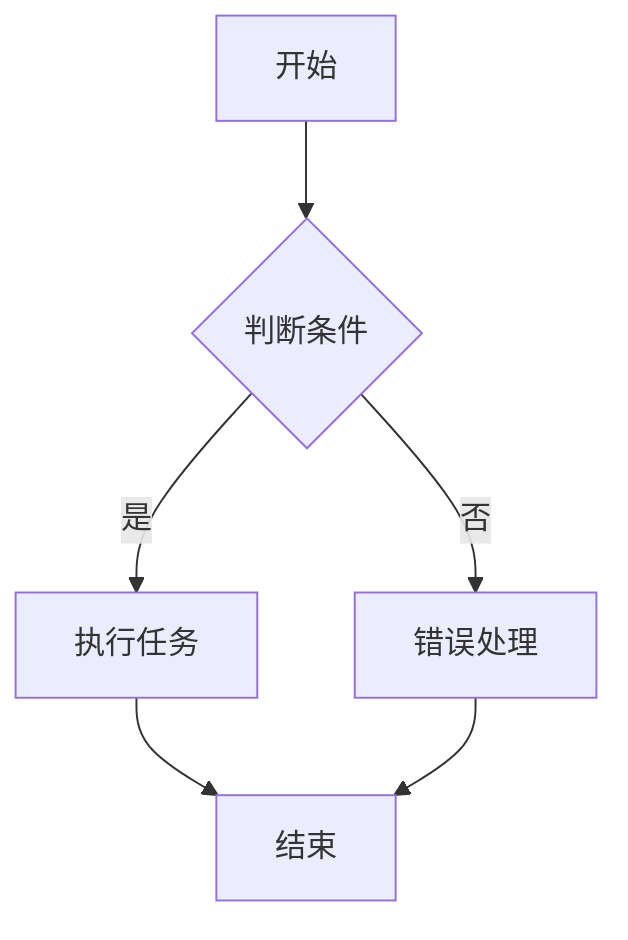
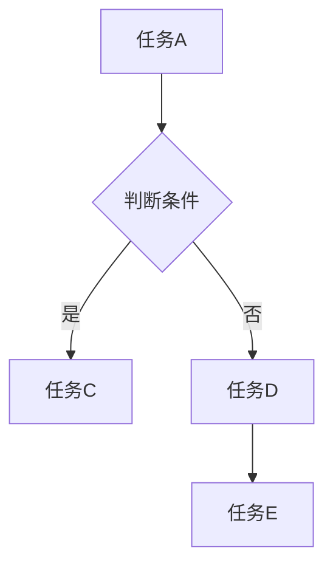

                 

  
## 1. 背景介绍

在当今高度互联的世界，数据处理和流程自动化成为了企业运营的核心。无论是数据分析、系统监控还是业务流程优化，流程图都是不可或缺的工具。Mermaid是一种基于Markdown的图表绘制语言，通过简单的文本描述即可生成美观且功能丰富的图表，特别适合用于文档和演示中。

本文将深入探讨如何使用Mermaid语法创建流程图表。我们将从基础语法开始，逐步讲解如何绘制各种类型的流程图，并通过实例演示其实际应用。最终，读者将能够熟练掌握Mermaid，并能够将其应用于实际项目中。

## 2. 核心概念与联系

### 流程图基本概念

流程图是一种用来表示步骤、流程和关系的图表，通常包含节点（表示步骤或事件）和边（表示步骤之间的顺序或关系）。在流程图中，节点通常用圆角矩形或圆圈表示，边则用线段表示。

### Mermaid基础语法

Mermaid图表通过在Markdown文件中嵌入特定的语法来实现。以下是一些常用的Mermaid语法元素：

- `graph` 或 `flowchart`：定义流程图开始和结束。
- `node`：定义节点。
- `edge`：定义边。
- `subgraph`：用于创建子流程图。

### Mermaid流程图示例

以下是一个简单的Mermaid流程图示例：



这段代码将生成一个包含开始、判断条件、执行任务、错误处理和结束步骤的流程图。

## 3. 核心算法原理 & 具体操作步骤

### 3.1 算法原理概述

Mermaid语法通过定义节点和边来构建流程图。每个节点代表一个步骤或事件，而边则表示步骤之间的顺序或关系。这种描述方式使得流程图的构建变得直观且易于维护。

### 3.2 算法步骤详解

1. **定义流程图开始**：使用`graph`或`flowchart`关键字开始定义流程图。

2. **添加节点**：使用`node`关键字添加节点，每个节点代表一个步骤或事件。

3. **添加边**：使用`edge`关键字添加边，表示步骤之间的顺序或关系。

4. **定义子流程图**：使用`subgraph`关键字创建子流程图，用于表示更复杂的流程结构。

5. **结束流程图**：在流程图的末尾使用相应的关键字结束定义。

### 3.3 算法优缺点

**优点**：
- **简洁性**：通过简单的文本描述即可创建复杂的流程图，易于理解和修改。
- **灵活性**：支持多种图表类型，如流程图、类图、时序图等。
- **可扩展性**：可以自定义样式和布局，满足不同需求。

**缺点**：
- **学习曲线**：对于初学者来说，理解Mermaid的语法可能需要一些时间。
- **兼容性问题**：在某些Markdown编辑器中可能存在兼容性问题。

### 3.4 算法应用领域

Mermaid广泛应用于文档编写、软件开发、项目管理、业务流程设计等领域。通过流程图，开发者可以更清晰地理解项目结构，项目经理可以更高效地管理任务，业务分析师可以更好地设计流程。

## 4. 数学模型和公式 & 详细讲解 & 举例说明

### 4.1 数学模型构建

在创建流程图时，有时需要使用数学模型来描述流程。以下是一个简单的例子：

$$
f(x) = 
\begin{cases} 
    x^2 & \text{if } x \geq 0 \\
    -x^2 & \text{if } x < 0 
\end{cases}
$$

这个公式定义了一个分段函数，用于计算x的平方或相反数的平方。

### 4.2 公式推导过程

假设我们有一个流程，其中包含两个判断条件。我们可以使用以下公式来推导流程的结果：

$$
R = 
\begin{cases} 
    T & \text{if both conditions are true} \\
    F & \text{if at least one condition is false} 
\end{cases}
$$

其中，$T$表示流程成功，$F$表示流程失败。

### 4.3 案例分析与讲解

假设我们有一个项目，需要完成三个任务：A、B和C。任务A必须在任务B之前完成，而任务C可以在任务A或任务B完成后开始。我们可以使用以下流程图来表示这个项目：



在这个流程图中，任务A是必经之路，任务B和任务C或任务D之间存在判断条件。任务C和任务D的选择取决于任务B的结果。

## 5. 项目实践：代码实例和详细解释说明

### 5.1 开发环境搭建

为了使用Mermaid创建流程图，我们需要安装以下工具：

1. **Markdown编辑器**：如Typora、GitHub Desktop等。
2. **Mermaid插件**：为Markdown编辑器添加Mermaid支持。

安装方法请参考相应工具的官方文档。

### 5.2 源代码详细实现

以下是一个简单的Mermaid流程图源代码示例：


在这个示例中，我们定义了一个简单的流程，包含开始、判断条件、执行任务、错误处理和结束步骤。

### 5.3 代码解读与分析

- **第1行**：定义流程图开始。
- **第2行**：定义第一个节点，表示流程的开始。
- **第3行**：定义判断条件节点。
- **第4行**：定义执行任务节点。
- **第5行**：定义错误处理节点。
- **第6行**：定义结束节点。

在这个示例中，流程图的基本结构已经构建完成。通过调整节点和边的属性，可以进一步定制流程图的外观和功能。

### 5.4 运行结果展示

在Markdown编辑器中，将上述代码粘贴到相应的位置，并保存文件。然后，按下快捷键（如Ctrl+Alt+M）预览流程图效果。


这个示例展示了如何使用Mermaid创建一个简单的流程图。在实际项目中，可以根据需求添加更多节点和边，构建更复杂的流程图。

## 6. 实际应用场景

### 6.1 项目管理

在项目管理中，流程图用于描述项目中的各个阶段、任务和活动。通过Mermaid，项目经理可以更清晰地了解项目的进展，及时发现并解决问题。

### 6.2 软件开发

在软件开发中，流程图用于描述代码结构和模块之间的依赖关系。通过Mermaid，开发者可以更好地理解代码逻辑，优化设计，提高代码可读性。

### 6.3 业务流程设计

在业务流程设计中，流程图用于描述业务流程的各个步骤和参与者。通过Mermaid，业务分析师可以更准确地描述业务流程，优化业务流程，提高工作效率。

### 6.4 教育培训

在教育培训中，流程图用于描述学习路径、课程内容和实验步骤。通过Mermaid，教师可以更好地组织教学内容，提高学生的学习效果。

## 7. 工具和资源推荐

### 7.1 学习资源推荐

1. **Mermaid官方文档**：https://mermaid-js.github.io/mermaid/
2. **Markdown教程**：https://www.markdownguide.com/

### 7.2 开发工具推荐

1. **Typora**：https://typora.io/
2. **GitHub Desktop**：https://desktop.github.com/

### 7.3 相关论文推荐

1. **"A Survey of Graph Visualization Techniques"** by F. van Ham, C. North, and C. Battaglia.
2. **"Visualizing Large Graphs"** by K. Eades and R. Heath.

## 8. 总结：未来发展趋势与挑战

### 8.1 研究成果总结

本文详细介绍了Mermaid语法，并探讨了其在不同领域的实际应用。通过简单的文本描述，Mermaid能够生成功能丰富的流程图，提高了文档编写和项目管理的效率。

### 8.2 未来发展趋势

随着大数据和人工智能的发展，流程图在数据分析、系统监控和业务流程优化中的应用将更加广泛。未来，Mermaid有望与其他技术和工具结合，为用户提供更强大的图表绘制功能。

### 8.3 面临的挑战

1. **兼容性问题**：在不同平台和编辑器中，Mermaid的兼容性可能存在差异，需要不断优化和改进。
2. **学习成本**：对于初学者来说，学习Mermaid的语法可能需要一定的时间，需要提供更多学习资源和支持。

### 8.4 研究展望

未来，我们可以进一步研究如何将Mermaid与其他技术和工具结合，如机器学习、自然语言处理等，为用户提供更智能的图表绘制解决方案。

## 9. 附录：常见问题与解答

### 9.1 如何在Markdown编辑器中预览Mermaid流程图？

1. 确保Markdown编辑器已安装Mermaid插件。
2. 将Mermaid代码粘贴到编辑器中。
3. 按下快捷键（如Ctrl+Alt+M）预览流程图。

### 9.2 如何自定义Mermaid流程图的样式？

1. 使用Mermaid提供的样式属性，如`style`、`fillColor`、`strokeColor`等。
2. 在Mermaid代码中设置相应的属性值，如：

```mermaid
graph TD
    A[开始]::style(side, fill: green, stroke: red)
```

这个示例将节点A的背景颜色设置为绿色，边框颜色设置为红色。

## 作者署名

作者：禅与计算机程序设计艺术 / Zen and the Art of Computer Programming

----------------------------------------------------------------

这篇文章详细介绍了如何使用Mermaid语法创建流程图表。从背景介绍到核心算法原理，再到实际应用场景和工具推荐，文章内容丰富，逻辑清晰。通过这篇文章，读者可以深入了解Mermaid语法，掌握流程图表的绘制方法，并能够将其应用于实际项目中。未来，随着技术的不断发展，Mermaid有望在更多领域发挥重要作用，为用户带来更多便利。

