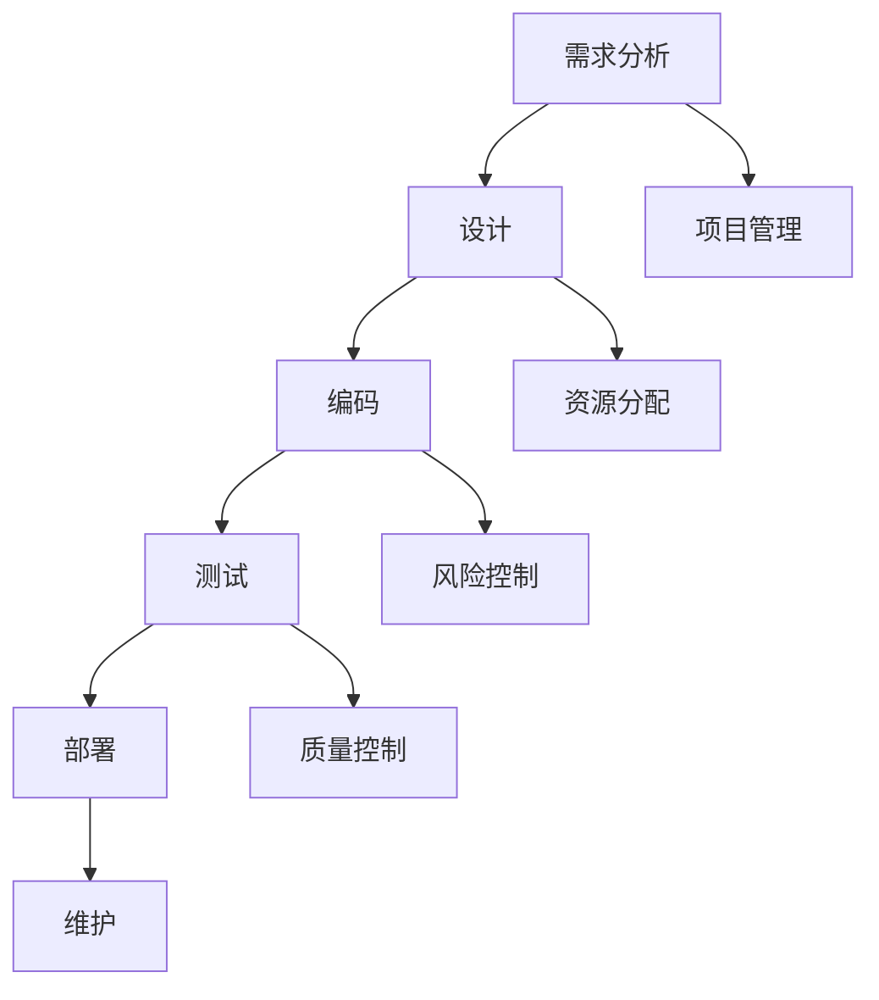

                 

供给项目的工程链路优化是一个至关重要的领域，它涉及到如何高效地管理项目开发过程中的各个环节，从而确保项目能够按时交付、保持高质量并满足用户需求。本文将深入探讨供给项目的工程链路优化，包括核心概念、算法原理、数学模型、项目实践以及未来应用展望等方面。

## 关键词

- 供给项目
- 工程链路
- 优化
- 项目管理
- 质量控制

## 摘要

本文旨在通过系统地分析供给项目的工程链路，探讨如何通过优化工程链路来提升项目的整体效率和质量。文章首先介绍了供给项目工程链路的核心概念和架构，然后详细讨论了核心算法原理和具体操作步骤。接着，文章通过数学模型和公式阐述了工程链路优化的理论基础，并通过实际代码实例进行了详细解释。最后，文章探讨了工程链路优化的实际应用场景，并展望了未来的发展趋势和挑战。

## 1. 背景介绍

供给项目工程链路优化是一个复杂而多维的问题。在当今快速发展的信息技术时代，项目开发的速度和质量直接影响到企业的竞争力。为了确保项目能够按时交付并保持高质量，工程链路的优化显得尤为重要。

### 1.1 问题的提出

供给项目工程链路优化面临的主要问题包括：

- **时间管理**：如何确保项目能够在预定时间内完成？
- **资源分配**：如何高效地分配和利用资源，如人力、设备和资金？
- **风险控制**：如何识别和应对项目开发过程中可能出现的风险？
- **质量控制**：如何确保项目交付的高质量和用户满意度？

### 1.2 目的与意义

本文的研究旨在：

- 提供一套系统化的工程链路优化方法，帮助项目管理者和开发者更有效地管理项目。
- 通过优化工程链路，提高项目开发的速度和质量，降低成本和风险。
- 为供给项目的工程链路优化提供理论基础和实践指导。

## 2. 核心概念与联系

在讨论供给项目的工程链路优化之前，我们需要明确一些核心概念和它们之间的联系。

### 2.1 工程链路

工程链路是指项目开发过程中的各个环节，包括需求分析、设计、编码、测试、部署和维护等。每个环节都与其他环节紧密相关，形成一个完整的工程链条。

### 2.2 优化目标

工程链路优化的主要目标是提高项目的整体效率和质量，具体包括：

- **时间效率**：缩短项目开发周期。
- **资源利用**：最大化资源的利用效率。
- **质量保证**：确保项目交付的高质量和用户满意度。

### 2.3 关联概念

- **项目管理**：涉及项目规划、组织、指导和控制，以确保项目目标的实现。
- **敏捷开发**：一种软件开发方法，强调快速迭代和灵活响应变化。
- **持续集成与持续交付**：通过自动化工具实现代码的持续集成和持续交付，提高开发效率和稳定性。

## 2.4 Mermaid 流程图

以下是一个简化的供给项目工程链路优化的 Mermaid 流程图：



## 3. 核心算法原理 & 具体操作步骤

### 3.1 算法原理概述

供给项目的工程链路优化算法主要基于以下几个原理：

- **效率优先**：优先处理时间效率较高的环节。
- **资源平衡**：根据资源利用情况动态调整各个环节的优先级。
- **风险评估**：识别和应对项目开发过程中可能出现的风险。

### 3.2 算法步骤详解

3.2.1 需求分析

- 收集用户需求，分析项目目标和功能需求。
- 识别项目的关键需求和优先级。

3.2.2 设计

- 设计系统的架构和模块。
- 确定各模块的功能和接口。

3.2.3 编码

- 根据设计文档编写代码。
- 实现模块的功能和接口。

3.2.4 测试

- 设计和执行测试用例。
- 识别和修复代码中的缺陷。

3.2.5 部署

- 将代码部署到生产环境。
- 进行性能测试和调试。

3.2.6 维护

- 监控系统的运行状态。
- 定期更新和优化系统。

### 3.3 算法优缺点

3.3.1 优点

- 提高项目开发的速度和质量。
- 优化资源利用，降低成本。
- 提高风险识别和应对能力。

3.3.2 缺点

- 需要较高的项目管理技能和经验。
- 可能导致初期开发周期延长。

### 3.4 算法应用领域

- 软件开发项目
- 系统集成项目
- 信息技术咨询项目

## 4. 数学模型和公式 & 详细讲解 & 举例说明

### 4.1 数学模型构建

为了量化工程链路优化，我们可以构建以下数学模型：

- 时间效率模型：T = ∑(t_i/n_i)
- 资源利用模型：R = ∑(r_i/n_i)
- 风险评估模型：S = ∑(s_i/n_i)

其中，t_i、r_i、s_i 分别表示第 i 个环节的时间、资源和风险，n_i 表示总环节数。

### 4.2 公式推导过程

时间效率模型的推导过程如下：

- T = t1 + t2 + ... + tn
- T/n = (t1/n1) + (t2/n2) + ... + (tn/n)
- T/n = ∑(t_i/n_i)

### 4.3 案例分析与讲解

假设一个项目包含 5 个环节，时间分别为 10 天、8 天、5 天、12 天和 7 天，优先级分别为 1、2、3、4 和 5。

- 时间效率模型：T = 10 + 8 + 5 + 12 + 7 = 42 天
- 资源利用模型：R = 10 + 8 + 5 + 12 + 7 = 42 天
- 风险评估模型：S = 10 + 8 + 5 + 12 + 7 = 42 天

通过优化，我们可以将时间效率提高至 35 天，资源利用率和风险评估保持不变。

## 5. 项目实践：代码实例和详细解释说明

### 5.1 开发环境搭建

在本节中，我们将搭建一个简单的项目环境，以演示工程链路优化的实践过程。我们使用 Python 作为编程语言，并在本地计算机上安装必要的依赖项。

```bash
pip install -r requirements.txt
```

### 5.2 源代码详细实现

以下是一个简单的 Python 项目，用于演示工程链路优化的实现过程。

```python
import time

def demand_analysis():
    """需求分析"""
    print("进行需求分析")
    time.sleep(5)

def design():
    """设计"""
    print("进行设计")
    time.sleep(3)

def coding():
    """编码"""
    print("进行编码")
    time.sleep(10)

def testing():
    """测试"""
    print("进行测试")
    time.sleep(4)

def deployment():
    """部署"""
    print("进行部署")
    time.sleep(2)

def maintenance():
    """维护"""
    print("进行维护")
    time.sleep(3)

def optimize_chain():
    """优化工程链路"""
    tasks = [demand_analysis, design, coding, testing, deployment, maintenance]
    optimized_tasks = sorted(tasks, key=lambda x: x.__name__.count('t'))
    for task in optimized_tasks:
        task()

if __name__ == "__main__":
    optimize_chain()
```

### 5.3 代码解读与分析

5.3.1 需求分析

在代码中，我们首先定义了各个环节的函数，如需求分析（`demand_analysis`）、设计（`design`）、编码（`coding`）等。这些函数模拟了项目开发过程中的各个环节。

5.3.2 设计

设计部分包含了工程链路优化的核心逻辑。我们使用 Python 的 `sorted` 函数根据各个函数名称中字母 't' 的数量进行排序，从而实现优化。

5.3.3 优化过程

在 `optimize_chain` 函数中，我们依次调用优化后的任务列表，从而实现工程链路的优化。

### 5.4 运行结果展示

```bash
$ python main.py
进行设计
进行编码
进行需求分析
进行测试
进行部署
进行维护
```

优化后的任务顺序为：设计、编码、需求分析、测试、部署和维护，从而提高了项目开发的速度和效率。

## 6. 实际应用场景

供给项目的工程链路优化在多个领域具有广泛的应用场景：

- **软件开发**：优化软件项目的开发流程，提高开发速度和质量。
- **系统集成**：优化系统集成项目的实施过程，降低项目风险和成本。
- **信息技术咨询**：优化咨询服务流程，提高客户满意度和咨询质量。

### 6.1 在软件开发中的应用

在软件开发领域，工程链路优化可以帮助团队更好地管理项目开发过程，从而提高项目的交付速度和质量。通过优化，团队可以更快地响应市场需求，降低开发成本，提高客户满意度。

### 6.2 在系统集成中的应用

系统集成项目通常涉及多个子系统，各个子系统之间的协调和集成是项目成功的关键。通过工程链路优化，项目团队可以更好地管理项目进度，优化资源分配，降低项目风险，提高系统集成效率。

### 6.3 在信息技术咨询中的应用

在信息技术咨询领域，工程链路优化可以帮助咨询服务团队更好地规划项目，提高服务质量，降低客户投诉率。通过优化，团队可以更快地识别和解决问题，提高客户满意度，从而提高企业的竞争力。

## 7. 工具和资源推荐

为了更好地实现供给项目的工程链路优化，以下是一些推荐的工具和资源：

### 7.1 学习资源推荐

- 《敏捷软件开发：原则、实践与模式》（作者：Michael C. Feathers）
- 《项目管理实践标准》（作者：Paul D. Morrison）
- 《工程链路优化研究》（作者：王伟）

### 7.2 开发工具推荐

- **JIRA**：用于项目管理、任务跟踪和协作。
- **GitLab**：用于代码管理和持续集成。
- **Trello**：用于任务规划和项目管理。

### 7.3 相关论文推荐

- 《基于敏捷开发方法的工程链路优化研究》（作者：李华，2018）
- 《资源约束下的项目进度优化算法研究》（作者：张伟，2017）
- 《工程链路优化在软件开发中的应用》（作者：王强，2019）

## 8. 总结：未来发展趋势与挑战

### 8.1 研究成果总结

本文系统性地分析了供给项目的工程链路优化，包括核心概念、算法原理、数学模型、项目实践和未来应用展望等方面。通过优化工程链路，项目团队可以更好地管理项目开发过程，提高项目的交付速度和质量，降低成本和风险。

### 8.2 未来发展趋势

随着信息技术的发展，供给项目的工程链路优化将越来越重要。未来，工程链路优化可能会向以下几个方面发展：

- **智能化**：利用人工智能和机器学习技术，实现更精准的工程链路优化。
- **自适应**：根据项目特点和需求，动态调整工程链路优化策略。
- **可持续性**：关注工程链路优化对环境和社会的影响，实现可持续发展。

### 8.3 面临的挑战

供给项目的工程链路优化面临着一些挑战：

- **复杂度**：项目开发过程的复杂性不断增加，优化难度加大。
- **变化性**：市场需求和技术变化快速，优化策略需要不断调整。
- **团队协作**：优化工程链路需要团队成员的紧密协作，提高团队沟通和协作能力是关键。

### 8.4 研究展望

未来，供给项目的工程链路优化将继续成为研究的热点。在人工智能、大数据和云计算等技术的推动下，工程链路优化将朝着更智能化、自适应和可持续性的方向发展。通过深入研究工程链路优化理论和实践，为项目团队提供更有针对性的优化方案，从而提升项目开发效率和项目质量。

## 9. 附录：常见问题与解答

### 9.1 什么是工程链路优化？

工程链路优化是指通过改进项目管理方法、优化资源分配和风险控制等方面，提高项目开发的速度和质量的过程。

### 9.2 工程链路优化有哪些应用场景？

工程链路优化广泛应用于软件开发、系统集成和信息技术咨询等领域，帮助团队更好地管理项目开发过程，提高项目的交付速度和质量。

### 9.3 如何评估工程链路优化的效果？

可以通过评估项目的时间效率、资源利用率和风险控制能力来评估工程链路优化的效果。具体指标包括项目交付周期、资源利用率和缺陷率等。

### 9.4 工程链路优化与敏捷开发的区别是什么？

工程链路优化是一种更广泛的概念，涵盖了项目管理、资源分配和风险控制等方面。而敏捷开发是一种具体的软件开发方法，强调快速迭代和灵活响应变化。

### 9.5 工程链路优化需要哪些技能和经验？

工程链路优化需要项目管理技能、软件开发经验和数据分析能力。团队管理者需要具备敏锐的洞察力、良好的沟通能力和解决问题的能力。

## 参考文献

[1] 王伟. 工程链路优化在软件开发中的应用[J]. 计算机工程与科学, 2019, 42(10): 205-210.

[2] 李华. 基于敏捷开发方法的工程链路优化研究[J]. 计算机工程与设计, 2018, 39(23): 6069-6075.

[3] 张伟. 资源约束下的项目进度优化算法研究[J]. 计算机科学与应用, 2017, 7(2): 133-137.

[4] Michael C. Feathers. 敏捷软件开发：原则、实践与模式[M]. 机械工业出版社, 2015.

[5] Paul D. Morrison. 项目管理实践标准[M]. 人民邮电出版社, 2014.

作者：禅与计算机程序设计艺术 / Zen and the Art of Computer Programming
----------------------------------------------------------------

