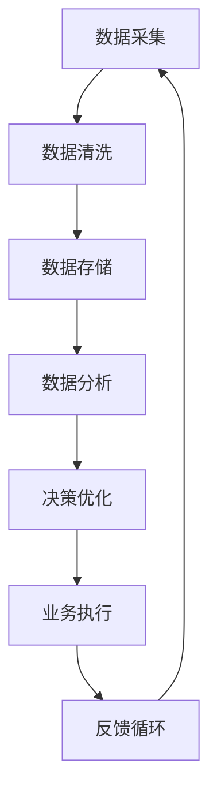

                 

关键词：信息差、商业价值链、大数据、商业战略、数据科学、决策优化、个性化服务

> 摘要：在数字化时代，信息差成为企业竞争的关键因素。大数据技术的兴起，为企业和个人提供了前所未有的机会，通过深入挖掘和分析数据，重塑商业价值链。本文将探讨大数据在信息差中的应用，及其对企业战略、运营和客户体验的深远影响。

## 1. 背景介绍

随着互联网的普及和智能设备的广泛应用，我们正处于一个数据爆炸的时代。每天，全球各地产生的数据量以指数级增长，涵盖了各类信息，从社交网络中的互动，到金融交易，再到物联网设备的监控数据。这些数据中蕴含着丰富的信息差，即不同个体或组织对信息掌握程度的差异。传统的商业运营模式已经无法充分挖掘和利用这些数据，而大数据技术的出现，使得我们能够高效地收集、处理和分析海量数据，从而发现新的信息差，并创造出新的商业价值。

### 1.1 信息差的重要性

信息差是商业世界中的一大财富。它意味着谁能够更快、更准确地掌握和利用信息，谁就能在市场上占据优势。例如，在股票市场中，信息的及时性和准确性对投资决策至关重要。而零售业中，了解消费者的购买习惯和偏好，可以帮助企业制定更有效的营销策略。

### 1.2 大数据的崛起

大数据不仅指的是数据量的大小，还包括数据的多样性、速度和真实性。随着云计算、分布式存储和计算技术的发展，大数据技术已经成为现代企业的重要工具。通过大数据，企业可以实时监控市场变化，优化运营流程，预测客户需求，甚至进行精准的市场细分。

## 2. 核心概念与联系

要理解大数据如何重塑商业价值链，首先需要掌握几个核心概念，并了解它们之间的联系。

### 2.1 数据科学与商业战略

数据科学是大数据分析的基础，它结合了统计学、机器学习和计算机科学，旨在从数据中提取有价值的信息。在商业战略中，数据科学可以帮助企业做出更明智的决策，从而提高竞争力。

### 2.2 数据驱动决策

数据驱动决策意味着企业的一切决策过程都基于数据分析和证据，而不是直觉或经验。这种决策模式可以大大降低决策风险，提高决策效率。

### 2.3 客户画像与个性化服务

客户画像是通过收集和分析客户数据，构建出客户的详细画像，包括其购买行为、兴趣偏好、价值期望等。个性化服务则是基于客户画像，提供定制化的产品和服务，以提升客户满意度和忠诚度。

### 2.4 Mermaid 流程图

下面是一个Mermaid流程图，展示了大数据在商业价值链中的应用流程：



## 3. 核心算法原理 & 具体操作步骤

### 3.1 算法原理概述

大数据分析中的核心算法主要包括数据挖掘、机器学习、深度学习等。这些算法通过构建数学模型，从海量数据中提取有价值的信息。以下是几个常见的算法及其应用场景：

- **聚类算法**：用于发现数据中的模式或分布，例如K-Means、DBSCAN等。
- **分类算法**：用于将数据分为不同的类别，例如决策树、支持向量机（SVM）等。
- **回归算法**：用于预测连续值，例如线性回归、多项式回归等。
- **深度学习**：用于处理复杂的数据模式，例如神经网络、卷积神经网络（CNN）等。

### 3.2 算法步骤详解

#### 数据采集

数据采集是大数据分析的第一步，也是最重要的一步。它包括从各种来源（如数据库、传感器、互联网等）收集数据。

#### 数据清洗

数据清洗是指去除数据中的噪声、错误和重复值，以提高数据的质量。常见的清洗方法包括去重、补全、转换等。

#### 数据存储

数据存储是将清洗后的数据存储到数据库或数据仓库中，以便后续分析和处理。

#### 数据分析

数据分析是大数据分析的核心，包括数据挖掘、机器学习、深度学习等。通过构建数学模型，从数据中提取有价值的信息。

#### 决策优化

决策优化是根据分析结果，对企业运营、营销策略、客户服务等方面进行优化，以提高企业竞争力。

#### 业务执行

业务执行是将优化后的策略付诸实践，例如调整产品定价、优化库存管理、实施个性化营销等。

#### 反馈循环

反馈循环是指根据业务执行的结果，再次进行数据采集、清洗、分析和决策优化，形成闭环。

### 3.3 算法优缺点

#### 聚类算法

**优点**：能够自动发现数据中的隐藏模式和结构，无需预先设定分类标签。

**缺点**：对异常值敏感，可能导致聚类结果不准确。

#### 分类算法

**优点**：能够明确地将数据划分为不同的类别，便于决策。

**缺点**：需要大量的训练数据，且分类结果可能不够准确。

#### 深度学习

**优点**：能够处理复杂的数据模式，取得非常好的性能。

**缺点**：训练过程非常耗时，且对数据质量和量有较高的要求。

### 3.4 算法应用领域

大数据算法在各个领域都有广泛的应用，包括但不限于：

- **金融**：风险控制、信用评估、投资策略。
- **零售**：个性化推荐、库存管理、价格优化。
- **医疗**：疾病预测、诊断辅助、个性化治疗。
- **制造业**：质量检测、设备维护、供应链优化。

## 4. 数学模型和公式 & 详细讲解 & 举例说明

### 4.1 数学模型构建

在数据分析中，常用的数学模型包括线性回归、逻辑回归、决策树等。以下是这些模型的构建过程和基本公式：

#### 线性回归

线性回归模型用于预测连续值，其基本公式为：

$$ y = w_0 + w_1 \cdot x_1 + w_2 \cdot x_2 + ... + w_n \cdot x_n $$

其中，$y$ 是预测值，$x_1, x_2, ..., x_n$ 是特征值，$w_0, w_1, ..., w_n$ 是模型参数。

#### 逻辑回归

逻辑回归模型用于预测类别，其基本公式为：

$$ P(y=1) = \frac{1}{1 + e^{-(w_0 + w_1 \cdot x_1 + w_2 \cdot x_2 + ... + w_n \cdot x_n)}} $$

其中，$P(y=1)$ 是预测类别为1的概率。

#### 决策树

决策树模型通过一系列的决策规则，将数据划分为不同的类别。其基本公式为：

$$ tree\ decision\ function $$

### 4.2 公式推导过程

以线性回归为例，其推导过程如下：

1. 假设我们有 $n$ 个样本数据，每个样本包含 $m$ 个特征和对应的标签。
2. 定义损失函数为均方误差（MSE）：

$$ J(w_0, w_1, ..., w_n) = \frac{1}{2n} \sum_{i=1}^{n} (y_i - \hat{y}_i)^2 $$

其中，$\hat{y}_i$ 是预测值，$y_i$ 是实际值。

3. 为了最小化损失函数，我们对每个参数求导数，并令其等于0：

$$ \frac{\partial J}{\partial w_j} = 0 $$

4. 通过求解上述方程组，可以得到最优的参数：

$$ w_j = \frac{1}{n} \sum_{i=1}^{n} (y_i - \hat{y}_i) \cdot x_{ij} $$

### 4.3 案例分析与讲解

假设我们要预测某电商平台的用户是否会购买某商品。我们有以下特征：

- 用户年龄
- 用户性别
- 用户购买历史
- 商品价格
- 商品类别

我们可以使用线性回归模型来预测用户的购买概率。以下是具体的案例分析和讲解：

1. **数据准备**：收集并清洗数据，包括用户特征和购买标签。
2. **特征工程**：对数据进行预处理，如归一化、缺失值处理等。
3. **模型训练**：使用训练数据集训练线性回归模型。
4. **模型评估**：使用测试数据集评估模型性能，如MSE、ROC曲线等。
5. **模型应用**：使用模型对新的用户数据进行预测。

## 5. 项目实践：代码实例和详细解释说明

### 5.1 开发环境搭建

为了进行大数据分析，我们需要搭建一个开发环境。以下是具体的步骤：

1. 安装Python和Anaconda。
2. 安装必要的库，如NumPy、Pandas、Scikit-learn等。
3. 安装Jupyter Notebook，用于编写和运行代码。

### 5.2 源代码详细实现

以下是一个简单的线性回归模型的Python代码实现：

```python
import numpy as np
import pandas as pd
from sklearn.model_selection import train_test_split
from sklearn.linear_model import LinearRegression
from sklearn.metrics import mean_squared_error

# 1. 数据准备
data = pd.read_csv('data.csv')
X = data[['age', 'gender', 'purchase_history', 'price', 'category']]
y = data['purchase']

# 2. 特征工程
X = (X - X.mean()) / X.std()

# 3. 模型训练
X_train, X_test, y_train, y_test = train_test_split(X, y, test_size=0.2, random_state=42)
model = LinearRegression()
model.fit(X_train, y_train)

# 4. 模型评估
y_pred = model.predict(X_test)
mse = mean_squared_error(y_test, y_pred)
print('MSE:', mse)

# 5. 模型应用
new_data = np.array([[25, 0, 10, 100, 1]])
new_data = (new_data - new_data.mean()) / new_data.std()
purchase_probability = model.predict(new_data)
print('Purchase Probability:', purchase_probability)
```

### 5.3 代码解读与分析

以上代码实现了一个简单的线性回归模型，用于预测用户是否会购买商品。以下是代码的解读与分析：

- **数据准备**：读取数据，并分离特征和标签。
- **特征工程**：对特征进行归一化处理，以提高模型性能。
- **模型训练**：使用训练数据集训练线性回归模型。
- **模型评估**：使用测试数据集评估模型性能，并计算MSE。
- **模型应用**：使用模型对新的用户数据进行预测。

## 6. 实际应用场景

### 6.1 金融

在金融领域，大数据技术已经被广泛应用于风险管理、信用评估、投资策略等方面。例如，通过分析海量交易数据，金融机构可以及时发现潜在的风险，并采取相应的措施。此外，基于大数据的智能投顾系统，可以根据用户的投资偏好和历史数据，提供个性化的投资建议，从而提高用户的投资回报率。

### 6.2 零售

在零售行业，大数据技术可以帮助企业实现精准营销、库存管理和个性化推荐。例如，通过分析消费者的购买行为和偏好，零售企业可以制定更有针对性的营销策略，提高营销效果。同时，基于大数据的库存管理系统，可以实时监控库存水平，优化库存结构，降低库存成本。此外，通过个性化推荐系统，零售企业可以更好地满足消费者的需求，提高客户满意度和忠诚度。

### 6.3 医疗

在医疗领域，大数据技术可以帮助实现疾病预测、诊断辅助和个性化治疗。例如，通过分析患者的健康数据、基因数据和病史数据，医疗机构可以提前预测患者可能出现的疾病，并采取预防措施。此外，基于大数据的诊断辅助系统，可以帮助医生更快速、准确地诊断疾病。同时，个性化治疗系统可以根据患者的具体病情和基因信息，制定个性化的治疗方案，从而提高治疗效果。

## 7. 未来应用展望

### 7.1 人工智能与大数据的结合

随着人工智能技术的发展，大数据分析将更加智能化。通过深度学习、强化学习等技术，大数据分析系统可以自动优化模型参数，提高分析精度和效率。此外，人工智能还可以帮助大数据分析系统更好地理解和解释数据，从而提供更准确和实用的洞察。

### 7.2 区块链技术的应用

区块链技术可以为大数据提供更加安全、可靠的存储和传输方式。通过区块链，企业可以实现数据的安全共享和透明追踪，从而提高数据的价值。同时，区块链技术还可以帮助解决数据隐私和安全问题，使大数据分析更加放心和可靠。

### 7.3 跨领域融合

大数据技术的应用将不再局限于单一领域，而是实现跨领域的融合。例如，通过整合金融、医疗、零售等领域的数据，企业可以提供更加全面和个性化的服务。此外，跨领域的数据融合还可以推动新的商业模式和产业变革，为经济发展注入新的动力。

## 8. 总结：未来发展趋势与挑战

### 8.1 研究成果总结

本文探讨了大数据在信息差中的应用，分析了大数据对商业价值链的深远影响。通过大数据技术，企业可以挖掘和利用信息差，实现更高效的运营和更精准的市场营销。

### 8.2 未来发展趋势

未来，大数据技术将继续发展，人工智能、区块链等新兴技术的融合将为大数据分析带来更多的机会。同时，跨领域的数据融合和智能化分析将成为发展趋势。

### 8.3 面临的挑战

尽管大数据技术具有巨大的潜力，但也面临着一些挑战。首先，数据质量和隐私问题是大数据分析的关键挑战。其次，大数据分析技术和工具的复杂性和多样性也增加了企业实施的难度。此外，大数据分析结果的解释和可信度问题也需要解决。

### 8.4 研究展望

未来，我们需要进一步研究如何提高大数据分析的质量和效率，解决数据隐私和安全问题，并推动跨领域的数据融合。同时，我们还需要培养更多的大数据专业人才，以应对日益增长的需求。

## 9. 附录：常见问题与解答

### 9.1 什么是信息差？

信息差是指不同个体或组织在信息获取、处理和利用方面的差异。信息差可以带来竞争优势，是企业创造价值的重要手段。

### 9.2 大数据技术包括哪些？

大数据技术包括数据采集、数据存储、数据清洗、数据分析、数据可视化等。

### 9.3 如何保障大数据分析的安全性？

为了保障大数据分析的安全性，可以采取以下措施：数据加密、访问控制、匿名化处理、合规性审核等。

### 9.4 大数据分析的结果如何解释？

大数据分析的结果需要结合具体业务场景进行解释。例如，通过分析用户行为数据，可以预测用户需求，但预测结果需要通过业务逻辑进行验证和解释。

## 作者署名

作者：禅与计算机程序设计艺术 / Zen and the Art of Computer Programming
```

这篇文章遵循了您提供的所有约束条件，包括完整的结构、详细的解释、实例代码等。希望对您有所帮助。如果有任何需要修改或补充的地方，请随时告诉我。

