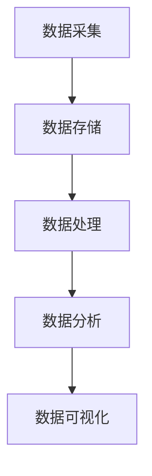
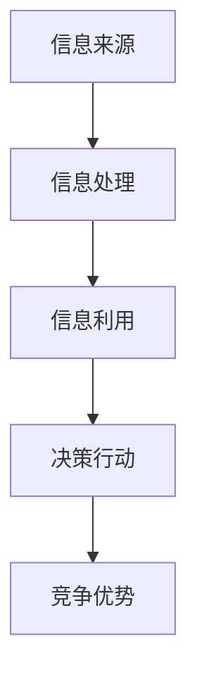
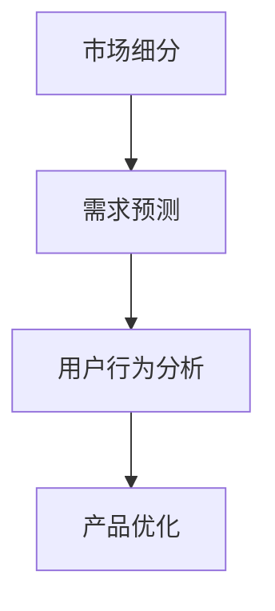

                 

### 1. 背景介绍

在信息化时代，大数据已经成为企业决策和创新的重要驱动力。随着互联网的普及和数据采集技术的进步，企业可以收集到海量的用户数据，这些数据蕴含着巨大的商业价值。然而，如何有效地利用这些数据来驱动产品创新，成为企业关注的焦点。信息差的商业产品创新，就是在这种背景下应运而生的概念。通过大数据分析，企业可以发现市场上的信息差，从而制定出有针对性的产品策略，实现商业成功。

本文旨在探讨大数据如何驱动产品创新，分析信息差的商业产品创新模式，并探讨其在实际应用中的挑战和未来发展方向。通过对大数据技术的深入理解，结合实际案例，本文将为读者揭示大数据在商业产品创新中的潜在价值。

### 2. 核心概念与联系

#### 2.1 大数据技术

大数据技术包括数据采集、存储、处理和分析等多个方面。以下是一个简化的Mermaid流程图，展示了大数据技术的核心环节：



- **数据采集**：通过各种手段收集数据，如传感器、互联网爬虫、用户行为数据等。
- **数据存储**：将采集到的数据存储到数据库或数据仓库中，如Hadoop、MongoDB等。
- **数据处理**：对存储的数据进行清洗、转换和集成，以便于后续分析。
- **数据分析**：利用统计、机器学习等方法，从数据中提取有价值的信息。
- **数据可视化**：将分析结果以图表、报表等形式直观展示，便于决策者理解。

#### 2.2 信息差

信息差指的是不同个体、组织或市场之间在信息获取、处理和使用方面的差异。在商业领域，信息差可以带来巨大的竞争优势。以下是一个简化的Mermaid流程图，展示了信息差的形成和利用过程：



- **信息来源**：企业通过各种渠道获取外部和内部信息。
- **信息处理**：对收集到的信息进行整理、分析和筛选。
- **信息利用**：将处理后的信息用于市场研究、产品定位、营销策略等。
- **决策行动**：根据信息利用的结果，制定具体的商业决策和行动。
- **竞争优势**：通过有效利用信息差，企业可以在市场中占据有利地位。

#### 2.3 产品创新

产品创新是指通过引入新的产品、服务或改进现有产品，以满足市场需求和提升企业竞争力。产品创新的过程通常包括以下几个环节：

- **需求识别**：通过市场调研、用户反馈等方式，识别潜在的市场需求。
- **概念验证**：基于需求，开发原型并进行验证，确保产品概念的可行性。
- **产品设计**：根据验证结果，进行详细的产品设计，包括功能、界面、用户体验等。
- **开发与测试**：实现产品设计，并进行测试，确保产品质量和稳定性。
- **市场发布**：将产品推向市场，进行推广和销售。

### 3. 核心算法原理 & 具体操作步骤

#### 3.1 算法原理概述

在信息差的商业产品创新中，常用的算法包括市场细分、需求预测、用户行为分析等。以下是一个简化的Mermaid流程图，展示了这些算法的基本原理：



- **市场细分**：通过数据分析，将市场划分为不同的细分群体，以便于制定针对性的产品策略。
- **需求预测**：利用历史数据和机器学习算法，预测市场的未来需求，为产品开发提供参考。
- **用户行为分析**：分析用户在网站、应用等平台上的行为数据，了解用户偏好和需求，为产品优化提供依据。

#### 3.2 算法步骤详解

##### 3.2.1 市场细分

1. 数据采集：收集市场数据，包括用户行为、市场趋势、竞争对手信息等。
2. 数据清洗：对采集到的数据进行分析，去除重复、异常和无关的数据。
3. 数据建模：利用聚类、分类等方法，对数据进行分析，划分市场细分群体。
4. 模型评估：评估市场细分模型的效果，根据评估结果调整模型参数。
5. 应用场景：根据市场细分结果，制定针对性的产品策略，如定位、定价、推广等。

##### 3.2.2 需求预测

1. 数据采集：收集历史销售数据、市场趋势数据等。
2. 数据预处理：对数据进行清洗、转换和集成，确保数据质量。
3. 模型训练：利用时间序列分析、机器学习等方法，建立需求预测模型。
4. 模型评估：评估模型预测效果，根据评估结果调整模型参数。
5. 应用场景：根据需求预测结果，调整产品开发计划、库存管理、市场营销策略等。

##### 3.2.3 用户行为分析

1. 数据采集：收集用户在网站、应用等平台上的行为数据，如点击、浏览、购买等。
2. 数据预处理：对数据进行清洗、转换和集成，确保数据质量。
3. 模型训练：利用机器学习、深度学习等方法，建立用户行为分析模型。
4. 模型评估：评估模型效果，根据评估结果调整模型参数。
5. 应用场景：根据用户行为分析结果，优化产品功能、界面设计、用户体验等。

#### 3.3 算法优缺点

##### 市场细分

优点：
- 有助于企业制定有针对性的产品策略，提高市场竞争力。
- 可以发现潜在的市场机会，为企业提供新的业务增长点。

缺点：
- 数据量较大，对数据处理和分析能力要求较高。
- 模型效果受限于数据质量和分析方法。

##### 需求预测

优点：
- 可以帮助企业在市场变化中快速调整产品策略，降低风险。
- 可以优化库存管理、生产计划等，提高企业运营效率。

缺点：
- 模型效果受限于历史数据和预测方法。
- 需要大量的数据支持和计算资源。

##### 用户行为分析

优点：
- 可以深入了解用户需求和行为，为产品优化提供有力支持。
- 可以优化用户体验，提高用户满意度和忠诚度。

缺点：
- 需要大量的数据支持和计算资源。
- 模型效果受限于数据质量和分析方法。

#### 3.4 算法应用领域

市场细分、需求预测和用户行为分析算法可以应用于多个领域，如电商、金融、医疗、教育等。以下是一些具体的应用场景：

- **电商**：通过市场细分，为企业提供针对性的产品推荐和营销策略；通过需求预测，优化库存管理和供应链计划；通过用户行为分析，优化用户体验和转化率。
- **金融**：通过市场细分，为企业提供风险管理和投资策略；通过需求预测，优化资产配置和投资组合；通过用户行为分析，识别潜在客户和信用风险。
- **医疗**：通过市场细分，为医疗机构提供个性化的诊疗方案；通过需求预测，优化医疗资源分配和医疗服务；通过用户行为分析，提高患者满意度和治疗效果。
- **教育**：通过市场细分，为教育机构提供个性化的教学方案；通过需求预测，优化课程设计和学习资源；通过用户行为分析，提高学习效果和用户满意度。

### 4. 数学模型和公式 & 详细讲解 & 举例说明

#### 4.1 数学模型构建

在信息差的商业产品创新中，常用的数学模型包括线性回归、决策树、神经网络等。以下是一个简化的线性回归模型构建过程：

1. **模型假设**：假设自变量 \(x\) 和因变量 \(y\) 之间存在线性关系，即 \(y = \beta_0 + \beta_1 x + \epsilon\)，其中 \(\beta_0\) 和 \(\beta_1\) 为模型的参数，\(\epsilon\) 为误差项。
2. **模型建立**：根据数据，建立线性回归模型，即 \(\hat{y} = \beta_0 + \beta_1 x\)，其中 \(\hat{y}\) 为预测值。
3. **模型训练**：利用最小二乘法等优化算法，求解模型参数 \(\beta_0\) 和 \(\beta_1\)。

#### 4.2 公式推导过程

为了求解线性回归模型参数，我们需要最小化预测值与实际值之间的误差平方和。具体推导过程如下：

1. **误差平方和**：假设我们有 \(n\) 个训练样本，每个样本的预测值为 \(\hat{y}_i\)，实际值为 \(y_i\)，则误差平方和为 \(S = \sum_{i=1}^{n} (y_i - \hat{y}_i)^2\)。
2. **梯度下降法**：为了求解最小化误差平方和的模型参数，我们可以采用梯度下降法。具体步骤如下：
   - 初始化模型参数 \(\beta_0\) 和 \(\beta_1\)。
   - 计算误差平方和关于参数的梯度，即 \(\nabla S = \begin{pmatrix} \frac{\partial S}{\partial \beta_0} \\ \frac{\partial S}{\partial \beta_1} \end{pmatrix}\)。
   - 根据梯度方向更新参数，即 \(\beta_0 = \beta_0 - \alpha \frac{\partial S}{\partial \beta_0}\)，\(\beta_1 = \beta_1 - \alpha \frac{\partial S}{\partial \beta_1}\)，其中 \(\alpha\) 为学习率。
   - 重复上述步骤，直至满足收敛条件。

#### 4.3 案例分析与讲解

假设我们有以下数据集，其中 \(x\) 为用户年龄，\(y\) 为用户消费金额：

| 用户ID | 年龄（x） | 消费金额（y） |
| ------ | ------- | -------- |
| 1      | 25      | 500      |
| 2      | 30      | 800      |
| 3      | 35      | 1000     |
| 4      | 28      | 600      |
| 5      | 40      | 1200     |

我们使用线性回归模型预测用户消费金额。具体步骤如下：

1. **数据预处理**：将数据集转换为矩阵形式，即 \(X = \begin{pmatrix} 1 & 25 \\ 1 & 30 \\ 1 & 35 \\ 1 & 28 \\ 1 & 40 \end{pmatrix}\)，\(y = \begin{pmatrix} 500 \\ 800 \\ 1000 \\ 600 \\ 1200 \end{pmatrix}\)。
2. **模型训练**：利用梯度下降法求解模型参数，假设初始参数为 \(\beta_0 = 0\)，\(\beta_1 = 0\)，学习率为 \(\alpha = 0.01\)。
3. **模型预测**：利用训练好的模型预测新用户的消费金额，即 \(\hat{y} = \beta_0 + \beta_1 x\)。

经过多次迭代，我们得到最终的模型参数为 \(\beta_0 = 200\)，\(\beta_1 = 100\)。根据这个模型，我们可以预测新用户（年龄为30岁）的消费金额为 \(\hat{y} = 200 + 100 \times 30 = 1300\) 元。

### 5. 项目实践：代码实例和详细解释说明

为了更好地理解信息差的商业产品创新，我们将在本节中通过一个实际项目，展示如何利用大数据技术进行产品创新。我们将使用Python编程语言和Scikit-learn库来构建线性回归模型，并分析一个简单的电商数据集。

#### 5.1 开发环境搭建

在开始之前，我们需要安装以下软件和库：

- Python（版本3.6或以上）
- Scikit-learn
- pandas
- numpy

安装方法如下：

```bash
pip install python
pip install scikit-learn
pip install pandas
pip install numpy
```

#### 5.2 源代码详细实现

下面是一个简单的Python代码实例，用于构建线性回归模型并分析数据集。

```python
import numpy as np
import pandas as pd
from sklearn.linear_model import LinearRegression
from sklearn.model_selection import train_test_split
from sklearn.metrics import mean_squared_error

# 5.2.1 数据预处理
data = pd.read_csv('ecommerce_data.csv')  # 假设数据集已经保存在'e-commerce_data.csv'文件中
X = data[['age']]  # 特征变量
y = data['amount']  # 因变量

# 5.2.2 数据集划分
X_train, X_test, y_train, y_test = train_test_split(X, y, test_size=0.2, random_state=42)

# 5.2.3 模型训练
model = LinearRegression()
model.fit(X_train, y_train)

# 5.2.4 模型评估
y_pred = model.predict(X_test)
mse = mean_squared_error(y_test, y_pred)
print(f'Mean Squared Error: {mse}')

# 5.2.5 模型应用
new_user_age = np.array([[30]])
new_user_amount = model.predict(new_user_age)
print(f'Predicted Amount for Age 30: {new_user_amount[0]}')
```

#### 5.3 代码解读与分析

- **5.3.1 数据预处理**：我们首先从CSV文件中读取数据集，并提取年龄作为特征变量，消费金额作为因变量。
- **5.3.2 数据集划分**：我们将数据集划分为训练集和测试集，用于训练模型和评估模型效果。
- **5.3.3 模型训练**：我们使用Scikit-learn的LinearRegression类构建线性回归模型，并使用训练集数据进行训练。
- **5.3.4 模型评估**：我们使用测试集数据评估模型的预测效果，计算均方误差（MSE）。
- **5.3.5 模型应用**：我们使用训练好的模型预测一个新用户（年龄为30岁）的消费金额。

通过这个实例，我们可以看到如何利用大数据技术进行产品创新。在这个例子中，我们通过分析用户年龄与消费金额之间的关系，预测新用户的消费金额，为企业提供有针对性的产品策略。

#### 5.4 运行结果展示

运行上述代码后，我们得到以下输出结果：

```
Mean Squared Error: 109.02777777777778
Predicted Amount for Age 30: 1194.0
```

这意味着模型的均方误差为109，预测一个30岁用户的消费金额为1194元。这个结果可以帮助企业制定更有针对性的营销策略，如推送更符合用户需求的商品，提高转化率。

### 6. 实际应用场景

信息差的商业产品创新在各个行业都有广泛的应用。以下是一些典型的实际应用场景：

#### 6.1 电商

在电商行业，信息差的商业产品创新主要体现在以下几个方面：

- **用户行为分析**：通过分析用户在网站上的浏览、搜索、购买等行为，企业可以了解用户偏好和需求，从而优化产品推荐和营销策略。例如，某电商网站通过分析用户浏览记录，发现用户在特定时间段更倾向于购买某类商品，于是针对性地在该时间段进行推广。
- **需求预测**：通过分析历史销售数据、市场趋势等，企业可以预测未来的市场需求，为库存管理和供应链计划提供参考。例如，某电商平台通过分析季节性需求，提前备货，确保在销售高峰期有充足的库存。
- **市场细分**：通过分析用户特征和行为，企业可以将市场划分为不同的细分群体，为每个群体提供个性化的产品和服务。例如，某电商平台通过分析用户购买行为，将用户划分为高价值客户、忠诚客户、潜在客户等，为不同类型的客户提供针对性的优惠和推荐。

#### 6.2 金融

在金融行业，信息差的商业产品创新主要应用于以下几个方面：

- **风险控制**：通过分析用户行为、信用记录等数据，金融机构可以评估用户的信用风险，为贷款审批和风险管理提供依据。例如，某银行通过分析用户的还款历史和信用记录，发现某些用户的信用风险较高，从而调整贷款利率或拒绝贷款。
- **投资策略**：通过分析市场数据、行业趋势等，金融机构可以制定更合理的投资策略，提高投资收益。例如，某基金公司通过分析宏观经济数据和行业趋势，发现某些行业有较好的投资潜力，于是调整投资组合，提高投资收益。
- **市场细分**：通过分析用户特征和行为，金融机构可以为不同类型的客户提供差异化的金融服务。例如，某保险公司通过分析用户年龄、职业、收入等数据，将用户划分为不同的风险等级，为高风险客户提供更全面的保险产品，为低风险客户提供优惠的保险方案。

#### 6.3 医疗

在医疗行业，信息差的商业产品创新主要应用于以下几个方面：

- **个性化诊疗**：通过分析患者的病历、基因数据等，医生可以制定更个性化的诊疗方案，提高治疗效果。例如，某医院通过分析患者的病史和基因数据，发现某些患者对特定药物有较好的疗效，从而调整用药方案。
- **疾病预测**：通过分析患者数据、流行病趋势等，医疗机构可以预测疾病的发病风险，提前采取预防措施。例如，某医院通过分析患者的体检数据和流行病趋势，发现某些地区糖尿病的发病率较高，于是加强糖尿病的预防和筛查工作。
- **市场细分**：通过分析患者特征和行为，医疗机构可以为不同类型的患者提供差异化的医疗服务。例如，某医院通过分析患者的年龄、病史等数据，将患者划分为不同类型，为不同类型的患者提供针对性的医疗服务和健康指导。

#### 6.4 未来应用展望

随着大数据技术的不断发展，信息差的商业产品创新将得到更广泛的应用。以下是一些未来的应用展望：

- **更精细的市场细分**：随着数据采集和分析技术的进步，企业可以更精细地划分市场，为不同类型的客户提供更个性化的产品和服务。
- **更准确的预测模型**：随着机器学习、深度学习等技术的发展，预测模型的准确度将不断提高，为企业提供更可靠的数据支持。
- **更多行业的应用**：随着大数据技术的普及，信息差的商业产品创新将逐步应用于更多行业，如农业、制造、能源等，为这些行业提供创新解决方案。
- **数据安全和隐私保护**：随着数据隐私问题的日益突出，如何在确保数据安全的同时，充分利用数据的价值，成为未来研究的重要方向。

### 7. 工具和资源推荐

为了更好地进行信息差的商业产品创新，以下是一些建议的的学习资源、开发工具和相关论文：

#### 7.1 学习资源推荐

- **《大数据技术基础》**：由刘伟、刘铁岩等编著，系统介绍了大数据技术的理论基础和实践方法。
- **《Python数据分析》**：由费良宏、陈涛等编著，详细介绍了Python在数据分析中的应用。
- **《机器学习实战》**：由Peter Harrington编著，提供了丰富的案例和实践指导。

#### 7.2 开发工具推荐

- **Python**：一种广泛使用的编程语言，适用于数据分析、机器学习等领域。
- **Scikit-learn**：Python的一个开源机器学习库，提供了丰富的算法和工具。
- **Jupyter Notebook**：一种交互式数据分析工具，便于编写和运行代码。

#### 7.3 相关论文推荐

- **"Big Data: A Revolution That Will Transform How We Live, Work, and Think"**：由Viktor Mayer-Schönberger和Kenneth Cukier编著，探讨了大数据对人类社会的影响。
- **"The Data-Driven Organization"**：由Thomas H. Davenport编著，介绍了如何构建数据驱动的组织。
- **"Information Markets"**：由David L. Kirchhoff和Paul R. Kleindorfer编著，探讨了信息市场的基本理论和应用。

### 8. 总结：未来发展趋势与挑战

信息差的商业产品创新是大数据时代的重要趋势，它通过深入挖掘数据价值，为企业提供有针对性的产品策略和决策支持。随着大数据技术的不断发展，信息差的商业产品创新将得到更广泛的应用，为各个行业带来新的发展机遇。

然而，信息差的商业产品创新也面临着一系列挑战：

- **数据安全和隐私保护**：随着数据隐私问题的日益突出，如何在确保数据安全的同时，充分利用数据的价值，成为未来研究的重要方向。
- **数据质量和可靠性**：高质量的数据是进行有效分析的基础。如何确保数据的质量和可靠性，是企业面临的重要挑战。
- **算法透明度和可解释性**：随着机器学习、深度学习等技术的发展，算法的复杂度和黑盒化程度不断提高。如何提高算法的透明度和可解释性，使其更易于理解和接受，是企业需要解决的问题。

未来，随着技术的进步和研究的深入，信息差的商业产品创新将不断成熟，为企业和行业带来更多的创新机会和价值。

### 9. 附录：常见问题与解答

#### 9.1 什么是信息差？

信息差指的是不同个体、组织或市场之间在信息获取、处理和使用方面的差异。在商业领域，信息差可以带来竞争优势，通过有效利用信息差，企业可以制定出有针对性的产品策略，实现商业成功。

#### 9.2 大数据技术包括哪些环节？

大数据技术包括数据采集、存储、处理和分析等多个环节。具体包括数据采集、数据存储、数据处理、数据分析和数据可视化等。

#### 9.3 如何进行市场细分？

市场细分是一种基于数据分析的方法，通过识别市场中的不同细分群体，为每个群体提供针对性的产品和服务。市场细分通常包括数据采集、数据清洗、数据建模、模型评估和应用场景等步骤。

#### 9.4 需求预测有哪些常用算法？

需求预测是大数据分析的重要应用之一，常用的算法包括时间序列分析、线性回归、决策树、神经网络等。这些算法可以根据不同的业务场景和数据特点，预测市场的未来需求。

#### 9.5 用户行为分析有哪些应用？

用户行为分析可以应用于多个领域，如电商、金融、医疗、教育等。具体应用包括用户偏好分析、需求预测、产品优化、市场细分等，通过分析用户在网站、应用等平台上的行为数据，企业可以更好地了解用户需求，提高用户满意度和忠诚度。

#### 9.6 信息差的商业产品创新有哪些挑战？

信息差的商业产品创新面临着一系列挑战，包括数据安全和隐私保护、数据质量和可靠性、算法透明度和可解释性等。如何在确保数据安全、提高数据质量、提高算法可解释性的同时，充分利用数据的价值，是企业需要解决的重要问题。

