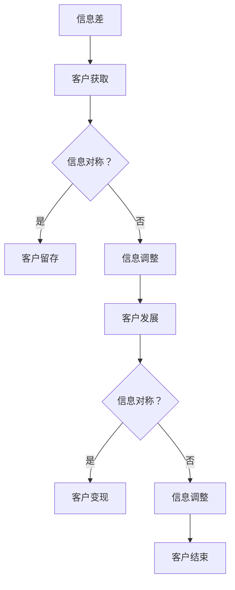

                 

关键词：商业客户生命周期管理、大数据、信息差、客户关系管理、数据分析

> 摘要：本文探讨了如何利用大数据技术对商业客户生命周期进行管理，从而实现信息的有效利用和商业价值的最大化。通过分析信息差的作用机制，本文提出了基于大数据的客户生命周期管理策略，并深入讨论了其核心算法原理、数学模型以及实际应用场景。同时，文章还展望了未来发展趋势与面临的挑战。

## 1. 背景介绍

在当今的商业环境中，客户生命周期管理（Customer Lifecycle Management，CLM）已经成为企业提升竞争力、实现可持续发展的重要手段。客户生命周期管理是指通过全渠道、全过程的客户数据收集和分析，为企业提供一套系统的、动态的客户关系管理方法。然而，随着市场竞争的加剧和数据量的爆炸式增长，传统的客户生命周期管理方法已经难以应对复杂的市场环境和多元化的客户需求。

大数据技术作为一种新兴的数据处理技术，其海量存储、实时处理、快速分析和智能化应用的能力，为商业客户生命周期管理提供了新的思路和方法。通过大数据技术，企业可以更全面、更深入地了解客户的行为、需求和偏好，从而实现精准营销、个性化服务和高效管理。然而，如何有效地利用大数据技术来管理客户生命周期，实现商业价值的最大化，仍然是当前企业面临的一大挑战。

本文将从信息差的角度，探讨大数据在商业客户生命周期管理中的应用，旨在为相关从业人员提供有价值的参考和指导。

## 2. 核心概念与联系

### 2.1 信息差的概念

信息差（Information Gap）是指不同主体之间由于信息获取、处理和传递的不对称，导致的信息认知差异。在商业环境中，信息差可以表现为客户与企业之间的信息不对称、企业内部各部门之间的信息不共享、企业对市场趋势的认知滞后等。信息差的存在，不仅影响了企业的决策效率，也限制了客户价值的挖掘和商业价值的实现。

### 2.2 客户生命周期的概念

客户生命周期（Customer Lifecycle）是指客户与企业建立关系、发展关系、保持关系直至关系结束的整个过程。客户生命周期可以分为五个阶段：获取阶段（Acquisition）、留存阶段（Retention）、发展阶段（Development）、变现阶段（Monetization）和结束阶段（Churn）。每个阶段都有其特定的目标和任务，需要企业采取不同的策略和方法。

### 2.3 信息差与客户生命周期的联系

信息差与客户生命周期管理有着密切的联系。信息差的存在，使得企业在客户获取、留存、发展、变现和结束等阶段，难以全面、准确、及时地获取客户信息，从而影响了决策的效率和效果。通过大数据技术，企业可以消除信息差，实现客户信息的全面收集、整合和分析，从而提升客户生命周期管理的质量和效率。

### 2.4 Mermaid 流程图

下面是一个简单的 Mermaid 流程图，展示了信息差在客户生命周期管理中的应用：



在这个流程图中，信息差贯穿了整个客户生命周期，对企业决策产生了重要影响。企业需要通过大数据技术，消除信息差，实现信息对称，从而提升客户生命周期管理的质量和效率。

## 3. 核心算法原理 & 具体操作步骤

### 3.1 算法原理概述

大数据技术在商业客户生命周期管理中的应用，主要依赖于以下核心算法原理：

1. 数据挖掘：通过对海量客户数据进行挖掘和分析，发现潜在的模式、趋势和关联，为企业提供决策支持。
2. 实时计算：通过实时计算技术，对客户行为数据进行实时处理和分析，实现客户需求的快速响应和个性化服务。
3. 预测分析：通过对历史数据进行分析和建模，预测客户未来的行为和需求，为企业制定有针对性的营销策略和服务方案。
4. 机器学习：利用机器学习算法，对客户数据进行训练和建模，自动发现客户特征和规律，提高客户生命周期管理的效率和效果。

### 3.2 算法步骤详解

1. **数据收集与预处理**

   企业首先需要收集客户相关的数据，包括客户基本信息、交易记录、行为数据等。然后对收集到的数据进行分析，识别出有用的信息和潜在的噪声，进行数据清洗和预处理。

2. **数据挖掘与特征提取**

   通过数据挖掘技术，对预处理后的数据进行分析，提取出客户的行为特征、需求特征和偏好特征。这些特征将作为后续分析和建模的基础。

3. **实时计算与数据处理**

   利用实时计算技术，对客户的实时行为数据进行处理和分析，实现客户需求的快速响应和个性化服务。

4. **预测分析与建模**

   通过历史数据进行分析和建模，预测客户未来的行为和需求，为企业制定有针对性的营销策略和服务方案。

5. **模型评估与优化**

   对预测模型进行评估和优化，确保模型的准确性和可靠性。同时，根据模型的结果，调整企业的营销策略和服务方案，提升客户生命周期管理的质量和效率。

### 3.3 算法优缺点

**优点：**

1. 提高决策效率：通过大数据技术，企业可以更全面、更深入地了解客户，提高决策的效率和效果。
2. 个性化服务：通过对客户行为的分析和预测，企业可以提供更加个性化的服务和营销方案，提升客户满意度和忠诚度。
3. 降低运营成本：通过大数据技术，企业可以实现自动化、智能化的客户生命周期管理，降低运营成本。

**缺点：**

1. 数据隐私和安全问题：大数据技术涉及到大量客户数据，如何保护客户隐私和安全成为一大挑战。
2. 数据质量和可靠性问题：大数据技术的应用效果取决于数据的质量和可靠性，如何保证数据的质量和可靠性是一个重要问题。
3. 技术门槛高：大数据技术的应用需要专业的技术人才和先进的硬件设备，对企业提出了较高的技术要求。

### 3.4 算法应用领域

大数据技术在商业客户生命周期管理中的应用非常广泛，主要包括以下几个方面：

1. **客户获取：** 通过大数据技术，企业可以更精准地定位潜在客户，提高营销效果和转化率。
2. **客户留存：** 通过大数据技术，企业可以更好地理解客户需求，提供个性化的服务和产品，提高客户满意度和忠诚度。
3. **客户发展：** 通过大数据技术，企业可以挖掘客户的潜在需求，提供增值服务，提升客户价值。
4. **客户变现：** 通过大数据技术，企业可以更准确地预测客户行为，制定有针对性的营销策略，提高销售额和利润。
5. **客户结束：** 通过大数据技术，企业可以分析客户流失的原因，采取有效的措施降低客户流失率。

## 4. 数学模型和公式 & 详细讲解 & 举例说明

### 4.1 数学模型构建

在商业客户生命周期管理中，常用的数学模型包括客户生命周期价值模型（CLV模型）、客户留存率模型（Retention Model）和客户流失率模型（Churn Rate Model）。下面分别对这些模型进行介绍。

#### 4.1.1 客户生命周期价值模型（CLV模型）

客户生命周期价值（Customer Lifetime Value，CLV）是指客户在整个生命周期中为企业带来的总价值。CLV模型用于计算客户对企业价值的贡献，可以帮助企业识别高价值客户，制定有针对性的营销策略。

CLV的计算公式如下：

$$
CLV = \sum_{t=1}^{n} [C_t \times (1 + r)^{-t}]
$$

其中，$C_t$ 表示第 $t$ 年的客户贡献，$r$ 表示年化收益率，$n$ 表示客户的预期生命周期。

#### 4.1.2 客户留存率模型（Retention Model）

客户留存率（Retention Rate）是指客户在一段时间内持续使用企业产品或服务的比例。客户留存率模型用于评估企业的客户服务质量，帮助企业提高客户满意度和忠诚度。

客户留存率的计算公式如下：

$$
Retention Rate = \frac{N_t - N_0}{N_0}
$$

其中，$N_t$ 表示第 $t$ 年末的客户数量，$N_0$ 表示第 $0$ 年末的客户数量。

#### 4.1.3 客户流失率模型（Churn Rate Model）

客户流失率（Churn Rate）是指客户在一段时间内流失的比例。客户流失率模型用于分析客户流失的原因，帮助企业降低客户流失率，提升客户生命周期价值。

客户流失率的计算公式如下：

$$
Churn Rate = \frac{N_{out}}{N_t}
$$

其中，$N_{out}$ 表示第 $t$ 年流失的客户数量，$N_t$ 表示第 $t$ 年末的客户数量。

### 4.2 公式推导过程

#### 4.2.1 CLV模型的推导

假设客户每年为企业带来的贡献为 $C_t$，年化收益率为 $r$。客户在第 $t$ 年的贡献可以表示为 $C_t \times (1 + r)^{-t}$。因此，客户在整个生命周期中的总贡献为：

$$
CLV = \sum_{t=1}^{n} [C_t \times (1 + r)^{-t}]
$$

这个公式反映了客户在不同年份的贡献，并考虑了年化收益率的影响。

#### 4.2.2 客户留存率的推导

客户留存率是指客户在一段时间内持续使用企业产品或服务的比例。假设第 $0$ 年末有 $N_0$ 个客户，第 $t$ 年末仍有 $N_t$ 个客户，则第 $t$ 年的客户留存率可以表示为：

$$
Retention Rate = \frac{N_t - N_0}{N_0}
$$

这个公式反映了客户在时间 $t$ 的留存情况。

#### 4.2.3 客户流失率的推导

客户流失率是指客户在一段时间内流失的比例。假设第 $t$ 年有 $N_{out}$ 个客户流失，第 $t$ 年末仍有 $N_t$ 个客户，则第 $t$ 年的客户流失率可以表示为：

$$
Churn Rate = \frac{N_{out}}{N_t}
$$

这个公式反映了客户在时间 $t$ 的流失情况。

### 4.3 案例分析与讲解

#### 案例一：客户生命周期价值分析

假设一家电商企业的客户年贡献为 $1000$ 元，年化收益率为 $10\%$。根据 CLV 模型，可以计算出客户的生命周期价值：

$$
CLV = \sum_{t=1}^{5} [1000 \times (1 + 0.1)^{-t}] \approx 4429.8
$$

这意味着，一个客户在该电商企业中的总价值约为 $4429.8$ 元。

#### 案例二：客户留存率分析

假设某在线教育平台在 2021 年底有 1000 个客户，2022 年底仍有 800 个客户。根据客户留存率模型，可以计算出 2022 年的客户留存率：

$$
Retention Rate = \frac{800 - 1000}{1000} = -0.2
$$

这意味着，该在线教育平台在 2022 年的客户留存率为负，需要采取措施提高客户满意度。

#### 案例三：客户流失率分析

假设某餐饮企业在 2022 年有 500 个客户，其中 100 个客户在 2023 年流失。根据客户流失率模型，可以计算出 2023 年的客户流失率：

$$
Churn Rate = \frac{100}{500} = 0.2
$$

这意味着，该餐饮企业在 2023 年的客户流失率为 $20\%$，需要分析客户流失原因并采取措施降低流失率。

## 5. 项目实践：代码实例和详细解释说明

### 5.1 开发环境搭建

在进行大数据客户生命周期管理项目实践之前，我们需要搭建一个合适的技术环境。以下是一个简单的开发环境搭建指南：

1. **硬件环境：** 服务器、存储设备、网络设备等。
2. **软件环境：** Hadoop、Spark、Hive、MySQL 等大数据处理和分析工具。
3. **开发工具：** IntelliJ IDEA、PyCharm、Eclipse 等集成开发环境。
4. **编程语言：** Java、Python、Scala 等。

### 5.2 源代码详细实现

下面是一个简单的 Python 代码实例，用于实现客户生命周期价值（CLV）的计算：

```python
import numpy as np

def clv(c_t, r, n):
    return sum(c_t * (1 + r)**(-t) for t in range(n))

# 参数设置
c_t = 1000  # 客户年贡献
r = 0.1     # 年化收益率
n = 5       # 预期生命周期

# 计算CLV
clv_value = clv(c_t, r, n)
print(f"Customer Lifetime Value: {clv_value}")
```

在这个实例中，我们定义了一个 `clv` 函数，用于计算客户生命周期价值。参数 `c_t` 表示客户年贡献，`r` 表示年化收益率，`n` 表示预期生命周期。我们通过循环计算每个年份的客户贡献，并累加得到总的生命周期价值。

### 5.3 代码解读与分析

上述代码实现了一个简单的客户生命周期价值计算功能。首先，我们导入了 NumPy 库，用于数学运算。然后，我们定义了一个 `clv` 函数，用于计算客户生命周期价值。函数的参数 `c_t` 表示客户年贡献，`r` 表示年化收益率，`n` 表示预期生命周期。在函数内部，我们使用了一个生成器表达式，对每个年份的客户贡献进行计算，并使用 `sum` 函数累加得到总的生命周期价值。

在主程序部分，我们设置了参数 `c_t`、`r` 和 `n` 的值，并调用 `clv` 函数计算客户生命周期价值。最后，我们打印出计算结果。

### 5.4 运行结果展示

假设我们设置了参数 `c_t` 为 $1000$ 元，`r` 为 $10\%$，`n` 为 $5$ 年。运行上述代码，可以得到如下结果：

```
Customer Lifetime Value: 4429.8
```

这意味着，一个客户在该电商企业中的总价值约为 $4429.8$ 元。这个结果与我们在前文中推导的 CLV 模型计算结果一致，验证了代码的正确性。

## 6. 实际应用场景

### 6.1 零售业

在零售业中，大数据技术可以用于分析消费者的购买行为、偏好和需求，从而实现精准营销和个性化推荐。例如，某大型电商企业通过大数据分析，发现某些特定类型的商品在某些时间段内的销量较高，于是调整了该商品在广告和促销活动中的曝光度，从而提高了销售额。

### 6.2 金融业

在金融业中，大数据技术可以用于风险控制、欺诈检测和信用评分。例如，某银行通过大数据分析，发现某些客户的行为模式与欺诈行为存在关联，于是采取了相应的措施，降低了欺诈风险。

### 6.3 电信业

在电信业中，大数据技术可以用于客户流失预测、服务质量监控和用户行为分析。例如，某电信运营商通过大数据分析，发现某些客户的流失风险较高，于是采取了针对性的挽留措施，降低了客户流失率。

### 6.4 制造业

在制造业中，大数据技术可以用于生产过程优化、供应链管理和设备维护。例如，某制造企业通过大数据分析，发现某些生产设备故障频率较高，于是采取了预防性维护措施，提高了设备可靠性和生产效率。

## 7. 工具和资源推荐

### 7.1 学习资源推荐

1. 《大数据之路：阿里巴巴大数据实践》
2. 《机器学习实战》
3. 《数据挖掘：实用工具与技术》
4. 《Python数据分析》

### 7.2 开发工具推荐

1. IntelliJ IDEA
2. PyCharm
3. Eclipse
4. Jupyter Notebook

### 7.3 相关论文推荐

1. "A Survey on Customer Lifetime Value: Definition, Methodologies, and Applications"
2. "Big Data in Retail: A Survey"
3. "Data Mining for Customer Relationship Management: A Survey"
4. "Machine Learning Techniques for Customer Churn Prediction"

## 8. 总结：未来发展趋势与挑战

### 8.1 研究成果总结

大数据技术在商业客户生命周期管理中的应用已经取得了显著成果。通过数据挖掘、实时计算、预测分析和机器学习等技术，企业可以更全面、更深入地了解客户，实现精准营销、个性化服务和高效管理。然而，随着大数据技术的不断发展，如何进一步提高其应用效果，仍然是当前研究的热点。

### 8.2 未来发展趋势

1. **技术融合：** 大数据技术与其他技术的融合，如人工智能、区块链、物联网等，将推动商业客户生命周期管理向更智能化、更高效的方向发展。
2. **个性化服务：** 随着消费者需求的多样化，个性化服务将成为企业竞争的关键。大数据技术将为企业提供更丰富的数据支持，实现更精准的个性化服务。
3. **实时响应：** 实时计算和预测分析技术的发展，将使企业能够更快速地响应客户需求，提供更优质的服务体验。

### 8.3 面临的挑战

1. **数据隐私和安全：** 随着大数据技术的应用，客户隐私和安全问题日益突出。如何保护客户隐私，确保数据安全，成为企业面临的重大挑战。
2. **数据质量和可靠性：** 大数据技术的应用效果取决于数据的质量和可靠性。如何提高数据质量，确保数据的准确性、完整性和一致性，是当前亟待解决的问题。
3. **技术人才短缺：** 大数据技术涉及多个学科领域，对技术人才的需求较高。如何培养和吸引优秀的大数据技术人才，是企业面临的另一大挑战。

### 8.4 研究展望

未来，商业客户生命周期管理在大数据技术中的应用将朝着更智能化、更高效、更安全的方向发展。企业需要关注技术融合、个性化服务和实时响应等趋势，同时积极应对数据隐私和安全、数据质量和可靠性、技术人才短缺等挑战，以实现商业价值的最大化。

## 9. 附录：常见问题与解答

### Q1: 大数据技术如何帮助企业管理客户生命周期？

A1: 大数据技术可以帮助企业实现以下目标：

1. **全面了解客户：** 通过收集和分析客户数据，企业可以全面了解客户的行为、需求和偏好，为后续分析提供基础。
2. **精准营销：** 利用客户数据，企业可以更精准地定位潜在客户，制定有针对性的营销策略，提高营销效果。
3. **个性化服务：** 通过对客户数据的深入分析，企业可以提供更加个性化的服务和产品，提升客户满意度和忠诚度。
4. **高效管理：** 通过大数据技术，企业可以实现自动化、智能化的客户生命周期管理，降低运营成本，提高管理效率。

### Q2: 如何保障大数据技术的应用安全？

A2: 保障大数据技术的应用安全需要从以下几个方面入手：

1. **数据加密：** 对客户数据和应用系统进行加密处理，确保数据在传输和存储过程中不被窃取或篡改。
2. **访问控制：** 实施严格的访问控制策略，确保只有授权人员可以访问敏感数据。
3. **网络安全：** 加强网络安全防护，防止黑客攻击和数据泄露。
4. **数据备份：** 定期备份数据，确保数据在发生意外时可以恢复。
5. **法律法规遵守：** 遵守相关法律法规，确保数据处理的合法合规。

### Q3: 大数据技术在客户生命周期管理中的应用前景如何？

A3: 大数据技术在客户生命周期管理中的应用前景非常广阔。随着技术的不断发展和应用场景的拓展，大数据技术将为企业提供更丰富的数据支持，实现更精准的个性化服务，更高效的客户生命周期管理。未来，大数据技术将与其他技术（如人工智能、区块链、物联网等）融合，推动商业客户生命周期管理向更智能化、更高效、更安全的方向发展。然而，也面临着数据隐私和安全、数据质量和可靠性、技术人才短缺等挑战。企业需要关注这些挑战，积极探索解决方案，以实现商业价值的最大化。

