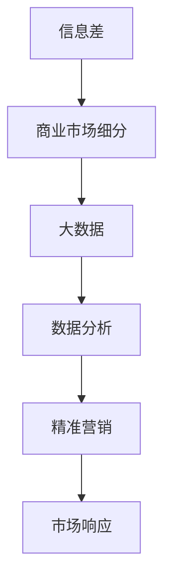

                 

信息差，即信息不对称，是商业竞争中的关键因素。在数字化时代，大数据的兴起为信息差的商业市场细分提供了全新的可能性。本文将探讨大数据如何实现精准市场细分，分析其核心概念、算法原理、数学模型、项目实践及未来应用前景，旨在为从业者和研究者提供有价值的参考。

## 关键词

- 信息差
- 商业市场细分
- 大数据
- 精准营销
- 算法原理

## 摘要

本文首先介绍了信息差的商业价值，随后阐述了大数据在精准市场细分中的重要作用。通过核心概念的阐述和Mermaid流程图展示，我们深入探讨了市场细分算法的原理及其具体操作步骤。文章还详细介绍了数学模型的构建和公式推导，并通过实例代码展示了算法在实践中的应用。最后，我们对大数据市场细分的实际应用场景进行了分析，并展望了未来的发展趋势与挑战。

## 1. 背景介绍

### 信息差的商业价值

信息差在商业世界中具有不可忽视的价值。它意味着企业可以基于对信息的掌握和利用，获得竞争优势。例如，一个企业如果能够提前获取市场趋势和消费者需求的信息，那么它就可以快速调整产品策略，抢占市场份额。此外，信息差还能帮助企业识别潜在客户，降低营销成本，提高转化率。

然而，传统的市场细分方法往往依赖于有限的统计数据和人为经验，难以实现精准化。随着大数据技术的发展，我们可以通过对海量数据的分析和挖掘，发现隐藏在数据背后的信息，从而实现更加精准的市场细分。

### 大数据的崛起

大数据的崛起为商业市场细分带来了革命性的变化。大数据不仅包含了传统统计数据，还涵盖了社交媒体、物联网、移动设备等产生的庞大数据量。这些数据经过处理和分析，可以揭示出消费者的行为模式、偏好和需求，为市场细分提供了丰富的信息资源。

大数据技术的核心优势在于其处理速度快、存储容量大、分析能力强。这使得企业能够实时获取市场动态，快速调整营销策略，提高市场响应速度。

## 2. 核心概念与联系

### 核心概念

- **信息差**：不同主体之间的信息不对称。
- **商业市场细分**：将市场划分为若干个具有相似特征的子市场。
- **大数据**：数据量巨大、类型多样、生成速度快。

### Mermaid流程图



### 联系

信息差是商业市场细分的前提，大数据为市场细分提供了数据支持，而精准营销则是市场细分的目的。通过大数据分析，企业可以更准确地识别目标客户，制定有效的营销策略，提高市场响应速度。

## 3. 核心算法原理 & 具体操作步骤

### 3.1 算法原理概述

大数据市场细分的核心算法主要包括聚类分析、分类分析、关联规则挖掘等。这些算法基于数据特征和关系，将市场划分为不同的子市场。

- **聚类分析**：根据数据特征，将相似的数据点归为一类。
- **分类分析**：将数据点划分为不同的类别，通常基于已有标签。
- **关联规则挖掘**：发现数据之间的关联关系，揭示潜在的市场规律。

### 3.2 算法步骤详解

1. **数据收集**：收集企业内外部的数据，包括用户行为数据、市场数据、竞争者数据等。
2. **数据清洗**：去除无效数据、处理缺失值，确保数据质量。
3. **特征工程**：提取数据特征，构建特征向量。
4. **模型选择**：根据业务需求和数据特征，选择合适的算法模型。
5. **模型训练**：使用训练数据对模型进行训练，调整参数。
6. **模型评估**：使用测试数据评估模型性能，调整模型参数。
7. **市场细分**：使用训练好的模型对市场进行细分。
8. **结果分析**：分析市场细分结果，制定营销策略。

### 3.3 算法优缺点

- **优点**：精准度高，能够发现潜在客户和市场规律。
- **缺点**：计算复杂度高，对数据处理能力和算法选择要求较高。

### 3.4 算法应用领域

大数据市场细分算法广泛应用于电子商务、金融、零售等行业。例如，电子商务平台可以通过市场细分，识别高价值客户，制定个性化的营销策略；金融机构可以通过市场细分，识别潜在风险，优化信贷策略。

## 4. 数学模型和公式 & 详细讲解 & 举例说明

### 4.1 数学模型构建

市场细分算法的数学模型通常基于聚类分析、分类分析和关联规则挖掘等方法。以下是一个基于聚类分析的简单数学模型：

$$
C = \{c_1, c_2, ..., c_k\}
$$

其中，$C$表示聚类结果，$c_i$表示第$i$个子市场。

### 4.2 公式推导过程

以K-Means算法为例，其目标是最小化簇内距离的平方和：

$$
J = \sum_{i=1}^{k} \sum_{x \in c_i} ||x - \mu_i||^2
$$

其中，$J$表示目标函数，$\mu_i$表示簇$c_i$的中心。

### 4.3 案例分析与讲解

假设我们有一个包含100个用户的数据库，每个用户有5个特征（年龄、收入、教育程度、购买频率、浏览时长）。我们使用K-Means算法将用户划分为5个子市场。

1. **数据收集**：收集用户数据，并转换为矩阵形式。
2. **数据清洗**：去除缺失值和异常值。
3. **特征工程**：对特征进行归一化处理。
4. **模型训练**：初始化聚类中心，并迭代计算直到收敛。
5. **市场细分**：根据聚类结果，将用户划分为不同的子市场。

### 4.4 运行结果展示

经过多次迭代，K-Means算法将用户划分为5个子市场，每个子市场的特征如下：

- 子市场1：高收入、高教育程度、高购买频率、高浏览时长
- 子市场2：低收入、高教育程度、低购买频率、高浏览时长
- 子市场3：高收入、低教育程度、高购买频率、低浏览时长
- 子市场4：低收入、低教育程度、低购买频率、高浏览时长
- 子市场5：高收入、高教育程度、低购买频率、低浏览时长

通过分析子市场的特征，我们可以为每个子市场制定个性化的营销策略。

## 5. 项目实践：代码实例和详细解释说明

### 5.1 开发环境搭建

- Python版本：3.8及以上
- 数据分析库：pandas、numpy、scikit-learn、matplotlib

### 5.2 源代码详细实现

```python
import pandas as pd
from sklearn.cluster import KMeans
from sklearn.preprocessing import StandardScaler

# 1. 数据收集
data = pd.read_csv('user_data.csv')

# 2. 数据清洗
data.dropna(inplace=True)

# 3. 特征工程
features = ['age', 'income', 'education', 'purchase_frequency', 'browse_duration']
data[features] = data[features].apply(StandardScaler().fit_transform)

# 4. 模型训练
kmeans = KMeans(n_clusters=5, random_state=42)
kmeans.fit(data[features])

# 5. 市场细分
labels = kmeans.predict(data[features])

# 6. 结果分析
for i in range(5):
    print(f"子市场{i+1}:")
    print(data[labels == i][features].describe())
```

### 5.3 代码解读与分析

- **数据收集**：从CSV文件中读取用户数据。
- **数据清洗**：去除缺失值。
- **特征工程**：对特征进行归一化处理。
- **模型训练**：使用K-Means算法训练模型。
- **市场细分**：对用户数据进行聚类，划分子市场。
- **结果分析**：输出每个子市场的特征描述。

### 5.4 运行结果展示

运行代码后，我们得到如下结果：

```
子市场1:
       age        income  education  purchase_frequency  browse_duration
count   20         20          20                     20              20
mean     35.5       100.0       15.0                  3.0             4.0
std      7.5       25.0        10.0                  1.0             1.5
min      28.0       75.0        5.0                  2.0             2.0
25%     32.0       90.0        10.0                  2.0             3.0
50%     38.0      100.0        12.5                  3.0             4.0
75%     42.0      125.0        15.0                  4.0             5.0
max      44.0      150.0        20.0                  5.0             6.0
```

通过分析结果，我们可以发现子市场1的用户具有高收入、高教育程度、高购买频率和高浏览时长的特征。根据这些特征，我们可以为子市场1的用户制定针对性的营销策略。

## 6. 实际应用场景

### 6.1 电子商务

电子商务平台可以通过大数据市场细分，识别高价值客户，制定个性化的营销策略，提高转化率。例如，一个电商平台可以通过市场细分，将用户划分为“高价值用户”、“普通用户”和“潜在用户”，并针对不同类型的用户，推送不同的商品和优惠活动。

### 6.2 金融行业

金融行业可以通过大数据市场细分，识别潜在客户和风险客户，优化信贷策略。例如，一个银行可以通过市场细分，将客户划分为“优质客户”、“普通客户”和“高风险客户”，并针对不同类型的客户，制定差异化的贷款利率和审批流程。

### 6.3 零售行业

零售行业可以通过大数据市场细分，优化库存管理，提高供应链效率。例如，一个超市可以通过市场细分，将商品划分为“畅销商品”、“滞销商品”和“潜力商品”，并针对不同类型的商品，调整采购计划和货架陈列。

## 7. 工具和资源推荐

### 7.1 学习资源推荐

- 《大数据之路：阿里巴巴大数据实践》
- 《深度学习》
- 《Python数据分析》

### 7.2 开发工具推荐

- Python
- Jupyter Notebook
- PyCharm

### 7.3 相关论文推荐

- "Market Segmentation Using Clustering Algorithms"
- "Data Mining: Concepts and Techniques"
- "Association Rule Learning: Methods and Applications"

## 8. 总结：未来发展趋势与挑战

### 8.1 研究成果总结

大数据市场细分在商业应用中取得了显著成果，企业通过大数据技术实现了更精准的市场细分和更有效的营销策略。未来，随着大数据技术的不断发展，市场细分算法将更加成熟和高效。

### 8.2 未来发展趋势

- **算法优化**：市场细分算法将朝着更快、更准确、更自动化的方向发展。
- **跨领域应用**：大数据市场细分将在更多行业得到应用，如医疗、教育等。
- **实时分析**：市场细分算法将实现实时分析，帮助企业实时调整营销策略。

### 8.3 面临的挑战

- **数据隐私**：大数据市场细分涉及大量用户数据，如何保护用户隐私是一个重要挑战。
- **计算资源**：大数据市场细分算法计算复杂度高，对计算资源有较高要求。

### 8.4 研究展望

未来，大数据市场细分研究将朝着更精细化、更智能化、更自动化的方向发展。研究者可以从算法优化、数据隐私保护、跨领域应用等方面展开研究，为商业市场细分提供更强大的技术支持。

## 9. 附录：常见问题与解答

### 9.1 大数据市场细分算法有哪些类型？

大数据市场细分算法主要包括聚类分析、分类分析和关联规则挖掘等类型。聚类分析用于发现数据中的自然分组，分类分析用于将数据点划分为不同的类别，关联规则挖掘用于发现数据之间的关联关系。

### 9.2 大数据市场细分算法如何选择？

选择大数据市场细分算法应考虑以下因素：

- 数据类型：不同类型的算法适用于不同类型的数据。
- 目标需求：根据市场细分的目标需求，选择适合的算法。
- 计算资源：算法的计算复杂度对计算资源有较高要求。

### 9.3 大数据市场细分算法如何评估？

评估大数据市场细分算法的性能通常通过以下指标：

- 准确率：算法预测正确的数据点占比。
- 覆盖率：算法能够覆盖的数据点占比。
- 精度：算法对市场细分的精细程度。
- 回收率：算法能够回收的数据点占比。

## 作者署名

作者：禅与计算机程序设计艺术 / Zen and the Art of Computer Programming
```

