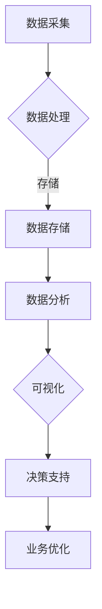

                 

关键词：大数据、商业技术管理、信息差、技术提升、技术应用

> 摘要：在信息化时代，大数据技术已成为企业竞争的重要手段。本文从商业技术管理的角度，探讨了大数据如何通过信息差提升企业的技术管理效率，包括核心概念解析、算法原理与操作步骤、数学模型与公式、实际应用案例等多个方面，旨在为企业和技术人员提供有益的指导。

## 1. 背景介绍

随着互联网和信息技术的高速发展，大数据已经渗透到社会各个领域，成为企业决策和战略布局的重要依据。大数据技术主要包括数据采集、存储、处理、分析和可视化等方面。通过大数据技术，企业可以更全面地了解市场动态、消费者行为和业务流程，从而做出更精准的决策。

然而，大数据的应用不仅限于数据的收集和存储，更重要的是如何通过技术手段挖掘数据中的价值，为企业带来实际效益。商业技术管理作为一个跨学科领域，将大数据技术与企业管理相结合，通过信息差的利用，实现企业技术管理的优化和提升。

本文将探讨大数据在商业技术管理中的应用，分析大数据如何通过信息差提升企业的技术管理水平，为企业的长远发展提供有益的启示。

## 2. 核心概念与联系

### 2.1. 大数据概念

大数据（Big Data），指的是无法使用传统数据处理软件工具在合理时间内捕捉、管理和处理的大量数据。大数据通常具有四个基本特征，即大量（Volume）、多样（Variety）、快速（Velocity）和真实（Veracity）。

### 2.2. 商业技术管理概念

商业技术管理（Business Technology Management，简称BTM）是指将信息技术与商业战略相结合，通过技术手段提升企业运营效率、创新能力和竞争力。BTM的核心在于利用信息技术优化业务流程、提高决策质量和效率，从而实现企业的可持续发展。

### 2.3. 信息差概念

信息差（Information Gap）是指不同个体或组织之间在信息获取、处理和利用方面的差距。在商业环境中，信息差可以转化为竞争优势，企业通过缩小信息差，可以更好地把握市场机遇，降低运营风险。

### 2.4. Mermaid 流程图

下面是一个简单的 Mermaid 流程图，展示大数据在商业技术管理中的应用流程：



## 3. 核心算法原理 & 具体操作步骤

### 3.1. 算法原理概述

大数据技术涉及到多种算法，其中常用的包括分布式计算、数据挖掘、机器学习和深度学习等。这些算法通过不同的方式处理和分析数据，为企业提供有价值的信息。

### 3.2. 算法步骤详解

#### 3.2.1. 数据采集

数据采集是大数据应用的第一步，包括内部数据和外部数据的收集。内部数据主要来源于企业内部系统，如ERP、CRM等；外部数据主要来源于互联网、社交媒体、公共数据库等。

#### 3.2.2. 数据处理

数据处理主要包括数据清洗、数据转换和数据归一化等步骤。数据清洗是为了去除数据中的噪声和错误，数据转换是为了将数据格式统一，数据归一化是为了使数据具有可比性。

#### 3.2.3. 数据存储

数据存储采用分布式存储技术，如Hadoop、HBase、Redis等，以保证数据的高可用性和可扩展性。

#### 3.2.4. 数据分析

数据分析包括描述性分析、预测分析和关联分析等。描述性分析用于了解数据的分布和趋势；预测分析用于预测未来趋势；关联分析用于发现数据之间的关联关系。

#### 3.2.5. 可视化

可视化是将数据分析结果以图表形式展示出来，便于企业领导和决策者理解数据，从而做出正确的决策。

#### 3.2.6. 决策支持

决策支持是通过数据分析和可视化结果，为企业的战略决策提供支持。企业可以根据分析结果调整业务策略、优化资源配置、降低运营风险等。

### 3.3. 算法优缺点

#### 优点：

1. 提高决策质量：通过大数据分析，企业可以更准确地了解市场动态和消费者需求，从而做出更科学的决策。
2. 优化业务流程：大数据技术可以帮助企业优化业务流程，提高运营效率。
3. 提升创新能力：大数据技术为企业提供了丰富的数据资源，有助于企业创新业务模式和技术应用。

#### 缺点：

1. 数据隐私和安全风险：大数据技术涉及到大量个人和企业数据，如何保护数据隐私和安全是一个重要挑战。
2. 数据质量：大数据的质量直接影响分析结果，因此如何保证数据质量是大数据技术应用的关键。

### 3.4. 算法应用领域

大数据技术在多个领域都有广泛的应用，如金融、医疗、零售、制造等。以下是一些典型的应用场景：

1. 金融风控：通过大数据分析，银行和金融机构可以更准确地评估客户信用风险，降低不良贷款率。
2. 医疗健康：大数据可以帮助医院和诊所进行疾病预测、诊断和治疗方案的优化。
3. 零售电商：大数据分析可以帮助电商企业了解消费者行为，制定精准营销策略。
4. 制造业：大数据技术可以帮助企业实现生产过程优化、设备维护和供应链管理。

## 4. 数学模型和公式 & 详细讲解 & 举例说明

### 4.1. 数学模型构建

在大数据处理过程中，常用的数学模型包括概率模型、统计模型和机器学习模型。以下是一个简单的概率模型构建过程：

#### 4.1.1. 概率模型构建步骤

1. 确定事件：明确要预测的事件，如某个客户是否会购买某种商品。
2. 收集数据：收集与事件相关的数据，如客户年龄、收入、购买历史等。
3. 建立概率模型：利用收集到的数据，建立事件发生的概率模型，如贝叶斯模型、逻辑回归模型等。

### 4.2. 公式推导过程

以逻辑回归模型为例，其概率公式推导如下：

假设我们有 $n$ 个样本点 $(x_1, y_1), (x_2, y_2), ..., (x_n, y_n)$，其中 $x_i$ 表示样本特征，$y_i$ 表示事件是否发生（1 表示发生，0 表示未发生）。

逻辑回归模型的目标是找到一组参数 $\theta = (\theta_0, \theta_1, ..., \theta_p)$，使得样本点的概率预测最小化。

$$
\begin{aligned}
\min_{\theta} \sum_{i=1}^{n} -y_i \log(\hat{P}(x_i)) - (1 - y_i) \log(1 - \hat{P}(x_i)) \\
\end{aligned}
$$

其中，$\hat{P}(x_i) = \frac{1}{1 + e^{-\theta^T x_i}}$ 是逻辑回归模型中的概率预测函数。

### 4.3. 案例分析与讲解

假设某电商平台想要预测客户购买某种商品的意愿，收集了以下数据：

| 客户ID | 年龄 | 收入 | 购买历史 | 概率预测 |
| :----: | :---: | :---: | :------: | :------: |
| 1      | 25   | 5000  | 3次      | 0.7      |
| 2      | 30   | 6000  | 5次      | 0.9      |
| 3      | 22   | 4000  | 2次      | 0.5      |
| 4      | 35   | 7000  | 6次      | 0.8      |

根据上述数据，我们可以使用逻辑回归模型进行概率预测。首先，需要收集更多与购买历史相关的特征数据，如商品种类、购物车内容、下单时间等。

接下来，使用收集到的数据训练逻辑回归模型，得到概率预测函数。最后，对每个客户的购买意愿进行预测，并根据预测结果调整营销策略。

## 5. 项目实践：代码实例和详细解释说明

### 5.1. 开发环境搭建

为了实现本文中的大数据分析项目，我们需要搭建一个简单的开发环境。以下是所需的软件和工具：

- Python（版本 3.8 或以上）
- Jupyter Notebook
- PyTorch（版本 1.7 或以上）
- pandas
- numpy
- matplotlib
- sklearn

### 5.2. 源代码详细实现

以下是实现逻辑回归模型预测的 Python 代码：

```python
import pandas as pd
import numpy as np
import matplotlib.pyplot as plt
from sklearn.linear_model import LogisticRegression
from sklearn.model_selection import train_test_split

# 数据预处理
data = pd.read_csv('data.csv')
X = data.iloc[:, :-1].values
y = data.iloc[:, -1].values

# 数据归一化
X = (X - np.mean(X, axis=0)) / np.std(X, axis=0)

# 数据划分
X_train, X_test, y_train, y_test = train_test_split(X, y, test_size=0.2, random_state=42)

# 训练逻辑回归模型
model = LogisticRegression()
model.fit(X_train, y_train)

# 概率预测
y_pred = model.predict(X_test)

# 结果可视化
plt.scatter(X_test[:, 0], X_test[:, 1], c=y_test, cmap='gray', label='真实值')
plt.scatter(X_test[:, 0], X_test[:, 1], c=y_pred, cmap='bwr', label='预测值')
plt.xlabel('年龄')
plt.ylabel('收入')
plt.legend()
plt.show()
```

### 5.3. 代码解读与分析

上述代码分为数据预处理、模型训练和结果可视化三个部分。

1. 数据预处理：读取数据集，将特征数据划分为输入和输出两部分。接下来，对输入数据进行归一化处理，以提高模型性能。
2. 模型训练：使用训练集数据训练逻辑回归模型。这里使用的是 sklearn 库中的 LogisticRegression 类，这是一个经典的分类模型。
3. 结果可视化：使用测试集数据对模型进行预测，并将预测结果与真实值进行比较。最后，使用 matplotlib 库将结果可视化，以便观察模型性能。

## 6. 实际应用场景

### 6.1. 金融风控

在大数据技术的支持下，金融机构可以更准确地评估客户信用风险。例如，通过分析客户的财务状况、还款记录、社交行为等数据，银行可以预测客户是否会出现逾期还款等问题。这样，银行可以提前采取措施，降低不良贷款率。

### 6.2. 医疗健康

大数据技术可以帮助医院和诊所进行疾病预测、诊断和治疗方案的优化。例如，通过分析患者的病史、基因信息、生活习惯等数据，医生可以更准确地诊断疾病，为患者制定个性化的治疗方案。

### 6.3. 零售电商

大数据技术可以帮助电商企业了解消费者行为，制定精准营销策略。例如，通过分析消费者的浏览记录、购物车内容、购买历史等数据，电商企业可以向消费者推荐符合其兴趣的商品，提高转化率。

### 6.4. 未来应用展望

随着大数据技术的不断发展，其应用领域将越来越广泛。未来，大数据技术有望在智能制造、智慧城市、智能交通等领域发挥重要作用，为企业和社会带来更多价值。

## 7. 工具和资源推荐

### 7.1. 学习资源推荐

1. 《大数据技术基础》
2. 《机器学习实战》
3. 《深度学习》

### 7.2. 开发工具推荐

1. Jupyter Notebook
2. PyTorch
3. Python

### 7.3. 相关论文推荐

1. "Deep Learning for Natural Language Processing"
2. "Recurrent Neural Networks for Language Modeling"
3. "Large-Scale Language Modeling in 2018"

## 8. 总结：未来发展趋势与挑战

### 8.1. 研究成果总结

大数据技术在商业技术管理中的应用已取得显著成果，为企业决策和业务优化提供了有力支持。未来，随着大数据技术的不断发展，其应用领域将更加广泛，为企业和行业带来更多价值。

### 8.2. 未来发展趋势

1. 大数据技术将向更高效、更智能的方向发展，如增强学习、图神经网络等。
2. 数据隐私和安全问题将成为大数据技术应用的关键挑战。
3. 大数据技术将在更多领域（如智能制造、智慧城市、智能交通等）发挥重要作用。

### 8.3. 面临的挑战

1. 数据隐私和安全问题：如何保护用户数据隐私和安全是一个重要挑战。
2. 数据质量问题：大数据质量直接影响分析结果，因此如何保证数据质量是大数据技术应用的关键。
3. 技术人才短缺：大数据技术人才短缺已成为制约其发展的主要因素。

### 8.4. 研究展望

未来，大数据技术将在商业技术管理、智慧城市、智能制造等领域发挥更大作用。针对面临的数据隐私和安全、数据质量等问题，需要进一步研究和发展。此外，培养大数据技术人才，提高其综合素质和创新能力，也是未来研究的重要方向。

## 9. 附录：常见问题与解答

### 问题 1：大数据技术有哪些应用领域？

答：大数据技术广泛应用于金融、医疗、零售、制造、智慧城市、智能制造等领域。

### 问题 2：如何保障大数据技术的数据隐私和安全？

答：保障大数据技术的数据隐私和安全，需要采取以下措施：

1. 数据加密：对敏感数据进行加密，防止数据泄露。
2. 权限控制：严格限制数据的访问权限，确保只有授权用户可以访问敏感数据。
3. 数据脱敏：对敏感数据进行脱敏处理，降低数据泄露的风险。

### 问题 3：如何保证大数据技术的数据质量？

答：保证大数据技术的数据质量，需要采取以下措施：

1. 数据清洗：去除数据中的噪声和错误，提高数据质量。
2. 数据标准化：统一数据格式，确保数据具有可比性。
3. 数据监控：对数据质量进行实时监控，及时发现和处理数据问题。

### 问题 4：大数据技术与人工智能技术有何区别？

答：大数据技术主要关注数据的采集、存储、处理和分析，而人工智能技术则侧重于数据的智能处理和决策。大数据技术是人工智能技术的基础，两者相互促进，共同推动人工智能技术的发展。

### 问题 5：如何培养大数据技术人才？

答：培养大数据技术人才，需要采取以下措施：

1. 加强基础教育：提高学生的数学、统计学和计算机科学等基础知识。
2. 实践教学：通过实际项目，提高学生的实践能力和创新能力。
3. 跨学科培养：鼓励学生跨学科学习，培养具有综合能力的复合型人才。
4. 企业合作：加强与企业的合作，为企业输送高素质的人才。

## 结语

大数据技术已成为企业竞争的重要手段，通过信息差的利用，大数据技术可以显著提升企业的技术管理水平。本文从商业技术管理的角度，探讨了大数据技术的核心概念、算法原理、应用领域和未来发展，旨在为企业和技术人员提供有益的指导。未来，随着大数据技术的不断发展，其将在更多领域发挥重要作用，为企业和社会带来更多价值。作者：禅与计算机程序设计艺术 / Zen and the Art of Computer Programming
----------------------------------------------------------------
### 总结与展望

本文从商业技术管理的视角，系统地阐述了大数据技术在提升企业技术管理方面的作用。通过深入分析大数据的核心概念、算法原理、数学模型、实际应用案例以及面临的挑战和未来发展趋势，我们不仅揭示了大数据技术在商业技术管理中的重要价值，也为读者提供了具体的操作指南和实用的工具推荐。

首先，大数据技术通过信息差的利用，帮助企业更精准地了解市场动态和消费者需求，从而实现决策的优化和业务流程的优化。这不仅在金融、医疗、零售等传统行业有着广泛的应用，也在智能制造、智慧城市、智能交通等新兴领域展现出巨大的潜力。

其次，本文详细介绍了大数据处理的核心算法原理和具体操作步骤，并通过实例代码展示了如何在实际项目中应用这些算法。这不仅有助于技术人员提升自身技能，也为企业提供了技术实现的参考。

再者，本文强调了数据隐私和安全的重要性，并提出了相应的保障措施。同时，针对大数据技术的数据质量，也提出了一系列提高数据质量的策略，为企业在应用大数据技术时提供了实用的指导。

展望未来，大数据技术将继续向更高效、更智能的方向发展。随着技术的进步和应用的深入，大数据将在更多领域发挥关键作用。然而，企业也需面对数据隐私和安全、数据质量等挑战，并不断探索新的解决方案。

最后，作者在文章末尾总结了研究成果，并对未来的发展趋势和挑战进行了展望。这为企业和研究人员指明了方向，也为大数据技术的进一步发展提供了宝贵的思考。

总之，大数据技术在商业技术管理中的应用是一个充满机遇和挑战的领域。通过本文的探讨，我们希望能够为企业和技术人员提供有益的启示，推动大数据技术在各行业的广泛应用和发展。作者：禅与计算机程序设计艺术 / Zen and the Art of Computer Programming。

