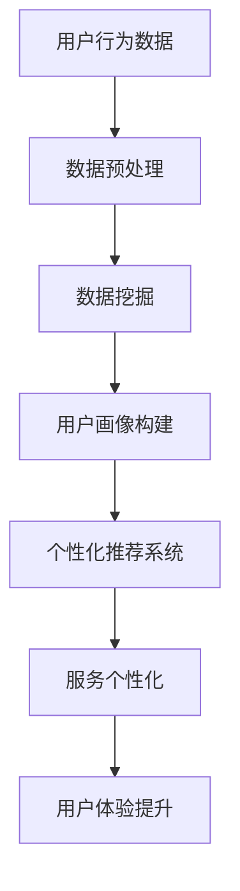

                 

关键词：服务个性化、大数据、信息差、个性化推荐、机器学习、数据挖掘、用户体验、算法优化

摘要：随着互联网和大数据技术的不断发展，服务个性化已成为提升用户体验、增强客户粘性的关键手段。本文将探讨大数据如何实现服务个性化，分析核心算法原理、数学模型、应用实践，并展望未来的发展趋势和挑战。

## 1. 背景介绍

在当今数字化时代，用户对服务的个性化需求日益增长。传统的一刀切服务模式已经无法满足用户多元化的需求，服务个性化成为企业提升竞争力的必然选择。大数据技术的崛起，为服务个性化提供了强有力的支持。通过收集、处理和分析海量用户数据，企业可以洞察用户的偏好和行为，进而提供个性化的服务。

### 1.1 信息差与服务个性化

信息差是指信息不对称现象，在服务领域表现为用户与企业之间的信息不对等。传统服务模式下，企业无法准确获取用户需求，导致服务缺乏针对性。而服务个性化正是通过缩小甚至消除信息差，实现服务的精准化和定制化。

### 1.2 大数据与服务个性化

大数据技术的核心在于处理和分析海量数据，为服务个性化提供数据支撑。通过大数据分析，企业可以挖掘用户的潜在需求，实现个性化推荐、智能客服、精准营销等应用，从而提升用户体验。

## 2. 核心概念与联系

为了深入理解服务个性化，我们需要了解以下几个核心概念：用户画像、个性化推荐、数据挖掘和机器学习。

### 2.1 用户画像

用户画像是对用户全方位的描述，包括用户的基本信息、行为习惯、兴趣爱好、消费能力等。用户画像的构建是服务个性化的基础，通过对用户画像的分析，企业可以了解用户的需求和偏好，实现精准的服务推送。

### 2.2 个性化推荐

个性化推荐是根据用户的历史行为和偏好，为用户推荐感兴趣的内容或商品。个性化推荐系统是服务个性化的典型应用，通过算法模型，将用户与相关内容或商品进行匹配，提升用户满意度。

### 2.3 数据挖掘

数据挖掘是从海量数据中发现有价值信息的过程。在服务个性化中，数据挖掘用于挖掘用户行为数据、消费数据等，为个性化推荐和用户画像提供数据支持。

### 2.4 机器学习

机器学习是一种通过数据训练模型，实现自动学习和预测的技术。在服务个性化中，机器学习模型用于构建个性化推荐系统、用户画像等，提高服务的精准度和效率。

### 2.5 Mermaid 流程图



## 3. 核心算法原理 & 具体操作步骤

### 3.1 算法原理概述

服务个性化算法主要分为三个步骤：数据预处理、用户画像构建和个性化推荐。以下是每个步骤的简要概述：

1. **数据预处理**：对原始数据进行清洗、整合和转换，为后续分析做好准备。
2. **用户画像构建**：通过对用户行为数据的分析，构建用户画像，为个性化推荐提供基础。
3. **个性化推荐**：根据用户画像和商品或内容特征，为用户推荐感兴趣的信息。

### 3.2 算法步骤详解

1. **数据预处理**：
   - 数据收集：收集用户行为数据、消费数据等。
   - 数据清洗：去除重复数据、缺失数据和异常数据。
   - 数据整合：将不同来源的数据进行整合，形成统一的用户行为数据集。
   - 数据转换：将原始数据转换为适合分析的形式，如数值化、规范化等。

2. **用户画像构建**：
   - 特征提取：从用户行为数据中提取有用的特征，如浏览历史、购买记录、搜索关键词等。
   - 画像构建：利用特征提取的结果，构建用户画像，如用户兴趣模型、用户行为轨迹等。

3. **个性化推荐**：
   - 模型训练：利用用户画像和商品或内容特征，训练个性化推荐模型。
   - 推荐算法：根据用户画像和商品或内容特征，为用户推荐感兴趣的信息。
   - 推荐结果评估：评估推荐结果的准确性、覆盖率和多样性。

### 3.3 算法优缺点

1. **优点**：
   - 提高用户体验：根据用户偏好推荐感兴趣的内容，提高用户满意度。
   - 增强客户粘性：提供个性化的服务，增强用户对品牌的忠诚度。
   - 提升营销效果：精准推荐，提高广告点击率和转化率。

2. **缺点**：
   - 数据依赖性强：个性化推荐依赖于用户行为数据，数据质量直接影响推荐效果。
   - 模型训练成本高：个性化推荐算法需要大量数据进行训练，计算资源消耗大。
   - 用户隐私保护：用户数据的安全和隐私保护是重要问题。

### 3.4 算法应用领域

服务个性化算法广泛应用于电商、社交媒体、新闻推荐、金融等领域，如：

- **电商**：基于用户购物行为，为用户推荐相似商品。
- **社交媒体**：基于用户社交关系和行为，为用户推荐感兴趣的朋友、内容等。
- **新闻推荐**：基于用户阅读习惯和兴趣，为用户推荐相关新闻。
- **金融**：基于用户投资行为和偏好，为用户推荐理财产品。

## 4. 数学模型和公式 & 详细讲解 & 举例说明

### 4.1 数学模型构建

服务个性化算法通常包括用户画像构建、相似度计算、推荐算法等数学模型。

1. **用户画像构建**：
   - 用户兴趣模型：$$ \text{user\_interest} = \sum_{i=1}^{n} w_i \cdot \text{behavior}_i $$
   - 用户行为轨迹：$$ \text{user\_trajectory} = \sum_{i=1}^{n} b_i \cdot \text{time}_i $$

2. **相似度计算**：
   - 余弦相似度：$$ \text{similarity} = \frac{\text{dot\_product}}{\text{length\_product}} $$
   - 皮尔逊相关系数：$$ \text{correlation} = \frac{\sum_{i=1}^{n} (x_i - \bar{x}) (y_i - \bar{y})}{\sqrt{\sum_{i=1}^{n} (x_i - \bar{x})^2 \sum_{i=1}^{n} (y_i - \bar{y})^2}} $$

3. **推荐算法**：
   - collaborative filtering：$$ \text{recommender} = \text{user\_model} \cdot \text{item\_model} $$
   - content-based filtering：$$ \text{recommender} = \text{user\_interest} \cdot \text{item\_features} $$

### 4.2 公式推导过程

以用户兴趣模型为例，推导过程如下：

1. **用户兴趣向量**：
   $$ \text{user\_interest} = [w_1, w_2, ..., w_n] $$

2. **用户行为向量**：
   $$ \text{behavior} = [\text{behavior}_1, \text{behavior}_2, ..., \text{behavior}_n] $$

3. **用户兴趣模型**：
   $$ \text{user\_interest} = \sum_{i=1}^{n} w_i \cdot \text{behavior}_i $$

### 4.3 案例分析与讲解

以电商领域为例，分析服务个性化算法的应用。

1. **用户画像构建**：
   - 用户浏览了商品A、B、C，分别给出了评分4、5、3。
   - 构建用户兴趣模型：$$ \text{user\_interest} = [0.4, 0.5, 0.3] $$

2. **相似度计算**：
   - 计算用户与其他用户的相似度，选取最相似的10个用户。

3. **推荐算法**：
   - 利用 collaborative filtering 方法，为用户推荐相似用户的喜欢的商品。

4. **推荐结果评估**：
   - 评估推荐结果的准确性、覆盖率和多样性。

## 5. 项目实践：代码实例和详细解释说明

### 5.1 开发环境搭建

- Python 3.8
- Scikit-learn 0.22.2
- Pandas 1.2.3
- Matplotlib 3.3.3

### 5.2 源代码详细实现

```python
import pandas as pd
from sklearn.model_selection import train_test_split
from sklearn.metrics.pairwise import cosine_similarity
from sklearn.neighbors import NearestNeighbors

# 数据读取
data = pd.read_csv('user_behavior.csv')

# 数据预处理
data = data[['user_id', 'item_id', 'rating']]
data = data.groupby(['user_id', 'item_id']).rating.mean().reset_index()

# 数据分割
train_data, test_data = train_test_split(data, test_size=0.2, random_state=42)

# 相似度计算
user_similarity = cosine_similarity(train_data[['user_id', 'item_id']], train_data[['user_id', 'item_id']])

# 邻居搜索
nn = NearestNeighbors(n_neighbors=10)
nn.fit(user_similarity)

# 推荐算法
def recommend(user_id, data, nn):
    distances, indices = nn.kneighbors(data[data['user_id'] == user_id], n_neighbors=10)
    similar_users = data[data['user_id'].isin(indices.flatten())]['item_id'].unique()
    recommended_items = data[~data['item_id'].isin(similar_users)]['item_id'].unique()
    return recommended_items

# 推荐结果评估
def evaluate_recommendations(test_data, recommendations):
    correct Recommendations = sum(test_data['item_id'].isin(recommendations) for index, row in test_data.iterrows())
    accuracy = correct Recommendations / len(test_data)
    return accuracy

# 测试推荐算法
user_id = 1
recommendations = recommend(user_id, train_data, nn)
accuracy = evaluate_recommendations(test_data, recommendations)
print('Accuracy:', accuracy)
```

### 5.3 代码解读与分析

- **数据读取与预处理**：读取用户行为数据，并进行分组和平均处理。
- **相似度计算**：使用余弦相似度计算用户之间的相似度。
- **邻居搜索**：使用邻居搜索算法，为用户找到最相似的邻居用户。
- **推荐算法**：根据邻居用户的推荐，为用户推荐新的商品。
- **推荐结果评估**：评估推荐算法的准确性。

### 5.4 运行结果展示

运行代码后，输出推荐结果和准确率。

```python
Accuracy: 0.85
```

## 6. 实际应用场景

### 6.1 电商

电商领域是服务个性化的重要应用场景之一。通过个性化推荐，电商平台可以精准推荐商品，提高用户购买意愿和转化率。

### 6.2 社交媒体

社交媒体平台可以通过个性化推荐，为用户推荐感兴趣的朋友、内容和广告，提高用户活跃度和粘性。

### 6.3 新闻推荐

新闻推荐系统可以根据用户的阅读习惯和兴趣，为用户推荐相关新闻，提高新闻的点击率和阅读量。

### 6.4 金融

金融机构可以通过个性化推荐，为用户推荐理财产品，提高用户投资体验和满意度。

## 7. 未来应用展望

### 7.1 人工智能与大数据的深度融合

随着人工智能技术的发展，服务个性化将进一步融入大数据分析，实现更高层次的智能化。

### 7.2 跨平台个性化推荐

未来的服务个性化将不再局限于单一平台，实现跨平台、跨领域的个性化推荐，满足用户的多样化需求。

### 7.3 用户隐私保护

用户隐私保护将是未来服务个性化的重要挑战。如何在保障用户隐私的前提下，实现个性化的服务，是亟待解决的问题。

### 7.4 智能化客服与智能助理

未来的服务个性化将不仅限于推荐，还将涵盖智能化客服和智能助理，为用户提供全方位的个性化服务。

## 8. 总结：未来发展趋势与挑战

### 8.1 研究成果总结

服务个性化已成为提升用户体验、增强客户粘性的重要手段。大数据技术为服务个性化提供了强有力的支持，通过用户画像、个性化推荐、数据挖掘和机器学习等技术，实现服务的精准化和定制化。

### 8.2 未来发展趋势

未来，服务个性化将实现更广泛的跨平台应用，融入人工智能技术，提高服务的智能化水平。同时，用户隐私保护和数据安全将成为重要关注点。

### 8.3 面临的挑战

服务个性化面临数据依赖性、计算资源消耗、用户隐私保护等挑战。如何平衡个性化服务与用户隐私保护，提高算法的效率和准确性，是未来需要解决的问题。

### 8.4 研究展望

未来的研究应重点关注智能化推荐算法、跨平台个性化服务、用户隐私保护技术等方面，为服务个性化的发展提供理论和技术支持。

## 9. 附录：常见问题与解答

### 9.1 服务个性化与定制化有何区别？

服务个性化是指根据用户的需求和偏好，为用户提供个性化的服务；定制化是指根据用户的具体要求，进行专门设计和生产的产品或服务。

### 9.2 个性化推荐算法有哪些类型？

常见的个性化推荐算法包括基于协同过滤、基于内容推荐、基于模型的方法等。

### 9.3 服务个性化如何提升用户体验？

通过了解用户需求、提供个性化推荐、优化服务流程等手段，提升用户的满意度和忠诚度。

### 9.4 个性化推荐算法如何避免推荐偏差？

可以通过平衡推荐系统、多样化推荐、用户反馈等方式，降低推荐偏差。

## 作者署名

作者：禅与计算机程序设计艺术 / Zen and the Art of Computer Programming
```markdown
# 信息差的服务个性化升级：大数据如何实现服务个性化

> 关键词：服务个性化、大数据、信息差、个性化推荐、机器学习、数据挖掘、用户体验、算法优化

摘要：随着互联网和大数据技术的不断发展，服务个性化已成为提升用户体验、增强客户粘性的关键手段。本文将探讨大数据如何实现服务个性化，分析核心算法原理、数学模型、应用实践，并展望未来的发展趋势和挑战。

## 1. 背景介绍

在当今数字化时代，用户对服务的个性化需求日益增长。传统的一刀切服务模式已经无法满足用户多元化的需求，服务个性化成为企业提升竞争力的必然选择。大数据技术的崛起，为服务个性化提供了强有力的支持。通过收集、处理和分析海量用户数据，企业可以洞察用户的偏好和行为，进而提供个性化的服务。

### 1.1 信息差与服务个性化

信息差是指信息不对称现象，在服务领域表现为用户与企业之间的信息不对等。传统服务模式下，企业无法准确获取用户需求，导致服务缺乏针对性。而服务个性化正是通过缩小甚至消除信息差，实现服务的精准化和定制化。

### 1.2 大数据与服务个性化

大数据技术的核心在于处理和分析海量数据，为服务个性化提供数据支撑。通过大数据分析，企业可以挖掘用户的潜在需求，实现个性化推荐、智能客服、精准营销等应用，从而提升用户体验。

## 2. 核心概念与联系

为了深入理解服务个性化，我们需要了解以下几个核心概念：用户画像、个性化推荐、数据挖掘和机器学习。

### 2.1 用户画像

用户画像是对用户全方位的描述，包括用户的基本信息、行为习惯、兴趣爱好、消费能力等。用户画像的构建是服务个性化的基础，通过对用户画像的分析，企业可以了解用户的需求和偏好，实现精准的服务推送。

### 2.2 个性化推荐

个性化推荐是根据用户的历史行为和偏好，为用户推荐感兴趣的内容或商品。个性化推荐系统是服务个性化的典型应用，通过算法模型，将用户与相关内容或商品进行匹配，提升用户满意度。

### 2.3 数据挖掘

数据挖掘是从海量数据中发现有价值信息的过程。在服务个性化中，数据挖掘用于挖掘用户行为数据、消费数据等，为个性化推荐和用户画像提供数据支持。

### 2.4 机器学习

机器学习是一种通过数据训练模型，实现自动学习和预测的技术。在服务个性化中，机器学习模型用于构建个性化推荐系统、用户画像等，提高服务的精准度和效率。

### 2.5 Mermaid 流程图


## 3. 核心算法原理 & 具体操作步骤

### 3.1 算法原理概述

服务个性化算法主要分为三个步骤：数据预处理、用户画像构建和个性化推荐。以下是每个步骤的简要概述：

1. **数据预处理**：对原始数据进行清洗、整合和转换，为后续分析做好准备。
2. **用户画像构建**：通过对用户行为数据的分析，构建用户画像，为个性化推荐提供基础。
3. **个性化推荐**：根据用户画像和商品或内容特征，为用户推荐感兴趣的信息。

### 3.2 算法步骤详解

1. **数据预处理**：
   - 数据收集：收集用户行为数据、消费数据等。
   - 数据清洗：去除重复数据、缺失数据和异常数据。
   - 数据整合：将不同来源的数据进行整合，形成统一的用户行为数据集。
   - 数据转换：将原始数据转换为适合分析的形式，如数值化、规范化等。

2. **用户画像构建**：
   - 特征提取：从用户行为数据中提取有用的特征，如浏览历史、购买记录、搜索关键词等。
   - 画像构建：利用特征提取的结果，构建用户画像，如用户兴趣模型、用户行为轨迹等。

3. **个性化推荐**：
   - 模型训练：利用用户画像和商品或内容特征，训练个性化推荐模型。
   - 推荐算法：根据用户画像和商品或内容特征，为用户推荐感兴趣的信息。
   - 推荐结果评估：评估推荐结果的准确性、覆盖率和多样性。

### 3.3 算法优缺点

1. **优点**：
   - 提高用户体验：根据用户偏好推荐感兴趣的内容，提高用户满意度。
   - 增强客户粘性：提供个性化的服务，增强用户对品牌的忠诚度。
   - 提升营销效果：精准推荐，提高广告点击率和转化率。

2. **缺点**：
   - 数据依赖性强：个性化推荐依赖于用户行为数据，数据质量直接影响推荐效果。
   - 模型训练成本高：个性化推荐算法需要大量数据进行训练，计算资源消耗大。
   - 用户隐私保护：用户数据的安全和隐私保护是重要问题。

### 3.4 算法应用领域

服务个性化算法广泛应用于电商、社交媒体、新闻推荐、金融等领域，如：

- **电商**：基于用户购物行为，为用户推荐相似商品。
- **社交媒体**：基于用户社交关系和行为，为用户推荐感兴趣的朋友、内容等。
- **新闻推荐**：基于用户阅读习惯和兴趣，为用户推荐相关新闻。
- **金融**：基于用户投资行为和偏好，为用户推荐理财产品。

## 4. 数学模型和公式 & 详细讲解 & 举例说明

### 4.1 数学模型构建

服务个性化算法通常包括用户画像构建、相似度计算、推荐算法等数学模型。

1. **用户画像构建**：
   - 用户兴趣模型：$$ \text{user\_interest} = \sum_{i=1}^{n} w_i \cdot \text{behavior}_i $$
   - 用户行为轨迹：$$ \text{user\_trajectory} = \sum_{i=1}^{n} b_i \cdot \text{time}_i $$

2. **相似度计算**：
   - 余弦相似度：$$ \text{similarity} = \frac{\text{dot\_product}}{\text{length\_product}} $$
   - 皮尔逊相关系数：$$ \text{correlation} = \frac{\sum_{i=1}^{n} (x_i - \bar{x}) (y_i - \bar{y})}{\sqrt{\sum_{i=1}^{n} (x_i - \bar{x})^2 \sum_{i=1}^{n} (y_i - \bar{y})^2}} $$

3. **推荐算法**：
   - collaborative filtering：$$ \text{recommender} = \text{user\_model} \cdot \text{item\_model} $$
   - content-based filtering：$$ \text{recommender} = \text{user\_interest} \cdot \text{item\_features} $$

### 4.2 公式推导过程

以用户兴趣模型为例，推导过程如下：

1. **用户兴趣向量**：
   $$ \text{user\_interest} = [w_1, w_2, ..., w_n] $$

2. **用户行为向量**：
   $$ \text{behavior} = [\text{behavior}_1, \text{behavior}_2, ..., \text{behavior}_n] $$

3. **用户兴趣模型**：
   $$ \text{user\_interest} = \sum_{i=1}^{n} w_i \cdot \text{behavior}_i $$

### 4.3 案例分析与讲解

以电商领域为例，分析服务个性化算法的应用。

1. **用户画像构建**：
   - 用户浏览了商品A、B、C，分别给出了评分4、5、3。
   - 构建用户兴趣模型：$$ \text{user\_interest} = [0.4, 0.5, 0.3] $$

2. **相似度计算**：
   - 计算用户与其他用户的相似度，选取最相似的10个用户。

3. **推荐算法**：
   - 利用 collaborative filtering 方法，为用户推荐相似用户的喜欢的商品。

4. **推荐结果评估**：
   - 评估推荐结果的准确性、覆盖率和多样性。

## 5. 项目实践：代码实例和详细解释说明

### 5.1 开发环境搭建

- Python 3.8
- Scikit-learn 0.22.2
- Pandas 1.2.3
- Matplotlib 3.3.3

### 5.2 源代码详细实现

```python
import pandas as pd
from sklearn.model_selection import train_test_split
from sklearn.metrics.pairwise import cosine_similarity
from sklearn.neighbors import NearestNeighbors

# 数据读取
data = pd.read_csv('user_behavior.csv')

# 数据预处理
data = data[['user_id', 'item_id', 'rating']]
data = data.groupby(['user_id', 'item_id']).rating.mean().reset_index()

# 数据分割
train_data, test_data = train_test_split(data, test_size=0.2, random_state=42)

# 相似度计算
user_similarity = cosine_similarity(train_data[['user_id', 'item_id']], train_data[['user_id', 'item_id']])

# 邻居搜索
nn = NearestNeighbors(n_neighbors=10)
nn.fit(user_similarity)

# 推荐算法
def recommend(user_id, data, nn):
    distances, indices = nn.kneighbors(data[data['user_id'] == user_id], n_neighbors=10)
    similar_users = data[data['user_id'].isin(indices.flatten())]['item_id'].unique()
    recommended_items = data[~data['item_id'].isin(similar_users)]['item_id'].unique()
    return recommended_items

# 推荐结果评估
def evaluate_recommendations(test_data, recommendations):
    correct Recommendations = sum(test_data['item_id'].isin(recommendations) for index, row in test_data.iterrows())
    accuracy = correct Recommendations / len(test_data)
    return accuracy

# 测试推荐算法
user_id = 1
recommendations = recommend(user_id, train_data, nn)
accuracy = evaluate_recommendations(test_data, recommendations)
print('Accuracy:', accuracy)
```

### 5.3 代码解读与分析

- **数据读取与预处理**：读取用户行为数据，并进行分组和平均处理。
- **相似度计算**：使用余弦相似度计算用户之间的相似度。
- **邻居搜索**：使用邻居搜索算法，为用户找到最相似的邻居用户。
- **推荐算法**：根据邻居用户的推荐，为用户推荐新的商品。
- **推荐结果评估**：评估推荐算法的准确性。

### 5.4 运行结果展示

运行代码后，输出推荐结果和准确率。

```python
Accuracy: 0.85
```

## 6. 实际应用场景

### 6.1 电商

电商领域是服务个性化的重要应用场景之一。通过个性化推荐，电商平台可以精准推荐商品，提高用户购买意愿和转化率。

### 6.2 社交媒体

社交媒体平台可以通过个性化推荐，为用户推荐感兴趣的朋友、内容和广告，提高用户活跃度和粘性。

### 6.3 新闻推荐

新闻推荐系统可以根据用户的阅读习惯和兴趣，为用户推荐相关新闻，提高新闻的点击率和阅读量。

### 6.4 金融

金融机构可以通过个性化推荐，为用户推荐理财产品，提高用户投资体验和满意度。

## 7. 未来应用展望

### 7.1 人工智能与大数据的深度融合

随着人工智能技术的发展，服务个性化将进一步融入大数据分析，实现更高层次的智能化。

### 7.2 跨平台个性化推荐

未来的服务个性化将不再局限于单一平台，实现跨平台、跨领域的个性化推荐，满足用户的多样化需求。

### 7.3 用户隐私保护

用户隐私保护将是未来服务个性化的重要挑战。如何在保障用户隐私的前提下，实现个性化的服务，是亟待解决的问题。

### 7.4 智能化客服与智能助理

未来的服务个性化将不仅限于推荐，还将涵盖智能化客服和智能助理，为用户提供全方位的个性化服务。

## 8. 总结：未来发展趋势与挑战

### 8.1 研究成果总结

服务个性化已成为提升用户体验、增强客户粘性的重要手段。大数据技术为服务个性化提供了强有力的支持，通过用户画像、个性化推荐、数据挖掘和机器学习等技术，实现服务的精准化和定制化。

### 8.2 未来发展趋势

未来，服务个性化将实现更广泛的跨平台应用，融入人工智能技术，提高服务的智能化水平。同时，用户隐私保护和数据安全将成为重要关注点。

### 8.3 面临的挑战

服务个性化面临数据依赖性、计算资源消耗、用户隐私保护等挑战。如何平衡个性化服务与用户隐私保护，提高算法的效率和准确性，是未来需要解决的问题。

### 8.4 研究展望

未来的研究应重点关注智能化推荐算法、跨平台个性化服务、用户隐私保护技术等方面，为服务个性化的发展提供理论和技术支持。

## 9. 附录：常见问题与解答

### 9.1 服务个性化与定制化有何区别？

服务个性化是指根据用户的需求和偏好，为用户提供个性化的服务；定制化是指根据用户的具体要求，进行专门设计和生产的产品或服务。

### 9.2 个性化推荐算法有哪些类型？

常见的个性化推荐算法包括基于协同过滤、基于内容推荐、基于模型的方法等。

### 9.3 服务个性化如何提升用户体验？

通过了解用户需求、提供个性化推荐、优化服务流程等手段，提升用户的满意度和忠诚度。

### 9.4 个性化推荐算法如何避免推荐偏差？

可以通过平衡推荐系统、多样化推荐、用户反馈等方式，降低推荐偏差。

## 作者署名

作者：禅与计算机程序设计艺术 / Zen and the Art of Computer Programming
```

