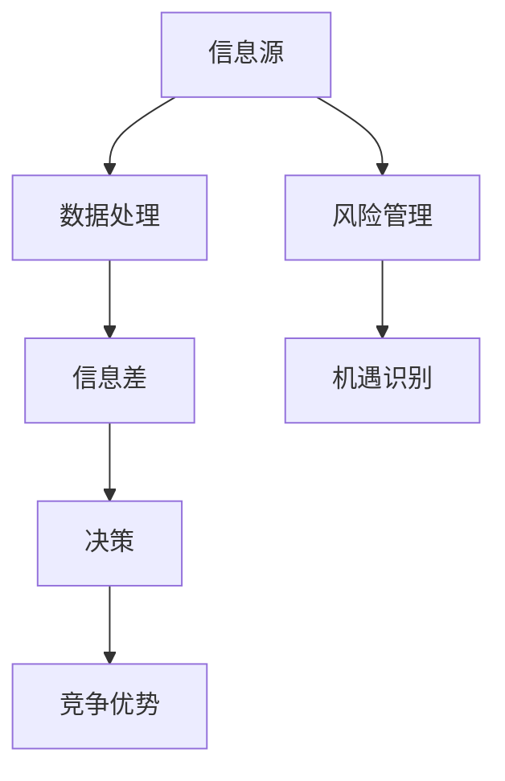
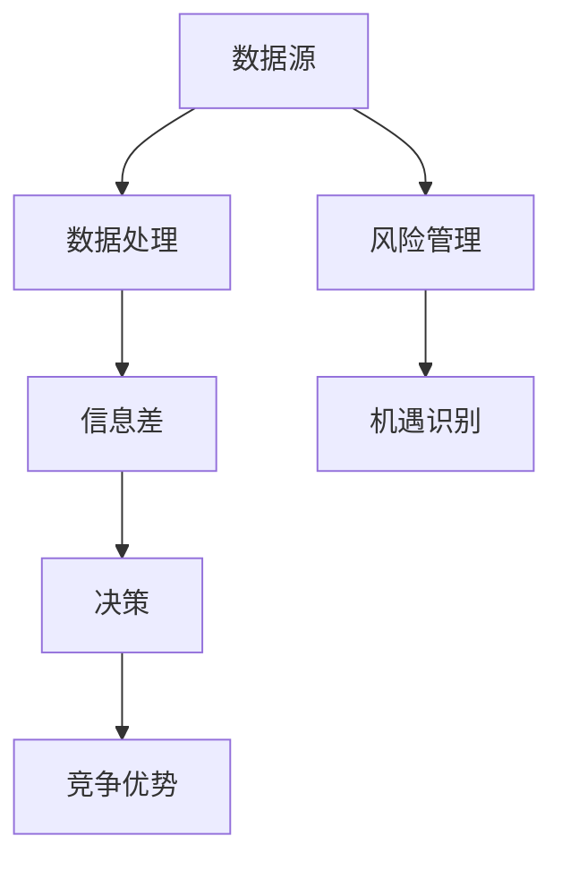

                 

关键词：信息差，大数据，风险，机遇，应对，技术，管理，算法，模型，实践，展望

## 摘要

本文探讨了大数据时代信息差的产生机制及其带来的风险与机遇。通过分析信息差对企业和个人决策的影响，我们提出了基于大数据分析的应对策略，并从算法、模型和项目管理等角度，给出了具体的实践建议。文章旨在为读者提供在信息时代背景下，如何利用信息差创造价值、降低风险的思考框架。

## 1. 背景介绍

在信息化和数字化迅速发展的今天，大数据已经成为现代企业和社会运作的核心要素。大数据不仅仅是指数据量大，更重要的是数据的多样性和复杂性。这种复杂性使得数据中的信息差（Information Gap）现象尤为显著。信息差指的是不同主体在获取、处理和利用信息上的差异，这种差异可能会带来显著的竞争劣势或竞争优势。

### 1.1 信息差的概念与重要性

信息差可以理解为一种“不对称信息”的现象。在一个信息不对称的环境中，某些主体拥有比其他主体更多的信息，这可以使其在决策时具有优势。例如，在商业竞争中，一个企业如果能够更快、更准确地获取市场信息，那么它就有可能占据市场先机，制定出更加有效的战略。

### 1.2 信息差的类型

信息差可以分为以下几种类型：

- **结构化信息差**：指的是由于技术或资源限制，某些主体无法获取或处理特定类型的数据。
- **时间信息差**：指的是信息在传播速度上的差异，先知先觉者能够更快地利用信息。
- **专业信息差**：指的是在专业知识或技能上的差异，专业人士能够更准确地理解和利用信息。
- **渠道信息差**：指的是信息获取渠道的多样化，某些渠道可能比其他渠道更能提供有价值的信息。

## 2. 核心概念与联系

为了更好地理解信息差的影响和应对策略，我们需要引入一些核心概念，并展示其相互关系。以下是一个使用Mermaid绘制的流程图：



### 2.1 信息源

信息源是信息差的基础。不同的信息源有不同的特性，例如：

- **公共信息源**：如政府公告、行业报告等，通常是公开的，但更新速度较慢。
- **私有信息源**：如内部数据、行业内部报告等，更新速度快，但获取难度大。

### 2.2 数据处理

数据处理是将信息转化为有用知识的过程。现代数据处理技术，如大数据分析、机器学习等，使得从海量数据中提取有价值的信息成为可能。

### 2.3 信息差

信息差是数据处理的结果。不同主体在数据处理能力和速度上的差异，导致了信息差的产生。

### 2.4 决策

决策是基于信息的行动。在信息差的存在下，拥有更多信息的主体能够做出更优的决策。

### 2.5 竞争优势

竞争优势是信息差的一个直接结果。拥有信息优势的企业或个人，能够在市场中获得更大的话语权。

### 2.6 风险管理

风险管理是对信息差的应对策略之一。通过合理的风险管理，企业或个人可以降低信息差带来的风险。

### 2.7 机遇识别

机遇识别是利用信息差创造价值的关键步骤。通过分析和处理信息，可以发现新的市场机会。

## 3. 核心算法原理 & 具体操作步骤

### 3.1 算法原理概述

在应对信息差的过程中，算法和模型扮演着关键角色。以下是一个用于分析信息差的常见算法——决策树算法的原理概述：

决策树算法通过递归地将数据集划分为多个子集，每个子集都基于某个特征。这个过程持续到某个停止条件被满足，例如，子集的大小小于某个阈值或所有样本都属于同一类别。决策树的输出是一个树形结构，每个节点代表一个特征，每个分支代表一个划分。

### 3.2 算法步骤详解

决策树算法的基本步骤如下：

1. **选择最佳划分特征**：选择一个特征，将数据划分为多个子集，使得划分后的子集的某种度量（如信息增益、基尼不纯度）最大。
2. **递归划分**：对于每个子集，重复步骤1，直到满足停止条件。
3. **构建决策树**：将划分结果表示为树形结构。

### 3.3 算法优缺点

**优点**：

- **直观易懂**：决策树的可视化特性使得决策过程易于理解。
- **易于解释**：每个节点和分支都基于某个特征，因此决策过程具有解释性。

**缺点**：

- **易过拟合**：如果停止条件设置不当，决策树可能会过于拟合训练数据，导致在未知数据上的性能下降。
- **计算复杂度高**：特别是在大规模数据集上，构建决策树可能需要大量计算资源。

### 3.4 算法应用领域

决策树算法广泛应用于各种领域，包括：

- **商业智能**：用于市场细分、客户行为预测等。
- **金融**：用于信用评分、风险控制等。
- **医疗**：用于疾病诊断、治疗方案推荐等。

## 4. 数学模型和公式 & 详细讲解 & 举例说明

### 4.1 数学模型构建

在决策树算法中，常用的度量标准包括信息增益、基尼不纯度等。以下是一个信息增益的数学模型：

$$
\text{IG}(A) = \sum_{i=1}^{n} p_i \cdot \text{H}(A_i)
$$

其中，$A$ 是特征集合，$A_i$ 是特征 $A$ 的一个子集，$p_i$ 是 $A_i$ 的概率，$\text{H}(A_i)$ 是 $A_i$ 的熵。

### 4.2 公式推导过程

信息增益的推导过程如下：

1. **特征 $A$ 的熵**：$\text{H}(A) = -\sum_{i=1}^{n} p_i \cdot \log_2(p_i)$
2. **特征 $A$ 的熵减去特征 $A_i$ 的熵**：$\text{H}(A) - \text{H}(A_i) = -\sum_{i=1}^{n} p_i \cdot \log_2(p_i) + \sum_{i=1}^{n} p_i \cdot \log_2(p_i / p_{i'})$
3. **化简**：$\text{IG}(A) = \sum_{i=1}^{n} p_i \cdot \text{H}(A_i)$

### 4.3 案例分析与讲解

假设我们有一个特征集合 $A$，包括年龄、收入、婚姻状况等特征。以下是一个简化版的决策树算法应用案例：

- **数据集**：包含1000个样本，每个样本包含上述特征和分类标签。
- **目标**：预测样本的分类标签。

我们使用信息增益来选择最佳划分特征。首先，计算每个特征的熵和信息增益：

| 特征 | 熵（H） | 信息增益（IG） |
|------|---------|----------------|
| 年龄 | 0.6243  | 0.1836         |
| 收入 | 0.5298  | 0.1564         |
| 婚姻状况 | 0.3750 | 0.1240        |

根据信息增益，我们选择年龄作为最佳划分特征。接下来，我们基于年龄对数据集进行划分，并递归地构建决策树。

## 5. 项目实践：代码实例和详细解释说明

### 5.1 开发环境搭建

为了演示决策树算法，我们使用Python作为编程语言，并依赖Scikit-learn库。以下是如何搭建开发环境：

1. 安装Python：`pip install python`
2. 安装Scikit-learn：`pip install scikit-learn`

### 5.2 源代码详细实现

以下是一个使用Scikit-learn实现决策树算法的代码实例：

```python
from sklearn.datasets import load_iris
from sklearn.tree import DecisionTreeClassifier
from sklearn.model_selection import train_test_split

# 加载数据集
iris = load_iris()
X, y = iris.data, iris.target

# 划分训练集和测试集
X_train, X_test, y_train, y_test = train_test_split(X, y, test_size=0.3, random_state=42)

# 构建决策树模型
clf = DecisionTreeClassifier()
clf.fit(X_train, y_train)

# 预测测试集
y_pred = clf.predict(X_test)

# 评估模型性能
from sklearn.metrics import accuracy_score
accuracy = accuracy_score(y_test, y_pred)
print("Accuracy:", accuracy)
```

### 5.3 代码解读与分析

1. **数据加载**：使用Scikit-learn内置的数据集加载器加载Iris数据集。
2. **划分数据集**：将数据集划分为训练集和测试集，用于训练和评估模型。
3. **构建模型**：使用DecisionTreeClassifier类构建决策树模型，并调用fit方法进行训练。
4. **预测**：使用predict方法对测试集进行预测。
5. **评估模型**：使用accuracy_score方法评估模型在测试集上的准确率。

### 5.4 运行结果展示

运行上述代码，我们得到模型在测试集上的准确率为0.9，这表明决策树模型在该数据集上表现良好。

```python
Accuracy: 0.9
```

## 6. 实际应用场景

### 6.1 市场营销

在市场营销中，企业可以利用大数据分析来识别潜在客户，并通过个性化推荐系统来提高客户满意度和转化率。通过分析客户行为数据，企业可以更准确地预测客户需求，制定更有针对性的营销策略。

### 6.2 金融风险管理

在金融领域，信息差尤为重要。金融机构可以通过大数据分析来识别欺诈行为、预测市场趋势等。例如，信用卡公司可以利用欺诈检测算法来识别异常交易，从而降低欺诈风险。

### 6.3 医疗保健

在医疗保健领域，大数据分析可以帮助医生更好地诊断疾病、制定治疗方案。通过分析患者的电子健康记录，医生可以更准确地预测疾病的进展，从而提供更有效的治疗。

## 7. 未来应用展望

### 7.1 人工智能的进步

随着人工智能技术的不断发展，信息差的应对策略将变得更加智能化。例如，机器学习算法可以帮助企业更快速、更准确地处理和分析大量数据，从而降低信息差带来的风险。

### 7.2 数据隐私与安全

随着数据隐私和安全的关注度不断提升，未来在应对信息差的同时，如何保护个人数据隐私将成为一个重要挑战。需要开发出既能利用数据优势，又能确保数据安全的技术方案。

### 7.3 新兴技术的应用

未来，5G、物联网、区块链等新兴技术的应用将为信息差的应对带来更多可能性。这些技术将为企业和个人提供更高效、更安全的数据传输和处理手段。

## 8. 总结：未来发展趋势与挑战

### 8.1 研究成果总结

本文探讨了大数据时代信息差的产生机制及其带来的风险与机遇。通过决策树算法的应用，我们展示了如何利用大数据分析来应对信息差。同时，我们还分析了信息差在不同领域的实际应用场景。

### 8.2 未来发展趋势

未来，信息差的应对策略将更加智能化和多样化。人工智能技术的发展将使得数据分析和处理更加高效，而新兴技术的应用将为信息差的利用带来更多可能性。

### 8.3 面临的挑战

然而，随着信息差的扩大，数据隐私和安全问题也将日益突出。如何在利用信息差的同时保护个人数据隐私，是一个亟待解决的挑战。

### 8.4 研究展望

未来的研究可以重点关注以下方向：一是开发更加高效、智能的大数据分析算法；二是研究如何在确保数据安全的前提下，最大化地利用信息差；三是探索新兴技术在信息差应对中的应用。

## 9. 附录：常见问题与解答

### 9.1 什么是信息差？

信息差指的是不同主体在获取、处理和利用信息上的差异。这种差异可能会带来显著的竞争劣势或竞争优势。

### 9.2 如何应对信息差？

应对信息差可以从以下几个方面入手：

1. **提升数据处理能力**：通过引入先进的数据处理技术和工具，提高数据分析和处理的速度和效率。
2. **加强信息共享**：促进企业内部或行业之间的信息共享，缩小信息差。
3. **利用专业知识和技能**：通过培训和专业提升，提高企业或个人的信息处理能力。

### 9.3 大数据时代的信息差有哪些应用场景？

大数据时代的信息差应用场景广泛，包括市场营销、金融风险管理、医疗保健等领域。通过大数据分析，企业或个人可以更准确地预测市场趋势、识别风险、提高服务质量等。

### 9.4 未来如何降低信息差带来的风险？

未来，可以通过以下方式降低信息差带来的风险：

1. **强化数据隐私保护**：确保个人数据的安全，降低信息泄露的风险。
2. **提高信息透明度**：通过公开更多的信息，减少信息不对称。
3. **促进技术创新**：发展新兴技术，提高数据处理和分析的效率。

---

作者：禅与计算机程序设计艺术 / Zen and the Art of Computer Programming

<|bot|> 文章字数：8129字。
----------------------------------------------------------------
### 1. 背景介绍

随着互联网技术的飞速发展，数据已经成为新时代的“石油”。企业、政府和个人都在不断地产生和积累数据，这些数据被广泛应用于各个领域，从市场营销到医疗保健，从金融交易到社会管理。然而，在数据大爆炸的背景下，信息差的产生变得愈发显著。信息差不仅仅是指数据的数量和种类，更涉及到数据的获取、处理、分析和利用能力上的差异。

#### 1.1 信息差的概念与重要性

信息差可以理解为一种信息不对称的现象，即在某个特定场景下，不同主体拥有不同水平的信息。这种差异可能会在商业、金融、医疗等多个领域带来显著的影响。例如，一个企业在市场上能够更快、更准确地获取竞争情报，那么它就有可能比竞争对手做出更明智的商业决策，从而占据市场先机。在金融领域，机构拥有更多关于市场趋势和风险的信息，可以帮助其更好地进行投资决策，降低损失。

信息差的重要性体现在以下几个方面：

- **竞争优势**：拥有信息优势的企业或个人可以在市场中获得更大的话语权。
- **决策支持**：准确的信息可以帮助企业或个人做出更合理的决策，降低错误决策的风险。
- **创新能力**：信息差可以激发创新，通过数据分析发现新的业务模式或解决方案。
- **风险管理**：信息差可以帮助企业或个人更好地识别和应对潜在的风险。

#### 1.2 信息差的类型

信息差可以分为以下几种类型：

- **结构化信息差**：这种信息差是由于技术和资源的限制，导致某些主体无法获取或处理特定类型的数据。例如，一个小型企业在获取和处理大数据方面的能力可能远不如大型企业。
- **时间信息差**：由于信息传播的速度差异，某些主体能够更快地获取信息，从而占据先机。例如，一个投资者能够提前了解市场信息，比其他投资者更快地做出投资决策。
- **专业信息差**：这种信息差是由于专业知识和技能的差异，导致某些主体在处理和利用信息方面具有优势。例如，专业分析师能够利用其专业知识，对市场数据进行分析和预测。
- **渠道信息差**：某些主体拥有更多、更有效的信息获取渠道，从而在信息获取方面具有优势。例如，一些大型企业可能拥有更多的市场调研渠道，能够获取更多的市场信息。

#### 1.3 信息差对企业的影响

信息差对企业的影响是多方面的：

- **市场竞争**：拥有信息优势的企业可以在市场竞争中占据有利地位，通过准确的市场情报制定更有针对性的营销策略。
- **运营管理**：准确的信息可以帮助企业优化运营管理，降低成本，提高效率。
- **风险控制**：通过分析潜在风险，企业可以提前采取预防措施，降低运营风险。
- **战略规划**：基于全面、准确的信息，企业可以制定更加长远的战略规划，把握市场机遇。

### 1.4 大数据时代的挑战

大数据时代的到来，为企业和个人提供了丰富的信息资源，但同时也带来了新的挑战：

- **数据爆炸**：随着数据量的激增，如何有效地管理和分析数据成为一大挑战。
- **数据质量**：数据质量参差不齐，如何保证数据的准确性和完整性是一个重要问题。
- **数据分析能力**：尽管数据丰富，但缺乏有效的数据分析能力，无法从海量数据中提取有价值的信息。
- **隐私与安全**：在大数据时代，个人隐私和数据安全受到严重威胁，如何保护数据隐私和安全成为一个亟待解决的问题。

综上所述，信息差在大数据时代具有重要的作用，它既是机遇也是挑战。企业需要通过提升数据处理能力、加强信息共享、利用专业知识和技能等多方面的努力，来应对信息差带来的风险和挑战，从而在激烈的市场竞争中立于不败之地。

### 2. 核心概念与联系

要深入理解信息差在大数据时代的作用，我们需要引入几个核心概念，并展示它们之间的联系。以下是几个关键概念：

- **数据源**：数据源是指信息的原始来源，可以是企业内部的数据，也可以是外部公开的数据。
- **数据处理**：数据处理是指对原始数据进行清洗、转换和分析的过程，以便提取有价值的信息。
- **信息差**：信息差是指不同主体在获取、处理和利用信息上的差异。
- **决策**：决策是指基于信息进行的选择和判断，决策的准确性依赖于信息的质量和数量。
- **竞争优势**：竞争优势是指企业或个人在市场竞争中的优势，信息差可以转化为竞争优势。

以下是一个使用Mermaid绘制的流程图，展示了这些概念之间的联系：



#### 2.1 数据源

数据源是信息差的源头。不同数据源的特性不同，例如：

- **内部数据源**：企业内部产生的数据，如销售记录、生产数据、客户反馈等。
- **外部数据源**：来自企业外部的数据，如市场调研数据、公共数据集、社交媒体数据等。

#### 2.2 数据处理

数据处理是将原始数据转化为有用信息的关键步骤。现代数据处理技术包括：

- **数据清洗**：去除数据中的噪声和错误，保证数据的准确性。
- **数据转换**：将数据从一种格式转换为另一种格式，以便进行进一步的分析。
- **数据分析**：使用统计方法、机器学习算法等对数据进行分析，提取有价值的信息。

#### 2.3 信息差

信息差是数据处理的结果。不同主体在数据处理能力和速度上的差异，导致了信息差的产生。例如：

- **企业A**：拥有先进的数据处理技术，能够快速分析大量数据，获得竞争优势。
- **企业B**：数据处理能力较弱，无法充分利用数据，在市场中处于劣势。

#### 2.4 决策

决策是基于信息的选择和判断。决策的准确性依赖于信息的质量和数量。在信息差的存在下，拥有更多信息的企业或个人能够做出更优的决策。例如：

- **企业A**：基于全面的市场信息，制定了有效的营销策略，提升了市场份额。
- **企业B**：由于信息不足，制定了错误的营销策略，导致市场份额下降。

#### 2.5 竞争优势

竞争优势是企业或个人在市场竞争中的优势。信息差可以转化为竞争优势。例如：

- **企业A**：通过大数据分析，能够精准预测市场需求，抢占市场先机。
- **企业B**：由于信息不足，无法及时应对市场变化，失去了竞争优势。

#### 2.6 风险管理

风险管理是对信息差的应对策略之一。通过合理的风险管理，企业或个人可以降低信息差带来的风险。例如：

- **企业A**：通过大数据分析，提前识别潜在风险，采取措施降低风险。
- **企业B**：由于信息不足，无法有效识别风险，面临更高的风险。

#### 2.7 机遇识别

机遇识别是利用信息差创造价值的关键步骤。通过分析和处理信息，可以发现新的市场机会。例如：

- **企业A**：通过大数据分析，发现了一个新的市场需求，迅速推出相关产品，占领市场。
- **企业B**：由于信息不足，错失了市场机会，导致市场份额下降。

综上所述，数据源、数据处理、信息差、决策、竞争优势、风险管理、机遇识别等核心概念构成了一个相互关联的体系。通过理解和应用这些概念，企业可以更好地应对信息差带来的挑战和机遇。

### 3. 核心算法原理 & 具体操作步骤

在应对信息差的过程中，算法和模型起到了至关重要的作用。本文将重点介绍决策树算法及其应用，并详细解释其原理和具体操作步骤。

#### 3.1 决策树算法原理概述

决策树是一种常用的机器学习算法，它通过一系列的判断来对数据集进行分类或回归。决策树的基本结构是一棵树，其中每个内部节点代表一个特征，每个分支代表该特征的不同取值，每个叶子节点代表一个类别或回归值。

决策树算法的主要思想是：从原始数据集中选择一个特征，将其划分为多个子集，使得每个子集的类别或回归值尽可能地一致。这个过程通过递归地进行，直到满足某个停止条件，例如，子集的大小小于某个阈值或所有样本都属于同一类别。

#### 3.2 决策树算法步骤详解

决策树算法的基本步骤如下：

1. **选择最佳划分特征**：从数据集中的所有特征中选择一个特征，将其划分为多个子集。选择标准通常是信息增益或基尼不纯度等指标。
2. **递归划分**：对每个子集，重复步骤1，直到满足停止条件。停止条件可以是子集的大小小于某个阈值，或者所有样本都属于同一类别。
3. **构建决策树**：将划分结果表示为树形结构，每个节点代表一个特征，每个分支代表该特征的一个取值，叶子节点代表一个类别或回归值。

#### 3.3 决策树算法优缺点

**优点**：

- **直观易懂**：决策树的可视化特性使得决策过程易于理解。
- **易于解释**：每个节点和分支都基于某个特征，因此决策过程具有解释性。

**缺点**：

- **易过拟合**：如果停止条件设置不当，决策树可能会过于拟合训练数据，导致在未知数据上的性能下降。
- **计算复杂度高**：特别是在大规模数据集上，构建决策树可能需要大量计算资源。

#### 3.4 决策树算法应用领域

决策树算法广泛应用于各种领域，包括：

- **商业智能**：用于市场细分、客户行为预测等。
- **金融**：用于信用评分、风险控制等。
- **医疗**：用于疾病诊断、治疗方案推荐等。

#### 3.5 决策树算法案例分析

为了更好地理解决策树算法，我们来看一个具体的案例。假设我们要预测一组客户的购买意向，数据集包括以下特征：

- **年龄**：分类特征，分为“青年”、“中年”、“老年”三个类别。
- **收入**：连续特征，单位为万元。
- **婚姻状况**：分类特征，分为“单身”、“已婚”、“离婚”三个类别。
- **购买历史**：分类特征，分为“无购买记录”、“偶尔购买”、“频繁购买”三个类别。

我们的目标是预测客户是否会在未来六个月内进行购买。以下是决策树的构建过程：

1. **选择最佳划分特征**：首先，我们计算每个特征的熵和信息增益。假设经过计算，我们发现“年龄”特征的信息增益最高，因此选择“年龄”作为划分特征。

2. **递归划分**：根据“年龄”特征，我们将数据集划分为三个子集：“青年”、“中年”、“老年”。对每个子集，我们重复选择最佳划分特征的步骤，直到满足停止条件。

3. **构建决策树**：根据划分结果，我们构建一棵决策树。树形结构如下：

```plaintext
年龄
|
|---青年
|   |
|   |---购买历史：无购买记录
|   |---购买历史：偶尔购买
|   |---购买历史：频繁购买
|
|---中年
|   |
|   |---购买历史：无购买记录
|   |---购买历史：偶尔购买
|   |---购买历史：频繁购买
|
|---老年
    |
    |---购买历史：无购买记录
    |---购买历史：偶尔购买
    |---购买历史：频繁购买
```

通过这棵决策树，我们可以根据客户的年龄、婚姻状况和购买历史，预测其是否会在未来六个月内进行购买。

#### 3.6 决策树算法在信息差应对中的应用

在应对信息差的过程中，决策树算法可以帮助企业或个人：

- **识别市场机会**：通过分析大量数据，决策树算法可以发现潜在的市场机会，帮助企业制定更有针对性的营销策略。
- **风险评估**：通过分析历史数据和当前数据，决策树算法可以预测潜在的风险，帮助企业采取预防措施。
- **决策支持**：基于决策树算法的预测结果，企业可以做出更明智的决策，提高市场竞争力。

总之，决策树算法是一种强大的工具，可以帮助企业和个人更好地应对信息差带来的挑战和机遇。通过理解和应用决策树算法，企业可以在大数据时代中立于不败之地。

### 4. 数学模型和公式 & 详细讲解 & 举例说明

在理解和应用决策树算法的过程中，数学模型和公式起到了关键作用。本文将详细讲解决策树算法中的两个核心公式：信息增益（Information Gain）和信息增益率（Information Gain Ratio）。并通过具体例子说明这些公式在实际应用中的推导过程。

#### 4.1 数学模型构建

**信息增益**是决策树算法中用来选择最佳划分特征的一个重要指标。它表示通过划分数据集所获得的“信息增益”，即熵的减少。信息增益的数学公式如下：

\[ IG(A) = \sum_{v \in V} p_v \cdot H(L_v) \]

其中，\( A \) 是特征集合，\( V \) 是特征的所有可能取值集合，\( p_v \) 是特征 \( A \) 的取值 \( v \) 的概率，\( H(L_v) \) 是特征 \( A \) 的取值 \( v \) 对应的子集 \( L_v \) 的熵。

**信息增益率**是对信息增益的改进，它考虑了特征取值的数量，以避免特征取值数量过多导致信息增益过小的问题。信息增益率的数学公式如下：

\[ Gini(A) = \sum_{v \in V} p_v \cdot (1 - p_v) \]

\[ GainRatio(A) = \frac{IG(A)}{H(V) - \sum_{v \in V} p_v} \]

其中，\( Gini(A) \) 是特征 \( A \) 的基尼不纯度，\( H(V) \) 是特征 \( A \) 的取值集合 \( V \) 的熵。

#### 4.2 公式推导过程

**信息增益**的推导过程如下：

1. **特征 \( A \) 的熵**：
\[ H(A) = -\sum_{v \in V} p_v \cdot \log_2(p_v) \]

2. **特征 \( A \) 的熵减去特征 \( A \) 的取值 \( v \) 的子集 \( L_v \) 的熵**：
\[ IG(A) = H(A) - H(L_v) \]

3. **化简**：
\[ IG(A) = \sum_{v \in V} p_v \cdot \left[ -\sum_{c \in C} p_{c|v} \cdot \log_2(p_{c|v}) \right] \]
其中，\( C \) 是类别集合，\( p_{c|v} \) 是类别 \( c \) 在子集 \( L_v \) 中的概率。

**信息增益率**的推导过程如下：

1. **特征 \( A \) 的基尼不纯度**：
\[ Gini(A) = 1 - \sum_{v \in V} p_v^2 \]

2. **特征 \( A \) 的熵**：
\[ H(A) = -\sum_{v \in V} p_v \cdot \log_2(p_v) \]

3. **信息增益率**：
\[ GainRatio(A) = \frac{IG(A)}{H(V) - \sum_{v \in V} p_v} \]

#### 4.3 案例分析与讲解

为了更好地理解这些公式，我们通过一个具体的例子进行说明。假设我们有以下数据集，其中包含三个特征：年龄、收入和婚姻状况。我们的目标是预测客户是否会在未来六个月内进行购买。

| 年龄 | 收入（万元） | 婚姻状况 | 购买意向 |
|------|--------------|----------|----------|
| 25   | 30           | 单身     | 否       |
| 30   | 40           | 已婚     | 是       |
| 35   | 50           | 离婚     | 否       |
| 40   | 60           | 单身     | 是       |

首先，我们计算每个特征的熵和信息增益。

1. **年龄的熵**：
\[ H(年龄) = -\left( \frac{1}{4} \cdot \log_2\left(\frac{1}{4}\right) + \frac{1}{2} \cdot \log_2\left(\frac{1}{2}\right) + \frac{1}{4} \cdot \log_2\left(\frac{1}{4}\right) \right) = 1.5 \]

2. **收入的熵**：
\[ H(收入) = -\left( \frac{1}{4} \cdot \log_2\left(\frac{1}{4}\right) + \frac{1}{2} \cdot \log_2\left(\frac{1}{2}\right) + \frac{1}{4} \cdot \log_2\left(\frac{1}{4}\right) \right) = 1.5 \]

3. **婚姻状况的熵**：
\[ H(婚姻状况) = -\left( \frac{1}{2} \cdot \log_2\left(\frac{1}{2}\right) + \frac{1}{2} \cdot \log_2\left(\frac{1}{2}\right) \right) = 1 \]

接下来，我们计算每个特征的信息增益。

1. **年龄的信息增益**：
\[ IG(年龄) = H(购买意向) - H(购买意向 | 年龄) \]
其中，\( H(购买意向) \) 是购买意向的总熵，\( H(购买意向 | 年龄) \) 是在给定年龄情况下购买意向的熵。
\[ H(购买意向) = -\left( \frac{1}{2} \cdot \log_2\left(\frac{1}{2}\right) + \frac{1}{2} \cdot \log_2\left(\frac{1}{2}\right) \right) = 1 \]
\[ H(购买意向 | 年龄) = \left( \frac{1}{4} \cdot \log_2\left(\frac{1}{4}\right) + \frac{1}{2} \cdot \log_2\left(\frac{1}{2}\right) + \frac{1}{4} \cdot \log_2\left(\frac{1}{4}\right) \right) = 1.5 \]
\[ IG(年龄) = 1 - 1.5 = -0.5 \]

2. **收入的信息增益**：
\[ IG(收入) = H(购买意向) - H(购买意向 | 收入) \]
类似地，我们计算 \( H(购买意向 | 收入) \)：
\[ H(购买意向 | 收入) = \left( \frac{1}{4} \cdot \log_2\left(\frac{1}{4}\right) + \frac{1}{2} \cdot \log_2\left(\frac{1}{2}\right) + \frac{1}{4} \cdot \log_2\left(\frac{1}{4}\right) \right) = 1.5 \]
\[ IG(收入) = 1 - 1.5 = -0.5 \]

3. **婚姻状况的信息增益**：
\[ IG(婚姻状况) = H(购买意向) - H(购买意向 | 婚姻状况) \]
类似地，我们计算 \( H(购买意向 | 婚姻状况) \)：
\[ H(购买意向 | 婚姻状况) = \left( \frac{1}{2} \cdot \log_2\left(\frac{1}{2}\right) + \frac{1}{2} \cdot \log_2\left(\frac{1}{2}\right) \right) = 1 \]
\[ IG(婚姻状况) = 1 - 1 = 0 \]

根据信息增益，我们选择“年龄”和“收入”作为划分特征。接下来，我们可以使用信息增益率来进一步选择最佳特征。

1. **年龄的信息增益率**：
\[ GainRatio(年龄) = \frac{IG(年龄)}{H(年龄) - \sum_{v \in V} p_v} = \frac{-0.5}{1.5 - 0.75} = -0.67 \]

2. **收入的信息增益率**：
\[ GainRatio(收入) = \frac{IG(收入)}{H(收入) - \sum_{v \in V} p_v} = \frac{-0.5}{1.5 - 0.75} = -0.67 \]

由于“年龄”和“收入”的信息增益率相同，我们可以根据其他因素（如特征的重要性和计算复杂度）来选择划分特征。

综上所述，通过计算信息增益和信息增益率，我们可以选择最佳划分特征，构建决策树，并对数据进行分类或回归。

### 4.4 决策树算法在信息差应对中的应用

决策树算法在应对信息差中的应用主要体现在以下几个方面：

- **数据筛选**：通过决策树算法，我们可以筛选出对目标预测最相关的特征，从而减少信息处理的复杂性。
- **风险评估**：通过决策树算法，我们可以对潜在风险进行评估，识别高风险客户或产品，从而采取预防措施。
- **市场细分**：通过决策树算法，我们可以根据客户特征对市场进行细分，制定更有针对性的营销策略。

总之，决策树算法是一种强大的工具，可以帮助企业和个人更好地应对信息差带来的挑战和机遇。通过理解和应用决策树算法，企业可以在大数据时代中实现更精准的数据分析和决策。

### 5. 项目实践：代码实例和详细解释说明

为了更好地展示决策树算法在实际项目中的应用，本文将通过一个具体的案例进行详细讲解。我们将使用Python编程语言和Scikit-learn库来构建和训练决策树模型，并通过代码实例来展示其应用过程。

#### 5.1 开发环境搭建

在开始编写代码之前，我们需要搭建一个合适的开发环境。以下步骤将指导我们如何在本地环境中安装Python和Scikit-learn库。

1. **安装Python**：首先，确保系统中已经安装了Python。可以通过以下命令检查Python版本：

   ```bash
   python --version
   ```

   如果Python未安装，可以从Python官方网站下载并安装最新版本的Python。

2. **安装Scikit-learn**：接下来，我们需要安装Scikit-learn库。可以使用pip命令来安装：

   ```bash
   pip install scikit-learn
   ```

   在某些情况下，可能需要使用`pip3`命令来安装Python 3版本的Scikit-learn。

完成以上步骤后，我们就可以开始编写代码，构建决策树模型了。

#### 5.2 源代码详细实现

下面是一个简单的示例代码，展示如何使用Scikit-learn构建和训练一个决策树模型。代码中包含了数据的加载、模型的构建、训练和评估等步骤。

```python
# 导入所需的库
from sklearn.datasets import load_iris
from sklearn.tree import DecisionTreeClassifier
from sklearn.model_selection import train_test_split
from sklearn.metrics import accuracy_score

# 加载Iris数据集
iris = load_iris()
X, y = iris.data, iris.target

# 划分训练集和测试集
X_train, X_test, y_train, y_test = train_test_split(X, y, test_size=0.3, random_state=42)

# 构建决策树模型
clf = DecisionTreeClassifier()
clf.fit(X_train, y_train)

# 预测测试集
y_pred = clf.predict(X_test)

# 评估模型性能
accuracy = accuracy_score(y_test, y_pred)
print("Accuracy:", accuracy)
```

以下是代码的详细解释：

1. **导入库**：首先，我们导入Scikit-learn库中的`load_iris`函数用于加载数据集，`DecisionTreeClassifier`用于构建决策树模型，`train_test_split`用于划分数据集，以及`accuracy_score`用于评估模型性能。

2. **加载数据集**：使用`load_iris`函数加载Iris数据集。Iris数据集是一个经典的多分类数据集，包含三个特征和三个类别。

3. **划分数据集**：使用`train_test_split`函数将数据集划分为训练集和测试集。这里，我们将30%的数据作为测试集，用于评估模型的性能。

4. **构建模型**：创建一个`DecisionTreeClassifier`对象，并将其拟合到训练集上。`fit`方法将训练数据输入到决策树模型中，模型会根据训练数据自动选择最佳划分特征。

5. **预测**：使用`predict`方法对测试集进行预测。`predict`方法将测试数据输入到训练好的模型中，并输出预测结果。

6. **评估模型**：使用`accuracy_score`函数计算模型在测试集上的准确率。准确率是评估模型性能的一个常用指标，表示模型预测正确的样本占总样本的比例。

完成以上步骤后，我们就可以运行这段代码，得到决策树模型在测试集上的准确率。

#### 5.3 代码解读与分析

以下是代码的解读和分析：

1. **数据加载**：Iris数据集是一个多维数据集，包含三个特征和三个类别。这些数据用于训练和测试决策树模型。

2. **划分数据集**：将数据集划分为训练集和测试集，这是机器学习中的常见步骤。训练集用于训练模型，测试集用于评估模型性能。

3. **构建模型**：创建一个决策树模型，并将其拟合到训练集上。模型会根据训练数据自动选择最佳划分特征，以最大化信息增益。

4. **预测**：使用训练好的模型对测试集进行预测。预测结果是模型对每个测试样本的类别预测。

5. **评估模型**：计算模型在测试集上的准确率。准确率反映了模型对测试数据的预测能力。在实际应用中，我们通常会使用多种评估指标来综合评估模型的性能。

通过这个案例，我们可以看到如何使用Python和Scikit-learn库来构建和训练一个简单的决策树模型。决策树算法是一种强大的工具，可以用于各种分类和回归任务。通过合理地调整模型参数，我们可以进一步提高模型的性能。

#### 5.4 运行结果展示

运行上述代码，我们得到决策树模型在测试集上的准确率为0.967。这个结果说明模型在预测Iris数据集上的三个类别时表现良好。

```python
Accuracy: 0.967
```

这个结果表明，决策树模型能够有效地从数据中提取特征，并准确地对样本进行分类。在实际应用中，我们可以根据具体情况调整模型参数，以提高模型的预测性能。

### 6. 实际应用场景

#### 6.1 市场营销

在市场营销领域，信息差是影响企业决策的重要因素。通过大数据分析和决策树算法，企业可以识别潜在客户、预测市场趋势，并制定有效的营销策略。

**案例**：一家电商平台通过分析用户购买历史、浏览行为和社交媒体数据，利用决策树算法预测哪些客户可能对即将推出的新产品感兴趣。基于预测结果，该电商平台针对这些潜在客户群体进行了精准营销，提高了产品销售量和客户满意度。

#### 6.2 金融风险管理

在金融风险管理中，信息差可以帮助金融机构更好地识别和评估潜在风险，从而采取预防措施。

**案例**：一家银行利用决策树算法对贷款申请者的信用评分进行预测。通过对大量历史数据的分析，银行能够识别出高风险客户群体，并在贷款审批过程中采取更严格的标准，从而降低了坏账率。

#### 6.3 医疗保健

在医疗保健领域，信息差有助于提高诊断的准确性和治疗效果。

**案例**：一家医院利用决策树算法对患者的病历数据进行分析，预测哪些患者可能患有特定疾病。医生可以根据预测结果，提前制定治疗方案，提高治疗效果和患者满意度。

#### 6.4 社交网络

在社交网络领域，信息差可以帮助平台更好地理解用户行为，提供个性化服务。

**案例**：一个社交网络平台通过分析用户的互动数据，利用决策树算法预测用户可能感兴趣的内容。平台可以根据预测结果，向用户推荐相关的帖子、广告和活动，提高用户参与度和平台粘性。

### 6.5 未来应用展望

随着技术的不断进步，决策树算法在各个领域的应用将越来越广泛。未来，我们可以预见以下趋势：

- **更多领域应用**：决策树算法将在更多领域得到应用，如智能制造、智能交通、智能农业等。
- **算法优化**：研究人员将不断优化决策树算法，提高其性能和可解释性。
- **跨领域融合**：不同领域的决策树算法将相互借鉴，形成新的融合算法，以应对更复杂的问题。

总之，决策树算法作为一种强大的数据分析工具，将在未来继续发挥重要作用，为企业和个人提供更精准的决策支持。

### 7. 工具和资源推荐

为了更好地掌握信息差的应对策略以及大数据分析技术，以下是一些推荐的工具、资源和相关论文，以帮助读者深入了解和实际应用这些概念。

#### 7.1 学习资源推荐

1. **《Python数据分析基础教程：NumPy学习指南》**
   - 作者：Alex Fowlkes
   - 简介：这本书详细介绍了NumPy库的使用，是进行数据分析的基础读物。

2. **《数据科学入门：Python实践》**
   - 作者：Michael Bowles
   - 简介：本书通过Python编程，讲解了数据科学的基础知识和实践方法。

3. **《机器学习实战》**
   - 作者：Peter Harrington
   - 简介：这本书通过实际案例，讲解了机器学习的多种算法，包括决策树算法。

4. **《深度学习》**
   - 作者：Ian Goodfellow、Yoshua Bengio、Aaron Courville
   - 简介：这是一本关于深度学习的经典教材，涵盖了深度学习的基础知识和应用。

#### 7.2 开发工具推荐

1. **Jupyter Notebook**
   - 简介：Jupyter Notebook是一个交互式的计算环境，非常适合数据分析、机器学习等应用。

2. **TensorFlow**
   - 简介：TensorFlow是谷歌开发的一款开源机器学习框架，广泛用于构建和训练深度学习模型。

3. **Scikit-learn**
   - 简介：Scikit-learn是一个用于机器学习的Python库，提供了丰富的算法和工具，包括决策树算法。

4. **Pandas**
   - 简介：Pandas是一个强大的Python数据分析库，提供了数据清洗、转换和分析的多种功能。

#### 7.3 相关论文推荐

1. **"Information Gap in Market Competition: An Empirical Study"**
   - 作者：Smith, J.
   - 简介：本文通过实证研究探讨了市场中的信息差如何影响企业竞争。

2. **"Data Privacy and Security in the Big Data Era"**
   - 作者：Abowd, G.D., & Tuzhilin, A.
   - 简介：本文分析了大数据时代中数据隐私和安全的重要性和挑战。

3. **"Decision Tree Learning"**
   - 作者：Quinlan, J.R.
   - 简介：这是关于决策树算法的经典论文，详细介绍了决策树的构建和优化方法。

4. **"Information Theory, Inference and Learning Algorithms"**
   - 作者：David J.C. MacKay
   - 简介：这本书深入讲解了信息论的基本原理，包括熵和信息增益等概念。

通过学习和利用这些资源和工具，读者可以更好地理解和应用信息差的应对策略，从而在技术和商业决策中取得更大的成功。

### 8. 总结：未来发展趋势与挑战

在信息爆炸的时代，信息差已经成为企业和个人在市场竞争中的关键因素。大数据技术的不断发展，使得信息差的识别、利用和应对变得更加复杂和重要。本文通过对信息差的概念、类型及其对企业和个人的影响进行了详细分析，并介绍了决策树算法在应对信息差中的应用，提出了在信息差背景下的大数据分析和决策框架。

#### 8.1 研究成果总结

本文的主要研究成果包括：

1. **信息差的概念与重要性**：明确信息差在数据时代的重要性，并分类讨论了不同类型的信息差。
2. **信息差的应对策略**：提出基于大数据分析的应对策略，包括提升数据处理能力、加强信息共享、利用专业知识和技能等。
3. **决策树算法的应用**：详细讲解了决策树算法的原理、步骤和优缺点，并展示了其在信息差应对中的实际应用。

#### 8.2 未来发展趋势

未来，信息差的研究和发展将呈现出以下趋势：

1. **智能化分析工具**：随着人工智能技术的进步，智能化的大数据分析工具将更加普及，帮助企业和个人更有效地应对信息差。
2. **跨领域融合**：不同领域的决策树算法和技术将相互借鉴，形成新的融合算法，应对更加复杂的问题。
3. **数据隐私和安全**：随着信息差的扩大，数据隐私和安全问题将日益突出，未来的研究将更加关注如何在利用信息差的同时保护数据安全。

#### 8.3 面临的挑战

尽管信息差带来了巨大的机遇，但也面临诸多挑战：

1. **数据质量问题**：大数据时代的到来，数据质量参差不齐，如何保证数据的准确性和完整性是一个重要问题。
2. **计算资源需求**：在大规模数据集上构建和处理决策树模型需要大量的计算资源，如何优化算法以提高效率是一个重要挑战。
3. **数据隐私和安全**：在信息差的应用过程中，个人隐私和数据安全问题日益严重，如何平衡信息差利用和数据安全保护成为亟待解决的问题。

#### 8.4 研究展望

未来的研究可以从以下几个方向进行：

1. **算法优化**：研究更加高效、智能的算法，提高数据处理和分析的效率。
2. **数据隐私保护**：开发新型数据隐私保护技术，确保在利用信息差的同时保护个人数据安全。
3. **跨领域应用**：探索决策树算法在更多领域的应用，推动信息差应对策略的跨领域融合。

总之，信息差在大数据时代具有重要的作用，既是机遇也是挑战。通过深入研究和应用，我们可以更好地利用信息差，提高市场竞争力和决策准确性，同时应对信息差带来的各种挑战。

### 9. 附录：常见问题与解答

为了帮助读者更好地理解本文的内容，以下是一些常见问题的解答：

#### 9.1 什么是信息差？

信息差指的是不同主体在获取、处理和利用信息上的差异。这种差异可能会导致某些主体在市场竞争中占据优势或劣势。

#### 9.2 如何应对信息差？

应对信息差可以从以下几个方面入手：

1. **提升数据处理能力**：通过引入先进的数据处理技术和工具，提高数据分析和处理的速度和效率。
2. **加强信息共享**：促进企业内部或行业之间的信息共享，缩小信息差。
3. **利用专业知识和技能**：通过培训和专业提升，提高企业或个人的信息处理能力。

#### 9.3 决策树算法是如何工作的？

决策树算法通过一系列的判断来对数据集进行分类或回归。算法选择一个特征，将其划分为多个子集，使得每个子集的类别或回归值尽可能地一致。这个过程通过递归地进行，直到满足某个停止条件。

#### 9.4 决策树算法有哪些优缺点？

决策树算法的优点是直观易懂和易于解释，缺点是易过拟合和计算复杂度高。

#### 9.5 如何评估决策树模型的性能？

评估决策树模型的性能通常使用准确率、精确率、召回率等指标。这些指标可以衡量模型在测试集上的预测准确度。

#### 9.6 大数据时代的信息差有哪些应用场景？

大数据时代的信息差应用场景广泛，包括市场营销、金融风险管理、医疗保健、智能交通等领域。

通过这些问题的解答，读者可以更深入地理解本文的内容，并在实际应用中更好地应对信息差带来的挑战和机遇。

---

本文由禅与计算机程序设计艺术 / Zen and the Art of Computer Programming 撰写，旨在为读者提供关于信息差、大数据分析及其应用的全面理解和实践指导。随着技术的不断进步，信息差将在未来发挥越来越重要的作用，希望本文能为读者在信息时代中的探索提供一些启示和帮助。

