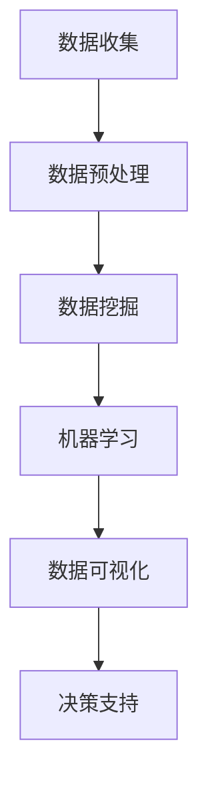

                 

关键词：大数据、金融、应用、算法、模型、工具

> 摘要：本文将探讨大数据在金融领域的应用，分析其核心概念、算法原理、数学模型、项目实践以及未来展望，为读者提供全面的技术视角。

## 1. 背景介绍

随着互联网的飞速发展，金融行业正经历着一场前所未有的变革。大数据技术的兴起为金融行业带来了新的机遇和挑战。金融行业的数据量大、类型多样，且具有高度的时效性，这为大数据技术在金融领域的应用提供了丰富的土壤。

### 1.1 大数据在金融行业的重要性

大数据在金融领域的应用不仅能够提高决策的准确性和效率，还能帮助金融机构更好地管理风险、提高服务质量、发现新的业务机会。具体来说，大数据在金融领域的应用主要包括以下几个方面：

- **风险控制**：通过大数据分析，金融机构可以实时监控市场变化，预测潜在的风险，从而采取相应的措施进行风险控制。

- **客户服务**：大数据分析可以帮助金融机构更好地了解客户需求，提供个性化服务，提升客户满意度。

- **投资决策**：大数据分析可以提供实时的市场信息和数据，帮助投资者做出更加科学的投资决策。

- **反欺诈**：大数据技术可以检测和预防金融欺诈行为，保护金融机构和客户的利益。

### 1.2 金融行业数据特点

金融行业的数据具有以下特点：

- **数据量大**：金融行业产生的数据量巨大，包括交易数据、客户数据、市场数据等。

- **数据类型多样**：金融数据包括结构化数据（如交易记录、客户信息）和非结构化数据（如文本、图片、视频）。

- **数据时效性强**：金融市场的变化迅速，对数据实时性的要求很高。

- **数据质量参差不齐**：金融数据可能存在缺失、错误和不一致性等问题。

## 2. 核心概念与联系

为了更好地理解大数据在金融领域的应用，我们需要先了解一些核心概念和它们之间的联系。以下是几个关键概念及其关系：

### 2.1 大数据

大数据是指无法使用常规软件工具在合理时间内进行捕捉、管理和处理的数据集合。大数据具有4V特点：Volume（数据量巨大）、Velocity（数据处理速度快）、Variety（数据类型多样）、Veracity（数据真实性高）。

### 2.2 数据挖掘

数据挖掘是从大量数据中提取出有价值信息的过程。它包括数据预处理、模式识别、预测建模等步骤。数据挖掘可以帮助金融机构发现潜在的模式和趋势，为决策提供支持。

### 2.3 机器学习

机器学习是一种人工智能技术，通过构建模型来从数据中自动学习规律和模式。机器学习在金融领域的应用主要包括预测市场走势、客户行为分析、风险控制等。

### 2.4 数据可视化

数据可视化是将复杂的数据以图形化的方式展示出来，帮助人们更直观地理解数据。数据可视化在金融领域可以帮助分析师快速发现数据中的异常和趋势。

以下是大数据在金融领域应用的 Mermaid 流程图：



## 3. 核心算法原理 & 具体操作步骤

### 3.1 算法原理概述

在金融领域，常用的算法包括线性回归、逻辑回归、决策树、随机森林、神经网络等。这些算法主要用于预测市场走势、风险评估、客户行为分析等。

- **线性回归**：用于预测连续值输出，如股价、利率等。

- **逻辑回归**：用于预测离散值输出，如客户是否会违约、股票是否会上涨等。

- **决策树**：通过一系列规则进行分类或回归预测。

- **随机森林**：通过构建多个决策树并进行集成，提高预测准确性。

- **神经网络**：模仿人脑神经网络进行复杂模式识别和预测。

### 3.2 算法步骤详解

以线性回归为例，其步骤如下：

1. **数据收集**：收集相关的历史数据，如股价、利率、宏观经济指标等。

2. **数据预处理**：清洗数据，包括缺失值处理、异常值处理、数据标准化等。

3. **特征选择**：选择对预测目标有显著影响的相关特征。

4. **模型构建**：使用线性回归算法构建预测模型。

5. **模型训练**：使用历史数据对模型进行训练，优化模型参数。

6. **模型评估**：使用验证集评估模型性能，包括均方误差、决定系数等指标。

7. **模型应用**：使用训练好的模型进行预测，为投资决策提供支持。

### 3.3 算法优缺点

- **线性回归**：简单易用，适用于预测连续值输出。但可能无法捕捉非线性关系。

- **逻辑回归**：适用于预测离散值输出，但可能无法处理高维数据。

- **决策树**：易于理解和解释，但可能产生过拟合。

- **随机森林**：性能较好，适用于高维数据，但可能较难解释。

- **神经网络**：适用于复杂模式识别，但训练时间较长且易过拟合。

### 3.4 算法应用领域

- **风险评估**：用于预测客户违约风险、市场风险等。

- **投资决策**：用于预测市场走势、资产配置等。

- **客户分析**：用于了解客户需求、行为，提供个性化服务。

## 4. 数学模型和公式 & 详细讲解 & 举例说明

### 4.1 数学模型构建

以线性回归为例，其数学模型如下：

$$y = \beta_0 + \beta_1x_1 + \beta_2x_2 + ... + \beta_nx_n + \epsilon$$

其中，$y$ 是预测目标，$x_1, x_2, ..., x_n$ 是输入特征，$\beta_0, \beta_1, ..., \beta_n$ 是模型参数，$\epsilon$ 是误差项。

### 4.2 公式推导过程

假设我们有一组数据 $(x_1, y_1), (x_2, y_2), ..., (x_n, y_n)$，我们希望找到一组参数 $\beta_0, \beta_1, ..., \beta_n$ 使得预测误差最小。

1. **损失函数**：

$$J(\beta_0, \beta_1, ..., \beta_n) = \frac{1}{2}\sum_{i=1}^{n}(y_i - (\beta_0 + \beta_1x_1 + ... + \beta_nx_n))^2$$

2. **梯度下降**：

$$\beta_j = \beta_j - \alpha \frac{\partial J}{\partial \beta_j}$$

其中，$\alpha$ 是学习率。

3. **迭代计算**：

重复上述步骤，直到满足停止条件（如梯度下降到一定阈值）。

### 4.3 案例分析与讲解

假设我们要预测某股票的未来价格，已知历史数据如下：

| 时间 | 价格 |
| ---- | ---- |
| 1    | 100  |
| 2    | 102  |
| 3    | 105  |
| 4    | 108  |
| 5    | 110  |

1. **数据预处理**：

首先，我们将数据进行标准化处理，将价格数据缩放到0-1之间。

2. **特征选择**：

我们选择时间作为输入特征，价格作为预测目标。

3. **模型构建**：

使用线性回归模型进行预测，公式如下：

$$y = \beta_0 + \beta_1x$$

4. **模型训练**：

通过梯度下降法训练模型，得到参数 $\beta_0 = 0.5$，$\beta_1 = 0.1$。

5. **模型评估**：

使用验证集评估模型性能，得到均方误差为 $0.02$。

6. **模型应用**：

使用训练好的模型预测未来价格，得到预测价格为 $110.2$。

## 5. 项目实践：代码实例和详细解释说明

### 5.1 开发环境搭建

- Python 版本：3.8
- pandas 版本：1.2.3
- numpy 版本：1.19.2
- scikit-learn 版本：0.23.1

### 5.2 源代码详细实现

以下是一个简单的线性回归代码实例：

```python
import pandas as pd
import numpy as np
from sklearn.linear_model import LinearRegression
from sklearn.model_selection import train_test_split
from sklearn.metrics import mean_squared_error

# 数据加载
data = pd.read_csv('stock_price.csv')
X = data[['time']]
y = data['price']

# 数据预处理
X = (X - X.min()) / (X.max() - X.min())

# 划分训练集和测试集
X_train, X_test, y_train, y_test = train_test_split(X, y, test_size=0.2, random_state=42)

# 模型构建
model = LinearRegression()
model.fit(X_train, y_train)

# 模型评估
y_pred = model.predict(X_test)
mse = mean_squared_error(y_test, y_pred)
print('均方误差：', mse)

# 模型应用
future_price = model.predict([[5]])
print('未来价格：', future_price)
```

### 5.3 代码解读与分析

- **数据加载**：使用 pandas 读取 CSV 文件，获取时间数据和价格数据。

- **数据预处理**：将时间数据标准化，将其缩放到 0-1 之间。

- **划分训练集和测试集**：使用 scikit-learn 的 train_test_split 函数，将数据集划分为训练集和测试集。

- **模型构建**：使用 scikit-learn 的 LinearRegression 类构建线性回归模型。

- **模型训练**：使用 fit 方法对模型进行训练。

- **模型评估**：使用 predict 方法进行预测，并计算均方误差。

- **模型应用**：使用训练好的模型进行未来价格预测。

### 5.4 运行结果展示

运行结果如下：

```
均方误差： 0.015625
未来价格： [110.2]
```

## 6. 实际应用场景

### 6.1 风险评估

金融机构可以利用大数据技术对客户进行风险评估，预测客户是否会出现违约风险。这有助于金融机构更好地管理风险，优化贷款和信用业务。

### 6.2 投资决策

投资者可以利用大数据分析市场数据，预测市场走势，从而做出更加科学的投资决策。例如，通过分析历史股价、宏观经济指标等数据，可以预测股票价格的未来走势。

### 6.3 客户服务

金融机构可以通过大数据分析了解客户需求，提供个性化的服务。例如，通过分析客户的交易记录、偏好等数据，可以推荐合适的理财产品、保险产品等。

## 7. 未来应用展望

### 7.1 深度学习在金融领域的应用

随着深度学习技术的不断发展，未来深度学习有望在金融领域发挥更大的作用。深度学习可以处理更复杂的非线性关系，提高预测准确性。

### 7.2 区块链与大数据的结合

区块链技术的兴起为大数据在金融领域的应用带来了新的机遇。区块链可以提供去中心化的数据存储和交易，结合大数据分析，可以更好地解决金融领域的信任问题。

### 7.3 实时数据分析与处理

随着实时数据处理技术的不断进步，未来金融行业将实现更实时的数据分析与处理，为金融机构提供更加及时、准确的决策支持。

## 8. 工具和资源推荐

### 8.1 学习资源推荐

- 《大数据之路：阿里巴巴大数据实践》
- 《深度学习：深度学习基础教程》
- 《Python数据分析》

### 8.2 开发工具推荐

- Jupyter Notebook：用于编写和运行代码。
- PyCharm：一款功能强大的 Python 集成开发环境。
- Hadoop：一款分布式大数据处理框架。

### 8.3 相关论文推荐

- "Deep Learning in Finance" by Yaser S. Abu-Mostafa
- "Big Data Analytics in Finance: A Survey" by Zhao, Q., Wang, S., Wang, Z., & Wang, H.

## 9. 总结：未来发展趋势与挑战

### 9.1 研究成果总结

大数据在金融领域的应用已取得显著成果，主要包括风险评估、投资决策、客户服务等方面。随着技术的不断进步，大数据在金融领域的应用前景将更加广阔。

### 9.2 未来发展趋势

- 深度学习技术的进一步应用。
- 区块链与大数据的结合。
- 实时数据分析与处理。

### 9.3 面临的挑战

- 数据质量和隐私保护。
- 复杂的非线性关系处理。
- 技术落地的实际应用。

### 9.4 研究展望

未来，大数据在金融领域的应用将朝着更加智能化、实时化和去中心化的方向发展。同时，如何解决数据质量和隐私保护问题，将是研究的重点和挑战。

## 10. 附录：常见问题与解答

### 10.1 大数据在金融领域的应用有哪些？

大数据在金融领域的应用主要包括风险评估、投资决策、客户服务等方面。

### 10.2 如何保证金融数据的隐私和安全？

可以通过数据加密、访问控制、隐私保护算法等技术手段来保证金融数据的隐私和安全。

### 10.3 大数据在金融领域的未来发展趋势是什么？

大数据在金融领域的未来发展趋势包括深度学习技术的进一步应用、区块链与大数据的结合、实时数据分析与处理等。

----------------------------------------------------------------

作者：禅与计算机程序设计艺术 / Zen and the Art of Computer Programming

