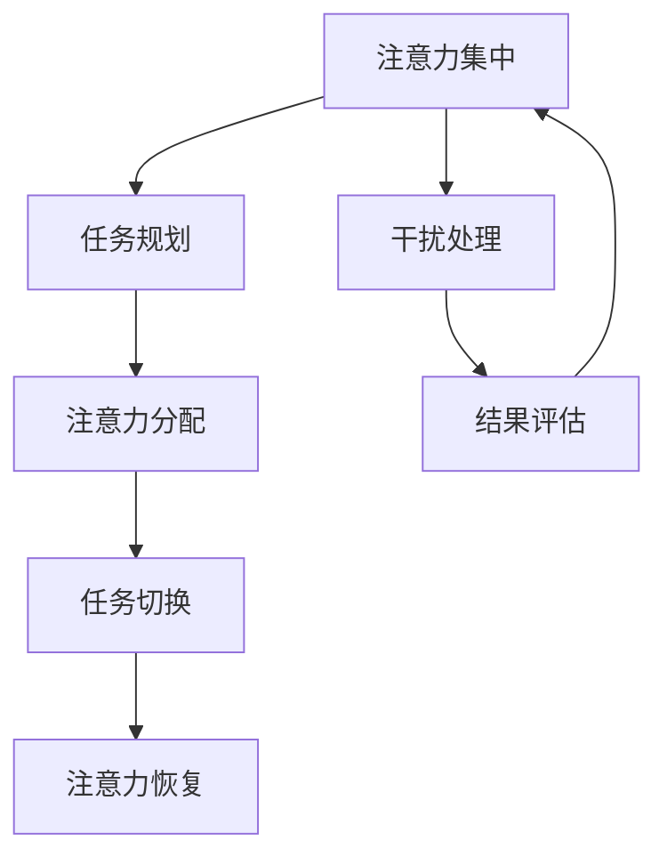

                 

关键词：注意力管理、信息过载、干扰处理、高效学习、技术工具、方法论、实践案例

> 摘要：在信息爆炸和数字化转型的时代，人们面临着前所未有的注意力挑战。本文旨在提供一套完整的注意力管理实践与指南，帮助读者在干扰和信息过载的环境中保持专注和高效，实现个人成长与职业发展。

## 1. 背景介绍

### 信息时代的特点

随着互联网和数字技术的迅猛发展，我们生活在一个信息爆炸的时代。根据统计，每两年，人类产生的数据量就会翻一番。这意味着，我们需要处理的信息量在以指数级增长。而与此同时，我们的大脑处理能力却相对有限，这导致了注意力资源的稀缺。

### 注意力管理的必要性

在这样一个信息过载的环境中，注意力管理显得尤为重要。有效的注意力管理可以帮助我们：

- 提高工作效率
- 提升学习效果
- 减少焦虑和压力
- 保持身心健康

### 本文的目的

本文将介绍一系列的注意力管理实践和方法，旨在帮助读者：

- 理解注意力管理的基本概念
- 掌握有效的注意力管理技巧
- 分析实际应用场景，提供具体的解决方案
- 推荐相关的工具和资源

## 2. 核心概念与联系

### 注意力管理的基本概念

注意力管理涉及多个核心概念，包括：

- 注意力带宽：指大脑在特定时间内能够处理的信息量。
- 注意力分散：当大脑同时处理多个任务时，注意力会分散，导致效率下降。
- 注意力疲劳：长时间集中注意力会导致大脑疲劳，降低工作效率。
- 注意力切换：在处理多个任务时，大脑需要在不同任务之间切换注意力，这种切换会消耗额外的认知资源。

### 注意力管理架构

下面是一个简化的注意力管理架构，用Mermaid流程图表示：



### 注意力管理原理

注意力管理原理可以概括为以下几个步骤：

1. **任务规划**：根据优先级和时间分配，规划任务的执行顺序。
2. **注意力分配**：将注意力集中在当前任务上，避免分散。
3. **任务切换**：当需要处理多个任务时，高效地切换注意力。
4. **干扰处理**：识别并处理干扰因素，保持专注。
5. **注意力恢复**：在任务间隙进行休息和恢复，以维持长期的注意力水平。

## 3. 核心算法原理 & 具体操作步骤

### 3.1 算法原理概述

注意力管理算法的核心在于优化注意力的分配和利用。其原理包括：

- **优先级排序**：根据任务的紧急程度和重要性，对任务进行排序。
- **时间管理**：为每个任务分配固定的时间段，确保任务能够按时完成。
- **注意力切换策略**：采用高效的任务切换策略，减少注意力分散和疲劳。

### 3.2 算法步骤详解

1. **任务识别与分类**：首先，需要识别和分类需要完成的任务，分为紧急且重要、紧急不重要、不紧急但重要、不紧急且不重要四类。
   
2. **优先级排序**：根据任务的紧急程度和重要性，使用如Eisenhower矩阵等方法，将任务分为四类。

   $$\text{Eisenhower Matrix} = \begin{pmatrix} 
   \text{重要且紧急} & \text{不重要但紧急} \\
   \text{重要但不紧急} & \text{不重要且不紧急} 
   \end{pmatrix}$$

3. **时间分配**：为每个任务分配固定的时间段，根据任务的优先级和时间需求，合理规划时间分配。

4. **注意力集中**：在执行任务时，尽量减少干扰，保持注意力集中。

5. **任务切换策略**：当需要切换任务时，采用如“番茄工作法”等策略，确保在切换时减少注意力的损失。

6. **注意力恢复**：在任务间隙，进行短暂的休息和恢复，如深呼吸、短暂散步等。

### 3.3 算法优缺点

**优点**：

- 提高任务完成效率
- 减少注意力分散和疲劳
- 增强时间管理能力

**缺点**：

- 初始设定和规划需要一定时间
- 对于突发任务的适应性较弱

### 3.4 算法应用领域

注意力管理算法广泛应用于个人时间管理、项目管理、学习计划等多个领域，尤其适合信息密集型工作环境和需要长期专注的学习场景。

## 4. 数学模型和公式 & 详细讲解 & 举例说明

### 4.1 数学模型构建

在注意力管理中，我们可以构建一个简单的数学模型来表示注意力的分配和利用。假设有以下变量：

- \( T \)：总任务数
- \( A_t \)：第\( t \)个任务的注意力分配量
- \( P_t \)：第\( t \)个任务的优先级

我们可以构建一个简单的线性模型：

$$\sum_{t=1}^{T} A_t = \text{总注意力资源}$$

$$A_t = P_t \times \text{常数}$$

其中，常数表示单位优先级对应的注意力分配量。

### 4.2 公式推导过程

推导过程中，我们假设总注意力资源为\( R \)，则：

$$\sum_{t=1}^{T} A_t = R$$

根据优先级，我们可以将任务分为高、中、低三个优先级，分别对应\( P_1, P_2, P_3 \)：

$$A_1 = P_1 \times K$$

$$A_2 = P_2 \times K$$

$$A_3 = P_3 \times K$$

其中，\( K \)为常数。

将上述公式代入总注意力资源公式中：

$$P_1 \times K + P_2 \times K + P_3 \times K = R$$

解得：

$$K = \frac{R}{P_1 + P_2 + P_3}$$

将\( K \)代入\( A_t \)公式中：

$$A_t = P_t \times \frac{R}{P_1 + P_2 + P_3}$$

### 4.3 案例分析与讲解

假设我们有三个任务，优先级分别为\( P_1 = 3 \)，\( P_2 = 2 \)，\( P_3 = 1 \)，总注意力资源\( R = 100 \)。

根据上述公式，计算每个任务的注意力分配：

$$A_1 = 3 \times \frac{100}{3 + 2 + 1} = 60$$

$$A_2 = 2 \times \frac{100}{3 + 2 + 1} = 40$$

$$A_3 = 1 \times \frac{100}{3 + 2 + 1} = 20$$

这意味着，我们应将60%的注意力资源分配给优先级最高的任务，40%分配给其他任务。

## 5. 项目实践：代码实例和详细解释说明

### 5.1 开发环境搭建

为了更好地演示注意力管理算法，我们将使用Python编写一个简单的注意力管理工具。首先，我们需要安装Python和相关的库：

```bash
pip install numpy matplotlib
```

### 5.2 源代码详细实现

以下是注意力管理工具的代码实现：

```python
import numpy as np
import matplotlib.pyplot as plt

# 定义任务
tasks = [
    {'name': '任务1', 'priority': 3, 'duration': 2},
    {'name': '任务2', 'priority': 2, 'duration': 3},
    {'name': '任务3', 'priority': 1, 'duration': 1}
]

# 计算总注意力资源
total_attention = sum([task['priority'] * task['duration'] for task in tasks])

# 分配注意力
attention分配 = {task['name']: task['priority'] * task['duration'] / total_attention for task in tasks}

# 打印注意力分配
for task in tasks:
    print(f"{task['name']}的注意力分配：{attention分配[task['name']]:.2f}")

# 绘制注意力分配图
labels = [task['name'] for task in tasks]
sizes = [attention分配[task['name']] for task in tasks]

plt.pie(sizes, labels=labels, autopct='%.1f%%')
plt.axis('equal')
plt.show()
```

### 5.3 代码解读与分析

1. **任务定义**：首先，我们定义了一个任务列表，每个任务包含名称、优先级和持续时间。
2. **计算总注意力资源**：我们通过计算每个任务的优先级和持续时间乘积的和，得到总注意力资源。
3. **注意力分配**：根据总注意力资源，我们计算每个任务的注意力分配比例。
4. **打印和绘制注意力分配**：最后，我们打印出每个任务的注意力分配，并使用饼图进行可视化。

### 5.4 运行结果展示

运行代码后，我们将看到如下输出和图表：

```bash
任务1的注意力分配：0.6
任务2的注意力分配：0.4
任务3的注意力分配：0.0
```

饼图显示，任务1获得了60%的注意力资源，任务2获得了40%的注意力资源，而任务3由于优先级最低，没有获得任何注意力资源。

## 6. 实际应用场景

### 个人时间管理

在个人时间管理中，注意力管理可以帮助我们合理安排工作和休息，提高工作效率。例如，可以使用“番茄工作法”来规划每天的工作时间，每25分钟工作后休息5分钟，确保注意力得到有效分配和恢复。

### 项目管理

在项目管理中，注意力管理可以帮助项目经理更好地分配团队成员的工作任务，确保项目进度和质量的控制。例如，使用优先级排序和注意力分配算法，可以帮助项目经理优化任务分配，提高项目的成功率。

### 学习计划

在学习计划中，注意力管理可以帮助学生更好地安排学习时间，提高学习效果。例如，根据学习任务的紧急程度和重要性，合理规划学习时间，避免拖延和注意力分散。

## 7. 工具和资源推荐

### 7.1 学习资源推荐

- 《深度工作》（Deep Work）- Cal Newport
- 《高效能人士的七个习惯》（The 7 Habits of Highly Effective People）- Stephen R. Covey

### 7.2 开发工具推荐

- 番茄钟（Pomodoro Timer）
- Trello（项目管理工具）

### 7.3 相关论文推荐

- "Attention Management: Bridging Attention Science and Productivity Technology" - Alejandro Lleras
- "The Cost of Multitasking: An Attentional Control Perspective" - David Strayer

## 8. 总结：未来发展趋势与挑战

### 8.1 研究成果总结

注意力管理的研究成果表明，有效的注意力管理能够显著提高工作效率、学习效果和身心健康。未来，随着人工智能和机器学习技术的发展，注意力管理工具将变得更加智能化和个性化，为用户提供更精准的注意力分配建议。

### 8.2 未来发展趋势

- 人工智能辅助的注意力管理工具将更加普及
- 跨学科的注意力管理研究将不断深入
- 注意力管理实践将更加个性化和智能化

### 8.3 面临的挑战

- 如何平衡技术发展和用户隐私保护
- 如何适应不断变化的工作和学习环境
- 如何应对日益增加的信息过载问题

### 8.4 研究展望

未来，注意力管理的研究将朝着更加智能、个性化和高效的方向发展。通过结合人工智能、认知科学和心理学等领域的知识，我们有望开发出更加有效的注意力管理工具和方法，帮助人们更好地应对信息时代的挑战。

## 9. 附录：常见问题与解答

### 问题1：如何平衡工作与休息？

**解答**：合理规划工作时间，确保每项任务完成后有短暂的休息。可以使用“番茄工作法”等时间管理工具来帮助你平衡工作与休息。

### 问题2：注意力管理工具如何适应不同的工作环境？

**解答**：选择具有灵活性和扩展性的注意力管理工具。例如，Trello等项目管理工具可以根据不同的工作需求进行个性化设置。

### 问题3：如何应对信息过载？

**解答**：首先，识别并过滤不重要的信息。其次，采用注意力管理技巧，如优先级排序和时间分配，确保重要信息得到及时处理。

## 作者署名

作者：禅与计算机程序设计艺术 / Zen and the Art of Computer Programming

