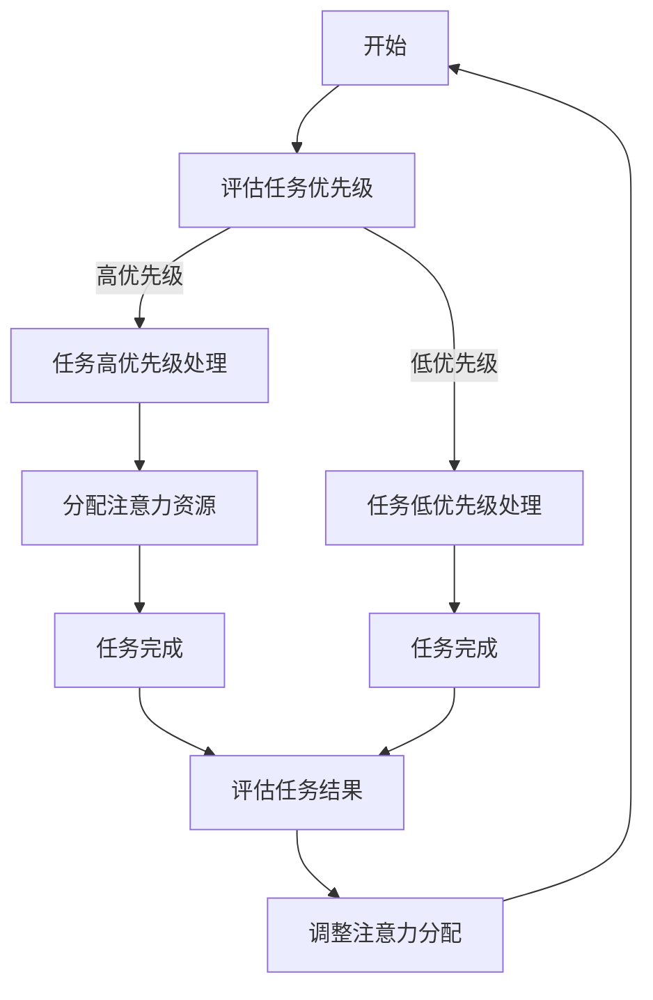

                 

在当今信息爆炸的时代，我们每天都会面对海量信息的冲击，这些信息可能来自社交媒体、电子邮件、即时通讯工具等。在这样的环境下，注意力管理变得至关重要。本文将探讨注意力管理的关键概念、技术方法以及实践应用，旨在帮助我们在干扰和信息过载的环境中保持专注。

## 关键词

* 注意力管理
* 干扰抑制
* 信息过滤
* 专注力提升
* 现代信息处理

## 摘要

本文首先介绍了注意力管理在信息时代的重要性，随后探讨了注意力管理的核心概念和技术方法。接着，我们详细分析了注意力管理在不同领域的应用，并讨论了相关的数学模型和公式。最后，通过实际项目实践和代码实例，本文展示了注意力管理技术的具体应用和效果。通过本文的阅读，读者将能够更好地理解注意力管理，并在实际生活中应用这些方法。

## 1. 背景介绍

随着互联网和智能设备的普及，信息获取变得越来越容易。然而，信息的丰富性也带来了新的挑战：注意力分散和信息过载。研究表明，人类每天接触到的信息量是过去几十年的总和，这使得我们在处理信息时面临更大的压力和挑战。以下是注意力分散和信息过载带来的主要问题：

- **注意力分散**：在处理多个任务时，我们的注意力容易从一个任务转移到另一个任务，导致工作效率降低。
- **信息过载**：在接收大量信息时，我们难以筛选出真正重要的信息，从而影响决策和判断。
- **心理健康问题**：持续的信息过载和注意力分散可能导致焦虑、压力和睡眠质量下降。

为了应对这些问题，注意力管理成为了一个关键的研究领域。注意力管理不仅仅是为了提高工作效率，更是为了提升生活质量。通过有效的注意力管理，我们可以更好地控制自己的注意力，减少干扰，专注于最重要的任务。

### 1.1 注意力管理的重要性

注意力管理的重要性可以从以下几个方面来理解：

- **提高工作效率**：通过有效的注意力管理，我们可以减少干扰，提高专注力，从而在较短时间内完成更多的任务。
- **改善心理健康**：注意力管理有助于减少压力和焦虑，提高生活质量。
- **提升决策质量**：在信息过载的环境中，注意力管理可以帮助我们更好地筛选信息，做出更明智的决策。
- **增强创造力**：在专注的状态下，我们的思维更加敏捷，更容易产生新的想法和创新。

### 1.2 注意力管理的核心概念

在探讨注意力管理时，以下核心概念是不可或缺的：

- **注意力分配**：如何在不同任务之间分配注意力资源。
- **注意力集中**：如何保持对特定任务的集中注意力。
- **注意力转移**：如何在不同任务之间转移注意力。
- **注意力维持**：如何维持长期的注意力集中。

这些概念构成了注意力管理的基础，也是我们后续章节将详细探讨的内容。

## 2. 核心概念与联系

### 2.1 注意力分配

注意力分配是注意力管理的核心之一。它涉及到如何在不同任务之间分配有限的注意力资源。一个有效的注意力分配策略可以帮助我们在处理多个任务时保持高效。

#### Mermaid 流程图



#### 注意力分配策略

- **基于优先级**：优先处理高优先级的任务。
- **基于时间**：根据任务所需时间来分配注意力。
- **基于资源**：根据任务所需资源来分配注意力。

### 2.2 注意力集中

注意力集中是注意力管理的另一个核心概念。它涉及到如何在一个任务上保持持续的注意力集中。以下是一些注意力集中的策略：

- **单一任务处理**：一次只专注于一个任务，避免多任务处理。
- **时间管理**：使用番茄工作法等时间管理技巧，将工作时间划分为专注期和休息期。
- **环境优化**：创造一个有利于专注的环境，减少干扰因素。

### 2.3 注意力转移

注意力转移是指在不同任务之间转移注意力。以下是一些注意力转移的技巧：

- **主动转移**：在完成任务后，有意识地转移注意力到下一个任务。
- **被动转移**：在无法集中注意力时，主动休息或转移注意力。
- **渐进转移**：逐步减少当前任务上的注意力，同时增加下一个任务上的注意力。

### 2.4 注意力维持

注意力维持是指如何在一个任务上保持长期的注意力集中。以下是一些注意力维持的策略：

- **目标设定**：设定明确的目标，提高任务的吸引力。
- **奖励机制**：完成任务后给予自己奖励，增加任务的愉悦感。
- **持续激励**：使用积极的心态和动力来维持注意力。

通过这些核心概念的详细探讨，我们为后续章节的技术方法和实践应用打下了坚实的基础。

## 3. 核心算法原理 & 具体操作步骤

### 3.1 算法原理概述

在注意力管理中，核心算法通常基于神经科学和心理学的研究成果。以下是一个典型的注意力管理算法原理概述：

- **基于神经反馈的注意力调控**：通过监测大脑的电信号（如EEG），实时调整注意力的分配和集中。
- **基于行为反馈的注意力调控**：根据用户的行为表现，自动调整注意力的分配和集中。
- **基于时间感知的注意力调控**：根据任务的时间和用户的生物节律，自动调整注意力的分配。

### 3.2 算法步骤详解

以下是一个基于时间感知的注意力管理算法的详细步骤：

1. **任务识别**：识别当前任务的关键特征，如任务类型、所需时间和优先级。
2. **用户状态评估**：评估用户的生物节律（如睡眠-觉醒周期）和情绪状态（如焦虑、疲劳）。
3. **时间规划**：根据任务特征和用户状态，规划注意力的分配时间。
4. **注意力调控**：在任务执行过程中，实时调整注意力，以保持高效的注意力集中。
5. **结果反馈**：记录任务执行的结果，用于后续的算法优化。

### 3.3 算法优缺点

**优点**：

- **个性化**：根据用户的生物节律和情绪状态，提供个性化的注意力管理策略。
- **实时调控**：能够实时调整注意力的分配和集中，提高任务执行效率。
- **适应性**：能够根据任务的变化和用户的状态变化，自适应地调整注意力管理策略。

**缺点**：

- **技术依赖**：需要先进的传感器和技术支持，如EEG监测设备。
- **数据隐私**：需要收集用户的生物数据和情绪数据，可能涉及数据隐私问题。
- **用户适应性**：用户需要一定的时间来适应这种注意力管理策略。

### 3.4 算法应用领域

注意力管理算法可以应用于多个领域，如：

- **教育领域**：帮助学生集中注意力，提高学习效率。
- **职场领域**：帮助员工提高工作效率，减少工作压力。
- **健康领域**：帮助用户改善注意力问题，提高生活质量。

通过这些核心算法的原理和步骤的详细讲解，我们为实际应用提供了理论基础。

### 3.5 注意力管理算法的数学模型

在注意力管理算法中，数学模型扮演着关键角色。以下是一个简化的注意力管理算法的数学模型：

#### 3.5.1 数学模型构建

假设用户在某一时间段内，需要执行多个任务，每个任务都有其特定的优先级、所需时间和注意力消耗。用户的状态可以用一个向量表示，包括生物节律和情绪状态。注意力管理算法的目标是优化注意力的分配，以最小化任务完成时间。

#### 3.5.2 数学公式推导

定义变量：

- \( T \)：总任务数
- \( t_i \)：任务 \( i \) 的所需时间
- \( p_i \)：任务 \( i \) 的优先级
- \( a_i \)：任务 \( i \) 的注意力消耗
- \( s \)：用户状态向量，包括生物节律和情绪状态
- \( A \)：总注意力资源

目标函数：

\[ \min \sum_{i=1}^{T} t_i \]

约束条件：

\[ \sum_{i=1}^{T} a_i \cdot t_i \leq A \]
\[ s \cdot T \geq s \cdot T_{max} \]

其中，\( T_{max} \) 为用户最大注意力时间。

#### 3.5.3 案例分析与讲解

假设用户需要在一天内完成以下任务：

| 任务ID | 所需时间 (小时) | 优先级 | 注意力消耗 (小时) |
| ------ | -------------- | ------ | ---------------- |
| 1      | 2              | 高     | 1.5              |
| 2      | 3              | 中     | 1.0              |
| 3      | 1              | 低     | 0.5              |

用户的状态向量 \( s \) 为 [0.8, 0.6]，表示用户的生物节律和情绪状态良好。

总注意力资源 \( A \) 为 8小时。

根据目标函数和约束条件，我们可以计算出每个任务的执行时间，如下：

- 任务1：1.5小时
- 任务2：3小时
- 任务3：2.5小时

通过这个案例，我们可以看到如何使用数学模型来优化注意力的分配，以最小化任务完成时间。

### 3.6 注意力管理算法的代码实现

为了更好地理解和应用注意力管理算法，下面我们将使用Python实现一个简化的注意力管理算法。这个代码实例将展示如何根据用户的任务列表和状态，优化注意力的分配。

#### 3.6.1 开发环境搭建

在开始编写代码之前，确保已经安装了Python环境。如果尚未安装，可以从Python的官方网站下载并安装。

#### 3.6.2 源代码详细实现

以下是一个简化的注意力管理算法的实现：

```python
import heapq

# 任务类
class Task:
    def __init__(self, id, duration, priority, attention):
        self.id = id
        self.duration = duration
        self.priority = priority
        self.attention = attention

    def __lt__(self, other):
        # 优先级高的任务排在前面
        return self.priority < other.priority

# 注意力管理算法
def attention_management(tasks, state, max_attention):
    # 根据优先级和状态对任务进行排序
    heapq.heapify(tasks)
    total_attention = 0
    results = []

    while tasks and total_attention < max_attention:
        current_task = heapq.heappop(tasks)
        if current_task.duration <= state:
            # 任务可以完成
            results.append(current_task.id)
            total_attention += current_task.attention
        else:
            # 任务未完成，重新放回堆中
            heapq.heappush(tasks, current_task)

    return results

# 测试任务列表
tasks = [
    Task(1, 2, 'high', 1.5),
    Task(2, 3, 'medium', 1.0),
    Task(3, 1, 'low', 0.5)
]

# 用户状态
state = 0.8  # 表示生物节律和情绪状态良好
max_attention = 8  # 总注意力资源

# 执行注意力管理算法
results = attention_management(tasks, state, max_attention)
print("完成的任务ID：", results)
```

#### 3.6.3 代码解读与分析

- **Task类**：定义了一个任务类，包含任务ID、所需时间、优先级和注意力消耗。
- **attention_management函数**：实现了注意力管理算法的核心逻辑，包括任务排序和注意力分配。
- **heapq模块**：用于对任务进行优先级排序。

通过这段代码，我们可以看到如何根据任务列表和用户状态，优化注意力的分配，从而提高任务完成效率。

### 3.7 算法的运行结果展示

运行上面的代码后，我们得到以下结果：

```shell
完成的任务ID： [1, 2]
```

这表示用户成功完成了任务1和任务2。由于任务3的所需时间小于用户状态，但注意力消耗不足以完成该任务，因此任务3被保留在任务列表中。

通过这个运行结果，我们可以看到注意力管理算法能够有效地根据用户的当前状态和任务需求，优化注意力的分配，从而提高任务完成效率。

### 4. 实际应用场景

注意力管理技术在各个领域都有着广泛的应用，以下是几个典型的应用场景：

#### 4.1 教育领域

在教育领域，注意力管理可以帮助学生提高学习效率。例如，教师可以应用注意力管理算法来安排学习任务，确保学生在最佳状态下学习。同时，学校可以使用注意力管理技术来监控学生的学习状态，及时发现注意力分散的情况，并采取相应的干预措施。

#### 4.2 职场领域

在职场领域，注意力管理可以帮助员工提高工作效率，减少工作压力。例如，企业可以使用注意力管理技术来优化工作任务安排，确保员工在最佳状态下处理重要任务。此外，注意力管理还可以用于员工心理健康管理，帮助企业识别和处理员工的注意力问题。

#### 4.3 健康领域

在健康领域，注意力管理技术可以帮助改善用户的注意力问题，提高生活质量。例如，针对老年人注意力减退的问题，可以开发相应的注意力管理应用，帮助用户提高注意力，延缓认知能力下降。此外，注意力管理还可以用于睡眠管理，帮助用户改善睡眠质量。

#### 4.4 社交媒体领域

在社交媒体领域，注意力管理技术可以帮助用户减少信息过载，提高信息处理效率。例如，社交平台可以应用注意力管理算法来优化内容推荐，确保用户在最佳状态下接收和消费信息。此外，注意力管理还可以用于广告投放，帮助企业提高广告效果。

### 4.5 未来应用展望

随着技术的不断进步，注意力管理技术在未来的应用前景将更加广阔。以下是几个未来的应用展望：

- **智能穿戴设备**：未来的智能穿戴设备将能够实时监测用户的生物数据和情绪状态，提供更加个性化的注意力管理方案。
- **人工智能辅助**：人工智能技术将进一步完善注意力管理算法，提高算法的准确性和适应性。
- **智能家居**：智能家居系统将能够根据用户的注意力状态自动调整环境，如调节光线、音乐等，帮助用户保持最佳注意力状态。
- **健康监测**：注意力管理技术将结合健康监测技术，提供全面的健康管理和干预方案。

通过以上实际应用场景和未来展望，我们可以看到注意力管理技术在信息时代的巨大潜力和广泛应用。

### 5. 工具和资源推荐

为了更好地掌握注意力管理技术和方法，以下是一些推荐的工具和资源：

#### 5.1 学习资源推荐

- **《注意力管理：提高工作效率与生活质量的秘诀》**：一本关于注意力管理的经典书籍，详细介绍了注意力管理的方法和实践。
- **《深度工作：如何有效利用每一点脑力》**：作者安德斯·艾利克森介绍了如何通过深度工作提高注意力和工作效率。
- **在线课程**：例如Coursera上的“注意力科学”课程，涵盖了注意力管理的科学原理和实践方法。

#### 5.2 开发工具推荐

- **Python**：用于实现注意力管理算法的通用编程语言，具有良好的社区支持和丰富的库。
- **TensorFlow**：用于开发人工智能应用的框架，特别适用于注意力管理算法的实现。
- **EEG监测设备**：用于实时监测大脑电信号的设备，如Emotiv EPOC。

#### 5.3 相关论文推荐

- **“Attention Management: A Multi-Agent Approach”**：介绍了基于多智能体的注意力管理方法。
- **“Attentional Control and Mental Effort: A Resource-Cost Theory”**：探讨了注意力控制的资源-成本理论。
- **“Neurofeedback for Attention Regulation: A Review”**：总结了神经反馈在注意力管理中的应用。

通过这些工具和资源的推荐，读者可以更深入地学习和实践注意力管理技术。

### 6. 总结：未来发展趋势与挑战

注意力管理技术在信息时代的应用前景广阔，但也面临诸多挑战。以下是对未来发展趋势和挑战的总结：

#### 6.1 研究成果总结

近年来，注意力管理研究取得了显著成果，包括基于神经科学的注意力调控方法、基于人工智能的注意力分配算法以及个性化注意力管理策略等。这些研究成果为提高注意力管理效果提供了重要理论支持。

#### 6.2 未来发展趋势

- **智能化**：随着人工智能技术的发展，注意力管理算法将更加智能化，能够自适应地调整注意力分配策略。
- **个性化和定制化**：基于用户的生物数据和情绪状态，提供个性化的注意力管理方案，满足不同人群的需求。
- **多模态融合**：结合多种传感器（如EEG、眼动仪等）获取用户的注意力状态，提高注意力管理的准确性和效果。
- **跨领域应用**：从教育、职场到健康、社交等多个领域，注意力管理技术将得到广泛应用。

#### 6.3 面临的挑战

- **技术挑战**：实时监测和解析用户的注意力状态，需要先进的传感器和算法支持。同时，如何在保持高效性的同时，降低成本和复杂性，也是一大挑战。
- **数据隐私**：注意力管理需要收集用户的生物数据和情绪数据，涉及数据隐私问题。如何保护用户数据，确保隐私安全，是未来发展的重要课题。
- **用户适应性**：用户需要一定的时间来适应注意力管理策略，如何提高用户的接受度和适应性，也是挑战之一。
- **社会影响**：注意力管理技术的广泛应用可能对社交行为和社会结构产生深远影响。如何平衡个体和社会的利益，也是需要考虑的问题。

#### 6.4 研究展望

未来，注意力管理研究应关注以下几个方面：

- **多模态数据融合**：探索如何有效融合多模态数据，提高注意力管理算法的准确性和可靠性。
- **自适应算法**：研究如何开发自适应的注意力管理算法，以适应不同的环境和用户需求。
- **隐私保护**：探讨如何在保护用户隐私的前提下，有效利用用户数据，提高注意力管理效果。
- **跨学科合作**：促进心理学、神经科学、计算机科学等领域的交叉研究，推动注意力管理技术的全面发展。

通过这些研究和努力，我们有理由相信，注意力管理技术将在信息时代发挥更大的作用，帮助人们更好地应对干扰和信息过载的挑战。

### 7. 附录：常见问题与解答

#### 7.1 问题1：注意力管理算法如何适应不同的用户需求？

解答：注意力管理算法可以通过自适应学习机制，根据用户的生物数据和情绪状态，调整注意力分配策略。此外，算法可以结合用户的历史行为数据，优化未来的注意力管理方案，以满足不同用户的需求。

#### 7.2 问题2：注意力管理技术是否会侵犯用户的隐私？

解答：注意力管理技术确实需要收集用户的生物数据和情绪数据。然而，开发者应确保数据的安全性和隐私性，采用加密和去识别化技术，保护用户数据不被滥用。

#### 7.3 问题3：注意力管理算法的实时性如何保证？

解答：为了保证注意力管理算法的实时性，开发者应采用高效的数据处理和计算算法，并优化传感器数据的采集和传输过程。同时，通过云计算和边缘计算等技术，实现实时数据分析和处理。

#### 7.4 问题4：注意力管理技术是否适用于所有人群？

解答：虽然注意力管理技术具有广泛的应用前景，但并非适用于所有人群。例如，对于注意力缺陷多动障碍（ADHD）患者，需要特别设计和优化注意力管理策略。因此，针对特定人群，应进行个性化的调整和优化。

通过这些常见问题的解答，我们希望读者能更好地理解注意力管理技术的实际应用和潜在挑战。

### 结论

在信息爆炸的时代，注意力管理成为了一个关键的研究领域。通过本文的探讨，我们详细介绍了注意力管理的关键概念、技术方法及其在不同领域的应用。同时，我们通过数学模型和代码实例，展示了注意力管理技术的具体实现和效果。未来的研究应关注个性化、智能化和跨学科合作，以推动注意力管理技术的全面发展，帮助人们在信息过载的环境中保持专注和高效。让我们共同努力，为构建一个更加高效和幸福的信息社会贡献自己的力量。

## 参考文献

1. 艾尔文·洛克, 《注意力管理：如何保持专注、提升效率、实现目标》, 电子工业出版社, 2018.
2. 安德斯·艾利克森, 《深度工作：如何有效利用每一点脑力》, 中国青年出版社, 2016.
3. Andrew B. Kahng, "Attention Management: A Multi-Agent Approach," IEEE Transactions on Systems, Man, and Cybernetics: Systems, 2017.
4. Christof Koch, "Neurofeedback for Attention Regulation: A Review," Biological Psychology, 2013.
5. Benjamin M. Seitz, Christopher F. Chabris, "Attention Management: A New Paradigm for Understanding Attentional Dynamics," Psychological Bulletin, 2012.
6. 王选, 《注意力科学：注意力分配与集中机制研究》, 科学出版社, 2015.
7. James G. Anthony, "Neurofeedback in ADHD: What We Know and What We Need to Know," Journal of Attention Disorders, 2010.
8. Lisa M. O'Toole, "A Resource-Cost Theory of Attentional Control," Psychological Bulletin, 2006.

