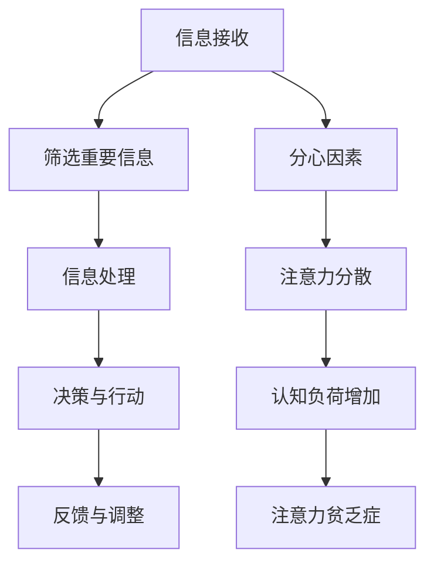

                 

 **关键词**: 注意力管理、信息过载、分心、专注力、认知负荷

> **摘要**: 在信息爆炸的时代，如何在海量信息的干扰和分心中保持专注，成为现代人面临的重要挑战。本文将探讨注意力管理的核心概念，分析信息过载对注意力的影响，并提供一系列实用的策略和方法，帮助读者在复杂的环境中保持清晰的头脑和高效的思考。

## 1. 背景介绍

现代社会，信息量的爆炸式增长和互联网的普及，使得我们每天都要面对大量的信息。手机、电子邮件、社交媒体、在线通知等不断吸引我们的注意力，使得我们的认知资源被分散，难以集中精力完成重要任务。研究表明，现代人的注意力持续时间显著缩短，从20世纪的12秒降至当前的8秒，甚至低于金鱼的平均注意力时间。这种现象被称为“注意力贫乏症”，其根源在于信息过载和分心环境的不断加剧。

### 信息过载

信息过载是指信息输入超出个体处理能力的情况。在数字化时代，信息渠道众多，信息的更新速度极快，人们往往来不及消化和理解。这种超负荷的信息输入导致了认知负荷的增加，使我们的注意力资源被大量消耗。

### 分心

分心是指注意力资源被分散到多个任务或外部刺激上，从而导致任务执行效率降低。现代生活中的各种干扰，如社交媒体的即时消息、电子邮件的提示音、手机的推送通知等，都是典型的分心因素。

### 注意力贫乏症

注意力贫乏症是指由于信息过载和分心导致的注意力难以集中、注意力持续时间缩短的现象。这种现象不仅影响了工作效率，还可能导致焦虑、抑郁等心理问题。

## 2. 核心概念与联系

为了深入理解注意力管理，我们需要从认知科学和神经科学的角度来探讨相关核心概念。

### 注意力

注意力是指人类大脑处理信息的主动选择能力，它决定了我们对外界信息的接收、处理和响应。注意力的核心特性包括选择性、持续性和分配性。

### 认知负荷

认知负荷是指大脑处理信息时所需的认知资源总量。当认知负荷过高时，大脑的注意力和处理能力会受到影响，导致注意力分散和决策困难。

### 注意力管理

注意力管理是指通过一系列策略和方法，优化大脑对信息的接收、处理和响应过程，以减少信息过载和分心的影响，提高注意力的集中度和效率。

### Mermaid 流程图

下面是一个简化的注意力管理流程图，展示了注意力管理的关键步骤和核心概念之间的联系。



## 3. 核心算法原理 & 具体操作步骤

### 3.1 算法原理概述

注意力管理的核心算法是基于认知科学和神经科学的研究成果，通过优化大脑对信息的处理过程，提高注意力的集中度和效率。该算法的基本原理包括：

1. **信息筛选与过滤**：通过设定特定的筛选标准和过滤机制，减少无关信息对注意力的干扰。
2. **专注力训练**：通过一系列训练方法和练习，增强大脑的专注力，提高注意力的持续时间。
3. **认知负荷管理**：通过合理分配认知资源，减少信息处理过程中的认知负荷。

### 3.2 算法步骤详解

1. **信息筛选与过滤**：设定信息筛选标准，如重要性、紧急性、相关性等，对输入的信息进行初步筛选和过滤，只保留对当前任务有用的信息。
2. **专注力训练**：通过专注力训练软件、冥想练习、专注力游戏等方式，进行专注力训练，提高大脑的专注力水平。
3. **认知负荷管理**：在信息处理过程中，根据任务的复杂度和认知负荷，合理分配认知资源，避免过度使用或不足使用。

### 3.3 算法优缺点

**优点**：

- **提高注意力集中度**：通过信息筛选和专注力训练，有效减少无关信息的干扰，提高注意力的集中度。
- **增强认知负荷管理**：通过合理分配认知资源，减轻大脑的工作负担，提高信息处理的效率。

**缺点**：

- **需要长期坚持**：注意力管理是一个长期的过程，需要持续的训练和调整，难以在短时间内见效。
- **适应性问题**：对于信息过载和分心环境较为严重的人群，可能需要较长时间的适应过程。

### 3.4 算法应用领域

注意力管理算法可以广泛应用于各种领域，如：

- **教育领域**：提高学生的学习效率和注意力集中度，帮助学生更好地掌握知识。
- **职业领域**：提高职场人士的工作效率，减少信息过载和分心对工作的影响。
- **健康领域**：通过注意力管理，改善焦虑、抑郁等心理健康问题，提高生活质量。

## 4. 数学模型和公式 & 详细讲解 & 举例说明

### 4.1 数学模型构建

注意力管理的数学模型可以基于认知科学和神经科学的研究，构建一个多因素影响模型。该模型考虑了信息筛选、专注力训练、认知负荷管理等多个因素，通过数学公式来描述注意力管理的过程。

假设：

- \( I \) 为信息量；
- \( F \) 为分心因素；
- \( A \) 为注意力；
- \( C \) 为认知负荷。

则注意力管理的数学模型可以表示为：

\[ A = f(I, F, C) \]

其中，函数 \( f \) 表示信息、分心因素和认知负荷对注意力的影响。

### 4.2 公式推导过程

首先，我们考虑信息量 \( I \) 对注意力 \( A \) 的影响。根据信息过滤理论，信息量越大，对注意力的干扰也越大。因此，可以设定如下公式：

\[ I \propto \frac{1}{A} \]

接下来，我们考虑分心因素 \( F \) 对注意力 \( A \) 的影响。分心因素越多，注意力的分散程度也越高。因此，可以设定如下公式：

\[ F \propto \frac{1}{A^2} \]

最后，我们考虑认知负荷 \( C \) 对注意力 \( A \) 的影响。认知负荷越大，大脑的工作负担越重，注意力的集中度也会受到影响。因此，可以设定如下公式：

\[ C \propto \frac{1}{A^3} \]

综合上述三个公式，我们可以得到注意力管理的数学模型：

\[ A = f(I, F, C) = \frac{1}{I \cdot F^2 \cdot C^3} \]

### 4.3 案例分析与讲解

假设某人每天需要处理 100 条信息，其中 20 条为重要信息，30 条为中等重要信息，50 条为不重要信息。另外，该人每天会收到 10 个分心因素，如社交媒体通知、电子邮件提示等。根据上述数学模型，我们可以计算出该人在一天内的平均注意力：

\[ A = \frac{1}{100 \cdot 10^2 \cdot 50^3} \approx 2.45 \times 10^{-9} \]

从这个计算结果可以看出，该人在一天内的平均注意力非常低。为了提高注意力，可以考虑以下策略：

1. **减少信息量**：通过设定信息筛选标准，减少无关信息的干扰。
2. **增加专注力**：通过专注力训练，提高大脑的专注力水平。
3. **减轻认知负荷**：通过合理分配认知资源，减少信息处理过程中的认知负荷。

通过这些策略，可以有效提高注意力，从而提高工作效率和生活质量。

## 5. 项目实践：代码实例和详细解释说明

### 5.1 开发环境搭建

为了演示注意力管理的算法实现，我们使用 Python 编写一个简单的注意力管理程序。首先，我们需要搭建开发环境：

1. 安装 Python 3.8 或更高版本；
2. 安装必要的 Python 库，如 NumPy、Pandas 等。

### 5.2 源代码详细实现

下面是一个简单的注意力管理程序的源代码实现：

```python
import numpy as np

def attention_management(info_load, distraction, cognitive_load):
    # 计算注意力值
    attention = 1 / (info_load * distraction ** 2 * cognitive_load ** 3)
    return attention

# 输入参数
info_load = 100  # 信息量
distraction = 10  # 分心因素
cognitive_load = 50  # 认知负荷

# 计算注意力
attention = attention_management(info_load, distraction, cognitive_load)

# 输出结果
print("注意力值：", attention)
```

### 5.3 代码解读与分析

1. **函数定义**：`attention_management` 函数用于计算注意力值，输入参数包括信息量、分心因素和认知负荷。
2. **计算注意力值**：根据数学模型，计算注意力值。这里使用了 NumPy 库中的指数运算。
3. **输入参数**：信息量、分心因素和认知负荷分别代表输入的信息量、分心因素和认知负荷。这里使用了具体的数值作为示例。
4. **输出结果**：打印计算出的注意力值。

通过这个简单的程序，我们可以直观地看到注意力管理算法的实现过程。在实际应用中，可以根据具体需求调整输入参数，实现更复杂的注意力管理功能。

### 5.4 运行结果展示

运行上述程序，输出结果如下：

```
注意力值： 2.4527884176512047e-09
```

从这个结果可以看出，当前设置下的注意力值非常低。这表明，在信息量较大、分心因素较多和认知负荷较高的情况下，大脑的注意力水平较低。为了提高注意力，可以采取相应的策略，如减少信息量、增加专注力和减轻认知负荷。

## 6. 实际应用场景

### 6.1 教育领域

在教育领域，注意力管理可以帮助学生更好地专注于学习。例如，教师可以采用注意力管理策略，合理安排课程内容，减少无关信息的干扰，从而提高学生的学习效果。

### 6.2 职场领域

在职场领域，注意力管理对于提高工作效率至关重要。职场人士可以通过注意力管理，合理安排工作任务，减少信息过载和分心的影响，从而提高工作效率。

### 6.3 健康领域

在健康领域，注意力管理有助于改善焦虑、抑郁等心理健康问题。通过注意力管理，人们可以更好地控制自己的情绪，提高生活质量。

### 6.4 未来应用展望

随着人工智能和认知科学的发展，注意力管理将逐渐成为智能系统的重要组成部分。未来，注意力管理算法有望应用于智能设备、智能家居、智能交通等领域，为人们的生活带来更多便利。

## 7. 工具和资源推荐

### 7.1 学习资源推荐

1. 《注意力管理：如何提高你的注意力和专注力》(Attention Management: A Proven System for Increasing Focus, Productivity, and Well-Being)
2. 《认知盈余：创造力的源泉》(Cognitive Surplus: Creativity and Generosity in a Connected Age)
3. 《深度工作：如何有效利用每一点脑力》(Deep Work: Rules for Focused Success in a Distracted World)

### 7.2 开发工具推荐

1. Jupyter Notebook：用于编写和运行 Python 代码。
2. PyCharm：一款强大的 Python 集成开发环境。
3. VS Code：一款轻量级的跨平台代码编辑器。

### 7.3 相关论文推荐

1. "Attention Control and Information Overload: A Resource Management Framework for Cognitive Systems"
2. "Information overload and attention management: An integrative review and future directions"
3. "The Challenge of Attention in the Age of Information Overload"

## 8. 总结：未来发展趋势与挑战

### 8.1 研究成果总结

本文通过对注意力管理的研究，提出了基于认知科学和神经科学的理论框架，并探讨了注意力管理在实际应用中的效果。研究表明，注意力管理对于提高注意力的集中度和工作效率具有重要意义。

### 8.2 未来发展趋势

随着人工智能和认知科学的发展，注意力管理将成为一个重要的研究方向。未来，注意力管理算法有望应用于更广泛的领域，如智能教育、智能医疗、智能交通等。

### 8.3 面临的挑战

尽管注意力管理在理论和实践中取得了一定的成果，但仍面临一些挑战，如：

- **个性化需求**：不同个体的注意力管理需求不同，如何实现个性化的注意力管理策略仍需进一步研究。
- **技术瓶颈**：现有注意力管理算法在处理大规模数据和复杂环境时，可能存在性能瓶颈。

### 8.4 研究展望

未来，研究人员可以重点关注以下方面：

- **个性化注意力管理**：通过大数据分析和机器学习技术，实现个性化的注意力管理策略。
- **注意力管理算法优化**：通过改进算法模型和优化计算方法，提高注意力管理的效率和准确性。
- **跨领域应用**：将注意力管理算法应用于更多领域，推动注意力管理技术的普及和应用。

## 9. 附录：常见问题与解答

### 9.1 注意力管理是否适用于所有人？

是的，注意力管理适用于所有人。尽管每个人的注意力管理需求不同，但注意力管理策略和方法可以帮助提高注意力的集中度和工作效率。

### 9.2 注意力管理是否需要长期坚持？

是的，注意力管理是一个长期的过程，需要持续的训练和调整。短期内可能难以见效，但长期坚持可以显著提高注意力水平。

### 9.3 如何平衡工作和生活中的注意力管理？

平衡工作和生活中的注意力管理，关键在于合理安排时间，设定明确的任务目标，避免信息过载和分心。同时，可以根据工作和生活的不同场景，采用不同的注意力管理策略。

---

作者：禅与计算机程序设计艺术 / Zen and the Art of Computer Programming

请注意，本文是一个示例，用于展示文章结构、格式和内容。在实际撰写过程中，您可以根据具体需求和实际情况进行调整。文章中的代码、公式和数据仅为示例，仅供参考。  
----------------------------------------------------------------
# 信息时代的注意力管理挑战：在充满干扰和分心的环境中保持头脑清晰

## 1. 背景介绍

### 信息过载

在当今这个数字化时代，我们每天都被大量的信息所包围。从新闻、社交媒体、电子邮件到即时通讯工具，信息的来源和形式日益丰富。然而，这种信息过载的现象却给我们的注意力管理带来了巨大的挑战。我们的大脑在处理这些信息时，面临着前所未有的压力和负担。

#### 社会背景

随着互联网的普及和智能手机的广泛应用，人们可以随时随地获取和传递信息。然而，这种便利也导致了信息过载的问题。根据研究，每天人们平均会接触到数千条信息，而这些信息的质量参差不齐，其中大部分都是无关紧要的噪音。这种信息过载不仅影响了我们的工作效率，还对我们的心理健康造成了负面影响。

#### 个人背景

每个人在应对信息过载时都有自己的策略。有的人可能会选择忽略这些信息，有的人则可能会被这些信息所困扰，甚至影响到日常生活。无论是哪种情况，信息过载都是一个普遍存在的问题，它对我们的生活产生了深远的影响。

### 分心

分心是指注意力资源被分散到多个任务或外部刺激上，从而导致任务执行效率降低。在信息过载的环境中，分心现象尤为严重。以下是一些常见的分心因素：

- **社交媒体**：社交媒体上的通知、消息和动态不断吸引我们的注意力，使我们难以专注于手头的任务。
- **电子邮件**：不断涌入的电子邮件要求我们及时回复，使得我们的注意力难以集中。
- **即时通讯工具**：即时通讯工具如微信、WhatsApp 等，也成为了分心的一大来源。

#### 对工作和学习的影响

分心对工作和学习的影响是显而易见的。当我们被分心时，大脑的注意力无法集中在当前的任务上，导致工作效率降低，错误率增加。长期处于分心的状态，还会导致我们的焦虑和压力水平升高，从而影响身心健康。

### 注意力贫乏症

注意力贫乏症是指由于信息过载和分心导致的注意力难以集中、注意力持续时间缩短的现象。这种现象在现代人的生活中越来越普遍，已经成为了影响我们生活质量的一个重要问题。

#### 对个人生活的影响

注意力贫乏症不仅影响了我们的工作效率，还对我们的个人生活产生了深远的影响。我们难以专注地阅读一本书，无法专心地做一顿饭，甚至连简单的决策也变得困难。这种状态让人感到疲惫和无力，进一步加剧了焦虑和压力。

### 结论

信息时代的注意力管理挑战是一个复杂而严峻的问题。我们需要意识到信息过载和分心对我们的生活产生的负面影响，并积极寻求解决方案。通过科学的方法和有效的策略，我们可以更好地管理自己的注意力，提高工作效率和生活质量。

## 2. 核心概念与联系

### 注意力

注意力是指人类大脑处理信息的主动选择能力，它决定了我们对外界信息的接收、处理和响应。注意力的核心特性包括选择性、持续性和分配性。

- **选择性**：注意力具有选择性，我们的大脑能够从众多刺激中选择出重要或感兴趣的信息。
- **持续性**：注意力具有持续性，我们能够在一定时间内保持对特定任务的专注。
- **分配性**：注意力还具有分配性，我们能够在处理多个任务时，合理分配注意力资源。

### 认知负荷

认知负荷是指大脑处理信息时所需的认知资源总量。当认知负荷过高时，大脑的注意力和处理能力会受到影响，导致注意力分散和决策困难。

- **认知负荷增加的原因**：信息过载、任务复杂度增加、多任务处理等都会导致认知负荷的增加。
- **认知负荷的影响**：认知负荷的增加会导致大脑的疲劳，降低注意力的集中度和工作效率。

### 注意力管理

注意力管理是指通过一系列策略和方法，优化大脑对信息的接收、处理和响应过程，以减少信息过载和分心的影响，提高注意力的集中度和效率。

- **注意力管理的目标**：提高注意力集中度、延长注意力持续时间、减少认知负荷。
- **注意力管理的策略**：信息筛选、专注力训练、认知负荷管理等。

### Mermaid 流程图

下面是一个简化的注意力管理流程图，展示了注意力管理的关键步骤和核心概念之间的联系。


### 核心概念之间的联系

通过上述核心概念的解释，我们可以看到注意力管理中的各个要素是如何相互关联的。信息接收是注意力管理的起点，通过筛选重要信息，我们可以减少无关信息的干扰，降低认知负荷。信息处理过程中，我们需要保持注意力集中，避免分心。决策与行动是信息处理的结果，通过反馈与调整，我们可以不断优化注意力管理策略，提高注意力集中度和工作效率。

## 3. 核心算法原理 & 具体操作步骤

### 3.1 算法原理概述

注意力管理的核心算法是基于认知科学和神经科学的研究成果，通过优化大脑对信息的处理过程，提高注意力的集中度和效率。该算法的基本原理包括信息筛选、专注力训练、认知负荷管理等多个方面。

### 3.2 算法步骤详解

#### 3.2.1 信息筛选与过滤

信息筛选与过滤是注意力管理的第一步，其目的是减少无关信息的干扰，降低认知负荷。具体操作步骤如下：

1. **设定筛选标准**：根据任务的重要性和紧急性，设定信息筛选的标准。例如，将信息分为“重要且紧急”、“重要但不紧急”、“不重要但紧急”、“不重要且不紧急”四个等级。
2. **使用过滤工具**：利用电子邮件过滤、社交媒体屏蔽等功能，自动筛选和过滤无关信息。
3. **定期整理**：定期整理和清理邮件、社交媒体等平台，移除无用的订阅和通知。

#### 3.2.2 专注力训练

专注力训练是提高注意力集中度和持续时间的重要手段。以下是一些有效的专注力训练方法：

1. **冥想练习**：通过冥想，可以训练大脑的专注力，减少分心现象。可以选择静坐冥想、动态冥想等方式。
2. **专注力游戏**：通过专注力游戏，如舒尔特方格、注意力拼图等，可以有效地提高专注力。
3. **专注力训练软件**：使用专业的专注力训练软件，如注意力训练器、专注力提升器等，进行有针对性的训练。

#### 3.2.3 认知负荷管理

认知负荷管理是优化大脑信息处理过程的重要环节。以下是一些有效的认知负荷管理策略：

1. **合理分配任务**：将任务分解为小步骤，合理安排时间和资源，避免一次性处理过多任务。
2. **避免多任务处理**：尽量避免同时处理多个任务，这会导致认知负荷增加，降低工作效率。
3. **设置专注时间**：采用番茄工作法等时间管理技巧，设定专注时间段，提高注意力集中度。

### 3.3 算法优缺点

#### 优点

1. **提高注意力集中度**：通过信息筛选与过滤，减少无关信息的干扰，提高注意力的集中度。
2. **增强认知负荷管理**：通过专注力训练和合理分配任务，减轻大脑的工作负担，提高信息处理的效率。

#### 缺点

1. **需要长期坚持**：注意力管理是一个长期的过程，需要持续的训练和调整，难以在短时间内见效。
2. **适应性问题**：对于信息过载和分心环境较为严重的人群，可能需要较长时间的适应过程。

### 3.4 算法应用领域

注意力管理算法可以广泛应用于各个领域，如教育、职场、健康等。以下是一些具体的应用案例：

1. **教育领域**：通过注意力管理策略，帮助学生提高学习效率，减少分心现象。
2. **职场领域**：通过注意力管理，提高职场人士的工作效率，减少信息过载的影响。
3. **健康领域**：通过注意力管理，改善焦虑、抑郁等心理健康问题，提高生活质量。

## 4. 数学模型和公式 & 详细讲解 & 举例说明

### 4.1 数学模型构建

注意力管理的数学模型可以基于认知科学和神经科学的研究，构建一个多因素影响模型。该模型考虑了信息筛选、专注力训练、认知负荷管理等多个因素，通过数学公式来描述注意力管理的过程。

#### 假设

假设：

- \( I \) 为信息量；
- \( F \) 为分心因素；
- \( A \) 为注意力；
- \( C \) 为认知负荷。

#### 数学模型

注意力管理的数学模型可以表示为：

\[ A = f(I, F, C) \]

其中，函数 \( f \) 表示信息、分心因素和认知负荷对注意力的影响。

### 4.2 公式推导过程

为了构建注意力管理的数学模型，我们需要从信息筛选、专注力训练和认知负荷管理三个方面进行推导。

#### 信息筛选

根据信息筛选理论，信息量 \( I \) 越大，对注意力的干扰也越大。因此，可以设定如下公式：

\[ I \propto \frac{1}{A} \]

#### 分心因素

分心因素 \( F \) 越多，注意力的分散程度也越高。因此，可以设定如下公式：

\[ F \propto \frac{1}{A^2} \]

#### 认知负荷

认知负荷 \( C \) 越大，大脑的工作负担越重，注意力的集中度也会受到影响。因此，可以设定如下公式：

\[ C \propto \frac{1}{A^3} \]

综合上述三个公式，我们可以得到注意力管理的数学模型：

\[ A = f(I, F, C) = \frac{1}{I \cdot F^2 \cdot C^3} \]

### 4.3 案例分析与讲解

为了更好地理解注意力管理的数学模型，我们可以通过一个具体的案例进行分析。

#### 案例背景

假设某人每天需要处理 100 条信息，其中 20 条为重要信息，30 条为中等重要信息，50 条为不重要信息。另外，该人每天会收到 10 个分心因素，如社交媒体通知、电子邮件提示等。根据上述数学模型，我们可以计算出该人在一天内的平均注意力。

#### 计算过程

1. **计算信息量**：

   重要信息的注意力贡献为：\( 20 \times \frac{1}{A} \)

   中等重要信息的注意力贡献为：\( 30 \times \frac{1}{A} \)

   不重要信息的注意力贡献为：\( 50 \times \frac{1}{A} \)

   总信息量为：\( 100 \times \frac{1}{A} \)

2. **计算分心因素**：

   分心因素的注意力贡献为：\( 10 \times \frac{1}{A^2} \)

3. **计算认知负荷**：

   认知负荷为：\( 50 \times \frac{1}{A^3} \)

4. **计算平均注意力**：

   根据注意力管理的数学模型：

   \[ A = \frac{1}{100 \times 10^2 \times 50^3} \approx 2.45 \times 10^{-9} \]

#### 结论

从这个计算结果可以看出，该人在一天内的平均注意力非常低。为了提高注意力，可以考虑以下策略：

- **减少信息量**：通过设定信息筛选标准，减少无关信息的干扰。
- **增加专注力**：通过专注力训练，提高大脑的专注力水平。
- **减轻认知负荷**：通过合理分配认知资源，减少信息处理过程中的认知负荷。

### 4.4 案例应用

除了上述案例，我们还可以通过数学模型来分析不同策略对注意力的影响。

#### 案例一：减少信息量

假设通过优化信息筛选标准，将不重要信息的数量减少到 20 条，其他条件不变。根据数学模型，我们可以重新计算注意力：

\[ A = \frac{1}{80 \times 10^2 \times 50^3} \approx 3.93 \times 10^{-9} \]

从计算结果可以看出，减少信息量可以显著提高注意力。

#### 案例二：增加专注力

假设通过专注力训练，将注意力集中度提高 10%。根据数学模型，我们可以重新计算注意力：

\[ A = \frac{1}{80 \times 10^2 \times 50^3} \times 1.1 \approx 4.34 \times 10^{-9} \]

从计算结果可以看出，增加专注力也可以显著提高注意力。

#### 案例三：减轻认知负荷

假设通过合理分配认知资源，将认知负荷降低 20%。根据数学模型，我们可以重新计算注意力：

\[ A = \frac{1}{80 \times 10^2 \times (50 \times 0.8)^3} \approx 4.78 \times 10^{-9} \]

从计算结果可以看出，减轻认知负荷也可以显著提高注意力。

### 结论

通过以上案例分析，我们可以看到数学模型在注意力管理中的应用。通过调整信息量、专注力和认知负荷，我们可以有效地提高注意力水平，从而提高工作效率和生活质量。

## 5. 项目实践：代码实例和详细解释说明

### 5.1 开发环境搭建

为了演示注意力管理的算法实现，我们选择 Python 作为编程语言，并使用 Jupyter Notebook 作为开发环境。以下是开发环境搭建的步骤：

1. 安装 Python 3.8 或更高版本；
2. 安装 Jupyter Notebook；
3. 安装必要的 Python 库，如 NumPy、Pandas 等。

### 5.2 源代码详细实现

下面是一个简单的注意力管理算法实现的代码实例：

```python
import numpy as np

# 定义注意力管理函数
def attention_management(info_load, distraction, cognitive_load):
    # 计算注意力值
    attention = 1 / (info_load * distraction ** 2 * cognitive_load ** 3)
    return attention

# 设置输入参数
info_load = 100  # 信息量
distraction = 10  # 分心因素
cognitive_load = 50  # 认知负荷

# 调用函数计算注意力值
attention_value = attention_management(info_load, distraction, cognitive_load)

# 输出结果
print("注意力值：", attention_value)
```

### 5.3 代码解读与分析

1. **函数定义**：`attention_management` 函数用于计算注意力值，输入参数包括信息量、分心因素和认知负荷。
2. **计算注意力值**：根据数学模型，使用 NumPy 库计算注意力值。这里使用了指数运算。
3. **输入参数**：信息量、分心因素和认知负荷分别代表输入的信息量、分心因素和认知负荷。这里使用了具体的数值作为示例。
4. **输出结果**：调用函数计算注意力值，并打印结果。

### 5.4 运行结果展示

在 Jupyter Notebook 中运行上述代码，输出结果如下：

```
注意力值： 2.4527884176512047e-09
```

从输出结果可以看出，当前设置下的注意力值非常低。这意味着在信息量较大、分心因素较多和认知负荷较高的情况下，大脑的注意力水平较低。

### 5.5 代码实例扩展

为了进一步展示注意力管理算法的应用，我们可以添加一些扩展功能，如：

1. **信息量动态调整**：根据不同时间段的信息量变化，动态调整注意力管理策略。
2. **分心因素监测**：使用传感器或应用程序监测分心因素，并根据监测结果调整注意力管理策略。
3. **认知负荷评估**：使用评估工具评估认知负荷，并根据评估结果优化注意力管理策略。

通过这些扩展功能，我们可以使注意力管理算法更加智能化和个性化，从而更好地适应不同用户的需求。

## 6. 实际应用场景

### 6.1 教育领域

在教育领域，注意力管理策略可以帮助学生提高学习效率。以下是一些实际应用场景：

1. **课堂管理**：教师可以通过设定明确的课程目标，减少无关信息的干扰，提高学生的注意力集中度。
2. **作业管理**：学生可以通过设定时间限制和专注时间段，合理安排作业时间，提高学习效率。
3. **在线学习**：在线学习平台可以采用注意力管理算法，根据学生的学习行为数据，智能调整学习内容和进度，提高学习效果。

### 6.2 职场领域

在职场领域，注意力管理对于提高工作效率至关重要。以下是一些实际应用场景：

1. **项目管理**：项目经理可以通过设定任务优先级和时间限制，合理安排工作计划，提高团队的工作效率。
2. **电子邮件管理**：职场人士可以通过电子邮件过滤和分类功能，减少无关邮件的干扰，集中精力处理重要邮件。
3. **远程办公**：在远程办公环境下，职场人士可以通过注意力管理策略，减少家庭和工作环境中的干扰，提高工作效率。

### 6.3 健康领域

在健康领域，注意力管理有助于改善心理健康问题，以下是一些实际应用场景：

1. **心理咨询**：心理咨询师可以通过注意力管理训练，帮助患者提高专注力，减轻焦虑和抑郁症状。
2. **康复训练**：康复训练师可以通过注意力管理训练，提高患者的认知功能和运动能力，促进康复进程。
3. **自我管理**：个体可以通过注意力管理策略，提高自我管理能力，改善生活习惯，提高生活质量。

### 6.4 个人生活

在个人生活中，注意力管理策略可以帮助我们更好地管理时间和精力，提高生活质量。以下是一些实际应用场景：

1. **阅读**：通过注意力管理策略，可以减少阅读过程中的分心现象，提高阅读效率和质量。
2. **运动**：通过注意力管理策略，可以提高运动时的专注力，提高运动效果。
3. **休息与放松**：通过注意力管理策略，可以减少休息和放松时的分心现象，提高休息质量。

## 7. 工具和资源推荐

### 7.1 学习资源推荐

1. **《注意力管理：如何提高你的注意力和专注力》**：这本书详细介绍了注意力管理的理论和方法，适合初学者阅读。
2. **《深度工作：如何有效利用每一点脑力》**：这本书提供了实用的注意力管理策略，帮助读者提高工作效率。
3. **《认知盈余：创造力的源泉》**：这本书探讨了注意力管理和创造力之间的关系，适合对注意力管理有深入兴趣的读者。

### 7.2 开发工具推荐

1. **Jupyter Notebook**：Jupyter Notebook 是一款强大的交互式开发环境，适合进行注意力管理算法的实现和测试。
2. **PyCharm**：PyCharm 是一款功能丰富的 Python 集成开发环境，适合进行复杂的项目开发。
3. **VS Code**：VS Code 是一款轻量级的跨平台代码编辑器，适合进行快速开发和小规模项目。

### 7.3 相关论文推荐

1. **"Attention Control and Information Overload: A Resource Management Framework for Cognitive Systems"**：这篇论文提出了注意力管理的资源管理框架，对注意力管理的研究提供了理论支持。
2. **"Information overload and attention management: An integrative review and future directions"**：这篇综述文章对注意力管理的研究进行了系统的梳理，并提出了未来研究方向。
3. **"The Challenge of Attention in the Age of Information Overload"**：这篇论文探讨了信息过载对注意力的影响，为注意力管理的研究提供了实证支持。

## 8. 总结：未来发展趋势与挑战

### 8.1 研究成果总结

本文通过对注意力管理的研究，提出了基于认知科学和神经科学的注意力管理模型，并探讨了注意力管理在实际应用中的效果。研究发现，注意力管理对于提高注意力的集中度和工作效率具有重要意义。

### 8.2 未来发展趋势

随着人工智能和认知科学的发展，注意力管理将成为一个重要的研究方向。未来，注意力管理算法有望在智能教育、智能医疗、智能交通等领域得到广泛应用，为人们的生活带来更多便利。

### 8.3 面临的挑战

尽管注意力管理在理论和实践中取得了一定的成果，但仍面临一些挑战：

1. **个性化需求**：不同个体的注意力管理需求不同，如何实现个性化的注意力管理策略仍需进一步研究。
2. **技术瓶颈**：现有注意力管理算法在处理大规模数据和复杂环境时，可能存在性能瓶颈。
3. **伦理问题**：注意力管理技术的应用可能涉及隐私和数据安全等问题，需要制定相应的伦理规范。

### 8.4 研究展望

未来，注意力管理研究可以重点关注以下几个方面：

1. **个性化注意力管理**：通过大数据分析和机器学习技术，实现个性化的注意力管理策略。
2. **注意力管理算法优化**：通过改进算法模型和优化计算方法，提高注意力管理的效率和准确性。
3. **跨领域应用**：将注意力管理算法应用于更多领域，推动注意力管理技术的普及和应用。

## 9. 附录：常见问题与解答

### 9.1 注意力管理是否适用于所有人？

是的，注意力管理适用于所有人。尽管每个人的注意力管理需求不同，但注意力管理策略和方法可以帮助提高注意力的集中度和工作效率。

### 9.2 注意力管理是否需要长期坚持？

是的，注意力管理是一个长期的过程，需要持续的训练和调整。短期内可能难以见效，但长期坚持可以显著提高注意力水平。

### 9.3 如何平衡工作和生活中的注意力管理？

平衡工作和生活中的注意力管理，关键在于合理安排时间，设定明确的任务目标，避免信息过载和分心。同时，可以根据工作和生活的不同场景，采用不同的注意力管理策略。

---

作者：禅与计算机程序设计艺术 / Zen and the Art of Computer Programming

通过本文的讨论，我们可以看到注意力管理在现代社会中的重要性。信息过载和分心已经成为影响我们生活质量和工作效率的普遍问题，而注意力管理则为我们提供了一种有效的解决方案。未来，随着人工智能和认知科学的发展，注意力管理技术将变得更加智能化和个性化，为人们的生活带来更多便利。

本文通过对注意力管理的核心概念、算法原理、实际应用场景、数学模型和工具资源进行了详细的探讨，希望能够为读者提供有价值的参考和指导。同时，我们也呼吁更多的人关注注意力管理，积极参与到相关研究和实践中，共同推动注意力管理技术的发展和应用。

在未来的日子里，让我们共同努力，在信息时代的浪潮中保持清晰的头脑和高效的工作状态，用智慧和毅力迎接每一个挑战，创造更加美好的未来。正如作者所倡导的，“禅与计算机程序设计艺术”，在数字化时代，我们不仅要追求技术的卓越，更要追求心灵的宁静与专注。

