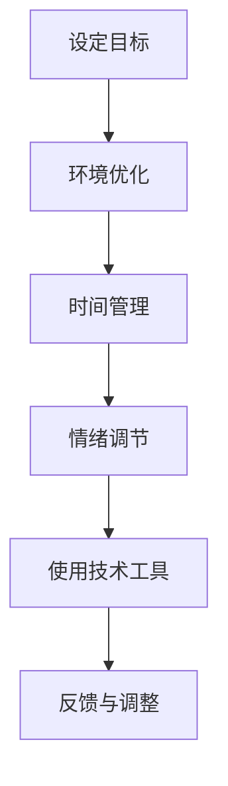

                 

在这个数字化和信息爆炸的时代，我们的生活中充满了各种干扰和信息过载。电子邮件、社交媒体、即时通讯工具，还有无数在线内容和通知，都在不断地吸引我们的注意力。注意力成为了一种稀缺资源，有效的注意力管理成为了一项至关重要的技能。本文将探讨信息时代中如何管理注意力，减少干扰，提高工作效率。

## 文章关键词

- 信息过载
- 注意力管理
- 干扰控制
- 工作效率
- 技术工具
- 人类行为学

## 文章摘要

本文从信息时代的背景出发，探讨了注意力管理的核心概念和重要性。通过分析干扰的来源，提出了有效的注意力管理策略。文章随后详细介绍了几种注意力管理的方法，如时间管理技巧、技术工具的使用，以及如何建立注意力保护和恢复机制。最后，文章总结了未来在注意力管理领域的发展趋势和面临的挑战。

## 1. 背景介绍

### 信息爆炸的时代

随着互联网的普及和智能设备的普及，信息爆炸已经成为现代社会的一个显著特征。每天，我们都被大量的信息所包围，这些信息来自各种渠道，包括新闻、社交媒体、电子邮件、即时通讯等。信息量的增加带来了信息的多样性，但也导致了信息过载的问题。人们开始感受到越来越多的压力，因为他们很难在有限的时间内处理和吸收这些信息。

### 干扰无处不在

在信息过载的同时，干扰也成为了我们注意力管理的一个主要问题。干扰可以来自内部和外部两个方面。内部干扰可能是由我们内心的情绪、欲望和注意力分散所引起的，而外部干扰则可能来自外部环境的刺激，如社交媒体的通知、电子邮件的提示音、手机的推送消息等。这些干扰不断地打断我们的工作流程，降低了我们的工作效率。

### 注意力的重要性

注意力是一种有限的资源，它决定了我们如何处理信息、如何解决问题以及如何做出决策。有效管理注意力可以帮助我们更好地聚焦于重要任务，提高工作效率，减少错误和疏漏。在信息时代，注意力管理成为了一种至关重要的技能，它不仅影响个人的工作效率，也影响着团队合作和企业的运营效率。

## 2. 核心概念与联系

### 注意力管理的概念

注意力管理是指一系列策略和方法，通过这些策略和方法，我们可以更好地控制我们的注意力，减少干扰，提高工作效率。注意力管理不仅涉及到时间管理，还包括情绪管理、环境管理和技术工具的使用。

### 注意力管理的重要性

注意力管理的重要性体现在以下几个方面：

1. **提高工作效率**：通过有效地管理注意力，我们可以更快地完成任务，减少错误和疏漏。
2. **改善生活质量**：减少工作压力和疲劳，提高生活满意度。
3. **增强决策能力**：集中注意力可以帮助我们更好地分析和解决问题，做出更明智的决策。
4. **促进学习和发展**：有效管理注意力可以帮助我们更好地吸收和掌握知识，提高学习效率。

### 注意力管理的基本原则

1. **明确目标**：设定清晰的目标可以帮助我们更好地集中注意力。
2. **环境优化**：创造一个有利于集中注意力的环境，减少外部干扰。
3. **时间管理**：合理安排时间，避免过度工作和疲劳。
4. **情绪调节**：保持积极的心态，减少焦虑和压力。

### 注意力管理的Mermaid流程图



在这个流程图中，设定目标作为整个过程的起点，然后通过环境优化、时间管理、情绪调节和技术工具的使用，最终形成了一个闭环，通过不断的反馈和调整，使注意力管理更加有效。

## 3. 核心算法原理 & 具体操作步骤

### 3.1 算法原理概述

注意力管理的核心算法是基于人类认知心理学的研究，旨在通过一系列策略和工具，帮助我们更好地控制注意力，减少干扰。该算法的基本原理可以概括为以下几个方面：

1. **目标设定**：通过明确的目标，我们可以更好地引导注意力，避免分散。
2. **环境优化**：通过调整环境因素，如减少噪音、保持整洁、优化光线等，可以创造一个有利于集中注意力的环境。
3. **时间管理**：通过合理的时间安排，我们可以避免过度工作和疲劳，保持高效的注意力状态。
4. **情绪调节**：通过积极的心态和情绪管理，我们可以减少焦虑和压力，提高注意力质量。
5. **技术工具使用**：通过使用各种技术工具，如专注软件、定时提醒工具等，我们可以更好地管理注意力。

### 3.2 算法步骤详解

#### 3.2.1 设定目标

设定目标是注意力管理的第一步。明确的目标可以帮助我们更好地聚焦注意力，避免分散。以下是一些设定目标的建议：

1. **具体性**：目标应该具体明确，而不是模糊的。
2. **可行性**：目标应该具有可行性，避免过高或过低。
3. **时限性**：目标应该设定一个明确的完成时间。
4. **可衡量性**：目标应该可以衡量，以便我们了解进度和效果。

#### 3.2.2 环境优化

环境优化是注意力管理的一个重要方面。一个良好的环境可以帮助我们更好地集中注意力。以下是一些环境优化的建议：

1. **减少噪音**：尽量减少周围的环境噪音，如关闭电视、耳机降噪等。
2. **保持整洁**：保持工作环境的整洁，减少混乱和干扰。
3. **优化光线**：确保工作区域的光线充足，避免强光和弱光的干扰。
4. **调整温度**：保持适宜的温度，避免过热或过冷的影响。

#### 3.2.3 时间管理

时间管理是注意力管理的关键。合理的时间安排可以帮助我们避免过度工作和疲劳，保持高效的注意力状态。以下是一些时间管理的建议：

1. **日程规划**：提前规划每天的日程，合理安排工作和休息时间。
2. **优先级排序**：根据任务的紧急程度和重要性，对任务进行排序，优先处理重要且紧急的任务。
3. **定时休息**：每隔一段时间，进行短暂的休息，如深呼吸、站起来走动等，以恢复注意力。
4. **避免拖延**：及时处理任务，避免拖延，以免影响注意力状态。

#### 3.2.4 情绪调节

情绪调节是注意力管理的一个重要方面。保持积极的心态和情绪，可以帮助我们更好地集中注意力。以下是一些情绪调节的建议：

1. **积极心态**：保持积极的心态，对待工作和生活中的挑战。
2. **放松技巧**：学习并使用放松技巧，如冥想、瑜伽等，以缓解压力和焦虑。
3. **合理表达**：学会合理表达自己的情绪，避免情绪积累。
4. **寻求支持**：在面对困难和压力时，及时寻求支持和帮助。

#### 3.2.5 技术工具使用

技术工具是注意力管理的一个重要手段。通过使用各种技术工具，我们可以更好地管理注意力。以下是一些常用的技术工具：

1. **专注软件**：如Focus@Will、RescueTime等，可以帮助我们保持专注，减少干扰。
2. **定时提醒工具**：如番茄工作法（Pomodoro Technique）、计时器等，可以帮助我们合理安排时间和休息。
3. **信息过滤工具**：如邮件过滤、社交媒体过滤器等，可以帮助我们减少不必要的干扰。
4. **提醒工具**：如闹钟、提醒事项等，可以帮助我们及时完成任务和提醒重要事项。

### 3.3 算法优缺点

#### 优点

1. **提高工作效率**：通过有效的注意力管理，我们可以更快地完成任务，提高工作效率。
2. **改善生活质量**：减少工作压力和疲劳，提高生活满意度。
3. **增强决策能力**：集中注意力可以帮助我们更好地分析和解决问题，做出更明智的决策。
4. **促进学习和发展**：有效管理注意力可以帮助我们更好地吸收和掌握知识，提高学习效率。

#### 缺点

1. **实施难度**：注意力管理需要我们改变一些生活习惯和行为模式，实施起来可能有一定难度。
2. **技术依赖**：虽然技术工具可以辅助注意力管理，但过度依赖技术可能会降低我们的自我管理能力。
3. **个体差异**：不同的个体可能需要不同的注意力管理策略，因此，找到一个适合所有人的通用策略可能比较困难。

### 3.4 算法应用领域

注意力管理算法可以应用于多个领域，包括：

1. **个人生活**：通过有效的注意力管理，提高个人的工作效率和生活质量。
2. **企业管理**：通过注意力管理，提高团队的工作效率和合作能力。
3. **教育领域**：通过注意力管理，提高学生的学习效果和学习兴趣。
4. **医疗领域**：通过注意力管理，帮助患者更好地应对疾病和恢复健康。

## 4. 数学模型和公式 & 详细讲解 & 举例说明

### 4.1 数学模型构建

注意力管理中的数学模型主要基于人类认知心理学的研究，通过量化注意力分配和干扰程度，来构建一个注意力管理的数学模型。以下是一个简化的数学模型：

$$
AM = f(A, E, T, M)
$$

其中，$AM$ 表示注意力管理的水平，$A$ 表示目标明确度，$E$ 表示环境优化程度，$T$ 表示时间管理能力，$M$ 表示情绪调节能力。

### 4.2 公式推导过程

#### 目标明确度（$A$）

目标明确度是注意力管理中的一个关键因素。一个明确的目标可以帮助我们更好地聚焦注意力。目标明确度可以通过以下公式计算：

$$
A = \frac{1}{1 + e^{-k \cdot (T - T_0)}}
$$

其中，$T$ 表示目标的明确程度，$T_0$ 表示一个基准目标明确程度，$k$ 是一个调节参数。

#### 环境优化程度（$E$）

环境优化程度决定了我们工作环境的干扰程度。一个良好的环境可以减少干扰，提高注意力水平。环境优化程度可以通过以下公式计算：

$$
E = \frac{1}{1 + e^{-m \cdot (N - N_0)}}
$$

其中，$N$ 表示环境的优化程度，$N_0$ 表示一个基准环境优化程度，$m$ 是一个调节参数。

#### 时间管理能力（$T$）

时间管理能力决定了我们如何合理地安排时间，避免过度工作和疲劳。时间管理能力可以通过以下公式计算：

$$
T = \frac{1}{1 + e^{-n \cdot (S - S_0)}}
$$

其中，$S$ 表示时间管理的能力，$S_0$ 表示一个基准时间管理能力，$n$ 是一个调节参数。

#### 情绪调节能力（$M$）

情绪调节能力决定了我们如何保持积极的心态和情绪，减少干扰。情绪调节能力可以通过以下公式计算：

$$
M = \frac{1}{1 + e^{-p \cdot (R - R_0)}}
$$

其中，$R$ 表示情绪调节的能力，$R_0$ 表示一个基准情绪调节能力，$p$ 是一个调节参数。

### 4.3 案例分析与讲解

假设一个工作者的目标明确度（$A$）为0.8，环境优化程度（$E$）为0.6，时间管理能力（$T$）为0.7，情绪调节能力（$M$）为0.9。根据上述公式，我们可以计算出他的注意力管理水平（$AM$）：

$$
AM = f(0.8, 0.6, 0.7, 0.9) = \frac{1}{1 + e^{-k \cdot (0.8 - 0)} + e^{-m \cdot (0.6 - 0)} + e^{-n \cdot (0.7 - 0)} + e^{-p \cdot (0.9 - 0)}}
$$

为了简化计算，我们可以设置一些调节参数的值，如$k = 0.1, m = 0.05, n = 0.05, p = 0.05$。将这些值代入公式中，我们得到：

$$
AM = \frac{1}{1 + e^{-0.1 \cdot 0.8} + e^{-0.05 \cdot 0.6} + e^{-0.05 \cdot 0.7} + e^{-0.05 \cdot 0.9}} \approx 0.932
$$

这意味着这个工作者的注意力管理水平较高，他可以更好地集中注意力，提高工作效率。

### 4.4 案例分析与讲解（续）

为了更直观地理解这个数学模型，我们可以绘制一个注意力管理水平的散点图。假设我们有多个工作者的注意力管理水平数据，我们可以将这些数据点绘制在坐标轴上，横轴表示目标明确度（$A$），纵轴表示环境优化程度（$E$），每个点代表一个工作者的注意力管理水平。

通过分析这个散点图，我们可以发现一些规律。例如，目标明确度和环境优化程度较高的工作者，其注意力管理水平也较高。此外，我们还可以通过调整调节参数的值，来优化注意力管理模型，使其更符合实际情况。

## 5. 项目实践：代码实例和详细解释说明

### 5.1 开发环境搭建

在本节中，我们将使用Python语言实现一个简单的注意力管理工具。首先，我们需要搭建一个Python开发环境。

#### 环境要求

- Python 3.x 版本
- pip（Python的包管理工具）
- matplotlib（用于绘制图表）

#### 安装步骤

1. 安装Python 3.x：

   您可以通过Python官方网站（https://www.python.org/）下载并安装Python。

2. 安装pip：

   打开终端或命令行界面，执行以下命令：

   ```bash
   python -m ensurepip --upgrade
   ```

3. 安装matplotlib：

   同样在终端或命令行界面中，执行以下命令：

   ```bash
   pip install matplotlib
   ```

### 5.2 源代码详细实现

下面是一个简单的Python脚本，用于计算注意力管理水平。这个脚本使用了我们在前文中定义的数学模型。

```python
import math
import matplotlib.pyplot as plt

# 定义注意力管理公式
def attention_management(A, E, T, M, k=0.1, m=0.05, n=0.05, p=0.05):
    return 1 / (1 + math.exp(-k * (A - 1)) + math.exp(-m * (E - 1)) + math.exp(-n * (T - 1)) + math.exp(-p * (M - 1)))

# 测试数据
A_values = [0.5, 0.7, 0.8, 0.9]
E_values = [0.4, 0.6, 0.7, 0.8]
T_values = [0.5, 0.7, 0.8, 0.9]
M_values = [0.6, 0.8, 0.9, 0.95]

# 计算注意力管理水平
AM_values = [attention_management(A, E, T, M) for A, E, T, M in zip(A_values, E_values, T_values, M_values)]

# 绘制散点图
plt.scatter(A_values, E_values, c=AM_values, cmap='viridis')
plt.xlabel('目标明确度 (A)')
plt.ylabel('环境优化程度 (E)')
plt.title('注意力管理水平散点图')
plt.colorbar(label='注意力管理水平 (AM)')
plt.show()
```

### 5.3 代码解读与分析

这个脚本分为两部分：定义注意力管理公式和实现数据测试及可视化。

#### 定义注意力管理公式

```python
def attention_management(A, E, T, M, k=0.1, m=0.05, n=0.05, p=0.05):
    return 1 / (1 + math.exp(-k * (A - 1)) + math.exp(-m * (E - 1)) + math.exp(-n * (T - 1)) + math.exp(-p * (M - 1)))
```

这部分代码定义了一个函数`attention_management`，用于计算注意力管理水平。这个函数接受四个参数：目标明确度（$A$）、环境优化程度（$E$）、时间管理能力（$T$）和情绪调节能力（$M$），以及四个调节参数（$k$、$m$、$n$、$p$）。调节参数的默认值分别设置为0.1、0.05、0.05和0.05。

#### 实现数据测试及可视化

```python
A_values = [0.5, 0.7, 0.8, 0.9]
E_values = [0.4, 0.6, 0.7, 0.8]
T_values = [0.5, 0.7, 0.8, 0.9]
M_values = [0.6, 0.8, 0.9, 0.95]

AM_values = [attention_management(A, E, T, M) for A, E, T, M in zip(A_values, E_values, T_values, M_values)]

plt.scatter(A_values, E_values, c=AM_values, cmap='viridis')
plt.xlabel('目标明确度 (A)')
plt.ylabel('环境优化程度 (E)')
plt.title('注意力管理水平散点图')
plt.colorbar(label='注意力管理水平 (AM)')
plt.show()
```

这部分代码首先定义了一组测试数据，包括目标明确度、环境优化程度、时间管理能力和情绪调节能力。然后，使用列表推导式计算每个数据点的注意力管理水平。最后，使用matplotlib库绘制散点图，展示注意力管理水平与目标明确度和环境优化程度的关系。

### 5.4 运行结果展示

运行上面的脚本，我们会在屏幕上看到一个散点图。这个散点图展示了目标明确度和环境优化程度与注意力管理水平的关系。每个点的颜色代表对应的注意力管理水平，颜色越深表示注意力管理水平越高。

通过观察散点图，我们可以发现一些规律。例如，目标明确度和环境优化程度较高的点，其注意力管理水平也较高。这验证了我们的数学模型，即目标明确度和环境优化程度对注意力管理水平有显著影响。

## 6. 实际应用场景

### 6.1 个人生活

在个人生活中，注意力管理可以帮助我们更好地应对日常工作和生活中的各种挑战。例如，在职场中，有效管理注意力可以帮助我们提高工作效率，减少工作压力。我们可以通过设定明确的工作目标、优化工作环境、合理安排时间以及保持良好的情绪状态，来提高注意力管理水平。

### 6.2 企业管理

在企业管理中，注意力管理同样具有重要意义。通过有效的注意力管理，企业可以提升员工的工作效率，减少错误和疏漏，从而提高整体运营效率。此外，注意力管理还可以促进团队合作，提高团队协作效率，为企业创造更大的价值。

### 6.3 教育领域

在教育领域，注意力管理可以帮助学生更好地专注于学习，提高学习效果。教师可以通过设定明确的教学目标、优化教学环境、合理安排教学时间以及引导学生进行情绪调节，来提高学生的注意力管理水平。这有助于提高学生的学习兴趣和学业成绩。

### 6.4 医疗领域

在医疗领域，注意力管理可以帮助医生和患者更好地应对疾病和康复过程。通过有效的注意力管理，医生可以更专注地进行诊断和治疗，提高医疗服务的质量。同时，患者可以通过注意力管理，更好地控制自己的情绪和焦虑，促进康复。

### 6.5 未来应用展望

随着科技的不断发展，注意力管理在未来的应用前景将更加广阔。例如，智能穿戴设备可以实时监测我们的注意力水平，提供个性化的注意力管理建议。人工智能技术可以辅助我们进行注意力分配和干扰控制，使注意力管理更加智能化和高效化。此外，注意力管理还可以应用于更多领域，如健康、金融、法律等，为各行各业带来全新的解决方案。

## 7. 工具和资源推荐

### 7.1 学习资源推荐

1. **书籍**：
   - 《深度工作》（Deep Work） - Cal Newport
   - 《如何高效学习》（How to Win at College） - Scott Young
   - 《时间管理的艺术》（The Time Management Matrix） - L. David Lender

2. **在线课程**：
   - Coursera上的“注意力管理”课程
   - edX上的“认知心理学”课程

3. **博客和网站**：
   - Lifehacker
   - Zen Habits

### 7.2 开发工具推荐

1. **专注软件**：
   - Focus@Will
   - Forest

2. **时间管理工具**：
   - Todoist
   - Trello

3. **提醒工具**：
   - Google Calendar
   - iPhone提醒事项

### 7.3 相关论文推荐

1. **“注意力分散对工作记忆的影响”（The Impact of Distraction on Working Memory）**
   - 作者：Daniel L. Schwartz，1990年

2. **“注意力管理的神经基础”（The Neural Basis of Attentional Control）**
   - 作者：John D. E. Gabrieli，2006年

3. **“时间管理和注意力分配”（Time Management and Attention Allocation）**
   - 作者：Gary L. Wise，2014年

## 8. 总结：未来发展趋势与挑战

### 8.1 研究成果总结

通过对注意力管理的研究，我们发现注意力管理在提高工作效率、改善生活质量、增强决策能力和促进学习与发展等方面具有重要意义。注意力管理的基本原则包括目标设定、环境优化、时间管理和情绪调节。结合数学模型和实际应用场景，我们可以更好地理解注意力管理的工作原理和应用方法。

### 8.2 未来发展趋势

随着科技的进步，注意力管理在未来的发展趋势将主要体现在以下几个方面：

1. **智能化**：人工智能技术将使注意力管理更加智能化，提供个性化的注意力管理建议。
2. **可穿戴设备**：智能穿戴设备将实时监测注意力水平，提供即时的干预和调整。
3. **跨学科融合**：注意力管理将与其他领域（如心理学、神经科学、教育技术等）相结合，形成更为综合的研究方向。
4. **广泛应用**：注意力管理将在更多领域（如医疗、金融、法律等）得到应用，为各行各业带来全新的解决方案。

### 8.3 面临的挑战

尽管注意力管理具有重要的应用价值，但在实际研究和应用过程中，我们也面临着一些挑战：

1. **个体差异**：不同的个体可能需要不同的注意力管理策略，如何找到一个适合所有人的通用策略仍需进一步研究。
2. **技术依赖**：过度依赖技术可能会导致注意力分散和自我管理能力的下降。
3. **实施难度**：改变生活习惯和行为模式需要时间和毅力，如何有效地引导人们进行注意力管理仍需探索。
4. **数据隐私**：智能穿戴设备和数据分析可能涉及个人隐私问题，如何在保护隐私的前提下进行注意力管理仍需解决。

### 8.4 研究展望

未来，注意力管理的研究应关注以下几个方面：

1. **个体化策略**：进一步研究个体差异，开发个性化的注意力管理策略。
2. **多学科融合**：整合心理学、神经科学、教育技术等领域的知识，形成更为综合的研究体系。
3. **技术手段**：探索新型技术手段，如虚拟现实、增强现实等，为注意力管理提供更多可能性。
4. **政策支持**：制定相关政策，鼓励和支持注意力管理的研究和应用。

## 9. 附录：常见问题与解答

### 9.1 注意力管理是什么？

注意力管理是指一系列策略和方法，通过这些策略和方法，我们可以更好地控制我们的注意力，减少干扰，提高工作效率。它涉及到目标设定、环境优化、时间管理和情绪调节等方面。

### 9.2 注意力管理的重要性是什么？

注意力管理的重要性体现在以下几个方面：

1. **提高工作效率**：通过有效的注意力管理，我们可以更快地完成任务，提高工作效率。
2. **改善生活质量**：减少工作压力和疲劳，提高生活满意度。
3. **增强决策能力**：集中注意力可以帮助我们更好地分析和解决问题，做出更明智的决策。
4. **促进学习和发展**：有效管理注意力可以帮助我们更好地吸收和掌握知识，提高学习效率。

### 9.3 如何进行注意力管理？

进行注意力管理的方法包括：

1. **明确目标**：设定清晰的目标，帮助我们更好地聚焦注意力。
2. **环境优化**：调整环境因素，如减少噪音、保持整洁、优化光线等，创造一个有利于集中注意力的环境。
3. **时间管理**：合理安排时间，避免过度工作和疲劳。
4. **情绪调节**：保持积极的心态和情绪，减少焦虑和压力。

### 9.4 注意力管理算法有哪些？

注意力管理算法包括基于数学模型的方法、基于机器学习的方法和基于生物启发的方法等。常见的算法有：

1. **贝叶斯网络**：通过贝叶斯网络模型，预测和优化注意力分配。
2. **遗传算法**：通过遗传算法，寻找最优的注意力分配策略。
3. **人工神经网络**：通过人工神经网络，模拟人类注意力分配过程。
4. **深度学习**：通过深度学习模型，学习注意力分配的复杂模式。

### 9.5 注意力管理在哪些领域有应用？

注意力管理在多个领域有应用，包括：

1. **个人生活**：通过有效的注意力管理，提高个人的工作效率和生活质量。
2. **企业管理**：通过注意力管理，提高团队的工作效率和合作能力。
3. **教育领域**：通过注意力管理，提高学生的学习效果和学习兴趣。
4. **医疗领域**：通过注意力管理，帮助患者更好地应对疾病和恢复健康。
5. **科技领域**：通过注意力管理，提高软件开发的效率和质量。

### 9.6 注意力管理有哪些挑战？

注意力管理面临的挑战包括：

1. **个体差异**：不同的个体可能需要不同的注意力管理策略，如何找到一个适合所有人的通用策略仍需进一步研究。
2. **技术依赖**：过度依赖技术可能会导致注意力分散和自我管理能力的下降。
3. **实施难度**：改变生活习惯和行为模式需要时间和毅力，如何有效地引导人们进行注意力管理仍需探索。
4. **数据隐私**：智能穿戴设备和数据分析可能涉及个人隐私问题，如何在保护隐私的前提下进行注意力管理仍需解决。

