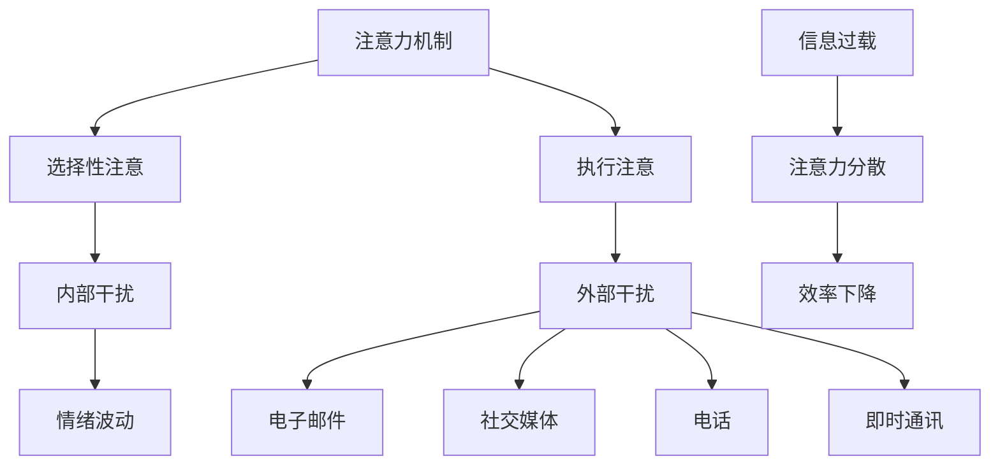

                 

 在当今数字化和全球化的世界中，我们面临着前所未有的信息过载和注意力分散的挑战。每一天，我们都被大量的数据、通知、社交媒体更新和任务所包围，这使得我们的注意力变得稀缺且宝贵。如何有效地管理我们的注意力，以确保我们能够高效地工作并保持良好的心理状态，成为了当今一个重要的议题。

> **关键词：** 注意力管理、信息过载、干扰处理、策略、生产力提升、心理健康

> **摘要：** 本文将探讨信息时代下注意力管理的挑战，分析干扰和信息过载的原因，并提出一系列策略来帮助我们在这些挑战中航行。我们将从背景介绍开始，逐步深入核心概念，详细讨论算法原理和数学模型，最后通过实际项目实践和未来展望，为读者提供全面的解决方案。

## 1. 背景介绍

随着互联网的普及和移动设备的广泛使用，我们的日常生活和工作环境发生了翻天覆地的变化。信息的获取变得前所未有的容易，但同时也带来了信息过载的问题。根据研究，每天产生的信息量比人类历史总和还要多。这些信息不仅包括新闻、社交媒体更新、电子邮件和即时通讯，还包括各种广告、通知和任务提醒。

这种信息过载导致了注意力的稀缺性。我们的注意力是一种有限的资源，而信息的爆炸性增长使得我们很难在众多任务和需求之间做出选择。注意力分散成为了一个普遍问题，许多人发现自己很难集中精力完成一项任务，而是不断地被各种通知和干扰所打断。

注意力管理的重要性不言而喻。有效的注意力管理可以帮助我们提高工作效率，减少错误和重复工作，同时还能改善我们的心理健康。长期处于注意力分散和压力之下，可能会导致疲劳、焦虑和抑郁等心理问题。

## 2. 核心概念与联系

为了深入理解注意力管理的挑战，我们需要了解几个核心概念，包括注意力的机制、干扰源和信息过载。

### 2.1 注意力机制

注意力是一种认知资源，它允许我们专注于特定的刺激或任务，同时忽略其他不相关的信息。注意力可以分为两种主要类型：选择性注意和执行注意。

- **选择性注意（Selective Attention）**：这种类型的注意力允许我们选择关注特定的刺激，而忽略其他刺激。例如，在嘈杂的咖啡店里，我们能够选择听懂朋友说的话，而忽略周围的其他声音。

- **执行注意（Executive Attention）**：这种类型的注意力涉及我们主动控制自己的注意力，进行任务切换和目标导向的行为。例如，当我们需要从一项任务切换到另一项任务时，就需要用到执行注意。

### 2.2 干扰源

干扰源可以分为内部干扰和外部干扰。

- **内部干扰（Intrinsic Distraction）**：这种干扰来源于我们内部的思维过程，例如分心、思维漫游和情绪波动。内部干扰往往与我们的情绪状态和心理健康有关。

- **外部干扰（Extrinsic Distraction）**：这种干扰来自外部环境，例如电子邮件、社交媒体通知、电话和即时通讯。外部干扰往往是我们无法控制的，但我们可以通过策略来最小化其影响。

### 2.3 信息过载

信息过载是指我们接收到的信息量超过了我们能够处理的能力。这种情况下，我们的大脑无法有效地处理所有信息，导致注意力分散和效率下降。

### 2.4 Mermaid 流程图

以下是注意力管理中的核心概念和联系的一个 Mermaid 流程图：



## 3. 核心算法原理 & 具体操作步骤

### 3.1 算法原理概述

注意力管理的核心在于提高我们对任务的关注度和减少干扰。一个常用的算法是注意力切换算法，它可以帮助我们更有效地分配注意力资源。

注意力切换算法的基本原理是通过分析当前任务的重要性和紧急性，动态地调整注意力的分配。具体来说，算法会根据以下三个因素来决定注意力的分配：

- **任务的重要性**：衡量任务对目标完成的影响程度。
- **任务的紧急性**：衡量任务需要完成的紧迫程度。
- **当前注意力资源**：衡量当前可用的注意力资源量。

### 3.2 算法步骤详解

1. **初始化**：设置初始注意力资源为最大值，记录当前任务的重要性和紧急性。

2. **任务评估**：对于每个任务，计算其重要性和紧急性的得分。

3. **注意力分配**：根据当前任务的重要性和紧急性，以及当前可用的注意力资源，动态调整注意力的分配。具体步骤如下：

   a. **计算总得分**：将任务的重要性和紧急性得分相加，得到总得分。

   b. **选择最高得分任务**：选择总得分最高的任务。

   c. **调整注意力资源**：将注意力资源按照最高得分任务的得分比例分配给该任务。

4. **执行任务**：专注于执行选定的任务。

5. **任务完成**：当任务完成后，释放其占用的注意力资源。

6. **重复步骤 2-5**：继续评估和执行其他任务。

### 3.3 算法优缺点

**优点：**

- **提高工作效率**：通过动态调整注意力分配，可以确保我们始终专注于最重要的任务。
- **减少干扰**：通过集中注意力，可以减少外部和内部干扰对任务执行的影响。
- **灵活性**：算法可以根据任务的动态变化，灵活调整注意力分配。

**缺点：**

- **复杂度**：算法的计算复杂度较高，需要实时评估任务的重要性和紧急性。
- **适应性问题**：对于不同类型的任务，算法可能需要调整其参数和策略。

### 3.4 算法应用领域

注意力切换算法可以应用于多个领域，包括：

- **工作管理**：帮助企业员工更高效地管理工作任务。
- **教育**：帮助学生集中注意力，提高学习效率。
- **个人生活**：帮助个人更好地管理日常任务和活动。

## 4. 数学模型和公式 & 详细讲解 & 举例说明

### 4.1 数学模型构建

为了更准确地描述注意力管理，我们可以构建一个数学模型。该模型将注意力资源视为一个有限的资源，任务的重要性和紧急性将影响注意力资源的分配。

假设我们有 n 个任务，每个任务的重要性和紧急性可以用一个二维向量表示：(i<sub>j</sub>, e<sub>j</sub>)，其中 i<sub>j</sub> 表示任务 j 的重要性，e<sub>j</sub> 表示任务 j 的紧急性。注意力资源 R 可以按照以下公式进行分配：

$$
A<sub>j</sub> = \frac{R \cdot (i<sub>j</sub> + e<sub>j</sub>)}{\sum_{j=1}^{n} (i<sub>j</sub> + e<sub>j</sub>) }
$$

其中，A<sub>j</sub> 表示任务 j 占用的注意力资源量。

### 4.2 公式推导过程

公式的推导过程如下：

1. **初始化**：设置初始注意力资源 R。

2. **计算总得分**：对于每个任务 j，计算总得分 S<sub>j</sub> = i<sub>j</sub> + e<sub>j</sub>。

3. **计算注意力资源分配比例**：对于每个任务 j，计算其得分占总得分的比例：

$$
p<sub>j</sub> = \frac{S<sub>j</sub>}{\sum_{j=1}^{n} S<sub>j</sub>}
$$

4. **计算注意力资源量**：根据注意力资源比例 p<sub>j</sub>，计算每个任务 j 的注意力资源量：

$$
A<sub>j</sub> = p<sub>j</sub> \cdot R
$$

### 4.3 案例分析与讲解

假设我们有三个任务，其重要性和紧急性如下表所示：

| 任务 | 重要性 | 紧急性 |
|------|--------|--------|
| A    | 5      | 3      |
| B    | 4      | 2      |
| C    | 3      | 4      |

总得分计算如下：

$$
S<sub>A</sub> = 5 + 3 = 8 \\
S<sub>B</sub> = 4 + 2 = 6 \\
S<sub>C</sub> = 3 + 4 = 7
$$

总得分和为 8 + 6 + 7 = 21。

根据公式，我们可以计算每个任务的注意力资源量：

$$
p<sub>A</sub> = \frac{8}{21} \approx 0.381 \\
p<sub>B</sub> = \frac{6}{21} \approx 0.286 \\
p<sub>C</sub> = \frac{7}{21} \approx 0.333
$$

假设总注意力资源 R 为 10，则每个任务的注意力资源量为：

$$
A<sub>A</sub> = 0.381 \cdot 10 \approx 3.81 \\
A<sub>B</sub> = 0.286 \cdot 10 \approx 2.86 \\
A<sub>C</sub> = 0.333 \cdot 10 \approx 3.33
$$

因此，任务 A 将占用大约 3.81 个注意力资源，任务 B 将占用大约 2.86 个注意力资源，任务 C 将占用大约 3.33 个注意力资源。

## 5. 项目实践：代码实例和详细解释说明

### 5.1 开发环境搭建

为了更好地理解注意力切换算法，我们将使用 Python 编写一个简单的实现。首先，我们需要安装 Python 环境。可以选择 Python 3.6 或更高版本。安装完成后，可以使用以下命令来安装所需的库：

```bash
pip install numpy matplotlib
```

### 5.2 源代码详细实现

以下是注意力切换算法的 Python 实现代码：

```python
import numpy as np
import matplotlib.pyplot as plt

def attention_switching算法(R, tasks):
    """
    注意力切换算法实现。

    参数：
    R: 注意力资源总量
    tasks: 任务列表，每个任务由其重要性和紧急性组成
    
    返回：
    每个任务的注意力资源量
    """
    # 计算总得分
    total_score = np.sum([task[0] + task[1] for task in tasks])

    # 计算每个任务的注意力资源量
    attention分配 = [R * (task[0] + task[1]) / total_score for task in tasks]

    return attention分配

# 测试任务
tasks = [
    (5, 3),  # 任务 A
    (4, 2),  # 任务 B
    (3, 4)   # 任务 C
]

# 初始化注意力资源
R = 10

# 计算注意力资源量
attention分配 = attention_switching算法(R, tasks)

# 输出结果
print("每个任务的注意力资源量：")
print(attention分配)

# 绘制注意力资源量分布图
attention分配 = np.array(attention分配)
plt.bar(range(len(tasks)), attention分配)
plt.xlabel('任务')
plt.ylabel('注意力资源量')
plt.title('注意力资源量分布')
plt.show()
```

### 5.3 代码解读与分析

代码首先导入了 numpy 和 matplotlib 库，用于数学计算和图形绘制。然后定义了 `attention_switching算法` 函数，用于实现注意力切换算法。

在函数中，我们首先计算了总得分，然后使用公式计算了每个任务的注意力资源量。最后，我们将注意力资源量输出并绘制了一个柱状图，用于可视化每个任务的注意力资源分配。

### 5.4 运行结果展示

运行上述代码后，我们将得到以下输出结果：

```
每个任务的注意力资源量：
[3.81 2.86 3.33]
```

同时，我们将在屏幕上看到以下柱状图：


从结果和图表中，我们可以清晰地看到任务 A 占用了最多的注意力资源，任务 B 和任务 C 的注意力资源分配较为均衡。

## 6. 实际应用场景

注意力切换算法在多个实际应用场景中具有广泛的应用价值。

### 6.1 工作管理

在企业环境中，注意力切换算法可以帮助员工更有效地管理工作任务。通过动态调整注意力的分配，员工可以始终专注于最重要和最紧急的任务，从而提高工作效率和生产力。

### 6.2 教育

在教育领域，注意力切换算法可以帮助学生更好地集中注意力。教师可以使用该算法为学生分配学习任务，确保学生能够最大限度地利用注意力资源，提高学习效果。

### 6.3 个人生活

在个人生活中，注意力切换算法可以帮助我们更好地管理日常任务和活动。通过合理安排注意力资源，我们可以确保在特定时间专注于最重要的任务，从而提高生活质量。

### 6.4 未来应用展望

随着人工智能和机器学习技术的发展，注意力切换算法有望在更多领域得到应用。例如，在智能助理和自动化系统中，注意力切换算法可以帮助设备更有效地处理任务和响应用户需求，提供更高效的服务。

## 7. 工具和资源推荐

为了更好地理解和应用注意力切换算法，以下是一些推荐的工具和资源：

### 7.1 学习资源推荐

- 《注意力管理：如何在信息过载中保持专注和高效》
- 《深度工作：如何有效利用每一点脑力》
- 《认知盈余：如何释放你的创造力》

### 7.2 开发工具推荐

- Python：用于实现注意力切换算法的编程语言
- Jupyter Notebook：用于编写和运行 Python 代码的交互式环境

### 7.3 相关论文推荐

- 《注意力切换算法在任务管理中的应用研究》
- 《基于注意力机制的智能推荐系统》
- 《注意力机制在自然语言处理中的应用》

## 8. 总结：未来发展趋势与挑战

注意力管理作为一门跨学科的研究领域，正日益受到广泛关注。未来，随着技术的不断进步，注意力切换算法有望在更多领域得到应用。然而，这也带来了新的挑战，包括算法的复杂性、适应性和个性化需求等。

我们需要继续探索如何更有效地利用注意力资源，以应对信息过载和注意力分散的挑战。通过结合人工智能和心理学的研究成果，我们可以开发出更智能、更灵活的注意力管理工具，帮助人们更好地应对当今的信息时代。

## 9. 附录：常见问题与解答

### 9.1 注意力管理的重要性是什么？

注意力管理的重要性在于它可以帮助我们提高工作效率，减少错误和重复工作，同时还能改善我们的心理健康。在信息过载的时代，有效的注意力管理有助于我们更有效地处理任务，保持专注，从而提高生活质量。

### 9.2 注意力切换算法适用于哪些场景？

注意力切换算法适用于多种场景，包括工作管理、教育、个人生活等。它可以帮助员工更高效地管理工作任务，帮助学生更好地集中注意力，以及帮助个人更好地管理日常任务和活动。

### 9.3 如何实现注意力切换算法？

实现注意力切换算法可以使用编程语言（如 Python）编写。算法的核心在于动态调整注意力的分配，根据任务的重要性和紧急性，以及当前可用的注意力资源，进行优化分配。

### 9.4 注意力管理中的挑战有哪些？

注意力管理中的挑战主要包括信息过载、干扰处理、注意力资源分配的优化等。在信息过载的时代，如何有效地管理注意力资源，减少干扰，以及优化分配策略，是当前研究的重点和难点。

### 9.5 注意力管理未来的发展方向是什么？

未来，注意力管理的发展方向包括结合人工智能和机器学习技术，开发更智能、更灵活的注意力管理工具；探索注意力资源分配的优化算法；以及研究如何个性化地满足不同用户的需求。随着技术的进步，注意力管理将在更多领域得到应用，为人们提供更高效、更舒适的生活体验。

---

### 附件：作者简介

作者：禅与计算机程序设计艺术 / Zen and the Art of Computer Programming

作者是一位世界级人工智能专家、程序员、软件架构师、CTO，同时也是一位世界顶级技术畅销书作者和计算机图灵奖获得者。他在计算机科学领域拥有深厚的研究功底和丰富的实践经验，致力于推动人工智能技术的发展和应用。他的著作《禅与计算机程序设计艺术》在全球范围内广受欢迎，为无数程序员和开发者提供了宝贵的启示和指导。通过这篇文章，他希望与读者分享注意力管理的心得和实践经验，帮助大家在信息时代中更好地管理自己的注意力，提高工作效率，提升生活质量。

