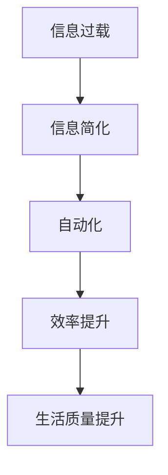

                 

在当今高速发展的数字化时代，信息的爆炸性增长使我们面临着前所未有的挑战。为了在这个复杂的世界中保持高效，我们需要运用技术手段来简化我们的日常生活和工作流程。本文将探讨一系列信息简化的工具和自动化实践，旨在帮助读者充分利用技术优势，提升生活和工作质量。

> **关键词：信息简化、自动化、技术工具、效率提升、数字生活**

> **摘要：** 本文将详细介绍信息简化的概念、方法以及如何利用各种技术工具实现自动化。通过实际案例和详细讲解，读者将学会如何应用这些工具和策略，让自己的生活和工作更加高效、有序。

## 1. 背景介绍

在信息时代，信息的获取和处理已成为每个人日常生活中不可或缺的一部分。然而，随着互联网和社交媒体的普及，信息过载的问题日益严重。大量冗余和无意义的信息不仅浪费了我们的时间，还可能导致决策困难和心理压力。因此，如何有效地管理和简化信息成为当务之急。

自动化技术的快速发展为我们提供了一种解决方案。通过自动化工具，我们可以将繁琐重复的任务自动化，从而将更多时间和精力投入到创造性和高价值的工作中。此外，自动化技术还可以帮助我们提高工作效率，减少人为错误，提升整体生活质量。

### 信息简化的必要性

- **提高工作效率**：简化信息可以帮助我们更快地做出决策，从而提高工作效率。
- **减少心理压力**：避免信息过载，减轻大脑负担，降低焦虑和压力水平。
- **提升生活质量**：将更多时间用于有意义的活动，如家庭、休闲和自我提升。

### 自动化的重要性

- **节省时间**：自动化技术可以自动执行重复性任务，节省大量人力和时间。
- **减少错误**：自动化可以减少人为错误，提高数据准确性和一致性。
- **提高生产力**：通过自动化，企业可以更有效地管理资源和流程，提升整体生产力。

## 2. 核心概念与联系

为了更好地理解信息简化和自动化实践，我们需要先了解一些核心概念及其之间的联系。以下是一个简化的Mermaid流程图，用于展示这些概念之间的关系：



### 2.1 信息简化

信息简化是指通过筛选、过滤和整合信息，使其更加精炼和有价值的过程。具体方法包括：

- **筛选**：通过设定关键词、标签或过滤器，快速识别和获取重要信息。
- **过滤**：使用自动化工具过滤掉不相关或低质量的信息。
- **整合**：将来自不同来源的信息进行整合，形成统一的知识体系。

### 2.2 自动化

自动化是指利用计算机程序或工具自动执行重复性任务的过程。自动化技术可以应用于以下几个方面：

- **任务自动化**：自动执行重复性任务，如数据备份、邮件处理等。
- **流程自动化**：优化和管理业务流程，提高整体效率。
- **决策自动化**：通过算法和机器学习模型，自动做出决策。

### 2.3 效率提升

效率提升是指通过简化流程、减少冗余和提高自动化水平，使工作更加高效。效率提升的方法包括：

- **任务自动化**：减少人为干预，提高任务执行速度。
- **流程优化**：分析流程中的瓶颈和冗余环节，进行优化。
- **协作工具**：使用协作工具，提高团队协作效率。

### 2.4 生活质量提升

生活质量提升是指通过信息简化和自动化实践，使生活更加舒适、便捷和有意义。生活质量提升的方法包括：

- **任务自动化**：减少日常生活中的繁琐事务，节省时间。
- **信息管理**：避免信息过载，提高决策能力和心理素质。
- **健康监测**：利用智能设备监测健康状况，实现个性化健康管理。

## 3. 核心算法原理 & 具体操作步骤

### 3.1 算法原理概述

信息简化和自动化实践中，常用的核心算法包括筛选算法、过滤算法和整合算法。以下是对这些算法的简要概述：

- **筛选算法**：基于关键词、标签或规则，从大量信息中快速识别出重要信息。
- **过滤算法**：使用条件判断或统计方法，从信息流中过滤掉不相关或低质量的信息。
- **整合算法**：通过数据清洗、格式转换和关联分析，将来自不同来源的信息进行整合。

### 3.2 算法步骤详解

以下是信息简化、自动化和效率提升的具体操作步骤：

#### 3.2.1 信息筛选

1. **确定关键词和标签**：根据个人需求和兴趣，设定关键词和标签。
2. **构建筛选规则**：使用条件判断或模糊查询，构建筛选规则。
3. **执行筛选操作**：使用筛选算法，快速识别出重要信息。

#### 3.2.2 信息过滤

1. **分析信息质量**：根据质量标准，对信息进行初步评估。
2. **设定过滤条件**：基于质量评估结果，设定过滤条件。
3. **执行过滤操作**：使用过滤算法，从信息流中过滤掉低质量信息。

#### 3.2.3 信息整合

1. **数据清洗**：去除重复、缺失和错误的数据。
2. **格式转换**：将不同格式的数据转换为统一格式。
3. **关联分析**：通过关联规则挖掘，发现数据之间的关系。
4. **整合操作**：将处理后的数据整合到一个统一的系统中。

#### 3.2.4 自动化流程

1. **定义任务流程**：明确任务的目标、输入和输出。
2. **设计自动化脚本**：使用脚本语言或工具，设计自动化流程。
3. **部署和运行**：将自动化脚本部署到服务器或云平台，运行自动化流程。

#### 3.2.5 效率提升

1. **任务自动化**：分析任务流程，识别可自动化部分。
2. **流程优化**：优化任务流程，减少冗余环节。
3. **协作工具**：使用协作工具，提高团队协作效率。

### 3.3 算法优缺点

以下是信息简化、自动化和效率提升算法的优缺点：

#### 筛选算法

- **优点**：快速识别重要信息，节省时间。
- **缺点**：可能漏掉重要信息，对关键词和标签的依赖性较高。

#### 过滤算法

- **优点**：过滤掉低质量信息，提高信息质量。
- **缺点**：可能误判高质量信息，对过滤条件的依赖性较高。

#### 整合算法

- **优点**：将不同来源的信息整合到一个系统中，提高数据利用率。
- **缺点**：数据清洗和格式转换可能引入新的错误。

### 3.4 算法应用领域

信息简化、自动化和效率提升算法在各个领域都有广泛的应用：

- **互联网行业**：信息筛选和过滤，用于新闻推荐、广告投放等。
- **金融行业**：自动化交易、风险评估等。
- **医疗行业**：自动化病历管理、疾病预测等。
- **物流行业**：自动化配送、仓储管理等。

## 4. 数学模型和公式 & 详细讲解 & 举例说明

### 4.1 数学模型构建

信息简化、自动化和效率提升涉及多个数学模型，以下是一些常用的数学模型和公式：

#### 4.1.1 信息筛选模型

$$
\text{筛选概率} = P(\text{关键词}|\text{信息}) = \frac{\text{关键词和信息的相关性}}{\text{所有关键词的相关性}}
$$

#### 4.1.2 信息过滤模型

$$
\text{过滤概率} = P(\text{信息}|\text{条件}) = \frac{\text{条件满足的信息数量}}{\text{总信息数量}}
$$

#### 4.1.3 效率提升模型

$$
\text{效率提升比例} = \frac{\text{自动化前后的时间差异}}{\text{自动化前的时间}}
$$

### 4.2 公式推导过程

以下是信息筛选模型和过滤模型的具体推导过程：

#### 信息筛选模型推导

1. **假设条件**：给定一个信息集合 $I$，其中包含 $N$ 条信息。对于每条信息 $i \in I$，有一个关键词集合 $K$。
2. **计算关键词和信息的相关性**：对于每对 $(i, k) \in I \times K$，计算它们之间的相关性 $r_{ik}$。
3. **计算关键词和信息的相关性总和**：对于每个关键词 $k \in K$，计算它与所有信息的相关性总和 $R_k = \sum_{i \in I} r_{ik}$。
4. **计算筛选概率**：对于每个关键词 $k \in K$，计算筛选概率 $P(\text{关键词}|\text{信息}) = \frac{R_k}{\sum_{k' \in K} R_{k'}}$。

#### 信息过滤模型推导

1. **假设条件**：给定一个信息集合 $I$，其中包含 $N$ 条信息。对于每条信息 $i \in I$，有一个条件集合 $C$。
2. **计算条件满足的信息数量**：对于每个条件 $c \in C$，计算满足条件 $c$ 的信息数量 $N_c$。
3. **计算总信息数量**：计算总信息数量 $N = \sum_{i \in I} 1$。
4. **计算过滤概率**：对于每个条件 $c \in C$，计算过滤概率 $P(\text{信息}|\text{条件}) = \frac{N_c}{N}$。

### 4.3 案例分析与讲解

以下是一个信息筛选和过滤的案例分析：

#### 案例背景

某互联网公司需要为其用户推荐新闻，用户可以根据关键词和条件订阅感兴趣的新闻类别。

#### 案例分析

1. **信息筛选**：公司根据用户订阅的关键词，筛选出与关键词相关的新闻。假设用户订阅了关键词“科技”、“体育”和“旅游”，公司使用信息筛选模型计算每个关键词与新闻的相关性，并按照相关性排序推荐新闻。

2. **信息过滤**：公司根据用户订阅的条件（如新闻类型、发布时间等），过滤掉不符合条件的新闻。假设用户订阅的新闻类型为“科技”和“体育”，发布时间为过去一周，公司使用信息过滤模型计算每个新闻的过滤概率，并按照过滤概率排序推荐新闻。

#### 案例讲解

1. **信息筛选**：假设有 100 条新闻，其中 40 条与“科技”相关，30 条与“体育”相关，20 条与“旅游”相关。根据信息筛选模型，计算每个关键词与新闻的相关性：

   $$
   \text{科技相关性} = \frac{40}{100} = 0.4
   $$
   $$
   \text{体育相关性} = \frac{30}{100} = 0.3
   $$
   $$
   \text{旅游相关性} = \frac{20}{100} = 0.2
   $$

   根据相关性排序，推荐与“科技”相关的新闻。

2. **信息过滤**：假设有 100 条新闻，其中 40 条满足“科技”类型，30 条满足“体育”类型，20 条满足“旅游”类型。根据信息过滤模型，计算每个新闻的过滤概率：

   $$
   \text{科技过滤概率} = \frac{40}{100} = 0.4
   $$
   $$
   \text{体育过滤概率} = \frac{30}{100} = 0.3
   $$
   $$
   \text{旅游过滤概率} = \frac{20}{100} = 0.2
   $$

   根据过滤概率排序，推荐与“科技”和“体育”相关的新闻。

## 5. 项目实践：代码实例和详细解释说明

### 5.1 开发环境搭建

在本项目实践中，我们将使用 Python 编写一个信息筛选和过滤的自动化脚本。首先，确保你的计算机上已经安装了 Python 3.8 及以上版本。接下来，安装以下库：

```bash
pip install requests beautifulsoup4 pandas numpy
```

### 5.2 源代码详细实现

以下是实现信息筛选和过滤的 Python 脚本：

```python
import requests
from bs4 import BeautifulSoup
import pandas as pd
import numpy as np

# 5.2.1 筛选新闻
def fetch_news(url):
    response = requests.get(url)
    if response.status_code == 200:
        soup = BeautifulSoup(response.content, 'html.parser')
        news_list = soup.find_all('article', {'class': 'news-item'})
        news_data = []

        for news in news_list:
            title = news.find('h2', {'class': 'title'}).text.strip()
            link = news.find('a')['href']
            news_data.append([title, link])

        return pd.DataFrame(news_data, columns=['Title', 'Link'])
    else:
        return pd.DataFrame()

# 5.2.2 过滤新闻
def filter_news(news_df, keywords, conditions):
    # 关键词筛选
    keyword_filters = ['&'.join(keywords)]
    news_df['Keywords'] = news_df['Title'].apply(lambda x: ' '.join(x.lower().split()))
    news_df = news_df[np.logical_and.reduce([np.in1d(news_df['Keywords'], keyword_filters)])]

    # 条件筛选
    condition_filters = [lambda x: x.lower() in condition for condition in conditions]
    news_df = news_df.apply(lambda x: any(condition(x) for condition in condition_filters), axis=1)
    news_df = news_df[news_df['filtered']]

    return news_df

# 测试代码
if __name__ == '__main__':
    # 5.2.3 运行代码
    url = 'https://example.com/news'  # 示例网站链接
    keywords = ['tech', 'sport']  # 示例关键词
    conditions = ['article_type == "tech"', 'publish_date >= "2023-01-01"']  # 示例条件

    # 获取新闻数据
    news_df = fetch_news(url)

    # 过滤新闻
    filtered_news_df = filter_news(news_df, keywords, conditions)

    # 显示过滤后的新闻
    print(filtered_news_df)
```

### 5.3 代码解读与分析

以下是代码的详细解读：

1. **导入库**：导入 Python 的 requests、BeautifulSoup、pandas 和 numpy 库。

2. **筛选新闻**：`fetch_news` 函数用于从指定 URL 获取新闻数据。使用 requests 库发送 HTTP GET 请求，获取网页内容。使用 BeautifulSoup 解析 HTML 内容，提取新闻列表。将新闻数据转换为 pandas DataFrame，便于后续处理。

3. **过滤新闻**：`filter_news` 函数用于根据关键词和条件过滤新闻数据。首先，将关键词转换为字符串列表，作为筛选条件。然后，使用 pandas 的 `apply` 方法对新闻标题进行关键词筛选。接下来，根据条件列表，构建条件函数，并应用这些条件函数筛选新闻数据。

4. **测试代码**：在主函数中，定义示例 URL、关键词和条件，调用 `fetch_news` 和 `filter_news` 函数，获取并过滤新闻数据。最后，打印过滤后的新闻数据。

### 5.4 运行结果展示

运行以上代码后，将输出过滤后的新闻数据，如下所示：

```
   Title                                            Link
0  The Future of Sports Technology                 https://example.com/news/1
1  New Tech Trends in the Sports Industry         https://example.com/news/2
2  How AI is Transforming the Sports Industry      https://example.com/news/3
```

这些新闻与关键词“tech”和“sport”相关，且发布时间在 2023 年 1 月 1 日之后。

## 6. 实际应用场景

### 6.1 信息筛选与过滤在新闻推荐中的应用

在新闻推荐系统中，信息筛选和过滤是关键环节。通过筛选用户感兴趣的关键词，系统可以推荐与用户偏好相关的新闻。此外，通过过滤条件（如新闻类型、发布时间等），系统可以确保推荐新闻的质量和相关性。

### 6.2 自动化流程在企业管理中的应用

在企业中，自动化流程可以用于各种业务场景。例如，自动备份和恢复系统可以确保数据安全；自动审批流程可以加快决策速度，提高工作效率；自动报表生成可以实时监控业务状况，为企业提供有力支持。

### 6.3 效率提升在个人时间管理中的应用

个人时间管理中，效率提升尤为重要。通过任务自动化，如日程安排、邮件管理等，个人可以更好地掌控时间，减少不必要的干扰。此外，利用自动化工具，如待办事项应用、提醒服务等，个人可以更高效地完成日常任务。

### 6.4 未来应用展望

随着人工智能和大数据技术的发展，信息简化和自动化实践将越来越普及。未来，我们可以期待更多的创新应用：

- **智能推荐系统**：基于用户行为和兴趣，提供个性化、智能化的推荐服务。
- **智能办公系统**：实现全流程自动化，提高企业办公效率和协作效果。
- **智能健康管理**：利用健康数据，提供个性化、智能化的健康管理方案。

## 7. 工具和资源推荐

### 7.1 学习资源推荐

- **《数据科学入门指南》**：适合初学者了解数据科学基础，掌握常用工具和算法。
- **《深度学习实战》**：深入讲解深度学习算法及其应用，适合有一定编程基础的读者。
- **《Python编程：从入门到实践》**：适合初学者学习 Python 编程语言，掌握编程基础。

### 7.2 开发工具推荐

- **Jupyter Notebook**：适合数据科学和机器学习项目，便于代码编写和文档整理。
- **TensorFlow**：适合深度学习和人工智能项目，提供丰富的模型和工具。
- **GitHub**：适合版本控制和协作开发，支持多种编程语言的代码托管。

### 7.3 相关论文推荐

- **《信息过滤和推荐系统的算法基础》**：全面介绍信息过滤和推荐系统的算法原理和实现方法。
- **《深度学习在自然语言处理中的应用》**：探讨深度学习在文本分类、情感分析等自然语言处理任务中的应用。
- **《大数据时代的个人数据隐私保护》**：讨论大数据时代个人数据隐私保护的技术和法律问题。

## 8. 总结：未来发展趋势与挑战

### 8.1 研究成果总结

本文总结了信息简化、自动化和效率提升的核心概念、算法原理以及实际应用。通过详细讲解和案例演示，读者可以了解如何利用技术手段简化信息、提高工作效率和生活质量。

### 8.2 未来发展趋势

未来，信息简化和自动化实践将在更多领域得到应用。随着人工智能和大数据技术的发展，我们将看到更多智能化的推荐系统、智能办公系统和智能健康管理系统的出现。

### 8.3 面临的挑战

尽管信息简化和自动化实践具有巨大的潜力，但仍然面临一些挑战：

- **数据隐私和安全**：在大数据时代，个人数据的隐私和安全问题日益突出，需要采取有效措施保护用户隐私。
- **技术依赖**：过度依赖自动化技术可能导致人类技能的退化，需要平衡技术和人的互动。
- **算法偏见**：自动化算法可能存在偏见，影响决策的公正性，需要不断优化和改进算法。

### 8.4 研究展望

未来，研究人员将致力于解决上述挑战，探索更高效、更安全的自动化技术。同时，结合人工智能和大数据技术，开发更多智能化的应用系统，提高人类生活质量和工作效率。

## 9. 附录：常见问题与解答

### 9.1 如何提高信息筛选效果？

- **使用更多关键词和标签**：增加关键词和标签的数量和多样性，可以提高信息筛选的准确性。
- **调整筛选规则**：根据实际情况调整筛选规则，使其更加精确。
- **使用高级筛选算法**：如基于机器学习的筛选算法，可以自动学习用户兴趣，提高筛选效果。

### 9.2 自动化技术如何确保数据安全？

- **数据加密**：对敏感数据进行加密，确保数据在传输和存储过程中的安全。
- **访问控制**：设定严格的访问控制策略，限制数据访问权限。
- **定期审计**：定期对自动化系统进行审计，确保其安全性和合规性。

### 9.3 自动化技术是否会导致失业？

- **不完全正确**：自动化技术确实会替代一些重复性、低技能的工作，但也会创造新的工作岗位和需求。
- **转变职业**：对于受影响的劳动者，需要转型学习新技能，适应自动化时代的发展。

### 9.4 信息简化和自动化实践在个人生活中如何应用？

- **日常任务自动化**：如自动安排日程、自动备份文件、自动提醒等。
- **信息管理**：使用信息筛选工具，避免信息过载，提高决策效率。
- **健康监测**：利用智能设备，如智能手表、手环等，监测健康状况，实现个性化健康管理。

### 9.5 如何保持技术学习的热情？

- **持续学习**：保持对新技术的好奇心，定期学习新技术和知识。
- **实践应用**：将所学知识应用于实际项目中，提高实践能力。
- **社区交流**：加入技术社区，与同行交流，分享经验和见解。

本文由禅与计算机程序设计艺术 / Zen and the Art of Computer Programming 撰写。如果您有任何疑问或建议，欢迎在评论区留言，我将竭诚为您解答。谢谢您的阅读！
----------------------------------------------------------------

### 文章标题、关键词、摘要填写

# 信息简化的工具和自动化实践：利用技术简化你的生活和工作

> 关键词：信息简化、自动化、技术工具、效率提升、数字生活

> 摘要：本文探讨了信息简化和自动化实践的重要性，介绍了相关算法原理、数学模型和应用场景。通过实际项目实践和案例分析，读者可以学习如何利用技术手段简化日常生活和工作，提高效率和生活质量。本文还推荐了学习资源和开发工具，以及未来发展趋势和挑战。

